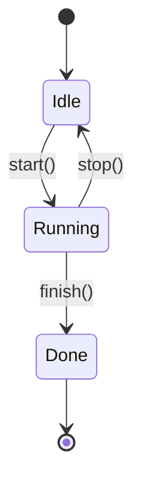
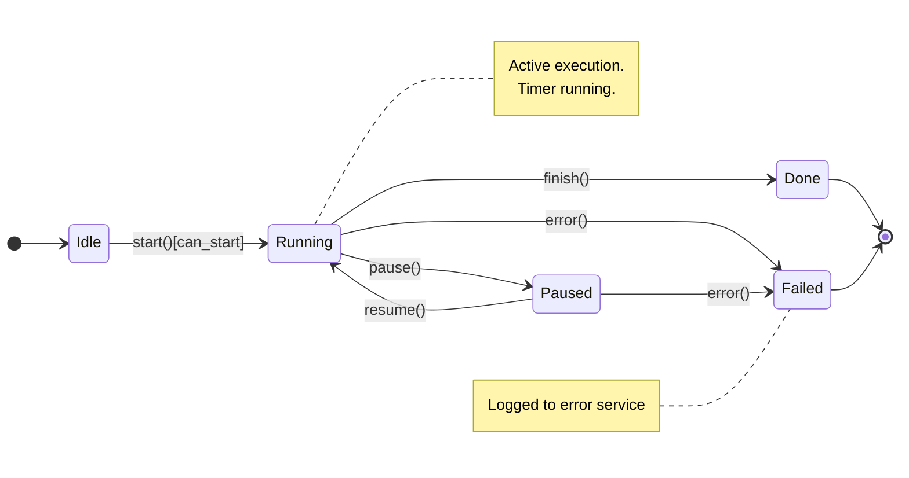
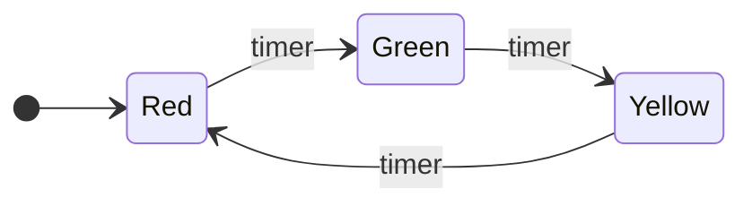
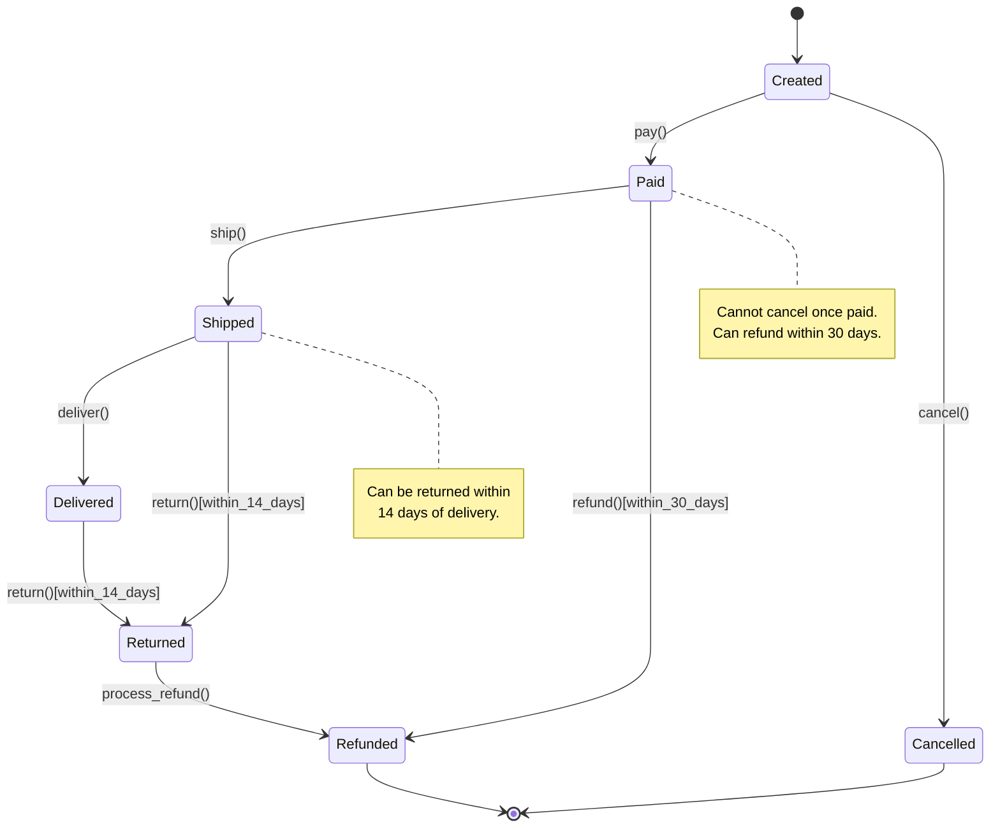
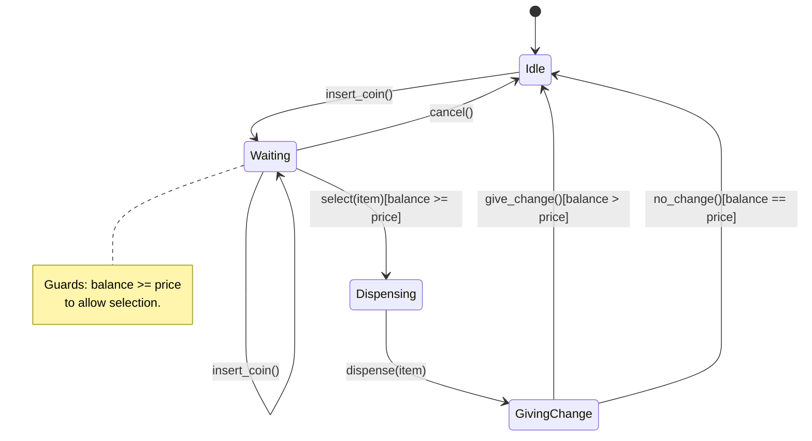
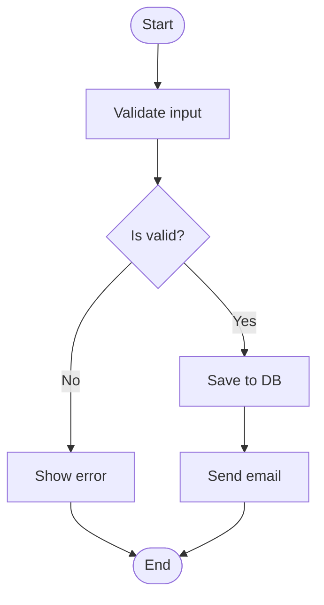
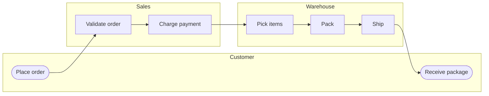
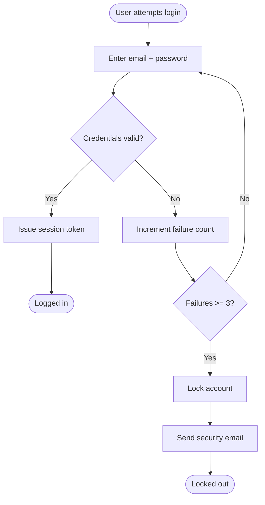

# State & Activity Diagrams — Lifecycles and Workflows

> [!quote] David Harel
> "Statecharts are a visual formalism for describing reactive systems." They turn the chaos of "what happens when" into a clear map of states and transitions.

These two diagrams answer two different questions about **behavior**:
- **State diagrams**: *"What states can this object be in, and what makes it change?"*
- **Activity diagrams**: *"What activities happen, in what order, and who does them?"*

---

## Part I — State Machine Diagrams

## 1. What Is a State Machine?

A **state machine diagram** (also called **statechart**) models the **lifecycle** of an object: the **states** it can be in, the **transitions** between them, and the **events** that trigger those transitions.

> 🏠 **Analogy**: A traffic light has three states — `RED`, `YELLOW`, `GREEN` — and a clock tick triggers transitions between them. A washing machine cycles through `IDLE → FILLING → WASHING → RINSING → SPINNING → DONE`.

State diagrams are the **best tool** for teaching:

- Object **lifecycles** (an Order goes from `Created` to `Delivered`)
- **Guard conditions** ("only transition to `Shipped` if `paid == True`")
- **Entry/exit actions** ("on entering `Cancelled`, refund the customer")
- The **State design pattern**

| Concept          | In a state diagram                  | In Python code                         |
| ---------------- | ----------------------------------- | -------------------------------------- |
| State            | Rounded rectangle                   | Enum value / class attribute            |
| Initial state    | Solid filled circle                 | Constructor sets it                     |
| Final state      | Bullseye ⊙                          | Terminal state (no outgoing transitions)|
| Transition       | Arrow with `event[guard]/action`    | Method that updates state               |
| Guard            | `[condition]` on the arrow          | `if` statement                          |

---

## 2. Mermaid `stateDiagram-v2` Syntax

Mermaid's `stateDiagram-v2` is the modern state diagram syntax. Here's the bare minimum:



### 2.1 Core Syntax Reference

| Syntax                | Meaning                                       |
| --------------------- | --------------------------------------------- |
| `[*]`                  | Initial (start) or final (end) state           |
| `StateA --> StateB`    | Transition from A to B                         |
| `A --> B : event`      | Transition triggered by `event`                |
| `A --> B : event[guard]` | Transition only if `guard` is true            |
| `A --> B : event / action()` | Transition executes `action()`           |
| `state Name { ... }`   | Composite (nested) state                       |
| `note left of A : text` | Note attached to a state                      |
| `note right of A : text` | Note on the right                            |
| `<<choice>>`           | Pseudostate: dynamic decision point            |
| `<<fork>>` `<<join>>`  | Parallel states                                |

### 2.2 Full Anatomy Example



---

## 3. Worked Example 1 — A Traffic Light

The simplest non-trivial state machine. Excellent first example for students.

### 3.1 The Diagram



### 3.2 The Python Code

```python
from enum import Enum, auto
import time


class Light(Enum):
    RED = auto()
    GREEN = auto()
    YELLOW = auto()


class TrafficLight:
    # Transition table: (current_state, event) -> next_state
    TRANSITIONS = {
        (Light.RED, "timer"): Light.GREEN,
        (Light.GREEN, "timer"): Light.YELLOW,
        (Light.YELLOW, "timer"): Light.RED,
    }

    def __init__(self) -> None:
        self.state: Light = Light.RED  # initial state

    def on_event(self, event: str) -> None:
        key = (self.state, event)
        if key in self.TRANSITIONS:
            new_state = self.TRANSITIONS[key]
            print(f"  {self.state.name} --{event}--> {new_state.name}")
            self.state = new_state
        else:
            print(f"  Ignored {event} in state {self.state.name}")

    def run(self, n: int = 6) -> None:
        for _ in range(n):
            self.on_event("timer")
            time.sleep(0.01)


tl = TrafficLight()
tl.run()
# RED --timer--> GREEN
# GREEN --timer--> YELLOW
# YELLOW --timer--> RED
# RED --timer--> GREEN
# GREEN --timer--> YELLOW
# YELLOW --timer--> RED
```

> [!tip] Two ways to implement state machines
> - **Transition table** (above): a dict of `(state, event) → next_state`. Clean, declarative, scales well.
> - **State pattern**: each state is a class with `on_event()` methods. See [[state-pattern]] and section 6 below.

---

## 4. Worked Example 2 — An Order Lifecycle

This is the **canonical example** for teaching state machines in OOP. An Order moves through several states, with rules about which transitions are legal.

### 4.1 The Diagram



### 4.2 The Python Code

```python
from datetime import date, timedelta
from enum import Enum, auto


class OrderState(Enum):
    CREATED = auto()
    PAID = auto()
    SHIPPED = auto()
    DELIVERED = auto()
    RETURNED = auto()
    REFUNDED = auto()
    CANCELLED = auto()


class IllegalTransition(Exception):
    pass


class Order:
    # Allowed transitions: state -> set of allowed next states
    ALLOWED = {
        OrderState.CREATED:  {OrderState.PAID, OrderState.CANCELLED},
        OrderState.PAID:     {OrderState.SHIPPED, OrderState.REFUNDED},
        OrderState.SHIPPED:  {OrderState.DELIVERED, OrderState.RETURNED},
        OrderState.DELIVERED:{OrderState.RETURNED},
        OrderState.RETURNED: {OrderState.REFUNDED},
        OrderState.REFUNDED: set(),
        OrderState.CANCELLED:set(),
    }

    def __init__(self, order_id: str):
        self.id = order_id
        self.state: OrderState = OrderState.CREATED
        self.paid_on: date | None = None
        self.delivered_on: date | None = None

    def _transition(self, new_state: OrderState) -> None:
        if new_state not in self.ALLOWED[self.state]:
            raise IllegalTransition(
                f"Cannot go from {self.state.name} to {new_state.name}"
            )
        print(f"  Order {self.id}: {self.state.name} -> {new_state.name}")
        self.state = new_state

    # --- Events ---
    def pay(self) -> None:
        self._transition(OrderState.PAID)
        self.paid_on = date.today()

    def cancel(self) -> None:
        self._transition(OrderState.CANCELLED)

    def ship(self) -> None:
        self._transition(OrderState.SHIPPED)

    def deliver(self) -> None:
        self._transition(OrderState.DELIVERED)
        self.delivered_on = date.today()

    def return_item(self) -> None:
        if self.delivered_on is None:
            raise IllegalTransition("Can only return after delivery")
        if date.today() > self.delivered_on + timedelta(days=14):
            raise IllegalTransition("Return window expired (14 days)")
        self._transition(OrderState.RETURNED)

    def refund(self) -> None:
        if self.paid_on is None:
            raise IllegalTransition("Cannot refund unpaid order")
        if date.today() > self.paid_on + timedelta(days=30):
            raise IllegalTransition("Refund window expired (30 days)")
        self._transition(OrderState.REFUNDED)


# --- Demo ---
order = Order("ORD-001")
order.pay()
order.ship()
order.deliver()
order.return_item()
order.refund()
print("Final state:", order.state.name)  # REFUNDED
```

> [!success] Design lesson
> Centralizing the **allowed transitions table** makes the rules **inspectable and testable**. The state diagram *is* the source of truth; the code mirrors it. When stakeholders ask *"can an order be cancelled after payment?"*, you point at the diagram — not at 500 lines of code.

---

## 5. Worked Example 3 — A Vending Machine (with Guards)

### 5.1 The Diagram



### 5.2 The Python Code (Snippet)

```python
from enum import Enum, auto


class VendingState(Enum):
    IDLE = auto()
    WAITING = auto()
    DISPENSING = auto()
    GIVING_CHANGE = auto()


class VendingMachine:
    def __init__(self):
        self.state = VendingState.IDLE
        self.balance = 0
        self.inventory = {"chips": (1.50, 5), "soda": (1.00, 3)}

    def insert_coin(self, amount: float) -> None:
        if self.state == VendingState.IDLE:
            self.state = VendingState.WAITING
        if self.state != VendingState.WAITING:
            raise RuntimeError(f"Can't accept coin in {self.state.name}")
        self.balance += amount
        print(f"  Balance: ${self.balance:.2f}")

    def select(self, item: str) -> None:
        if self.state != VendingState.WAITING:
            raise RuntimeError(f"Can't select in {self.state.name}")
        if item not in self.inventory:
            raise RuntimeError("Unknown item")
        price, qty = self.inventory[item]
        # GUARD: balance >= price
        if self.balance < price:
            raise RuntimeError(f"Need ${price:.2f}, have ${self.balance:.2f}")
        if qty == 0:
            raise RuntimeError("Out of stock")
        # Transition: Waiting -> Dispensing
        self.state = VendingState.DISPENSING
        self._dispense(item, price)

    def _dispense(self, item: str, price: float) -> None:
        print(f"  Dispensing {item}")
        self.balance -= price
        self.state = VendingState.GIVING_CHANGE
        if self.balance > 0:
            print(f"  Returning ${self.balance:.2f} change")
        self.balance = 0
        self.state = VendingState.IDLE


vm = VendingMachine()
vm.insert_coin(1.00)
vm.insert_coin(0.50)
vm.select("chips")
# Balance: $1.00
# Balance: $1.50
# Dispensing chips
# Returning $0.00 change
```

---

## 6. The State Pattern — State Machines as Objects

When a state machine grows complex (many states, state-specific data, history), refactor it into the **State design pattern**. Each state becomes a class implementing a common interface.

```python
from abc import ABC, abstractmethod


class OrderContext:
    """Holds the current state and shared data."""

    def __init__(self, order_id: str):
        self.id = order_id
        self.state: "OrderState_abc" = CreatedState(self)

    def change_state(self, new_state: "OrderState_abc") -> None:
        print(f"  Order {self.id}: {type(self.state).__name__} -> {type(new_state).__name__}")
        self.state = new_state

    # Events are delegated to the current state
    def pay(self): self.state.pay()
    def ship(self): self.state.ship()
    def cancel(self): self.state.cancel()


class OrderState_abc(ABC):
    def __init__(self, ctx: OrderContext):
        self.ctx = ctx

    @abstractmethod
    def pay(self): ...
    @abstractmethod
    def ship(self): ...
    @abstractmethod
    def cancel(self): ...


class CreatedState(OrderState_abc):
    def pay(self):
        self.ctx.change_state(PaidState(self.ctx))
    def ship(self):
        raise RuntimeError("Cannot ship unpaid order")
    def cancel(self):
        self.ctx.change_state(CancelledState(self.ctx))


class PaidState(OrderState_abc):
    def pay(self):
        raise RuntimeError("Already paid")
    def ship(self):
        self.ctx.change_state(ShippedState(self.ctx))
    def cancel(self):
        raise RuntimeError("Cannot cancel paid order — refund instead")


class ShippedState(OrderState_abc):
    def pay(self): raise RuntimeError("Already paid")
    def ship(self): raise RuntimeError("Already shipped")
    def cancel(self): raise RuntimeError("Cannot cancel shipped order")


class CancelledState(OrderState_abc):
    def pay(self): raise RuntimeError("Order cancelled")
    def ship(self): raise RuntimeError("Order cancelled")
    def cancel(self): raise RuntimeError("Already cancelled")


# Usage:
order = OrderContext("ORD-002")
order.pay()      # CreatedState -> PaidState
order.ship()     # PaidState    -> ShippedState
order.cancel()   # RuntimeError: Cannot cancel shipped order
```

> [!tip] When to switch from a transition table to the State pattern
> - **Transition table**: ≤ 5 states, simple guards. → keep it simple.
> - **State pattern**: ≥ 6 states, state-specific behavior, or state-specific data. → each state is a class.
>
> See [[state-pattern]] and [[design-patterns-behavioral]] for more.

---

## Part II — Activity Diagrams

## 7. What Is an Activity Diagram?

An **activity diagram** is essentially a **flowchart** for OO systems. It shows the **flow of control** (and optionally data) through a sequence of activities.

> 🏠 **Analogy**: An activity diagram is what you draw when explaining *"how to bake a cake"* — steps, decisions, parallel branches, and finish.

| Concept          | Symbol                          |
| ---------------- | ------------------------------- |
| Start            | Filled circle                   |
| End              | Bullseye ⊙                      |
| Activity         | Rounded rectangle               |
| Decision         | Diamond (with `[guard]` labels) |
| Fork / Join      | Bold horizontal bar (parallelism) |
| Swimlane         | Vertical partition for an actor  |
| Object / data    | Rectangle                       |
| Signal (send)    | Convex pentagon                 |
| Signal (receive) | Concave pentagon                |

> [!note] Activity vs State
> - **State diagram**: states are nouns; transitions are events. *"What state am I in?"*
> - **Activity diagram**: activities are verbs; arrows are control flow. *"What do I do next?"*

---

## 8. Mermaid for Activity Diagrams

Mermaid doesn't have a dedicated `activityDiagram` keyword — **use `flowchart`**. It works perfectly for this purpose.



### 8.1 Node shapes you'll use

| Mermaid syntax | Shape         | Use for          |
| -------------- | ------------- | ---------------- |
| `id[Text]`     | Rectangle     | Activity / step  |
| `id{Text}`     | Diamond       | Decision         |
| `id([Text])`   | Stadium/pill  | Start / End      |
| `id((Text))`   | Circle        | Connector / junction |
| `id>Text]`     | Banner (asymmetric) | Input/output signal |
| `id{{Text}}`   | Hexagon       | Preparation      |
| `id[/Text/]`   | Parallelogram | Data             |

---

## 9. Worked Example 1 — User Registration Flow

### 9.1 The Diagram

```mermaid
flowchart TD
    Start([User opens signup]) --> Form[Fill registration form]
    Form --> Submit[Click Submit]
    Submit --> Validate{Server validates}
    Validate -- Invalid --> ShowErr[Show errors]
    ShowErr --> Form
    Validate -- Valid --> DupCheck{Email already exists?}

    DupCheck -- Yes --> ErrDup[Show "email taken"]
    ErrDup --> Form
    DupCheck -- No --> Create[Create user record]

    Create --> Fork1{{ }}
    Fork1 --> SendEmail[Send verification email]
    Fork1 --> LogEvent[Log signup event]
    SendEmail --> Join1{{ }}
    LogEvent --> Join1

    Join1 --> Wait[Show "check your inbox" page]
    Wait --> Verify{User clicks verify link?}
    Verify -- Yes --> Activate[Activate account]
    Verify -- Timeout --> Remind[Send reminder]
    Remind --> Wait
    Activate --> End([Done])
```

### 9.2 The Python Code (Sketch)

```python
from datetime import datetime


def register_user(email: str, password: str) -> str:
    # Step 1: validate
    if not is_valid_email(email):
        return "error: invalid email"
    if len(password) < 8:
        return "error: password too short"

    # Step 2: check duplicate
    if user_exists(email):
        return "error: email taken"

    # Step 3: create user
    user = create_user(email, password)

    # Step 4: parallel actions (fork)
    send_verification_email(user)
    log_event("signup", user.id, datetime.now())

    # Step 5: wait for verification
    return "show_check_inbox_page"


def verify_email(token: str) -> str:
    user = validate_token(token)
    if not user:
        return "error: invalid token"
    if user.verified:
        return "already verified"
    user.verified = True
    user.save()
    return "activated"
```

> [!tip] The fork/join bar
> The `Fork1{{ }}` and `Join1{{ }}` symbols represent **parallel branches** — both `send_email` and `log_event` run, and we wait for both before continuing. In Python, this maps to `asyncio.gather()` or threads.

---

## 10. Worked Example 2 — Order Fulfillment with Swimlanes

Use subgraphs to fake swimlanes in Mermaid.



> [!note] Real swimlanes in UML
> True UML activity diagrams have **horizontal swimlanes** labelled with the responsible party. Mermaid's `subgraph` is the closest equivalent and works well in practice.

---

## 11. Worked Example 3 — Login with Retry & Lockout

### 11.1 The Diagram



### 11.2 The Python Code

```python
from dataclasses import dataclass, field


@dataclass
class User:
    email: str
    password_hash: str
    failed_attempts: int = 0
    locked: bool = False


class LoginService:
    MAX_ATTEMPTS = 3

    def __init__(self, users: dict[str, User]):
        self.users = users

    def login(self, email: str, password: str) -> str:
        user = self.users.get(email)
        if user is None:
            return "error: invalid credentials"  # don't leak existence

        if user.locked:
            return "error: account locked"

        if not self._verify(password, user.password_hash):
            user.failed_attempts += 1
            if user.failed_attempts >= self.MAX_ATTEMPTS:
                user.locked = True
                self._notify_security(user)
                return "error: account locked"
            return f"error: invalid credentials ({user.failed_attempts}/{self.MAX_ATTEMPTS})"

        # success
        user.failed_attempts = 0
        return self._issue_token(user)

    def _verify(self, password: str, hashed: str) -> bool:
        # pretend we hash and compare
        return password + "_hash" == hashed

    def _issue_token(self, user: User) -> str:
        return f"token-for-{user.email}"

    def _notify_security(self, user: User) -> None:
        print(f"  ⚠️ Sending security alert for {user.email}")


# Demo
users = {"alice@example.com": User("alice@example.com", "secret_hash")}
svc = LoginService(users)
print(svc.login("alice@example.com", "wrong"))     # 1/3
print(svc.login("alice@example.com", "wrong"))     # 2/3
print(svc.login("alice@example.com", "wrong"))     # locked
print(svc.login("alice@example.com", "secret_hash"))  # still locked
```

---

## 12. Choosing Between State and Activity Diagrams

| Question                                | Use State Diagram | Use Activity Diagram |
| --------------------------------------- | :---------------: | :------------------: |
| What states can this **one object** be in? | ✅ |  |
| What activities happen across **multiple objects**? |  | ✅ |
| Object **lifecycle** from creation to death? | ✅ |  |
| **Workflow** with branches, loops, parallel steps? |  | ✅ |
| Need to show **guards** on transitions? | ✅ | ✅ |
| Need to show **swimlanes** / responsibility? |  | ✅ |
| Modeling a **protocol** / stateful conversation? | ✅ |  |
| Modeling an **algorithm** end-to-end? |  | ✅ |

> [!success] Quick rule
> - **One object's lifecycle** → state diagram.
> - **A process across many objects** → activity diagram.

---

## 13. Common Mistakes

> [!danger] Top traps
> 1. **Mixing states and activities.** State names should be **nouns** (`Paid`, `Shipped`); activity names should be **verbs** (`Charge payment`, `Ship package`).
> 2. **Forgetting the initial state `[*]`.** Every state diagram needs exactly one entry point.
> 3. **Dead-end states without `[*]` final markers.** Mark terminal states explicitly.
> 4. **State explosion.** If you have 20+ states, decompose with **composite states** (`state A { ... }`).
> 5. **Confusing decisions with states.** A diamond is a *temporary* decision point, not a state an object rests in.

---

## 14. Key Takeaways

> [!summary] Six things to remember
> 1. **State diagrams** model an **object's lifecycle** — states, transitions, events, guards, actions.
> 2. **Activity diagrams** model a **workflow** — activities, decisions, forks, joins, swimlanes.
> 3. Use **`stateDiagram-v2`** in Mermaid for state machines; **`flowchart`** for activities.
> 4. State names are **nouns**; activity names are **verbs**.
> 5. The **State design pattern** turns a complex state machine into a polymorphic class hierarchy.
> 6. Both diagrams are **debugging aids** — when an object is in the wrong state, draw the diagram to find the missing transition guard.

---

## 15. Practice Exercises

> [!exercise] Exercise 1 — Microwave
> Draw the state diagram for a microwave: states `Idle`, `Cooking`, `Paused`, `Done`. Events: `open_door()`, `close_door()`, `press_start()`, `press_pause()`, `timer_expires()`. Implement in Python.

> [!exercise] Exercise 2 — Elevator
> Model an elevator with states `DoorsOpen`, `DoorsClosed`, `Moving`, `Idle`, `OutOfService`. Include events like `press_button(floor)`, `arrive_at(floor)`, `emergency_stop()`. Implement.

> [!exercise] Exercise 3 — Refactor to State pattern
> Take the Order example from section 4 and refactor it to use the State design pattern. Each state is its own class. Compare readability.

> [!exercise] Exercise 4 — Activity diagram for refund
> Draw an activity diagram for processing a refund request: customer initiates, agent reviews, automatic approval if < $50, else manual review, decision to approve/deny, notify customer. Implement a Python function `process_refund(request)`.

> [!exercise] Exercise 5 — Bug hunt
> A student says: *"My Order lets you cancel after shipping!"* Draw the **correct** state diagram and the **buggy** one side by side. What guard is missing?

> [!exercise] Exercise 6 — Fork/join
> Design an activity diagram for image processing where the system **parallelly** resizes, watermarks, and generates a thumbnail, then uploads all three to S3. Implement in Python with `asyncio.gather`.

> [!exercise] Exercise 7 — State machine to activity
> Take the Order state diagram and draw an **activity diagram** that shows the order fulfillment workflow across `Customer`, `Sales`, and `Warehouse` swimlanes. How do the two diagrams complement each other?

---

## 16. What's Next?

- 🧱 [[class-diagrams]] — what each stateful object looks like structurally.
- 💌 [[sequence-diagrams]] — how transitions get triggered by incoming messages.
- 📋 [[mermaid-cheatsheet]] — full syntax for `stateDiagram-v2` and `flowchart`.
- 🧬 [[state-pattern]] · [[design-patterns-behavioral]] · [[encapsulation]] — the theory these diagrams visualize.
