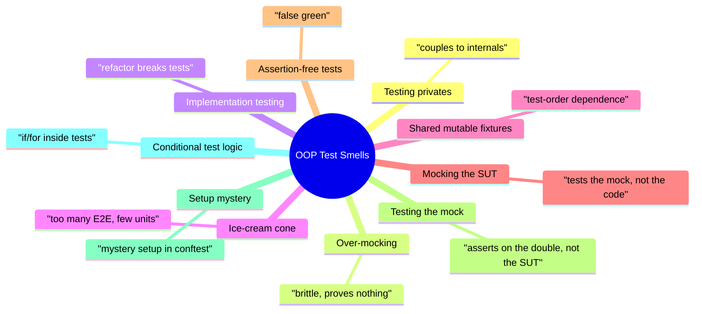
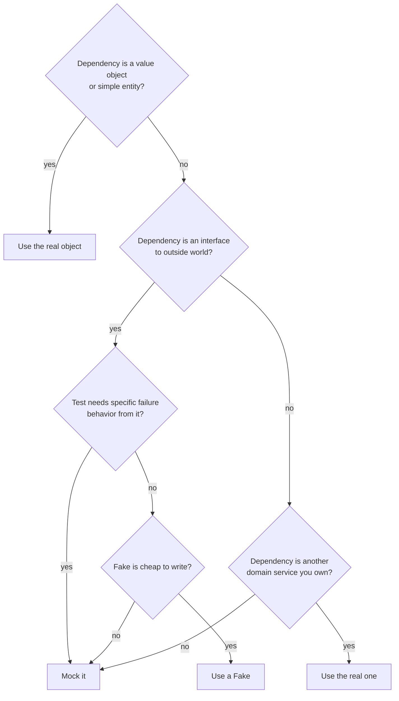
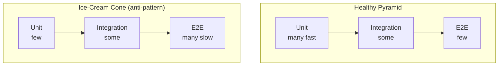
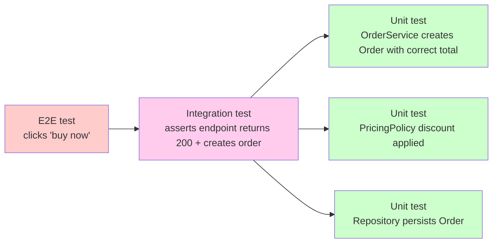
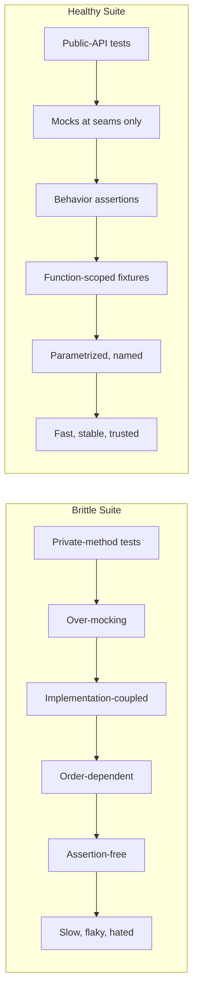

> [!note] Why this note exists
> Testing OOP code has its own failure modes. Tests can be *wrong* in ways that look superficially right: they pass, they have coverage, they have assertions — and yet they encode the implementation so tightly that any refactor breaks them, or they mock so much that they prove nothing about the real system. This note catalogs the most common OOP testing smells, with bad/good pairs and a code-review checklist you can apply tomorrow.

Related: [[testing-oop-code]], [[pytest-fixtures-for-oop]], [[exception-handling-in-oop]], [[error-handling-patterns]], [[common-pitfalls-and-anti-patterns]], [[best-practices]], [[solid-principles]], [[composition-over-inheritance]], [[what-is-oop]].

---

## 0. The catalog at a glance



Each pattern below uses the same template:
- **Name** — the smell.
- **Description** — what it looks like.
- **Bad example** — code that exhibits it.
- **Why it's bad** — the concrete harm.
- **Refactored** — the same test, fixed.

---

## 1. Testing private methods directly

### Description

A test reaches into `_private` or `__mangled` methods (or attributes) of the SUT.

### Bad

```python
# src/pricing/calc.py
class PriceCalculator:
    def calculate(self, cart: Cart) -> int:
        subtotal = self._sum(cart)
        return self._apply_discounts(subtotal, cart.user)

    def _sum(self, cart: Cart) -> int: ...
    def _apply_discounts(self, subtotal: int, user: User) -> int: ...


# tests/test_pricing.py
class TestPriceCalculator:
    def test_sum_adds_line_items(self):
        calc = PriceCalculator()
        assert calc._sum(cart_with_three_items) == 600  # ← reaching into private

    def test_apply_discounts_with_premium_user(self):
        calc = PriceCalculator()
        assert calc._apply_discounts(1000, premium_user) == 900  # ← private again
```

### Why it's bad

- **Couples tests to implementation.** If you rename `_sum` to `_subtotal`, every test breaks even though *behavior* is unchanged.
- **Locks in your refactoring strategy.** You can't split `_apply_discounts` into two helpers without rewriting tests.
- **Defeats encapsulation.** The `_` prefix is a contract: "I may change this." Testing it breaches that contract.

### Refactored

Test the **public** method. Drive private code through it.

```python
class TestPriceCalculator:
    def test_calculate_sums_line_items(self):
        calc = PriceCalculator()
        assert calc.calculate(cart_with_three_items_no_discounts) == 600

    def test_calculate_applies_premium_discount(self):
        calc = PriceCalculator()
        # Cart with known subtotal; premium user gets 10% off.
        assert calc.calculate(cart_with_1000_subtotal_and_premium_user) == 900
```

> [!tip] If a private method has complex behavior you can't reach via public methods
> That's a design smell, not a testing problem. The private method probably wants to be its own class — extract it (see [[composition-over-inheritance]] and [[solid-principles#Single Responsibility Principle SRP]]) and test that class's *public* API.

### Exception: when *testing the contract of `__dunder__` methods*

Dunder methods like `__eq__`, `__hash__`, `__repr__` are *public* by convention — they're the Python interface. Testing them is fine. The rule is about `_`-prefixed (private) members, not about magic methods. See [[magic-methods]].

---

## 2. Mocking everything (over-mocking)

### Description

Every collaborator of the SUT is replaced with a `MagicMock`, even simple value objects and trusted dependencies.

### Bad

```python
def test_order_total():
    user = MagicMock()
    user.is_premium.return_value = True
    cart = MagicMock()
    cart.items.return_value = [MagicMock(price=MagicMock(amount=1000, currency="USD"))]
    pricing = MagicMock()
    pricing.discount_for.return_value = 0.10
    repo = MagicMock()
    repo.save.return_value = None

    order = Order(user, cart, pricing, repo)
    assert order.total() == 900
```

### Why it's bad

- **Brittle.** Any refactor of `Money` or `Cart` or `LineItem` breaks the test, even if behavior is identical.
- **Tests nothing real.** Every value is a mock; the test is asserting that `Order` calls things in a particular order. It's a disguised integration test that has been stripped of all real integration.
- **Tautological.** The mocks *are* the test's expectations; if you change the expectations, the test passes regardless of `Order`'s correctness.

### Refactored

Use real value objects. Mock only at *seams* — the points where the SUT talks to the outside world.

```python
def test_order_total():
    # Real value objects — no mocking.
    user = User(tier="premium")
    cart = Cart([LineItem(Money(1000, "USD"), qty=1)])

    # Mock only the seam: pricing policy is an external collaborator.
    pricing = MagicMock(spec=PricingPolicy)
    pricing.discount_for.return_value = 0.10

    # Real in-memory fake for the repository, not a mock.
    repo = InMemoryOrderRepository()

    order = Order(user, cart, pricing, repo)
    assert order.total() == Money(900, "USD")
```

> [!tip] The Mocking Heuristic
> **Mock at the seams; use reals inside.** A "seam" is where your code talks to something you don't control: a database, an HTTP API, the system clock, a payment gateway. *Inside* your domain — value objects, entities, services you own — use the real thing.

### Decision flowchart



---

## 3. Testing implementation instead of behavior

### Description

The test asserts on *how* the SUT does its job (call order, internal state, specific method calls) rather than *what* it produces.

### Bad

```python
def test_checkout_charges_through_gateway():
    cart = Cart(items=[...])
    gateway = MagicMock(spec=PaymentGateway)
    Checkout(cart, gateway).run(customer="alice")

    # Asserts on internal call sequence — locks the implementation.
    assert gateway.open_session.call_count == 1
    assert gateway.charge.call_args_list[0].args == ("alice", Money(1200, "USD"))
    assert gateway.close_session.called
    assert gateway.charge.called_after(gateway.open_session)  # pseudo-API
```

### Why it's bad

- The *contract* of `Checkout.run` is "returns a receipt, charges the customer, clears the cart." Whether it opens a session first or last is implementation.
- Tomorrow you batch sessions for performance — the test breaks even though behavior is correct.
- The test documents *the current implementation*, not the *contract*. Reading it tells you nothing about what `Checkout` guarantees.

### Refactored

Assert on observable behavior: return value, public state, and *exactly one* mock interaction that captures the seam contract.

```python
def test_checkout_charges_correct_amount_and_returns_receipt():
    cart = Cart(items=[LineItem(Money(1200, "USD"), qty=1)])
    gateway = MagicMock(spec=PaymentGateway)
    gateway.charge.return_value = "TXN-1"

    receipt = Checkout(cart, gateway).run(customer="alice")

    assert receipt.txn_id == "TXN-1"
    assert receipt.amount == Money(1200, "USD")
    assert cart.is_empty()  # cleared after successful checkout
    gateway.charge.assert_called_once_with("alice", Money(1200, "USD"))
```

> [!example] The behavior rule
> A test should fail when behavior breaks, and pass when behavior is preserved — *regardless of internal changes*. If you refactor (rename a private method, extract a helper, reorder calls) and the test breaks, the test is over-specified.

---

## 4. The Ice-Cream Cone (too many integration, too few unit)

### Description

The test suite is shaped like an upside-down pyramid: a few unit tests, lots of integration tests, a huge mass of end-to-end tests.



### Bad

A team's test suite: 50 Selenium E2E tests, 30 integration tests, 5 unit tests. CI takes 40 minutes. A single rename breaks 12 E2E tests. Most failures are flaky UI selectors.

### Why it's bad

- **Slow CI** — minutes per run, hours to debug.
- **Flaky** — E2E tests touch databases, HTTP, real browsers; any of them can hiccup.
- **Hard to localize.** When an E2E test fails, where is the bug? Could be anywhere.
- **Expensive to write and maintain.** Each E2E test costs 5–10× a unit test.

### Refactored

Push tests *down* the pyramid. Every behavior covered by an E2E test should also be covered by a unit test on the relevant class.



> [!tip] The ratio rule of thumb
> A healthy suite has roughly **70% unit / 20% integration / 10% E2E**. If your E2E share is over 30%, you're paying too much for too little signal.

---

## 5. Shared mutable fixture state (test-order dependence)

### Description

A fixture (or worse, a global) is shared across tests and mutated by them. Tests pass alone but fail when run together — or vice versa.

### Bad

```python
# tests/conftest.py
@pytest.fixture(scope="session")
def shared_cart():
    return ShoppingCart()  # ← ONE cart for the whole session

# tests/test_cart.py
def test_add_book(shared_cart):
    shared_cart.add("book", qty=1)
    assert shared_cart.total() == Money(1200, "USD")

def test_total_is_zero_initially(shared_cart):
    # Passes alone, FAILS when run after test_add_book.
    assert shared_cart.total() == Money(0, "USD")
```

### Why it's bad

- **CI flakiness.** Tests pass locally (different order) and fail on CI (different order).
- **Debugging hell.** The failure is in `test_total_is_zero_initially`, but the *cause* is in `test_add_book`.
- **Hidden coupling.** Future developers can't reason about a test in isolation; they have to know every test that ran before.

### Refactored

Make fixtures `function`-scoped by default. Use higher scopes only for genuinely immutable or resettable resources.

```python
@pytest.fixture  # function scope (the default)
def cart():
    return ShoppingCart()  # fresh per test

def test_add_book(cart):
    cart.add("book", qty=1)
    assert cart.total() == Money(1200, "USD")

def test_total_is_zero_initially(cart):
    assert cart.total() == Money(0, "USD")
```

> [!danger] If you see "passes alone, fails on CI," suspect this immediately
> Order-dependent failures are almost always shared mutable state. Run with `pytest --pdb -p no:randomly` (or `pytest-randomly` to *detect* order dependence) to bisect.

### Detection tools

- `pytest-randomly` — randomizes test order; surfaces hidden coupling.
- `pytest --lf` — runs only last-failed; useful for narrowing which test polluted state.

---

## 6. Mocking the System Under Test

### Description

The test mocks the very class it's supposed to be testing. Often shows up as `patch.object(SUT, "_helper")` inside a test of `SUT`.

### Bad

```python
# src/orders/order.py
class Order:
    def total(self) -> Money:
        return self._apply_discount(self._subtotal())

    def _subtotal(self) -> Money: ...
    def _apply_discount(self, sub: Money) -> Money: ...


# tests/test_order.py
@patch.object(Order, "_subtotal")
@patch.object(Order, "_apply_discount")
def test_total_combines_subtotal_and_discount(mock_apply, mock_sub):
    mock_sub.return_value = Money(1000, "USD")
    mock_apply.return_value = Money(900, "USD")

    order = Order(...)
    assert order.total() == Money(900, "USD")
```

### Why it's bad

- **The test verifies nothing.** You mocked both halves of `total`. The test passes if `total` does *anything at all* that happens to call `_apply_discount(_subtotal())` — or even just returns `Money(900)` directly.
- **Locks in a particular decomposition.** If you inline `_subtotal` into `total`, the test breaks.
- **Tests the mock, not the code.** The mocks *are* the behavior; `Order.total` is reduced to glue.

### Refactored

Don't mock the SUT. Set up *inputs* (real ones, or stubs of collaborators) and assert on *outputs*.

```python
def test_total_applies_discount_to_subtotal():
    order = Order(items=[LineItem(Money(1000, "USD"), qty=1)], discount=PercentageDiscount(10))
    assert order.total() == Money(900, "USD")
```

> [!danger] If you find yourself wanting to patch the SUT
> Stop. Either (a) the SUT is too big and should be split (see [[solid-principles#Single Responsibility Principle SRP]]), or (b) you're trying to test implementation, not behavior. Both are design smells, not testing problems.

---

## 7. Assertion-free tests

### Description

A test that exercises the SUT but never asserts anything. Sometimes called a "smoke test" to justify its existence.

### Bad

```python
def test_checkout_runs_without_error():
    cart = Cart(items=[LineItem(Money(1000, "USD"), qty=1)])
    gateway = MagicMock(spec=PaymentGateway)
    Checkout(cart, gateway).run(customer="alice")
    # No assertions.
```

### Why it's bad

- **False green.** The test passes even if `Checkout.run` returns the wrong receipt, charges the wrong amount, or doesn't charge at all — as long as it doesn't raise.
- **Encourages coverage theater.** Line coverage goes up; correctness knowledge does not.
- **Misleads future maintainers.** A reader assumes the test *checks* something. They won't add an assertion; they'll trust the green.

### Refactored

Assert *something*. Even a single meaningful assertion is infinitely better than none.

```python
def test_checkout_charges_correct_amount():
    cart = Cart(items=[LineItem(Money(1000, "USD"), qty=1)])
    gateway = MagicMock(spec=PaymentGateway)
    gateway.charge.return_value = "TXN-1"

    receipt = Checkout(cart, gateway).run(customer="alice")

    assert receipt.txn_id == "TXN-1"
    assert receipt.amount == Money(1000, "USD")
    gateway.charge.assert_called_once_with("alice", Money(1000, "USD"))
```

> [!tip] Lint for assertion-free tests
> `flake8` plugins like `flake8-assertive` or `pytest-assert-utils` can warn when a test function contains no assertions. Add this to your pre-commit hooks.

### The "side-effect only" exception

If the SUT has *no* return value and *no* observable state — only side effects on a collaborator — then asserting on the collaborator *is* the assertion. That's still a real assertion (`mock.foo.assert_called_once_with(...)`). It's only *assertion-free* if there's literally no `assert` and no `assert_called_*`.

---

## 8. Testing the mock instead of the real object

### Description

A test that asserts so thoroughly on the mock that it's really verifying the mock's setup, not the SUT's behavior.

### Bad

```python
def test_send_email():
    mailer = MagicMock()
    mailer.send.return_value = True
    mailer.send.status = "queued"

    # ...the SUT might not even call mailer at all...
    service = NotificationService(mailer)
    service.notify("alice")

    # 12 assertions on the mock, none on what was actually sent.
    assert mailer.send.called
    assert mailer.send.call_count == 1
    assert mailer.send.call_args[0][0] == "alice"
    assert mailer.send.call_args[1]["priority"] == "high"
    assert mailer.send.return_value == True
    assert mailer.send.status == "queued"
    # ... and 6 more ...
```

### Why it's bad

- Most of those assertions verify *the setup you just wrote*, not the SUT. `assert mailer.send.return_value == True` is asserting that you set `.return_value = True` correctly. That's a tautology.
- The test's signal-to-noise ratio is terrible. A reader can't tell what the SUT is supposed to *do*.
- Changes to the SUT that *should* break the test (e.g. it now calls `send` twice instead of once) get lost in the noise of irrelevant assertions.

### Refactored

Assert on the **essential interaction** — usually one or two `assert_called_*` calls — and on the **observable outcome**.

```python
def test_notify_sends_one_email_with_correct_payload():
    mailer = MagicMock(spec=Mailer)
    service = NotificationService(mailer)

    service.notify("alice", message="hello")

    # One essential interaction assertion.
    mailer.send.assert_called_once_with(
        to="alice",
        body="hello",
        priority="high",
    )
```

> [!example] The mock-assertion rule
> **One `assert_called_*` per seam, per test.** If you need to verify more interactions, write more tests — each focused on one behavior. A test with five `assert_called_*` is five tests disguised as one.

---

## 9. Excessive setup ("setup mystery")

### Description

A test begins with 30+ lines of setup, often hidden away in `conftest.py`, that the reader has to chase down to understand what the test is even about.

### Bad

```python
# tests/conftest.py
@pytest.fixture
def env(db_session, redis_client, s3_client, mock_stripe, frozen_clock, sample_user, premium_tier, catalog_with_3_items, ...):
    # 30 lines of orchestration
    ...

# tests/test_checkout.py
def test_checkout_returns_receipt(env):
    # 0 lines of setup visible here
    result = env.checkout.run(env.customer)
    assert result.txn_id == env.txn_id
```

### Why it's bad

- **Reader can't tell what the test is about.** The *test name* says one thing; the fixtures hide the actual arrangement.
- **Setup is shared and mutated.** When 12 tests use `env`, changing `env` breaks all of them in different ways.
- **Tests are coupled.** Fixing one test's setup requires understanding the fixture graph.

### Refactored

Two complementary moves:

1. **Make setup explicit and local** when it's specific to one test.
2. **Use builders/factories** to compose setup inline, so each test reads top-to-bottom.

```python
def test_checkout_returns_receipt(make_cart, make_user, fake_gateway):
    # Setup is right here — readable, scoped, obvious.
    cart = make_cart(items=[LineItem(Money(1200, "USD"), qty=1)])
    user = make_user(tier="standard")
    gateway = fake_gateway(returns="TXN-1")

    receipt = Checkout(cart, gateway).run(customer=user.id)

    assert receipt.txn_id == "TXN-1"
    assert receipt.amount == Money(1200, "USD")
```

> [!tip] The "Three-Line Test" heuristic
> A reader should be able to understand a test in three lines: **arrange, act, assert**. If your arrange is 30 lines hidden in a fixture, you've lost. Either inline it or extract a clearly-named factory the reader can grep.

---

## 10. Conditional test logic

### Description

`if`, `for`, `try`/`except`, or `match` statements inside a test, controlling what's *actually tested* at runtime.

### Bad

```python
def test_service_handles_users():
    for user in [alice, bob, carol]:
        try:
            result = service.handle(user)
        except Exception:
            continue  # ← swallows failures
        if user.is_premium:
            assert result.discount > 0
        else:
            assert result.discount == 0
```

### Why it's bad

- **Hides test cases.** A failure on `bob` is silently skipped. You think you tested three users; you tested one.
- **Branches make debugging hard.** Which path ran? Which assertion fired?
- **`pytest` already has `parametrize`** — the conditional logic is reinventing it badly.

### Refactored

Use `parametrize`. One test case per parameter tuple. Each runs as a separate, named, independently-runnable test.

```python
@pytest.mark.parametrize("user, expected_discount_positive", [
    (alice, True),    # premium
    (bob, False),     # standard
    (carol, True),    # premium
], ids=lambda u: u.name)
def test_service_discount_by_user(user, expected_discount_positive):
    result = service.handle(user)  # raises if anything fails — no swallow
    if expected_discount_positive:
        assert result.discount > 0
    else:
        assert result.discount == 0
```

Now:
- `bob` failing shows up as `test_service_discount_by_user[bob]` failed — obvious, isolated.
- No `try/except/continue` swallowing.
- The conditional *inside* the test is gone (replaced by `parametrize`'s data).

> [!danger] `try/except` inside a test is almost always wrong
> If you're catching inside a test, you're either swallowing a real bug or reinventing `pytest.raises`. Both are smells.

---

## 11. Bonus: a few more smells worth knowing

> [!note] Quick reference
> - **`time.sleep` in tests** — flaky by design. Freeze the clock with a fixture (see [[pytest-fixtures-for-oop#3. conftest.py the composition root of your tests]]).
> - **Tests named `test_1`, `test_2`, `test_main`** — names should describe behavior: `test_total_applies_bulk_discount_over_10_items`.
> - **`assert True`** — placeholder that was never replaced. CI goes green; nothing is verified.
> - **`@pytest.mark.skip` without a reason** — tech debt accumulating silently. Always include `reason="..."`.
> - **Commented-out tests** — delete them; that's what version control is for.
> - **Tests that depend on `datetime.now()`** — flaky. Use an injected clock.

---

## 12. Testing code-review checklist

Use this when reviewing a PR that adds or changes tests. Each item is a question; "no" is a smell.

### Setup
- [ ] Is the test's setup **readable inline or via a clearly-named fixture**?
- [ ] Are fixtures **function-scoped by default**? Higher scopes justified?
- [ ] No **shared mutable state** across tests?
- [ ] No **`autouse`** without justification?

### Doubles
- [ ] Mocks use **`spec=`**?
- [ ] Mocks are only at **seams** (external collaborators), not at value objects or other domain classes?
- [ ] The **SUT is not mocked**?
- [ ] Each test has **at most one or two `assert_called_*`** assertions per seam?

### Assertions
- [ ] Every test has **at least one assertion** (or `pytest.raises`)?
- [ ] Assertions are on **observable behavior**, not internal call sequence?
- [ ] No `assert True`, no commented-out assertions?

### Scope
- [ ] Test name describes the **behavior under test** (not "test_1")?
- [ ] Test focuses on **one behavior**? Long `if/for` chains refactored into `parametrize`?
- [ ] No `try/except` swallowing failures inside the test?

### Coverage
- [ ] Test exercises the **public API**, not private methods?
- [ ] Failure modes (exceptions, empty inputs, edge cases) covered?
- [ ] The test would **pass after a refactor** that preserves behavior?

### Maintenance
- [ ] No `time.sleep` (use a frozen clock)?
- [ ] No `@pytest.mark.skip` without a `reason`?
- [ ] No commented-out tests (use git)?
- [ ] Test is **deterministic** — runs the same on every machine, every order?

> [!example] Print this checklist
> Pin it next to your monitor. Run through it on every PR that touches tests. After three weeks, the smells stop appearing in your code.

---

## 13. The before/after picture



The transformation isn't about adding more tests — it's about replacing low-signal tests with high-signal ones. The healthy suite is often **smaller** and runs **faster**, while covering behavior more thoroughly.

---

## Key Takeaways

1. **Test the public API; let private helpers be exercised indirectly.** If a private method needs direct tests, it wants to be its own class.
2. **Mock at the seams; use reals inside.** Value objects should never be mocked.
3. **Assert on behavior, not implementation.** A test should pass under any refactor that preserves behavior.
4. **Pyramid, not ice-cream cone.** 70/20/10 unit/integration/E2E. Push tests down.
5. **No shared mutable fixtures.** Function-scoped by default; widen with deliberate reason.
6. **Never mock the SUT.** If you're tempted, the SUT is too big.
7. **Every test has an assertion.** No assertion = false green.
8. **One `assert_called_*` per seam per test.** Don't test the mock; test the SUT's interaction with it.
9. **Setup must be readable.** Inline or factory; no setup mystery.
10. **`parametrize`, don't loop.** No `if/for/try` inside tests.

---

## Practice Exercises

> [!example] Exercise 1 — Spot the smell
> Below are three test snippets. For each, name the smell and refactor.
> ```python
> # A
> def test_order():
>     o = Order()
>     o._compute_total()  # ?
>     assert o._cached_total == 100
>
> # B
> def test_service():
>     user = MagicMock(); cart = MagicMock(); price = MagicMock()
>     cart.items.return_value = [price]
>     price.amount.return_value = 100
>     Service(user, cart).run()
>
> # C
> def test_repo():
>     repo = RealRepo()
>     repo.add(User("alice"))
>     # no assertion
> ```

> [!example] Exercise 2 — De-mock
> Take this over-mocked test and rewrite it with real value objects and a single seam mock. Identify which mocks were unnecessary.
> ```python
> def test_invoice_total():
>     customer = MagicMock(); customer.is_vip.return_value = True
>     line = MagicMock(); line.qty = 2; line.unit_price = MagicMock(amount=50, currency="USD")
>     invoice = MagicMock(); invoice.lines = [line]
>     tax = MagicMock(); tax.rate_for.return_value = 0.10
>     result = InvoiceService(customer, tax).total(invoice)
>     assert result == 110
> ```

> [!example] Exercise 3 — Order-dependence debugging
> You're given a suite where `test_B` passes alone but fails when `test_A` runs first. Describe your debugging steps using `pytest-randomly`, `pytest --lf`, and `pytest --setup-show`. Identify the most likely root cause and the fix.

> [!example] Exercise 4 — Convert loops to parametrize
> Refactor this test using `@pytest.mark.parametrize`. Each case should be a separately named, individually-runnable test:
> ```python
> def test_shapes_have_positive_area():
>     for s in [Circle(1), Square(2), Triangle(2, 3)]:
>         try:
>             assert s.area() > 0
>         except Exception:
>             pass
> ```

> [!example] Exercise 5 — Apply the code-review checklist
> Review your last 5 merged PRs against the checklist in §12. List which items you would have caught. For each, write the one-line fix.

> [!example] Exercise 6 — Refactor a brittle test
> Find a test in your codebase that breaks whenever you refactor (even when behavior is unchanged). Apply the rules from this note to make it behavior-focused. Run the test, then make a refactor the old test would have caught — confirm the new test still passes.

> [!example] Exercise 7 — Write the "missing" test
> Take an assertion-free or smoke-style test from your suite. Identify what the test *should* be checking, and add the assertions. Discuss whether the missing assertions hid a real bug (they often do).

That completes the **07-testing-and-errors** section. Cross-link this note from [[best-practices]] and [[common-pitfalls-and-anti-patterns]] for a unified "production-quality OOP in Python" reading path.
