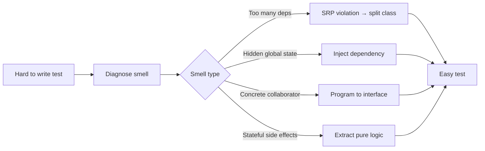
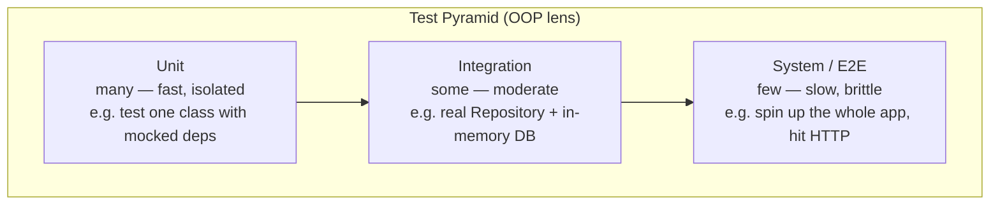
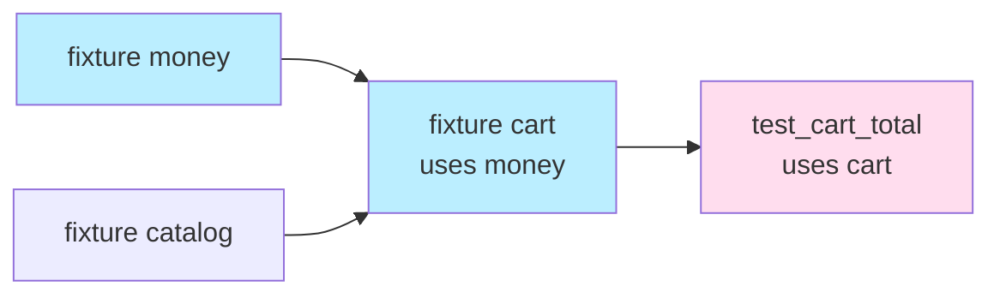
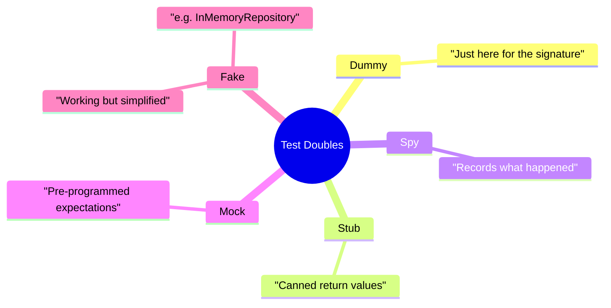
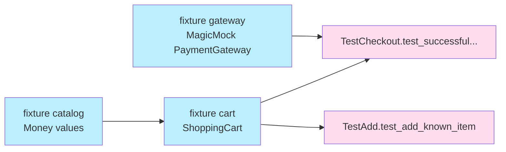
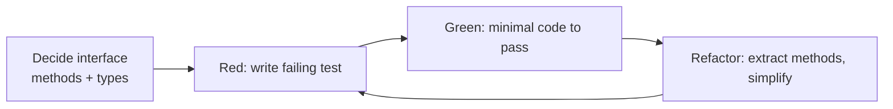

> [!note] Why this note exists
> Testing OOP code is not the same as testing functions. Classes bundle state with behavior, hierarchies inherit contracts, and polymorphism means the *same call site* can hit many implementations. This note teaches the mental models and pytest techniques that turn "testable-by-design" OOP into a reliable, fast, and meaningful test suite.

Related: [[pytest-fixtures-for-oop]], [[exception-handling-in-oop]], [[error-handling-patterns]], [[solid-principles]], [[composition-over-inheritance]], [[magic-methods]], [[best-practices]], [[common-pitfalls-and-anti-patterns]], [[what-is-oop]].

---

## 1. Why OOP code is testable by design

Well-designed OOP code is *naturally* testable. That is not a coincidence — the same qualities that make a class easy to reason about also make it easy to put under test. The connection is worth stating explicitly because it motivates everything else in this note.

| OOP design quality | Why it helps testing |
|---|---|
| **Single Responsibility** (see [[solid-principles#Single Responsibility Principle SRP]]) | A class with one job has one thing to test. Few moving parts = fewer test cases. |
| **Dependency Injection** | Collaborators are passed in, so a test can pass in fakes. No global state to reset. |
| **Programming to interfaces** (abstract base classes / Protocols) | Tests can swap implementations without rewriting the SUT. |
| **Encapsulation** | The class publishes a small public surface; tests target that surface and stay robust against refactors. |
| **Polymorphism** | The same test suite can be re-pointed at every subtype of a hierarchy (parametrized tests). |
| **Immutability** | Immutable objects have no hidden state to mutate between tests; no test-ordering bugs. |

> [!tip] If a class is hard to test, the design is usually wrong
> The classic joke among TDD practitioners: *"If you think testing is hard, your code is telling you something."* Tests are a design pressure gauge. Brittle, slow, or mock-heavy tests usually point to a SRP violation or a missing interface.

### The "design feedback loop"



---

## 2. The test pyramid for OOP

The test pyramid (Mike Cohn) prescribes a large base of fast **unit** tests, a smaller middle layer of **integration** tests, and a tiny top of **end-to-end / system** tests.



> [!warning] The "ice-cream cone" anti-pattern
> A team that writes mostly E2E tests and few unit tests has an *ice-cream cone*: a thin base of slow, brittle, hard-to-debug tests on top. See [[testing-anti-patterns#The Ice-Cream Cone]].

### What counts as a "unit" for a class?

A *unit* is a single class exercised in isolation, with its **direct collaborators replaced by test doubles**. The key word is *direct* — a unit test for `Order` may fake `PaymentGateway` but should **not** fake `Money` (a value object). Faking value objects is one of the most common over-mocking mistakes.

---

## 3. pytest fundamentals for OOP

pytest works with plain `assert` and plain functions, which fits OOP testing beautifully: you instantiate an object, call a method, and assert on the result.

### 3.1 Plain function tests — the simplest shape

```python
# src/account.py
from __future__ import annotations
from dataclasses import dataclass

@dataclass(frozen=True)
class Money:
    amount: int
    currency: str

    def add(self, other: "Money") -> "Money":
        if self.currency != other.currency:
            raise ValueError(f"currency mismatch: {self.currency} vs {other.currency}")
        return Money(self.amount + other.amount, self.currency)


# tests/test_account.py
from src.account import Money

def test_add_same_currency():
    assert Money(3, "USD").add(Money(4, "USD")) == Money(7, "USD")

def test_add_mismatched_currency_raises():
    import pytest
    with pytest.raises(ValueError, match="currency mismatch"):
        Money(3, "USD").add(Money(4, "EUR"))
```

### 3.2 Test *classes* for grouping related tests

pytest supports (lightly) grouping tests inside a class. This is purely organizational — pytest does **not** instantiate your class. Use it to keep related tests tidy.

```python
class TestMoneyAdd:
    def test_same_currency(self):
        assert Money(3, "USD").add(Money(4, "USD")) == Money(7, "USD")

    def test_zero_is_identity(self):
        m = Money(5, "USD")
        assert m.add(Money(0, "USD")) == m

    def test_mismatched_currency_raises(self):
        import pytest
        with pytest.raises(ValueError):
            Money(3, "USD").add(Money(4, "EUR"))
```

> [!warning] Do not confuse test classes with production classes
> `class TestMoneyAdd` is *pytest's* grouping sugar — it has no `__init__`, no inheritance, and pytest does not construct it. Do not put state in `self` between tests; that leads to order-dependent failures (see [[testing-anti-patterns#Shared mutable fixture state]]).

### 3.3 `parametrize` — one test, many cases

`parametrize` shines for OOP because polymorphic hierarchies share a contract: one parametrized test can iterate over every subtype.

```python
import pytest
from src.shapes import Shape, Circle, Square, Triangle

@pytest.mark.parametrize("shape, expected_area", [
    (Circle(1), 3.14159),
    (Square(2), 4.0),
    (Triangle(base=2, height=3), 3.0),
])
def test_area_contract(shape: Shape, expected_area: float):
    assert pytest.approx(shape.area(), rel=1e-3) == expected_area
```

This single test guarantees that *every* `Shape` honors the `.area()` contract — exactly the polymorphism guarantee you want from your hierarchy.

---

## 4. Fixtures as dependency injection

> [!tip] The single most important idea in this note
> **pytest fixtures ARE dependency injection.** When a test function declares `cart` as a parameter, pytest resolves that name to a fixture function and *injects* the result. This is the same DI principle from [[solid-principles#Dependency Inversion Principle DIP]] applied to your tests.



```python
import pytest
from src.cart import ShoppingCart, LineItem
from src.account import Money

@pytest.fixture
def catalog() -> dict[str, Money]:
    return {
        "book":  Money(1200, "USD"),  # $12.00 (cents to avoid floats)
        "pen":   Money(150, "USD"),
        "lamp":  Money(3400, "USD"),
    }

@pytest.fixture
def cart(catalog) -> ShoppingCart:
    return ShoppingCart(catalog=catalog)

def test_empty_cart_total_is_zero(cart: ShoppingCart):
    assert cart.total() == Money(0, "USD")

def test_adding_known_item(cart: ShoppingCart):
    cart.add("book", qty=2)
    assert cart.total() == Money(2400, "USD")

def test_adding_unknown_item_raises(cart: ShoppingCart):
    import pytest
    with pytest.raises(KeyError):
        cart.add("nonexistent")
```

The test *asks for* a `cart`; it never builds one directly. When the constructor changes (extra kwargs, different dependencies), only the fixture needs to change — every test using it is automatically updated.

---

## 5. Testing class hierarchies

### 5.1 The base contract test

For a polymorphic hierarchy, the *contract* lives on the base class. Write one set of tests that exercises the contract generically, parametrized over every subtype.

```python
# src/shapes.py
from __future__ import annotations
from abc import ABC, abstractmethod
import math

class Shape(ABC):
    @abstractmethod
    def area(self) -> float: ...
    @abstractmethod
    def perimeter(self) -> float: ...
    def describe(self) -> str:
        return f"{type(self).__name__}: area={self.area():.2f}, perimeter={self.perimeter():.2f}"


class Circle(Shape):
    def __init__(self, radius: float) -> None:
        if radius < 0:
            raise ValueError("radius must be non-negative")
        self._r = radius
    def area(self) -> float: return math.pi * self._r ** 2
    def perimeter(self) -> float: return 2 * math.pi * self._r


class Square(Shape):
    def __init__(self, side: float) -> None:
        if side < 0:
            raise ValueError("side must be non-negative")
        self._s = side
    def area(self) -> float: return self._s ** 2
    def perimeter(self) -> float: return 4 * self._s
```

```python
# tests/test_shapes_contract.py
import pytest
from src.shapes import Shape, Circle, Square

ALL_SHAPES: list[Shape] = [
    Circle(1),
    Square(2),
]

@pytest.mark.parametrize("shape", ALL_SHAPES, ids=lambda s: type(s).__name__)
class TestShapeContract:
    def test_area_is_positive(self, shape: Shape):
        assert shape.area() > 0

    def test_perimeter_is_positive(self, shape: Shape):
        assert shape.perimeter() > 0

    def test_describe_mentions_class_name(self, shape: Shape):
        assert type(shape).__name__ in shape.describe()
```

The `class`-level `parametrize` applies every test method to every shape. Add a new subtype → add it to `ALL_SHAPES` → all contract tests run automatically. **This is how you encode the L in SOLID inside your test suite.**

### 5.2 Per-subclass tests

Contract tests verify the shared interface; **subclass tests** verify the specific behavior of one implementation.

```python
import math
import pytest
from src.shapes import Circle, Square

class TestCircleSpecifics:
    def test_unit_circle_area(self):
        assert Circle(1).area() == pytest.approx(math.pi)

    def test_negative_radius_rejected(self):
        with pytest.raises(ValueError):
            Circle(-1)

class TestSquareSpecifics:
    def test_side_zero_is_allowed_and_has_zero_area(self):
        s = Square(0)
        assert s.area() == 0
```

> [!example] Mental rule
> **Contract tests** = "every Shape behaves like a Shape." **Subclass tests** = "a Circle behaves like a Circle."

---

## 6. Testing abstract classes

You cannot instantiate an `ABC` directly. Three patterns:

### Pattern A — Test a concrete subclass

The simplest: pick a representative subclass and test the abstract behavior through it. Good when the base class only declares the contract (no shared logic).

```python
from src.shapes import Shape, Circle

def test_area_is_abstract():
    assert Shape.area.__isabstractmethod__  # contract is declared abstract
```

### Pattern B — A "concrete test double" subclass

When the base class contains shared logic (Template Method pattern), create a *minimal* concrete subclass in the test module to exercise that shared logic in isolation.

```python
# src/processors.py
from abc import ABC, abstractmethod

class DataProcessor(ABC):
    """Template Method: run() orchestrates parse → transform → output."""
    def run(self, raw: str) -> str:
        parsed = self.parse(raw)
        transformed = self.transform(parsed)
        return self.output(transformed)

    @abstractmethod
    def parse(self, raw: str) -> list[str]: ...
    @abstractmethod
    def transform(self, parsed: list[str]) -> list[str]: ...
    @abstractmethod
    def output(self, transformed: list[str]) -> str: ...
```

```python
# tests/test_data_processor.py
from src.processors import DataProcessor

class _SpyProcessor(DataProcessor):
    """Minimal concrete subclass that records calls."""
    def __init__(self) -> None:
        self.calls: list[tuple[str, object]] = []
    def parse(self, raw: str) -> list[str]:
        self.calls.append(("parse", raw)); return raw.split(",")
    def transform(self, parsed: list[str]) -> list[str]:
        self.calls.append(("transform", parsed)); return [p.upper() for p in parsed]
    def output(self, transformed: list[str]) -> str:
        self.calls.append(("output", transformed)); return "|".join(transformed)

def test_template_method_orchestration_order():
    p = _SpyProcessor()
    result = p.run("a,b,c")
    assert result == "A|B|C"
    assert [name for name, _ in p.calls] == ["parse", "transform", "output"]
```

> [!tip] The spy subclass tests the *base class's* orchestration
> `_SpyProcessor` exists only in the test file. It exercises the base class's `run()` template method without coupling to any production subclass.

### Pattern C — Test shared logic via the Liskov substitution path

If shared logic lives in non-abstract methods on the base, you can also test it through every real subclass (Pattern A scaled up). The choice depends on whether you want to test the shared logic in isolation (B) or as integrated with subclasses (A).

---

## 7. Test doubles taxonomy

The vocabulary (from Gerard Meszaros's *xUnit Test Patterns*) matters because each kind of double has a different job. Misnaming leads to misuse — and to [[testing-anti-patterns#Mocking everything]].

| Double | Purpose | Returns canned data? | Records calls? | Real logic? |
|---|---|---|---|---|
| **Dummy** | Filled in for parameter lists; never used. | — | — | — |
| **Stub** | Returns canned answers. | ✓ | — | — |
| **Spy** | Records calls so the test can assert on them. | (optional) | ✓ | — |
| **Mock** | Pre-programmed with expectations; fails the test if expectations aren't met. | (optional) | ✓ | — |
| **Fake** | A working but simplified implementation (e.g. in-memory DB). | (real) | — | ✓ |



### 7.1 Dummy

```python
from src.audit import AuditLogger

def test_checkout_does_not_crash_without_audit():
    # Dummy: passed in but never called by this code path.
    checkout = Checkout(audit=AuditLogger())
    receipt = checkout.run(order=Order(total=Money(10, "USD")))
    assert receipt.amount == Money(10, "USD")
```

### 7.2 Stub

```python
from unittest.mock import MagicMock
from src.weather import WeatherService, WeatherReporter

def test_reporter_says_rainy_when_service_returns_rain():
    service = MagicMock(spec=WeatherService)
    service.current_condition.return_value = "RAIN"  # STUB behavior
    reporter = WeatherReporter(service)
    assert reporter.headline() == "Bring an umbrella ☔"
```

### 7.3 Spy

```python
from unittest.mock import MagicMock
from src.notifier import Notifier, WelcomeFlow

def test_welcome_flow_calls_send_email_once():
    notifier = MagicMock(spec=Notifier)
    WelcomeFlow(notifier).run(user="alice")
    notifier.send_email.assert_called_once_with("alice", "Welcome!")

    # Spy: inspect the calls list too.
    assert len(notifier.send_email.call_args_list) == 1
```

### 7.4 Mock (with expectations)

```python
from unittest.mock import MagicMock
from src.pricing import PriceService, Checkout

def test_checkout_applies_discount_then_charges_full():
    pricing = MagicMock(spec=PriceService)
    pricing.discount_for.return_value = 0.10
    pricing.charge = MagicMock()

    Checkout(pricing).run(cart_total=100)

    pricing.discount_for.assert_called_once()
    pricing.charge.assert_called_once_with(90)  # 100 − 10%
```

### 7.5 Fake — a real, but simplified, implementation

```python
# tests/fakes.py
from src.repository import Repository, User

class InMemoryUserRepository(Repository[User]):
    """Fake: implements the Repository contract with a dict."""
    def __init__(self) -> None:
        self._store: dict[str, User] = {}
    def add(self, entity: User) -> None:
        self._store[entity.id] = entity
    def get(self, id: str) -> User | None:
        return self._store.get(id)
    def delete(self, id: str) -> None:
        self._store.pop(id, None)
```

> [!tip] Prefer fakes over mocks for repositories
> A `Fake` is a *real implementation* of the interface, so your tests exercise real logic instead of stubbed call sequences. This tends to be much less brittle. See [[testing-anti-patterns#Testing the mock instead of the real object]].

---

## 8. `unittest.mock` essentials

Python's stdlib ships `unittest.mock`. The four tools you must know:

### 8.1 `MagicMock`

A `MagicMock` supports magic methods (`__len__`, `__iter__`, `__getitem__`, ...) out of the box.

```python
from unittest.mock import MagicMock

m = MagicMock()
m.foo.return_value = 42
m.__len__.return_value = 3

assert m.foo() == 42
assert len(m) == 3
```

### 8.2 `patch` — replace an attribute for the duration of a test

`patch` swaps an object (class, function, attribute) for a mock and restores it on exit. The **golden rule**: patch where the name is *looked up*, not where it is defined.

```python
# src/clock.py
from datetime import datetime
class Clock:
    def now(self) -> datetime:
        return datetime.now()

# src/greeter.py
from src.clock import Clock  # imported name lives in src.greeter namespace
class Greeter:
    def greet(self) -> str:
        hour = Clock().now().hour
        return "Good morning" if hour < 12 else "Good evening"
```

```python
# tests/test_greeter.py
from unittest.mock import patch, MagicMock
from src.greeter import Greeter

@patch("src.greeter.Clock")  # ← patch the name *as greeter sees it*
def test_morning_greeting(MockClock):
    fake_instance = MagicMock()
    fake_instance.now.return_value.hour = 8
    MockClock.return_value = fake_instance

    assert Greeter().greet() == "Good morning"
```

> [!warning] The #1 `patch` pitfall
> Patching `src.clock.Clock` will silently do nothing for `Greeter` because `Greeter` has already imported the `Clock` name into its own module namespace. Always patch the name as it is resolved at the call site: `src.greeter.Clock`.

### 8.3 `spec=` for type-safe mocks

`spec=SomeClass` restricts the mock to only the attributes/methods of `SomeClass`. Typos like `mock.sned_email(...)` raise `AttributeError` instead of silently passing.

```python
from unittest.mock import MagicMock
from src.notifier import Notifier

m = MagicMock(spec=Notifier)
m.sned_email("alice")  # AttributeError: Mock has no attribute 'sned_email'
```

> [!tip] Always pass `spec=`
> A `spec=` costs nothing and catches entire classes of bugs. Make it a habit.

### 8.4 `PropertyMock` for `@property`

To mock a property, you must put a `PropertyMock` on the *class*, not the instance.

```python
from unittest.mock import patch, PropertyMock
from src.account import Account

with patch.object(Account, "balance", new_callable=PropertyMock) as mock_balance:
    mock_balance.return_value = 1000
    a = Account()
    assert a.balance == 1000
```

---

## 9. Testing special methods

### 9.1 `@property`

Test both the happy path and that mutations behave correctly (read-only properties should `AttributeError` on assignment).

```python
import pytest
from src.account import Account

def test_balance_property_returns_initial_value():
    acc = Account(initial=100)
    assert acc.balance == 100

def test_balance_is_read_only():
    acc = Account(initial=100)
    with pytest.raises(AttributeError):
        acc.balance = 999  # type: ignore[misc]
```

### 9.2 `__eq__` and `__hash__` consistency

Python's contract: **if `a == b` then `hash(a) == hash(b)`**. Test it explicitly. Also test **reflexivity**, **symmetry**, and **transitivity**.

```python
from src.account import Money

class TestMoneyEquality:
    def test_reflexive(self):
        m = Money(10, "USD")
        assert m == m

    def test_symmetric(self):
        a, b = Money(10, "USD"), Money(10, "USD")
        assert (a == b) == (b == a)

    def test_transitive(self):
        a, b, c = Money(10, "USD"), Money(10, "USD"), Money(10, "USD")
        assert a == b and b == c and a == c

    def test_unequal_when_amounts_differ(self):
        assert Money(10, "USD") != Money(11, "USD")

    def test_unequal_when_currencies_differ(self):
        assert Money(10, "USD") != Money(10, "EUR")

class TestMoneyHashing:
    def test_equal_objects_hash_equal(self):
        # THE crucial invariant: equality ⇒ same hash
        assert hash(Money(10, "USD")) == hash(Money(10, "USD"))

    def test_can_use_in_set_and_dict(self):
        s = {Money(10, "USD"), Money(10, "USD"), Money(20, "USD")}
        assert len(s) == 2  # deduplicated by hash + eq
```

> [!danger] Forgetting to define `__hash__` after `__eq__`
> If you define `__eq__` without `__hash__`, Python sets `__hash__ = None` and your objects become **unhashable** — they cannot live in sets or dict keys. The test `test_can_use_in_set_and_dict` will fail loudly.

### 9.3 Other dunders worth testing

- `__repr__` should round-trip with `eval(repr(obj)) == obj` when possible (or at least be useful for debugging).
- `__iter__` + `__len__` consistency: `len(list(obj)) == len(obj)` for collections.
- `__enter__`/`__exit__` — see [[exception-handling-in-oop#Context managers]].
- `__bool__` — explicit `bool(obj)` test, especially for "empty" semantics.

---

## 10. Coverage: what to test (and what NOT to)

> [!example] The Public-API rule
> **Test the public surface.** A public method is one a caller is meant to use. Private helpers (`_foo`, `__bar`) are implementation details; testing them couples tests to internals and slows refactors.

| Test it | Don't test it directly |
|---|---|
| Public methods | `_private` helpers (exercise via public methods) |
| `@property` getters | `_attr` backing fields (exercise via the property) |
| Constructor success + invariants | Internal field layout |
| `__eq__`, `__hash__`, `__repr__` | Storage strategy of cached values |
| Exception types raised by public methods | Logging calls (unless logging *is* the contract) |

> [!tip] Use coverage tools as a *finding* tool, not a *target*
> 100% line coverage is not a goal. Use `pytest-cov` to find **untested branches**, then decide whether each is worth a test. Chasing 100% often leads to tests of private internals — see [[testing-anti-patterns#Testing private methods directly]].

```bash
pip install pytest-cov
pytest --cov=src --cov-report=term-missing
```

---

## 11. Worked example: `ShoppingCart` with a mocked `PaymentGateway`

### 11.1 The production code

```python
# src/cart.py
from __future__ import annotations
from src.account import Money
from src.gateway import PaymentGateway, PaymentFailed

class UnknownItem(KeyError): ...
class EmptyCart(ValueError): ...

class ShoppingCart:
    def __init__(self, catalog: dict[str, Money]) -> None:
        self._catalog = catalog
        self._items: dict[str, int] = {}

    def add(self, sku: str, qty: int = 1) -> None:
        if qty <= 0:
            raise ValueError("qty must be positive")
        if sku not in self._catalog:
            raise UnknownItem(sku)
        self._items[sku] = self._items.get(sku, 0) + qty

    def total(self) -> Money:
        currency = next(iter(self._catalog.values())).currency if self._catalog else "USD"
        return Money(
            sum(self._catalog[sku].amount * qty for sku, qty in self._items.items()),
            currency,
        )

    def checkout(self, gateway: PaymentGateway, customer_id: str) -> str:
        if not self._items:
            raise EmptyCart("cannot checkout an empty cart")
        amount = self.total()
        try:
            txn_id = gateway.charge(customer_id, amount)
        except PaymentFailed:
            raise
        self._items.clear()
        return txn_id
```

```python
# src/gateway.py
from __future__ import annotations
from src.account import Money

class PaymentFailed(Exception): ...

class PaymentGateway:
    def charge(self, customer_id: str, amount: Money) -> str:
        # In production: calls Stripe/PayPal.
        raise NotImplementedError
```

### 11.2 The tests

```python
# tests/test_cart.py
from __future__ import annotations
from unittest.mock import MagicMock
import pytest
from src.account import Money
from src.cart import ShoppingCart, UnknownItem, EmptyCart
from src.gateway import PaymentGateway, PaymentFailed


@pytest.fixture
def catalog() -> dict[str, Money]:
    return {"book": Money(1200, "USD"), "pen": Money(150, "USD")}

@pytest.fixture
def cart(catalog) -> ShoppingCart:
    return ShoppingCart(catalog)

@pytest.fixture
def gateway() -> MagicMock:
    g = MagicMock(spec=PaymentGateway)
    g.charge.return_value = "TXN-OK-1"
    return g


class TestAdd:
    def test_add_known_item(self, cart):
        cart.add("book", qty=2)
        assert cart.total() == Money(2400, "USD")

    def test_add_unknown_item_raises(self, cart):
        with pytest.raises(UnknownItem):
            cart.add("nonexistent")

    def test_qty_must_be_positive(self, cart):
        with pytest.raises(ValueError):
            cart.add("book", qty=0)


class TestTotal:
    def test_empty_cart(self, cart):
        assert cart.total() == Money(0, "USD")

    def test_mixed_items(self, cart):
        cart.add("book", 1)
        cart.add("pen", 3)
        assert cart.total() == Money(1200 + 450, "USD")


class TestCheckout:
    def test_successful_checkout_charges_and_returns_txn(self, cart, gateway):
        cart.add("book", 2)
        txn = cart.checkout(gateway, customer_id="alice")

        assert txn == "TXN-OK-1"
        gateway.charge.assert_called_once_with("alice", Money(2400, "USD"))

    def test_successful_checkout_clears_cart(self, cart, gateway):
        cart.add("book", 2)
        cart.checkout(gateway, "alice")
        assert cart.total() == Money(0, "USD")

    def test_empty_cart_cannot_checkout(self, cart, gateway):
        with pytest.raises(EmptyCart):
            cart.checkout(gateway, "alice")
        gateway.charge.assert_not_called()

    def test_payment_failure_propagates_and_keeps_cart(self, cart, gateway):
        gateway.charge.side_effect = PaymentFailed("card declined")
        cart.add("book", 2)

        with pytest.raises(PaymentFailed):
            cart.checkout(gateway, "alice")

        # Cart NOT cleared: user can retry after fixing card.
        assert cart.total() == Money(2400, "USD")
```

### 11.3 The fixture dependency graph



Note how the tests read like sentences: *test_successful_checkout_clears_cart* says exactly what the contract is. The mock is used only at the seam (`PaymentGateway`) where the outside world begins.

---

## 12. TDD with OOP (red-green-refactor)

TDD on a class follows the same three beats as TDD on a function, but with one extra design step: **decide the class's public interface first**, *before* writing it.



### Example: building a `Stack` via TDD

**Red 1 — empty stack has size 0**

```python
# tests/test_stack.py
from src.stack import Stack
def test_new_stack_is_empty():
    assert Stack().is_empty()
    assert len(Stack()) == 0
```

This won't even import. **Green 1:**

```python
# src/stack.py
from __future__ import annotations
from typing import TypeVar, Generic

T = TypeVar("T")

class Stack(Generic[T]):
    def __init__(self) -> None:
        self._items: list[T] = []
    def is_empty(self) -> bool:
        return not self._items
    def __len__(self) -> int:
        return len(self._items)
```

**Red 2 — push then peek**

```python
def test_push_then_peek():
    s: Stack[int] = Stack()
    s.push(1)
    assert s.peek() == 1
    assert len(s) == 1  # peek does not remove
```

**Green 2:** add `push` and `peek`.

**Red 3 — pop returns LIFO**

```python
def test_pop_returns_last_pushed():
    s: Stack[int] = Stack()
    s.push(1); s.push(2); s.push(3)
    assert s.pop() == 3
    assert s.pop() == 2
    assert s.pop() == 1
    assert s.is_empty()
```

**Green 3:** add `pop`. **Refactor:** notice that `peek` and `pop` share logic; extract `_require_non_empty`.

```python
def _require_non_empty(self) -> None:
    if self.is_empty():
        raise IndexError("pop from empty stack")
```

**Red 4 — popping empty raises `IndexError`**

```python
import pytest
def test_pop_empty_raises():
    with pytest.raises(IndexError):
        Stack().pop()
```

**Green 4:** call `_require_non_empty()` inside `pop`.

> [!tip] TDD makes design pressure visible
> If writing the *test* is hard, the *interface* is wrong. Difficulty stubbing a collaborator → the collaborator does too much. Difficulty naming a test → the method has too many responsibilities. The pain shows up first in the test, which is much cheaper to fix than in production.

---

## Key Takeaways

1. **Well-designed OOP is testable OOP.** Hard-to-test code is a design smell, not a testing problem.
2. **Test the public surface;** let private helpers be exercised via public methods. Use coverage as a finding tool, not a metric target.
3. **Fixtures ARE dependency injection.** Embrace them — they let you change constructors without rewriting tests.
4. **Parametrize over the hierarchy** to encode the Liskov Substitution Principle inside your suite: one contract test, many subtypes.
5. **Abstract classes need a concrete test double** (Pattern B) to exercise shared template-method logic.
6. **Know your doubles.** Dummy, Stub, Spy, Mock, Fake — each has a job. Prefer **Fakes** for repositories; use **Mocks** for verifying interaction protocols.
7. **Always pass `spec=`** when creating mocks to catch typos.
8. **Test dunder contracts explicitly**, especially `__eq__`/`__hash__` consistency.
9. **TDD on a class:** decide the interface first, then red-green-refactor. Let test pain guide design.

---

## Practice Exercises

> [!example] Exercise 1 — Contract test
> Given this hierarchy, write a single parametrized contract test that asserts every `Animal` returns a non-empty string from `.sound()`:
> ```python
> from abc import ABC, abstractmethod
> class Animal(ABC):
>     @abstractmethod
>     def sound(self) -> str: ...
> class Dog(Animal):
>     def sound(self) -> str: return "woof"
> class Cat(Animal):
>     def sound(self) -> str: return "meow"
> class MuteAnimal(Animal):
>     def sound(self) -> str: return ""  # ← should fail the contract test
> ```

> [!example] Exercise 2 — Spy the abstract base
> Refactor the `_SpyProcessor` example so the spy is a pytest fixture (not defined inline) and the test asserts that `output` receives the *transformed* (uppercase) values, not the raw parsed ones.

> [!example] Exercise 3 — Mock vs Fake
> Implement both (a) a `MagicMock(spec=Repository)` test and (b) an `InMemoryUserRepository` fake test for a `UserService.rename(user_id, new_name)` method. Which test do you find easier to maintain after `UserService` grows to five methods? Write a one-paragraph reflection.

> [!example] Exercise 4 — Property & dunder
> Write tests for a `Temperature` value object with a `@property celsius` and `__eq__`/`__hash__`. Include the four equality tests (reflexive, symmetric, transitive, inequality) and the hash-consistency test.

> [!example] Exercise 5 — TDD red-green-refactor
> Drive the development of a `RomanNumeral` class via TDD: convert integers 1–3999 to Roman. Write one failing test at a time, including edge cases (4 → "IV", 9 → "IX", 49 → "XLIX", 3999 → "MMMCMXCIX"). After each green, refactor only if it improves clarity.

> [!example] Exercise 6 — Patch where it's looked up
> Given a module `src/app.py` that does `from src.clock import Clock` at the top, write a test that fakes `Clock.now()` returning `2024-01-01 09:00` — without modifying `src/app.py`. Predict what happens if you accidentally patch `src.clock.Clock`.

Next: [[pytest-fixtures-for-oop]] for the deep dive on the bridge between OOP design and testing infrastructure.
