# 📐 UML Cheat Sheet

> [!tip] How to use this card
> Keep this open when drawing diagrams. Every section has the Mermaid syntax for copy-paste. Click wikilinks for the full diagram deep-dive.

Deep dives: [[uml-overview]] · [[class-diagrams]] · [[object-diagrams]] · [[sequence-diagrams]] · [[state-and-activity-diagrams]] · [[use-case-and-package-diagrams]] · [[mermaid-cheatsheet]].

---

## 🧭 The 14 UML Diagram Types (and which matter)

| Category | Diagrams | Priority for OOP |
|---|---|:---:|
| **Structure** (7) | Class, Object, Component, Composite Structure, Deployment, Package, Profile | Class ★★★ · Object ★★ · Package ★ · Component ★ |
| **Behavior** (7) | Use Case, Activity, State, Sequence, Communication, Interaction Overview, Timing | Sequence ★★★ · State ★★ · Activity ★★ · Use Case ★ |

> [!success] If you only learn 6…
> Class · Object · Sequence · State · Activity · Use Case. These cover ~95% of OOP design needs.

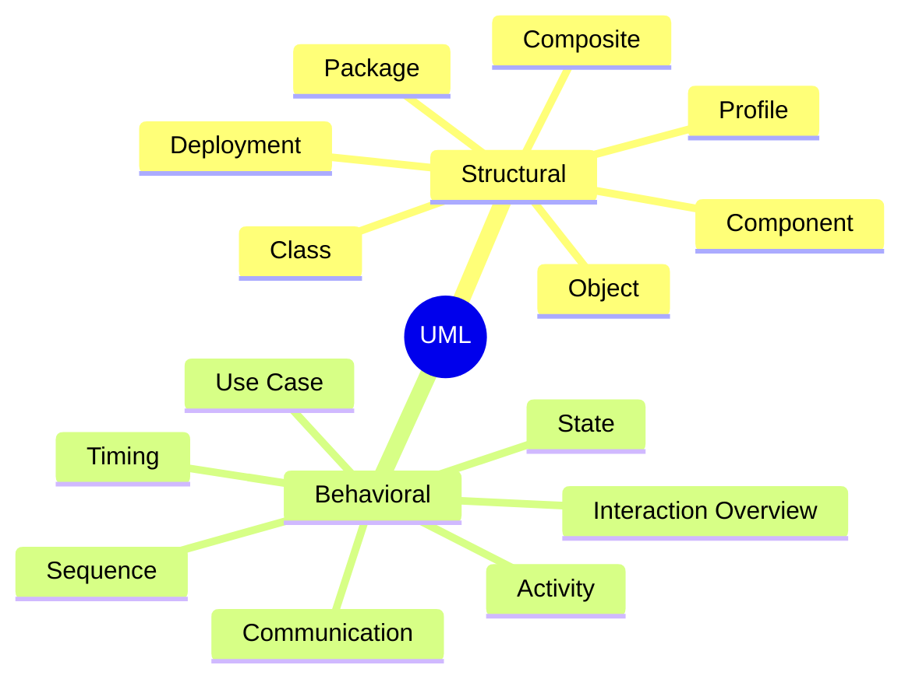

See [[uml-overview]].

---

## 🏛️ Class Diagram Anatomy

Three compartments, top to bottom:

```
┌─────────────────────┐
│      ClassName       │  ← Name (italic if abstract)
├─────────────────────┤
│ +publicAttr: Type    │  ← Attributes
│ -privateAttr: Type   │
│ #protectedAttr: Type │
│ ~packageAttr: Type   │
├─────────────────────┤
│ +method(): RetType   │  ← Operations
│ #protectedMethod()   │
│ -privateMethod()     │
│ {abstract} method()  │  ← italic or {abstract}
└─────────────────────┘
```

### Visibility markers

| Marker | Meaning | Python equivalent |
|:---:|---|---|
| `+` | Public | (no underscore) `name` |
| `-` | Private | `__name` (mangled) |
| `#` | Protected | `_name` (by convention) |
| `~` | Package | (no Python equivalent) |

### Other markers

| Marker | Meaning |
|---|---|
| *italic name* | Abstract class |
| `{abstract}` | Abstract method (alternative) |
| `<<interface>>` | Stereotype: interface |
| `<<protocol>>` | Stereotype: Protocol |
| `static` | Underlined attribute/method |
| `: Type` | Type annotation |
| `= value` | Default value |

### Minimal Mermaid class diagram

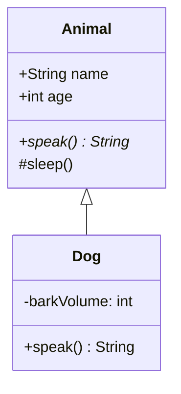

> [!note] `*` after a method name = abstract method. `+`/`-`/`#` = visibility.

See [[class-diagrams]].

---

## 🔗 The 6 Relationships (with Mermaid)

| Relationship | UML Symbol | Mermaid syntax | Meaning | Real-world analogy |
|---|:---:|---|---|---|
| **Inheritance** | `──▷` | `Parent <\|-- Child` | "is-a" | Dog is an Animal |
| **Realization** | `┄┄▷` | `Protocol <\|.. Class` | "implements" | Circle implements Shape |
| **Composition** | `──◆` | `Car *-- Engine` | "owns" (lifecycle bound) | House owns Rooms |
| **Aggregation** | `──◇` | `Team o-- Player` | "has-a" (shared) | Team has Players (they exist on their own) |
| **Association** | `──` | `A --> B` | "uses" (long-term) | Teacher uses Classroom |
| **Dependency** | `┄┄>` | `A ..> B` | "temporarily uses" | Chef uses Recipe during cooking |

### Full Mermaid demonstration

```mermaid
classDiagram
    class Animal {
        +speak() String
    }
    class Mammal {
        +furColor: String
    }
    class Dog {
        +fetch()
    }
    class Tail {
        +wag()
    }
    class Owner {
        +name: String
    }
    class Food {
        +calories: int
    }
    Animal <|-- Mammal         %% inheritance (is-a)
    Mammal <|-- Dog            %% inheritance (is-a)
    Dog *-- Tail               %% composition (owns lifecycle)
    Dog o-- Owner              %% aggregation (shared)
    Dog --> Food : eats        %% association (uses)
    Dog ..> Food : feeds       %% dependency (temporarily)
```

### Composition vs Aggregation — the line that confuses everyone

| Question | Composition | Aggregation |
|---|---|---|
| If the container is destroyed, are the parts destroyed too? | Yes | No |
| Are the parts shared with other containers? | No | Yes |
| Created by the container? | Yes | No (passed in) |
| Python code | `self.engine = Engine()` | `self.driver = driver` (passed in `__init__`) |

See [[class-diagrams]].

---

## 🔢 Multiplicity Table

| Marker | Meaning | Example |
|:---:|---|---|
| `1` | Exactly one | `1` Person has `1` Heart |
| `0..1` | Zero or one (optional) | `0..1` Person has `0..1` Spouse |
| `0..*` or `*` | Zero or more | `0..*` Order has `0..*` Items |
| `1..*` | One or more (required, multiple) | `1..*` Department has `1..*` Employees |
| `n` | Exactly n | `4` Car has `4` Wheels |
| `n..m` | Between n and m | `2..5` Meeting has `2..5` Participants |

### Mermaid syntax for multiplicity

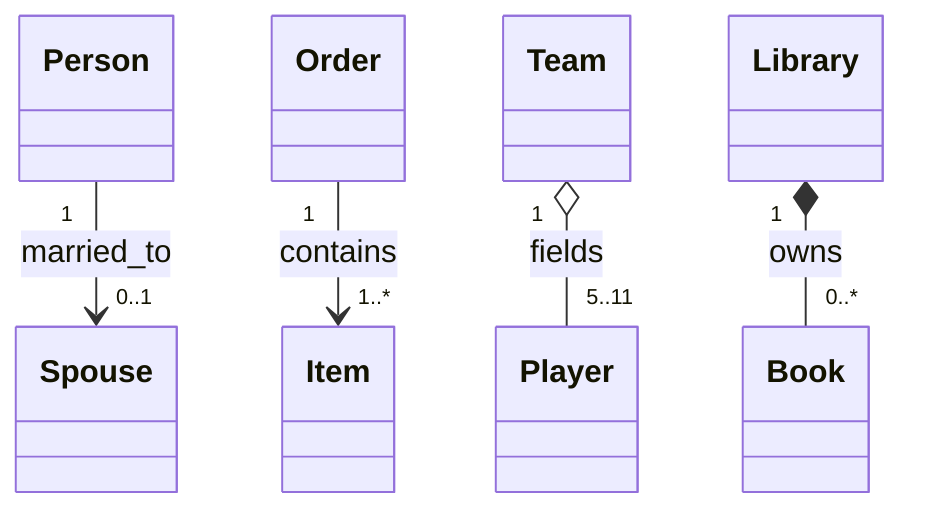

See [[class-diagrams]].

---

## 🎬 Sequence Diagram Syntax Cheat-Sheet

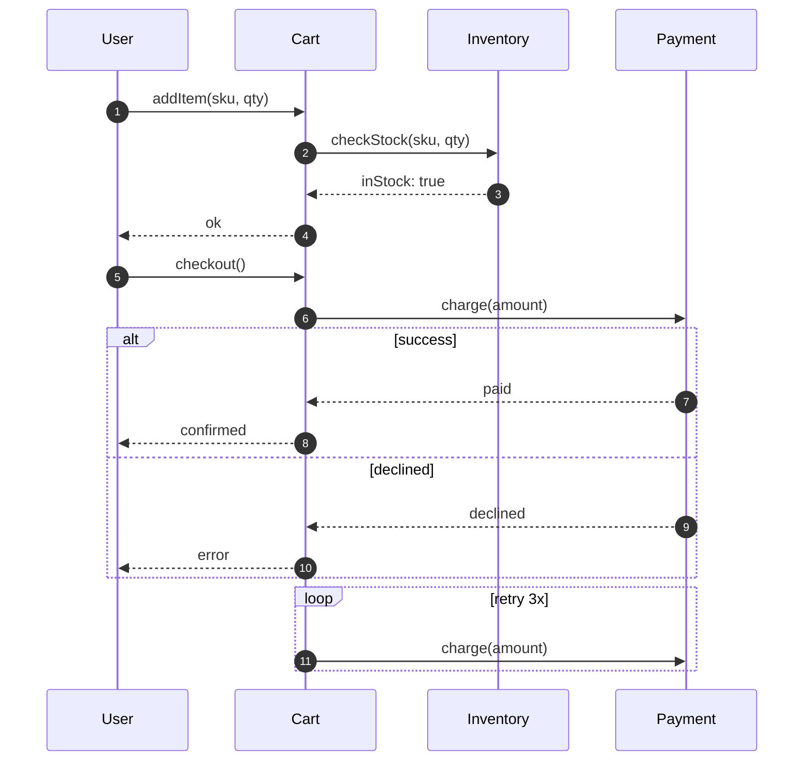

### Sequence diagram elements

| Element | Mermaid syntax | Meaning |
|---|---|---|
| Participant | `participant A as Alias` | A lifeline |
| Sync message | `A->>B: msg` | Solid arrow with filled head |
| Async message | `A--)B: msg` | Solid arrow with open head |
| Return message | `B-->>A: result` | Dashed arrow |
| Self message | `A->>A: msg` | Loop on same lifeline |
| Note | `Note over A: text` or `Note right of A: text` | Sticky note |
| Activation | `activate A` / `deactivate A` | Vertical bar on lifeline |
| `alt`/`else`/`end` | conditional | Alternative branches |
| `opt`/`end` | optional | Optional fragment |
| `loop`/`end` | iteration | Loop fragment |
| `par`/`and`/`end` | parallel | Concurrent fragments |
| `autonumber` | auto numbering | Auto-number messages |

See [[sequence-diagrams]].

---

## 🚦 State Diagram Syntax Cheat-Sheet (stateDiagram-v2)

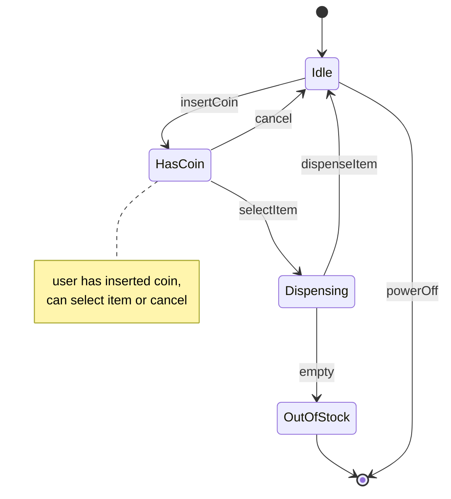

### State diagram elements

| Element | Mermaid syntax | Meaning |
|---|---|---|
| Initial state | `[*]` | Black circle |
| Final state | `[*]` (different arrow target) | Bullseye |
| State | `StateName` | A vertex |
| Transition | `A --> B: event` | Edge with optional label |
| Guard | `A --> B: event [guard]` | Conditional transition |
| Action | `A --> B: event / action` | Triggered action |
| Composite state | `state X { ... }` | Nested states |
| Fork/Join | `state fork <<fork>>` | Parallel split/join |
| Note | `note left of A: text` | Annotation |

See [[state-and-activity-diagrams]].

---

## 🌊 Activity Diagram Syntax (via flowchart)

Mermaid doesn't have a true activity diagram. Use `flowchart`:

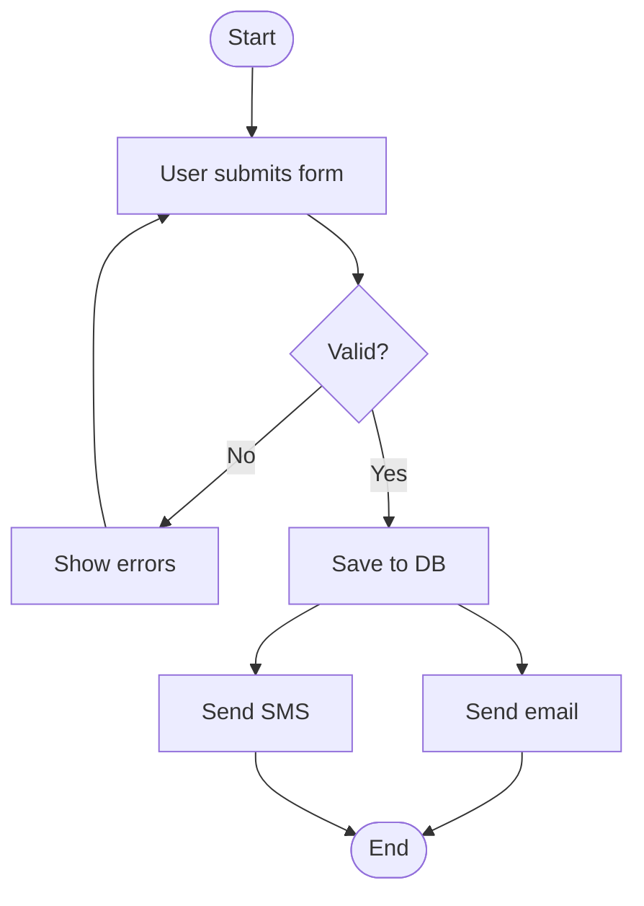

### Activity elements via flowchart

| Concept | Flowchart syntax |
|---|---|
| Start / End | `([Start])` (rounded) |
| Action | `[Do something]` |
| Decision | `{Condition?}` |
| Fork / Join | Use multiple edges in/out of a node, or `subgraph` |
| Swimlane | `subgraph LaneName ... end` |

See [[state-and-activity-diagrams]].

---

## 🧭 Mermaid Syntax Quick Reference

### `classDiagram`

```mermaid
classDiagram
    class ClassName {
        +publicAttr: Type
        -privateAttr: Type
        #protectedAttr: Type
        ~packageAttr: Type
        +method() ReturnType
        -privateMethod()
        {abstract} abstractMethod()
    }
    Parent <|-- Child          %% inheritance
    Interface <|.. Class       %% realization
    Container *-- Part         %% composition
    Container o-- Part         %% aggregation
    A --> B : label            %% association
    A ..> B : label            %% dependency
    class StereotypeClass {
        <<interface>>
    }
```

### `sequenceDiagram`

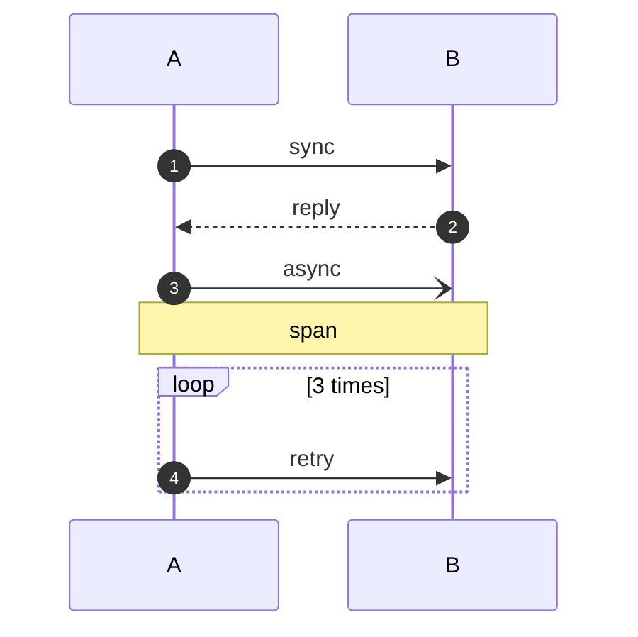

### `stateDiagram-v2`

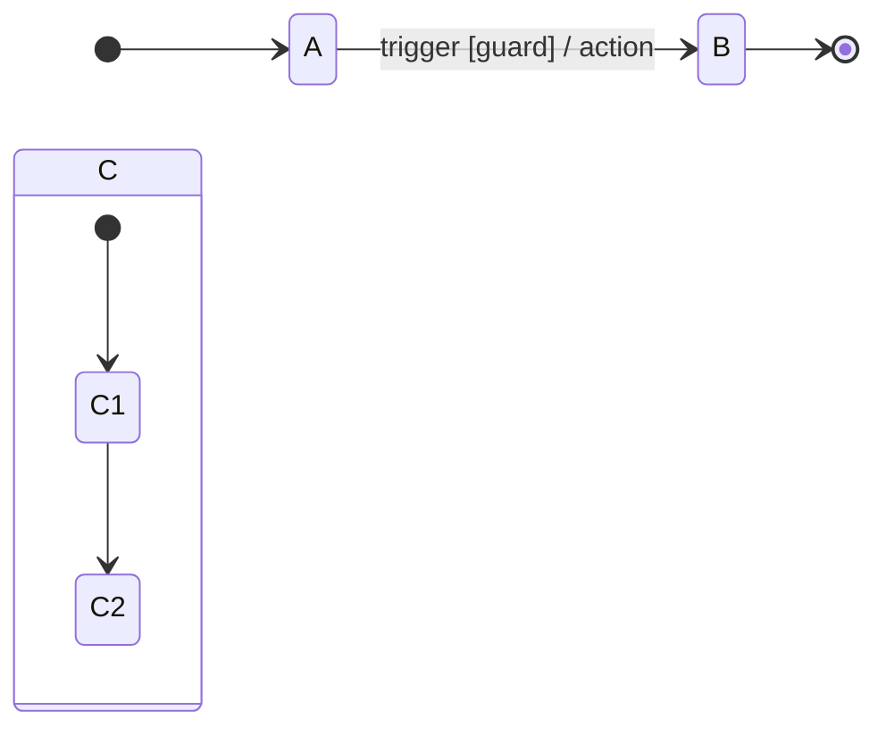

### `flowchart`

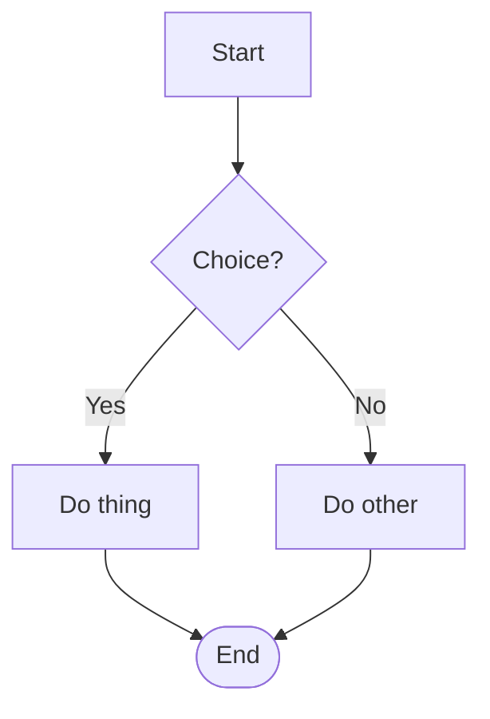

### `mindmap`

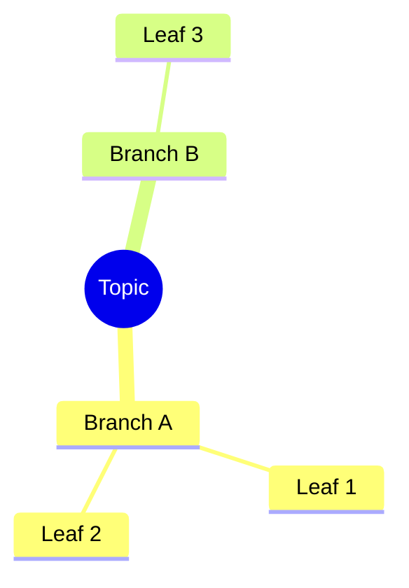

### `erDiagram`

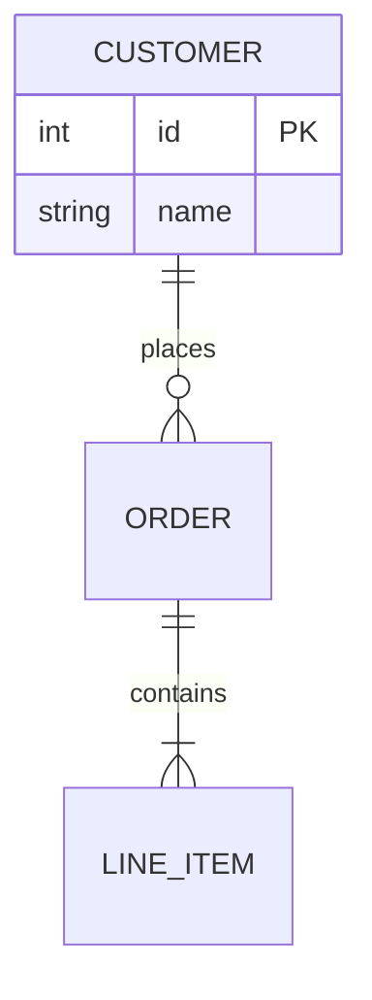

### `timeline`

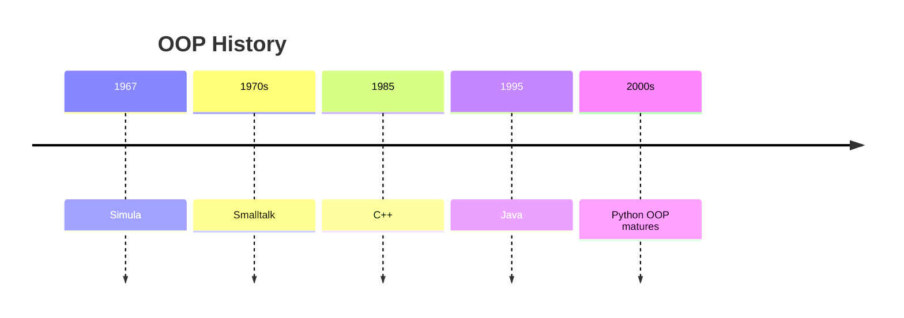

### `gitGraph`

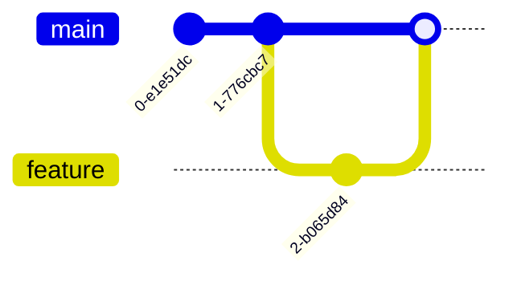

See [[mermaid-cheatsheet]] for the full reference.

---

## 🎯 "I Want to Show X, Use Y" Lookup

| You want to show… | Use this diagram |
|---|---|
| The structure of a system at rest (classes + relationships) | **Class diagram** — [[class-diagrams]] |
| A snapshot of instances and links at one moment | **Object diagram** — [[object-diagrams]] |
| The order of messages between objects over time | **Sequence diagram** — [[sequence-diagrams]] |
| The lifecycle of one object (state transitions) | **State diagram** — [[state-and-activity-diagrams]] |
| A workflow or algorithm flow | **Activity diagram** — [[state-and-activity-diagrams]] |
| What the system does, from outside (actors + goals) | **Use case diagram** — [[use-case-and-package-diagrams]] |
| How packages/modules depend on each other | **Package diagram** — [[use-case-and-package-diagrams]] |
| Deployment of components to hardware | **Deployment diagram** — (rare in OOP) |
| A brainstorm / taxonomy of concepts | **Mindmap** — [[mermaid-cheatsheet]] |
| A decision procedure | **Flowchart** — [[mermaid-cheatsheet]] |
| A historical sequence of events | **Timeline** — [[mermaid-cheatsheet]] |
| Database schema | **ER diagram** — [[mermaid-cheatsheet]] |
| Branching/merging history | **Git graph** — [[mermaid-cheatsheet]] |

---

## 🧪 Common Mermaid Pitfalls (Quick Fix)

| Symptom | Fix |
|---|---|
| Diagram won't render | Check for unescaped special chars (`<`, `>`, `&`) — use `&lt;`, `&gt;`, `&amp;` |
| `classDiagram` confusion between `<\|--` and `<\|..` | `<\|--` = solid (inheritance); `<\|..` = dashed (realization) |
| Labels with spaces break arrows | Wrap label in quotes: `A --> B: "has many"` |
| State diagram notes don't render | Use `note right of StateName` exactly; Mermaid is finicky |
| `mindmap` branches look weird | Indentation must be **consistent** (tabs or spaces, not mixed) |
| `flowchart TD` edges overlap | Add direction `TD`/`LR`; use `subgraph` to cluster |
| Sequence diagram async arrows | `--)` not `-)-` — Mermaid's parser is strict |
| `classDiagram` doesn't show visibility `~` | Mermaid supports `+`, `-`, `#` only; `~` (package) not rendered |
| Diagram is too wide for screen | Use `direction LR` or split into multiple smaller diagrams |
| `%% comment` breaks inside `{}` block | Use `%%` only on its own line |

See [[mermaid-cheatsheet]].

---

## 🎨 Visual Conventions Summary

### Arrow style

| Style | Meaning |
|:---:|---|
| `──` solid | Permanent relationship (inheritance, association, composition) |
| `┄┄` dashed | Temporary / realization / dependency / return |

### Arrow head

| Head | Meaning |
|:---:|---|
| `▷` open triangle | "is-a" / "implements" |
| `◆` filled diamond | Composition |
| `◇` open diamond | Aggregation |
| `>` open arrow | Navigability / direction |
| `▷▷` or `▷` (filled) | Stronger relationship |

### Line labels

- Place **above** the line.
- Format: `event [guard] / action` for state transitions.
- Format: `multiplicity : role` for associations.

---

## 📦 A Compact Library System (All-in-One Example)

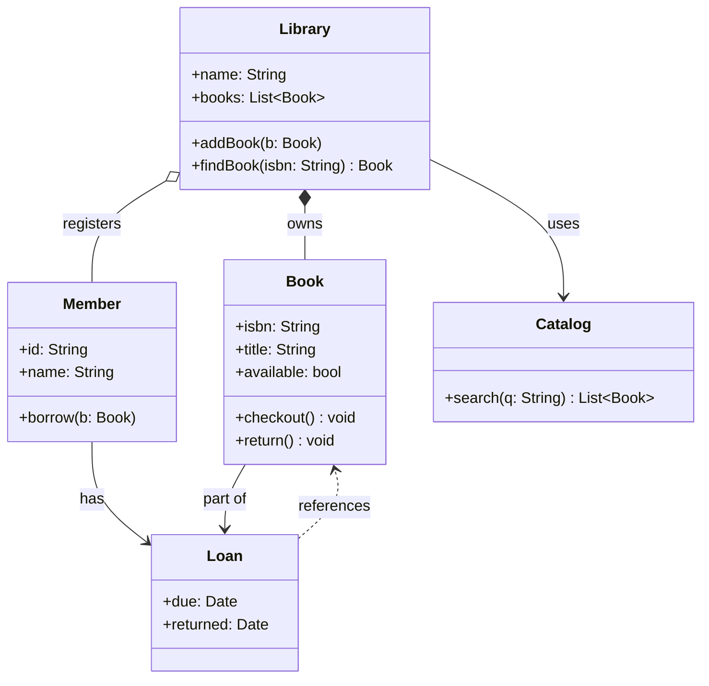

> [!example] Try redrawing this from memory
> After 10 minutes with [[class-diagrams]], sketch this diagram on paper. Compare. The gaps are what you didn't actually learn yet.

---

## 🔑 Key Takeaways

- **6 of the 14 UML diagram types** cover ~95% of OOP needs: Class, Object, Sequence, State, Activity, Use Case.
- **Class diagrams** have 3 compartments (name, attributes, operations) and 4 visibility markers (`+`, `-`, `#`, `~`).
- **The 6 relationships** are: inheritance `──▷`, realization `┄┄▷`, composition `──◆`, aggregation `──◇`, association `──`, dependency `┄┄>`.
- **Composition ≠ Aggregation**: lifecycle-bound vs shared. When in doubt, ask "if the container dies, do the parts die too?"
- **Multiplicity**: `1`, `0..1`, `*`, `1..*`, `n`, `n..m`.
- **Sequence diagrams** show messages over time; use `alt`/`opt`/`loop`/`par` for control flow.
- **State diagrams** (`stateDiagram-v2`) show object lifecycles with `[*]` for start/end.
- Mermaid supports `classDiagram`, `sequenceDiagram`, `stateDiagram-v2`, `flowchart`, `mindmap`, `erDiagram`, `timeline`, `gitGraph` — all render natively in Obsidian.
- Use the **"I want to show X, use Y"** table to pick the right diagram type.
- Mermaid is finicky — common fixes are escaping `<`/`>`/`&`, wrapping labels in quotes, and consistent indentation in mindmaps.
- Every diagram type in this card has a full deep-dive note behind it.

---

*See also: [[oop-quick-reference]] · [[mermaid-cheatsheet]] · [[class-diagrams]] · [[sequence-diagrams]] · [[state-and-activity-diagrams]] · [[object-diagrams]] · [[use-case-and-package-diagrams]] · [[uml-overview]]*
