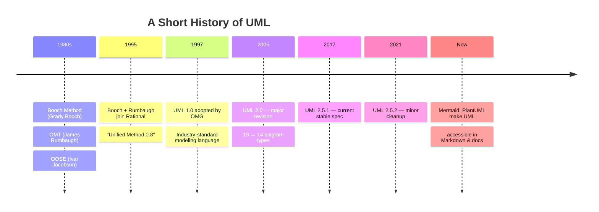
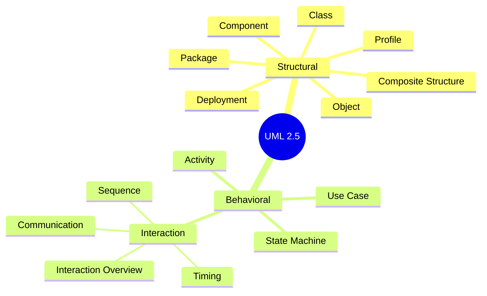
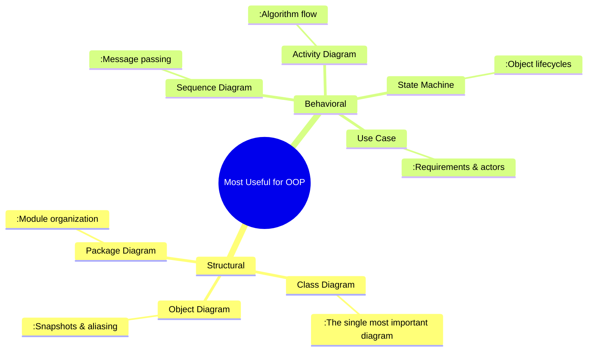
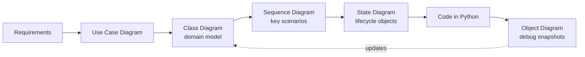

# UML Overview — The Visual Language of OOP

> [!quote] "A picture is worth a thousand lines of code."
> UML is the standard visual vocabulary we use to talk about object-oriented systems *before* we commit them to code.

---

## 1. What Is UML?

**UML** stands for **Unified Modeling Language**. It is a standardized, graphical language for specifying, visualizing, constructing, and documenting the artifacts of software-intensive systems — particularly object-oriented ones.

UML is **not** a programming language. It is a *blueprint language*. Think of it as the architect's drawing that an engineer (the programmer) turns into a building (the running program).

### 1.1 Why UML Exists

| Without UML                          | With UML                                      |
| ------------------------------------ | --------------------------------------------- |
| Hand-wavy whiteboard sketches        | Standardized symbols everyone understands      |
| Code is the only source of truth     | A shared visual contract for the team          |
| Design discussions take forever      | Quick, unambiguous communication               |
| Onboarding new devs = reading source | Onboarding = a few diagrams + a tour           |

> [!tip] Teaching insight
> For students, UML is the **bridge between concept and code**. A class diagram lets you *see* inheritance before you write `class Dog(Animal):`. A sequence diagram lets you *trace* a method call before you debug a stack trace.

---

## 2. A Brief History of UML



The "Three Amigos" — **Grady Booch**, **James Rumbaugh**, and **Ivar Jacobson** — unified their competing notations at Rational Software in the mid-1990s. The Object Management Group (OMG) adopted UML 1.0 in 1997, and UML 2.0 (2005) is the basis of what we use today.

> [!note] Who owns UML?
> UML is maintained by the **OMG (Object Management Group)**, a not-for-profit standards consortium. The spec is open and free to read.

---

## 3. The 14 UML Diagram Types

UML 2.5 defines **14 diagram types**, split into two big families:

1. **Structural diagrams** (7) — what the system *is*
2. **Behavioral diagrams** (8, one of which is split into 4 interaction types, often counted as 14 total) — what the system *does*

> [!info] Counting convention
> Some textbooks say 13, some say 14. UML 2.5 lists 7 structural + 7 behavioral (with interactions grouped as a sub-category). We'll use the 14-diagram convention here.

### 3.1 Mind Map of All 14 Diagrams



### 3.2 The Structural Family (7 diagrams)

These describe the **static** parts of the system — the nouns.

| # | Diagram              | One-liner                                                |
| - | -------------------- | -------------------------------------------------------- |
| 1 | **Class**            | Blueprint of classes, attributes, methods, relationships |
| 2 | **Object**           | Snapshot of instances and links at a moment in time      |
| 3 | **Component**        | Modules & their interfaces (deployable units)            |
| 4 | **Composite Structure** | Internal structure of a class (parts, ports, connectors) |
| 5 | **Deployment**       | Hardware nodes & how software deploys onto them          |
| 6 | **Package**          | Namespace grouping of classes                            |
| 7 | **Profile**          | UML extension / customization (stereotypes)              |

### 3.3 The Behavioral Family (7 diagrams)

These describe the **dynamic** behavior — the verbs.

| #  | Diagram                    | One-liner                                              |
| -- | -------------------------- | ------------------------------------------------------ |
| 8  | **Use Case**               | Actor goals & system boundaries                        |
| 9  | **Activity**               | Flowchart of activities & decisions (workflow)         |
| 10 | **State Machine**          | Object lifecycle: states & transitions                 |
| 11 | **Sequence**               | Time-ordered messages between objects                  |
| 12 | **Communication**          | Object interactions focused on links (formerly Collaboration) |
| 13 | **Interaction Overview**   | Activity diagram whose nodes are interaction fragments |
| 14 | **Timing**                 | Object state over time (real-time emphasis)            |

---

## 4. Which Diagrams Matter Most for Teaching OOP?

Of the 14, only **6 are essential** for teaching OOP effectively. The other 8 are valuable for software architecture, real-time systems, or enterprise deployment — not for getting OOP to click.



### 4.1 Why these six?

| Diagram          | Teaches the concept of…                                            | See also                      |
| ---------------- | ------------------------------------------------------------------ | ----------------------------- |
| **Class**        | Encapsulation, inheritance, polymorphism, relationships            | [[class-diagrams]]            |
| **Object**       | Instances vs classes, references, shared state                     | [[object-diagrams]]           |
| **Sequence**     | Message passing, method dispatch, collaboration                    | [[sequence-diagrams]]         |
| **State Machine**| Object lifecycle, the [[state-pattern]]                            | [[state-and-activity-diagrams]] |
| **Activity**     | Algorithms, decisions, parallelism (control flow)                  | [[state-and-activity-diagrams]] |
| **Use Case**     | Requirements, system boundary, actor responsibilities              | [[use-case-and-package-diagrams]] |

> [!success] The 80/20 of UML for OOP
> If you learn **only** the class diagram and the sequence diagram, you've covered ~80% of what UML contributes to OOP teaching. The state machine and activity diagram get you to ~95%.

---

## 5. The Diagrams We Skip (and Why)

| Diagram                | Why we skip it in an OOP course                                       |
| ---------------------- | --------------------------------------------------------------------- |
| Component              | More relevant to architecture & deployment than to OOP fundamentals   |
| Composite Structure    | Advanced; useful for ports/connectors but rarely needed for beginners |
| Deployment             | About hardware topology, not object design                            |
| Profile                | Meta-modeling — only for tool builders                                |
| Communication          | Sequence diagrams cover the same ground more clearly                  |
| Interaction Overview   | Niche; mixes activity + interaction, rarely seen in practice          |
| Timing                 | Real-time & embedded focus                                            |

> [!warning] Don't get overwhelmed
> The full UML spec is ~800 pages. **You do not need all of it to be an excellent OO designer.** Treat UML like a language: learn the dialect you'll actually speak.

---

## 6. Tools for Drawing UML

There are three categories of tools, each with trade-offs.

### 6.1 Text-based (diagrams-as-code)

These let you write UML as text that compiles to a diagram. **Best for version control, Markdown, and Obsidian.**

| Tool       | Syntax style        | Obsidian support       | Notes                                  |
| ---------- | ------------------- | ---------------------- | -------------------------------------- |
| **Mermaid** | Indented, simple    | ✅ Native (built-in)   | Easiest; renders inline in MD          |
| **PlantUML** | Java-like, powerful | ⚠️ Via community plugin | More expressive, esp. for use cases    |
| **Graphviz/DOT** | Edges & nodes      | ⚠️ Via plugin          | Great for graph-theory-style diagrams  |

> [!tip] Why Mermaid wins for teaching
> 1. **Native Obsidian support** — no plugins required.
> 2. **Renders inside GitHub, GitLab, Notion, Obsidian.**
> 3. **Simple syntax** that beginners can read AND write.
> 4. **Diagrams live in the same file as the text** — single source of truth.

### 6.2 Drag-and-drop GUI tools

| Tool          | Free?  | Notes                                                    |
| ------------- | ------ | -------------------------------------------------------- |
| **draw.io / diagrams.net** | ✅ | Web + desktop; exports to PNG/SVG/XML                    |
| **StarUML**   | Trial  | Polished UML-specific; good for class & sequence         |
| **Lucidchart** | Trial | Enterprise-friendly; lots of templates                   |
| **Visual Paradigm** | Trial | Full UML & SysML; heavy                                  |

### 6.3 IDE-integrated

| Tool                          | Notes                                                  |
| ----------------------------- | ------------------------------------------------------ |
| **IntelliJ IDEA Ultimate**    | Reverse-engineers class diagrams from Java/Kotlin code |
| **PyCharm Professional**      | Same for Python                                         |
| **Eclipse Papyrus**           | Free UML modeling on top of Eclipse                    |

### 6.4 Recommendation for students

> [!success] Start here
> Use **Mermaid in Obsidian** for everything you can. Reach for **draw.io** only when you need pixel-perfect positioning or icons. Use **PlantUML** if you need use-case diagrams (Mermaid's use-case support is weak).

---

## 7. How to Read a UML Diagram — The 60-Second Primer

No matter which diagram you're looking at, four questions will guide you:

1. **What are the boxes?** → Classes, objects, components, states, actors.
2. **What are the lines?** → Relationships, messages, transitions, flows.
3. **What are the arrows?** → Direction & type of relationship (inheritance vs dependency vs message).
4. **What's inside the boxes?** → Attributes, methods, states, parameters.

> [!example] A tiny taste
> ```mermaid
> classDiagram
>     class Animal {
>         +String name
>         +int age
>         +make_sound() void
>     }
>     class Dog {
>         +fetch() void
>     }
>     Dog --|> Animal : inherits
> ```
> 
> Reading: *"Dog **inherits from** Animal. Animal has public attributes `name` and `age`, and a public method `make_sound()`. Dog adds a public method `fetch()`."*

We'll unpack every symbol in [[class-diagrams]].

---

## 8. UML in a Real OOP Workflow



This is a feedback loop, **not** a waterfall. You draw, you code, you refine the diagrams. Diuagrams that never update are dead documentation.

> [!warning] Anti-pattern: UML as wallpaper
> Don't generate 200 diagrams upfront, ship the code, and never look at them again. That's cargo-cult UML. Diagrams are alive — they change with the code.

---

## 9. UML vs. Other Modeling Approaches

| Approach         | Strengths                          | Weaknesses                            |
| ---------------- | ---------------------------------- | ------------------------------------- |
| **UML**          | Standardized, expressive, mature    | Verbose; can be over-engineered        |
| **C4 Model**     | Modern, layered architecture views | Less detail on object-level design    |
| **CRC Cards**    | Cheap, collaborative, kinetic      | No formal notation; ephemeral          |
| **SysML**        | Systems engineering (hardware+SW)  | Overkill for pure software OOP         |
| **Flowcharts**   | Universally understood             | Don't model objects/data               |

For OOP, **UML is still the lingua franca**. C4 complements it at the architecture level; CRC cards are a great teaching companion.

> [!tip] CRC Cards in class
> A **CRC card** (Class–Responsibility–Collaborator) is an index card per class with three sections: responsibilities, collaborators, and class name. Students physically pass cards around to simulate message passing. It pairs beautifully with sequence diagrams.

---

## 10. Key Takeaways

> [!summary] Remember these six things
> 1. **UML is a visual vocabulary**, not a process. It's the *what*, not the *how*.
> 2. **14 diagram types, 2 families**: structural (what the system is) and behavioral (what it does).
> 3. **Six diagrams cover 95% of OOP teaching**: Class, Object, Sequence, State Machine, Activity, Use Case.
> 4. **Mermaid renders natively in Obsidian** — write diagrams as code inside your Markdown notes.
> 5. **The class diagram is the single most important diagram** for teaching OOP. Master it first.
> 6. **Diagrams must evolve with code**. Stale diagrams are worse than no diagrams.

---

## 11. Next Steps

- 🧱 [[class-diagrams]] — the centerpiece. Learn visibility, relationships, multiplicity.
- 📸 [[object-diagrams]] — snapshots of running systems.
- 💌 [[sequence-diagrams]] — how objects talk to each other.
- 🔄 [[state-and-activity-diagrams]] — lifecycles and workflows.
- 🎭 [[use-case-and-package-diagrams]] — requirements and module organization.
- 📋 [[mermaid-cheatsheet]] — copy-paste reference for every Mermaid diagram type.

---

## 12. Further Reading

- *The Unified Modeling Language User Guide* — Booch, Rumbaugh, Jacobson (the "Three Amigos")
- *UML Distilled* — Martin Fowler (the lean, pragmatic intro)
- OMG UML 2.5.1 specification — https://www.omg.org/spec/UML/2.5.1/
- Mermaid docs — https://mermaid.js.org/
- PlantUML — https://plantuml.com/

---

> [!quote] Grady Booch
> "The essence of object-oriented programming is the modeling of the world as a collection of cooperating objects." UML is how we draw that cooperation.
