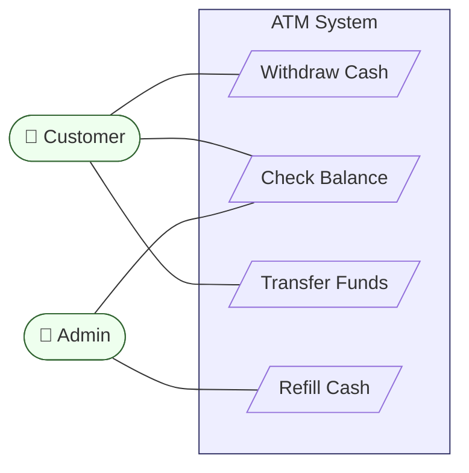
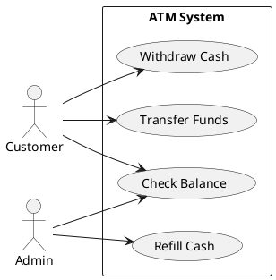
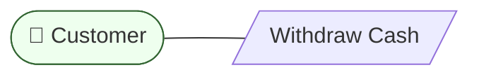
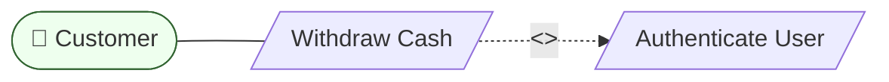
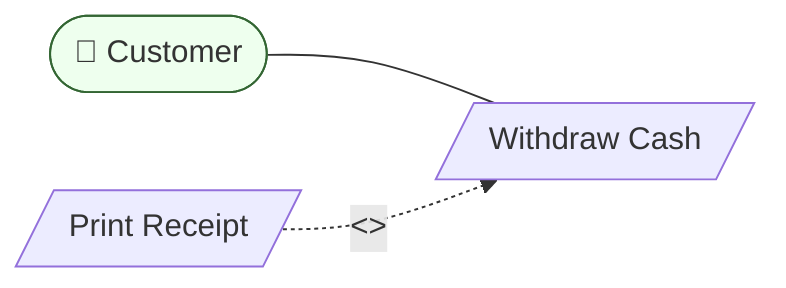
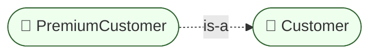
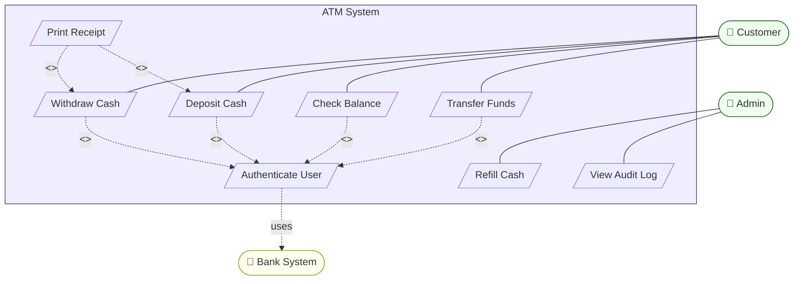
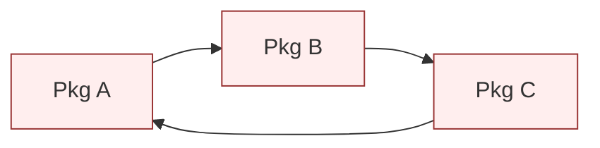
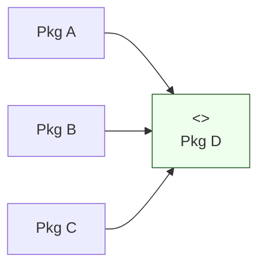
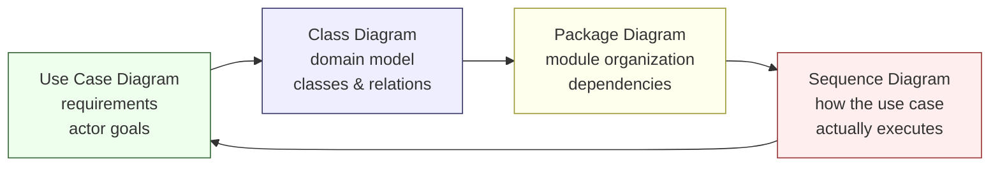

# Use Case & Package Diagrams — Requirements and Modules

> [!quote] Ivar Jacobson
> "Use cases are the things of value that a system provides to its users." They answer *"what does the system DO?"* before we worry about how it does it.

These two diagrams live at the **boundaries** of OOP design:
- **Use case diagrams** sit at the **outer boundary** — the line between the system and the actors who use it.
- **Package diagrams** sit at the **inner boundary** — how classes are organized into namespaces and modules.

Together they frame your OOP design: *who wants what*, and *where the code lives*.

---

## Part I — Use Case Diagrams

## 1. What Is a Use Case Diagram?

A **use case diagram** shows:

- The **system boundary** (a box)
- **Actors** — anyone or anything that interacts with the system (users, other systems, time)
- **Use cases** — the things actors can accomplish with the system
- **Relationships** between actors and use cases (association, `<<include>>`, `<<extend>>`, generalization)

> 🏠 **Analogy**: A use case diagram is the **menu** of a restaurant. It tells you what you can order; it does NOT tell you how the chef cooks it. That's the class diagram's job.

| Element            | Symbol                                | Meaning                                  |
| ------------------ | ------------------------------------- | ---------------------------------------- |
| Actor              | Stick figure                          | A role that interacts with the system     |
| Use case           | Ellipse                               | A unit of value the system provides       |
| System boundary    | Rectangle around the use cases         | "Inside the box" = system responsibility  |
| Association        | Solid line                            | Actor participates in use case           |
| `<<include>>`      | Dashed arrow `-->` with stereotype    | Use case **always** uses another         |
| `<<extend>>`       | Dashed arrow with stereotype          | Use case **conditionally** adds to another |
| Generalization     | Solid line with hollow triangle       | "is-a-kind-of" between actors or use cases |

> [!tip] Teaching insight
> Use case diagrams are usually the **first** diagram students see — they describe the *problem* before the *solution*. They're invaluable for:
> - Capturing requirements from stakeholders
> - Defining the **system boundary** (what's in scope, what's not)
> - Identifying the **actors** who will drive class discovery later

---

## 2. The Problem: Mermaid Has No Native Use Case Support

Mermaid does **not** have a `useCaseDiagram` keyword (as of v11). There are three practical strategies:

### 2.1 Strategy A — Use `flowchart` with stick-figure actors



> [!note] Hacks required
> - Actors: use `(["👤 Name"])` (stadium-shaped node with emoji).
> - Use cases: use `[/Name/]` (parallelogram, looks vaguely ellipse-ish) or `((Name))` (circle).
> - System boundary: use a `subgraph`.

### 2.2 Strategy B — Use **PlantUML** for proper use case diagrams

PlantUML has native support. If you have the PlantUML plugin in Obsidian:



This renders clean, standard UML. **Recommended if you'll draw many use case diagrams.**

### 2.3 Strategy C — Use a **table** instead

When the diagram would be simple, a well-formatted table can communicate just as well:

| Actor     | Use Case              | Description                                |
| --------- | --------------------- | ------------------------------------------ |
| Customer  | Withdraw Cash         | Take cash from account                     |
| Customer  | Check Balance         | View current balance                       |
| Customer  | Transfer Funds        | Move money to another account              |
| Admin     | Refill Cash           | Replenish ATM cash reservoir               |
| Admin     | Check Balance         | View any customer's balance (read-only)    |

> [!tip] Recommendation for teaching
> Use **Strategy A** (flowchart in Mermaid) for simple cases — it renders everywhere. Use **Strategy B** (PlantUML) when you have the plugin. Use **Strategy C** (table) for tiny cases. Always teach students the **proper UML notation** (stick figure + ellipse) even when approximating.

---

## 3. The Relationships in Detail

### 3.1 Association (actor ↔ use case)

A plain solid line: the actor participates in the use case.



### 3.2 `<<include>>` — "always uses"

The base use case **always** invokes the included use case. Used to factor out **common behavior**.

> **Example**: "Withdraw Cash" **includes** "Authenticate User" — every withdrawal requires authentication.



> [!note] Reading `<<include>>`
> The dashed arrow goes **from the base TO the included**. The base *depends on* the included. There is no "if" — it always happens.

### 3.3 `<<extend>>` — "conditionally adds"

The extending use case **may** add behavior to the base under certain conditions. Used for **optional** or **exceptional** flows.

> **Example**: "Print Receipt" **extends** "Withdraw Cash" — the customer may opt to print a receipt.



> [!note] Reading `<<extend>>`
> The dashed arrow goes **from the extending TO the base**. The extending use case *augments* the base. There IS an "if" — it may not happen.

### 3.4 Generalization ("is-a-kind-of")

An actor or use case can specialize another. "Premium Customer" generalizes from "Customer"; "Withdraw Cash" might generalize from "Transaction".



### 3.5 Include vs Extend — The Eternal Confusion

| Aspect        | `<<include>>`                          | `<<extend>>`                              |
| ------------- | -------------------------------------- | ----------------------------------------- |
| Mandatory?    | ✅ Always happens                       | ❌ Conditional                             |
| Arrow points  | Base **→** Included                    | Extending **→** Base                       |
| Used for      | Factoring common sub-behavior          | Optional or exceptional flows              |
| Example       | "Withdraw" includes "Authenticate"     | "Print Receipt" extends "Withdraw"        |

> [!tip] Memory aid
> **"Include = INEVITABLE, Extend = EXTRAS."**
> If it must happen → include. If it might happen → extend.

---

## 4. Worked Example — An ATM System

### 4.1 The Diagram



### 4.2 Reading the Diagram

1. **Actors**: Customer and Admin. Both are roles; one human could play both.
2. **System boundary**: The ATM box. Everything inside is the ATM's responsibility.
3. **External system**: The Bank System authenticates users — it sits *outside* the ATM boundary.
4. **Includes**: All four customer-facing use cases **always include** authentication.
5. **Extends**: Printing a receipt **may extend** Withdraw or Deposit.

### 4.3 From Use Cases to Classes

A use case diagram is the **bridge from requirements to design**. Each use case typically maps to one or more **controller classes**:

| Use Case          | Likely controller class       |
| ----------------- | ----------------------------- |
| Withdraw Cash     | `WithdrawController`          |
| Deposit Cash      | `DepositController`           |
| Check Balance     | `BalanceController`           |
| Transfer Funds    | `TransferController`          |
| Authenticate User | `AuthService`                 |
| Refill Cash       | `MaintenanceService`          |
| View Audit Log    | `AuditService`                |

> [!success] Process
> 1. Use cases → controllers (one per use case)
> 2. Nouns in use case descriptions → entity classes (`Account`, `Transaction`, `Receipt`)
> 3. Use case steps → methods on the controllers
> 4. Then draw the [[class-diagrams]]!

---

## 5. Common Mistakes with Use Case Diagrams

> [!danger] Top 5 traps
> 1. **Writing use cases as functions** ("Validate PIN"). Use cases are **goals**, not steps. → "Withdraw Cash" is the goal; "Validate PIN" is a step inside.
> 2. **Forgetting the system boundary.** Without a box, you can't tell what's "in" the system.
> 3. **Confusing include and extend.** See section 3.5.
> 4. **Adding too many use cases.** Aim for 5–15 per system. More → split into sub-systems.
> 5. **Treating actors as classes.** An actor is a **role**, not a `User` class. The same human can be both `Customer` and `Admin`.

---

## Part II — Package Diagrams

## 6. What Is a Package Diagram?

A **package diagram** shows how classes and other UML elements are grouped into **packages** (namespaces / modules), and the **dependencies** between packages.

> 🏠 **Analogy**: A package diagram is the **filing cabinet layout** of your codebase. Each drawer is a package; each folder inside is a class.

| Element            | Symbol                         |
| ------------------ | ------------------------------ |
| Package            | Tabbed folder icon / rectangle with tab |
| Class              | Rectangle (as in class diagram) |
| Dependency         | Dashed arrow `..>`              |
| Import / Access    | Dashed arrow with `<<import>>` or `<<access>>` stereotype |

### 6.1 Why Packages Matter in OOP

- **Namespace management**: avoid name collisions (`auth.User` vs `blog.User`).
- **Encapsulation at module level**: package-private vs public.
- **Layered architecture**: controllers depend on services, services on repositories — never the other way around.
- **Compilation units**: in Java/C#, packages map to assemblies / modules.

---

## 7. Mermaid `classDiagram` with `package` Blocks

Mermaid supports package diagrams inside `classDiagram`:

```mermaid
classDiagram
    package Auth {
        class User
        class AuthService
    }
    package Blog {
        class Post
        class PostService
    }
    Blog ..> Auth : uses
```

### 7.1 Full Syntax

```mermaid
classDiagram
    direction LR
    package Controllers {
        class UserController {
            +login(req) Response
            +register(req) Response
        }
        class PostController {
            +list() Response
            +create(req) Response
        }
    }
    package Services {
        class UserService
        class PostService
        class EmailService
    }
    package Repositories {
        class UserRepository
        class PostRepository
    }
    package Models {
        class User
        class Post
        class Comment
    }

    Controllers ..> Services : depends on
    Services ..> Repositories : depends on
    Repositories ..> Models : depends on
    Services ..> Models : depends on
```

> [!note] Direction of dependencies
> Arrows always point in the **direction of dependency**. If `Controllers` uses `Services`, the arrow goes `Controllers ..> Services`. **Never reverse.**

---

## 8. Worked Example — A Layered Web Architecture

This is the **classic** package diagram for an OO web application.

### 8.1 The Diagram

```mermaid
classDiagram
    direction TB

    package Presentation {
        class UserController {
            +create_user(req)
            +get_user(id)
        }
        class PostController {
            +create_post(req)
            +list_posts()
        }
    }

    package Application {
        class UserService {
            +register(email, pwd) User
            +authenticate(email, pwd) Token
        }
        class PostService {
            +publish(post_dto) Post
            +timeline(user_id) list~Post~
        }
        class NotificationService {
            +send_welcome(user)
            +notify_followers(post)
        }
    }

    package Domain {
        class User {
            +id
            +email
            +verify_password(pwd) bool
        }
        class Post {
            +id
            +author_id
            +content
            +publish()
        }
        class Comment {
            +id
            +post_id
            +author_id
        }
    }

    package Infrastructure {
        class UserRepository {
            +find(id) User
            +save(user) User
        }
        class PostRepository {
            +find(id) Post
            +save(post) Post
            +by_author(id) list~Post~
        }
        class EmailGateway {
            +send(to, subject, body)
        }
    }

    Presentation ..> Application : uses
    Application ..> Domain : uses
    Application ..> Infrastructure : uses
    Infrastructure ..> Domain : uses
```

### 8.2 Reading the Layers

| Layer             | Responsibility                                    | Depends on           |
| ----------------- | ------------------------------------------------- | -------------------- |
| **Presentation**  | HTTP / CLI / UI controllers                       | Application           |
| **Application**   | Use case orchestration, business workflows         | Domain + Infrastructure |
| **Domain**        | Pure business entities (no I/O, no framework code) | (nothing — pure)     |
| **Infrastructure**| Database, email, third-party APIs                  | Domain (for persistence contracts) |

> [!success] The Dependency Inversion Principle in pictures
> Note that **Domain does NOT depend on Infrastructure** even though Infrastructure talks to the database. The arrows go *upward*: Infrastructure depends on Domain (it implements interfaces declared in Domain). This is **DIP** from [[solid-principles]] made visible.

### 8.3 In Python

```python
# --- Domain layer (pure, no I/O) ---
from dataclasses import dataclass

@dataclass
class User:
    id: int
    email: str
    password_hash: str

    def verify_password(self, pwd: str) -> bool:
        return hash(pwd) == self.password_hash


# --- Infrastructure layer ---
from typing import Protocol

class IUserRepository(Protocol):  # declared in Domain or Application
    def find(self, id: int) -> User: ...
    def save(self, user: User) -> User: ...


class SqlUserRepository:  # implements IUserRepository
    def __init__(self, db):
        self.db = db

    def find(self, id: int) -> User:
        row = self.db.execute("SELECT * FROM users WHERE id = ?", id)
        return User(row["id"], row["email"], row["password_hash"])

    def save(self, user: User) -> User:
        self.db.execute("INSERT INTO users ...", user)
        return user


class EmailGateway:
    def send(self, to: str, subject: str, body: str) -> None:
        print(f"Sending email to {to}: {subject}")


# --- Application layer ---
class UserService:
    def __init__(self, users: IUserRepository, email: EmailGateway):
        self.users = users
        self.email = email

    def register(self, email_addr: str, pwd: str) -> User:
        user = User(id=0, email=email_addr, password_hash=hash(pwd))
        user = self.users.save(user)
        self.email.send(user.email, "Welcome!", "Thanks for joining.")
        return user


# --- Presentation layer ---
class UserController:
    def __init__(self, user_service: UserService):
        self.user_service = user_service

    def create_user(self, req: dict) -> dict:
        user = self.user_service.register(req["email"], req["password"])
        return {"id": user.id, "email": user.email}
```

### 8.4 The Package Diagram → Python Module Layout

The package diagram maps directly to **Python modules**:

```
myapp/
├── presentation/
│   ├── __init__.py
│   ├── user_controller.py
│   └── post_controller.py
├── application/
│   ├── __init__.py
│   ├── user_service.py
│   ├── post_service.py
│   └── notification_service.py
├── domain/
│   ├── __init__.py
│   ├── user.py
│   ├── post.py
│   └── comment.py
└── infrastructure/
    ├── __init__.py
    ├── user_repository.py
    ├── post_repository.py
    └── email_gateway.py
```

> [!tip] Python `__init__.py` = UML package
> Each folder with an `__init__.py` is a Python package. The package diagram is a literal map of your directory structure.

---

## 9. Package Diagram Anti-Patterns

> [!danger] Watch out for these
> 1. **Cyclic dependencies.** `A → B → A` makes the system untestable and un-releasable. Break the cycle by extracting a shared package or inverting a dependency.
> 2. **God package.** One package containing everything. Split by responsibility.
> 3. **Anemic packages.** A package with only one class — usually a sign of over-decomposition.
> 4. **Skipping the diagram.** Even a one-sketch package diagram on a whiteboard prevents hours of refactoring later.

### 9.1 Detecting Cyclic Dependencies



This is a cycle. Fix it by introducing a common interface:



Now A, B, C all depend on D; none depend on each other. This is the **Dependency Inversion Principle** again — see [[solid-principles]].

---

## 10. Use Case + Package Diagrams Together

These two diagrams form a powerful pair:

1. **Use case diagram** tells you *what the system does for whom*.
2. **Package diagram** tells you *how the code that does it is organized*.



> [!success] The full OOP design loop
> 1. **Use cases** ← requirements gathering
> 2. **Class diagram** ← domain model derived from use case nouns
> 3. **Package diagram** ← group classes by responsibility
> 4. **Sequence diagrams** ← trace each use case through the classes
> 5. **Refine** — go back to any earlier step based on what you learned

---

## 11. Key Takeaways

> [!summary] Six things to remember
> 1. **Use case diagrams** capture **requirements** — actors, use cases, system boundary.
> 2. **`<<include>>`** is mandatory ("always uses"); **`<<extend>>`** is conditional ("may add").
> 3. **Mermaid has no native use case support** — use `flowchart` with stick-figure emojis, or PlantUML if you have the plugin.
> 4. **Package diagrams** show how classes are organized into **modules / namespaces**, and the **dependencies** between them.
> 5. Use `package Name { ... }` inside Mermaid's `classDiagram` to draw packages.
> 6. **Avoid cyclic dependencies** — they make the system untestable. Apply the Dependency Inversion Principle.

---

## 12. Practice Exercises

> [!exercise] Exercise 1 — Online bookstore use cases
> Draw a use case diagram for an online bookstore. Actors: `Customer`, `Seller`, `Admin`. Use cases: browse books, search, add to cart, checkout, write review, manage inventory, refund order. Identify at least one `<<include>>` and one `<<extend>>`.

> [!exercise] Exercise 2 — Library system, full pipeline
> Take the [[class-diagrams]] library example. (a) Draw a use case diagram for the same system. (b) Group the classes from the class diagram into a package diagram. (c) Trace one use case ("borrow a book") with a [[sequence-diagrams]] diagram.

> [!exercise] Exercise 3 — Refactor cyclic packages
> You have packages `orders`, `inventory`, `billing`, where `orders → inventory → billing → orders` forms a cycle. Draw the current package diagram. Then propose a fix using the Dependency Inversion Principle. Draw the refactored diagram.

> [!exercise] Exercise 4 — Convert use case to flowchart
> Pick one use case from your bookstore diagram (Exercise 1). Use a `flowchart` (activity-style) to show the **internal steps** of that use case. Which diagram would you show to a stakeholder? Which to a developer?

> [!exercise] Exercise 5 — Include vs Extend
> For each pair, decide: include, extend, or neither?
> - "Make Payment" → "Validate Card"
> - "Withdraw Cash" → "Print Receipt"
> - "Login" → "Send 2FA Code"
> - "Order Coffee" → "Add Foam"
> - "Search Books" → "Filter by Genre"

> [!exercise] Exercise 6 — Package layout for your project
> Take any non-trivial Python project you've written. Map it to a package diagram in Mermaid. Are there any cyclic dependencies? Are any packages too big or too small?

---

## 13. What's Next?

- 🧱 [[class-diagrams]] — the classes that live inside these packages.
- 🎭 [[sequence-diagrams]] — how the use cases actually execute.
- 📋 [[mermaid-cheatsheet]] — syntax for `classDiagram` packages and `flowchart` approximations.
- 🏛 [[solid-principles]] · [[design-patterns-structural]] — why those package arrows point the way they do.
