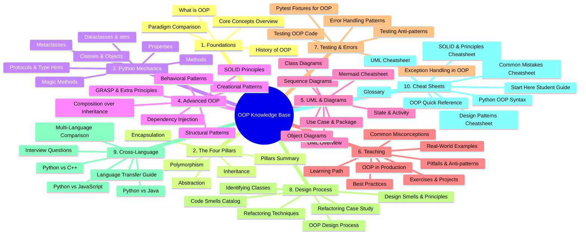
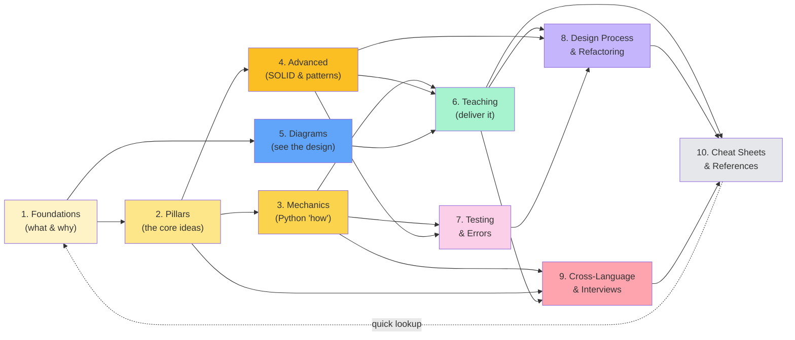
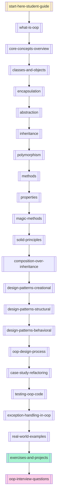

# 🧠 Object-Oriented Programming — Complete Teaching Pack

> [!quote] "The thing about Object-Oriented programming is — it's not a thing you do, it's a way you *think* about the problem."
> — A teaching motto for this vault.

Welcome to your **complete teaching-grade OOP knowledge base**. Everything here is written for an instructor **and** a self-learner: clear progressions, visual diagrams (Mermaid renders natively in Obsidian), runnable Python examples, anticipated student misconceptions, design walkthroughs, refactoring case studies, cross-language transfer guides, interview prep, and printable cheat sheets.

> [!success] First time here?
> Read [[start-here-student-guide]] first — it's your warm welcome, study plan, and orientation tour. Then come back here to navigate.

**Stats:** 62 notes + this MOC = **63 files** · **~49,500 lines** · **10 themed sections** · **390 Mermaid diagrams** · **966 Python code blocks**.

---

## 🗺️ The Knowledge Base at a Glance



---

## 🚀 Where Should I Start?

> [!tip] Choose your entry point
> - **Brand-new to OOP?** → [[start-here-student-guide]] → [[what-is-oop]] → [[core-concepts-overview]] → [[learning-path]]
> - **Teaching a course?** → [[learning-path]] (8-week syllabus) → [[common-misconceptions]] → [[exercises-and-projects]]
> - **Need a pattern reference?** → [[design-patterns-creational]] · [[design-patterns-structural]] · [[design-patterns-behavioral]] · [[design-patterns-cheatsheet]]
> - **Stuck on a Python detail?** → [[magic-methods]] · [[properties]] · [[metaclasses-and-class-creation]] · [[python-oop-syntax-cheatsheet]]
> - **Drawing diagrams?** → [[class-diagrams]] · [[mermaid-cheatsheet]] · [[uml-cheatsheet]]
> - **Reviewing/refactoring code?** → [[best-practices]] · [[code-smells-catalog]] · [[refactoring-techniques]] · [[common-mistakes-cheatsheet]]
> - **Coming from another language?** → [[language-transfer-guide]] · [[python-vs-java-oop]] · [[python-vs-cpp-oop]] · [[python-vs-javascript-oop]]
> - **Prepping for interviews?** → [[oop-interview-questions]] · [[solid-and-principles-cheatsheet]] · [[design-patterns-cheatsheet]]
> - **Testing your OOP code?** → [[testing-oop-code]] · [[pytest-fixtures-for-oop]] · [[exception-handling-in-oop]]
> - **Want a one-page reference?** → [[oop-quick-reference]] · [[glossary]]

---

## 📚 Section 1 — Foundations

> *What OOP is, where it came from, and why it won.*

| Note | What you'll learn |
|------|-------------------|
| [[what-is-oop]] | The three-layer definition, the object metaphor, why OOP beats procedural for complex systems |
| [[history-of-oop]] | Timeline from Simula (1967) → Smalltalk → C++ → Java → Python; Alan Kay's messaging vision |
| [[paradigm-comparison]] | The *same* bank-account problem solved procedurally, with OOP, and functionally — side by side |
| [[core-concepts-overview]] | The big-picture mind-map + a 44-term glossary + one-paragraph teasers of every pillar |

---

## 🏛️ Section 2 — The Four Pillars

> *The heart of OOP. Each pillar gets a deep, Python-first treatment.*

| Note | What you'll learn |
|------|-------------------|
| [[encapsulation]] | `_protected`, `__mangled`, `@property`; why properties beat getters/setters; invariant protection |
| [[abstraction]] | `abc` module, `@abstractmethod`, ABC vs Protocol; clarifying the abstraction-vs-encapsulation confusion |
| [[inheritance]] | All 5 inheritance types, MRO & C3 linearization, the diamond problem, cooperative `super()` |
| [[polymorphism]] | Duck typing, runtime binding, operator overloading; a full `Vector` class with 15+ dunders |
| [[four-pillars-summary]] | Master mind-map + an integrated **Library Management System** that exercises all four pillars |

---

## 🐍 Section 3 — Python OOP Mechanics

> *The "how" of OOP in Python — the gritty, beautiful details.*

| Note | What you'll learn |
|------|-------------------|
| [[classes-and-objects]] | Class anatomy, `self` demystified, object lifecycle (`__new__`→`__init__`→`__del__`), `is` vs `==` |
| [[methods]] | Instance / class / static methods, the descriptor protocol, cooperative `super()` & MRO |
| [[properties]] | `@property` getter/setter/deleter, validation, `cached_property`, API-preserving migration |
| [[magic-methods]] | The complete dunder catalog + a capstone `Vector` and `Matrix` class |
| [[dataclasses-and-attrs]] | `@dataclass` (frozen / slots / `__post_init__`) vs `NamedTuple` vs `attrs` |
| [[metaclasses-and-class-creation]] | `type(name, bases, dict)`, `__init_subclass__`, custom metaclasses (with appropriate warnings) |
| [[protocols-and-type-hints]] | `typing.Protocol`, structural vs nominal subtyping, `Self`, `ClassVar`, generics, `@overload` |

---

## 🎓 Section 4 — Advanced OOP

> *SOLID, the GoF design patterns, and the principles that separate journeymen from masters.*

| Note | What you'll learn |
|------|-------------------|
| [[solid-principles]] | All 5 SOLID principles — each with a violation example, a fix, and a Mermaid diagram |
| [[design-patterns-creational]] | Singleton, Factory Method, Abstract Factory, Builder, Prototype |
| [[design-patterns-structural]] | Adapter, Bridge, Composite, Decorator (GoF *and* Python `@decorator`), Facade, Flyweight, Proxy |
| [[design-patterns-behavioral]] | Chain of Responsibility, Command, Iterator, Mediator, Memento, Observer, State, Strategy, Template Method, Visitor |
| [[composition-over-inheritance]] | Why "favor composition over inheritance"; a full refactoring walkthrough |
| [[dependency-injection]] | Constructor/setter/method injection; a 50-line DI container; DI vs Service Locator |
| [[grasp-and-extra-principles]] | All 9 GRASP patterns, Law of Demeter, Tell-Don't-Ask, DRY/KISS/YAGNI |

---

## 📐 Section 5 — UML & Visual Diagrams

> *OOP is profoundly visual. This section teaches you to see it.*

| Note | What you'll learn |
|------|-------------------|
| [[uml-overview]] | The 14 UML diagram types, which 6 matter for OOP, and the tools to draw them |
| [[class-diagrams]] | The most important OOP diagram — anatomy, visibility, **all 6 relationship types** with examples |
| [[object-diagrams]] | Snapshots of instances; great for teaching references, aliasing, shared state |
| [[sequence-diagrams]] | Object interactions over time; 3 worked examples incl. polymorphic dispatch |
| [[state-and-activity-diagrams]] | State machines for object lifecycles; activity diagrams for behavior flow |
| [[use-case-and-package-diagrams]] | System scope & module/layer grouping |
| [[mermaid-cheatsheet]] | Complete syntax reference for every Mermaid diagram type used in this vault |

---

## 👨‍🏫 Section 6 — Teaching Guide

> *Pedagogy, pitfalls, best practices, and real-world code to make OOP click for your students.*

| Note | What you'll learn |
|------|-------------------|
| [[learning-path]] | An 8-week teaching syllabus with pedagogical principles & a spiral curriculum |
| [[common-misconceptions]] | 15 student misconceptions, each with the correction and a teaching tip |
| [[common-pitfalls-and-anti-patterns]] | 16 anti-patterns with bad/good code & Mermaid before/after diagrams |
| [[best-practices]] | 11 Pythonic OOP practices + a code-review checklist |
| [[real-world-examples]] | 5 complete mini-projects: banking, e-commerce, plugin editor, game ECS, config system |
| [[oop-in-production]] | How Django, SQLAlchemy, requests, pandas, pytest, and the stdlib actually use OOP |
| [[exercises-and-projects]] | 10 warm-ups + 5 intermediates + 3 capstone projects with rubrics |

---

## 🧪 Section 7 — Testing & Error Handling

> *Testable OOP is good OOP. Errors are objects too.*

| Note | What you'll learn |
|------|-------------------|
| [[testing-oop-code]] | Why OOP is testable by design; test doubles taxonomy; `unittest.mock`; TDD on a class |
| [[pytest-fixtures-for-oop]] | Fixtures as dependency injection; scopes; parametrized factory fixtures for polymorphic hierarchies |
| [[exception-handling-in-oop]] | Exceptions as objects; the built-in hierarchy; custom domain exception families; context managers; EAFP |
| [[error-handling-patterns]] | Null Object, Result/Either, Sentinel, Builder-for-validation, defensive copy, Tell-Don't-Ask |
| [[testing-anti-patterns]] | 10 test smells with bad/good refactors + an 18-item code-review checklist |

---

## 🛠️ Section 8 — Design Process & Refactoring

> *The "missing manual": how to actually go from a requirement to a good class design — and how to fix a bad one.*

| Note | What you'll learn |
|------|-------------------|
| [[oop-design-process]] | The full 8-step workflow from requirements to classes; CRC cards; a movie-ticket-booking walkthrough |
| [[identifying-classes-and-responsibilities]] | How to know what classes to make — noun extraction, use-case analysis, RDD, decision heuristics |
| [[code-smells-catalog]] | All 22 Fowler code smells across 5 families, each with a Python before/after |
| [[refactoring-techniques]] | 24 Fowler refactorings with step-by-step mechanics and Python before/after |
| [[case-study-refactoring]] | End-to-end refactor of a 150-line God class → 12-class SOLID design with Strategy + Factory + Observer |
| [[design-smells-and-principles]] | Robert Martin's 7 design smells; connascence (Page-Jones); SDP & SAP |

---

## 🌍 Section 9 — Cross-Language & Interview Prep

> *OOP across languages — for transfer students and job-seekers.*

| Note | What you'll learn |
|------|-------------------|
| [[python-vs-java-oop]] | Side-by-side Python vs Java: access control, interfaces, inheritance, generics, type systems |
| [[python-vs-cpp-oop]] | Value vs reference, `virtual` vs always-virtual, RAII, templates, memory models |
| [[python-vs-javascript-oop]] | Prototype-based vs class-based OOP; `this` vs `self`; ES6 `class` under the hood |
| [[multi-language-comparison]] | Grand comparison across Python, Java, C++, C#, JS, Ruby, Go — same example in 5 languages |
| [[oop-interview-questions]] | ~70 interview questions with model answers + a 7-step design-question framework + 1/2/4-week study plans |
| [[language-transfer-guide]] | Per-source-language transfer guides (Java, C++, JS, C#, Go, Ruby → Python) |

---

## 📇 Section 10 — Cheat Sheets & Quick References

> *Tear-out reference cards. Dense, scannable, printable. Keep these open while you code.*

| Note | What you'll learn |
|------|-------------------|
| [[start-here-student-guide]] | ⭐ **Start here!** Warm welcome, study plan, Obsidian how-to, top-10 notes, pre-test |
| [[oop-quick-reference]] | One-page dense card: pillars + SOLID + GoF + Python syntax + UML + dunder list |
| [[python-oop-syntax-cheatsheet]] | Pure Python OOP syntax — every keyword, decorator, dunder, with copy-pasteable snippets |
| [[design-patterns-cheatsheet]] | All 23 GoF patterns: intent + tiny Mermaid + 5-line Python skeleton + when to use / not use |
| [[solid-and-principles-cheatsheet]] | SOLID + GRASP + DRY/KISS/YAGNI/LoD — principle → smell → refactoring lookup |
| [[uml-cheatsheet]] | UML + Mermaid syntax quick reference; "I want to show X, use Y" lookup |
| [[common-mistakes-cheatsheet]] | Top 30 OOP/Python mistakes as ❌ bad → ✅ good → one-line why |
| [[glossary]] | 170+ A-Z terms, each with a one-line definition and a wikilink to the deep dive |

---

## 🔗 How the Sections Connect



---

## 🎯 The Four Pillars — One-Page Teaser

> [!example] If you only read four things, read these.
> ```python
> # Encapsulation — bundle state + behavior, control access
> class BankAccount:
>     def __init__(self, owner: str) -> None:
>         self.owner = owner
>         self._balance: float = 0.0          # protected by convention
>     @property
>     def balance(self) -> float:               # controlled read access
>         return self._balance
>     def deposit(self, amount: float) -> None:
>         if amount <= 0:
>             raise ValueError("amount must be positive")
>         self._balance += amount
> ```
>
> ```python
> # Abstraction — expose essentials, hide complexity
> from abc import ABC, abstractmethod
> class PaymentProcessor(ABC):
>     @abstractmethod
>     def charge(self, amount: float) -> bool: ...
> class CreditCard(PaymentProcessor):
>     def charge(self, amount: float) -> bool:
>         # concrete implementation hidden behind the abstraction
>         ...
> ```
>
> ```python
> # Inheritance — derive new classes, reuse & specialize
> class Animal:
>     def __init__(self, name: str) -> None: self.name = name
>     def speak(self) -> str: return "..."
> class Dog(Animal):
>     def speak(self) -> str: return f"{self.name} says Woof!"
> ```
>
> ```python
> # Polymorphism — same interface, many forms
> def make_speak(animal: Animal) -> str:
>     return animal.speak()                     # runtime dispatch
> ```

---

## 📖 Recommended Reading Order (for a new learner)



---

## 🧰 Quick-Reference Panels

### The SOLID Principles
| Letter | Principle | One-liner |
|:---:|---|---|
| **S** | Single Responsibility | A class should have one reason to change |
| **O** | Open/Closed | Open for extension, closed for modification |
| **L** | Liskov Substitution | Subtypes must be substitutable for their base types |
| **I** | Interface Segregation | Many specific interfaces > one fat interface |
| **D** | Dependency Inversion | Depend on abstractions, not concretions |

> [!tip] Deep dive: [[solid-principles]] · Quick card: [[solid-and-principles-cheatsheet]]

### The GoF Design Patterns
| Category | Patterns |
|---|---|
| **Creational** | Singleton · Factory Method · Abstract Factory · Builder · Prototype — see [[design-patterns-creational]] |
| **Structural** | Adapter · Bridge · Composite · Decorator · Facade · Flyweight · Proxy — see [[design-patterns-structural]] |
| **Behavioral** | Chain of Resp · Command · Iterator · Mediator · Memento · Observer · State · Strategy · Template Method · Visitor — see [[design-patterns-behavioral]] |

> [!tip] Quick card: [[design-patterns-cheatsheet]]

### UML Relationship Cheat-Sheet
| Relationship | Symbol | Meaning |
|---|:---:|---|
| Inheritance | ▷── | "is-a" |
| Realization | ▷┄┄ | "implements" |
| Composition | ◆── | "owns" (lifecycle bound) |
| Aggregation | ◇── | "has-a" (shared) |
| Association | ─── | "uses" |
| Dependency | ┄┄> | "temporarily uses" |

> [!tip] Full details: [[class-diagrams]] · Quick card: [[uml-cheatsheet]]

---

## 🧪 Practice & Capstone

- 10 warm-up exercises: [[exercises-and-projects#Warm-up Exercises]]
- 5 intermediate exercises: [[exercises-and-projects#Intermediate Exercises]]
- 3 capstone projects (with rubrics): [[exercises-and-projects#Capstone Projects]]
- 5 full real-world mini-projects: [[real-world-examples]]
- ~70 interview questions with model answers: [[oop-interview-questions]]

---

## 🗂️ Tag Index

This vault uses these tags throughout (use Obsidian's tag pane to filter):

- `#oop` — every note
- `#foundation` · `#pillars` · `#mechanics` · `#advanced` · `#diagrams` · `#teaching` · `#testing` · `#design-process` · `#cross-language` · `#cheatsheet` — by section
- `#python` · `#python-oop` — Python-specific content
- `#solid` · `#design-patterns` · `#uml` · `#mermaid` — by topic
- `#anti-pattern` · `#best-practice` · `#misconception` · `#code-smell` · `#refactoring` — for code-review & teaching
- `#beginner` · `#intermediate` · `#advanced-level` — by difficulty
- `#interview` — interview prep material

---

## 📝 How to Use This Vault in Obsidian

> [!note] Setup tips
> 1. **Drop the `oop-knowledge-base/` folder into your Obsidian vault.**
> 2. Settings → Community plugins → enable **Mermaid** (it's built-in by default; just make sure "Strict line breaks" is OFF for best diagram rendering).
> 3. Open this `MOC.md` **and** [[start-here-student-guide]] — pin both (right-click tab → Pin). They're your home bases.
> 4. Use the **Graph View** — the wikilinks create a beautiful interconnected map of all 63 notes.
> 5. Star the notes you teach most often for quick access.
> 6. Every note has YAML frontmatter, so the **Properties** panel works out of the box.
> 7. Use the **Backlinks** panel constantly — it shows "who points to this note", invaluable for lesson prep.
> 8. For daily study: open [[start-here-student-guide]], follow the 8-week plan, do exercises in a Daily Note.

> [!tip] For instructors
> - The [[learning-path]] note has a ready-to-use 8-week syllabus.
> - [[common-misconceptions]] is your secret weapon — read it before every cohort.
> - [[exercises-and-projects]] has rubrics for capstone grading.
> - [[oop-interview-questions]] doubles as an exam-question bank.

---

## 🔄 Maintenance

This knowledge base was generated by **10 parallel research agents**. The worklog lives at `/home/z/my-project/worklog.md`. To extend it:
- Add new notes in the appropriate section folder
- Add a wikilink row to the matching section table above
- Update the mind-map at the top if you add a whole new section
- Add new terms to [[glossary]]

---

## 📊 Vault Statistics

| Metric | Count |
|---|---|
| Total notes | 63 (incl. this MOC) |
| Total lines | ~49,500 |
| Mermaid diagrams | 390 |
| Python code blocks | 966 |
| Sections | 10 |
| Practice exercises | 100+ |
| Real-world projects | 5 |
| Interview questions | ~70 |
| Cheat sheets | 8 |
| Glossary terms | 170+ |

---

> [!success] Happy teaching, happy learning!
> OOP rewards the patient. Teach the **why** before the **how**, lean on diagrams, and let students break things in the practice exercises. Start with [[start-here-student-guide]] and follow the path — you'll come out the other side thinking in objects.

*Last updated: 2025-01-01 · 63 notes · ~49,500 lines · 390 Mermaid diagrams · 966 Python code blocks · Built by 10 research agents*
