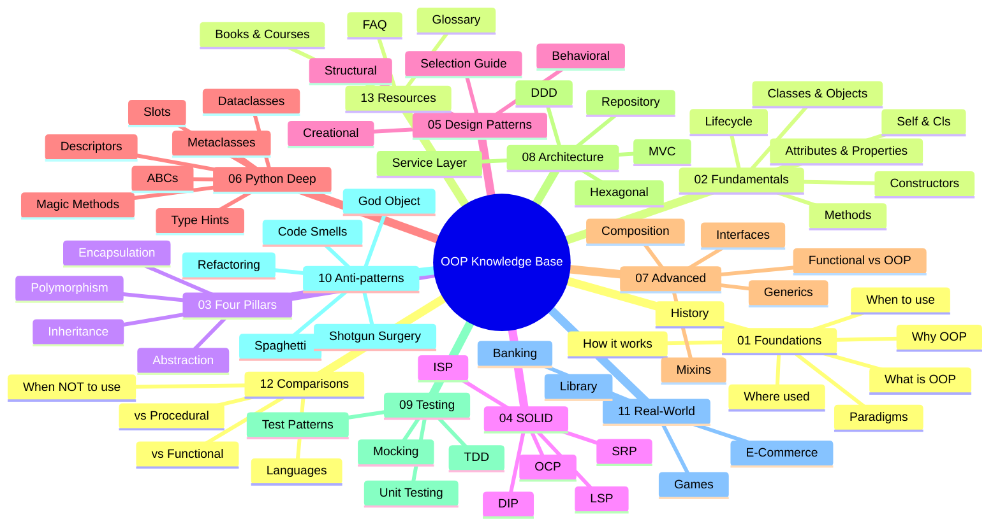

# OOP Knowledge Base — Home

#oop #vault #index #teaching #home

> [!quote] Grady Booch
> "The naked objects in a system are far less important than the relationships between them."

Welcome to the **OOP Knowledge Base** — a curated, deep-dive Obsidian vault covering **Object-Oriented Programming** from first principles to advanced architecture, written in Python but applicable across every mainstream OO language. This vault is built for *teaching*: every note is structured so that an instructor can lift it into a lecture, a student can self-study from it, and a working developer can use it as a reference long after the course is over.

If you have five minutes, scroll through the mindmap below and the four learning paths. If you have five months, follow the **Complete Beginner Path** end-to-end. Either way, this README is your front door — bookmark it, and come back whenever you are lost.

---

## 1. What This Vault Covers

This vault is organised into **17 thematic sections**, containing **84 deep notes** totalling **~400,000 words** with **~545 Mermaid diagrams**. Together they form a complete curriculum for understanding, applying, teaching, and reasoning about OOP. The structure mirrors the natural learning journey: *what* OOP is, *why* it exists, *how* it works mechanically, *how* to design well with it, and *how* it plays out in real codebases.



### At a glance

| Section | Topic | Notes | Best for |
| --- | --- | --- | --- |
| [[00-Map-of-Content\|00 — MOC]] | Master index | — | Navigation |
| [[01-Foundations/What-Is-OOP\|01 — Foundations]] | What/Why/When/Where/How/History/Paradigms | 7 | Everyone |
| [[02-Fundamentals/Classes-And-Objects\|02 — Fundamentals]] | Classes, attributes, methods, constructors, lifecycle, `self`/`cls` | 6 | Beginners |
| [[03-Four-Pillars/Encapsulation\|03 — Four Pillars]] | Encapsulation, Inheritance, Polymorphism, Abstraction | 4 | Beginners |
| [[04-SOLID-Principles/SOLID-Overview\|04 — SOLID]] | SRP, OCP, LSP, ISP, DIP | 6 | Intermediate |
| [[05-Design-Patterns/Creational-Patterns\|05 — Design Patterns]] | Creational, Structural, Behavioral, selection | 4 | Intermediate |
| [[06-Python-OOP-Deep/Magic-Methods\|06 — Python OOP Deep]] | Magic methods, metaclasses, descriptors, dataclasses, ABCs, type hints, slots | 7 | Intermediate→Advanced |
| [[07-Advanced-Concepts/Composition-Over-Inheritance\|07 — Advanced]] | Composition, interfaces, mixins, generics, FP vs OOP | 5 | Advanced |
| [[08-Architecture/MVC-Pattern\|08 — Architecture]] | MVC, Repository, Service Layer, DDD, Hexagonal | 5 | Advanced |
| [[09-Testing/Unit-Testing-OOP\|09 — Testing]] | Unit tests, mocking, TDD, test patterns | 4 | All levels |
| [[10-Antipatterns/Code-Smells\|10 — Anti-patterns]] | Code smells, God object, Spaghetti, Shotgun Surgery, Refactoring | 5 | Intermediate→Advanced |
| [[11-Real-World/Banking-System-Example\|11 — Real-World]] | Banking, E-Commerce, Games, Library | 4 | Applied learning |
| [[12-Comparisons/OOP-Vs-Functional\|12 — Comparisons]] | OOP vs FP vs Procedural, languages, when not to use | 4 | Decision-making |
| [[13-Resources/Books-And-Courses\|13 — Resources]] | Books, courses, glossary, FAQ | 3 | Reference |

---

## 2. Who This Vault Is For

This is not a textbook replacement; it is a *curriculum in notebook form*. The three primary audiences are:

### 2.1 Students and Self-Learners

If you are learning OOP for the first time, the **Complete Beginner Path** (below) is your route. The notes are written assuming you can already program in *some* language — variables, loops, functions — but have never written a serious class hierarchy. Every concept is introduced with a runnable Python example, a common misconception callout, and a set of practice exercises. The four pillars are covered with enough depth to make them *stick*, not just pass an exam.

### 2.2 Teachers and Instructors

If you are teaching OOP — at a university, a bootcamp, or a corporate onboarding — every note has been structured to be lifted directly into a lecture. Look for the `> [!tip] Teaching Tip` and `> [!warning] Common Student Misconception` callouts. The four learning paths at the bottom of this README can be turned into syllabi: each path lists the notes in the order a learner should read them, with rough time estimates.

> [!tip] Teaching Tip
> Use the [[00-Map-of-Content]] as your lesson-planning dashboard. Each section table tells you what each note covers in one line, so you can pick the minimum viable subset for your time slot. A 12-week semester can cover Sections 01–07 with two weeks for projects; a weekend workshop can cover Sections 02–03 plus a single real-world example from Section 11.

### 2.3 Working Developers

If you already write OOP for a living, you will find Sections 04 (SOLID), 05 (Design Patterns), 06 (Python Deep), 08 (Architecture), and 10 (Anti-patterns) most valuable. The deep notes on [[Descriptors]], [[Metaclasses]], and [[Composition-Over-Inheritance]] are the ones that tend to flip on lightbulbs even for senior engineers. Use the [[FAQ]] for quick lookups, and [[Glossary]] as a vocabulary refresher before a job interview.

### 2.4 Interview Candidates

See the **Interview Prep Path** below. The vault maps cleanly onto the OOP content of most software-engineering interviews: the four pillars, SOLID, a handful of patterns (Singleton, Factory, Observer, Strategy, Decorator), and a few "explain it like I'm five" questions. The FAQ has dedicated sections for the questions that come up most often.

---

## 3. How to Navigate This Vault

This is an Obsidian vault, which means it is designed to be navigated through three complementary mechanisms: **the MOC**, **the graph view**, and **tags**. You do not need to read the notes in order — in fact, you probably should not.

### 3.1 The Map of Content

The [[00-Map-of-Content]] is the master index. It lists every note in every section, with a one-line description of each, and includes decision trees for "I want to learn about X — where do I start?" Always keep a tab open on the MOC; it is the closest thing this vault has to a homepage.

### 3.2 Wikilinks and Backlinks

Every note contains `[[Wikilinks]]` to related notes. Clicking a link jumps you to that note; pressing `Alt+←` (or `Cmd+←` on macOS) jumps back. More importantly, every note has a **backlinks panel** in the right sidebar — this shows you every other note that links *to* the current note. Backlinks are how you discover non-obvious connections: the note on [[Encapsulation]] is linked from [[SOLID-Overview]], [[Composition-Over-Inheritance]], [[Code-Smells]], and a dozen others, which tells you that encapsulation is a load-bearing concept across the whole vault.

### 3.3 The Graph View

Press `Ctrl+G` (or `Cmd+G`) to open graph view. The graph visualises every note as a node and every wikilink as an edge. Use graph view to:

- **Find orphans** — notes with no incoming links (these usually need cross-references added).
- **Find hubs** — notes with many incoming links (these are foundational concepts; mastering them pays off disproportionately).
- **See the shape of the curriculum** — the four-pillars cluster, the SOLID cluster, the Python-deep cluster are all visible.

> [!info] Recommended Graph Filters
> Set color by `tag` and filter by `folder` to see clusters. Turn on "existing files only" to hide broken links. Reduce "link force" to 0.3 for a more readable layout.

### 3.4 Tags

Every note carries inline tags (e.g. `#oop #four-pillars #encapsulation`) and YAML frontmatter tags. Use the tag pane on the left sidebar to browse by topic. The most useful tags are:

- `#foundations` — conceptual and philosophical notes
- `#four-pillars` — the four classical pillars
- `#solid` — SOLID principles
- `#design-pattern` — GoF and modern patterns
- `#python` — Python-specific deep notes
- `#advanced` — concepts that build on the basics
- `#architecture` — system-level patterns
- `#testing` — testing-related notes
- `#anti-pattern` — code smells and refactoring
- `#teaching` — notes with explicit pedagogical content
- `#deep-dive` — long-form, comprehensive notes

### 3.5 Search

Press `Ctrl+Shift+F` for global search. The vault is small enough (~50 notes) that full-text search is usually faster than navigating the MOC.

---

## 4. Suggested Learning Paths

Different readers come to this vault with different goals. Below are four curated paths through the material. Each path is also represented as a flowchart to give you a visual sense of the journey.

### 4.1 Complete Beginner Path

**Audience**: You can write a for loop but have never written a class.
**Time**: ~25–30 hours of focused study.
**Outcome**: You can model a small domain (e.g. a library, a bank account) as a class hierarchy with proper encapsulation and one or two design patterns.


**Reading order**:

1. [[What-Is-OOP]] — definitions, mental model, misconceptions
2. [[Why-OOP]] — motivation, before/after examples
3. [[How-OOP-Works]] — what happens under the hood when you call a method
4. [[Classes-And-Objects]] — the cookie-cutter metaphor, anatomy of a class
5. [[Attributes-And-Properties]] — instance vs class attributes, `@property`
6. [[Methods-And-Functions]] — instance, class, static, abstract methods
7. [[Constructors-And-Destructors]] — `__new__` vs `__init__`, lifecycle
8. [[Self-And-Cls]] — why `self` exists and what `cls` means
9. [[Encapsulation]] — the first pillar; properties, access control
10. [[Inheritance]] — the second pillar; subclasses, `super()`
11. [[Polymorphism]] — the third pillar; duck typing, LSP
12. [[Abstraction]] — the fourth pillar; ABCs, abstract methods
13. [[Banking-System-Example]] — a small, complete, runnable example
14. [[FAQ]] — common beginner questions answered

### 4.2 Intermediate Developer Path

**Audience**: You have been writing classes for a year or two but want to level up your design.
**Time**: ~20 hours.
**Outcome**: You can apply SOLID, choose appropriate design patterns, and read Python metaclass code without panicking.


**Reading order**:

1. [[SOLID-Overview]] → [[Single-Responsibility]] → [[Open-Closed]] → [[Liskov-Substitution]] → [[Interface-Segregation]] → [[Dependency-Inversion]]
2. [[Composition-Over-Inheritance]] — the modern alternative to deep hierarchies
3. [[Interfaces-And-Protocols]] — ABCs vs `Protocol` (PEP 544)
4. [[Mixins-And-Multiple-Inheritance]] — when mixins help and when they hurt
5. [[Creational-Patterns]] → [[Structural-Patterns]] → [[Behavioral-Patterns]] → [[Pattern-Selection-Guide]]
6. [[Magic-Methods]] — the Python data model
7. [[Descriptors]] — the secret behind `@property`, `@classmethod`, ORM fields
8. [[Code-Smells]] → [[Refactoring-Strategies]] — diagnose and fix bad code

### 4.3 Teacher / Instructor Path

**Audience**: You are designing an OOP course or workshop.
**Time**: ~10 hours of reading + planning.
**Outcome**: You have a syllabus, a set of teaching examples, and a list of common student misconceptions to pre-empt.


**Reading order**:

1. This README and the [[00-Map-of-Content]]
2. [[What-Is-OOP]] and [[Why-OOP]] — the conceptual framing
3. [[FAQ]] — especially the **Teaching Questions** section
4. [[Glossary]] — pick the terms you will need to define for your students
5. Two real-world examples ([[Banking-System-Example]], [[E-Commerce-Example]]) — use as class exercises
6. [[Code-Smells]] and [[Refactoring-Strategies]] — for "what bad OOP looks like" lessons

### 4.4 Interview Prep Path

**Audience**: You have an interview in a week and need to brush up on OOP.
**Time**: ~6–8 hours.
**Outcome**: You can confidently answer any OOP question a typical interviewer will throw at you.


**Reading order**:

1. [[What-Is-OOP]] — refresher on definitions
2. [[Encapsulation]] → [[Inheritance]] → [[Polymorphism]] → [[Abstraction]]
3. [[SOLID-Overview]] and all five SOLID notes — these come up *constantly*
4. [[Creational-Patterns]], [[Structural-Patterns]], [[Behavioral-Patterns]] — know the names and the *intent* of each
5. [[Glossary]] — vocabulary drill
6. [[FAQ]] — the beginner/intermediate/advanced sections cover most interview questions

---

## 5. Vault Statistics

> [!info] Snapshot
> This vault contains **84 notes** across **17 sections**, totalling roughly **~400,000 words** and **~545 Mermaid diagrams**. Every note includes YAML frontmatter, inline tags, callouts, and wikilinks. Cross-references number in the thousands — the vault is designed to be navigated, not read linearly.

| Metric | Value |
| --- | --- |
| Total notes | 84 |
| Total sections | 17 |
| Total words (approx.) | ~400,000 |
| Mermaid diagrams | ~545 |
| Code examples | 700+ runnable Python snippets |
| Callouts | 900+ (`info`, `tip`, `warning`, `danger`, `example`, `quote`, `success`, `note`) |
| Glossary terms | 100+ |
| FAQ entries | 36+ |
| Wikilinks | ~2,500 (fully cross-linked) |

The four largest notes (each 5,000+ words) are the **Foundations** set — [[What-Is-OOP]], [[Why-OOP]], [[How-OOP-Works]], [[History-Of-OOP]] — and the **Four Pillars** set — [[Encapsulation]], [[Inheritance]], [[Polymorphism]], [[Abstraction]]. These are the load-bearing walls of the vault. If you read only eight notes, read those.

---

## 6. Obsidian Setup Tips

This vault is plain Markdown — it works in any text editor — but it is *designed* for Obsidian. Here is how to get the most out of it.

### 6.1 Installation

1. Download Obsidian from <https://obsidian.md>.
2. Open Obsidian and choose **Open folder as vault**.
3. Select the `oop-knowledge-base/` directory.

### 6.2 Recommended Settings

- **Editor → Default view for new tabs**: `Editing view` (so you see rendered Markdown immediately).
- **Editor → Show line number**: on (helpful when discussing code in class).
- **Files & Links → Default location for new attachments**: `In subfolder under current folder` named `assets`.
- **Appearance → Theme**: `Minimal` or `Things` — both render callouts and Mermaid cleanly.
- **Core Plugins → Enable**: Backlinks, Outgoing links, Graph view, Tag pane, Page preview, Templates, Command palette.
- **Community Plugins → Recommended**:
  - **Dataview** — for dynamic indexes (the MOC has optional Dataview blocks)
  - **Mermaid Tools** — better Mermaid rendering and zoom
  - **Templater** — for new-note scaffolding
  - **Excalidraw** — for hand-drawn diagrams
  - **Admonition** (or use the native callout syntax used throughout this vault)

### 6.3 Keyboard Shortcuts Worth Memorising

| Shortcut | Action |
| --- | --- |
| `Ctrl/Cmd + O` | Quick open any note by name |
| `Ctrl/Cmd + Shift + F` | Global search |
| `Ctrl/Cmd + G` | Graph view |
| `Alt/Option + ←` | Navigate back |
| `Alt/Option + →` | Navigate forward |
| `Ctrl/Cmd + K` | Insert wikilink |
| `Ctrl/Cmd + E` | Toggle edit/preview |
| `Ctrl/Cmd + P` | Command palette |

### 6.4 Reading Order Tip

Obsidian does not enforce an order. If you feel overwhelmed, start at the [[00-Map-of-Content]], pick *one* section, and read it linearly. Then jump to a related section using the `related:` links in the frontmatter.

---

## 7. Conventions Used in This Vault

Every note in this vault follows the same template, so once you have read two or three, the rest will feel familiar.

### 7.1 Frontmatter

```yaml
---
title: Note Title
tags: [oop, ...]
aliases: [...]
related:
  - "[[Other-Note]]"
created: YYYY-MM-DD
updated: YYYY-MM-DD
---
```

### 7.2 Callouts

- `> [!info]` — definitions, context, TL;DR
- `> [!tip]` — teaching tips, ways to explain the concept
- `> [!warning]` — common student misconceptions
- `> [!danger]` — sharp edges, production pitfalls
- `> [!example]` — runnable code, before/after
- `> [!quote]` — authoritative definitions from books or papers
- `> [!success]` — when you have done it right
- `> [!note]` — sidebars and asides

### 7.3 Code Blocks

All code is Python 3.10+. Long examples are broken into numbered iterations (V1, V2, V3, ...) so the evolution of a design is visible. Every example is runnable unless marked otherwise.

### 7.4 Mermaid Diagrams

Diagrams use `flowchart`, `classDiagram`, `sequenceDiagram`, `stateDiagram`, `mindmap`, `timeline`, `quadrantChart`, `journey`, `gantt`, and `gitGraph` — whichever best fits the concept. Every diagram has a caption and a one-sentence "what to look for" note.

---

## 8. A Note on Scope and Bias

This vault is Python-first. Every code example is in Python, and several notes (Section 06 in particular) are Python-specific. However, the *concepts* are universal — Encapsulation is Encapsulation whether you write it in Python, Java, C++, or Rust. Where Python's implementation differs materially from other languages (e.g. no true method overloading, no true private), the notes say so explicitly and link to the relevant cross-language comparison.

The vault also has a point of view. It favours **composition over inheritance**, **small interfaces**, **explicit over implicit**, and **functional core / imperative shell**. These are not the only defensible positions, but they are the ones the author has found produce the most maintainable code over decades of practice. Where alternative viewpoints are strong, they are presented fairly — see especially [[Composition-Over-Inheritance]] and [[When-Not-To-Use-OOP]].

> [!quote] Sandi Metz
> "Design is the art of arranging code that works today and is easy to change forever."

---

## 9. Where to Go Next

- **If you are new**: read [[What-Is-OOP]] first, then follow the [Complete Beginner Path](#41-complete-beginner-path).
- **If you are teaching**: read [[FAQ]] (especially the Teaching Questions), then the [[00-Map-of-Content]].
- **If you are prepping for an interview**: jump to [[FAQ]] and [[Glossary]], and skim the SOLID notes.
- **If you just want to look something up**: use `Ctrl+Shift+F` to search, or browse the [[Glossary]].

---

## 10. Credits and License

This vault was built as a teaching resource. Definitions and quotations are attributed to their original sources. Code examples are original or adapted from cited sources. Mermaid diagrams are original.

> [!success] That's it.
> Open the [[00-Map-of-Content]] and start exploring. If you get lost, come back here — the README is always a safe harbour.
