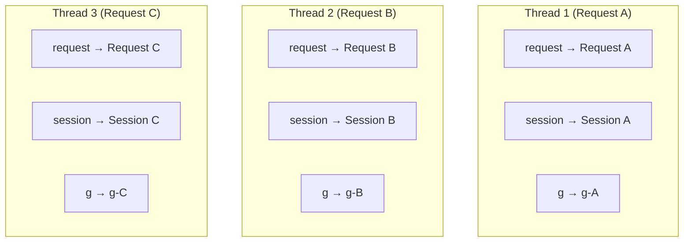
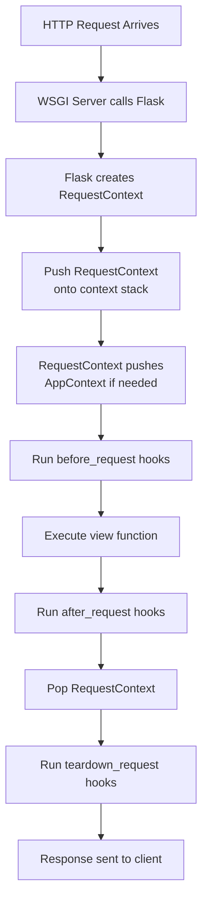

# Request Context

> The request context is Flask's mechanism for making request data available throughout your application without passing it through every function call. Understanding how contexts work — and when they are active — is essential for debugging, testing, and building clean Flask applications.

## Learning Objectives

After completing this chapter, you will be able to:

- Explain what a request context is and why Flask needs it
- Describe how thread-local storage enables the `request` proxy object
- Push and pop request contexts manually for testing and background tasks
- Understand the difference between request and application contexts
- Debug `RuntimeError: Working outside of request context`
- Use `g` for request-scoped temporary storage

## The Problem

In a web application, you need access to request data throughout your code — in view functions, template filters, error handlers, and utility functions. Passing `request` as an argument to every function would be verbose and error-prone:

```python
# Without context locals — tedious and impractical
def get_user(request):
    token = request.headers.get('Authorization')
    return authenticate(token)

def render_template(request, template_name):
    return template.render(user=request.user)

@app.route('/')
def index():
    user = get_user(request)           # Pass request
    return render_template(request, 'index.html')  # Pass request again
```

Flask solves this with **context locals** — thread-bound storage that makes `request` available anywhere during a request.

## What Is a Request Context?

A **request context** is an object that encapsulates all request-related state. When a request arrives, Flask pushes a request context. When the request completes, Flask pops it.

During the lifetime of a request context, the following objects are available:

| Object | Purpose |
|--------|---------|
| `request` | The current HTTP request |
| `session` | The user's session (signed cookie) |
| `g` | Request-scoped temporary storage |

```python
from flask import request, session, g

@app.route('/example')
def example():
    # All three are available because we're inside a request context
    print(request.path)
    print(session.get('user_id'))
    g.start_time = time.time()
    return 'OK'
```

## How Thread Locals Work

Flask uses Werkzeug's `Local` and `LocalStack` classes to store contexts per-thread:



Each thread sees its own `request`, `session`, and `g`. They do not interfere with each other.

### The Proxy Mechanism

`request` is not actually a `Request` object. It is a **proxy** that forwards attribute access to the real request on the context stack:

```python
# request is a LocalProxy
request.path
# Internally: _request_ctx_stack.top.request.path
```

This is why `request` works anywhere during a request but raises `RuntimeError` outside one.

## The Request Context Lifecycle



### Manual Context Management

Normally, Flask handles context pushing/popping automatically. But you sometimes need to do it manually:

#### Testing

```python
with app.test_request_context('/hello?name=John'):
    # Inside request context
    assert request.path == '/hello'
    assert request.args['name'] == 'John'

# Context is automatically popped
```

#### Background Tasks

```python
with app.app_context():
    # Need application context for database access
    users = User.query.all()
```

#### CLI Commands

```python
@app.cli.command()
def list_routes():
    # Flask automatically pushes app context for CLI commands
    for rule in app.url_map.iter_rules():
        print(rule)
```

## `g`: The Request-Scoped Storage

`g` is an object for storing data during a request. Unlike `session`, it is not persisted across requests. Unlike global variables, it is scoped to the current request context.

### Common Uses for `g`

```python
from flask import g

@app.before_request
def load_current_user():
    """Load user once per request, cache in g."""
    user_id = session.get('user_id')
    if user_id:
        g.current_user = User.query.get(user_id)
    else:
        g.current_user = None

@app.route('/profile')
def profile():
    if g.current_user is None:
        return redirect(url_for('login'))
    return f'Hello, {g.current_user.name}'
```

### `g` vs. Global Variables

| Aspect | `g` | Global Variable |
|--------|-----|-----------------|
| Scope | Per-request | Global (all requests) |
| Thread-safe | Yes | No |
| Persistence | Request only | Process lifetime |
| Use case | Request-scoped caching | Configuration, shared state |

### Pattern: Request-Scoped Database Connection

```python
from flask import g

def get_db():
    """Get database connection, creating it if needed."""
    if 'db' not in g:
        g.db = sqlite3.connect(app.config['DATABASE'])
        g.db.row_factory = sqlite3.Row
    return g.db

@app.teardown_request
def close_db(exception=None):
    """Close database connection at end of request."""
    db = g.pop('db', None)
    if db is not None:
        db.close()

@app.route('/users')
def list_users():
    db = get_db()
    users = db.execute('SELECT * FROM users').fetchall()
    return jsonify([dict(row) for row in users])
```

## Common Errors

### `RuntimeError: Working outside of request context`

```python
# This raises RuntimeError
print(request.path)  # No request context active!
```

**Causes:**
- Accessing `request` outside a view function without pushing a context
- Background threads trying to access request data
- Attempting to use `url_for()` with `_external=True` outside a request context

**Solutions:**

```python
# For testing
with app.test_request_context():
    print(request.path)

# For background tasks, use app_context instead
with app.app_context():
    # Can use current_app, database, etc.
    pass

# For url_for outside request context
with app.test_request_context():
    url = url_for('index', _external=True)

# Or use app context (does not include request info)
with app.app_context():
    url = url_for('index')  # OK, but _external needs request context
```

### `RuntimeError: Working outside of application context`

```python
# This raises RuntimeError
print(current_app.name)  # No app context active!
```

**Solutions:**

```python
with app.app_context():
    print(current_app.name)
```

## Request Context Internals

For deep understanding, here is how Flask manages contexts internally:

```python
class RequestContext:
    def __init__(self, app, environ, request=None, session=None):
        self.app = app
        self.request = request or app.request_class(environ)
        self.url_adapter = None
        self.session = session
        self.preserved = False
        self._preserved_exc = None
        self._after_request_functions = []
    
    def push(self):
        # Push onto the request context stack
        _request_ctx_stack.push(self)
        
        # Open the session
        if self.session is None:
            session_interface = self.app.session_interface
            self.session = session_interface.open_session(self.app, self.request)
        
        # Push app context if not already active
        if _app_ctx_stack.top is None or _app_ctx_stack.top.app != self.app:
            self._app_ctx = self.app.app_context()
            self._app_ctx.push()
        else:
            self._app_ctx = None
    
    def pop(self, exc=None):
        # Run teardown hooks
        for func in self._after_request_functions:
            func(exc)
        
        # Pop from stack
        _request_ctx_stack.pop()
        
        # Pop app context if we pushed it
        if self._app_ctx is not None:
            self._app_ctx.pop(exc)
```

## Testing with Request Contexts

```python
import pytest

@pytest.fixture
def client(app):
    return app.test_client()

def test_with_client(client):
    """test_client handles context automatically."""
    response = client.get('/hello')
    assert response.status_code == 200

def test_manual_context(app):
    """Manually push context for testing utilities."""
    with app.test_request_context('/hello?name=John'):
        assert request.args['name'] == 'John'
        
        # Can also test view functions directly
        response = app.view_functions['hello']()
        assert 'John' in response
```

## Async and Contexts

Flask 2.0+ supports async view functions. Contexts work with async using `contextvars` instead of thread locals:

```python
@app.route('/async-example')
async def async_example():
    # Context is preserved across await points
    async with aiohttp.ClientSession() as session:
        async with session.get('https://api.example.com') as resp:
            data = await resp.json()
    return jsonify(data)
```

## Best Practices

- Use `g` for request-scoped caching (current user, database connection)
- Do not store large amounts of data in `g` — it is lost at request end
- Always use teardown hooks to clean up resources (close connections, etc.)
- Push `app_context()` for background tasks and CLI commands
- Use `test_request_context()` for unit testing utilities that need request data
- Keep context lifetimes as short as possible

## Exercises

1. **Context Inspector**: Write a decorator that prints whether a request context is active and what the current URL is.

2. **g Caching**: Implement a `get_current_user()` function that loads the user from the database on first call and caches in `g` for subsequent calls in the same request.

3. **Background Task**: Write a function that sends emails outside the request/response cycle using `app.app_context()`.

4. **Context Testing**: Write a pytest test that uses `test_request_context()` to test a utility function that accesses `request.args`.

## Quiz

**Question 1**: What is a request context, and when is it created and destroyed?

**Question 2**: How does Flask keep request data isolated between concurrent requests?

**Question 3**: What is the difference between `g` and a global variable?

**Question 4**: Why does `request.path` raise `RuntimeError` outside a view function?

**Question 5**: When would you manually push a request context?

## Interview Questions

1. "Explain Flask's request context. How does it enable `request` to work as a global?"

2. "What is `g` in Flask? When would you use it?"

3. "You see `RuntimeError: Working outside of request context`. What caused it and how do you fix it?"

4. "How do Flask's context locals work with threading? What changed for async support?"

5. "Explain the difference between pushing a request context and pushing an application context."

## Related Chapters

- Previous: [[01-Flask-Core/Request-Response]]
- Next: [[01-Flask-Core/Application-Context]]
- [[01-Flask-Core/Sessions]] — Session management within the request context

## Official Documentation References

- [Flask Request Context](https://flask.palletsprojects.com/en/latest/reqcontext/)
- [Flask test_request_context](https://flask.palletsprojects.com/en/latest/api/#flask.Flask.test_request_context)
- [Werkzeug Local Documentation](https://werkzeug.palletsprojects.com/en/latest/local/)

---

*Previous: [[01-Flask-Core/Request-Response]] | Next: [[01-Flask-Core/Application-Context]]*