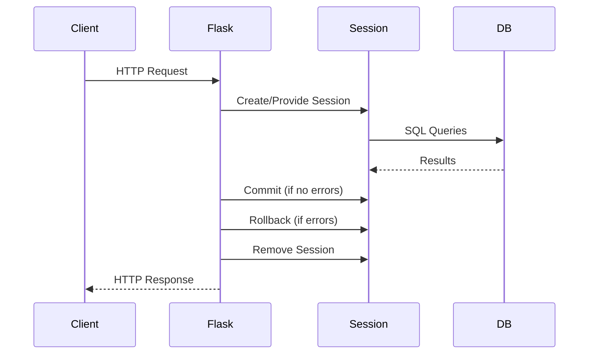

# Flask-SQLAlchemy

> Flask-SQLAlchemy is the official integration between Flask and SQLAlchemy. It provides the `db` object, handles configuration, manages sessions per request, and simplifies common patterns. Understanding how it works — and when to use it over plain SQLAlchemy — is essential for Flask development.

## Learning Objectives

After completing this chapter, you will be able to:

- Configure Flask-SQLAlchemy for different environments
- Use the `db` object for model definition and session management
- Understand how Flask-SQLAlchemy manages the session lifecycle per request
- Implement pagination with Flask-SQLAlchemy
- Configure connection pooling and engine options
- Choose between Flask-SQLAlchemy and plain SQLAlchemy for your project

## What Is Flask-SQLAlchemy?

Flask-SQLAlchemy is an extension that integrates SQLAlchemy with Flask. It provides:

1. **Automatic session management**: Creates and tears down sessions per request
2. **Configuration integration**: Reads database URI from Flask config
3. **The `db` object**: Combines `MetaData`, `Engine`, and session management
4. **Pagination helpers**: Built-in pagination support
5. **Model base class**: Pre-configured declarative base

### Flask-SQLAlchemy vs. Plain SQLAlchemy

| Feature | Flask-SQLAlchemy | Plain SQLAlchemy |
|---------|-----------------|-------------------|
| Session management | Automatic per-request | Manual |
| Configuration | From Flask config | Direct setup |
| Model base | `db.Model` | Define your own |
| Pagination | Built-in | Manual |
| Engine access | Via `db.engine` | Direct |
| Flexibility | Less | More |

Use Flask-SQLAlchemy for typical Flask applications. Use plain SQLAlchemy when you need advanced engine configuration, multiple databases with complex routing, or are building a library rather than an application.

## Installation and Setup

```bash
pip install Flask-SQLAlchemy
```

### Basic Setup

```python
from flask import Flask
from flask_sqlalchemy import SQLAlchemy

app = Flask(__name__)
app.config['SQLALCHEMY_DATABASE_URI'] = 'sqlite:///app.db'
app.config['SQLALCHEMY_TRACK_MODIFICATIONS'] = False

db = SQLAlchemy(app)

class User(db.Model):
    id = db.Column(db.Integer, primary_key=True)
    username = db.Column(db.String(80), unique=True, nullable=False)
    email = db.Column(db.String(120), unique=True, nullable=False)
```

### Application Factory Pattern

```python
from flask import Flask
from flask_sqlalchemy import SQLAlchemy

db = SQLAlchemy()

def create_app(config_name='default'):
    app = Flask(__name__)
    app.config.from_object(config[config_name])
    
    db.init_app(app)  # Initialize with app
    
    return app
```

### Modern SQLAlchemy 2.0+ Style with Flask-SQLAlchemy

```python
from flask_sqlalchemy import SQLAlchemy
from sqlalchemy.orm import Mapped, mapped_column
from typing import Optional

db = SQLAlchemy()

class User(db.Model):
    id: Mapped[int] = mapped_column(primary_key=True)
    username: Mapped[str] = mapped_column(db.String(80), unique=True)
    email: Mapped[str] = mapped_column(db.String(120), unique=True)
```

## Configuration Options

| Option | Default | Description |
|--------|---------|-------------|
| `SQLALCHEMY_DATABASE_URI` | `None` | Database connection string (required) |
| `SQLALCHEMY_BINDS` | `{}` | Additional database binds |
| `SQLALCHEMY_ECHO` | `False` | Log all SQL statements |
| `SQLALCHEMY_TRACK_MODIFICATIONS` | `None` | Track object modifications (deprecated, set to False) |
| `SQLALCHEMY_ENGINE_OPTIONS` | `{}` | Pass options to create_engine |
| `SQLALCHEMY_POOL_SIZE` | Engine default | Connection pool size |
| `SQLALCHEMY_POOL_TIMEOUT` | Engine default | Pool timeout |
| `SQLALCHEMY_POOL_RECYCLE` | Engine default | Recycle connections after N seconds |
| `SQLALCHEMY_MAX_OVERFLOW` | Engine default | Max overflow connections |

### Engine Options

```python
app.config['SQLALCHEMY_ENGINE_OPTIONS'] = {
    'pool_size': 10,
    'pool_timeout': 30,
    'pool_recycle': 3600,  # Recycle connections after 1 hour
    'max_overflow': 20,
}
```

## The db Object

Flask-SQLAlchemy's `db` object provides:

### Model Base

```python
class User(db.Model):      # db.Model is the declarative base
    ...
```

### Session

```python
db.session.add(user)       # Add object to session
db.session.commit()        # Commit transaction
db.session.rollback()      # Rollback transaction
db.session.delete(user)    # Mark for deletion
db.session.flush()         # Flush pending changes (without commit)
db.session.expunge(user)   # Remove from session
db.session.close()         # Close session
```

### Engine and Connection

```python
db.engine              # The SQLAlchemy engine
db.metadata            # MetaData object
db.Table               # Table constructor
db.Column              # Column constructor
```

### Query Interface (Legacy)

```python
# Flask-SQLAlchemy also provides a query interface on models
User.query.all()           # All users
User.query.first()         # First user
User.query.get(1)          # By primary key
User.query.filter_by(username='john').first()
User.query.filter(User.username.like('j%')).all()
```

> [!TIP]
> The `User.query` interface is legacy. For new code, prefer SQLAlchemy 2.0's `select()` syntax with `db.session.execute()`.

## Automatic Session Management

Flask-SQLAlchemy automatically handles sessions:



At the end of each request, Flask-SQLAlchemy:
1. Commits the session if there were no exceptions
2. Rolls back if there were unhandled exceptions
3. Removes the session (returns connection to pool)

## Pagination

Flask-SQLAlchemy provides built-in pagination:

```python
from flask import request

@app.route('/users')
def list_users():
    page = request.args.get('page', 1, type=int)
    per_page = request.args.get('per_page', 20, type=int)
    
    pagination = User.query.paginate(
        page=page,
        per_page=per_page,
        error_out=False  # Return empty page instead of 404
    )
    
    return render_template('users.html', 
                         users=pagination.items,
                         pagination=pagination)
```

### Pagination Object

| Attribute | Description |
|-----------|-------------|
| `pagination.items` | Items on current page |
| `pagination.page` | Current page number |
| `pagination.per_page` | Items per page |
| `pagination.total` | Total items across all pages |
| `pagination.pages` | Total number of pages |
| `pagination.has_prev` | True if previous page exists |
| `pagination.has_next` | True if next page exists |
| `pagination.prev_num` | Previous page number |
| `pagination.next_num` | Next page number |
| `pagination.iter_pages()` | Iterator over page numbers |

### Pagination Template

```html
<nav class="pagination">
    
        <a href="{{ url_for('list_users', page=pagination.prev_num) }}">&laquo; Previous</a>
    
    
    
        
            
                <a href="{{ url_for('list_users', page=page_num) }}">{{ page_num }}</a>
            
                <strong>{{ page_num }}</strong>
            
        
            <span>...</span>
        
    
    
    
        <a href="{{ url_for('list_users', page=pagination.next_num) }}">Next &raquo;</a>
    
</nav>
```

## Multiple Databases

Flask-SQLAlchemy supports multiple database binds:

```python
app.config['SQLALCHEMY_DATABASE_URI'] = 'sqlite:///primary.db'
app.config['SQLALCHEMY_BINDS'] = {
    'users': 'sqlite:///users.db',
    'appmeta': 'sqlite:///appmeta.db',
}

# Default bind
class User(db.Model):
    __tablename__ = 'users'
    id = db.Column(db.Integer, primary_key=True)
    # Uses primary database

# Specific bind
class LogEntry(db.Model):
    __bind_key__ = 'appmeta'
    __tablename__ = 'log_entries'
    id = db.Column(db.Integer, primary_key=True)
    # Uses 'appmeta' database
```

## Creating Tables

```python
# Create all tables
with app.app_context():
    db.create_all()

# Drop all tables
with app.app_context():
    db.drop_all()
```

For production, use Alembic migrations instead of `create_all()` (see [[03-Database/SQLAlchemy-Migrations]]).

## Common Patterns

### Get or Create

```python
def get_or_create(model, **kwargs):
    instance = db.session.execute(
        db.select(model).filter_by(**kwargs)
    ).scalar_one_or_none()
    
    if instance:
        return instance, False  # False = not created
    
    instance = model(**kwargs)
    db.session.add(instance)
    db.session.commit()
    return instance, True  # True = created

user, created = get_or_create(User, username='john')
```

### Update or Create

```python
def update_or_create(model, defaults=None, **kwargs):
    defaults = defaults or {}
    instance = db.session.execute(
        db.select(model).filter_by(**kwargs)
    ).scalar_one_or_none()
    
    if instance:
        for key, value in defaults.items():
            setattr(instance, key, value)
        db.session.commit()
        return instance, False
    
    kwargs.update(defaults)
    instance = model(**kwargs)
    db.session.add(instance)
    db.session.commit()
    return instance, True
```

## Common Mistakes

**Mistake: Forgetting `db.session.commit()`**
Changes are not persisted until committed.

**Mistake: Using `db.session` outside request context**
Flask-SQLAlchemy manages sessions per request. Outside a request, push an app context.

**Mistake: Not setting `SQLALCHEMY_TRACK_MODIFICATIONS = False`**
This feature adds significant overhead and is deprecated.

**Mistake: Calling `db.create_all()` in production**
Use Alembic migrations for production schema management.

## Best Practices

- Use the application factory pattern with `db.init_app(app)`
- Set `SQLALCHEMY_TRACK_MODIFICATIONS = False`
- Configure connection pooling for production
- Use `db.session.commit()` after changes
- Use Alembic for schema migrations in production
- Use pagination for large result sets
- Prefer SQLAlchemy 2.0 `select()` syntax over legacy `query`

## Exercises

1. **Setup**: Create a Flask app with Flask-SQLAlchemy using the factory pattern. Define User and Post models.

2. **CRUD**: Implement full CRUD operations for both models using modern SQLAlchemy syntax.

3. **Pagination**: Create a paginated list view with navigation links.

4. **Multi-Database**: Set up two SQLite databases and route different models to each.

## Quiz

**Question 1**: What does Flask-SQLAlchemy provide over plain SQLAlchemy?

**Question 2**: How do you initialize Flask-SQLAlchemy with the application factory pattern?

**Question 3**: How does Flask-SQLAlchemy manage sessions per request?

**Question 4**: What is `SQLALCHEMY_TRACK_MODIFICATIONS`, and why should it be disabled?

**Question 5**: How do you implement pagination with Flask-SQLAlchemy?

## Interview Questions

1. "What is Flask-SQLAlchemy, and what does it add to SQLAlchemy?"

2. "How would you configure Flask-SQLAlchemy for production?"

3. "Explain the session lifecycle in Flask-SQLAlchemy."

4. "How would you handle pagination in a Flask-SQLAlchemy application?"

5. "When would you use plain SQLAlchemy instead of Flask-SQLAlchemy?"

## Related Chapters

- [[03-Database/SQLAlchemy-ORM]] — SQLAlchemy ORM fundamentals
- [[03-Database/SQLAlchemy-Migrations]] — Alembic migrations
- [[03-Database/Query-Optimization]] — Performance tuning

## Official Documentation References

- [Flask-SQLAlchemy Documentation](https://flask-sqlalchemy.palletsprojects.com/)
- [SQLAlchemy Documentation](https://docs.sqlalchemy.org/)

---

*Previous: [[03-Database/SQLAlchemy-ORM]] | Next: [[03-Database/Relationships]]*