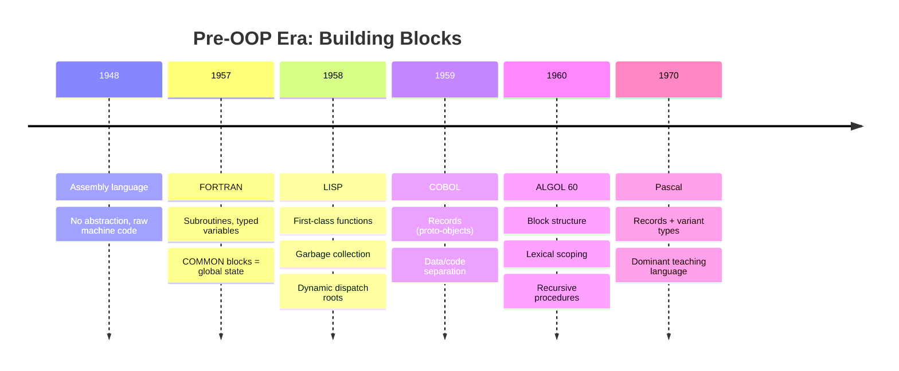
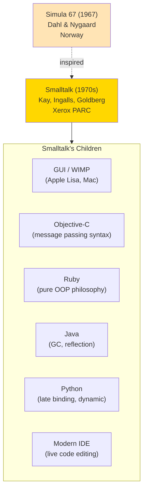
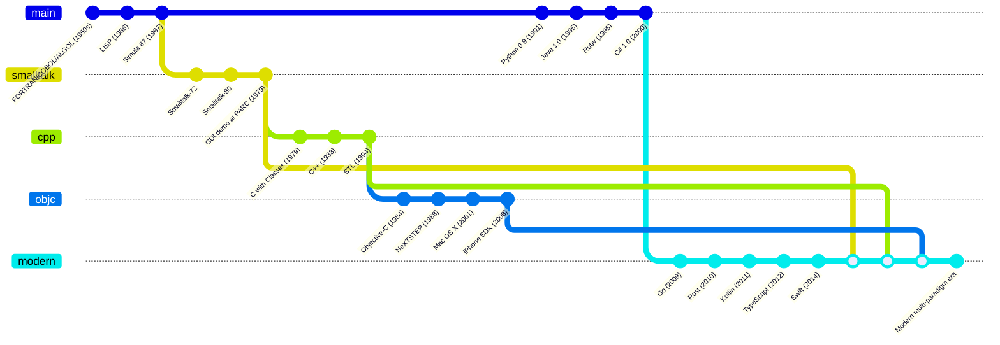
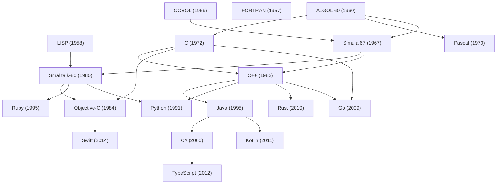
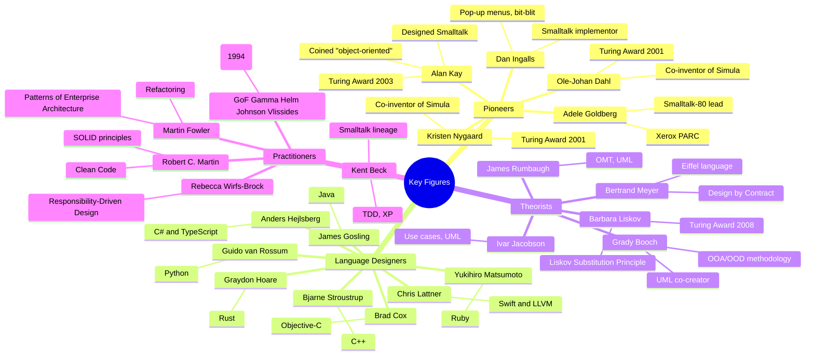
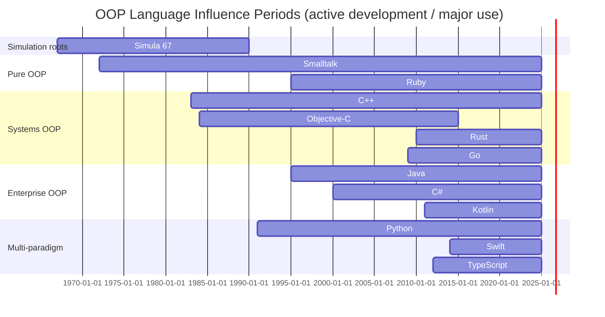

# History of Object-Oriented Programming

#oop #foundations #history #languages #teaching

> [!quote] Alan Kay
> "I invented the term object-oriented, and I can tell you I did not have C++ in mind."

The history of OOP is not a story of one invention. It is the story of *three separate traditions* — the **simulation tradition** (Simula), the **personal computing tradition** (Smalltalk), and the **systems programming tradition** (C++) — that converged over fifty years into the dominant programming paradigm of our era.

Understanding this history is not antiquarianism. It explains *why* different OOP languages do things differently, *why* the same words ("object", "class", "message") mean subtly different things in different communities, and *why* modern languages like Python, Rust, and TypeScript make the design choices they do.

---

## 1. Pre-OOP Era (1950s–1960s) — The Procedural Foundations

Before there were objects, there were *procedures*. The first high-level languages were designed to make machine code more readable, and their organizing principle was the **subroutine** — a named block of code you could call from anywhere.

### 1.1 Assembly Language (1940s–1950s)

The earliest programs were written in machine code — raw binary — and later in assembly, where `MOV`, `ADD`, `JMP` replaced `1010 0011`. There were no functions, no types, no structures — just registers and memory addresses.

### 1.2 FORTRAN (1957)

FORTRAN (**FOR**mula **TRAN**slation), created by John Backus at IBM, was the first widely-used high-level language. It introduced:

- Named subroutines (`SUBROUTINE` keyword)
- Typed variables (`INTEGER`, `REAL`)
- Loops (`DO` loops)
- Conditionals (`IF`)

But it had no concept of grouping data with the code that operated on it. Data lived in `COMMON` blocks — essentially global state shared across all subroutines.

### 1.3 COBOL (1959)

COBOL (**CO**mmon **B**usiness-**O**riented **L**anguage), designed by Grace Hopper and colleagues, was aimed at business data processing. Its major contribution was the **record** — a structured grouping of fields:

```cobol
01 EMPLOYEE-RECORD.
   05 EMPLOYEE-ID       PIC X(6).
   05 EMPLOYEE-NAME     PIC X(30).
   05 EMPLOYEE-SALARY   PIC 9(7)V99.
```

This looks suspiciously like a class with attributes — but the *behavior* (the code that processed these records) lived separately, in `PROCEDURE DIVISION` paragraphs. The data and the code were in different worlds.

### 1.4 ALGOL (1958, 1960)

ALGOL (**ALGO**rithmic **L**anguage) was the first language to introduce **block structure** and **lexical scoping**. It gave us:

- `begin ... end` blocks
- Nested function definitions
- Recursive procedures
- Parameter passing by value or by name

ALGOL's descendant, **Pascal** (1970, Niklaus Wirth), added **records** and was the dominant teaching language of the 1970s and 1980s. Many future OOP pioneers learned programming in Pascal.

### 1.5 LISP (1958) — The Parallel Tradition

While procedural languages were evolving toward OOP, John McCarthy at MIT was creating **LISP** (**LIS**t **P**rocessing), the first functional language. LISP had *first-class functions*, *garbage collection*, and *dynamic typing* in 1958 — features that procedural languages wouldn't get for decades.

LISP also had **objects of a sort** — symbols, lists, and closures that combined data and behavior. Many OOP ideas (closures, message dispatch, late binding) have their roots in LISP. The LISP tradition eventually produced **CLOS** (Common Lisp Object System) in 1988, a fascinating multiple-dispatch OOP system that influenced later languages.

> [!note] Why This Matters for OOP
> All the building blocks of OOP — records (COBOL), subroutines (FORTRAN), block structure (ALGOL), and first-class functions (LISP) — existed *before* OOP. What OOP added was the **conceptual synthesis** of bundling data with behavior in a single unit. That insight took until 1967.



---

## 2. Simula (1967) — The Birth of OOP

The story of OOP *properly* begins in Norway, with two men trying to solve a problem in **discrete event simulation**.

### 2.1 The Problem

**Ole-Johan Dahl** and **Kristen Nygaard** at the Norwegian Computing Center in Oslo were building simulation languages for things like factories, harbor traffic, and networks. Their previous language, **Simula I** (1962), was specialized for simulation but limited.

The problem: simulating a harbor meant modeling ships, docks, cranes, and cargo — entities with *identity*, *state*, and *behavior*. The procedural approach (FORTRAN-style) was awkward: you'd have parallel arrays `SHIP_NAME[]`, `SHIP_X[]`, `SHIP_Y[]`, and a giant switch statement dispatching on ship type. Dahl and Nygaard realized they needed a language construct that bundled identity, state, and behavior together.

### 2.2 The Invention

In 1967, they released **Simula 67**, which introduced:

- **Classes** — templates for creating objects
- **Objects** — instances of classes, with their own state
- **Subclasses** (inheritance) — defining one class as a specialization of another
- **Virtual procedures** (dynamic dispatch) — calling the right method based on actual object type
- **Coroutines** — quasi-parallel execution within objects

```simula
! Simula 67 syntax — conceptual ;
class Ship(name, tonnage); text name; real tonnage;
begin
   real positionX, positionY;
   procedure sail(dx, dy); real dx, dy;
   begin
      positionX := positionX + dx;
      positionY := positionY + dy;
   end;
end;

Ship class Tanker(capacity); real capacity;
begin
   real currentLoad;
   procedure load(amount); real amount;
   begin
      currentLoad := min(amount, capacity);
   end;
end;

ref(Ship) s; ref(Tanker) t;
s :- new Ship("Atlantic", 5000);
t :- new Tanker("Big Oil", 80000, 60000);
```

That's OOP. Classes, objects, inheritance, methods — all in 1967.

### 2.3 Why Simula Didn't Conquer the World

Simula was a *simulation* language. It was slow, ran on expensive hardware, and wasn't designed for general-purpose software. Most programmers never encountered it. But the *ideas* leaked out — through academic papers, through visitors to Oslo, and especially through one PhD student who attended a Simula workshop in 1966 or 1967.

That student was **Alan Kay**.

> [!info] The Simula Legacy
> Although Simula never had mass adoption, it influenced nearly every OOP language that followed. C++, Smalltalk, Objective-C, and Java all acknowledge Simula as a primary inspiration. Bjarne Stroustrup explicitly calls Simula his favorite language for expressing solutions.

---

## 3. Smalltalk (1970s) — The Pure OOP Vision

If Simula invented the *mechanisms* of OOP, **Smalltalk** invented the *philosophy*.

### 3.1 Alan Kay and the Dynabook

Alan Kay, a graduate student at the University of Utah, attended a Simula workshop in the late 1960s and had an epiphany. In his 1969 thesis and subsequent papers, he laid out a vision that went *far beyond* Simula's simulation focus:

- Computers should be **personal** (one per person, not shared mainframes)
- The interface should be graphical, with **windows, icons, and pointers**
- Children should be able to program them
- The internal architecture should be **biological**: cells (objects) sending messages to each other

Kay called this vision the **Dynabook** — a portable, personal, programmable computer. The Dynabook wasn't built until decades later (it's essentially the modern tablet), but the *software architecture* for it became Smalltalk.

### 3.2 Xerox PARC and the Smalltalk Team

In 1970, Kay joined the newly-formed **Xerox Palo Alto Research Center (PARC)**. He recruited a team including **Dan Ingalls**, **Adele Goldberg**, **Peter Deutsch**, and **Ted Kaehler**. Over the next decade, they built Smalltalk through several iterations:

- **Smalltalk-72**: first working version, influenced by LISP and Simula
- **Smalltalk-76**: added inheritance and classes
- **Smalltalk-80**: the canonical version, documented in the "Blue Book" (Smalltalk-80: The Language and Its Implementation)

### 3.3 Smalltalk's Radical Ideas

Smalltalk-80 was unlike anything that came before:

- **Everything is an object.** Integers, booleans, classes, code blocks, even the compiler — all objects.
- **All computation is message passing.** `3 + 4` is the message `+ 4` sent to the object `3`. There are no operators, only messages.
- **No control structures.** `if`/`while`/`for` are methods on booleans and blocks.
- **Live environment.** The development environment *is* the running program. You change a method, and every existing object immediately uses the new method.
- **Reflection.** Objects can inspect and modify themselves at runtime.
- **Garbage collection.** Built in from the start.

```smalltalk
"Smalltalk-80 syntax — conceptual"
Object subclass: #Account
    instanceVariableNames: 'balance'
    classVariableNames: ''
    poolDictionaries: ''
    category: 'Banking'.

Account methodsFor: 'transactions'
deposit: amount
    balance := balance + amount.
    ^balance

withdraw: amount
    (amount > balance)
        ifTrue: [self error: 'Insufficient funds']
        ifFalse: [balance := balance - amount].
    ^balance
```

### 3.4 What Smalltalk Gave the World

Even though Smalltalk never reached mass adoption commercially (it was expensive, ran on specialized hardware, and lost the 1990s language wars to C++ and Java), its influence is everywhere:

- The **graphical user interface** (windows, icons, mouse) was first demonstrated in Smalltalk at PARC. Steve Jobs saw it in 1979 and built the Apple Lisa and Macintosh around it.
- **Objective-C** borrowed Smalltalk's message-passing syntax directly.
- **Ruby** was explicitly designed as "Smalltalk with Perl-like syntax".
- **Java, Python, JavaScript** all adopted garbage collection, reflection, and late binding from Smalltalk.
- The **modern IDE** (refactoring, live code inspection) originated in Smalltalk environments.

> [!quote] Adele Goldberg
> "In Smalltalk, everything is an object — including the things you'd rather not think about as objects, like the bytecode compiler and the debugger."



---

## 4. C++ (1980s) — OOP Meets Systems Programming

While Smalltalk was building a pure vision in academia, **Bjarne Stroustrup** at Bell Labs was solving a different problem: how to bring OOP to systems programming.

### 4.1 The Problem

In the late 1970s, Bell Labs was building increasingly large systems in C — operating systems, network stacks, telephone switching software. These systems were hitting the complexity wall: 100,000+ lines of C code with global variables, function pointer tables, and brittle type casts. Stroustrup, who had used Simula in his PhD work, knew OOP could help — but Simula was too slow for systems work.

### 4.2 C with Classes (1979–1983)

Stroustrup's first attempt was **"C with Classes"** — a preprocessor that added classes, inheritance, and constructors to C. The design goals were strict:

- **Zero-overhead** abstraction: you don't pay for what you don't use
- **Backward compatibility** with existing C code
- **Static typing** for performance and safety
- **Deterministic destruction** (objects destroyed at end of scope, no GC)

In 1983, the language was renamed **C++** (the `++` is the C increment operator — a pun on "the successor to C"). Rick Mascitti suggested the name.

### 4.3 C++'s Contributions

- **Multiple inheritance** (controversial, but powerful)
- **Templates** (generic programming — later than OOP, but transformative)
- **Operator overloading** (letting user types look like built-ins)
- **RAII** (Resource Acquisition Is Initialization) — tying resource management to object lifetimes
- **STL** (Standard Template Library, 1994) — generic containers and algorithms
- **Virtual functions** with vtables (efficient dynamic dispatch)

```cpp
// C++ — a class with inheritance and virtual functions
class Shape {
public:
    virtual double area() const = 0;
    virtual ~Shape() {}
};

class Circle : public Shape {
    double radius_;
public:
    Circle(double r) : radius_(r) {}
    double area() const override {
        return 3.14159 * radius_ * radius_;
    }
};

class Rectangle : public Shape {
    double width_, height_;
public:
    Rectangle(double w, double h) : width_(w), height_(h) {}
    double area() const override {
        return width_ * height_;
    }
};
```

### 4.4 C++'s Impact

C++ dominated the 1990s and 2000s. It powered:

- **Browsers** (Chrome, Firefox, Safari are all C++)
- **Databases** (MySQL, MongoDB, PostgreSQL internals)
- **Operating systems** (parts of Windows, macOS, Linux)
- **Game engines** (Unreal, Unity native layer)
- **Trading systems** (high-frequency finance)

C++ also produced the most famous (and infamous) OOP book of all time: the **Gang of Four** *Design Patterns* (1994), written explicitly with C++ and Smalltalk in mind.

> [!warning] C++'s Mixed Legacy
> C++ brought OOP to the masses — but it also brought *complexity*. By 2010, C++ had grown so large and so error-prone that newer languages (Go, Rust, Swift) were explicitly designed to fix its problems. The lesson: bolt OOP onto an existing language and you inherit its warts.

---

## 5. Objective-C (1984) — Smalltalk on C

In parallel with Stroustrup, **Brad Cox** and **Tom Love** at Productivity Products International were taking a different approach to adding OOP to C. Rather than inventing a new syntax, they **embedded Smalltalk inside C**.

### 5.1 The Design

Objective-C is a strict superset of C. It adds:

- Square-bracket **message-sending syntax**: `[account deposit: 50]`
- **Classes** as objects (each class is itself an instance of a metaclass)
- **Categories** (adding methods to existing classes without subclassing)
- **Dynamic typing** (an object can be typed as `id` — "any object")
- **Dynamic dispatch** by default

```objc
// Objective-C syntax
@interface Account : NSObject {
    double balance;
}
- (id)initWithBalance:(double)initial;
- (void)deposit:(double)amount;
- (void)withdraw:(double)amount;
- (double)balance;
@end

@implementation Account
- (id)initWithBalance:(double)initial {
    self = [super init];
    if (self) {
        balance = initial;
    }
    return self;
}
- (void)deposit:(double)amount {
    balance += amount;
}
@end

// Usage:
Account *acct = [[Account alloc] initWithBalance:100.0];
[acct deposit:50.0];
double b = [acct balance];
```

### 5.2 NeXT, Apple, and iOS

Objective-C was licensed by **NeXT** (Steve Jobs's post-Apple company) in 1988 for the NeXTSTEP operating system. When Apple bought NeXT in 1996, NeXTSTEP became the basis for **Mac OS X** (2001), and Objective-C became Apple's primary development language for two decades.

When the **iPhone** launched in 2007, every iOS app was written in Objective-C. This made Objective-C — once a niche language — suddenly one of the most economically important languages in the world, until **Swift** replaced it starting in 2014.

> [!info] The Objective-C Legacy
> Objective-C's dynamic dispatch, categories, and protocols heavily influenced Swift's design. Swift's `protocol` extensions, in particular, are a direct evolution of Objective-C categories.

---

## 6. Python (1991) — Multi-Paradigm from Day One

While C++ and Objective-C were trying to bring OOP to C, **Guido van Rossum** was designing a different kind of language at CWI in the Netherlands.

### 6.1 Origins

In December 1989, over Christmas break at CWI, van Rossum started writing a new scripting language as the successor to **ABC** (a teaching language he had worked on). He called it **Python** (after Monty Python's Flying Circus, not the snake).

Python 0.9.0 was released in February 1991. From the start, it had:

- **Classes and objects** (using a syntax inspired by C++ but simpler)
- **First-class functions** (functional programming)
- **Modules** (procedural organization)
- **Exception handling**
- **Garbage collection** (reference counting)

### 6.2 Python's OOP Philosophy

Python is *multi-paradigm*: it supports OOP, procedural, and functional styles equally. You don't *have* to use classes — but when you do, they're first-class:

```python
# Python from 1991 — classes were always there
class Stack:
    def __init__(self):
        self._items = []

    def push(self, item):
        self._items.append(item)

    def pop(self):
        return self._items.pop()

    def empty(self):
        return len(self._items) == 0
```

### 6.3 Python's OOP Evolution

| Version | Year | OOP Feature |
|---|---|---|
| 0.9.0 | 1991 | Basic classes, inheritance |
| 2.2 | 2001 | New-style classes, descriptors, properties, metaclasses unified |
| 2.6 | 2008 | `abc` module (abstract base classes) |
| 3.0 | 2008 | Cleaner class semantics, no more old-style classes |
| 3.5 | 2015 | Type hints (`typing` module) |
| 3.7 | 2018 | `dataclasses` module |
| 3.10 | 2021 | Structural pattern matching (`match`/`case`) |

### 6.4 Python's Distinctive OOP

- **Duck typing**: if it walks like a duck, it's a duck. No formal interface required.
- **First-class everything**: classes, methods, and functions are all objects.
- **Metaclasses**: classes are themselves instances of metaclasses (default: `type`).
- **Descriptors**: the protocol that makes properties, methods, and classmethods work.
- **Magic methods**: `__init__`, `__repr__`, `__add__`, etc., let user types behave like built-ins.

> [!tip] Teaching Tip
> Python's OOP is "Smalltalk-flavored" in its dynamism but "C++-flavored" in its syntax. This makes Python an unusually *honest* OOP language: the message-passing and dynamic dispatch are visible if you look, but the syntax is approachable for students coming from C++ or Java.

---

## 7. Java (1995) — OOP Conquers the Enterprise

If C++ brought OOP to systems programming, **Java** brought it to *everywhere else*.

### 7.1 Origins

In 1990, **James Gosling**, **Mike Sheridan**, and **Patrick Naughton** at Sun Microsystems started a project called "Green" to build software for consumer electronics (set-top boxes, interactive TV). The language they created, originally called **Oak** (after an oak tree outside Gosling's office), was renamed **Java** in 1995 and repurposed for the emerging World Wide Web.

### 7.2 Java's Design Principles

- **Everything is an object** (almost — primitives like `int` are exceptions, fixed by Java 5 autoboxing)
- **Write once, run anywhere** — bytecode runs on the JVM, which is ported to every platform
- **No manual memory management** — garbage collection built in
- **No multiple inheritance** — interfaces instead (a deliberate response to C++'s complexity)
- **No pointers** — references only, with bounds-checked arrays
- **Built-in threading** — threads and synchronization in the language

### 7.3 The Java Boom

Java exploded in the late 1990s and 2000s for several reasons:

- **Applets** made Java visible in browsers (briefly)
- **Servlets and JSP** made Java the dominant server-side web language
- **Spring, Hibernate** frameworks industrialized enterprise Java
- **Android** (2008) chose Java as its primary app language — another massive market
- **Universities** adopted Java as the teaching language of choice, replacing Pascal and C++

```java
// Java — verbose but explicit OOP
public class Account {
    private double balance;

    public Account(double initialBalance) {
        if (initialBalance < 0) {
            throw new IllegalArgumentException("Negative balance");
        }
        this.balance = initialBalance;
    }

    public void deposit(double amount) {
        if (amount <= 0) {
            throw new IllegalArgumentException("Non-positive deposit");
        }
        this.balance += amount;
    }

    public double getBalance() {
        return this.balance;
    }
}
```

### 7.4 Java's Influence

- **C#** (2000) was explicitly modeled on Java, fixing some of its warts
- **Kotlin** (2011) was designed as "a better Java" and is now the recommended Android language
- **Scala** (2004) added functional programming on top of the JVM
- Modern Python's `dataclass` and `typing` modules were partly inspired by Java's verbosity-reduction work

---

## 8. Ruby (1995) — Pure OOP Revisited

In 1995, while Java was being unveiled, **Yukihiro Matsumoto** ("Matz") in Japan was releasing **Ruby**, a language explicitly designed to be "more powerful than Perl, more object-oriented than Python".

### 8.1 Ruby's Philosophy

Matz was a Smalltalk fan who wanted its purity in a language with Perl's practical scripting syntax. Ruby's defining feature: **everything is an object**, with no exceptions.

```ruby
# Ruby — everything is an object
5.times { puts "Hello" }       # integers are objects
nil.class                       # => NilClass
true.class                      # => TrueClass
"hello".length                  # => 5
[1, 2, 3].map { |x| x * 2 }    # => [2, 4, 6]

class Account
  def initialize(balance)
    @balance = balance
  end

  def deposit(amount)
    @balance += amount
  end

  def balance
    @balance
  end
end
```

### 8.2 Rails and Mainstream Adoption

Ruby was niche until 2004, when **David Heinemeier Hansson** released **Ruby on Rails**, a web framework that extracted patterns from his work on Basecamp. Rails's "convention over configuration" philosophy made web development dramatically faster, and Ruby became a major language for startups in the late 2000s (Twitter, GitHub, Shopify, Airbnb all started on Rails).

### 8.3 Ruby's Legacy

- Popularized **DSLs** (domain-specific languages) as a Ruby idiom
- Made **blocks and iterators** mainstream (influencing Python's iterator protocol)
- Inspired **Elixir** (a functional language with Ruby-like syntax)
- Demonstrated that **developer happiness** is a legitimate language design goal

---

## 9. C# (2000) — Microsoft's Java

In the late 1990s, Microsoft was being squeezed by Java. Sun had sued Microsoft over its non-standard Java implementation, and Microsoft needed its own answer.

### 9.1 The Design

**Anders Hejlsberg** (who had previously designed Turbo Pascal and Delphi at Borland) led the design of **C#**, released in 2000 as part of the **.NET Framework**. C# borrowed heavily from Java but added:

- **Properties** (no more `getX()`/`setX()` boilerplate)
- **Delegates and events** (first-class function pointers)
- **LINQ** (Language-Integrated Query, 2007) — querying any data source with SQL-like syntax
- **async/await** (2012) — making asynchronous code look synchronous
- **Generics** (2005) — better than Java's type erasure
- **Pattern matching** (2017+)

```csharp
// C# — modern, concise OOP
public class Account
{
    public decimal Balance { get; private set; }

    public Account(decimal initial) => Balance = initial;

    public void Deposit(decimal amount)
    {
        if (amount <= 0) throw new ArgumentException("Must be positive");
        Balance += amount;
    }
}
```

### 9.2 C#'s Trajectory

C# started as a Java clone but evolved into one of the most innovative mainstream languages. By 2020, C# had features Java lacked: real generics, pattern matching, records, nullable reference types, and async streams. Microsoft's open-sourcing of C# and .NET in 2014 and the creation of **.NET Core** (later just .NET) made C# cross-platform and revitalized its community.

---

## 10. The Modern Era (2009–present) — Post-OOP and Pragmatism

By 2010, OOP was the default — but a new generation of languages was questioning its assumptions.

### 10.1 Go (2009)

Google's **Go** (designed by Robert Griesemer, Rob Pike, and Ken Thompson) was deliberately *anti-OOP*. It has:

- **No classes** — only structs and methods on structs
- **No inheritance** — composition and interfaces only
- **Implicit interfaces** (structural typing) — if your type has the right methods, it implements the interface
- **Goroutines and channels** for concurrency

```go
// Go — OOP without classes or inheritance
type Account struct {
    balance float64
}

func (a *Account) Deposit(amount float64) error {
    if amount <= 0 {
        return errors.New("must be positive")
    }
    a.balance += amount
    return nil
}

func (a *Account) Balance() float64 {
    return a.balance
}
```

### 10.2 Rust (2010)

Mozilla's **Rust** (Graydon Hoare et al.) is a systems language that replaces C++'s object model with:

- **Traits** (similar to typeclasses in Haskell or interfaces in Go) instead of classes
- **No inheritance** — composition only
- **Ownership and borrowing** for memory safety without GC
- **Pattern matching** and algebraic data types
- **Zero-cost abstractions**

Rust shows that you can have *modularity, polymorphism, and encapsulation* — three of the four pillars — without classes or inheritance.

### 10.3 Swift (2014)

Apple's **Swift** (Chris Lattner et al.) replaced Objective-C as the primary iOS/macOS language. It blends:

- **Classes** (for reference types, when you need identity)
- **Structs** (for value types, when you want copy semantics — preferred by default)
- **Protocols** (similar to interfaces, with default implementations)
- **Protocol-oriented programming** — a paradigm emphasizing protocols over classes
- **Extensions** (similar to Objective-C categories)
- **Optionals** and value types for safety

```swift
// Swift — protocol-oriented OOP
protocol Drawable {
    func draw() -> String
}

struct Circle: Drawable {
    var radius: Double
    func draw() -> String { return "Circle of radius \(radius)" }
}

struct Square: Drawable {
    var side: Double
    func draw() -> String { return "Square of side \(side)" }
}

let shapes: [Drawable] = [Circle(radius: 3), Square(side: 4)]
for s in shapes { print(s.draw()) }
```

### 10.4 Kotlin (2011), TypeScript (2012)

- **Kotlin** (JetBrains) is a JVM language that fixes Java's verbosity: null safety, extension functions, data classes, coroutines. Google made it the preferred Android language in 2017.
- **TypeScript** (Microsoft, Anders Hejlsberg again) adds static typing to JavaScript. It supports classes, interfaces, and structural typing — bringing order to large JavaScript codebases.

### 10.5 The Post-OOP Synthesis

The modern consensus is roughly:

- **Classes are one option, not the only option.** Structs, traits, and protocols often suffice.
- **Inheritance is rarely worth it.** Composition and protocols/interfaces are preferred.
- **Value types are underrated.** Swift and Rust default to value semantics for safety.
- **Functional features belong in OOP.** Immutability, pattern matching, and higher-order functions are now expected.



---

## 11. The Family Tree of OOP Languages



---

## 12. Key Figures in OOP History



### 12.1 The Turing Awards

Several OOP pioneers have won the **ACM Turing Award** — the "Nobel Prize of computing":

- **2001**: Ole-Johan Dahl and Kristen Nygaard (Simula)
- **2003**: Alan Kay (Smalltalk, OOP)
- **2008**: Barbara Liskov (abstract data types, LSP)
- **2018**: Bengt Holmberg, Vincent Cerf, David Patterson (and others; Liskov's earlier work continues to be cited)

---

## 13. Key Books in OOP History

| Year | Book | Authors | Impact |
|---|---|---|---|
| 1986 | *Object-Oriented Software Construction* | Bertrand Meyer | Design by Contract, Eiffel |
| 1988 | *Object-Oriented Analysis and Design* | Grady Booch | The Booch method |
| 1990 | *Object-Oriented Modeling and Design* | Rumbaugh et al. | OMT methodology |
| 1991 | *Smalltalk-80: The Language* | Goldberg & Robson | The "Blue Book" |
| 1994 | *Design Patterns* | Gamma, Helm, Johnson, Vlissides | The "Gang of Four" — pattern vocabulary |
| 1995 | *Object-Oriented Analysis and Design with Applications* (2nd ed) | Grady Booch | Mature Booch method |
| 1996 | *Pattern-Oriented Software Architecture* | Buschmann et al. | Architectural patterns |
| 1999 | *Refactoring* | Martin Fowler | Code smell vocabulary |
| 2002 | *Agile Software Development, Principles, Patterns, and Practices* | Robert C. Martin | SOLID principles |
| 2003 | *Domain-Driven Design* | Eric Evans | Strategic OOP design |
| 2008 | *Clean Code* | Robert C. Martin | Practitioner's handbook |
| 2012 | *Effective Java* (2nd ed) | Joshua Bloch | Java OOP best practices |
| 2017 | *Designing Data-Intensive Applications* | Martin Kleppmann | Modern systems OOP |

> [!quote] The Gang of Four (1994)
> "We were trying to design for change. ... The best way to design for change is to consider it from the beginning." — Erich Gamma

---

## 14. Timeline of OOP Influence on the Software Industry



### Key Industry Inflection Points

- **1979**: Xerox PARC demo to Steve Jobs → GUI revolution begins
- **1988**: NeXTSTEP launches with Objective-C → foundation for macOS/iOS
- **1991**: Python released → multi-paradigm OOP becomes accessible
- **1995**: Java + Ruby both released → OOP goes mainstream
- **1997**: JDK 1.1 with Inner Classes → Java OOP matures
- **2002**: .NET Framework + C# → Microsoft validates OOP
- **2008**: Android launches with Java → mobile OOP becomes universal
- **2014**: Swift announced → end of Objective-C's dominance
- **2017**: Kotlin becomes Android-preferred → modern OOP for mobile
- **2020s**: Rust enters Linux kernel → OOP successor in systems programming

---

## 15. The Three Traditions — A Synthesis

Looking back over fifty years, we can see that OOP is not one tradition but three:

### 15.1 The Simula Tradition (Class-Based, Static)

Simula → C++ → Java → C# → Kotlin

Characteristics:
- Classes are explicit blueprints
- Types are checked at compile time
- Inheritance is central
- Performance matters
- Verbose but predictable

### 15.2 The Smalltalk Tradition (Message-Based, Dynamic)

Smalltalk → Ruby → (Python partly) → (JavaScript partly)

Characteristics:
- Everything is an object
- Message passing is the only computation
- Dynamic typing
- Late binding
- Live development environment
- Developer happiness emphasized

### 15.3 The Post-OOP Tradition (Composition-Based, Value-Oriented)

Go → Rust → Swift → Modern Kotlin

Characteristics:
- Classes de-emphasized or absent
- Inheritance avoided
- Composition + interfaces/traits
- Value types preferred
- Memory safety without GC
- Functional features integrated

> [!tip] Teaching Tip
> When teaching OOP, show students all three traditions. Many students come to OOP thinking it = Java-style class hierarchies, and never realize that Smalltalk, Ruby, Go, and Rust all do it differently. Exposing the diversity early prevents dogmatism.

---

## 16. Common Student Misconceptions About OOP History

> [!warning] Misconceptions
> 1. **"OOP started with C++."** No — Simula (1967) and Smalltalk (1970s) predate C++ (1983).
> 2. **"Java was the first mainstream OOP language."** No — Smalltalk, C++, and Objective-C all had significant industry use before Java (1995).
> 3. **"Alan Kay invented classes."** No — classes were invented by Dahl and Nygaard in Simula. Kay invented the *philosophy* of message-passing OOP.
> 4. **"Python copied Java's OOP."** No — Python (1991) predates Java (1995). Both borrowed from C++ and Smalltalk independently.
> 5. **"Objective-C was a failure."** No — it powered macOS and iOS for 25 years and produced trillions of dollars of economic value.
> 6. **"Modern languages have abandoned OOP."** No — Rust, Swift, Kotlin, and TypeScript all support OOP; they've just shifted from class-heavy inheritance-based OOP toward trait/protocol-based composition OOP.

---

## 17. Why This History Matters Today

You might wonder why a working programmer should care about OOP's history. Three reasons:

### 17.1 It Explains Language Quirks

Why does Python use `self` explicitly? Because it follows the Smalltalk tradition of message-passing, where the receiver must be visible. Why does Java have interfaces *and* abstract classes? Because it deliberately rejected C++'s multiple inheritance. Why does Swift prefer structs over classes? Because of the post-OOP realization that value semantics avoid whole classes of bugs.

### 17.2 It Tells You Where OOP Is Going

The trajectory is clear: less inheritance, more composition, more value types, more functional integration. If you're learning OOP today, focus on **interfaces/protocols, composition, immutability, and pattern matching** — the future of OOP, not its 1990s peak.

### 17.3 It Prevents Dogmatism

When you know that Alan Kay considered inheritance a *secondary* feature, you stop teaching "OOP = inheritance" as the defining trait. When you know that Go and Rust succeed without classes, you stop saying "no classes = no OOP". History inoculates you against narrow definitions.

---

## 18. Summary

- **OOP began in 1967** with Simula, invented by Dahl and Nygaard for simulation.
- **Smalltalk (1970s)** gave OOP its philosophy: everything is an object, computation is message passing.
- **C++ (1983)** brought OOP to systems programming with zero-overhead abstractions.
- **Objective-C (1984)** brought Smalltalk's message-passing syntax to C, eventually powering macOS and iOS.
- **Python (1991)** was multi-paradigm from the start, with first-class OOP.
- **Java (1995)** brought OOP to the enterprise mainstream.
- **Ruby (1995)** revived Smalltalk's purity in a practical scripting language.
- **C# (2000)** refined Java with properties, LINQ, and async.
- **Modern languages (Go, Rust, Swift, Kotlin, TypeScript)** evolved OOP toward composition, value types, and trait/protocol-based design.
- **Three traditions** shape modern OOP: the Simula (class-based, static), Smalltalk (message-based, dynamic), and post-OOP (composition-based, value-oriented) traditions.
- **Key figures**: Dahl, Nygaard, Kay, Goldberg, Ingalls, Stroustrup, Cox, Gosling, van Rossum, Matsumoto, Hejlsberg, Lattner, Booch, Rumbaugh, Meyer, Liskov, the Gang of Four, Martin, Fowler.
- **Key books**: Simula 67 papers, Smalltalk-80 Blue Book, Design Patterns (1994), Object-Oriented Software Construction (1988), Clean Code (2008).

> [!quote] Closing
> "The history of OOP is a story of synthesis: ideas invented in one community, refined in another, and combined in a third. To understand OOP today, you have to understand all three of its origins." — A synthesis of the field's historians

---

## 19. What's Next?

- [[What-Is-OOP]] — the foundational definition
- [[Why-OOP]] — the motivation and benefits
- [[OOP-Paradigms]] — how OOP fits among other paradigms
- [[Classes-And-Objects]] — Python's specific implementation of the class concept
- [[Encapsulation]], [[Inheritance]], [[Polymorphism]], [[Abstraction]] — the four pillars in depth
- [[SOLID-Principles]] — modern design principles distilled from 50 years of OOP practice
