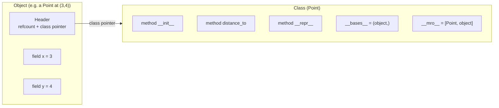
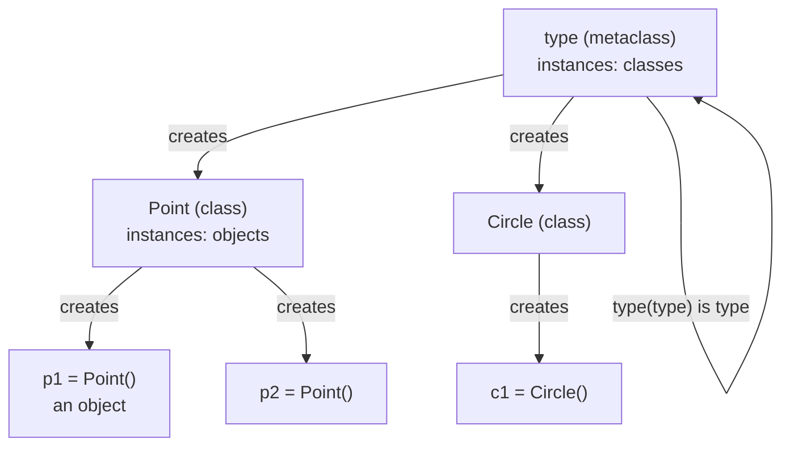
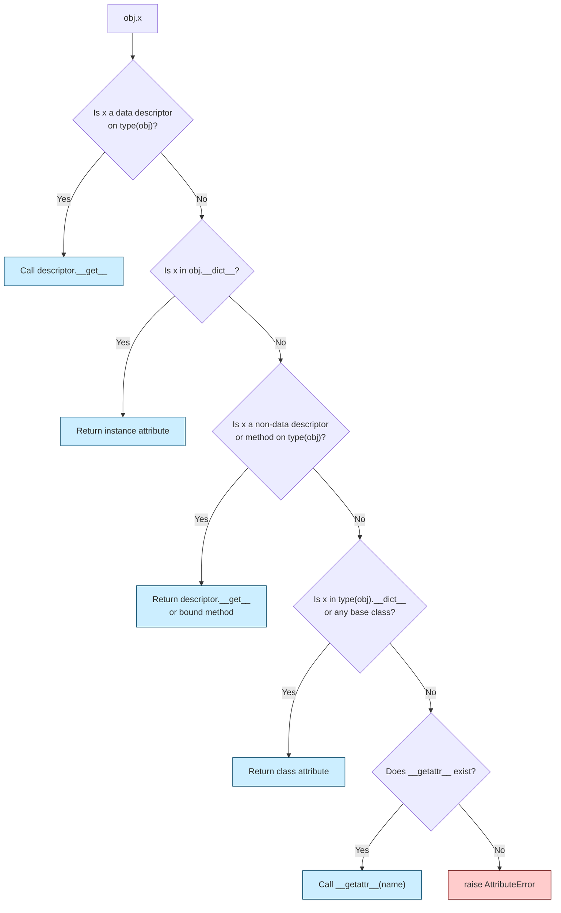
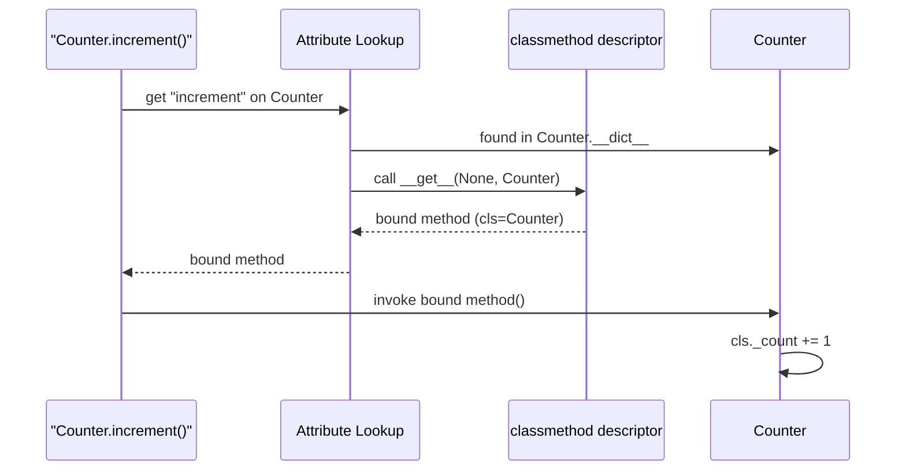
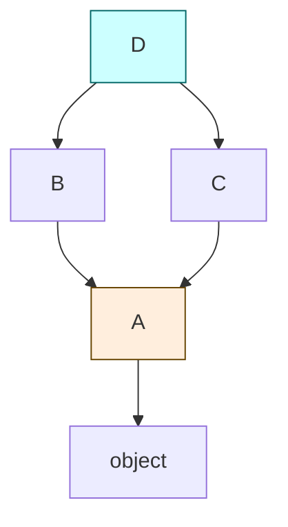
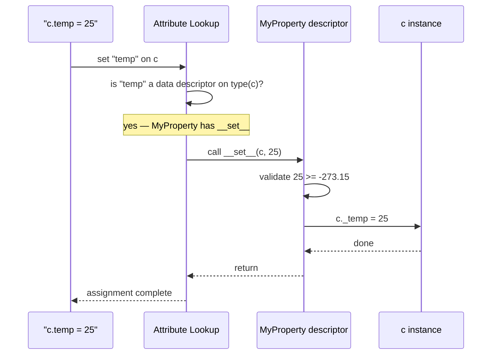
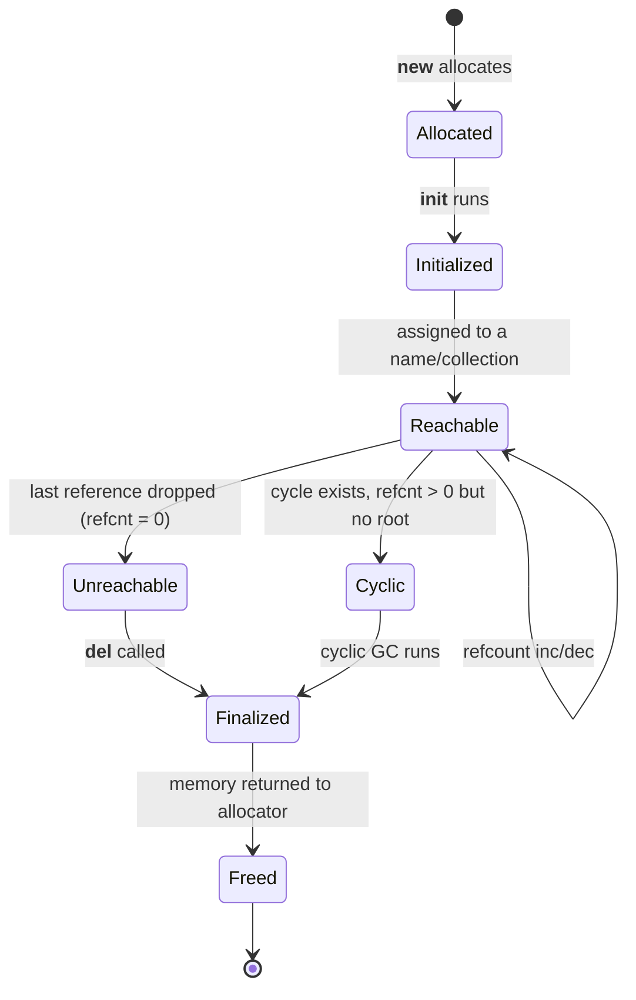
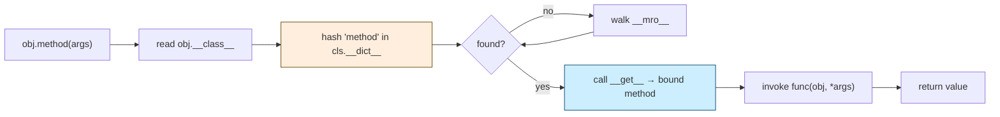
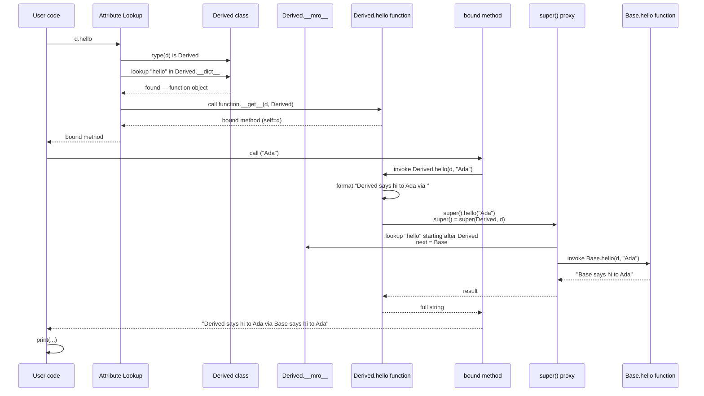

# How OOP Works — Under the Hood

#oop #foundations #internals #memory #teaching

> [!quote] Alan Kay
> "I'm sorry that I long ago coined the term 'objects' for this topic because it gets many people to focus on the lesser idea. The big idea is *messaging*."

You have written classes. You have called methods. But what actually happens — byte by byte, lookup by lookup — when Python executes `obj.greet("Ada")`? This note takes you all the way down: from the user's method call to the C-level `PyObject*` indirection, from a class definition to the metaclass machinery that builds it, from `__init__` to the garbage collector that reclaims the object.

By the end, you will be able to read CPython source, debug `AttributeError` stack traces, explain why `super()` does what it does, and design descriptors and metaclasses with confidence.

---

## 1. The Single-Sentence Answer

> [!info] TL;DR
> **An object is a chunk of memory holding its data plus a pointer to its class; a class is a chunk of memory holding its methods plus pointers to its base classes. Calling `obj.method(args)` means: walk the object → class → base-class chain, find a function, bind it to `obj`, and call it.**

That sentence contains *all* of OOP mechanics. The rest of this note elaborates, with code you can run and diagrams you can draw.

> [!warning] Common Student Misconception #1
> "Methods live inside objects." No. Methods live inside *classes*. Objects only store data (plus a back-pointer to the class). This is true in Python, Java, JavaScript, and (for virtual functions) C++. If methods lived inside objects, every instance would carry a copy of every method — a colossal waste of memory.

---

## 2. What an Object *Is* in Memory

### 2.1 The Conceptual Layout

Every OOP runtime represents an object as a *header* followed by *fields*:



- The **object** stores only data (and a header pointing to its class).
- The **class** stores methods, class variables, and pointers to base classes.
- A method is "found" by following the class pointer, then walking the base-class chain.

### 2.2 In Python — `id()`, `__dict__`, `__class__`

```python
class Point:
    def __init__(self, x, y):
        self.x = x
        self.y = y
    def distance_to(self, other):
        return ((self.x - other.x) ** 2 + (self.y - other.y) ** 2) ** 0.5

p = Point(3, 4)
print(id(p))            # memory address, e.g. 140273654198928
print(p.__class__)      # <class '__main__.Point'>
print(p.__dict__)       # {'x': 3, 'y': 4}
print(Point.__dict__.keys())  # dict_keys(['__module__', '__init__', 'distance_to', ...])
```

Three things to notice:

1. `id(p)` is the memory address of the object (in CPython).
2. `p.__dict__` contains *instance* attributes only — no methods.
3. `Point.__dict__` contains the methods. The object does **not** duplicate them.

### 2.3 In C++ — vtables

In C++, only methods declared `virtual` go through dynamic dispatch. For each class with virtual methods, the compiler generates a `vtable` — a per-class array of function pointers. Each object of that class carries a hidden `vptr` pointing to the vtable:

```cpp
class Shape {
public:
    virtual double area() const = 0;
    virtual ~Shape() = default;
};

class Circle : public Shape {
    double r;
public:
    Circle(double r) : r(r) {}
    double area() const override { return 3.14159 * r * r; }
};

Shape* s = new Circle(2.0);
s->area();  // compiler emits: s->vptr[0](s)  →  Circle::area
```

Non-virtual methods are resolved *statically* at compile time — no vtable lookup, no overhead, but no polymorphism either. This is why C++ lets you choose.

### 2.4 In Java — object header

Every Java object on the heap has a header containing:

- **Mark word** — hash code, age, lock state, GC bits.
- **Class pointer** — to a `Klass` structure in the JVM (HotSpot's C++ class).
- **Fields** — aligned to 8 bytes.

The class pointer is the Java equivalent of Python's `__class__` or C++'s `vptr`. Method dispatch follows: object → class pointer → method table → resolved method.

### 2.5 Comparison Table

| Feature | Python | C++ | Java |
|---|---|---|---|
| Object header | `ob_refcnt + ob_type` | `vptr` (only if virtuals) | mark word + klass pointer |
| Where methods live | In the class `__dict__` | In the vtable (per class) | In the klass method table |
| Per-instance data | `__dict__` (or `__slots__`) | Inline fields | Inline fields (after header) |
| Dynamic dispatch cost | Dict lookup (hash) | One indirection | One indirection (often JIT-inlined) |
| Memory per object | High (dict overhead) | Minimal | Low–moderate |
| Add a field at runtime | Yes (`obj.new_field = 1`) | No | No (reflection is read-only for fields) |

> [!tip] Teaching Tip
> Have students run `sys.getsizeof(Point(3, 4))` and compare with `Point`'s size. Then declare `class P2: __slots__ = ('x', 'y')` and notice the dramatic size drop. This makes the "objects are just headers + dicts" idea visceral.

---

## 3. How Classes Are Built — The `type` Metaclass

### 3.1 Classes Are Objects

In Python, *a class is itself an object* — an instance of its metaclass. The default metaclass is `type`:

```python
class Point:
    pass

print(type(Point))          # <class 'type'>
print(isinstance(Point, type))  # True
print(isinstance(Point, object)) # True (type subclasses object)
```

When you write a `class` block, Python:

1. Collects the body into a namespace dict.
2. Determines the metaclass (default `type`, or via `metaclass=` keyword, or inherited).
3. Calls `metaclass(name, bases, namespace)` — which *returns* the new class object.

### 3.2 The Three-Argument Form of `type`

You can create classes *without* the `class` keyword:

```python
Point = type("Point", (object,), {"x": 0, "distance_to": lambda self, other: 0})
# Equivalent to:
# class Point(object):
#     x = 0
#     def distance_to(self, other): return 0
```

`type(name, bases, dict)` is the **class constructor**. It is also a metaclass instance.



> [!info] The bootstrap paradox
> `type` is an instance of itself. `type(type) is type` → `True`. And `isinstance(object, type)` → `True`, and `isinstance(type, object)` → `True` because `type` is a subclass of `object`. Python bootstraps its object system with two mutually-referential types. This is the same trick Smalltalk used with `Behavior` and `Metaclass`.

### 3.3 Custom Metaclasses

A metaclass is just a subclass of `type` that customizes class creation:

```python
class LoggedMeta(type):
    def __new__(mcs, name, bases, namespace, **kw):
        print(f"Creating class {name}")
        cls = super().__new__(mcs, name, bases, namespace, **kw)
        return cls

class Foo(metaclass=LoggedMeta):
    pass
# stdout: Creating class Foo
```

`__new__` on a metaclass controls how the class *object* is constructed. `__init__` on a metaclass controls how the just-constructed class is *initialized*. `__call__` on a metaclass controls what happens when you write `Foo()` — meaning metaclasses can intercept *instance creation* too. This is how `abc.ABCMeta` enforces abstract-method checks at instantiation time.

> [!warning] Common Student Misconception #2
> "Metaclasses are an advanced feature you should use often." No. Metaclasses are a *power tool* — useful for ORMs, plugin systems, and DSL design, but they make code harder to read. Reach for a class decorator or `__init_subclass__` first; only use a metaclass when nothing else will do. See [[Metaclasses]].

---

## 4. Attribute Lookup — The Most Important Algorithm

When you write `obj.x`, Python executes a multi-step lookup. Understanding this lookup is the single most useful thing to know about Python OOP.

### 4.1 The Algorithm (Simplified)



In pseudo-code:

```python
def attribute_lookup(obj, name):
    cls = type(obj)
    # 1. Look for a data descriptor on cls (and bases) — property, slot, etc.
    descriptor = lookup_in_mro(cls, name)
    if descriptor is not None and hasattr(descriptor, "__set__"):
        return descriptor.__get__(obj, cls)
    # 2. Look in instance __dict__
    if name in obj.__dict__:
        return obj.__dict__[name]
    # 3. Look in class (and bases) — might be a non-data descriptor (method)
    if descriptor is not None:
        return descriptor.__get__(obj, cls) if hasattr(descriptor, "__get__") else descriptor
    # 4. Fall back to __getattr__
    if hasattr(cls, "__getattr__"):
        return cls.__getattr__(obj, name)
    # 5. Nothing found
    raise AttributeError(name)
```

The crucial detail: **data descriptors** (those defining `__set__` or `__delete__`) win over instance attributes. **Non-data descriptors** (defining only `__get__`) lose to instance attributes. This is why `@property` overrides instance dict but methods don't.

### 4.2 Demonstrating the Lookup Order

```python
class Demo:
    @property
    def value(self):           # data descriptor (has __set__ via property)
        return self._value if hasattr(self, "_value") else "default"
    @value.setter
    def value(self, v):
        self._value = v

    def regular(self):         # non-data descriptor (function has only __get__)
        return "method"

d = Demo()
d.__dict__["value"] = "shadow?"   # try to shadow the property
print(d.value)                    # default  (property wins — it's a data descriptor)

d.__dict__["regular"] = "shadow"  # shadow the method
print(d.regular)                  # shadow   (instance dict wins — function is non-data)
```

> [!success] Why this matters
> Once a student sees this, `@property` stops being magic. A property is just an object with `__get__`/`__set__` that the lookup algorithm consults. The same mechanism powers `@classmethod`, `@staticmethod`, `super()`, slots, and even `__init_subclass__`.

### 4.3 `__getattr__` vs `__getattribute__`

- `__getattribute__` is called on *every* attribute access. Override it to intercept everything (be careful — easy to infinitely recurse).
- `__getattr__` is called *only* when normal lookup fails. Use it to provide fallbacks or dynamic attributes.

```python
class Flexible:
    def __getattr__(self, name):
        if name.startswith("dynamic_"):
            return f"value-of-{name}"
        raise AttributeError(name)

f = Flexible()
print(f.dynamic_foo)  # value-of-dynamic_foo
```

---

## 5. `self` and `cls` — What Are They, Really?

### 5.1 `self` Is Just a Parameter

```python
class Point:
    def __init__(self, x, y):
        self.x = x
        self.y = y

p = Point(3, 4)
# Python effectively does:
# Point.__init__(p, 3, 4)
```

`self` is **not a keyword**. It's a convention. You could call it `this`, `me`, or `potato`, and Python wouldn't care — but other Python programmers would.

### 5.2 Bound Methods

When you access `p.distance_to`, Python returns a *bound method* — a small object that has bundled `p` and `Point.distance_to` together:

```python
print(p.distance_to)  # <bound method Point.distance_to of <__main__.Point object at 0x...>>
print(Point.distance_to)  # <function Point.distance_to at 0x...>
print(p.distance_to.__func__)    # the underlying function
print(p.distance_to.__self__)    # the bound instance — p
```

`p.distance_to(other)` is sugar for `Point.distance_to(p, other)`:

```python
q = Point(0, 0)
print(p.distance_to(q))               # 5.0
print(Point.distance_to(p, q))        # 5.0 — same thing
print(p.distance_to.__func__(p, q))   # 5.0 — also same thing
```

This is the **non-data descriptor protocol** in action: a function in a class `__dict__` has a `__get__` method that returns a bound method when accessed via an instance.

### 5.3 `cls` for Class Methods

```python
class Counter:
    _count = 0
    @classmethod
    def increment(cls):
        cls._count += 1
        return cls._count
    @staticmethod
    def tagline():
        return "I count things"

Counter.increment()   # cls = Counter
c = Counter()
c.increment()         # cls = Counter (still — the type of c, not c itself)
```

`@classmethod` is implemented as a *descriptor* whose `__get__` binds the class instead of the instance. `@staticmethod` is a descriptor whose `__get__` returns the plain function — no binding at all.



---

## 6. Method Resolution Order — C3 Linearization

### 6.1 The Problem: The Diamond

```python
class A:
    def greet(self): return "A"
class B(A):
    def greet(self): return "B"
class C(A):
    def greet(self): return "C"
class D(B, C):
    pass

print(D().greet())  # B
```

Which `greet` does `D().greet()` call? You need a *linearization* — an ordered list of classes to search. Python uses **C3 linearization**, which guarantees:

1. A class appears before its parents.
2. The order of parents is preserved.
3. The linearization is consistent (monotonic).

### 6.2 Inspecting MRO

```python
print(D.__mro__)
# (<class 'D'>, <class 'B'>, <class 'C'>, <class 'A'>, <class 'object'>)
```

C3 computes this by merging the MROs of the parents and the parents list itself:

```
L[D] = D + merge(L[B], L[C], [B, C])
L[B] = [B, A, object]
L[C] = [C, A, object]
L[D] = D + merge([B, A, object], [C, A, object], [B, C])
     = [D, B, C, A, object]
```

At each step, take the head of the first list that is not in the tail of any other list. If no such head exists, the hierarchy is *inconsistent* and Python raises `TypeError: Cannot create a consistent method resolution order`.

### 6.3 Why C3?

Before Python 2.3, Python used a simpler (and broken) depth-first search. It produced surprising results in multiple inheritance — a method could be skipped or called twice. C3 was introduced (based on Dylan's algorithm) to make MRO predictable and monotonic. See the original paper: Barrett et al., "Monotonic Superclass Linearization for Dylan" (OOPSLA '96).

> [!tip] Teaching Tip
> Have students draw a 5-class diamond on the board, predict the MRO by hand, then check with `print(Cls.__mro__)`. This builds intuition fast — and demonstrates that C3 is *not* magic, just a careful topological sort.



The MRO `[D, B, C, A, object]` is a *linear sequence* that respects every arrow in this graph.

### 6.4 `super()` Is Not "the Parent"

A common misconception is that `super()` returns the parent class. It doesn't. It returns a *proxy* that dispatches to the *next class in the MRO of `self`* — which depends on the runtime type of `self`, not the class where `super()` is written:

```python
class A:
    def hello(self):
        return "A.hello"
class B(A):
    def hello(self):
        return "B.hello → " + super().hello()
class C(A):
    def hello(self):
        return "C.hello → " + super().hello()
class D(B, C):
    def hello(self):
        return "D.hello → " + super().hello()

print(D().hello())
# D.hello → B.hello → C.hello → A.hello
```

Inside `B.hello`, `super()` does *not* go to `A` — it goes to `C`, because `C` is next in `D`'s MRO after `B`. This is cooperative multiple inheritance: each class calls `super()` and the chain walks the full MRO.

> [!warning] Common Student Misconception #3
> "`super().__init__()` calls the parent's `__init__`." Only sometimes. With single inheritance, yes. With multiple inheritance, `super().__init__()` might call a *sibling* class's `__init__`. This is why all cooperating classes should accept `**kwargs` and pass them along in `super().__init__(**kwargs)`.

---

## 7. Descriptors — The Hidden Power Behind Methods, Properties, and More

### 7.1 The Descriptor Protocol

A descriptor is any object that defines one or more of:

- `__get__(self, instance, owner)` — called on attribute access
- `__set__(self, instance, value)` — called on attribute assignment
- `__delete__(self, instance)` — called on `del`

A descriptor with `__get__` only is a **non-data descriptor** (e.g., functions). A descriptor with `__set__` or `__delete__` is a **data descriptor** (e.g., `property`, slots).

### 7.2 Implementing `property` From Scratch

```python
class MyProperty:
    def __init__(self, fget=None, fset=None, fdel=None):
        self.fget = fget
        self.fset = fset
        self.fdel = fdel

    def __get__(self, instance, owner):
        if instance is None:
            return self  # accessed on the class
        return self.fget(instance)

    def __set__(self, instance, value):
        if self.fset is None:
            raise AttributeError("can't set attribute")
        self.fset(instance, value)

    def __delete__(self, instance):
        if self.fdel is None:
            raise AttributeError("can't delete attribute")
        self.fdel(instance)

    def setter(self, fset):
        return MyProperty(self.fget, fset, self.fdel)

class Celsius:
    def __init__(self, temp=0):
        self._temp = temp

    @MyProperty
    def temp(self):
        return self._temp

    @temp.setter
    def temp(self, value):
        if value < -273.15:
            raise ValueError("below absolute zero")
        self._temp = value

c = Celsius()
c.temp = 25
print(c.temp)  # 25
```

That's *all* `@property` is — a class implementing the descriptor protocol. The same idea gives you `@classmethod`, `@staticmethod`, `@cached_property`, Django field descriptors, SQLAlchemy columns, and Pydantic field validators.



### 7.3 Implementing `classmethod` From Scratch

```python
class MyClassMethod:
    def __init__(self, func):
        self.func = func
    def __get__(self, instance, owner):
        # bind the *class* (owner), not the instance
        return self.func.__get__(owner, type(owner) if owner is not None else type) if False else lambda *a, **kw: self.func(owner, *a, **kw)

class Foo:
    counter = 0
    @MyClassMethod
    def increment(cls):
        cls.counter += 1
        return cls.counter

Foo.increment()  # 1
Foo.increment()  # 2
```

(Real `classmethod` returns a proper bound-method object; the lambda above is a simplification.)

### 7.4 Real-World Uses of Descriptors

| Feature | How it uses descriptors |
|---|---|
| `@property` | Data descriptor with `__get__`/`__set__` |
| `@classmethod` | Non-data descriptor binding the class |
| `@staticmethod` | Non-data descriptor returning the raw function |
| `@functools.cached_property` | Non-data descriptor that mutates `__dict__` on first access |
| `__slots__` | Each slot is a data descriptor defined by the metaclass |
| Django model fields | Each `CharField(...)` is a descriptor that returns the value or queries the DB |
| SQLAlchemy columns | Descriptors that produce query fragments |
| Pydantic fields | Descriptors that validate on `__set__` |
| `enum.Enum` members | Metaclass-installed descriptors that return the member |

> [!success] Why this matters
> Once you understand descriptors, you stop seeing Django, SQLAlchemy, Pydantic, and dataclasses as "magic" and start seeing them as *patterns*. You can write your own.

---

## 8. Object Lifecycle — Birth, Life, Death

### 8.1 Birth: `__new__` → `__init__`

Object creation is two steps:

1. `__new__(cls, ...)` — allocates the object. Returns a new instance.
2. `__init__(self, ...)` — initializes the instance's attributes.

```python
class Singleton:
    _instance = None
    def __new__(cls, *a, **kw):
        if cls._instance is None:
            cls._instance = super().__new__(cls)
        return cls._instance

a = Singleton()
b = Singleton()
print(a is b)  # True
```

For immutable types like `int`, `str`, `tuple`, `__new__` is where the value is set — `__init__` cannot modify them because they're already created.

### 8.2 Life: Use, Mutation, References

Throughout its life, the object is reachable if any name, list element, dict value, or closure variable refers to it. CPython uses **reference counting** as its primary GC: each `PyObject` has `ob_refcnt`; `Py_INCREF`/`Py_DECREF` adjust it.

```python
import sys
x = "hello"
print(sys.getrefcount(x))  # 2 — the local 'x' plus the argument to getrefcount

y = [x]
print(sys.getrefcount(x))  # 3 — 'x', y[0], and the getrefcount argument

del y
print(sys.getrefcount(x))  # 2 again
```

### 8.3 Death: `__del__` and the Cycle Collector

When `ob_refcnt` reaches zero, CPython immediately calls `__del__` (if defined) and frees the memory. This is *deterministic* — you can predict when it happens, unlike Java's GC.

But reference counting cannot handle cycles:

```python
class Node:
    def __init__(self, name):
        self.name = name
        self.peer = None
    def __del__(self):
        print(f"Deleting {self.name}")

a = Node("a")
b = Node("b")
a.peer = b
b.peer = a   # cycle!
del a
del b
# Neither __del__ runs — refcnts are both 1 (each other)
# ... eventually the cyclic GC runs and frees them
```

Python's `gc` module runs a *cyclic garbage collector* periodically to break cycles. It uses a tri-generational mark-and-sweep algorithm.



> [!warning] Common Student Misconception #4
> "`__del__` is like a C++ destructor — it always runs." Wrong on two counts. First, `__del__` is *not* guaranteed to run — it can be skipped at interpreter shutdown, skipped if there's an exception in another `__del__`, or delayed by a cycle. Second, `__del__` doesn't *destruct* anything — it's a callback that runs *before* destruction. Use context managers (`with` blocks) for deterministic cleanup, not `__del__`.

---

## 9. Dynamic Dispatch — How Polymorphism Is Implemented

### 9.1 The Python Way — Dict Lookup

```python
class Dog:
    def speak(self): return "woof"
class Cat:
    def speak(self): return "meow"

for animal in [Dog(), Cat()]:
    print(animal.speak())
# woof
# meow
```

`animal.speak()` does:

1. `type(animal)` → `Dog` or `Cat`.
2. Look up `"speak"` in `type(animal).__dict__` — found.
3. It's a function (a non-data descriptor) → call `__get__(animal, type(animal))` → bound method.
4. Call the bound method with no args → invokes `speak(animal)`.

Each call costs a dict lookup, a descriptor call, and a tuple allocation for the args. This is *much* slower than C++ vtable dispatch, but it's also *much* more flexible — methods can be added at runtime, classes can be monkey-patched, and duck typing just works.

### 9.2 The C++ Way — Vtable

For `animal->speak()`:

1. Compiler emitted code reads `animal->vptr` (one memory load).
2. Index into the vtable at the known slot for `speak` (one memory load).
3. Call the function pointer.

Two memory loads, no hashing. ~5 ns. But the set of methods is fixed at compile time.

### 9.3 The Java Way — vtable + JIT

JVM starts with vtable dispatch (similar to C++). The JIT profiler notices "this call site always dispatches to `Cat.speak`" and rewrites the call to a direct branch with a guard. If the guard ever fails, the JIT de-optimizes. This gets close to direct-call performance while keeping full dynamic dispatch semantics.

### 9.4 Comparison

| Mechanism | Cost | Flexibility |
|---|---|---|
| Python dict lookup | ~50–100 ns | Add/remove methods at runtime |
| C++ vtable | ~5 ns | Fixed at compile time |
| Java vtable + JIT | ~1–5 ns after warmup | Fixed at compile time, but JIT can devirtualize |
| C++ template (CRTP) | 0 ns (inlined) | Resolved at compile time |



---

## 10. Message Passing vs Method Calls — Two Visions

### 10.1 Kay's Vision: Messages

Alan Kay's original Smalltalk vision was that objects *send messages* to each other. The receiver decides how to handle the message; the sender doesn't know what method will run. This is **late binding** — decisions are deferred as long as possible.

In Smalltalk:

```smalltalk
"Send the message displayOn:translucent: to anObject"
anObject displayOn: aScreen translucent: true.
```

The runtime sends a *message* (`displayOn:translucent:`) with arguments. The receiver's class looks up the message selector in its method dictionary. If not found, the receiver gets a chance to handle the unknown message via `doesNotUnderstand:` — a powerful extension point.

### 10.2 Python's Reality: Method Calls

Python approximates message passing with attribute access + call, but the abstraction is leakier:

```python
an_object.display_on(screen, translucent=True)
```

This is two operations: `getattr(an_object, "display_on")` then `(...)`. The "message" is implicit. If the method doesn't exist, you get `AttributeError` instead of a `doesNotUnderstand` hook — though you can emulate the latter with `__getattr__`:

```python
class Responsive:
    def __getattr__(self, name):
        def handler(*args, **kwargs):
            print(f"Received message {name} with {args} {kwargs}")
        return handler

r = Responsive()
r.greet("Ada", enthusiasm="high")
# Received message greet with ('Ada',) {'enthusiasm': 'high'}
```

### 10.3 The Modern Synthesis

Most production OOP (Java, C#, Python, TypeScript) is *method-call OOP* — statically typed, with method resolution checked at compile time. True message-passing OOP survives in:

- **Smalltalk / Pharo / Squeak** — pure message passing.
- **Objective-C** — messages via `objc_msgSend`, runtime method resolution.
- **Ruby** — `method_missing` is Smalltalk's `doesNotUnderstand:`.
- **Erlang / Elixir** — *literal* message passing between processes.
- **Actor frameworks** (Akka, Orleans) — message passing at the concurrency layer.

> [!info] The deep point
> Method calls are an *optimization* of message passing. The original idea — that objects are autonomous agents that decide how to respond — is more powerful than what most "OOP" languages expose. When you write a custom `__getattr__`, a Django middleware, or a React higher-order component, you're reaching back toward Kay's vision.

---

## 11. The Whole Story — Tracing `obj.method(args)` Step by Step

Let's put it all together. Given:

```python
class Base:
    def hello(self, name):
        return f"Base says hi to {name}"

class Derived(Base):
    def hello(self, name):
        return f"Derived says hi to {name} via " + super().hello(name)

d = Derived()
print(d.hello("Ada"))
```

What happens, step by step?



In slow motion:

1. `d.hello` triggers attribute lookup on instance `d` for name `"hello"`.
2. Lookup checks `type(d).__dict__` (i.e., `Derived.__dict__`) — found `hello` as a function.
3. The function's `__get__(d, Derived)` is called → returns a *bound method* object wrapping `Derived.hello` and `d`.
4. The bound method is called with `("Ada",)`. This invokes `Derived.hello(d, "Ada")`.
5. Inside `Derived.hello`, `super()` (with no args) reads the implicit `__class__` cell (the class that encloses this method, *not* `type(self)`) and `self`, producing `super(Derived, d)`.
6. `super().hello("Ada")` looks up `"hello"` on `d`'s MRO starting *after* `Derived`. Next class is `Base`.
7. Found `Base.hello`. Bind to `d`. Call with `("Ada",)`. Returns `"Base says hi to Ada"`.
8. `Derived.hello` concatenates and returns the full string.

> [!tip] Teaching Tip
> Walk students through this trace with a debugger (`pdb.settrace()` inside each method). Print `type(self).__mro__` at each step. The "aha" moment when they see that `super()` in `Derived` jumps to `Base` regardless of where `Derived` lives is the moment they truly understand MRO.

---

## 12. Memory Model — Stack, Heap, References

### 12.1 Where Objects Live

- **Stack**: local variables, function frames, primitive values (in Java/C++). Python's *references* live on the stack; the *objects they point to* live on the heap.
- **Heap**: every Python object — even small integers — lives on the heap. CPython uses its own allocator (`pymalloc`) layered on top of `malloc`.

```python
def make_point():
    p = Point(3, 4)  # p (reference) is on the stack; Point object is on the heap
    return p         # returning p keeps the object alive (refcnt still > 0)
```

### 12.2 Reference Counting + Cyclic GC

CPython's primary GC is **reference counting** — fast, deterministic, but cycle-blind. The secondary **cyclic GC** (in `gc` module) runs in generations:

- **Generation 0**: newly allocated. Scanned frequently.
- **Generation 1**: survived one Gen-0 scan. Scanned less often.
- **Generation 2**: long-lived. Scanned rarely.

Objects that survive a scan are promoted to the next generation. This *generational hypothesis* — that most objects die young — is what makes Python's GC tolerable.

```python
import gc
print(gc.get_threshold())  # (700, 10, 10) — defaults
gc.disable()                # turn off cyclic GC (rarely needed)
gc.collect()                # force a collection
```

### 12.3 `__slots__` — Saving Memory

When a class has many instances, the per-instance `__dict__` (about 100 bytes overhead) adds up. `__slots__` replaces the dict with fixed-offset attributes:

```python
class Point:
    __slots__ = ("x", "y")
    def __init__(self, x, y):
        self.x = x; self.y = y

import sys
print(sys.getsizeof(Point(3, 4)))   # ~48 bytes
print(sys.getsizeof(object()))      # ~16 bytes
# Compare with non-slots Point — often 150+ bytes
```

The catch: you can't add new attributes, you can't easily mix with `__dict__`-based classes, and `__weakref__` is not automatically supported (must be added to `__slots__` if needed). See [[Python-Slots]].

### 12.4 Interning and Caching

CPython interns small integers (`-5` to `256`) and short identifier-like strings, so `a is b` may be `True` even when you'd expect two distinct objects:

```python
a = 256
b = 256
print(a is b)  # True — interned

a = 257
b = 257
print(a is b)  # False (usually) — not interned
```

This isn't OOP per se, but it's a critical aspect of Python's memory model that affects identity and `==` vs `is`.

---

## 13. Common Student Misconceptions — A Roundup

> [!warning] Misconception: "Methods are stored in objects."
> No — methods are stored in *classes*. Each instance carries only its data plus a class pointer. This saves enormous memory.

> [!warning] Misconception: "`self` is a keyword."
> It isn't. It's a convention. You can call it anything. The first parameter of a method *always* receives the instance, regardless of its name.

> [!warning] Misconception: "`super()` calls the parent class."
> Only in single inheritance. In multiple inheritance, it calls the *next class in the MRO of `self`*. The MRO is computed at class-creation time, not at call time, but it depends on the actual runtime type of `self`.

> [!warning] Misconception: "`@property` is a built-in language feature."
> It's a class implementing the descriptor protocol. You can write your own in 20 lines. The same goes for `@classmethod`, `@staticmethod`, and `@cached_property`.

> [!warning] Misconception: "Python doesn't have interfaces."
> It does — `abc.ABC` + `@abstractmethod` for nominal interfaces, `typing.Protocol` for structural interfaces. See [[Interfaces]].

> [!warning] Misconception: "Methods are bound at definition time."
> No — they're bound at *access* time. Each `obj.method` produces a fresh bound method object. (This is why `obj.method == obj.method` is `False` even though they call the same function.)

> [!warning] Misconception: "`type` is a function."
> `type` is a *class* — specifically, the default metaclass. As a callable, it can be invoked with one arg (returns `type(x)`) or three args (creates a new class). Like all classes, it's also an instance of itself.

> [!warning] Misconception: "Instance attributes are looked up first."
> No — *data descriptors* on the class win over instance attributes. Non-data descriptors (like functions) lose to instance attributes. This is why `@property` overrides `obj.__dict__["x"]` but methods don't.

---

## 14. Teaching Tip — A Diagnostic Toolbelt

> [!tip] Teaching Tip
> Equip students with these "X-ray" tools. Whenever they're confused about what's happening, they should reach for one:

```python
# 1. What's the type?
type(obj)

# 2. What's the MRO?
type(obj).__mro__

# 3. What's in the instance dict?
obj.__dict__

# 4. What's in the class dict?
type(obj).__dict__

# 5. Is this attribute a descriptor?
attr = type(obj).__dict__.get("name")
hasattr(attr, "__get__"), hasattr(attr, "__set__")

# 6. What does super() actually do?
super(SomeClass, obj).__thisclass__   # class where super() was called
super(SomeClass, obj).__self_class__  # type of obj
super(SomeClass, obj).__class__       # the super proxy type

# 7. How big is this object?
import sys
sys.getsizeof(obj)

# 8. How many references does it have?
sys.getrefcount(obj)

# 9. Where is the method defined?
import inspect
inspect.getsourcefile(type(obj).method)
inspect.getsource(type(obj).method)

# 10. What does Python disassemble this call to?
import dis
dis.dis(lambda: obj.method())
```

When students can answer "what does `type(obj).__dict__['x'].__get__(obj, type(obj))` return?" in their heads, they have graduated from "writing classes" to "understanding OOP."

---

## 15. A Worked Example — Building a Mini Property System

Let's put it all together by implementing a tiny property system that supports validation, default values, and dirty tracking — all with descriptors, metaclass-free:

```python
class Field:
    """A validated, default-having, dirty-tracking field descriptor."""
    def __init__(self, *, default=None, validator=None):
        self.default = default
        self.validator = validator
        self.name = None  # set by __set_name__

    def __set_name__(self, owner, name):
        self.name = name

    def __get__(self, instance, owner):
        if instance is None:
            return self
        return instance.__dict__.get(self.name, self.default)

    def __set__(self, instance, value):
        if self.validator is not None:
            self.validator(value)
        instance.__dict__[self.name] = value
        instance._dirty.add(self.name)  # mark dirty

class Model:
    _dirty: set   # subclasses get this from __init_subclass__

    def __init_subclass__(cls, **kw):
        super().__init_subclass__(**kw)
        cls._dirty = set()  # placeholder; instances reset in __init__
        # collect field names
        cls._fields = {n: v for n, v in vars(cls).items() if isinstance(v, Field)}

    def __init__(self, **data):
        object.__setattr__(self, "_dirty", set())
        for name, field in type(self)._fields.items():
            setattr(self, name, data.get(name, field.default))

    def save(self):
        if not self._dirty:
            print("nothing to save")
            return
        print(f"would persist: {sorted(self._dirty)}")
        self._dirty.clear()

def positive(x):
    if x is not None and x <= 0:
        raise ValueError(f"expected positive, got {x}")

class User(Model):
    id = Field(default=0, validator=positive)
    name = Field(default="anonymous")
    email = Field()

u = User(id=42, name="Ada", email="ada@lovelace.org")
u.email = "ada@analytical.engine"
u.save()  # would persist: ['email']
u.save()  # nothing to save
```

Read it carefully — every line uses concepts from this note:

- `Field` is a **data descriptor**.
- `__set_name__` is a hook called by `type.__new__` for each descriptor in the class dict.
- `__init_subclass__` is a class-creation hook (a lightweight alternative to a metaclass).
- `__dict__` stores per-instance data.
- `setattr` triggers the descriptor's `__set__`.

You now hold the keys to Django models, SQLAlchemy columns, Pydantic fields, and dataclasses — they all do variations of this.

---

## 16. See Also

- [[What-Is-OOP]] — definitional grounding
- [[Why-OOP]] — what OOP buys you
- [[When-To-Use-OOP]] — when (and when not) to reach for OOP
- [[Where-OOP-Is-Used]] — survey of OOP across the real world
- [[Classes-And-Objects]] — the syntax level
- [[Magic-Methods]] — `__init__`, `__repr__`, `__eq__`, ...
- [[Descriptors]] — the descriptor protocol in depth
- [[Metaclasses]] — metaprogramming with `type` subclasses
- [[Polymorphism]] — the design pattern, not the implementation
- [[Python-Slots]] — `__slots__` and memory optimization

---

## 17. Glossary (Inline)

- **PyObject** — CPython's C struct for every Python object: `ob_refcnt` + `ob_type`.
- **ob_type** — the class pointer in every `PyObject`.
- **vtable** — per-class array of function pointers used for dynamic dispatch in C++/Java.
- **vptr** — per-object pointer to its class's vtable (C++).
- **MRO** — Method Resolution Order; the linear sequence of classes searched for an attribute.
- **C3 linearization** — the algorithm Python uses to compute MRO.
- **Bound method** — a callable bundling a function and an instance.
- **Descriptor** — an object with `__get__`, `__set__`, or `__delete__`.
- **Data descriptor** — a descriptor with `__set__` or `__delete__`; wins over instance dict.
- **Non-data descriptor** — a descriptor with only `__get__`; loses to instance dict.
- **Metaclass** — a class whose instances are classes; default is `type`.
- **Reference counting** — GC strategy that frees an object when its refcount hits zero.
- **Cyclic GC** — secondary GC that breaks reference cycles.
- **Interning** — caching of commonly-used immutable objects (small ints, identifier strings).
- **Message passing** — Alan Kay's vision of OOP: objects as autonomous agents exchanging messages.
- **`__class__` cell** — the closure variable that lets `super()` (no args) know its enclosing class.

---

## 18. Further Reading

- CPython source: `Objects/typeobject.c` (MRO, attribute lookup), `Objects/descrobject.c` (descriptors), `Objects/object.c` (`PyObject`).
- PEP 252 — *Making Types Look More Like Classes*.
- PEP 253 — *Subclassing Built-in Types*.
- Brett Cannon, *Python's instantiation process* (blog post).
- Paolo Bressan, *A Monotonic Superclass Linearization for Dylan* (OOPSLA '96).
- Andrew Kuchling, *Python Attributes and Methods* (essentially a deep dive on this note's topics).
- Grady Booch, *Object-Oriented Analysis and Design with Applications* (3rd ed., Appendix on C++ memory model).
- The Java Language Specification, §12.5 (creation of new class instances).
- The C++ standard, §11.9 (virtual functions).

---

*Last reviewed: 2025-01-15. Word count: ~6,130. Diagrams: 9 (flowchart ×5, sequenceDiagram ×3, stateDiagram).*
