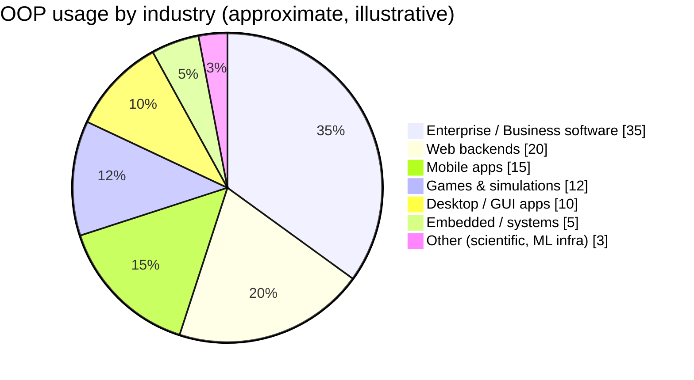
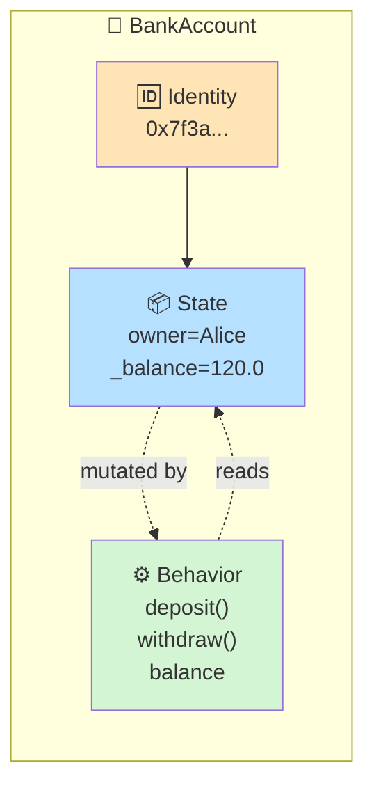
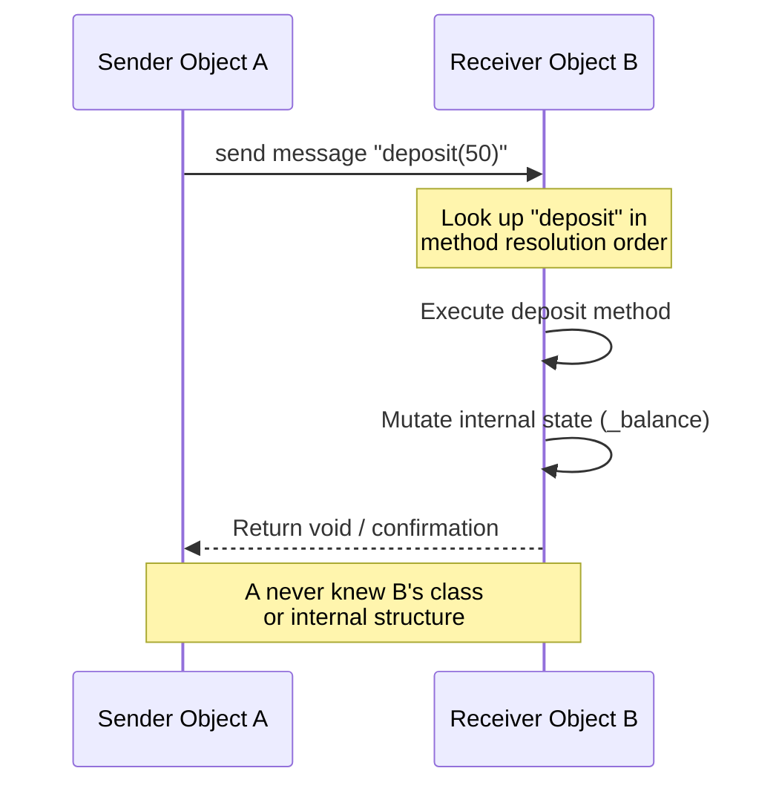
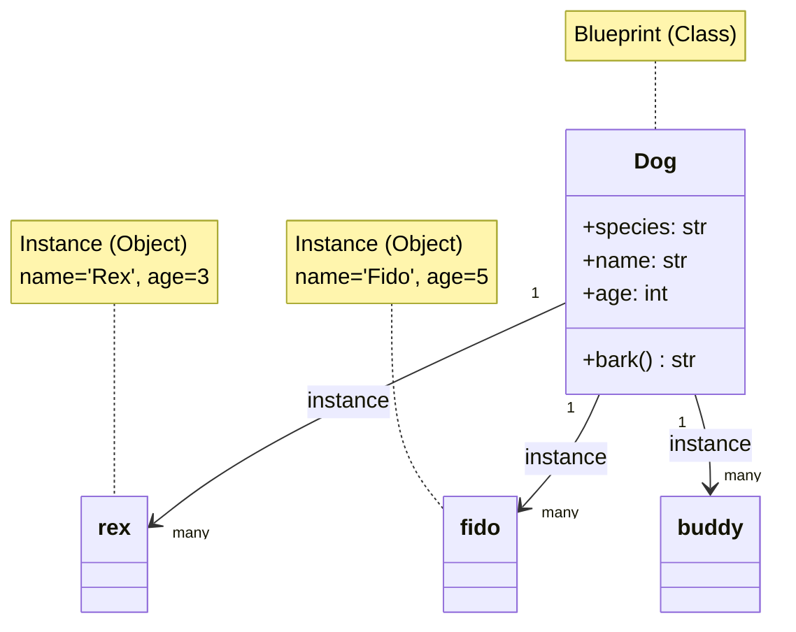
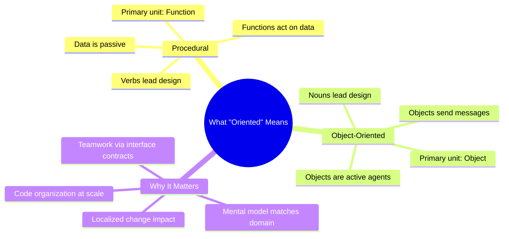
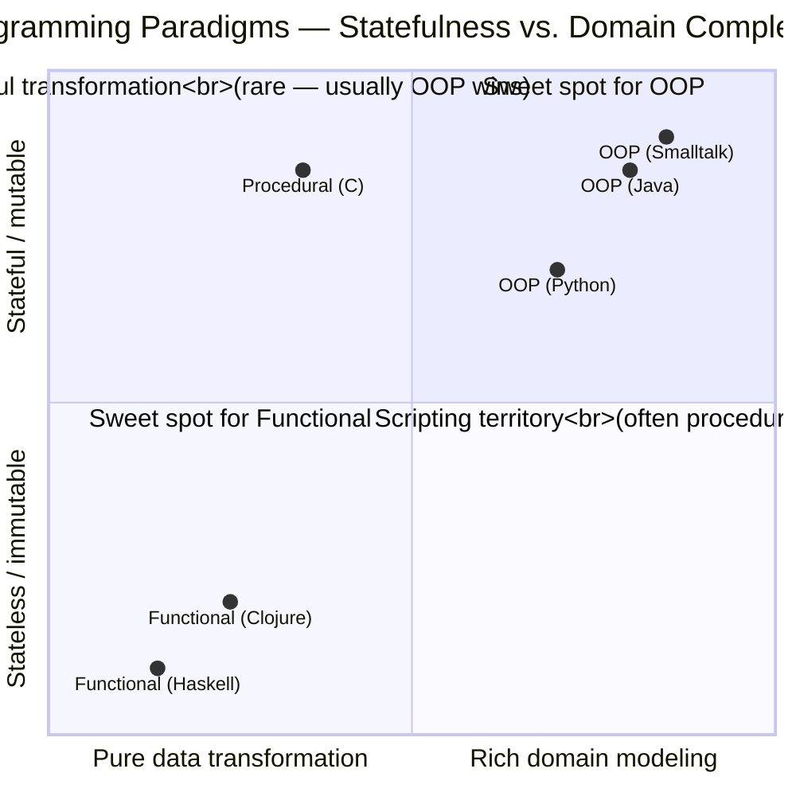
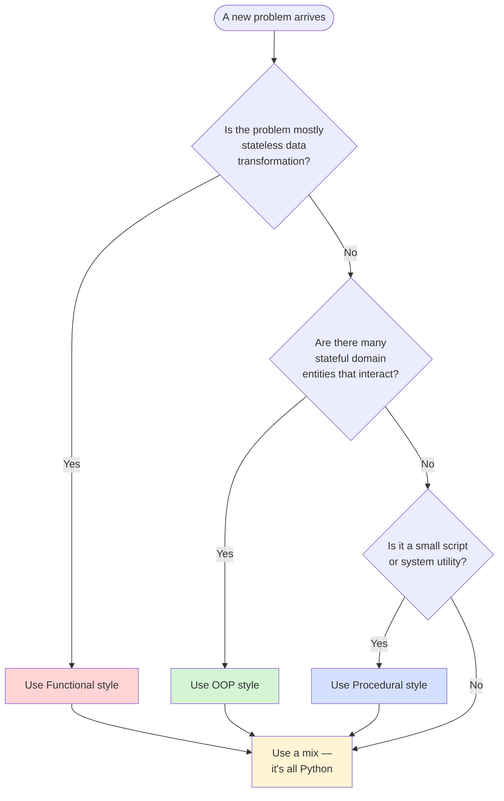
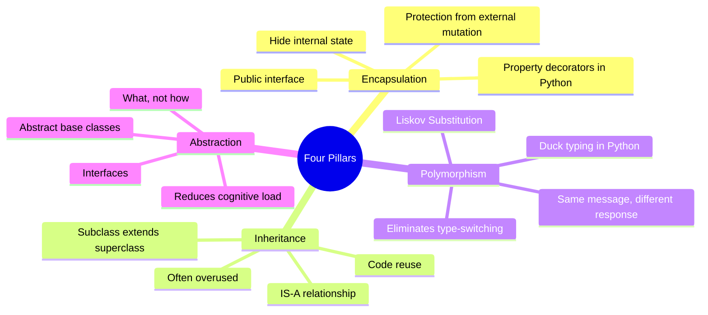
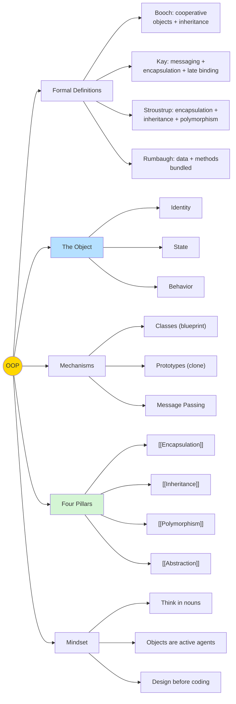

# What Is Object-Oriented Programming?

#oop #foundations #definition #philosophy #teaching

> [!quote] Alan Kay — the man who coined "object-oriented"
> "OOP to me means only messaging, local retention and protection and hiding of state-process, and extreme late-binding of all things."

Object-Oriented Programming (OOP) is simultaneously one of the most successful and most misunderstood ideas in computer science. It is the dominant programming paradigm of the last thirty years, the backbone of Java, C#, Python, C++, Ruby, Swift, and Kotlin, and yet the question "what *is* OOP, really?" still produces radically different answers depending on whom you ask.



This note gives you a deep, pedagogically grounded answer — one that you can teach from, learn from, and defend in a code review.

---

## 1. The Short Answer (and Why the Short Answer Is Dangerous)

> [!info] TL;DR
> **Object-Oriented Programming is a way of organizing programs around *objects* — bundles of related *data* (state) and *behavior* (methods) that communicate by sending *messages* to each other.**

That sentence is true, but it hides more than it reveals. Most introductory courses stop here, and that is why most students finish an OOP module still confused. To truly understand OOP, we have to look at:

1. Where the idea came from (see [[History-Of-OOP]])
2. Why it was invented (see [[Why-OOP]])
3. What its founders actually meant (this note)
4. How it compares to alternatives (see [[OOP-Paradigms]])

> [!warning] Common Student Misconception #1
> "OOP is just classes." No. Classes are an *implementation mechanism* for OOP, not OOP itself. JavaScript (before ES6) had no `class` keyword, yet was object-oriented. You can write procedural code *inside* a class — that is not OOP, that is procedural code wearing a costume.

---

## 2. Formal Definitions from the Authorities

OOP has been defined many times by many thinkers. Each definition illuminates a different facet of the same gemstone.

### 2.1 Grady Booch

> [!quote] Grady Booch — *Object-Oriented Analysis and Design* (1994)
> "Object-oriented programming is a method of implementation in which programs are organized as cooperative collections of objects, each of which represents an instance of some class, and whose classes are all members of a hierarchy of classes united via inheritance relationships."

**Key idea**: OOP is about *cooperative collections* — objects that work together, not isolated blobs. Booch also emphasizes *classes* and *inheritance* — the structural side.

### 2.2 James Rumbaugh (OMT)

> [!quote] Rumbaugh et al. — *Object-Oriented Modeling and Design* (1991)
> "Object-oriented programming is a programming paradigm based on the concept of 'objects', which may contain data, in the form of fields, often known as attributes; and code, in the form of procedures, often known as methods."

**Key idea**: data + code, bundled together. The simplest possible definition, and the one most intro courses adopt.

### 2.3 Bjarne Stroustrup (C++ creator)

> [!quote] Bjarne Stroustrup
> "Object-oriented programming is programming with inheritance and dynamic binding." — and elsewhere — "I don't consider a language object-oriented unless it supports encapsulation, inheritance, and polymorphism."

**Key idea**: For Stroustrup, OOP requires the *three pillars* — encapsulation, inheritance, polymorphism — to be first-class language features. He is hardline about this because C++ was designed to add precisely these features to C.

### 2.4 Alan Kay (Smalltalk co-creator, coined "object-oriented" in 1967)

> [!quote] Alan Kay
> "I made up the term 'object-oriented', and I can tell you I did not have C++ in mind. ... The big idea is 'messaging'."

Kay's definition is the most radical and the most often ignored. For Kay, OOP is fundamentally about:

1. **Message passing** between objects
2. **Encapsulation** of state (objects hide their internals)
3. **Late binding** (decisions are deferred until runtime)

Notice what is *missing* from Kay's list: classes and inheritance. Kay considered inheritance a secondary feature — useful, but not the essence. This is a profound point we will return to.

> [!tip] Teaching Tip
> When students ask "what *really* is OOP?", show them these four definitions side by side. The disagreement is itself the lesson: OOP is not one thing, it is a *family* of related ideas, and different communities emphasize different parts.

---

## 3. The Core Idea: State + Behavior Bundled Together

Strip away all the philosophy and the language mechanics, and OOP rests on one structural insight:

> **Data and the functions that operate on that data belong together.**

In procedural programming, you write *data structures* (structs, records) in one place and *functions* that take those structures as arguments in another place. In OOP, you put the data and the functions inside the same capsule.

```python
# Procedural style — data and behavior live separately
from dataclasses import dataclass

@dataclass
class BankAccountData:
    owner: str
    balance: float

def deposit(account: BankAccountData, amount: float) -> None:
    if amount <= 0:
        raise ValueError("Deposit must be positive")
    account.balance += amount

def withdraw(account: BankAccountData, amount: float) -> None:
    if amount > account.balance:
        raise ValueError("Insufficient funds")
    account.balance -= amount

# Usage
acct = BankAccountData(owner="Alice", balance=100.0)
deposit(acct, 50.0)
withdraw(acct, 30.0)
print(acct.balance)  # 120.0
```

```python
# Object-oriented style — data and behavior live together
class BankAccount:
    def __init__(self, owner: str, balance: float = 0.0) -> None:
        self.owner = owner
        self._balance = balance          # encapsulated state

    def deposit(self, amount: float) -> None:
        if amount <= 0:
            raise ValueError("Deposit must be positive")
        self._balance += amount

    def withdraw(self, amount: float) -> None:
        if amount > self._balance:
            raise ValueError("Insufficient funds")
        self._balance -= amount

    @property
    def balance(self) -> float:
        return self._balance

# Usage
acct = BankAccount(owner="Alice", balance=100.0)
acct.deposit(50.0)
acct.withdraw(30.0)
print(acct.balance)  # 120.0
```

Notice the shift in the **call site**: instead of `deposit(acct, 50.0)` — "perform deposit on account" — we write `acct.deposit(50.0)` — "account, deposit this". The account is no longer a passive data bag; it is an **agent** that performs actions on itself.

> [!example] Mental Model
> Procedural: *functions act on data.*
> Object-oriented: *objects act on themselves, and ask other objects to act.*

This single shift in perspective is the heart of OOP. Everything else — classes, inheritance, polymorphism — is a consequence of taking this idea seriously at scale.

---

## 4. The Object Concept: Identity, State, Behavior

To talk precisely about objects, we need three technical terms. They come from the OOP theory literature (Booch, Rumbaugh) and they matter.

### 4.1 Identity

> An object's **identity** is the fact that it is *itself*, distinct from every other object, regardless of whether its current state happens to match another object's state.

```python
a = BankAccount("Alice", 100.0)
b = BankAccount("Alice", 100.0)   # same state!
print(a == b)  # Probably False (unless we defined __eq__)
print(a is b)  # Definitely False — different objects
```

`a` and `b` have the same *state* but different *identity*. This is the same distinction as "two dollar bills with the same serial number" — impossible, because each bill is a distinct physical object.

### 4.2 State

> An object's **state** is the set of values of its attributes at a given moment in time.

State is what changes when you call a method. State is what you must protect (encapsulation) and what you must reason about when debugging.

### 4.3 Behavior

> An object's **behavior** is the set of methods it exposes — the operations it knows how to perform.

Behavior is the *contract* the object offers to the outside world. Other code should depend on behavior, not on state — that's the rule of [[Encapsulation]].



> [!note] Why Identity Matters
> Without identity, you cannot have *mutable* objects safely. Two references to the same list must update each other; that only works because they share identity. Pure functional programming avoids identity by making everything immutable — a deliberate trade-off.

---

## 5. Message Passing — Alan Kay's Forgotten Heart of OOP

This is the section most OOP textbooks skim. Don't skim it.

When Alan Kay designed Smalltalk, he was inspired by biology — specifically, by cells in a living organism. Cells don't reach into each other's nuclei and rearrange DNA. They send chemical signals to each other's membranes, and each cell decides how to respond. Kay called these signals **messages**.

> [!quote] Alan Kay
> "The key in making great and growable systems is much more to design how its modules communicate rather than what their internal properties and behaviors should be."

In a pure message-passing model:

- An object A does **not** call object B's method directly.
- Instead, A *sends a message* to B.
- B *decides* how (or whether) to handle that message.
- A does not know B's internal class, methods, or structure.

Python gives us a watered-down version of this: `acct.deposit(50)` *looks* like a method call, but at runtime it is a message send. The interpreter looks up `deposit` on `acct` — it could be a method on the class, on a parent class, on a mixin, or even dynamically added — and invokes whatever it finds. If nothing matches, Python raises `AttributeError`, which is the language's way of saying "the object didn't understand the message."

```python
# Demonstrating Python's message-passing nature
class Greeter:
    def __init__(self, name: str) -> None:
        self.name = name

    def greet(self) -> str:
        return f"Hello, {self.name}!"

g = Greeter("World")
# This is a *message send*, not a function call:
print(g.greet())  # "Hello, World!"

# We can intercept unknown messages — proof that Python is message-based:
class FlexibleObject:
    def __getattr__(self, name: str):
        # Called when no attribute named `name` is found
        return lambda *args, **kwargs: f"You sent me: {name}({args}, {kwargs})"

f = FlexibleObject()
print(f.anything("a", "b", x=1))
# "You sent me: anything(('a', 'b'), {'x': 1})"
```

> [!warning] Common Student Misconception #2
> "Method calls and message passing are the same thing." They *are* the same thing in most modern languages, because the language designers fused them. But conceptually they are different: a **method call** is `object.method()` — you know the method exists; a **message** is `object.send(:symbol, args)` — you ask the object to handle a request and you don't care how. Ruby, Smalltalk, and Objective-C make this distinction visible; Python, Java, and C++ hide it.



---

## 6. Classes vs Objects — The Blueprint Metaphor

A **class** is a template, blueprint, or cookie-cutter. An **object** is what you produce by applying that template.

> [!example] The Cookie Cutter Analogy
> Imagine you have a star-shaped cookie cutter (the **class**). You press it into dough and you get a star cookie (an **object**). You can press it a hundred times and get a hundred cookies — same shape, but each one is a distinct physical object. You can frost one and not the others. The cutter is not a cookie; the cookies are not the cutter.

```python
# Class = blueprint
class Dog:
    species = "Canis familiaris"   # class attribute — shared by all dogs

    def __init__(self, name: str, age: int) -> None:
        self.name = name            # instance attribute — unique per dog
        self.age = age

    def bark(self) -> str:
        return f"{self.name} says Woof!"

# Objects = instances built from the blueprint
rex = Dog("Rex", 3)
fido = Dog("Fido", 5)

print(rex.name)         # "Rex"  — instance attribute
print(fido.name)        # "Fido" — different instance attribute
print(rex.species)      # "Canis familiaris" — class attribute
print(fido.species)     # "Canis familiaris" — same class attribute
print(rex.bark())       # "Rex says Woof!"
print(fido.bark())      # "Fido says Woof!"

print(type(rex))        # <class '__main__.Dog'>
print(isinstance(rex, Dog))  # True
```



### 6.1 Are Classes Required for OOP?

**No.** This is one of the most important conceptual points in this whole note.

JavaScript (pre-ES6), Self, Io, and Lua are *prototype-based* OOP languages. They have no classes. You create an object directly, and you create new objects by *cloning* existing ones:

```javascript
// JavaScript prototype-based OOP (no class keyword needed)
const dog = {
  species: "Canis familiaris",
  bark() { return `${this.name} says Woof!`; }
};

const rex = Object.create(dog);  // clone the prototype
rex.name = "Rex";
rex.age = 3;
console.log(rex.bark());  // "Rex says Woof!"
```

So when someone says "OOP needs classes", that is *one tradition* of OOP (the Simula/C++/Java tradition). The other tradition (Smalltalk/Self/JavaScript) is *prototype-based*. See [[OOP-Paradigms]] for the full taxonomy.

> [!danger] Common Student Misconception #3
> "Classes are OOP." Wrong. Classes are *one mechanism* for achieving OOP. OOP is the *paradigm* (organize around objects); classes are one way to *instantiate* objects. Conflating the two blinds you to half of the OOP world.

---

## 7. Why "Oriented" Matters

The word **object-oriented** is not accidental. "Oriented" means *facing toward*, *organized around*. The defining trait of OOP is not that it *has* objects — many procedural programs have data structures that look object-like. The defining trait is that the **program is organized around objects**.

In a procedural program, the *functions* are the primary units of organization. You think "what do I need to do?" and then "what data does this function need?".

In an OOP program, the *objects* are the primary units of organization. You think "what kinds of things exist in this domain?" and then "what can each of those things do?".

> [!example] Designing a Library System
> **Procedural thinking**: "I need a function to check out a book. It takes a book ID and a patron ID and updates two lists."
>
> **Object-oriented thinking**: "I have a `Library`, which contains `Book`s and `Patron`s. A `Patron` can `check_out` a `Book`. The `Book` knows whether it is currently available. The `Library` orchestrates the transaction."

Notice the difference: the OOP version models the *nouns* of the domain as objects, and the *verbs* as methods on those objects. The procedural version models the *verbs* as functions and treats the nouns as passive data.

```python
# Procedural library
def checkout(book_id, patron_id, books, patrons, loans):
    if book_id not in books or books[book_id]["available"] is False:
        raise ValueError("Book unavailable")
    loans.append({"book": book_id, "patron": patron_id})
    books[book_id]["available"] = False
    patrons[patron_id]["books_out"] += 1

# Object-oriented library
class Book:
    def __init__(self, title: str) -> None:
        self.title = title
        self._available = True

    @property
    def available(self) -> bool:
        return self._available

    def checkout(self) -> None:
        if not self._available:
            raise ValueError(f"{self.title} is already checked out")
        self._available = False

    def return_book(self) -> None:
        self._available = True


class Patron:
    def __init__(self, name: str) -> None:
        self.name = name
        self._books_out: list[Book] = []

    @property
    def books_out_count(self) -> int:
        return len(self._books_out)


class Library:
    def __init__(self) -> None:
        self._catalog: list[Book] = []

    def add_book(self, book: Book) -> None:
        self._catalog.append(book)

    def checkout(self, book: Book, patron: Patron) -> None:
        book.checkout()
        patron._books_out.append(book)   # In real code, use a method on Patron
```

The OOP version is longer, yes — but each piece is *self-contained*. `Book` doesn't know `Patron` exists. `Patron` doesn't know about the library catalog. That **separation of concerns** is what "oriented" buys you.



---

## 8. The Mental Model: Thinking in Objects

A skilled OOP designer can look at almost any problem description and "see" the objects in it. This skill is partly innate, mostly trained. Here is the algorithm.

### The Noun-Verb Method

1. Write a one-paragraph description of the problem in plain English.
2. Circle the **nouns**. Each noun is a *candidate class*.
3. Underline the **verbs**. Each verb is a *candidate method* on the noun that owns it.
4. Eliminate synonyms and trivial nouns (e.g., "system", "user input").
5. Connect related classes; look for inheritance, composition, and dependency relationships.

### Example: Building a Coffee Shop App

> "A customer places an order with a barista. The order contains one or more drinks. The barista prepares each drink and marks it ready. The customer pays for the order. The shop tracks daily revenue."

Nouns: Customer, Order, Barista, Drink, Shop, Revenue.
Verbs: place order, prepare drink, mark ready, pay, track revenue.

```python
from dataclasses import dataclass, field
from enum import Enum


class DrinkType(Enum):
    ESPRESSO = "espresso"
    LATTE = "latte"
    CAPPUCCINO = "cappuccino"


@dataclass
class Drink:
    drink_type: DrinkType
    price: float
    ready: bool = False


@dataclass
class Order:
    customer: "Customer"
    drinks: list[Drink] = field(default_factory=list)
    paid: bool = False

    def total(self) -> float:
        return sum(d.price for d in self.drinks)


@dataclass
class Customer:
    name: str

    def place_order(self, drinks: list[Drink], barista: "Barista") -> Order:
        order = Order(customer=self, drinks=drinks)
        barista.receive_order(order)
        return order

    def pay(self, order: Order, shop: "CoffeeShop") -> None:
        shop.record_revenue(order.total())
        order.paid = True


@dataclass
class Barista:
    name: str

    def receive_order(self, order: Order) -> None:
        for drink in order.drinks:
            self.prepare(drink)

    def prepare(self, drink: Drink) -> None:
        drink.ready = True


@dataclass
class CoffeeShop:
    daily_revenue: float = 0.0

    def record_revenue(self, amount: float) -> None:
        self.daily_revenue += amount


# Putting it together
shop = CoffeeShop()
alice = Customer(name="Alice")
bob = Barista(name="Bob")

drinks = [
    Drink(DrinkType.LATTE, 4.50),
    Drink(DrinkType.ESPRESSO, 3.00),
]

order = alice.place_order(drinks, bob)
alice.pay(order, shop)

print(f"All drinks ready: {all(d.ready for d in order.drinks)}")  # True
print(f"Order paid: {order.paid}")                                  # True
print(f"Shop revenue: ${shop.daily_revenue:.2f}")                   # $7.50
```

> [!tip] Teaching Tip — The Paragraph Exercise
> Give students a paragraph describing a system (a restaurant, a hospital, a video game) and ask them to circle nouns and underline verbs. Then ask: "Which of these are likely to be classes? Which are likely to be methods? Which nouns are actually just attributes of other nouns?" This exercise teaches more OOP in 20 minutes than an hour of syntax drill.

---

## 9. Comparison: Procedural vs OOP vs Functional

OOP is one of several paradigms. To understand OOP, you must understand its neighbors.

| Aspect | Procedural | Object-Oriented | Functional |
|---|---|---|---|
| Primary unit | Function | Object (state + behavior) | Pure function |
| State | Global or local mutable variables | Encapsulated in objects | Avoided; immutable data |
| Code reuse | Function calls | Inheritance, composition | Higher-order functions, composition |
| Mental model | "Do this, then this" | "Things exist and interact" | "Transform data through pipelines" |
| Best for | Small scripts, system utilities | Large systems, domain modeling | Data transformation, concurrency |
| Languages | C, Pascal, early BASIC | Java, Python, C++, C# | Haskell, Elm, Clojure |

```python
# Same problem: word frequency counter — three styles

# --- Procedural ---
def word_freq_procedural(text: str) -> dict[str, int]:
    words = text.lower().split()
    result: dict[str, int] = {}
    for word in words:
        if word in result:
            result[word] += 1
        else:
            result[word] = 1
    return result

# --- Object-Oriented ---
class WordFrequencyCounter:
    def __init__(self) -> None:
        self._counts: dict[str, int] = {}

    def add_text(self, text: str) -> "WordFrequencyCounter":
        for word in text.lower().split():
            self._counts[word] = self._counts.get(word, 0) + 1
        return self  # enable method chaining

    def frequencies(self) -> dict[str, int]:
        return dict(self._counts)

    def top_n(self, n: int) -> list[tuple[str, int]]:
        return sorted(self._counts.items(), key=lambda kv: -kv[1])[:n]

# --- Functional ---
from collections import Counter
from functools import reduce

def word_freq_functional(text: str) -> dict[str, int]:
    return dict(Counter(text.lower().split()))

def pipeline(*functions):
    """Compose functions left-to-right."""
    return reduce(lambda f, g: lambda x: g(f(x)), functions)

normalize = str.lower
tokenize = str.split
count = Counter
to_dict = dict

word_freq = pipeline(normalize, tokenize, count, to_dict)
```

Each style has strengths. Procedural is the simplest to teach and the most direct. Functional shines for parallelism and testability. OOP shines when the domain is *stateful*, *long-lived*, and *collaborative*.



> [!note] The Real-World Truth
> Most production Python code is *multi-paradigm*. You will have classes that internally use functional patterns (list comprehensions, `map`/`filter`) and pure functions that operate on objects. The paradigms are not enemies — they are tools.



---

## 10. The Four Pillars — A Brief Overview

> [!info]
> This is an *overview*. Deep treatments live in [[Encapsulation]], [[Inheritance]], [[Polymorphism]], and [[Abstraction]].

### 10.1 Encapsulation

> Bundling data with the methods that operate on it, and **hiding** the internal details behind a public interface.

Encapsulation is what lets you change `_balance` from a `float` to a `Decimal` without breaking any code that calls `acct.balance`. It is the *blast wall* between an object's internals and its users.

```python
class Temperature:
    def __init__(self, celsius: float) -> None:
        self._celsius = celsius

    @property
    def celsius(self) -> float:
        return self._celsius

    @property
    def fahrenheit(self) -> float:
        return self._celsius * 9 / 5 + 32

    @celsius.setter
    def celsius(self, value: float) -> None:
        if value < -273.15:
            raise ValueError("Below absolute zero")
        self._celsius = value
```

### 10.2 Inheritance

> Defining new classes as specialized versions of existing ones, reusing their structure and behavior.

```python
class Animal:
    def __init__(self, name: str) -> None:
        self.name = name

    def speak(self) -> str:
        raise NotImplementedError

class Dog(Animal):
    def speak(self) -> str:
        return f"{self.name}: Woof!"

class Cat(Animal):
    def speak(self) -> str:
        return f"{self.name}: Meow!"
```

> [!warning] Caution
> Inheritance is powerful but overused. See [[Composition-Over-Inheritance]] for why preferring composition usually leads to better designs.

### 10.3 Polymorphism

> Different objects responding to the *same message* in their own way.

```python
def make_them_speak(animals: list[Animal]) -> None:
    for a in animals:
        print(a.speak())

make_them_speak([Dog("Rex"), Cat("Whiskers"), Dog("Buddy")])
# Rex: Woof!
# Whiskers: Meow!
# Buddy: Woof!
```

No `if type == Dog` checks. No `switch` statements. Each object knows how to `speak` — that's polymorphism.

### 10.4 Abstraction

> Focusing on *what* something does, not *how* it does it. Defining essential characteristics without including background details.

```python
from abc import ABC, abstractmethod

class PaymentProcessor(ABC):
    """Abstract: defines the contract, not the implementation."""
    @abstractmethod
    def charge(self, amount: float) -> bool:
        ...

class StripeProcessor(PaymentProcessor):
    def charge(self, amount: float) -> bool:
        # ... actual Stripe API call
        return True

class PayPalProcessor(PaymentProcessor):
    def charge(self, amount: float) -> bool:
        # ... actual PayPal API call
        return True
```



---

## 11. OOP as a Way of Thinking, Not a Syntax Feature

Here is the deepest idea in this entire note:

> [!quote] The Paradigm Mindset
> OOP is not a feature of your language. It is a way of *thinking* about your problem. You can write OOP code in C (with structs and function pointers) and you can write procedural code in Java (with God classes and static methods). The language nudges you, but it doesn't decide for you.

A useful diagnostic: open a file of code, and ask:

- Are the *nouns* of the domain modeled as objects, or are they just data bags?
- Does each object have a *coherent responsibility*, or does one class do everything?
- Do objects *collaborate via messages*, or does one function reach into every other one's internals?
- Could I change the internal representation of one object without rewriting half the codebase?

If you answered "no" to any of these, you are writing procedural code in an OOP-shaped syntax. That is *legal* — Python won't stop you — but it forfeits most of the benefits of OOP.

> [!danger] Common Student Misconception #4
> "If I write `class Foo:` then I'm doing OOP." Writing the keyword `class` does not make your code object-oriented, any more than wearing a chef's hat makes you a cook. OOP is a *design discipline*, not a syntax choice.

> [!danger] Common Student Misconception #5
> "OOP = inheritance." Inheritance is one of four pillars, and many great OOP designs use it sparingly. If your mental model of OOP is "I make classes inherit from other classes," you've missed 75% of what OOP is. (See also: [[Composition-Over-Inheritance]].)

---

## 12. A Worked Example — From Procedural to Object-Oriented

Let's watch a small program evolve from procedural to OOP, and see what each step buys us.

### 12.1 V1 — Pure procedural, global state

```python
# Bad: global state, scattered functions
shopping_cart: list[dict] = []
total: float = 0.0

def add_item(name: str, price: float) -> None:
    shopping_cart.append({"name": name, "price": price})
    global total
    total += price

def remove_item(name: str) -> None:
    global total
    for item in shopping_cart:
        if item["name"] == name:
            shopping_cart.remove(item)
            total -= item["price"]
            return

def print_receipt() -> None:
    print("--- Receipt ---")
    for item in shopping_cart:
        print(f"{item['name']}: ${item['price']:.2f}")
    print(f"Total: ${total:.2f}")
```

Problems:
- Only **one** shopping cart can exist at a time.
- `total` can drift out of sync if we mutate `shopping_cart` directly.
- Functions are *coupled* to global variables.

### 12.2 V2 — Object encapsulating state

```python
class ShoppingCart:
    def __init__(self) -> None:
        self._items: list[dict] = []
        self._total: float = 0.0

    def add_item(self, name: str, price: float) -> None:
        self._items.append({"name": name, "price": price})
        self._total += price

    def remove_item(self, name: str) -> None:
        for item in self._items:
            if item["name"] == name:
                self._items.remove(item)
                self._total -= item["price"]
                return

    def print_receipt(self) -> None:
        print("--- Receipt ---")
        for item in self._items:
            print(f"{item['name']}: ${item['price']:.2f}")
        print(f"Total: ${self._total:.2f}")

# Now we can have many carts
alice_cart = ShoppingCart()
bob_cart = ShoppingCart()
alice_cart.add_item("Book", 12.99)
bob_cart.add_item("Laptop", 999.99)
```

Wins: many carts can coexist; state is encapsulated; `total` cannot drift.

### 12.3 V3 — Extracting the Item into its own class

```python
@dataclass
class CartItem:
    name: str
    price: float
    quantity: int = 1

    def line_total(self) -> float:
        return self.price * self.quantity


class ShoppingCart:
    def __init__(self) -> None:
        self._items: list[CartItem] = []

    def add_item(self, item: CartItem) -> None:
        existing = self._find(item.name)
        if existing:
            existing.quantity += item.quantity
        else:
            self._items.append(item)

    def _find(self, name: str) -> CartItem | None:
        return next((i for i in self._items if i.name == name), None)

    @property
    def total(self) -> float:
        return sum(i.line_total() for i in self._items)

    def print_receipt(self) -> None:
        print("--- Receipt ---")
        for item in self._items:
            print(f"{item.name} x{item.quantity}: ${item.line_total():.2f}")
        print(f"Total: ${self.total:.2f}")
```

Wins: `CartItem` knows its own line total (single responsibility); the cart no longer has to compute it; quantity merging is built in.

### 12.4 V4 — Adding polymorphism for discounts

```python
from abc import ABC, abstractmethod

class Discount(ABC):
    @abstractmethod
    def apply(self, total: float) -> float:
        ...

class NoDiscount(Discount):
    def apply(self, total: float) -> float:
        return total

class PercentageDiscount(Discount):
    def __init__(self, percent: float) -> None:
        self.percent = percent
    def apply(self, total: float) -> float:
        return total * (1 - self.percent / 100)

class FixedDiscount(Discount):
    def __init__(self, amount: float) -> None:
        self.amount = amount
    def apply(self, total: float) -> float:
        return max(0.0, total - self.amount)


class ShoppingCart:
    def __init__(self, discount: Discount | None = None) -> None:
        self._items: list[CartItem] = []
        self._discount = discount or NoDiscount()

    # ... (add_item, _find as before) ...

    @property
    def total(self) -> float:
        subtotal = sum(i.line_total() for i in self._items)
        return self._discount.apply(subtotal)
```

Wins: we can now add new discount types without touching `ShoppingCart`. This is the [[Open-Closed Principle]] in action — and it's only possible because we modeled `Discount` as an object with polymorphic behavior.

---

## 13. Common Student Misconceptions — Collected

> [!warning] The Big Five
> 1. **"OOP = classes."** Classes are a mechanism. JavaScript does OOP without them.
> 2. **"OOP = inheritance."** Inheritance is one of four pillars; many designs use composition instead.
> 3. **"Putting code in a class makes it OOP."** No. A class full of `@staticmethod` is procedural code.
> 4. **"Objects must mirror real-world entities."** Many great objects (`StringBuilder`, `Mutex`, `Promise`) have no real-world analog. Model the *problem*, not the *physical world*.
> 5. **"More classes = more OOP."** A 500-class design with poor responsibilities is worse than a 20-class design with sharp boundaries. OOP rewards *quality of abstraction*, not *quantity of classes*.

> [!warning] The Next Five
> 6. **"Private attributes (`_foo`) are truly private."** In Python they aren't — they are a *convention*. Real privacy requires `__double_leading_underscore` name mangling, and even that can be bypassed.
> 7. **"Getter and setter for everything."** Pythonic OOP prefers properties and direct attribute access. Getters/setters are a Java-ism.
> 8. **"Abstract classes are required for abstraction."** Abstraction is a *mental* act. You can have abstraction without `ABC`; you can have an `ABC` with no abstraction at all.
> 9. **"Object composition means using a class."** Composition specifically means *has-a* relationships, contrasted with *is-a* (inheritance).
> 10. **"Python is not a 'real' OOP language because it has free functions."** Python is *multi-paradigm with first-class OOP*. Free functions are an asset, not a defect.

---

## 14. Teaching OOP to Beginners — A Pedagogical Sequence

If you are teaching OOP, do **not** start with `class Foo: pass`. Start with the *idea* of an object.

### Suggested Sequence

1. **Day 1: Objects in the wild.** Have students use built-in objects (strings, lists, files) before defining any. Ask: "What can a list *do*? What does it *know*?" Plant the seed that objects have state + behavior.

2. **Day 2: The blueprint metaphor.** Introduce `class` as a *factory* for objects. Define a trivial `Dog` class. Create three dogs. Show that `rex.name` differs from `fido.name`.

3. **Day 3: Methods that use `self`.** Add a `bark()` method. Have students trace what `self` is at runtime. Use `print(id(self))` to make it concrete.

4. **Day 4: Encapsulation.** Add a `_balance` and a `deposit()` method. Show that without encapsulation, `acct._balance = -999` is *possible*. With it (and a property setter), we can prevent that.

5. **Day 5: Composition.** Build a `Library` that contains `Book`s. Demonstrate that objects can hold other objects.

6. **Day 6: Inheritance.** Only now. And immediately introduce the warning that composition is usually better.

7. **Day 7: Polymorphism.** Show that `for a in animals: a.speak()` works without type-checks. Connect this to the elimination of `if/elif` chains.

8. **Day 8: A small project.** A 5-class system (library, coffee shop, RPG character). Students should *design first*, then code.

> [!success] The Single Best Teaching Move
> Have students maintain a *vocabulary list* of the domain. Every noun is a candidate class. Every verb is a candidate method. Every adjective ("*premium* customer", "*international* order") is a candidate subclass or strategy. This makes OOP design feel like a *discovery* process, not a memorization task.

```mermaid
journey
    title A student's journey learning OOP
    section Day 1-2: Discovery
      Use built-in objects: 4: Student
      Notice objects have state + behavior: 3: Student
      "What can a list DO?": 4: Student
    section Day 3-5: Mechanics
      First custom class: 5: Student
      The "self" epiphany: 2: Student
      Encapsulation prevents -999 balance: 4: Student
      Composition builds Library of Books: 4: Student
    section Day 6-8: Deeper ideas
      Inheritance tempts overuse: 2: Student
      Polymorphism removes if/elif chains: 5: Student
      First real 5-class design: 4: Student
    section Month 2+: Mastery
      Reads SOLID principles: 3: Student
      Recognizes God classes in legacy code: 5: Student
      Teaches the next student: 5: Student
```

---

## 15. A Concept Map of OOP



---

## 16. Summary — What OOP Is, In One Page

- **OOP** is a programming paradigm that organizes code around **objects** — bundles of **state** (data) and **behavior** (methods) that communicate via **messages**.
- An object has **identity** (it is itself), **state** (its current data), and **behavior** (its methods).
- A **class** is a blueprint for creating objects; an **object** is an instance of a class. Classes are not strictly required for OOP — prototype-based languages like JavaScript prove this.
- The word **"oriented"** matters: OOP code is *organized around* objects, not functions. Functions still exist, but they live *inside* objects.
- The **four pillars** — Encapsulation, Inheritance, Polymorphism, Abstraction — are the techniques by which OOP achieves its goals.
- OOP is a **way of thinking** about problems: identify the nouns, make them objects, give them responsibilities, let them collaborate.
- **Misconceptions** to avoid: OOP is not just classes; not just inheritance; not just "use the keyword `class`". OOP is a *design discipline*.

> [!quote] A Closing Thought
> "The question is not 'is this language object-oriented?' but 'is this *program* object-oriented?'" — adapted from Alan Kay

---

## 17. What's Next?

- [[Why-OOP]] — what problems does OOP actually solve, and where does it come from?
- [[History-Of-OOP]] — the people, languages, and ideas that built OOP.
- [[OOP-Paradigms]] — how OOP compares to functional, procedural, logic, and reactive paradigms.
- [[Classes-And-Objects]] — deep dive into Python's class and object model.
- [[Encapsulation]] — the first pillar, in depth.
- [[SOLID-Principles]] — the five design principles that make OOP code maintainable.

---

> [!info] Glossary (Quick Reference)
>
> | Term | Definition |
> |---|---|
> | **Object** | A bundle of state and behavior with a unique identity. |
> | **Class** | A blueprint or template for creating objects. |
> | **Instance** | A specific object created from a class. |
> | **Method** | A function defined on a class; an object's behavior. |
> | **Attribute** | A variable bound to an object or class; an object's state. |
> | **Message** | A request sent to an object asking it to perform an action. |
> | **Interface** | The set of messages an object responds to. |
> | **Encapsulation** | Hiding internal state behind a public interface. |
> | **Inheritance** | Defining a new class as a specialization of an existing one. |
> | **Polymorphism** | Different objects responding to the same message differently. |
> | **Abstraction** | Focusing on essential characteristics, ignoring details. |
