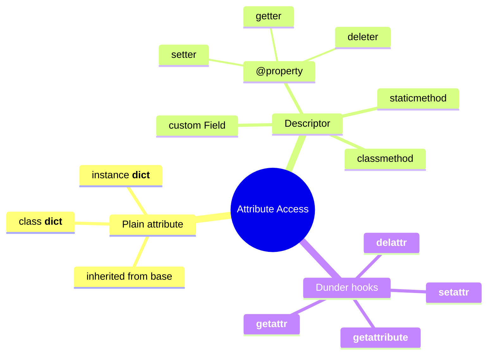
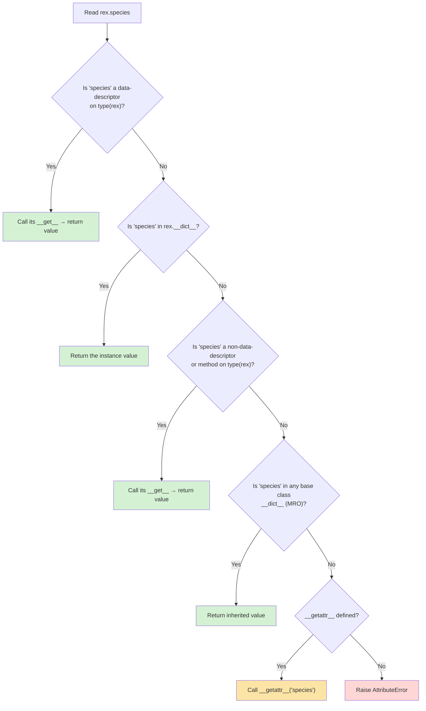
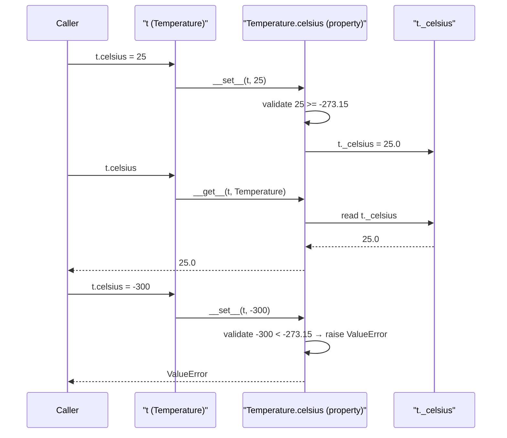
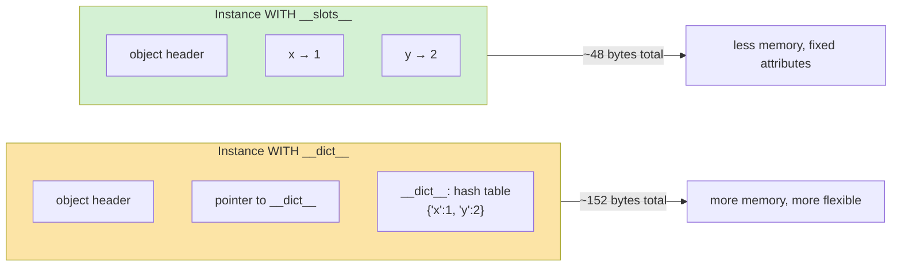

# Attributes and Properties

#oop #fundamentals #attributes #properties #encapsulation #teaching

> [!quote] Raymond Hettinger
> "Properties are how Python does encapsulation without giving up the simple, attribute-style access that makes Python readable."

If a class is the *shape* of an object, then **attributes** are the *slots* in that shape where data lives, and **properties** are the *logic* around those slots — validation, computation, lazy loading, access control. This note unpacks both, in depth, with the focus on the mental model rather than just the syntax.

Prerequisite: read [[Classes-And-Objects]] first, especially §6 (class vs instance variables) and §7 (`__dict__`).

---

## 1. The Big Picture

Python objects expose three families of "things you can dot-access":

1. **Plain attributes** — `obj.x = 5` writes directly into `obj.__dict__`.
2. **Descriptors** — objects that implement `__get__`/`__set__`/`__delete__` and intercept attribute access. The most common descriptor you'll write is a property.
3. **Dunder hooks** — `__getattr__`, `__getattribute__`, `__setattr__`, which intercept *all* attribute access at the type level.



This note covers plain attributes and properties. Descriptors in their full glory live in [[Descriptors]], and the dunder hooks are unpacked in [[How-OOP-Works]].

---

## 2. Instance Attributes vs Class Attributes

### 2.1 The Two Storage Locations

Every Python object stores its data in a `__dict__`. But there are *two* `__dict__`s in play:

- `instance.__dict__` — per-object data (instance attributes).
- `Class.__dict__` — shared data (class attributes, methods, etc.).

```python
class Dog:
    species = "Canis familiaris"   # class attribute
    def __init__(self, name):
        self.name = name           # instance attribute

rex = Dog("Rex")
print(rex.__dict__)     # {'name': 'Rex'}      ← only instance data
print(Dog.__dict__['species'])   # 'Canis familiaris'
```

### 2.2 The Lookup Chain (Critical!)

When you read `rex.species`, Python walks this chain in order:



The key points:

1. **Data descriptors** (those that define both `__get__` and `__set__`) win over instance `__dict__`. Properties are data descriptors — that's why a property on the class can shadow an instance attribute of the same name.
2. **Instance attributes** beat non-data descriptors and plain class attributes.
3. If nothing matches, `__getattr__` (the fallback hook) gets a chance.

### 2.3 The Shadowing Gotcha

```python
class Dog:
    species = "Canis familiaris"

rex = Dog("Rex")
print(rex.species)   # Canis familiaris  ← from class
rex.species = "Wolf"  # creates INSTANCE attribute, shadows class attr
print(rex.species)   # Wolf              ← now from instance
print(Dog.species)   # Canis familiaris  ← class unchanged
del rex.species      # remove instance attr
print(rex.species)   # Canis familiaris  ← back to class
```

> [!warning] Common Student Misconception #1
> "I changed `rex.species` so the class is changed." No — you *shadowed* the class attribute with an instance attribute of the same name. The class attribute is untouched. The only way to change the class attribute is `Dog.species = ...` (or via a classmethod).

### 2.4 The Mutable Default Trap (Revisited)

```python
class Dog:
    tricks = []   # ← shared mutable class attribute
    def __init__(self, name):
        self.name = name
    def add_trick(self, trick):
        self.tricks.append(trick)   # mutates the SHARED list

rex = Dog("Rex"); rex.add_trick("sit")
lassie = Dog("Lassie"); lassie.add_trick("roll")
print(rex.tricks)     # ['sit', 'roll']     ← BUG
print(lassie.tricks)  # ['sit', 'roll']
```

The fix is to give each dog its own list:

```python
class Dog:
    def __init__(self, name):
        self.name = name
        self.tricks = []   # per-instance
```

> [!danger] This is the #1 silent bug in student code
> The trap is universal: lists, dicts, sets as class attributes. The trap also appears in `def f(x=[]):` — default arguments are evaluated *once* at function definition time, so all calls share the same list.

---

## 3. Setting Attributes

### 3.1 In `__init__`

```python
class Point:
    def __init__(self, x, y):
        self.x = x
        self.y = y
```

This is the canonical place to set instance attributes. Each `self.x = x` writes into `self.__dict__['x']`.

### 3.2 Anywhere Else (With Care)

You can add attributes at any time — Python is dynamic:

```python
p = Point(1, 2)
p.color = "red"   # adds a new instance attribute, no declaration needed
print(p.__dict__)  # {'x': 1, 'y': 2, 'color': 'red'}
```

This freedom is powerful (great for prototyping, mocking, configs) and dangerous (typos like `p.colour = "red"` create new attributes silently).

### 3.3 With `setattr()`

```python
for field in ["x", "y", "z"]:
    setattr(p, field, 0)   # equivalent to p.x = 0, p.y = 0, p.z = 0
```

`setattr(obj, name, value)` is the programmatic form of `obj.name = value`. Use it when the attribute name is a variable (e.g., deserializing JSON, building ORMs).

### 3.4 The `__init__` Sets the Contract

Even though Python allows adding attributes anywhere, a class's *contract* should be established in `__init__`. If you read a class and see `__init__(self, name, age)`, you know every instance will have at least `name` and `age` after construction. Attributes added in helper methods are surprises.

> [!tip] Teaching Tip
> Have students inspect `__init__` of a real class (e.g., `pathlib.Path.__init__` or `collections.Counter.__init__`) and list the attributes every instance is guaranteed to have. This builds the "what's the contract?" reflex.

---

## 4. The `getattr` / `setattr` / `hasattr` / `delattr` Quartet

These four built-ins are the programmatic interface to attribute access:

| Function | Equivalent | Returns | Raises |
|---|---|---|---|
| `getattr(obj, 'x')` | `obj.x` | the attribute value | `AttributeError` if missing |
| `getattr(obj, 'x', default)` | — | value or `default` | nothing |
| `setattr(obj, 'x', v)` | `obj.x = v` | `None` | — |
| `hasattr(obj, 'x')` | — | `True` / `False` | nothing |
| `delattr(obj, 'x')` | `del obj.x` | `None` | `AttributeError` if missing |

```python
class Config: pass

c = Config()
setattr(c, "host", "localhost")
setattr(c, "port", 8080)

if hasattr(c, "host"):
    print(getattr(c, "host"))   # localhost

print(getattr(c, "timeout", 30))   # 30 — default used
delattr(c, "port")
```

> [!info] When to use these instead of dot-access
> Use them when the attribute *name* is a variable — e.g., reading fields from a JSON dict, building generic serializers, implementing `__getattr__` proxies. For static names, always prefer dot access — it's faster (no function call) and IDE-friendly.

---

## 5. Properties: The Encapsulation Workhorse

### 5.1 What Is a Property?

A **property** is a descriptor that lets you attach *getter*, *setter*, and *deleter* logic to an attribute name. To the outside world, it looks like a plain attribute (`obj.temperature`) — but every access goes through your code.

```python
class Temperature:
    def __init__(self, celsius=0.0):
        self.celsius = celsius        # note: goes through the setter!

    @property
    def celsius(self):
        return self._celsius

    @celsius.setter
    def celsius(self, value):
        if value < -273.15:
            raise ValueError("Below absolute zero")
        self._celsius = float(value)

    @property
    def fahrenheit(self):
        return self._celsius * 9 / 5 + 32
```

```python
t = Temperature(25)
print(t.celsius)       # 25.0        ← getter
print(t.fahrenheit)    # 77.0        ← computed property (read-only)
t.celsius = -300       # ValueError  ← setter validates
```

### 5.2 Why Properties Beat Plain Attributes

| Aspect | Plain attribute | Property |
|---|---|---|
| Validation | None | In setter |
| Computation | Not possible | In getter |
| Read-only | Cannot enforce | Skip the setter |
| Logging / side effects | Cannot intercept | In any accessor |
| Refactoring cost | High (must change all callers) | Zero — same syntax |
| Backward compatibility | Breaks when you change storage | Preserved |

> [!success] The killer feature
> You can start with a plain attribute `self.x = 5` and later replace it with a property `@property def x(self): ...` **without changing any call site**. `obj.x` continues to work as both read and (if you add a setter) write. This is Python's encapsulation story: you don't pay for it until you need it.

### 5.3 The Property Lifecycle



### 5.4 Read-Only Properties

A property with only a getter is read-only from the outside:

```python
class Circle:
    def __init__(self, radius):
        self._radius = radius

    @property
    def radius(self):
        return self._radius

    @property
    def area(self):
        return 3.14159 * self._radius ** 2

c = Circle(5)
print(c.area)   # 78.54
c.area = 100    # AttributeError: can't set attribute
```

> [!warning] Not truly read-only
> A determined user can still write `c._radius = 100`. Read-only in Python means "the public name is read-only" — not "the underlying storage is sealed." True immutability requires `__slots__`, freezing, or using `@dataclass(frozen=True)` (see [[Dataclasses]]).

### 5.5 Computed Properties

Computed properties re-derive their value on every access — no cached state. Use them when:

- The value depends on attributes that may change.
- Computation is cheap.
- Caching would create a synchronization burden.

```python
class Rectangle:
    def __init__(self, w, h):
        self.w = w
        self.h = h
    @property
    def area(self):
        return self.w * self.h
    @property
    def perimeter(self):
        return 2 * (self.w + self.h)
    @property
    def is_square(self):
        return self.w == self.h

r = Rectangle(3, 4)
print(r.area)        # 12
r.w = 5
print(r.area)        # 20  ← automatically recomputed
```

### 5.6 Lazy Properties (Caching on First Access)

If computation is expensive and the underlying data doesn't change, cache:

```python
class LazyProperty:
    def __init__(self, func):
        self.func = func
        self.name = func.__name__
    def __get__(self, obj, cls):
        if obj is None:
            return self
        value = self.func(obj)
        # cache on the instance, shadowing the descriptor
        obj.__dict__[self.name] = value
        return value

class DataAnalyzer:
    @LazyProperty
    def expensive_summary(self):
        print("Computing...")
        return sum(i * i for i in range(1_000_000))

a = DataAnalyzer()
print(a.expensive_summary)   # Computing... 333332833333500000
print(a.expensive_summary)   # 333332833333500000  (no "Computing...")
```

This pattern (the lazy-property descriptor) is a standard idiom and appears in many libraries — Django, Flask, scipy. The stdlib equivalent is `functools.cached_property`:

```python
from functools import cached_property

class DataAnalyzer:
    @cached_property
    def expensive_summary(self):
        return sum(i * i for i in range(1_000_000))
```

### 5.7 Public vs Private Mindmap

```mermaid
mindmap
  root((Attribute Naming))
    Public "name"
      Free to access from outside
      Part of the public API
    Protected "_name"
      Convention only
      Says "internal, use at own risk"
      No language enforcement
    Private "__name"
      Name-mangled to _ClassName__name
      Harder (not impossible) to access from outside
      Prevents accidental override in subclasses
    Dunder "__name__"
      Reserved for Python protocol methods
      Never invent your own
```

---

## 6. Private Attributes: Convention and Name Mangling

Python does not have access modifiers (`public`, `protected`, `private` like Java). Instead, it uses *naming conventions* — and one real language-level mechanism (name mangling).

### 6.1 Single Leading Underscore: `_name`

By convention, a name beginning with one underscore is "internal" — don't touch it from outside the class (or its subclasses). The language does not enforce this.

```python
class Account:
    def __init__(self, owner):
        self.owner = owner
        self._balance = 0.0      # convention: internal

acc = Account("Alice")
print(acc._balance)   # works — but you've been warned
```

> [!info] What `_` does and doesn't do
> - ✋ Triggers lint warnings in many tools when accessed from another module.
> - ✋ Excluded from `from module import *` (unless listed in `__all__`).
> - ❌ Does **not** prevent access.
> - ❌ Does **not** prevent subclassing or overriding.

### 6.2 Double Leading Underscore: `__name`

Two leading underscores trigger **name mangling**: the name is rewritten to `_ClassName__name`. This makes accidental override in subclasses harder.

```python
class A:
    def __init__(self):
        self.__x = 1     # mangled to _A__x
    def reveal(self):
        return self.__x

class B(A):
    def __init__(self):
        super().__init__()
        self.__x = 2     # mangled to _B__x (DIFFERENT attribute!)

b = B()
print(b.reveal())        # 1  ← A.__x still 1
print(b._A__x)           # 1
print(b._B__x)           # 2
print(b.__dict__)        # {'_A__x': 1, '_B__x': 2}
```

> [!warning] Common Student Misconception #2
> "`__x` is private." It is *name-mangled*, not private. Anyone can still access `obj._ClassName__x`. The point of mangling is to prevent *accidental* name collisions in subclasses, not to enforce access control.

> [!tip] When to use `__` vs `_`
> - Use `_name` for almost all "internal" attributes — it signals intent without surprising anyone.
> - Reserve `__name` for cases where subclass override would genuinely break things (e.g., internal caches, sensitive state in framework base classes).
> - Never use `__name__` (double trailing too) for your own attributes — that's reserved for Python dunder protocol.

### 6.3 Public, Protected, Private — Comparison

| Convention | Example | Enforced? | Typical use |
|---|---|---|---|
| Public | `name` | No (by design) | Public API |
| Protected (single `_`) | `_balance` | Convention only | Internal helpers |
| Private (double `__`) | `__cache` | Name mangling | Avoid subclass collisions |
| Dunder | `__init__` | Reserved | Python protocols |

---

## 7. `__slots__` — Memory Efficiency Without `__dict__`

Every instance normally carries a `__dict__`. For classes with millions of instances (game entities, parsed records, ML feature vectors), that overhead is significant. `__slots__` lets you declare a fixed set of attributes and skip the `__dict__` entirely.

### 7.1 Basic Usage

```python
class Point:
    __slots__ = ('x', 'y')     # declare fixed attribute set
    def __init__(self, x, y):
        self.x = x
        self.y = y

p = Point(1, 2)
p.x         # 1
p.z = 3     # AttributeError: 'Point' object has no attribute 'z'
p.__dict__  # AttributeError: 'Point' has no attribute '__dict__'
```

### 7.2 Memory Savings

```python
import sys
class WithDict:    def __init__(self): self.x = 1; self.y = 2
class WithSlots:
    __slots__ = ('x', 'y')
    def __init__(self): self.x = 1; self.y = 2

d = WithDict(); s = WithSlots()
print(sys.getsizeof(d.__dict__))   # ~104 bytes (the dict itself)
print(sys.getsizeof(s))            # ~48 bytes (just the slot storage)
```

For 1M instances, that's roughly 100 MB saved.

### 7.3 Slot vs Dict Memory Model



### 7.4 Trade-offs

| Aspect | `__dict__` (default) | `__slots__` |
|---|---|---|
| Memory per instance | Higher (~100+ bytes) | Lower (~8 bytes per slot) |
| Speed | Slightly slower (hash lookup) | Slightly faster (offset access) |
| Add new attributes at runtime? | Yes | No |
| Pickling, weakref, default `__dict__` | Built-in | Must be added explicitly: `__slots__ = ('x', '__dict__', '__weakref__')` |
| Multiple inheritance | Compatible | Tricky (all parents must also have `__slots__`) |
| Subclassing | Free | Subclass must also declare `__slots__` to keep benefits |

> [!warning] Common Student Misconception #3
> "`__slots__` is for security — it locks down attributes." No, it's for *memory*. Use it when you have millions of instances. For access control, use properties or `__setattr__` overrides.

> [!tip] Teaching Tip
> Run a `timeit` and `sys.getsizeof` demo live. Students who see "1M `Point` instances with `__dict__` use 152 MB; with `__slots__` they use 48 MB" remember the lesson. Real numbers beat verbal claims.

---

## 8. Class-Level vs Instance-Level Attribute Gotchas

### 8.1 The "Class Attribute as Default" Pattern

```python
class Service:
    timeout = 30   # class attribute — used as default
    def __init__(self, name):
        self.name = name
    def fetch(self):
        return f"{self.name} fetched in {self.timeout}s"
```

Reads `self.timeout` will find the class attribute (since no instance attribute shadows it). To override for one instance:

```python
s = Service("api")
s.timeout = 60   # creates INSTANCE attribute, shadows class
print(s.fetch())  # api fetched in 60s
print(Service.timeout)  # 30 — class unchanged
```

### 8.2 Overriding Class Attributes in Subclasses

```python
class FastService(Service):
    timeout = 5   # override at class level

f = FastService("fast-api")
print(f.fetch())  # fast-api fetched in 5s
```

Class attributes participate in the MRO lookup — overrides in subclasses work naturally.

### 8.3 The `_default` Pattern for Mutable Defaults

If you want a mutable default that can be overridden per-instance:

```python
class ShoppingCart:
    _default_items = []   # ← shared mutable! Danger.
    def __init__(self):
        self.items = list(self._default_items)  # copy, don't share
```

Or use a sentinel:

```python
_EMPTY = object()
class ShoppingCart:
    def __init__(self, items=_EMPTY):
        if items is _EMPTY:
            self.items = []
        else:
            self.items = list(items)
```

---

## 9. Worked Example — A `User` Class with Computed Properties

```python
from datetime import date

class User:
    def __init__(self, first, last, birth_year):
        self.first = first
        self.last = last
        self._birth_year = birth_year

    @property
    def full_name(self):
        return f"{self.first} {self.last}"

    @property
    def birth_year(self):
        return self._birth_year

    @birth_year.setter
    def birth_year(self, value):
        if value < 1900 or value > date.today().year:
            raise ValueError(f"Invalid birth year: {value}")
        self._birth_year = value

    @property
    def age(self):
        today = date.today()
        years = today.year - self._birth_year
        # subtract one if birthday hasn't happened yet
        had_birthday = (today.month, today.day) >= (1, 1)  # placeholder
        return years - (0 if had_birthday else 1)

    @property
    def email(self):
        return f"{self.first.lower()}.{self.last.lower()}@example.com"

    @property
    def initials(self):
        return f"{self.first[0]}{self.last[0]}".upper()

u = User("Ada", "Lovelace", 1815)
print(u.full_name)    # Ada Lovelace
print(u.email)        # ada.lovelace@example.com
print(u.initials)     # AL
u.birth_year = 1850   # OK
u.birth_year = 3000   # ValueError
```

Notice:

- `full_name`, `email`, `initials` are **read-only computed properties** — no storage, just logic.
- `birth_year` is a **validated property** — setter enforces a range.
- `age` is a **time-dependent computed property** — returns different values on different days.

This is the property system at its best: the public interface is clean attribute access; the implementation is fully encapsulated.

---

## 10. Worked Example — `Temperature` With Unit Conversion

```python
class Temperature:
    """A temperature with both Celsius and Fahrenheit views."""

    def __init__(self, celsius=0.0):
        self.celsius = celsius    # ← goes through the setter

    @property
    def celsius(self):
        return self._celsius

    @celsius.setter
    def celsius(self, value):
        if value < -273.15:
            raise ValueError("Below absolute zero")
        self._celsius = float(value)

    @property
    def fahrenheit(self):
        return self._celsius * 9 / 5 + 32

    @fahrenheit.setter
    def fahrenheit(self, value):
        self.celsius = (value - 32) * 5 / 9   # reuses celsius setter
```

```python
t = Temperature(25)
print(t.fahrenheit)   # 77.0
t.fahrenheit = 32     # goes through fahrenheit.setter → celsius.setter
print(t.celsius)      # 0.0
t.celsius = -300      # ValueError
```

The two properties are linked through the underlying `_celsius` storage. Setting either one validates via the celsius setter — no duplication of validation logic.

---

## 11. Misconceptions Recap

> [!warning] Misconception #1 — "Python has no private."
> It has *conventions* (`_name`) and *name mangling* (`__name`). It does not have hard access control. This is a deliberate design choice: Python trusts the programmer. If you need true encapsulation, override `__setattr__` or use `dataclass(frozen=True)`.

> [!warning] Misconception #2 — "Properties are slow."
> They are slightly slower than plain attribute access (one function call per access), but for nearly all real code, the difference is unmeasurable. The benefit (encapsulation, validation, refactoring freedom) vastly outweighs the cost. Reach for plain attributes only in hot loops after profiling.

> [!warning] Misconception #3 — "You must use properties from day one."
> No — start with plain attributes. Refactor to properties only when you need validation, computation, or access control. This is Python's "we don't make you pay upfront" philosophy.

> [!warning] Misconception #4 — "A property on a class shadows the instance attribute of the same name."
> True for *data descriptors* (which properties are). The property's `__set__` runs even if `obj.__dict__` has an entry. But for *non-data descriptors* (functions, classmethods), instance `__dict__` wins. This asymmetry is documented but trips up many students.

> [!warning] Misconception #5 — "`__slots__` makes attributes private."
> It doesn't. It just fixes the attribute set and skips `__dict__` for memory. You can still read and write the slot attributes normally.

---

## 12. Property vs Descriptor — What's the Difference?

A property is a built-in descriptor. But you can also write your own descriptors from scratch. Here's the same `celsius` validation as a hand-rolled descriptor:

```python
class Validated:
    def __init__(self, min_value, max_value):
        self.min = min_value
        self.max = max_value
        self.name = None
    def __set_name__(self, owner, name):
        self.name = "_" + name
    def __get__(self, obj, cls):
        if obj is None:
            return self
        return getattr(obj, self.name)
    def __set__(self, obj, value):
        if not (self.min <= value <= self.max):
            raise ValueError(f"{value} not in [{self.min}, {self.max}]")
        setattr(obj, self.name, value)

class Temperature:
    celsius = Validated(-273.15, 1e9)
    def __init__(self, celsius=0.0):
        self.celsius = celsius
```

`@property` is just sugar for the common case (one attribute, custom logic). For reusable, parameterizable behavior (e.g., Django fields, SQLAlchemy columns), custom descriptors win. See [[Descriptors]] for the full story.

---

## 13. Comparison: Plain Attribute vs Property vs Descriptor

| Feature | Plain attribute | `@property` | Custom descriptor |
|---|---|---|---|
| Syntax | `self.x = 5` | `@property def x(self): ...` | `class Field: __get__/__set__` |
| Validation | None | In setter | In `__set__` |
| Reuse across many attributes | N/A | Per-attribute boilerplate | One class, many uses |
| Computation | N/A | In getter | In `__get__` |
| Storage location | `__dict__['x']` | Whatever you choose | Whatever you choose |
| Typical use | Simple state | Single attribute with logic | Repeated attribute pattern (ORM, fields) |
| Learning curve | Trivial | Easy | Medium |

---

## 14. Practice Exercises

> [!example] Exercise 1 — Validated `Email`
> Write a `User` class with an `email` property whose setter validates that the value contains `@` and a `.` after the `@`. Raise `ValueError` otherwise.

> [!example] Exercise 2 — Read-only `id`
> Build a `Ticket` class with an auto-incremented `id` assigned in `__init__`. Make `id` a read-only property — attempting to set it raises `AttributeError`.

> [!example] Exercise 3 — Lazy `summary`
> Write a `Dataset` class that stores a list of numbers. Add a `summary` property (mean, min, max) computed lazily — the first access computes and caches; subsequent accesses return the cache. Add a `add(value)` method that invalidates the cache.

> [!example] Exercise 4 — Diagnose the Slot
> The following class breaks pickling. Why? Fix it.
> ```python
> class Point:
>     __slots__ = ('x', 'y')
>     def __init__(self, x, y): self.x, self.y = x, y
> ```

> [!example] Exercise 5 — Custom Descriptor
> Rewrite `Temperature` using a `BoundedField` descriptor that takes `min` and `max` at class-body time. Then apply it to two fields: `celsius` and `kelvin`.

---

## 15. Summary

- Attributes come in two flavors: **instance** (stored in `instance.__dict__`) and **class** (stored in `Class.__dict__`, shared).
- The **attribute lookup chain** is: data descriptors → instance `__dict__` → non-data descriptors → class attributes → `__getattr__`.
- `getattr` / `setattr` / `hasattr` / `delattr` are the programmatic API; use them when the name is dynamic.
- **Properties** (`@property`, `@x.setter`, `@x.deleter`) give you validation, computation, lazy caching, and read-only enforcement — *without* changing call-site syntax.
- **Read-only properties** (no setter) are the standard way to expose computed state.
- **Lazy properties** (`functools.cached_property`) cache expensive computations on the instance.
- **Private by convention**: `_name` (internal), `__name` (name-mangled).
- **`__slots__`** trades runtime flexibility for memory savings — use when you have millions of instances.
- Properties are a special case of **descriptors** — see [[Descriptors]] for the general mechanism.

> [!success] Next stops
> - [[Methods-And-Functions]] — what attributes can *do*.
> - [[Constructors-And-Destructors]] — where attributes get born.
> - [[Encapsulation]] — why we hide state at all.
> - [[Descriptors]] — the protocol that powers `@property`, `@classmethod`, `@staticmethod`.
