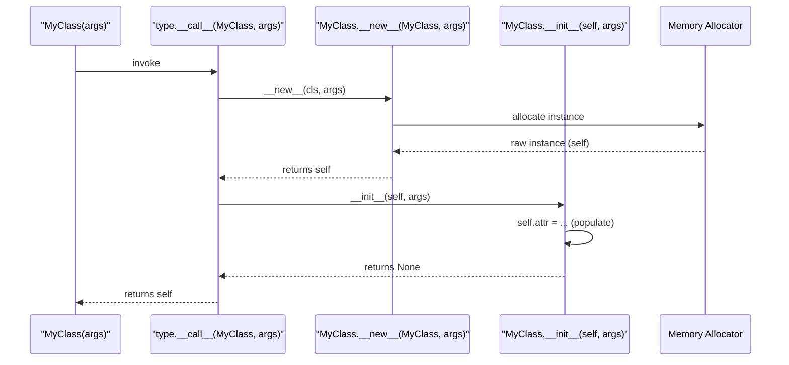
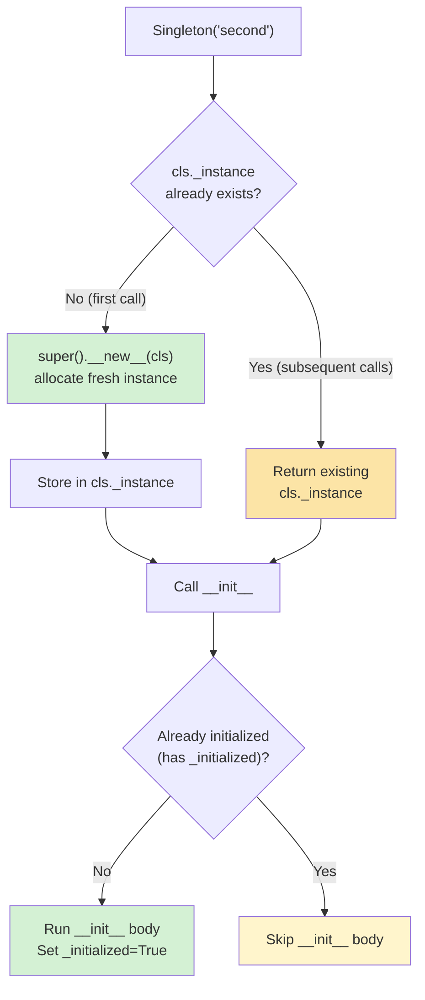
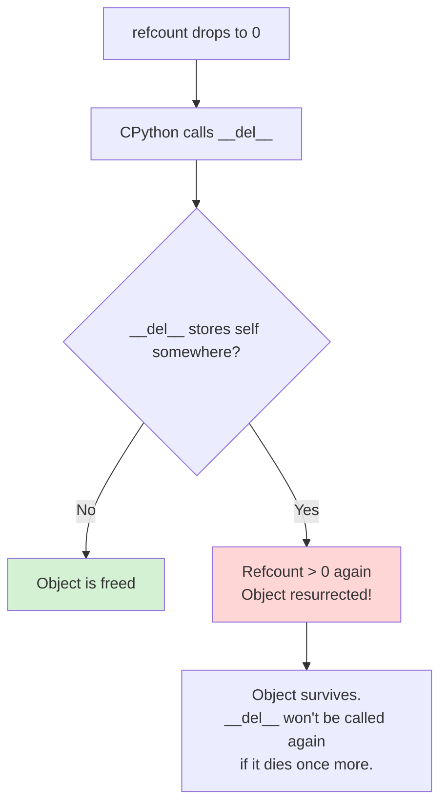
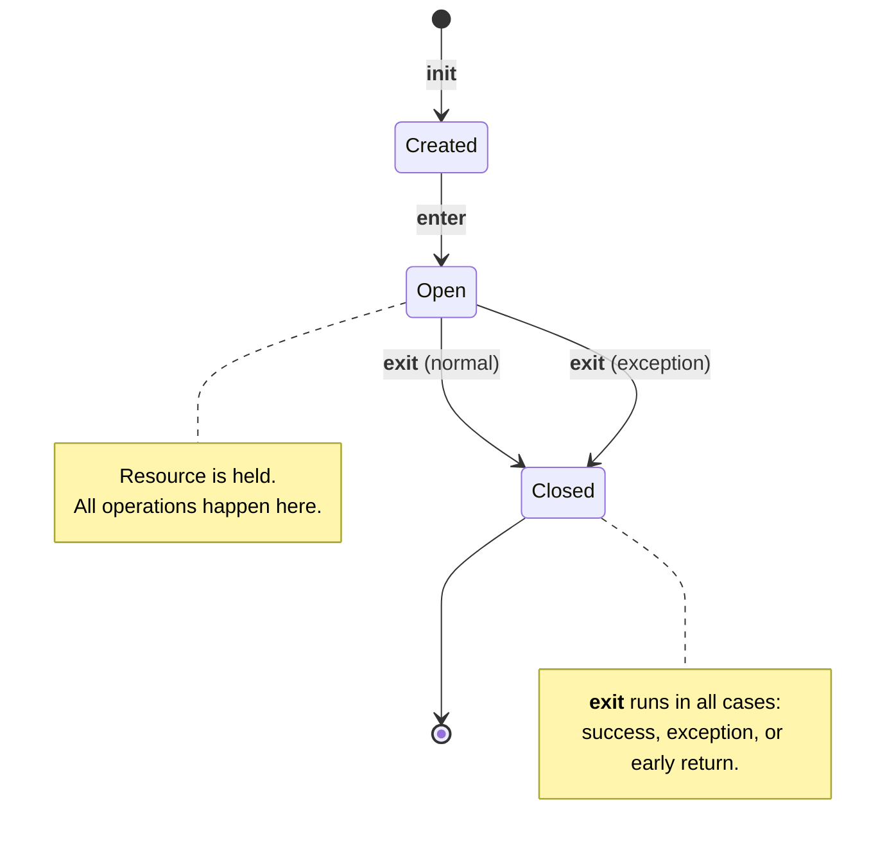
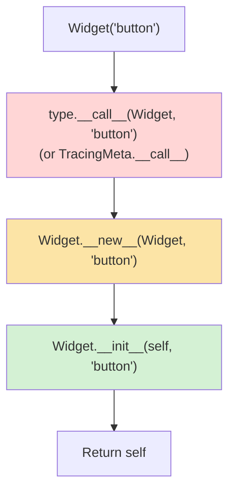

# Constructors and Destructors

#oop #fundamentals #constructors #destructors #teaching

> [!quote] The Zen of Python, applied
> "If the implementation is hard to explain, it's a bad idea." — Python's two-step construction (`__new__` then `__init__`) is awkward to explain, but it's *the* mechanism that makes immutable types, singletons, and metaclass-controlled construction possible.

When you write `Dog("Rex")`, three things happen — and most students think only one does. This note unpacks the full machinery of object construction in Python, the rarely-overridden `__new__`, the often-misunderstood `__init__`, the unreliable `__del__`, and the modern alternatives (context managers, `weakref.finalize`) that you should usually prefer.

Prerequisites: [[Classes-And-Objects]], [[Self-And-Cls]], [[Object-Lifecycle]].

---

## 1. The Two-Step Construction Model

When you call `MyClass(args)`, Python executes:



| Step | Method | What it does | Returns |
|---|---|---|---|
| 1 | `type.__call__` | Orchestrates the call | The new instance |
| 2 | `__new__` | Allocates a new instance | The new instance (or subclass instance) |
| 3 | `__init__` | Initializes instance attributes | `None` (must!) |

### 1.1 The Crucial Distinction

> [!danger] The #1 misconception in all of Python OOP
> **`__init__` does not create the object. `__new__` creates the object; `__init__` initializes it.**

```python
class Example:
    def __new__(cls, *args, **kwargs):
        print(f"1. __new__ called: creating instance of {cls.__name__}")
        instance = super().__new__(cls)   # actually allocate
        return instance

    def __init__(self, x):
        print(f"2. __init__ called: setting x={x}")
        self.x = x

e = Example(42)
# 1. __new__ called: creating instance of Example
# 2. __init__ called: setting x=42
```

If `__new__` returns an instance of `cls` (or a subclass), Python calls `__init__` on it. If `__new__` returns *anything else* (or nothing), `__init__` is **skipped** — a quiet gotcha.

### 1.2 Why Two Steps?

The two-step design supports four cases that one-step construction cannot:

1. **Immutable types** (`int`, `str`, `tuple`) — they must be fully constructed *before* `__init__`, because their state cannot be mutated afterward. So `__new__` builds them, and `__init__` is a no-op.
2. **Singletons and caches** — `__new__` can return an existing instance instead of allocating a new one.
3. **Metaclass-controlled construction** — metaclasses can intercept `__call__` to customize creation of the class itself.
4. **Subclassing built-ins** — to make `class MyInt(int)`, you must override `__new__` because `int.__init__` ignores its arguments.

> [!tip] Teaching Tip
> Write a class with print statements in both `__new__` and `__init__`. Have students call it once, then twice — the print order will *always* be `__new__` then `__init__`. The order is fixed by `type.__call__`, not by you.

---

## 2. `__new__` in Depth

### 2.1 Signature

```python
def __new__(cls, *args, **kwargs):
    instance = super().__new__(cls)   # delegate to parent's __new__
    # ... custom creation logic ...
    return instance
```

`__new__` is a **static method** (logically, though not decorated — Python treats it specially). It receives the class as its first argument (`cls`), not an instance.

### 2.2 When You Must Override `__new__`

You override `__new__` when:

1. **Subclassing immutable types** (`int`, `str`, `tuple`, `frozenset`).
2. **Implementing a Singleton** (return the cached instance).
3. **Implementing a flyweight / interning pattern** (return an existing equal instance).
4. **Refusing construction** (return `None` or an instance of a different type to skip `__init__`).

### 2.3 Worked Example — Immutable `Point`

```python
class Point:
    """An immutable 2D point."""

    def __new__(cls, x, y):
        # Pre-validate before construction (impossible in __init__)
        if not (isinstance(x, (int, float)) and isinstance(y, (int, float))):
            raise TypeError("Coordinates must be numbers")
        instance = super().__new__(cls)
        # We can set attributes here via object.__setattr__ to bypass __setattr__
        object.__setattr__(instance, '_x', float(x))
        object.__setattr__(instance, '_y', float(y))
        return instance

    def __init__(self, x, y):
        # __init__ runs AFTER __new__, but state is already set.
        # For an immutable type, __init__ is essentially a no-op.
        pass

    @property
    def x(self): return self._x
    @property
    def y(self): return self._y

    def __setattr__(self, name, value):
        raise AttributeError("Point is immutable")

    def __repr__(self):
        return f"Point({self._x}, {self._y})"

p = Point(3, 4)
print(p)           # Point(3.0, 4.0)
p.x = 5            # AttributeError: Point is immutable
Point("a", "b")    # TypeError: Coordinates must be numbers
```

The `object.__setattr__` calls in `__new__` bypass the overridden `__setattr__` — that's how immutable types get their initial state in spite of being "immutable."

> [!info] Modern alternative — `@dataclass(frozen=True)`
> Python 3.7+ gives you a much cleaner way to get immutability:
> ```python
> from dataclasses import dataclass
> @dataclass(frozen=True)
> class Point:
>     x: float
>     y: float
> ```
> See [[Dataclasses]]. Override `__new__` only when you need custom validation that can't fit in `__post_init__`.

### 2.4 Worked Example — Singleton

A **singleton** is a class of which only one instance ever exists. The classic pattern in Python:

```python
class Singleton:
    _instance = None

    def __new__(cls, *args, **kwargs):
        if cls._instance is None:
            cls._instance = super().__new__(cls)
        return cls._instance

    def __init__(self, value=None):
        # WARNING: __init__ runs every time, even on the cached instance!
        if not hasattr(self, '_initialized'):
            self.value = value
            self._initialized = True

a = Singleton("first")
b = Singleton("second")
print(a is b)       # True — same object
print(a.value)      # first  — value NOT overwritten
print(b.value)      # first
```



> [!warning] The Singleton `__init__` Trap
> Because `type.__call__` always calls `__init__` after `__new__`, every `Singleton(...)` call reruns `__init__` on the *same* instance. If you don't guard against re-initialization, your "first" call's state gets clobbered by the "second" call. The `_initialized` flag pattern above is the standard workaround.

### 2.5 Refusing Construction

`__new__` can return an instance of a *different* class — in which case `__init__` of the original class is not called. This is how `pathlib.Path` returns `PosixPath` or `WindowsPath` depending on the platform:

```python
import pathlib
p = pathlib.Path("/tmp")
print(type(p).__name__)   # PosixPath  (on Linux/Mac)
                         # WindowsPath (on Windows)
```

`Path.__new__` inspects `os.name` and returns an instance of the appropriate subclass. `Path.__init__` is never called because the returned instance isn't a `Path` — it's a `PosixPath`.

```python
class Greeter:
    def __new__(cls, language="en"):
        if language == "en":
            return EnglishGreeter()
        elif language == "fr":
            return FrenchGreeter()
        else:
            raise ValueError(f"Unknown language: {language}")

class EnglishGreeter:
    def greet(self): return "Hello!"
class FrenchGreeter:
    def greet(self): return "Bonjour!"

print(Greeter("en").greet())   # Hello!
print(Greeter("fr").greet())   # Bonjour!
print(type(Greeter("en")).__name__)   # EnglishGreeter
```

---

## 3. `__init__` in Depth

### 3.1 The Honest Constructor

For 95% of classes, `__init__` is the only constructor you write. It's where you:

- Set instance attributes.
- Validate arguments.
- Open resources (files, sockets, DB connections).
- Call `super().__init__(...)` if you have a parent.

```python
class Connection:
    def __init__(self, host, port, timeout=30):
        if not isinstance(port, int) or port < 0 or port > 65535:
            raise ValueError(f"Invalid port: {port}")
        self.host = host
        self.port = port
        self.timeout = timeout
        self._socket = None     # not yet connected
```

### 3.2 `__init__` Must Return `None`

```python
class Bad:
    def __init__(self):
        return 42   # TypeError: __init__() should return None, not 'int'
```

The instance is *already* created by `__new__`; `__init__` only mutates it. Its return value is discarded — and Python enforces `None` to prevent confusion.

### 3.3 Calling the Parent Constructor

Use `super()`:

```python
class Animal:
    def __init__(self, name):
        self.name = name

class Dog(Animal):
    def __init__(self, name, breed):
        super().__init__(name)    # ← parent constructor
        self.breed = breed
```

Forgetting `super().__init__()` is a common bug — `Animal`'s state never gets set, and `self.name` ends up missing.

> [!warning] Common Student Misconception #1
> "`super().__init__()` is optional boilerplate." It isn't. If the parent relies on `__init__` to set critical state (e.g., a cache, a lock, an event emitter), skipping it leaves the instance in a half-constructed state. Even when the parent is `object`, calling `super().__init__()` is good hygiene for cooperative multiple inheritance.

### 3.4 Constructor Overloading Patterns

Python doesn't have overloading, but you can simulate it with:

**Default arguments:**
```python
class Rectangle:
    def __init__(self, width=None, height=None, square_side=None):
        if square_side is not None:
            self.width = self.height = square_side
        else:
            self.width = width
            self.height = height
```

**Class methods (alternative constructors):**
```python
class Rectangle:
    def __init__(self, width, height):
        self.width, self.height = width, height

    @classmethod
    def square(cls, side):
        return cls(side, side)

    @classmethod
    def from_string(cls, s):
        w, h = map(int, s.split("x"))
        return cls(w, h)

r1 = Rectangle(3, 4)
r2 = Rectangle.square(5)
r3 = Rectangle.from_string("6x8")
```

> [!tip] Prefer classmethods over defaults
> When you have multiple *conceptually distinct* ways to construct (a square vs a rectangle, from a string vs from numbers), classmethods are clearer than overloaded defaults. They give each construction path a name.

### 3.5 Constructor Injection (Dependency Injection)

A constructor's job is also to receive the object's **collaborators** — the other objects it works with. This pattern is called **dependency injection** and is the foundation of testable OOP:

```python
class OrderProcessor:
    def __init__(self, payment_gateway, inventory_service, logger):
        # Inject collaborators through the constructor
        self.payment = payment_gateway
        self.inventory = inventory_service
        self.logger = logger

    def process(self, order):
        self.inventory.reserve(order.items)
        self.payment.charge(order.total)
        self.logger.info(f"Processed order {order.id}")
```

In tests, you pass fakes:

```python
fake_payment = FakePaymentGateway()
fake_inventory = FakeInventoryService()
fake_logger = ListLogger()

processor = OrderProcessor(fake_payment, fake_inventory, fake_logger)
processor.process(test_order)

assert fake_payment.charged_amount == test_order.total
assert fake_logger.entries[-1].startswith("Processed order")
```

> [!info] Why constructor injection matters
> If a class *creates* its own dependencies inside `__init__` (e.g., `self.gateway = StripeGateway()`), the class is **hard-coupled** to that implementation. Tests can't substitute fakes. Constructor injection is the simplest way to make code testable and follows the [[DIP]] — depend on abstractions, not concretions.

---

## 4. `__del__` — The Destructor (and Why It's Unreliable)

### 4.1 What `__del__` Is

`__del__` is called when an object is about to be garbage-collected — i.e., when its reference count drops to zero (in CPython) or when the cyclic GC detects it's unreachable (in cycles).

```python
class Resource:
    def __init__(self, name):
        self.name = name
        print(f"Acquiring {self.name}")

    def __del__(self):
        print(f"Releasing {self.name}")

r1 = Resource("A")   # Acquiring A
r2 = r1
del r1                # nothing printed — r2 still holds a ref
del r2                # Releasing A
```

### 4.2 When `__del__` Does NOT Run

`__del__` is unreliable for the following reasons:

1. **Reference cycles**: if `a.b = b` and `b.a = a`, neither's refcount reaches zero — only the cyclic GC can collect them, and that runs *eventually*.

2. **Interpreter shutdown**: at exit, Python tears down modules; objects still alive may have their `__del__` called when their class's module is gone, causing `NameError` or `AttributeError`.

3. **Exceptions in `__del__`**: any exception inside `__del__` is printed to stderr but otherwise ignored — your program continues, possibly in a corrupt state.

4. **C extensions holding refs**: a C extension can hold a reference indefinitely without you knowing.

5. **`__del__` raises the object back to life**: if `__del__` stores `self` somewhere, refcount goes back above zero and the object survives — a "resurrection" bug.



### 4.3 Worked Example — `__del__` Looks Like It Works… Until It Doesn't

```python
class FileWrapper:
    def __init__(self, path):
        self.path = path
        self.f = open(path, "w")
        print(f"Opened {path}")

    def write(self, data):
        self.f.write(data)

    def __del__(self):
        print(f"Closing {self.path}")
        self.f.close()

# Looks fine in a script:
fw = FileWrapper("/tmp/test.txt")
fw.write("hello")
# At program exit, "Closing /tmp/test.txt" might print... or might not.
```

If you put this in a long-running server and create many `FileWrapper`s without explicitly closing them, you'll hit "Too many open files" — `__del__` runs late or never.

### 4.4 The Right Tool: Context Managers

For deterministic cleanup, use `with` and implement `__enter__` / `__exit__`:

```python
class FileWrapper:
    def __init__(self, path):
        self.path = path
        self.f = open(path, "w")

    def __enter__(self):
        return self

    def __exit__(self, exc_type, exc_val, exc_tb):
        self.f.close()
        # Return False (or None) to propagate exceptions
        return False

    def write(self, data):
        self.f.write(data)

# Deterministic cleanup — happens at the end of the `with` block, not at GC time.
with FileWrapper("/tmp/test.txt") as fw:
    fw.write("hello")
# File closed here, guaranteed, even if write() raised.
```



> [!success] The rule of thumb
> Use `__del__` only as a **safety net** — best-effort cleanup for users who forgot `with`. The *real* cleanup must happen in `__exit__`. This dual approach (defensive `__del__` + authoritative `__exit__`) is what `io.FileIO`, `socket.socket`, and `sqlite3.Connection` all use internally.

### 4.5 Modern Alternative — `weakref.finalize`

If you don't want to (or can't) override `__del__`, use `weakref.finalize` to register a callback that runs when an object is collected:

```python
import weakref

class Resource:
    def __init__(self, name):
        self.name = name
        # Register a callback to run when self is collected
        weakref.finalize(self, _cleanup, name)

def _cleanup(name):
    print(f"Cleaning up {name}")

r = Resource("X")
del r   # Cleaning up X  (eventually)
```

`finalize` survives interpreter shutdown better than `__del__`, doesn't resurrect the object, and lets you register multiple callbacks per object. It's the recommended approach for library authors.

---

## 5. Destructors Across Languages — Comparison

| Language | Destructor mechanism | Deterministic? | Reliable? |
|---|---|---|---|
| **C++** | `~ClassName()` | Yes (RAII, scope exit) | Yes |
| **Rust** | `Drop::drop()` | Yes (RAII) | Yes |
| **Python** | `__del__` | No (GC) | No |
| **Java** | `finalize()` (deprecated in Java 9) | No (GC) | No |
| **C#** | `~ClassName()` (finalizer) + `IDisposable` | Finalizer: no. `Dispose()`: yes | Finalizer: no. `Dispose()`: yes |
| **Go** | `defer` (not a destructor) | Yes (function scope) | Yes |

> [!info] Why Python isn't like C++
> C++ uses **RAII** (Resource Acquisition Is Initialization): every object has a deterministic lifetime bounded by scope. When the scope exits, destructors run in reverse order. This is wonderful for resources but forces stack-like object lifetimes. Python uses garbage collection, which trades determinism for flexibility — but means *you* must manage resource lifetimes explicitly (via `with`).

---

## 6. Misconceptions Recap

> [!warning] Misconception #1 — "`__init__` creates the object."
> It does not. `__new__` creates the object; `__init__` initializes it. The distinction matters for immutable types, singletons, and subclassing built-ins.

> [!warning] Misconception #2 — "Python has destructors like C++."
> It has `__del__`, which is *not* a destructor in the C++ sense. It runs at GC time (not scope exit), may not run at all (cycles, shutdown), and can be resurrected. Use `with` for deterministic cleanup.

> [!warning] Misconception #3 — "Calling `super().__init__()` is optional."
> For cooperative multiple inheritance, it's required. If you skip it, you break the MRO chain and other parents in the hierarchy never get initialized.

> [!warning] Misconception #4 — "`__del__` is called when I write `del obj`."
> `del obj` only removes the *name binding*. `__del__` runs only if that was the last reference. With aliases, `__del__` is deferred.

> [!warning] Misconception #5 — "Singletons are great in Python."
> Singletons make testing harder (you can't substitute fakes), introduce global state, and the `__init__` re-run trap is subtle. Prefer dependency injection or module-level singletons (Python modules are already singletons — see [[Singleton-Pattern]]).

> [!warning] Misconception #6 — "I can do real work in `__del__`."
> Don't. `__del__` runs at unpredictable times, may run during interpreter shutdown when imports are gone, and exceptions inside it are silently swallowed. `__del__` should only do quick, defensive cleanup.

---

## 7. Worked Example — A Proper Resource Class

Combining `__new__` (for interning), `__init__` (for setup), `__enter__`/`__exit__` (for deterministic cleanup), and `__del__` (as a safety net):

```python
import threading

class DatabaseConnection:
    _pool = {}   # intern by DSN

    def __new__(cls, dsn):
        if dsn not in cls._pool:
            cls._pool[dsn] = super().__new__(cls)
        return cls._pool[dsn]

    def __init__(self, dsn):
        # __init__ runs on EVERY call, even for interned instances.
        # Guard against re-init.
        if getattr(self, "_initialized", False):
            return
        self.dsn = dsn
        self._lock = threading.Lock()
        self._connected = False
        self._initialized = True

    def connect(self):
        with self._lock:
            if not self._connected:
                print(f"Connecting to {self.dsn}")
                self._connected = True

    def close(self):
        with self._lock:
            if self._connected:
                print(f"Closing {self.dsn}")
                self._connected = False

    # Context manager protocol
    def __enter__(self):
        self.connect()
        return self

    def __exit__(self, exc_type, exc_val, exc_tb):
        self.close()
        return False

    # Safety-net destructor
    def __del__(self):
        try:
            self.close()
        except Exception:
            pass   # never raise from __del__

# Usage
with DatabaseConnection("postgres://localhost/db") as db:
    print("Using the connection")
# Closing postgres://localhost/db  ← deterministic
```

This pattern is verbose but it's what production-grade resource classes look like. You get:

- **Interning**: `DatabaseConnection("...")` always returns the same instance per DSN.
- **Deterministic cleanup**: `with` block closes the connection.
- **Safety net**: `__del__` closes if you forget `with`.
- **Thread safety**: `_lock` guards `connect` / `close`.

---

## 8. Metaclass-Controlled Construction (Advanced Preview)

There's a level above `__new__` and `__init__`: the **metaclass**'s `__call__` method. When you write `MyClass(args)`, Python actually invokes `type.__call__(MyClass, args)`, and *that* is what calls `__new__` and `__init__`. By defining a custom metaclass, you can intercept the entire construction process.

```python
class TracingMeta(type):
    """A metaclass that prints every class instantiation."""
    def __call__(cls, *args, **kwargs):
        print(f"[meta] constructing {cls.__name__}({args}, {kwargs})")
        instance = super().__call__(*args, **kwargs)
        print(f"[meta] constructed {instance!r}")
        return instance

class Widget(metaclass=TracingMeta):
    def __init__(self, name):
        self.name = name
    def __repr__(self):
        return f"Widget(name={self.name!r})"

w = Widget("button")
# [meta] constructing Widget(('button',), {})
# [meta] constructed Widget(name='button')
```



This is the foundation of:

- **ORM model classes** (Django, SQLAlchemy) — metaclasses register fields and customize `__init__` to populate them.
- **Abstract base classes** — `ABCMeta` overrides `__call__` to raise `TypeError` if the class has unimplemented abstract methods.
- **Singletons at the class level** — a metaclass can ensure only one instance is ever created, without subclass authors needing to override `__new__`.
- **Plugin registries** — a metaclass can register every subclass into a global dict at *class definition* time, not instantiation time.

> [!info] You probably don't need a metaclass
> Most problems solvable with a metaclass are also solvable with `__init_subclass__`, class decorators, or `__new__`. Reach for metaclasses only when you need to intercept the act of *creating the class itself*. See [[Metaclasses]] for the deep dive.

### 8.1 The `__init_subclass__` Alternative

For most "I want to do X whenever a subclass is defined" use cases, `__init_subclass__` is enough — and far simpler than a metaclass:

```python
class Plugin:
    registry = {}
    def __init_subclass__(cls, name=None, **kwargs):
        super().__init_subclass__(**kwargs)
        Plugin.registry[name or cls.__name__] = cls

class EmailPlugin(Plugin, name="email"): pass
class SmsPlugin(Plugin, name="sms"): pass

print(Plugin.registry)
# {'email': <class '...EmailPlugin'>, 'sms': <class '...SmsPlugin'>}
```

`__init_subclass__` runs once per subclass definition — no metaclass required.

---

## 9. Practice Exercises

> [!example] Exercise 1 — Trace the Calls
> Write a class with `__new__` and `__init__` that each print a message. Then create two instances and explain the order of prints. Next, override `__new__` to return an instance of a *different* class — what happens to `__init__`?

> [!example] Exercise 2 — Singleton with Counter
> Implement a `Logger` singleton. Add a `log_count` class variable that increments on each `log()` call. Verify that two `Logger()` instances share state.

> [!example] Exercise 3 — Immutable `Money`
> Implement an immutable `Money(amount, currency)` class by overriding `__new__` and `__setattr__`. Verify that `m.amount = 100` raises `AttributeError`.

> [!example] Exercise 4 — File Resource
> Write a `SafeFile` class that opens a file in `__init__`, supports `with`, and closes in `__exit__`. Add a `__del__` that warns if the file was never explicitly closed.

> [!example] Exercise 5 — Diagnose the Bug
> The following class breaks `with`. Why? Fix it.
> ```python
> class TempFile:
>     def __init__(self, path):
>         self.f = open(path, "w")
>     def __enter__(self):
>         return self.f
>     def __exit__(self, *args):
>         pass
> ```

---

## 10. Summary

- Calling `MyClass(args)` invokes `type.__call__`, which calls `__new__` (creates) then `__init__` (initializes).
- **`__new__`** is overridden for immutable types, singletons, interning, and refusing/redirecting construction. It must return an instance of `cls` (or subclass) for `__init__` to run.
- **`__init__`** is the everyday constructor. It must return `None`. Always call `super().__init__(...)` for cooperative inheritance.
- **Constructor injection** (passing collaborators through `__init__`) is the foundation of testable, decoupled code.
- **`__del__`** is unreliable — it may run late, never, or fail silently. Use it only as a safety net.
- **Context managers** (`__enter__` / `__exit__`) are the right tool for deterministic resource cleanup.
- **`weakref.finalize`** is a modern alternative to `__del__` for library code.
- Python is *not* RAII — object lifetime and resource lifetime are separate concerns; the `with` statement bridges them.

> [!success] Next stops
> - [[Object-Lifecycle]] — the full birth-to-death story, including GC and references.
> - [[Magic-Methods]] — `__enter__`, `__exit__`, and the rest of the dunder zoo.
> - [[Self-And-Cls]] — what `self` actually is during `__init__`.
> - [[Singleton-Pattern]] — the design pattern (and its caveats).
