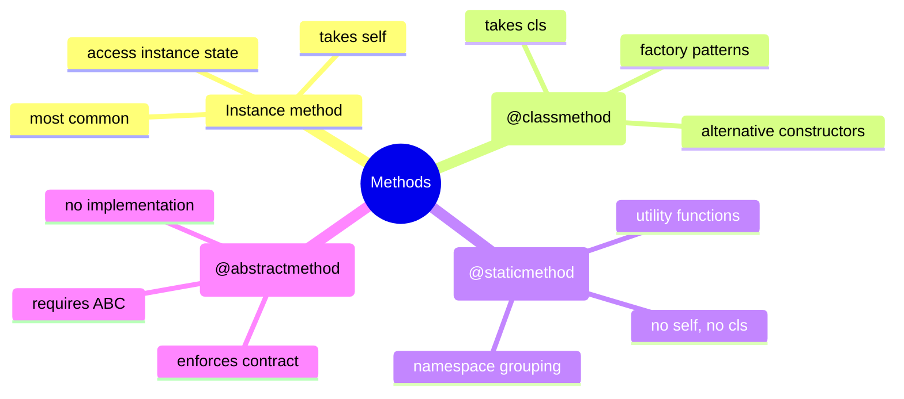
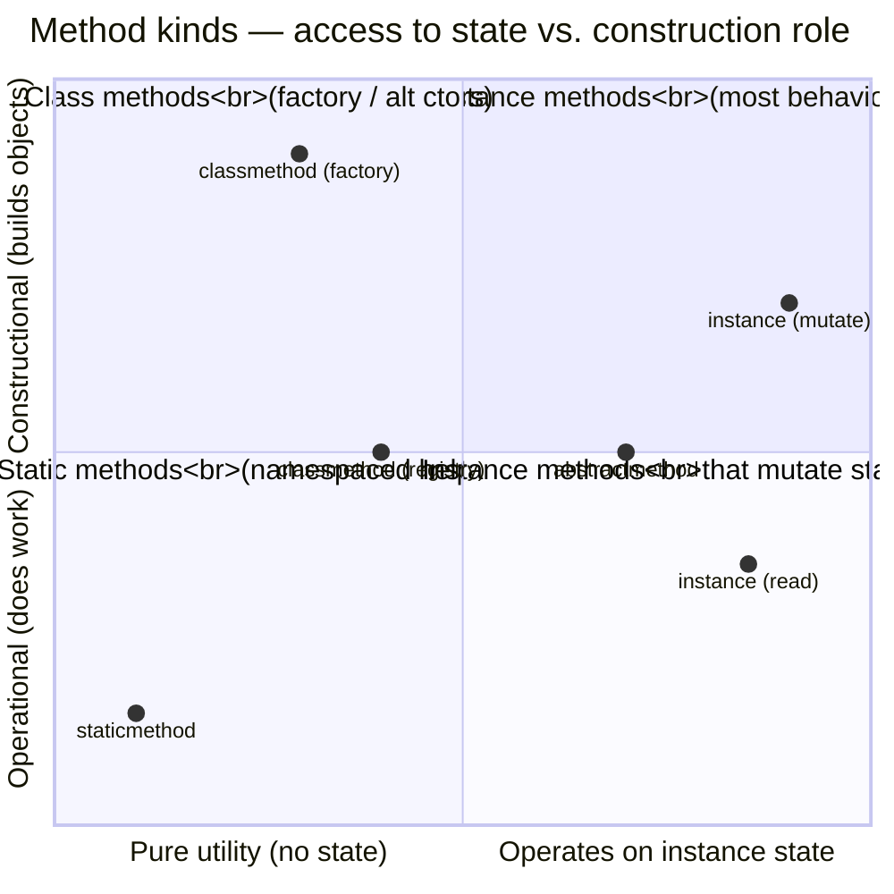
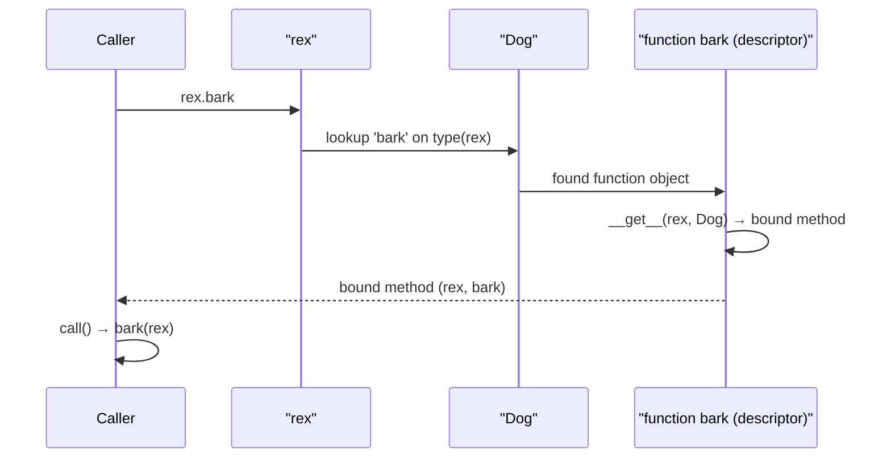
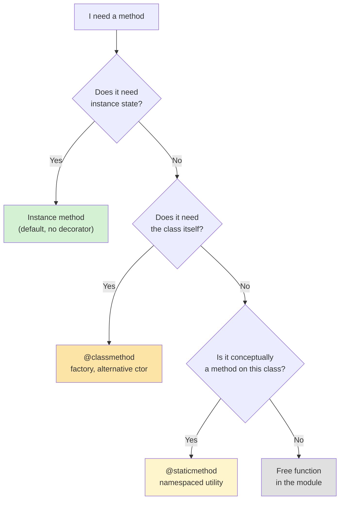
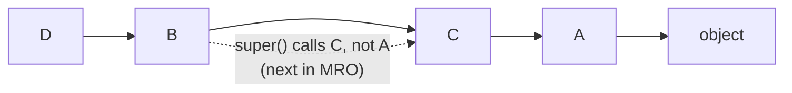
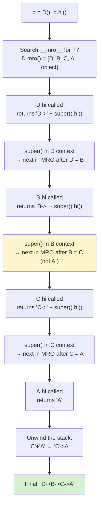
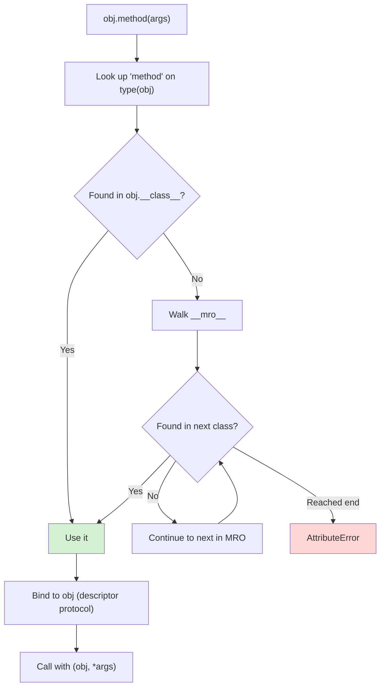
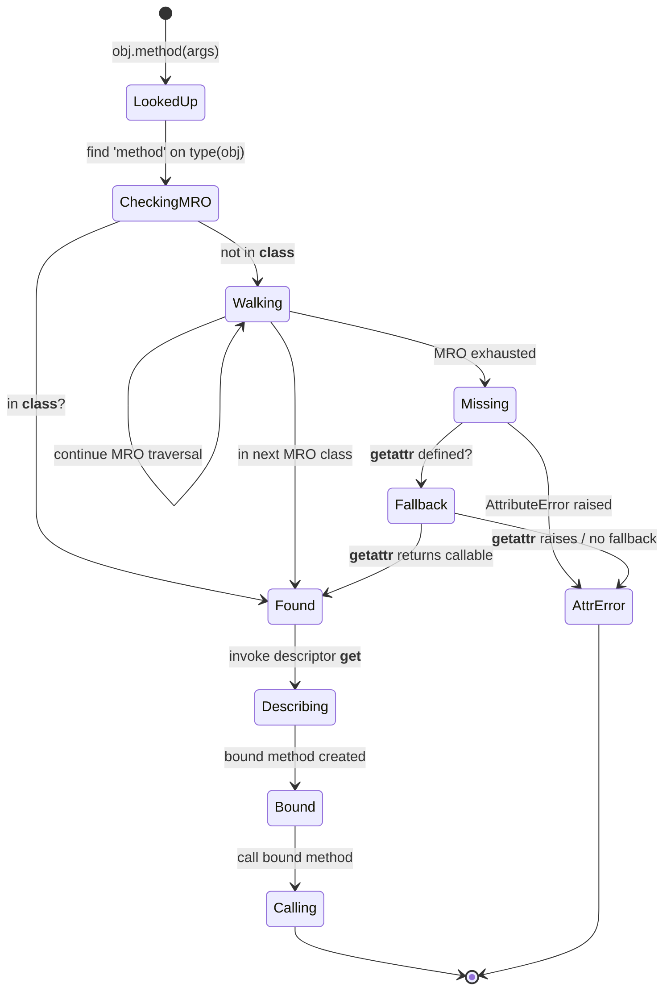
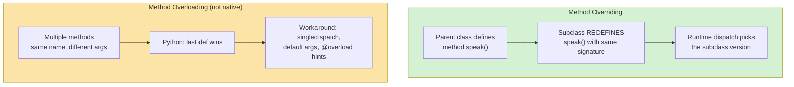
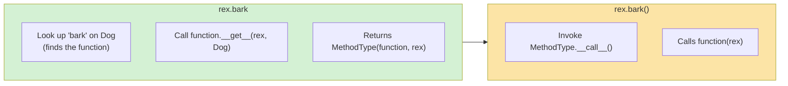

# Methods and Functions

#oop #fundamentals #methods #classmethod #staticmethod #teaching

> [!quote] Alan Kay
> "The big idea is messaging." — but in Python, the messaging takes the form of **method calls**, and there are several flavors of method, each with a distinct purpose.

A method is a function defined inside a class. That's the simple definition. The interesting part is that Python has *four kinds* of method — instance, class, static, and abstract — plus two related concepts (overloading and overriding) that students routinely confuse. This note unpacks each, shows you when to reach for which, and explains the underlying descriptor magic that makes it all work.

Prerequisites: [[Classes-And-Objects]] and [[Self-And-Cls]].

---

## 1. The Four Kinds of Method



| Method kind | First arg | Decorator | Sees instance? | Sees class? | Typical use |
|---|---|---|---|---|---|
| Instance | `self` | (none) | ✅ | ✅ (via `self.__class__`) | Most behavior |
| Class | `cls` | `@classmethod` | ❌ | ✅ | Factory methods, alternative constructors |
| Static | (none) | `@staticmethod` | ❌ | ❌ | Namespaced utilities |
| Abstract | `self` (declared) | `@abstractmethod` | ✅ (when implemented) | ✅ | Defining a contract |



---

## 2. Instance Methods

### 2.1 Definition and Use

An instance method is the default — just a function defined in the class body whose first parameter is conventionally `self`.

```python
class Dog:
    def __init__(self, name):
        self.name = name

    def bark(self):                 # instance method
        return f"{self.name} says Woof!"

rex = Dog("Rex")
print(rex.bark())   # Rex says Woof!    ← calling
print(Dog.bark(rex))  # Rex says Woof!  ← equivalent unbound call
```

### 2.2 Bound vs Unbound

When you access `rex.bark`, Python doesn't return the raw function — it returns a **bound method** that has `rex` already baked in as `self`.

```python
m = rex.bark
print(type(m))      # <class 'method'>
print(m.__self__)   # <__main__.Dog object at 0x...>  ← the bound instance
print(m.__func__)   # <function Dog.bark at 0x...>     ← the raw function
m()                  # Rex says Woof!  ← no argument needed
```



The bound method is created *lazily* each time you access `rex.bark` — but it's cheap (a small wrapper around a function pointer + the instance).

> [!info] Python 2 vs Python 3
> In Python 2, `Dog.bark` (accessed on the class, not an instance) returned an "unbound method" that required you to pass the instance explicitly. In Python 3, `Dog.bark` is just the raw function — there is no "unbound method" type anymore. `Dog.bark(rex)` is equivalent to `rex.bark()`.

### 2.3 Calling Other Methods

Inside an instance method, call other methods via `self`:

```python
class Calculator:
    def __init__(self, value):
        self.value = value
    def double(self):
        return self.value * 2
    def quadruple(self):
        return self.double() * 2     # ← calls self.double
```

Don't write `Calculator.double(self)` — that's the unbound form and reads worse.

---

## 3. Class Methods (`@classmethod`)

### 3.1 What They Are

A class method receives **the class itself** as its first argument (conventionally `cls`), not an instance. Use it when:

- You need an **alternative constructor** (factory method).
- You want behavior that operates on the class as a whole.
- You want inheritance to work correctly (subclasses get *their* class, not the parent).

```python
class Date:
    def __init__(self, year, month, day):
        self.year, self.month, self.day = year, month, day

    @classmethod
    def from_iso(cls, iso_string):
        y, m, d = iso_string.split("-")
        return cls(int(y), int(m), int(d))   # ← cls, not Date

    @classmethod
    def today(cls):
        import datetime
        t = datetime.date.today()
        return cls(t.year, t.month, t.day)
```

```python
d1 = Date(2025, 1, 15)
d2 = Date.from_iso("2025-01-15")
d3 = Date.today()
```

### 3.2 Why `cls` and Not `Date`?

If you hard-code `Date(...)` in a classmethod, subclasses that inherit it get back `Date` instances, not their own type. Using `cls(...)` preserves polymorphism:

```python
class HolidayDate(Date):
    def __init__(self, year, month, day, name):
        super().__init__(year, month, day)
        self.name = name

h = HolidayDate.from_iso("2025-07-04")  # ← would fail! cls is HolidayDate
                                          # but HolidayDate needs `name`
```

For a classmethod to work cleanly in subclasses with different `__init__` signatures, either make the subclass override the classmethod or design `__init__` to accept extra args via `**kwargs`.

### 3.3 Factory Method Pattern

Class methods are the canonical Python implementation of the **Factory Method** pattern:

```python
class Payment:
    @classmethod
    def from_type(cls, kind, amount):
        if kind == "credit":
            return CreditCardPayment(amount)
        elif kind == "paypal":
            return PayPalPayment(amount)
        elif kind == "crypto":
            return CryptoPayment(amount)
        else:
            raise ValueError(f"Unknown payment type: {kind}")

class CreditCardPayment(Payment): ...
class PayPalPayment(Payment): ...
class CryptoPayment(Payment): ...

p = Payment.from_type("paypal", 99.00)
```

> [!tip] Teaching Tip
> Show students how `datetime.date.today()` is a classmethod in the standard library. They've been using classmethods without realizing it. Once they see the pattern in the stdlib, it stops feeling exotic.

---

## 4. Static Methods (`@staticmethod`)

### 4.1 What They Are

A static method takes neither `self` nor `cls`. It's a plain function that happens to live inside a class — usually because it's *conceptually* related to the class.

```python
class MathUtils:
    @staticmethod
    def is_even(n):
        return n % 2 == 0

    @staticmethod
    def celsius_to_fahrenheit(c):
        return c * 9 / 5 + 32

print(MathUtils.is_even(4))   # True
print(MathUtils.celsius_to_fahrenheit(100))   # 212.0
```

### 4.2 When to Use Static Methods

| Use static when... | Use class method when... |
|---|---|
| The function is a utility for the class's domain. | The function constructs or returns instances. |
| You don't need instance or class state. | You need to know the class (for `cls(...)` or class attributes). |
| You want to namespace a function under the class. | Subclassing should change which class is used. |

```python
class Date:
    @staticmethod
    def is_leap_year(year):
        return year % 4 == 0 and (year % 100 != 0 or year % 400 == 0)

    @classmethod
    def from_iso(cls, s):
        y, m, d = s.split("-")
        return cls(int(y), int(m), int(d))
```

`is_leap_year` doesn't need a `Date` instance or the `Date` class — it's a pure function on integers. But it's still "about" dates, so it lives in `Date`.

> [!warning] Common Student Misconception #1
> "Static methods are useless — you could just use a module-level function." Functionally true. The argument for `@staticmethod` is *namespacing*: `MathUtils.is_leap_year(2024)` makes the relationship explicit and avoids polluting the module namespace. The argument against is that Python already has modules for namespacing. Both views are valid; follow your team's convention.

### 4.3 The Naming Argument

```python
# Module-level function
def is_leap_year(year):
    return year % 4 == 0 and (year % 100 != 0 or year % 400 == 0)

# Static method
class Date:
    @staticmethod
    def is_leap_year(year):
        return year % 4 == 0 and (year % 100 != 0 or year % 400 == 0)
```

If `is_leap_year` is only ever called by `Date` methods, the static method version documents that relationship. If it's used everywhere in your module, make it a free function. There's no right answer — only readability.

---

## 5. Decision Tree: Which Method Kind?



> [!tip] Quick rule of thumb
> - 90% of methods are instance methods.
> - `@classmethod` is for alternative constructors and factory patterns.
> - `@staticmethod` is for namespaced helpers that don't need `self` or `cls`.
> - When in doubt, use an instance method.

---

## 6. Method Overloading (Python Doesn't Have It — But You Can Fake It)

### 6.1 What Overloading Would Look Like

In Java/C++, you can write two methods with the same name and different parameter types:

```java
// Java
class Printer {
    void print(int x)        { System.out.println("int: " + x); }
    void print(String x)     { System.out.println("String: " + x); }
    void print(int x, int y) { System.out.println("ints: " + x + "," + y); }
}
```

In Python, **the last definition wins**. You cannot have two `print` methods on the same class.

### 6.2 Workaround 1 — Default Arguments

```python
class Printer:
    def print(self, x=None, y=None):
        if x is not None and y is not None:
            print(f"ints: {x},{y}")
        elif isinstance(x, int):
            print(f"int: {x}")
        elif isinstance(x, str):
            print(f"String: {x}")
```

This works but you're essentially writing your own dispatch. Ugly beyond 2-3 cases.

### 6.3 Workaround 2 — `functools.singledispatch`

`singledispatch` lets you register multiple implementations based on the *type of the first argument*:

```python
from functools import singledispatch

@singledispatch
def print_value(x):
    raise TypeError(f"Cannot print {type(x)}")

@print_value.register(int)
def _(x):
    print(f"int: {x}")

@print_value.register(str)
def _(x):
    print(f"String: {x}")

@print_value.register(list)
def _(x):
    print(f"list of {len(x)} items")

print_value(42)          # int: 42
print_value("hello")     # String: hello
print_value([1, 2, 3])   # list of 3 items
```

For methods specifically, use `singledispatchmethod` (Python 3.8+):

```python
from functools import singledispatchmethod

class Processor:
    @singledispatchmethod
    def process(self, x):
        raise TypeError(f"Cannot process {type(x)}")

    @process.register(int)
    def _(self, x):
        return x * 2

    @process.register(str)
    def _(self, x):
        return x.upper()

    @process.register(list)
    def _(self, x):
        return [self.process(item) for item in x]

p = Processor()
print(p.process(5))            # 10
print(p.process("hi"))         # HI
print(p.process([1, "a", 2]))  # [2, 'A', 4]
```

### 6.4 Workaround 3 — `@overload` Type Hints (Static Only)

```python
from typing import overload

class Processor:
    @overload
    def process(self, x: int) -> int: ...
    @overload
    def process(self, x: str) -> str: ...
    def process(self, x):
        if isinstance(x, int): return x * 2
        if isinstance(x, str): return x.upper()
        raise TypeError
```

The `@overload` decorators are **only for type checkers** (mypy, pyright) — at runtime, the *last* `def` is the real one. This is documentation for static analysis, not behavior.

> [!warning] Common Student Misconception #2
> "`@overload` lets me define multiple implementations." No — at runtime, only the last `def` survives. `@overload` is purely a type-checker hint. The actual dispatch must be written manually inside the final implementation.

---

## 7. Method Overriding (Subclass Replaces Parent Method)

### 7.1 The Basic Idea

```python
class Animal:
    def speak(self):
        return "..."

class Dog(Animal):
    def speak(self):      # override
        return "Woof!"

class Cat(Animal):
    def speak(self):      # override
        return "Meow!"

for a in [Animal(), Dog(), Cat()]:
    print(a.speak())   # ... / Woof! / Meow!
```

This is the heart of [[Polymorphism]] — the same call (`a.speak()`) dispatches to different implementations based on the runtime type of `a`.

### 7.2 Calling the Parent: `super()`

```python
class Animal:
    def __init__(self, name):
        self.name = name
    def speak(self):
        return f"{self.name} makes a sound"

class Dog(Animal):
    def __init__(self, name, breed):
        super().__init__(name)     # ← call parent __init__
        self.breed = breed
    def speak(self):
        parent_msg = super().speak()  # ← call parent speak
        return f"{parent_msg} (and barks)"

d = Dog("Rex", "Labrador")
print(d.speak())   # Rex makes a sound (and barks)
```

### 7.3 `super()` Is Not "The Parent"

A subtle point: `super()` returns the next class in the **MRO** (Method Resolution Order), not strictly the parent. In multiple inheritance, this matters:

```python
class A:
    def hi(self): return "A"
class B(A):
    def hi(self): return "B->" + super().hi()
class C(A):
    def hi(self): return "C->" + super().hi()
class D(B, C):
    def hi(self): return "D->" + super().hi()

print(D.mro())    # [D, B, C, A, object]
print(D().hi())   # D->B->C->A
```



If `B.hi` called `A.hi` directly (instead of `super().hi()`), `C.hi` would be skipped. The `super()` chain ensures all classes in the MRO get a chance to contribute — this is **cooperative multiple inheritance**.



See [[Inheritance]] for the full deep dive on MRO and `super()`.

---

## 8. Abstract Methods (`@abstractmethod`)

### 8.1 Defining a Contract

An abstract method is declared but has no implementation. Subclasses *must* override it. Use the `abc` module:

```python
from abc import ABC, abstractmethod

class Shape(ABC):
    @abstractmethod
    def area(self):
        ...

    @abstractmethod
    def perimeter(self):
        ...

    def describe(self):   # concrete method
        return f"{type(self).__name__}: area={self.area():.2f}"
```

### 8.2 You Can't Instantiate an ABC

```python
s = Shape()   # TypeError: Can't instantiate abstract class Shape
```

```python
class Square(Shape):
    def __init__(self, side):
        self.side = side
    def area(self):
        return self.side ** 2
    def perimeter(self):
        return 4 * self.side

sq = Square(5)
print(sq.describe())   # Square: area=25.00
```

If `Square` forgot to implement `perimeter`, instantiation would fail with the same `TypeError` — the contract is enforced at instantiation time, not at call time.

### 8.3 Class Hierarchy with Abstract Methods

```mermaid
classDiagram
    class Shape {
        <{abstract}>
        +area()* float
        +perimeter()* float
        +describe() str
    }
    class Circle {
        +radius: float
        +area() float
        +perimeter() float
    }
    class Square {
        +side: float
        +area() float
        +perimeter() float
    }
    class Triangle {
        +base: float
        +height: float
        +area() float
        +perimeter() float
    }
    Shape <|-- Circle
    Shape <|-- Square
    Shape <|-- Triangle
```

The asterisk (`*`) after method names in UML denotes abstract methods. Note that `describe()` (no asterisk) is concrete and inherited unchanged.

### 8.4 Abstract Property, Abstract Classmethod

`abc` supports abstract versions of all method kinds:

```python
class Plugin(ABC):
    @property
    @abstractmethod
    def name(self): ...

    @classmethod
    @abstractmethod
    def from_config(cls, cfg): ...
```

Note the **decorator order**: `@abstractmethod` must be the *innermost* decorator (closest to `def`). Otherwise the abstractness check fails.

---

## 9. Method Resolution — How Python Finds Methods



The MRO is computed using the **C3 linearization** algorithm. It guarantees:

1. A subclass appears before its parents.
2. Parents appear in the order listed in `class X(A, B):`.
3. No class appears twice.

You can inspect it with `ClassName.__mro__` or `ClassName.mro()`.



---

## 10. Overriding vs Overloading — Comparison



| Aspect | Overriding | Overloading |
|---|---|---|
| Same name, different class? | Yes — parent & child | No — same class |
| Same signature? | Yes | No (different arg types/counts) |
| Dispatch time | Runtime (dynamic) | Compile time in static langs; manual in Python |
| Python support? | ✅ Native | ❌ Not native — workarounds only |
| Used for | Polymorphism | Convenience / type-specific behavior |

---

## 11. Worked Example — Polymorphic Animal Hierarchy

```python
from abc import ABC, abstractmethod

class Animal(ABC):
    def __init__(self, name):
        self.name = name

    @abstractmethod
    def speak(self) -> str: ...

    @abstractmethod
    def move(self) -> str: ...

    def __str__(self):
        return f"{type(self).__name__}({self.name!r})"

class Dog(Animal):
    def speak(self): return f"{self.name}: Woof!"
    def move(self):  return f"{self.name} runs on four legs"

class Cat(Animal):
    def speak(self): return f"{self.name}: Meow!"
    def move(self):  return f"{self.name} prowls silently"

class Duck(Animal):
    def speak(self): return f"{self.name}: Quack!"
    def move(self):  return f"{self.name} waddles and swims"

class Snake(Animal):
    def speak(self): return f"{self.name}: Hiss!"
    def move(self):  return f"{self.name} slithers"

def chorus(animals):
    for a in animals:
        print(f"{a}: {a.speak()} then {a.move()}")

zoo = [Dog("Rex"), Cat("Whiskers"), Duck("Donald"), Snake("Kaa")]
chorus(zoo)
# Dog('Rex'): Rex: Woof! then Rex runs on four legs
# Cat('Whiskers'): Whiskers: Meow! then Whiskers prowls silently
# Duck('Donald'): Donald: Quack! then Donald waddles and swims
# Snake('Kaa'): Kaa: Hiss! then Kaa slithers
```

The `chorus` function has no idea what concrete classes it's dealing with — it just calls `speak()` and `move()`. Adding a new animal type (say, `Fish`) requires zero changes to `chorus`. This is the **open-closed principle** in action (see [[OCP]]).

---

## 12. Worked Example — `Date` Class with All Method Kinds

```python
from datetime import date as _date

class Date:
    def __init__(self, year, month, day):
        if not Date.is_valid(year, month, day):
            raise ValueError(f"Invalid date: {year}-{month}-{day}")
        self.year, self.month, self.day = year, month, day

    # ---------- INSTANCE METHODS ----------
    def to_iso(self):
        return f"{self.year:04d}-{self.month:02d}-{self.day:02d}"

    def is_weekend(self):
        return _date(self.year, self.month, self.day).weekday() >= 5

    # ---------- CLASS METHODS ----------
    @classmethod
    def from_iso(cls, s):
        y, m, d = s.split("-")
        return cls(int(y), int(m), int(d))

    @classmethod
    def today(cls):
        t = _date.today()
        return cls(t.year, t.month, t.day)

    @classmethod
    def from_timestamp(cls, ts):
        t = _date.fromtimestamp(ts)
        return cls(t.year, t.month, t.day)

    # ---------- STATIC METHODS ----------
    @staticmethod
    def is_leap_year(year):
        return year % 4 == 0 and (year % 100 != 0 or year % 400 == 0)

    @staticmethod
    def is_valid(year, month, day):
        if not (1 <= month <= 12): return False
        if day < 1: return False
        days_in_month = [31, 29 if Date.is_leap_year(year) else 28,
                         31, 30, 31, 30, 31, 31, 30, 31, 30, 31]
        return day <= days_in_month[month - 1]

    # ---------- DUNDER ----------
    def __str__(self):
        return self.to_iso()
    def __repr__(self):
        return f"Date({self.year}, {self.month}, {self.day})"
```

```python
d1 = Date(2025, 1, 15)
d2 = Date.from_iso("2025-02-29")    # ValueError — 2025 not a leap year
d3 = Date.today()
print(Date.is_leap_year(2024))      # True (static)
print(d1.is_weekend())              # depends on weekday
```

Notice the responsibilities:

- **Instance methods** operate on one date.
- **Class methods** are all *alternative constructors* — every one returns a new `Date`.
- **Static methods** are pure functions on date components.

This is the canonical layout you'll see in well-designed Python classes.

---

## 13. Dunder Methods — A Quick Taste

Dunder (magic) methods are instance methods with reserved names that Python calls in response to syntax or built-ins. They get a fuller treatment in [[Magic-Methods]], but here's a sampler:

| Dunder | Triggered by | Typical purpose |
|---|---|---|
| `__init__` | `MyClass(...)` | Initialize instance |
| `__str__` | `str(obj)`, `print(obj)` | Human-readable string |
| `__repr__` | `repr(obj)`, REPL | Developer-readable string |
| `__len__` | `len(obj)` | Length protocol |
| `__eq__`, `__lt__`, ... | `==`, `<`, ... | Comparison |
| `__getitem__`, `__setitem__` | `obj[k]`, `obj[k] = v` | Indexing |
| `__iter__` | `for x in obj` | Iteration protocol |
| `__enter__`, `__exit__` | `with obj as x:` | Context manager |
| `__call__` | `obj(args)` | Make instance callable |

```python
class Money:
    def __init__(self, amount, currency="USD"):
        self.amount = amount
        self.currency = currency
    def __repr__(self):
        return f"Money({self.amount}, {self.currency!r})"
    def __str__(self):
        return f"{self.amount:.2f} {self.currency}"
    def __add__(self, other):
        if self.currency != other.currency:
            raise ValueError("Currency mismatch")
        return Money(self.amount + other.amount, self.currency)
    def __eq__(self, other):
        return (self.amount, self.currency) == (other.amount, other.currency)

print(Money(10) + Money(20))   # 30.00 USD
print(Money(10) == Money(10))  # True
```

---

## 14. Misconceptions Recap

> [!warning] Misconception #1 — "Static methods are useless."
> They're for **namespacing**. `MathUtils.is_even(4)` is clearer than a free function `is_even(4)` floating in a module. They're also useful when the function is conceptually tied to a class but doesn't need `self` or `cls` (e.g., `Date.is_leap_year`).

> [!warning] Misconception #2 — "`@classmethod` is just for `__init__`."
> It's for *any* method that needs the class — factory methods, registry lookups, polymorphic construction, configuration getters that subclasses can override, anything where `cls` matters more than `self`.

> [!warning] Misconception #3 — "Python has method overloading."
> It doesn't. Last `def` wins. Use `singledispatch`/`singledispatchmethod` for runtime dispatch, or `@overload` for static type hints only.

> [!warning] Misconception #4 — "`super()` calls the parent class."
> It calls the *next class in the MRO*, which in multiple inheritance may be a sibling, not a parent. `super()` is the foundation of cooperative multiple inheritance.

> [!warning] Misconception #5 — "Abstract methods can't have bodies."
> They can — the body is callable via `super()`. This is useful for providing a default that subclasses can extend: `super().method()` runs the abstract method's body. The instantiation check still requires the subclass to override.

> [!warning] Misconception #6 — "Instance methods are slow because of the bound-method wrapper."
> Bound-method creation is cheap (one C-level allocation). For hot loops, you can hoist `obj.method` out of the loop: `m = obj.method; for x in items: m(x)`. But for almost all code, the overhead is unmeasurable.

---

## 15. Bound Methods Under the Hood

The "magic" of `obj.method` not requiring you to pass `obj` again is implemented through Python's **descriptor protocol**. Functions are descriptors — they implement `__get__`. When you access a function through an instance, Python calls the function's `__get__` to produce a bound method.

```python
class Dog:
    def bark(self):
        return "Woof!"

rex = Dog("Rex")

# Two ways to see what's happening:
print(type(Dog.bark))    # <class 'function'>         ← raw function
print(type(rex.bark))    # <class 'method'>            ← bound method

# A bound method is basically this:
import types
manual_bound = types.MethodType(Dog.bark, rex)
print(manual_bound())    # Woof!
print(manual_bound.__func__ is Dog.bark)   # True
print(manual_bound.__self__ is rex)        # True
```



### 15.1 Bound Method vs `functools.partial`

A bound method is conceptually similar to `functools.partial(function, self)` — both pre-bind the first argument. The differences:

| Aspect | Bound method | `functools.partial` |
|---|---|---|
| Created by | attribute access on instance | explicit `partial(fn, *args)` |
| Identity | `rex.bark is rex.bark` → **False** (new each time) | `partial(f, x) is partial(f, x)` → **False** |
| Equality | `rex.bark == rex.bark` → **True** | `partial(f, x) == partial(f, x)` → **False** |
| `__self__` attribute | Yes | No |
| Use case | Method dispatch | Pre-binding arguments |

The "bound methods compare equal but are not identical" point trips up students:

```python
print(rex.bark is rex.bark)   # False — new bound method each access
print(rex.bark == rex.bark)   # True  — same __func__ and __self__
```

If you store a bound method as a callback (e.g., a button click handler), be aware that *each access creates a new object*. If you need stable identity, hoist it once: `cb = rex.bark; button.on_click(cb)`.

### 15.2 Methods on the Class vs Methods on the Instance

Methods are stored on the **class**, not the instance. This is what makes them efficient — one function object per class, regardless of how many instances exist.

```python
rex = Dog("Rex")
lassie = Dog("Lassie")
print(Dog.bark is rex.bark.__func__)    # True
print(rex.bark.__func__ is lassie.bark.__func__)   # True  ← same function!
```

The only per-instance thing is the bound-method *wrapper*, which is tiny (a couple of pointers).

> [!tip] Teaching Tip
> Show students `Dog.__dict__['bark']` and ask "where is this stored — on Dog or on rex?" The answer (Dog) illustrates the entire reason methods exist on classes, not instances. It also foreshadows why `__slots__` doesn't include methods — they were never on the instance to begin with.

---

## 16. Practice Exercises

> [!example] Exercise 1 — Vector Class
> Implement a `Vector` class with `__init__(x, y, z)`, instance methods `magnitude()` and `dot(other)`, a classmethod `from_tuple(t)`, a staticmethod `zero()`, and dunder methods `__add__`, `__eq__`, `__repr__`.

> [!example] Exercise 2 — Logging Subclass
> Subclass `dict` and override `__setitem__` to log every assignment to a list. Verify that `super().__setitem__(key, value)` is necessary — what breaks if you call `dict.__setitem__(self, key, value)` instead?

> [!example] Exercise 3 — Polymorphic Shapes
> Define an abstract `Shape` with `area()` and `perimeter()`. Implement `Circle`, `Rectangle`, and `Triangle`. Write a `total_area(shapes)` function that sums areas polymorphically.

> [!example] Exercise 4 — `singledispatchmethod`
> Write a `Serializer` class with a `to_json` method that dispatches on the type of its argument using `singledispatchmethod`. Register handlers for `int`, `str`, `list`, and `dict`.

> [!example] Exercise 5 — Diagnose the Bug
> The following code raises `TypeError`. Why? Fix it without changing the subclass.
> ```python
> from abc import ABC, abstractmethod
> class Base(ABC):
>     @abstractmethod
>     def go(self): ...
> class Sub(Base):
>     def go(self):
>         return super().go()
> Sub().go()
> ```

---

## 17. Summary

- **Instance methods** (default) take `self` and operate on instance state — 90% of methods.
- **Class methods** (`@classmethod`) take `cls` and are best for alternative constructors and factory patterns.
- **Static methods** (`@staticmethod`) take neither — namespaced utilities.
- **Abstract methods** (`@abstractmethod` on an `ABC`) declare a contract that subclasses must fulfill.
- **Overloading** (multiple methods, same name) is *not native* — use `singledispatch` or default args.
- **Overriding** (subclass replaces parent method) is native and is the foundation of polymorphism.
- `super()` calls the *next class in the MRO*, not strictly the parent — critical for cooperative multiple inheritance.
- **Dunder methods** are how Python wires your class into syntax (`+`, `len`, `print`, `for`, `with`, ...).

> [!success] Next stops
> - [[Self-And-Cls]] — what `self` and `cls` really are.
> - [[Constructors-And-Destructors]] — `__new__`, `__init__`, `__del__`.
> - [[Polymorphism]] — overriding taken to its logical conclusion.
> - [[Inheritance]] — the MRO and `super()` in depth.
> - [[Magic-Methods]] — every dunder, exhaustively.
> - [[Abstraction]] — why abstract methods exist.
