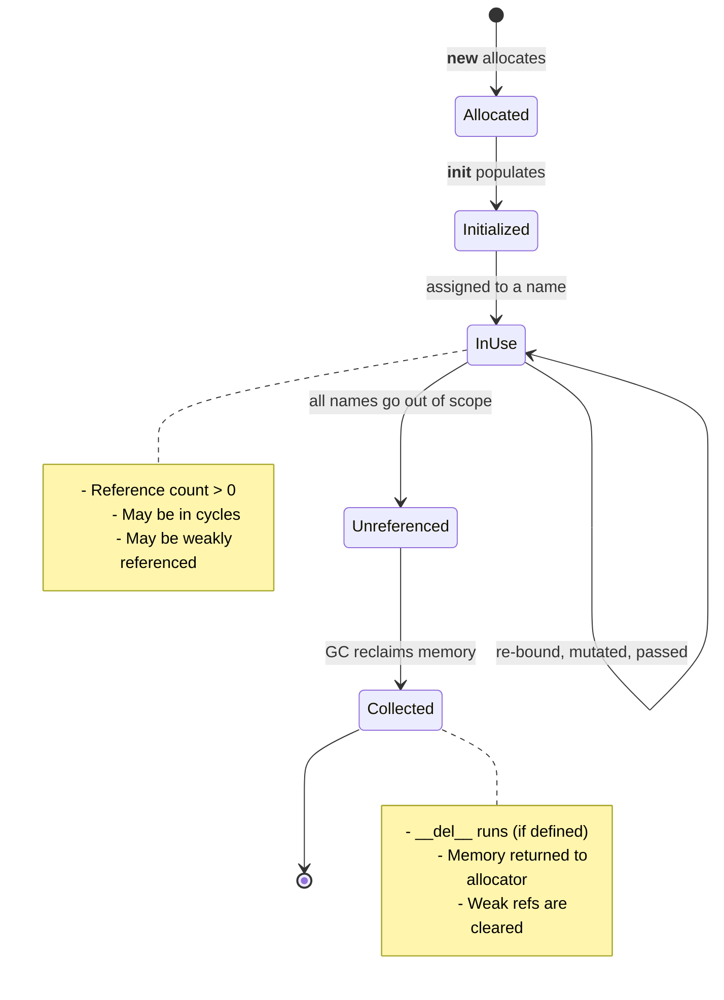
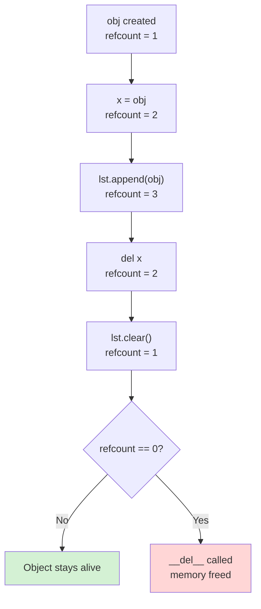
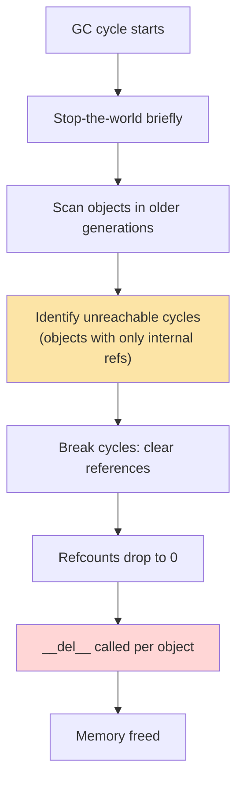
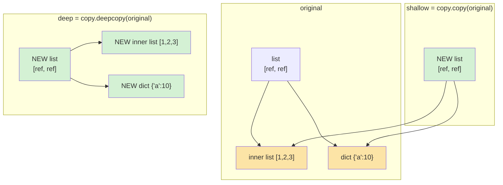

# Object Lifecycle

#oop #fundamentals #lifecycle #garbage-collection #teaching

> [!quote] Tim Peters — The Zen of Python
> "If the implementation is hard to explain, it may be a bad idea. If the implementation is easy to explain, it may be a good idea." — Python's memory model is mostly easy to explain: refcounting plus a cyclic GC. But the consequences (cycles, `__del__` flakiness, copy semantics) are subtle enough to fill a whole note.

Every Python object has a life: it is **born** (allocated), **initialized** (populated), **used** (called, mutated, passed around), and **destroyed** (reclaimed by the garbage collector). This note walks through every stage, the mechanisms underneath each, and the practical consequences for writing correct, leak-free code.

Prerequisites: [[Classes-And-Objects]] and [[Constructors-And-Destructors]].

---

## 1. The Lifecycle at a Glance



The five stages:

1. **Allocated** — `__new__` requests memory from CPython's allocator.
2. **Initialized** — `__init__` populates `__dict__` (or slots).
3. **In use** — at least one name or container references the object.
4. **Unreferenced** — all references gone; refcount drops to 0 (or only cycles remain).
5. **Collected** — `__del__` (if any) runs, memory is freed.

Between stages 3 and 4, the object can be **mutated**, **copied**, **passed to functions**, **stored in containers**, and **weakly referenced**. Each of those has its own subtleties — unpacked below.

---

## 2. Reference Counting — The Primary GC

### 2.1 How It Works

CPython (the standard Python implementation) uses **reference counting** as its primary garbage-collection mechanism. Every object has a `ob_refcnt` field — an integer counting how many references point to it.

```python
import sys

s = "hello"
print(sys.getrefcount(s))   # 2  (s + the temporary argument to getrefcount)

t = s
print(sys.getrefcount(s))   # 3

del t
print(sys.getrefcount(s))   # 2
```

When `ob_refcnt` reaches 0, the object is **immediately** deallocated (and `__del__` runs, if defined). This is *deterministic*: you can predict when an object dies, as long as no cycles are involved.

### 2.2 What Increments and Decrements Refcount?

| Action | Effect on refcount |
|---|---|
| `x = obj` (assignment) | +1 |
| `lst.append(obj)` (added to container) | +1 |
| `func(obj)` (argument passing) | +1 during the call |
| `return obj` from a function | +1 (caller receives it) |
| `del x` (remove name) | -1 |
| `lst.pop()` (removed from container) | -1 |
| Function returns | -1 for each local |
| Re-binding a name | -1 for old value, +1 for new |



> [!info] Why refcounting is great
> It's *deterministic* (you can predict when objects die) and *immediate* (memory is reclaimed as soon as it's not needed). This is why Python doesn't have the "GC pauses" that Java has, and why `__del__` is even a thing.

### 2.3 The Problem With Reference Counting: Cycles

If `a` references `b` and `b` references `a`, both refcounts stay above 0 — even if no one else references them. They'll never be collected by refcounting alone.

```python
class Node:
    def __init__(self, name):
        self.name = name
        self.peer = None
    def __del__(self):
        print(f"  ~ {self.name} dying")

a = Node("A")
b = Node("B")
a.peer = b     # A → B
b.peer = a     # B → A   ← cycle!
del a
del b
# Nothing printed! a and b are unreachable but still alive.
```

This is where the **cyclic garbage collector** comes in.

---

## 3. The Cyclic Garbage Collector

### 3.1 How It Works

CPython's `gc` module runs a separate collector that periodically scans for groups of objects that reference each other but are unreachable from any root (module globals, stack frames, etc.). When it finds such a group, it breaks the cycle and frees the objects.



### 3.2 Three Generations

Python's cyclic GC uses a **generational** scheme with three generations:

- **Generation 0**: newly created objects. Scanned frequently.
- **Generation 1**: objects that survived one Gen-0 scan. Scanned less often.
- **Generation 2**: long-lived objects. Scanned rarely.

When a generation's allocation threshold is exceeded, that generation (and all younger ones) are scanned. Surviving objects are promoted to the next generation.

```python
import gc
print(gc.get_threshold())   # (700, 10, 10)
# Gen 0 scanned after 700 net allocations
# Gen 1 scanned after 10 Gen-0 scans
# Gen 2 scanned after 10 Gen-1 scans
```

### 3.3 Manual Control

```python
import gc

gc.collect()              # force full collection — returns # of collected objects
gc.disable()              # turn off cyclic GC (refcounting still works)
gc.enable()
gc.get_referrers(obj)     # list objects that reference obj
gc.get_referents(obj)     # list objects that obj references
```

> [!warning] Common Student Misconception #1
> "`del x` deletes the object." It does not. It removes the *name* `x` from the namespace, decrementing the object's refcount. If other names or containers still reference the object, it lives on. The object is freed only when refcount reaches 0 (or when the cyclic GC picks it up).

### 3.4 Tracking Object Lifetimes

```python
import gc

class Tracked:
    instances = []
    def __init__(self, name):
        self.name = name
        Tracked.instances.append(self)
        print(f"+ created {self.name}")

    def __del__(self):
        print(f"- destroyed {self.name}")

a = Tracked("a")    # + created a
b = Tracked("b")    # + created b
del a               # (nothing yet — Tracked.instances still holds it)
collected = gc.collect()   # might collect a, b if cycle is the only ref
print(f"collected: {collected}")
```

This pattern (stashing instances in a class-level list) is a common source of memory leaks — the class keeps them alive forever. The fix is to use a `WeakSet` or `weakref.WeakValueDictionary`.

---

## 4. Weak References — When You Need Them

A **weak reference** lets you refer to an object *without* incrementing its refcount. When the object is collected, the weak ref is automatically cleared. Use weak refs when:

- You want a cache that doesn't prevent objects from being collected.
- You want to track instances of a class without keeping them alive.
- You want observer/listener patterns where the listener might disappear.

```python
import weakref

class ExpensiveImage:
    def __init__(self, path):
        self.path = path
        print(f"loading {path}")

img = ExpensiveImage("/tmp/big.png")   # loading /tmp/big.png
ref = weakref.ref(img)

print(ref())         # <ExpensiveImage object at 0x...>
print(ref() is img)  # True

del img              # frees img immediately
print(ref())         # None  ← weak ref auto-cleared
```

### 4.1 Variations

- `weakref.ref(obj)` — bare weak reference; call it to get the object (or `None`).
- `weakref.proxy(obj)` — transparent proxy; accessing attributes goes to the object, raises `ReferenceError` if dead.
- `weakref.WeakValueDictionary` — dict that holds weak refs to values; entries vanish when values are collected.
- `weakref.WeakSet` — set of weak refs.
- `weakref.finalize(obj, callback, *args)` — register a callback to run when `obj` is collected.

```python
import weakref

_cache = weakref.WeakValueDictionary()

def get_image(path):
    if path in _cache:
        return _cache[path]
    img = ExpensiveImage(path)
    _cache[path] = img
    return img

# Image stays in cache only while some other code holds a reference.
# When the last external ref goes, the cache entry is cleared.
```

> [!tip] When weak refs are *not* the answer
> If you need an object to stay alive until you explicitly release it, a weak reference won't help — that's the opposite of what it does. Weak refs are for "I want to find this object *if* it's still around, but I don't want to keep it around."

---

## 5. Identity vs Equality — `is` vs `==`

### 5.1 The Distinction

- **`is`** tests *identity* — are `a` and `b` the same object (same `id()`)?
- **`==`** tests *equality* — do `a` and `b` have the same value (per `__eq__`)?

```python
a = [1, 2, 3]
b = [1, 2, 3]
print(a == b)   # True  — same contents
print(a is b)   # False — different objects
print(id(a), id(b))   # different ids
```

### 5.2 When `is` Is Right

Use `is` for:

- **`None`**: `if x is None:` (always — never `== None`).
- **`True` / `False`**: `if flag is True:` (rare; usually `if flag:`).
- **Sentinels**: `if x is _UNSET:` (custom marker objects).
- **Singletons**: `if obj is SomeClass._instance:`.

### 5.3 When `==` Is Right

Use `==` for:

- **Values**: numbers, strings, lists, dicts, custom objects.
- **Comparisons across types**: `1 == 1.0 == True` is `True`.

```python
print(1 == 1.0)    # True  — different types, equal value
print(1 is 1.0)    # False — different objects
```

### 5.4 Implementing `__eq__` and `__hash__`

If you override `__eq__`, Python sets `__hash__` to `None` (making instances unhashable) unless you also define `__hash__`. The two **must be consistent**: equal objects must have equal hashes.

```python
class Point:
    def __init__(self, x, y):
        self.x = x
        self.y = y

    def __eq__(self, other):
        if not isinstance(other, Point):
            return NotImplemented
        return self.x == other.x and self.y == other.y

    def __hash__(self):
        return hash((self.x, self.y))

p1 = Point(1, 2)
p2 = Point(1, 2)
print(p1 == p2)            # True
print(p1 is p2)            # False
print(hash(p1) == hash(p2))  # True

s = {p1, p2}               # set uses __hash__ + __eq__
print(len(s))              # 1 — equal objects dedupe
```

> [!danger] Common Student Misconception #2
> "I defined `__eq__` so my objects compare equal." Maybe — but if you didn't also define `__hash__`, they're no longer usable in sets or as dict keys. The rule: **equal objects must have equal hashes**. The reverse isn't required (different objects can share a hash).

### 5.5 Mutable vs Immutable

```python
class MutablePoint:
    def __init__(self, x, y):
        self.x, self.y = x, y
    def __eq__(self, other):
        return isinstance(other, MutablePoint) and (self.x, self.y) == (other.x, other.y)
    # No __hash__ — Python makes instances unhashable

p = MutablePoint(1, 2)
d = {p: "value"}    # TypeError: unhashable type: 'MutablePoint'
```

Mutable objects typically should not be hashable, because their hash would change when their state changes — breaking the invariant that equal objects have equal hashes. The default (override `__eq__` → unhashable) is correct for most mutable classes.

| Type | Mutable? | Hashable? | Can be set/dict key? |
|---|---|---|---|
| `int`, `str`, `tuple` (of immutables) | No | Yes | Yes |
| `list`, `dict`, `set` | Yes | No | No |
| `frozenset` | No | Yes | Yes |
| Custom class (default `__eq__` / `__hash__`) | Yes | Yes (by id) | Yes |
| Custom class (override `__eq__` only) | Yes | No | No |

---

## 6. Copying Objects

### 6.1 Shallow vs Deep Copy

```python
import copy

original = [[1, 2, 3], {"a": 10}]
shallow  = copy.copy(original)       # new outer container, same inner objects
deep     = copy.deepcopy(original)   # new outer AND new inner objects

# Modify the inner list
original[0].append(99)
print(shallow[0])   # [1, 2, 3, 99]  ← shared!
print(deep[0])      # [1, 2, 3]       ← independent
```



### 6.2 When to Use Each

| Situation | Use |
|---|---|
| You want a new container but shared elements | `copy.copy` |
| You want full independence from the original | `copy.deepcopy` |
| You want a new instance with same state, same collaborators | `copy.copy` |
| You want a snapshot that won't change if original does | `copy.deepcopy` |
| You just want to mutate without affecting the caller | depends — often a fresh list is enough |

### 6.3 `__copy__` and `__deepcopy__` Hooks

If your class needs custom copy semantics, implement these hooks:

```python
import copy

class Connection:
    def __init__(self, host, port):
        self.host = host
        self.port = port
        self._socket = open_socket(host, port)

    def __copy__(self):
        # Shallow copy: new Connection, but new socket (don't share!)
        new = Connection(self.host, self.port)
        return new

    def __deepcopy__(self, memo):
        # Deep copy: same — but recursively deepcopy any nested state
        new = Connection(self.host, self.port)
        new._extra_state = copy.deepcopy(self._extra_state, memo)
        return new
```

The `memo` dict in `__deepcopy__` tracks already-copied objects to handle cycles and shared references correctly. Always pass it through.

> [!warning] Common Student Misconception #3
> "Copying a list with `list(original)` is a deep copy." It's a *shallow* copy — the new list contains the *same* element objects. Use `copy.deepcopy` if you need full independence.

### 6.4 Python Has No Cloning

There is no built-in `.clone()` method. The convention is `copy.copy(obj)` for shallow and `copy.deepcopy(obj)` for deep. If you want a custom clone, define a method (often `clone()`) that calls `copy.copy(self)` or builds a fresh instance explicitly.

---

## 7. Interning and Object Pooling

### 7.1 Small Integer Caching

CPython caches integers in the range `[-5, 256]`. Every `5` in your program is the *same* object — not a new allocation.

```python
a = 5
b = 5
print(a is b)   # True — same cached object

a = 1000
b = 1000
print(a is b)   # Usually False — outside the cached range
```

(This second comparison can vary by implementation; some interpreters cache more aggressively, but the language spec only guarantees `[-5, 256]`.)

### 7.2 String Interning

Short, identifier-like strings are also interned — only one copy exists in memory.

```python
a = "hello"
b = "hello"
print(a is b)   # True — interned

a = "hello world!  this is a long string"
b = "hello world!  this is a long string"
print(a is b)   # Usually False — not interned (too long, has spaces)
```

You can force interning with `sys.intern()`:

```python
import sys
a = sys.intern("a moderately long string")
b = sys.intern("a moderately long string")
print(a is b)   # True
```

Interning is useful when you compare the same string *many* times — `is` is faster than `==`. The standard library uses this for attribute names, dict keys, and module names.

### 7.3 Object Pooling in Custom Classes

You can implement pooling yourself — return an existing instance instead of creating a new one. The `__new__` override is the standard pattern:

```python
class InternedPoint:
    _pool = {}

    def __new__(cls, x, y):
        key = (x, y)
        if key not in cls._pool:
            cls._pool[key] = super().__new__(cls)
            cls._pool[key]._x = x
            cls._pool[key]._y = y
        return cls._pool[key]

    @property
    def x(self): return self._x
    @property
    def y(self): return self._y

a = InternedPoint(1, 2)
b = InternedPoint(1, 2)
print(a is b)   # True — same instance from the pool
```

> [!warning] Pools cause memory leaks
> Every entry in `_pool` keeps the object alive forever. If you intern 10M points, you've leaked 10M points. Combine pooling with weak refs (`WeakValueDictionary`) if you want cache semantics without leaks.

---

## 8. Tracing the Full Lifecycle — Worked Example

```python
import gc
import weakref

class TracedObject:
    """An object that prints every stage of its lifecycle."""

    def __init__(self, name):
        self.name = name
        print(f"[init]    {self.name} created at {hex(id(self))}")

    def __repr__(self):
        return f"TracedObject({self.name!r})"

    def __del__(self):
        print(f"[del]     {self.name} destroyed at {hex(id(self))}")

def trace_lifecycle():
    print("--- creating ---")
    obj = TracedObject("A")
    print(f"refcount after creation: {sys_getrefcount(obj)}")

    print("--- adding a weakref ---")
    weak = weakref.ref(obj)
    print(f"weak() is obj: {weak() is obj}")

    print("--- putting in a list ---")
    container = [obj]
    print(f"refcount after list append: {sys_getrefcount(obj)}")

    print("--- creating a cycle ---")
    obj.peer = TracedObject("B")
    obj.peer.peer = obj   # cycle: A ↔ B

    print("--- deleting local refs ---")
    del obj
    del container
    print(f"weak() now: {weak()}")   # still alive (cycle holds it)

    print("--- forcing GC ---")
    collected = gc.collect()
    print(f"gc collected: {collected} objects")
    print(f"weak() now: {weak()}")   # None — collected

def sys_getrefcount(obj):
    import sys
    return sys.getrefcount(obj) - 1   # subtract the temporary arg

trace_lifecycle()
```

Sample output:

```
--- creating ---
[init]    A created at 0x7fa1c01e8a90
refcount after creation: 1
--- adding a weakref ---
weak() is obj: True
--- putting in a list ---
refcount after list append: 2
--- creating a cycle ---
[init]    B created at 0x7fa1c01e8af0
--- deleting local refs ---
[del]     A destroyed at 0x7fa1c01e8a90  ← might happen here if A wasn't in cycle
weak() now: <TracedObject ...>          ← still alive (cycle)
--- forcing GC ---
[del]     B destroyed at 0x7fa1c01e8af0
[del]     A destroyed at 0x7fa1c01e8a90
gc collected: 2 objects
weak() now: None
```

> [!tip] Teaching Tip
> Run this script live in front of students. The sequence of `__del__` calls (especially the second one for A) shows that cycles don't get collected predictably. Once they see it, the case for `with` over `__del__` becomes obvious.

---

## 9. Misconceptions Recap

> [!warning] Misconception #1 — "`del x` deletes the object."
> It removes a name binding and decrements refcount. The object lives if other refs exist.

> [!warning] Misconception #2 — "Python has no memory leaks."
> Reference cycles in long-lived programs can leak. The cyclic GC catches most, but if your cycle includes an object with `__del__` (pre-Python 3.4) or holds external resources, leaks are real.

> [!warning] Misconception #3 — "`is` is the same as `==` for primitive types."
> Only because of interning / small-int caching. `5 is 5` is `True` by implementation, not by spec. Always use `==` for value comparisons — `is` is for identity only.

> [!warning] Misconception #4 — "`copy.copy` makes a deep copy."
> It makes a *shallow* copy — the outer object is new, but inner objects are shared. Use `copy.deepcopy` for full independence.

> [!warning] Misconception #5 — "Defining `__eq__` is enough."
> It's not — you must also define `__hash__` if you want instances usable as dict keys or set elements. Equal objects must have equal hashes.

> [!warning] Misconception #6 — "Garbage collection runs continuously."
> The cyclic GC runs in batches when allocation thresholds are exceeded. Refcounting is continuous; the cyclic GC is periodic. You can force it with `gc.collect()`.

---

## 10. Practice Exercises

> [!example] Exercise 1 — Predict the Output
> Without running, predict whether each `is` check is `True` or `False`:
> ```python
> a = 256; b = 256; print(a is b)
> a = 257; b = 257; print(a is b)
> a = "hi"; b = "hi"; print(a is b)
> a = "hi!"; b = "hi!"; print(a is b)
> ```

> [!example] Exercise 2 — Cycle Detection
> Build three classes (`A`, `B`, `C`) that form a reference cycle (A→B→C→A). Add `__del__` with a print. Create them, delete the locals, verify they're not collected. Then call `gc.collect()` and verify they are.

> [!example] Exercise 3 — Hashable Point
> Implement a `Point` class with `__eq__` and `__hash__`. Verify that two equal `Point(1, 2)` instances dedupe in a set. Then make a `MutablePoint` that defines only `__eq__` (no `__hash__`) — confirm it raises `TypeError` when used as a dict key.

> [!example] Exercise 4 — Weak Cache
> Write a function `get_user(user_id)` that caches `User` instances in a `WeakValueDictionary`. Verify that the cache entry is cleared when the only external reference is dropped.

> [!example] Exercise 5 — Copy Semantics
> Given a list of dicts (e.g., `[{"name": "a"}, {"name": "b"}]`), produce (a) a shallow copy that shares the dicts, (b) a deep copy that's fully independent. Modify an inner dict and show which copies are affected.

---

## 11. Summary

- An object's lifecycle is: **allocate → initialize → use → unreferenced → collect**.
- CPython uses **reference counting** as its primary GC — deterministic but unable to handle cycles.
- A **cyclic GC** (`gc` module) handles cycles, in three generations.
- **`del x`** removes a name binding, not the object.
- **Weak references** (`weakref`) refer to objects without keeping them alive — essential for caches, listeners, and instance tracking.
- **`is` tests identity; `==` tests equality.** Use `is` for `None` and singletons; `==` for values.
- Overriding `__eq__` requires overriding `__hash__` to maintain the equal-objects-equal-hashes invariant.
- **Mutable objects** typically should not be hashable.
- **`copy.copy`** is shallow (shared inner objects); **`copy.deepcopy`** is fully independent.
- **Interning** (small ints, identifier strings) is an implementation optimization — never rely on it for correctness.

> [!success] Next stops
> - [[Constructors-And-Destructors]] — birth and death, in detail.
> - [[Magic-Methods]] — `__eq__`, `__hash__`, `__copy__`, `__deepcopy__`, and more.
> - [[Self-And-Cls]] — what `self` actually is during the "use" phase.
> - [[Encapsulation]] — controlling what callers can see and mutate.
