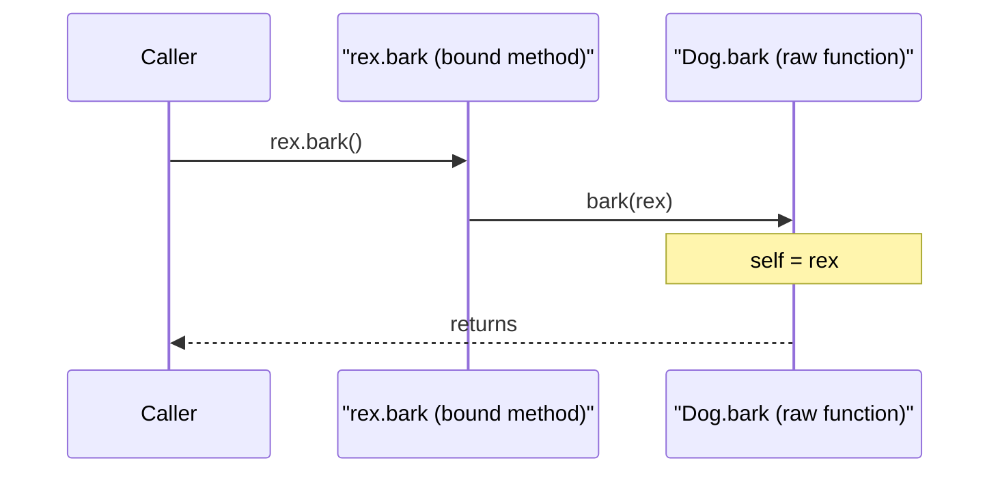
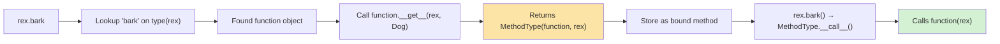
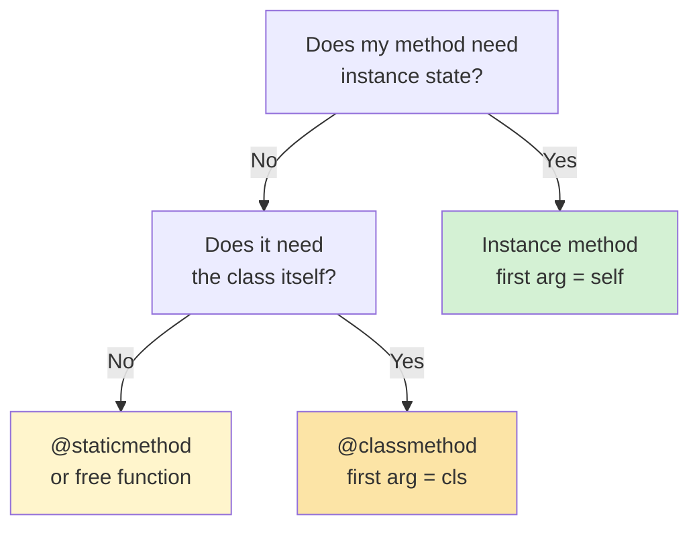
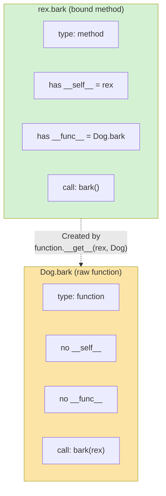

# Self and Cls

#oop #fundamentals #self #cls #teaching

> [!quote] The Zen of Python
> "Explicit is better than implicit." — This is the entire justification for Python requiring you to write `self` in every method signature. Java and C++ hide `this` from you; Python refuses to.

If you ask a Java developer why Python methods need to write `self` everywhere, you'll get a frown. If you ask a Python developer, you'll get a sentence about the Zen of Python. This note explains *why* Python makes `self` explicit, *what* `self` actually is (and isn't), how `cls` differs, and how method binding works under the hood.

Prerequisites: [[Classes-And-Objects]] and [[Methods-And-Functions]].

---

## 1. The Two-Second Version

```python
class Dog:
    def __init__(self, name):   # `self` is the instance being constructed
        self.name = name        # set attribute on that instance
    def bark(self):             # `self` is the instance calling bark
        return f"{self.name} says Woof!"
    @classmethod
    def from_csv(cls, line):    # `cls` is the class itself (Dog, or subclass)
        name = line.split(",")[0]
        return cls(name)
    @staticmethod
    def species():              # neither self nor cls — just a function
        return "Canis familiaris"
```

| Symbol | What it is | Required? | When you see it |
|---|---|---|---|
| `self` | The instance | Convention only (any name works) | First arg of instance methods |
| `cls` | The class | Convention only (any name works) | First arg of classmethods |
| (neither) | Nothing special | — | Static methods |

`self` is **not a keyword**. It is **not magic**. It's just the name Python programmers agreed to use for the first parameter of an instance method — the parameter that receives the instance.

---

## 2. What Is `self`, Really?

### 2.1 `self` Is a Parameter

When Python translates `rex.bark()` into a function call, it does **not** call `Dog.bark()` with no arguments. It calls `Dog.bark(rex)` — passing `rex` as the first argument, which gets bound to the parameter named `self`.

```python
class Dog:
    def bark(self):
        print(f"self is {self!r}")

rex = Dog()
rex.bark()        # self is <Dog object at 0x7f...>
Dog.bark(rex)     # exactly the same — explicit pass
```



### 2.2 You Can Rename It (But Don't)

Because `self` is just a parameter name, you can rename it — and the code will work:

```python
class Dog:
    def bark(this):
        return f"{this} barks"
    def __init__(me, name):
        me.name = name

rex = Dog("Rex")
print(rex.bark())   # <Dog ...> barks
```

> [!danger] Don't actually do this
> Every Python tool — linters, IDEs, documentation generators, code reviewers — assumes the first parameter of an instance method is named `self`. Renaming it works at runtime but breaks the entire ecosystem's expectations. The convention is enforced socially, not syntactically.

### 2.3 `self` Is the Instance, Not the Class

```python
class Dog:
    def bark(self):
        print(f"type(self) is {type(self).__name__}")
        print(f"self.__class__ is {self.__class__.__name__}")

rex = Dog()
rex.bark()
# type(self) is Dog
# self.__class__ is Dog
```

`self` always refers to the **instance** (the specific object that called the method). To get the class, use `type(self)` or `self.__class__`.

---

## 3. Why Python Makes `self` Explicit

### 3.1 The Design Reasons

Python's choice to require explicit `self` is not arbitrary. It supports:

1. **No special syntax for adding methods after class definition.**
   You can take a regular function and assign it to a class:
   ```python
   def fetch(self):
       return f"{self.name} fetches"
   Dog.fetch = fetch
   rex.fetch()   # works — `fetch` is now a method
   ```
   In Java/C++, methods are syntactically distinct from functions; you can't bolt a function onto a class after the fact. In Python, *any* function can become a method by being defined in or attached to a class — because the only thing that makes it a "method" is that it takes `self` as its first parameter.

2. **Explicit scoping.**
   In Java, `name = "Rex"` inside a method might refer to a local, a field, or a static field — and the compiler decides. In Python, you always write `self.name = "Rex"` to set an instance attribute. There's no ambiguity.

3. **Decorators and metaprogramming work cleanly.**
   `@classmethod` and `@staticmethod` are just decorators that change what the first argument is. They work because the function's signature is part of its public interface — and Python can introspect it.

4. **Consistency with the rest of Python.**
   Python doesn't have implicit variables. Every name must come from somewhere — a parameter, an enclosing scope, a global, a built-in. Treating `self` as a parameter fits this philosophy.

### 3.2 The Trade-Offs

The downside is verbosity — every method signature has `self`, every attribute access has `self.`. Java/C++ programmers find this tedious at first. The Pythonic answer: "Yes, but you can see exactly what's happening. There are no hidden variables."

> [!info] A famous April Fools' PEP
> PEP 3099 (rejected) jokingly proposed removing explicit `self`. The rejection rationale lists 14 reasons it can't work — most boil down to "the rest of Python's design assumes explicit parameters." Reading PEP 3099 is a great way to internalize *why* `self` exists.

---

## 4. `cls` — The Class as the First Argument

### 4.1 What `cls` Receives

Classmethods receive the **class** (not an instance) as their first argument:

```python
class Dog:
    species = "Canis familiaris"

    @classmethod
    def show_species(cls):
        print(f"cls is {cls}")
        print(f"cls.species is {cls.species}")

Dog.show_species()
# cls is <class '__main__.Dog'>
# cls.species is Canis familiaris
```

### 4.2 `cls` in Inheritance

When a subclass calls an inherited classmethod, `cls` is the *subclass* — not the class where the method was defined:

```python
class Animal:
    @classmethod
    def create(cls):
        print(f"cls is {cls.__name__}")
        return cls()

class Dog(Animal): pass
class Cat(Animal): pass

Animal.create()   # cls is Animal
Dog.create()      # cls is Dog
Cat.create()      # cls is Cat
```

This is why classmethods are the standard way to write **alternative constructors** — `cls(...)` always instantiates the right subclass.

### 4.3 `cls` vs `self.__class__`

Inside an instance method, you can get the class via `self.__class__` or `type(self)`:

```python
class Animal:
    def report(self):
        # These three are equivalent for normal cases:
        return self.__class__.__name__

    @classmethod
    def report_class(cls):
        return cls.__name__
```

| Approach | Works in instance methods? | Works in classmethods? | Polymorphic? |
|---|---|---|---|
| `self.__class__` | Yes | No (no `self`) | Yes |
| `type(self)` | Yes | No | Yes |
| `cls` | No | Yes | Yes |

Use `cls` in classmethods; use `self.__class__` or `type(self)` in instance methods. Don't hard-code `Dog` — it breaks inheritance.

---

## 5. Method Binding — How `self` Gets There

### 5.1 The Descriptor Protocol

When you write `rex.bark`, Python doesn't just return the function `Dog.bark` — it returns a **bound method** object that has `rex` pre-filled as the first argument. This works because functions are **descriptors**: they implement `__get__`, and that method produces the bound method.

```python
class Dog:
    def bark(self):
        return "Woof!"

rex = Dog()

print(type(Dog.bark))    # <class 'function'>
print(type(rex.bark))    # <class 'method'>

# The bound method stores the function and the instance:
m = rex.bark
print(m.__func__)        # <function Dog.bark at 0x...>
print(m.__self__)        # <Dog object at 0x...>
m()                      # Woof!  — no argument needed
```



### 5.2 Bound vs Unbound (Python 3)

In Python 3, there is no "unbound method" type. `Dog.bark` is just the raw function:

```python
print(Dog.bark)            # <function Dog.bark at 0x...>
Dog.bark(rex)              # Woof!  — you pass the instance manually
```

In Python 2, `Dog.bark` was an "unbound method" that required you to pass an instance of `Dog`. This restriction was lifted in Python 3 — `Dog.bark` is now a plain function that takes any first argument. (You can still shoot yourself in the foot: `Dog.bark("not a dog")` runs and crashes when it tries to access `.name`.)

### 5.3 Manually Creating a Bound Method

You can construct a bound method yourself with `types.MethodType`:

```python
import types

class Dog:
    def bark(self):
        return f"{self} barks"

rex = Dog()
manual = types.MethodType(Dog.bark, rex)
print(manual())    # <Dog object at 0x...> barks
print(manual.__func__ is Dog.bark)   # True
print(manual.__self__ is rex)        # True
```

This is essentially what `rex.bark` does behind the scenes. The `MethodType` wrapper is small (a couple of pointers) — cheap to create, cheap to call.

### 5.4 Bound Method Equality

Each attribute access creates a *new* bound method object. They compare equal but are not identical:

```python
print(rex.bark is rex.bark)   # False — new object each access
print(rex.bark == rex.bark)   # True  — same underlying function + instance
```

> [!tip] Stable callbacks
> If you store a method as a callback (event handler, button click, etc.) and need stable identity, hoist it once:
> ```python
> handler = rex.bark
> button.on_click = handler
> button.off_click = handler    # same object — can be removed
> ```

---

## 6. The First-Argument Gotcha

### 6.1 Forgetting `self`

```python
class Dog:
    def bark():        # ← missing self!
        return "Woof!"

rex = Dog()
rex.bark()   # TypeError: bark() takes 0 positional arguments but 1 was given
```

Python passes `rex` as the first argument. If your method signature has no first parameter, you get a `TypeError`.

### 6.2 Forgetting `self` When Accessing Attributes

```python
class Dog:
    def __init__(self, name):
        self.name = name
    def greet():
        return f"Hello, I'm {name}"   # ← should be self.name

Dog("Rex").greet()   # NameError: name 'name' is not defined
```

Without `self.`, Python looks for `name` in the local scope, then the enclosing function scope, then the module scope — *not* the instance. There is no implicit attribute access in Python.

> [!warning] Common Student Misconception #1
> "Python's `self` is like `this` in Java — it's a keyword that refers to the current object." **Half right.** `self` does refer to the current object — but it's a *parameter*, not a keyword. You could rename it. You can't rename `this` in Java.

### 6.3 Forgetting `cls` in Classmethods

```python
class Dog:
    @classmethod
    def create():     # ← missing cls!
        return Dog()

Dog.create()    # TypeError: create() takes 0 positional arguments but 1 was given
```

Same issue — `Dog` is passed as the first arg.

---

## 7. Why `self` Is Explicit — A Code Demonstration

The best way to *feel* why Python's design is right is to write code that exploits it.

### 7.1 Attaching Methods After Class Definition

```python
class Dog:
    def __init__(self, name):
        self.name = name

# Define a function outside the class
def fetch(self, item):
    return f"{self.name} fetches the {item}!"

# Now attach it to the class
Dog.fetch = fetch

rex = Dog("Rex")
print(rex.fetch("ball"))   # Rex fetches the ball!
```

This works precisely because Python doesn't care where a function is defined — only that its first parameter is `self`. In Java, this would require subclassing or reflection; in Python, it's a single assignment.

### 7.2 Decorators That Add Methods

```python
def logged(method):
    def wrapper(self, *args, **kwargs):
        print(f"calling {method.__name__}")
        return method(self, *args, **kwargs)
    return wrapper

class Service:
    @logged
    def do_work(self):
        return "done"

Service().do_work()
# calling do_work
# 'done'
```

The decorator wraps the method but preserves the `self` parameter. This pattern (and its `functools.wraps`-decorated variants) is how Python's `@property`, `@abstractmethod`, and many library decorators work.

### 7.3 A Class That Doesn't Use `self` (Anti-Pattern)

```python
class Calculator:
    def add(a, b):       # no self — this is really a static method
        return a + b
    def multiply(a, b):  # same
        return a * b

# Calling on instance:
calc = Calculator()
calc.add(2, 3)        # TypeError — calc is passed as `a`
Calculator.add(2, 3)  # 5  — works as if it were a static method
```

If your "methods" don't use `self`, you almost certainly want either:
- `@staticmethod` (if they're conceptually tied to the class).
- A free function in the module (if they're not).

A class with no `self` anywhere is a sign that you're using a class as a namespace — which Python already has via modules.



---

## 8. `self` During Construction

### 8.1 `self` Inside `__init__`

```python
class Dog:
    def __init__(self, name):
        # `self` is the instance that __new__ just created.
        # It exists, but has no attributes yet (unless __new__ set some).
        print(f"in __init__, self.__dict__ = {self.__dict__}")
        self.name = name
        print(f"after assignment, self.__dict__ = {self.__dict__}")

rex = Dog("Rex")
# in __init__, self.__dict__ = {}
# after assignment, self.__dict__ = {'name': 'Rex'}
```

The instance is *alive* (allocated, has an `id()`) but *empty* — no attributes have been set. `__init__` is where you populate it.

### 8.2 `self` Inside `__new__`

```python
class Tracer:
    def __new__(cls, *args, **kwargs):
        print(f"in __new__, cls is {cls}")
        instance = super().__new__(cls)
        print(f"in __new__, instance is {instance}, id={hex(id(instance))}")
        return instance

    def __init__(self):
        print(f"in __init__, self is {self}, id={hex(id(self))}")

t = Tracer()
# in __new__, cls is <class 'Tracer'>
# in __new__, instance is <Tracer object at 0x...>, id=0x...
# in __init__, self is <Tracer object at 0x...>, id=0x...   ← same object
```

Notice that `__new__` receives `cls` (the class), not `self` (the instance) — because the instance doesn't exist yet. `__new__` *creates* the instance and returns it; then `__init__` receives that same instance as `self`.

### 8.3 Returning a Different Object From `__new__`

```python
class Sometimes:
    def __new__(cls, create=True):
        if create:
            return super().__new__(cls)
        else:
            return None   # ← __init__ will NOT be called

Sometimes(create=True)    # __new__ returns instance → __init__ runs
Sometimes(create=False)   # __new__ returns None → __init__ skipped
```

If `__new__` returns an instance of `cls` (or a subclass), `__init__` runs. If it returns anything else (including `None`), `__init__` is skipped. This is the foundation of patterns like `pathlib.Path` returning `PosixPath` or `WindowsPath` depending on platform.

See [[Constructors-And-Destructors]] for the full deep-dive on `__new__` vs `__init__`.

---

## 9. Bound vs Unbound — Comparison



| Aspect | Bound method (`rex.bark`) | Unbound function (`Dog.bark`) |
|---|---|---|
| Type | `method` | `function` |
| Has `__self__`? | Yes (the instance) | No |
| Has `__func__`? | Yes (the raw function) | N/A — it *is* the function |
| Calling syntax | `rex.bark()` | `Dog.bark(rex)` |
| Identity | New each access | Stable (same object) |
| Created by | Attribute access on instance | Attribute access on class |

> [!info] Python 2 vs Python 3 (again)
> In Python 2, `Dog.bark` was an "unbound method" of type `instancemethod` — it required you to pass an instance of `Dog`. In Python 3, this type was removed; `Dog.bark` is just a plain `function`. This makes Python 3 simpler but slightly less safe: `Dog.bark("not a dog")` won't fail until the method actually accesses an attribute.

---

## 10. Misconceptions Recap

> [!warning] Misconception #1 — "`self` is a keyword."
> It's a parameter name. You can rename it (but shouldn't). It's not even reserved — you can have a global variable named `self` (please don't).

> [!warning] Misconception #2 — "Python is the only language with explicit `self`."
> Ruby uses `self` too (though it's implicit when calling methods). Lua requires you to write `obj:method()` or `obj.method(obj)`. JavaScript's `this` is implicit but famously quirky. Python's design is one of several — it just happens to be the most *honest* about what's happening.

> [!warning] Misconception #3 — "`self` is special."
> It's not. The only thing special is the descriptor protocol that turns `rex.bark` into a bound method. The name `self` is convention enforced by linters, IDEs, and the community — not by the language.

> [!warning] Misconception #4 — "Instance methods run on the class, not the instance."
> Methods are defined on the class but *invoked* on the instance. The `self` parameter is the instance — the class is just where the function happens to live.

> [!warning] Misconception #5 — "`cls` and `self.__class__` are interchangeable."
> Functionally yes; idiomatically no. Use `cls` in classmethods, `self.__class__` (or `type(self)`) in instance methods. Don't reach across — it's a code smell.

> [!warning] Misconception #6 — "Static methods don't have `self` because they're called on the class."
> Static methods don't have `self` because they were *decorated* with `@staticmethod`, which strips the descriptor-binding behavior. Calling `obj.static_method()` still works — it just doesn't pass `obj` as the first argument.

---

## 11. Worked Example — Demonstrating `self` Is Just an Argument

```python
class Counter:
    """A class that prints every step to show self is just a parameter."""

    def __init__(self, start=0):
        self.count = start
        print(f"  __init__: self.id={hex(id(self))}, self.count={self.count}")

    def increment(self):
        # The signature is `def increment(self)`.
        # When called as `c.increment()`, Python calls Counter.increment(c).
        self.count += 1
        print(f"  increment: self.id={hex(id(self))}, self.count={self.count}")
        return self.count

    @classmethod
    def from_string(cls, s):
        # `cls` is Counter (or a subclass).
        print(f"  from_string: cls={cls.__name__}")
        return cls(int(s))

    @staticmethod
    def help():
        # No self, no cls. Just a function.
        print("  help: Counter is a simple counter class.")
        return "Counter documentation"

print("--- Creating c1 ---")
c1 = Counter(10)
print("--- Calling c1.increment() ---")
c1.increment()
print("--- Calling Counter.increment(c1) directly ---")
Counter.increment(c1)
print("--- Creating c2 via classmethod ---")
c2 = Counter.from_string("100")
print("--- Calling static method ---")
Counter.help()
print("--- Calling static method on instance (also works) ---")
c1.help()
```

Output:
```
--- Creating c1 ---
  __init__: self.id=0x7f..., self.count=10
--- Calling c1.increment() ---
  increment: self.id=0x7f..., self.count=11
--- Calling Counter.increment(c1) directly ---
  increment: self.id=0x7f..., self.count=12
--- Creating c2 via classmethod ---
  from_string: cls=Counter
  __init__: self.id=0x7f..., self.count=100
--- Calling static method ---
  help: Counter is a simple counter class.
--- Calling static method on instance (also works) ---
  help: Counter is a simple counter class.
```

Notice that `c1.increment()` and `Counter.increment(c1)` produce identical output — the first is just sugar for the second. `self` is the parameter that received `c1`.

---

## 12. Practice Exercises

> [!example] Exercise 1 — Self Is Just a Parameter
> Define `Dog.bark(self)` and call it three ways: `rex.bark()`, `Dog.bark(rex)`, and via `types.MethodType(Dog.bark, rex)()`. Confirm all three produce the same result.

> [!example] Exercise 2 — Rename `self`
> Write a `Cat` class that uses `this` instead of `self` for its instance methods. Verify it works at runtime. Then run a linter (`flake8` or `pylint`) and observe the warnings.

> [!example] Exercise 3 — Classmethod Polymorphism
> Define `Animal` with a classmethod `create()` that returns `cls()`. Subclass `Dog`, `Cat`, `Bird`. Call `Animal.create()`, `Dog.create()`, etc. Verify that `cls` is always the subclass you called on.

> [!example] Exercise 4 — Diagnose the Bug
> The following code raises `TypeError`. Why? Fix it without removing the `@classmethod` decorator.
> ```python
> class Logger:
>     @classmethod
>     def log(message):
>         print(message)
> Logger.log("hello")
> ```

> [!example] Exercise 5 — Bound Method Identity
> Write a class with a method. Store `obj.method` in two variables `a` and `b`. Print `a is b` and `a == b`. Explain the difference.

---

## 13. Summary

- **`self`** is the conventional name for the first parameter of an instance method. It receives the instance — nothing more, nothing less.
- **`cls`** is the conventional name for the first parameter of a classmethod. It receives the class.
- **Static methods** have neither — they're plain functions namespaced under a class.
- Python makes `self` explicit because: (1) it allows functions to become methods by attachment, (2) it removes ambiguity in attribute access, (3) it's consistent with Python's "no hidden variables" philosophy.
- **Bound methods** (`rex.bark`) are created lazily by the descriptor protocol — they wrap a function and an instance.
- In Python 3, `Dog.bark` is just the raw function (no "unbound method" type).
- Forgetting `self` (or `cls`) is the most common beginner mistake — it produces a `TypeError` about argument count.
- The names `self` and `cls` are conventions enforced by the community, not keywords enforced by the language.

> [!success] Next stops
> - [[Methods-And-Functions]] — every method kind in detail.
> - [[How-OOP-Works]] — the descriptor protocol that powers binding.
> - [[Constructors-And-Destructors]] — `self` during `__init__` and `__new__`.
> - [[Classes-And-Objects]] — the bigger picture of which `self` is a part.
