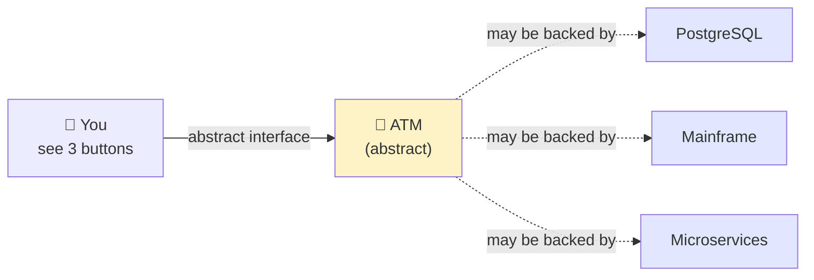
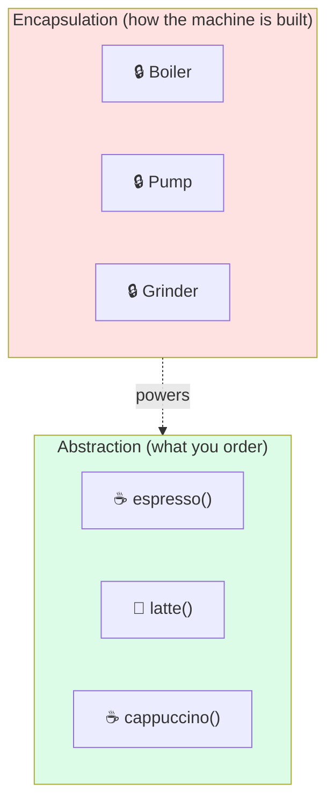
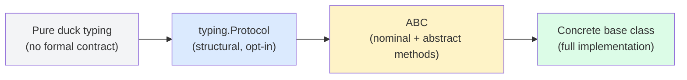
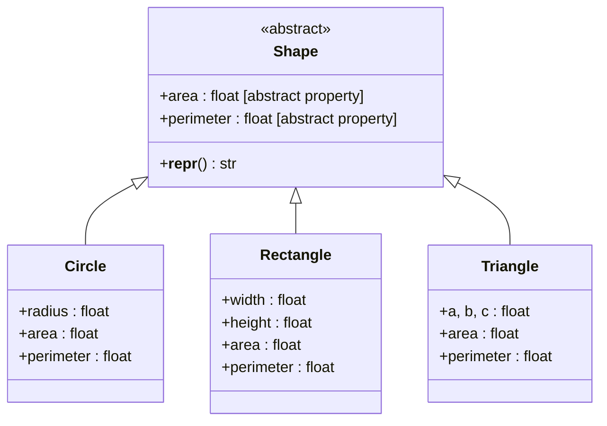
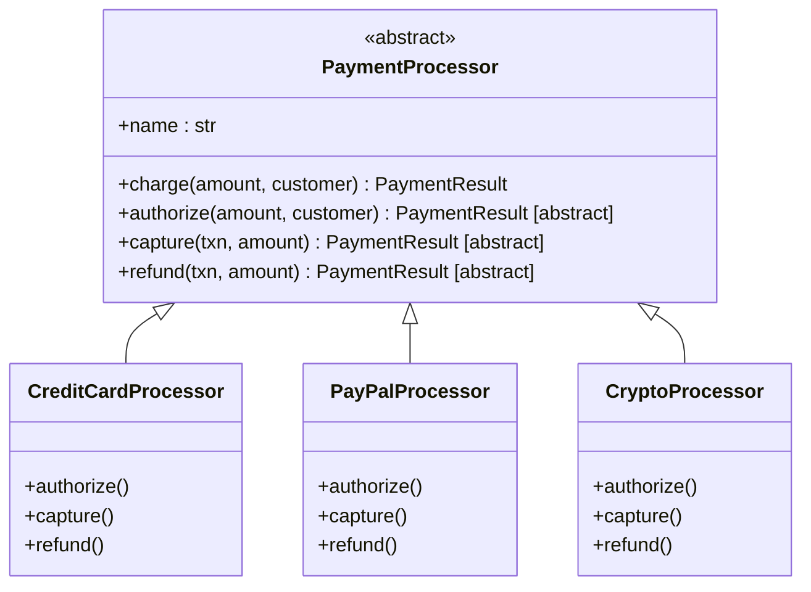
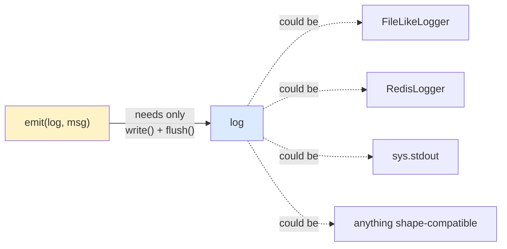
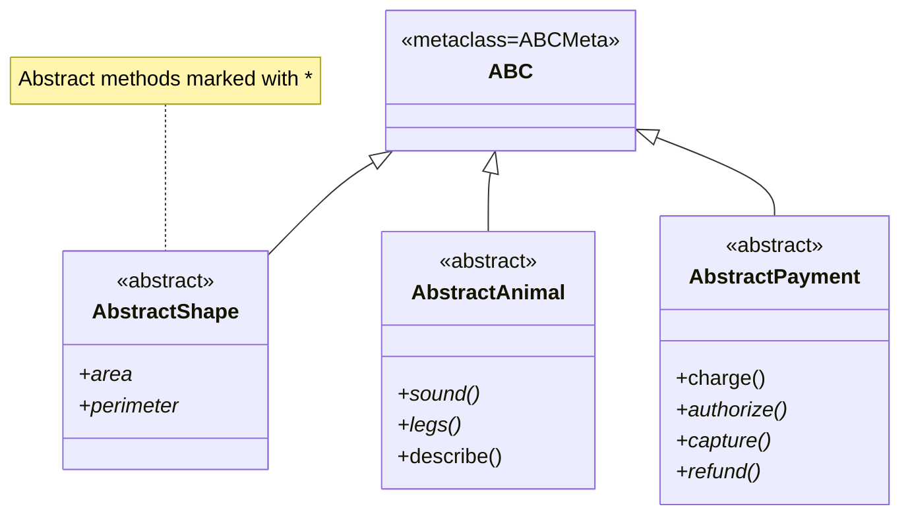
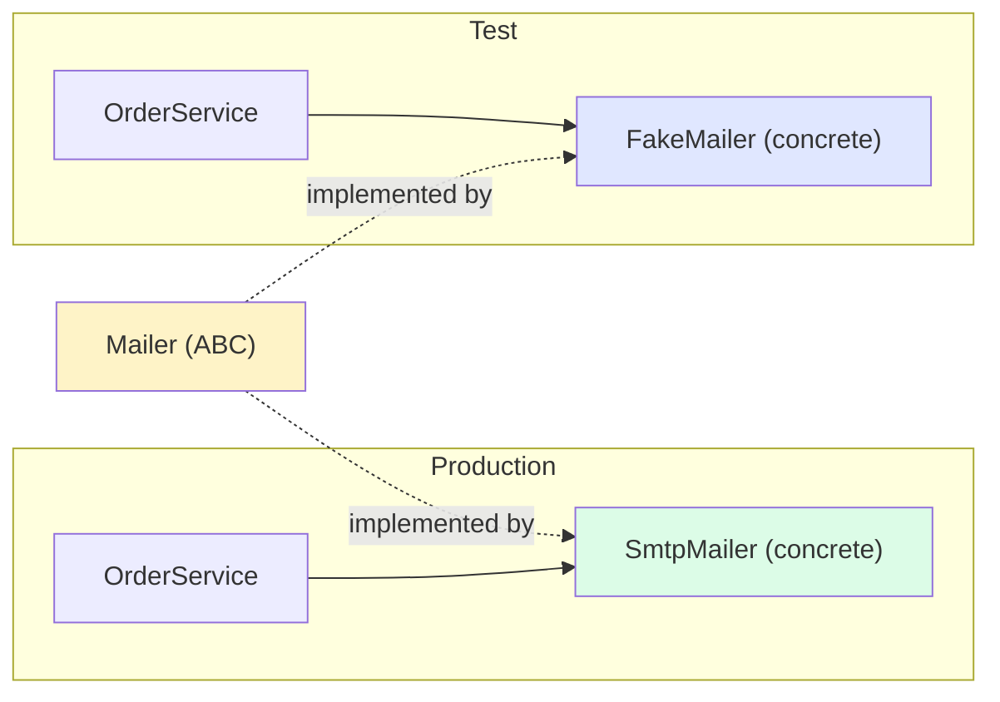
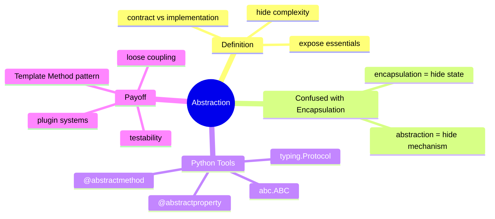

# Abstraction — Exposing Essentials, Hiding Complexity

> [!note] The Second Pillar
> **Abstraction** is the practice of exposing **what** an object does without revealing **how** it does it. It separates the *contract* (the interface) from the *implementation* (the body).

If [[encapsulation]] is "keep your hands off my internals," **abstraction** is "you don't need to know my internals to use me." They are siblings, often confused, but they answer different questions.

---

## 1. Definition and Intuition

### 1.1 The Intuition

You walk up to an ATM. The screen offers three buttons: **Withdraw**, **Deposit**, **Balance**. You don't know — and don't need to know — whether the ATM talks to a PostgreSQL database, a mainframe in another country, or a hamster in a wheel. You only need the **abstraction** of "a thing that can withdraw, deposit, and report balance."



The **interface** is the abstract concept; the **implementation** is whatever concrete machinery actually performs the work.

### 1.2 Formal Definition

> **Abstraction** is the act of exposing essential features of an object while hiding unnecessary implementation detail, so that callers can program against a simplified contract.

In Python, the primary tool for *enforced* abstraction is the **`abc` module** (Abstract Base Classes). But abstraction also happens informally through **duck typing** and **Protocols** (PEP 544), which we will cover in [[polymorphism]].

---

## 2. Abstraction vs Encapsulation — Clearing Up the Confusion

> [!warning] The most common mix-up in OOP
> Students routinely treat "abstraction" and "encapsulation" as synonyms. They are not. The distinction matters in design.

### 2.1 Side-by-Side

| Question               | Encapsulation answers           | Abstraction answers                      |
| ---------------------- | ------------------------------- | ---------------------------------------- |
| *What is it about?*    | **Hiding internal state**       | **Hiding implementation complexity**    |
| *Mechanism*            | Private/protected fields, `@property` | Abstract classes, interfaces, protocols |
| *Goal*                 | Protect invariants              | Simplify the caller's mental model       |
| *Granularity*          | Per-attribute                   | Per-class or per-method contract         |
| *Python tools*         | `_x`, `__x`, `@property`        | `abc.ABC`, `@abstractmethod`, `typing.Protocol` |

### 2.2 The Coffee Shop Analogy

- **Encapsulation** = the espresso machine keeps its boiler, pump, and grinder *inside the casing*. You can't reach in and twiddle the pressure valve.
- **Abstraction** = the barista gives you a menu: *"espresso, latte, cappuccino."* You order by name; the messy choreography of grind-dose-tamp-extract-steam-milk-pour is hidden behind three short words.



### 2.3 The One-Sentence Distinction

> **Encapsulation** hides *state*; **Abstraction** hides *mechanism*.

You can have one without the other, but in a healthy design they reinforce each other: an abstraction defines the contract, encapsulation protects the state that the contract operates on.

---

## 3. Abstract Base Classes in Python

### 3.1 The `abc` Module

Python's `abc` module gives you **Abstract Base Classes** (ABCs) — classes that *cannot be instantiated* directly and that may declare **abstract methods** which subclasses **must** implement.

```python
from abc import ABC, abstractmethod


class Animal(ABC):
    """Abstract — you cannot do Animal()."""

    @abstractmethod
    def sound(self) -> str:
        """Every animal makes a sound; subclasses define how."""
        ...

    @abstractmethod
    def legs(self) -> int:
        ...

    def describe(self) -> str:
        # Concrete method using abstract ones — shared by all subclasses
        return f"{type(self).__name__} says '{self.sound()}' on {self.legs()} legs"


# Animal()                       # ❌ TypeError: abstract class
# animal = Animal()              # ❌ TypeError

class Dog(Animal):
    def sound(self) -> str: return "Woof"
    def legs(self) -> int: return 4

class Spider(Animal):
    def sound(self) -> str: return "..."
    def legs(self) -> int: return 8

print(Dog().describe())     # Dog says 'Woof' on 4 legs
print(Spider().describe())  # Spider says '...' on 8 legs
```

> [!tip] Two ingredients
> 1. Inherit from `ABC` (or use `metaclass=ABCMeta`).
> 2. Decorate required methods with `@abstractmethod`.
>
> A class with *any* unimplemented abstract methods is itself abstract and cannot be instantiated.

### 3.2 Partial Implementation — The Template Method Pattern

ABCs can provide **concrete methods** that call abstract ones. This is the heart of the **Template Method** pattern and a big reason abstraction pays off:

```python
from abc import ABC, abstractmethod


class DataPipeline(ABC):
    """Skeleton algorithm; subclasses fill in the abstract steps."""

    def run(self, source: str) -> None:
        data = self.extract(source)
        cleaned = self.transform(data)
        self.load(cleaned)

    @abstractmethod
    def extract(self, source: str) -> list[dict]: ...

    @abstractmethod
    def transform(self, rows: list[dict]) -> list[dict]: ...

    @abstractmethod
    def load(self, rows: list[dict]) -> None: ...


class CsvPipeline(DataPipeline):
    def extract(self, source: str) -> list[dict]:
        import csv
        with open(source) as f:
            return list(csv.DictReader(f))

    def transform(self, rows: list[dict]) -> list[dict]:
        return [{k: v.strip() for k, v in r.items()} for r in rows]

    def load(self, rows: list[dict]) -> None:
        for r in rows:
            print("LOAD:", r)


CsvPipeline().run("data.csv")   # the run() skeleton is shared
```

The *algorithm structure* (`extract → transform → load`) lives once in the ABC; each subclass provides the steps. This is abstraction at its most powerful — the *shape* of the solution is reusable across completely different concrete behaviors.

### 3.3 `@abstractproperty` and the Modern Alternative

The `@abstractproperty` decorator exists, but the modern, type-friendly way is to combine `@property` with `@abstractmethod`:

```python
from abc import ABC, abstractmethod


class Shape(ABC):
    @property
    @abstractmethod
    def area(self) -> float:
        """Subclasses must provide a read-only `area` property."""
        ...

    @property
    @abstractmethod
    def perimeter(self) -> float:
        ...
```

> [!warning] Decorator order matters
> `@property` must be the **outermost** decorator: `@property` then `@abstractmethod`. Reversing them silently breaks the descriptor.

---

## 4. Interfaces vs Abstract Classes in Python

### 4.1 What Python Does *Not* Have

Languages like Java and C# have an explicit `interface` keyword: a pure contract with no implementation, no fields, no constructors. **Python has no `interface` keyword.** Instead, it offers a *spectrum*:



| Tool                    | Nominal? | Structural? | Can have implementation? | Enforces instantiation block? |
| ----------------------- | -------- | ----------- | ------------------------- | ----------------------------- |
| Duck typing             | No       | Yes         | N/A                       | No                            |
| `typing.Protocol`       | No       | Yes         | Yes (but usually none)    | No (only for type-checker)    |
| `abc.ABC`               | Yes      | No          | Yes                       | **Yes** (runtime)             |
| Plain base class        | Yes      | No          | Yes                       | No                            |

### 4.2 ABC as "Interface" — The Common Python Convention

In Python, when people say *"define an interface"*, they usually mean *"define an ABC with only abstract methods."*

```python
from abc import ABC, abstractmethod


class Queue(ABC):
    """Pure interface — no state, no concrete methods."""

    @abstractmethod
    def enqueue(self, item) -> None: ...

    @abstractmethod
    def dequeue(self): ...

    @abstractmethod
    def __len__(self) -> int: ...
```

### 4.3 `typing.Protocol` — Structural Interfaces

`Protocol` (PEP 544) is the **structural typing** answer. A class matches a Protocol **by shape**, not by inheritance. The runtime doesn't enforce anything; the type checker (mypy/pyright) does.

```python
from typing import Protocol


class SupportsClose(Protocol):
    def close(self) -> None: ...


def shutdown(resource: SupportsClose) -> None:
    resource.close()


class FileHandle:
    def close(self) -> None:
        print("file closed")

class DbConnection:
    def close(self) -> None:
        print("db closed")

shutdown(FileHandle())    # ✅ structural match
shutdown(DbConnection())  # ✅ structural match
```

> [!tip] When to use what
> - Use **ABC** when you want **runtime enforcement** ("cannot instantiate without implementing these methods") and you control the type hierarchy.
> - Use **Protocol** when you want **structural typing** — matching by shape — typically for third-party types or for loose coupling where inheritance would be invasive.

---

## 5. Worked Examples

### 5.1 Example: A `Shape` Hierarchy

A textbook case: an abstract `Shape` with `area` and `perimeter` properties; concrete subclasses `Circle`, `Rectangle`, `Triangle`.

```python
from abc import ABC, abstractmethod
from math import pi, sqrt
from dataclasses import dataclass


class Shape(ABC):
    """Abstract shape — defines the contract, not the math."""

    @property
    @abstractmethod
    def area(self) -> float: ...

    @property
    @abstractmethod
    def perimeter(self) -> float: ...

    def __repr__(self) -> str:
        return (f"{type(self).__name__}"
                f"(area={self.area:.3f}, perimeter={self.perimeter:.3f})")


@dataclass
class Circle(Shape):
    radius: float

    @property
    def area(self) -> float:
        return pi * self.radius ** 2

    @property
    def perimeter(self) -> float:
        return 2 * pi * self.radius


@dataclass
class Rectangle(Shape):
    width: float
    height: float

    @property
    def area(self) -> float:
        return self.width * self.height

    @property
    def perimeter(self) -> float:
        return 2 * (self.width + self.height)


@dataclass
class Triangle(Shape):
    a: float
    b: float
    c: float

    def __post_init__(self) -> None:
        sides = sorted([self.a, self.b, self.c])
        if sides[0] + sides[1] <= sides[2]:
            raise ValueError("violates triangle inequality")

    @property
    def area(self) -> float:
        # Heron's formula
        s = self.perimeter / 2
        return sqrt(s * (s - self.a) * (s - self.b) * (s - self.c))

    @property
    def perimeter(self) -> float:
        return self.a + self.b + self.c


shapes: list[Shape] = [
    Circle(2),
    Rectangle(3, 4),
    Triangle(3, 4, 5),
]

for s in shapes:
    print(s)
# Circle(area=12.566, perimeter=12.566)
# Rectangle(area=12.000, perimeter=14.000)
# Triangle(area=6.000, perimeter=12.000)

total_area = sum(s.area for s in shapes)   # polymorphic call site
print(f"total area = {total_area:.3f}")
```



> [!example] Notice what the caller gets
> The `for s in shapes` loop is **polymorphic** — see [[polymorphism]] — and depends only on the *abstract* contract (`area` exists). You can add a `Pentagon` tomorrow without touching this loop. **Open for extension, closed for modification.**

### 5.2 Example: A `PaymentProcessor` Abstract Base

A more real-world case: different payment back-ends, one contract.

```python
from abc import ABC, abstractmethod
from dataclasses import dataclass
from decimal import Decimal


@dataclass(frozen=True)
class PaymentResult:
    success: bool
    transaction_id: str
    message: str


class PaymentProcessor(ABC):
    """Abstract contract for any payment back-end.

    Concrete subclasses must implement authorize, capture, refund.
    They inherit the public `charge` orchestration.
    """

    name: str = "abstract"

    def charge(self, amount: Decimal, customer_ref: str) -> PaymentResult:
        """Template method — orchestrates the abstract steps."""
        auth = self.authorize(amount, customer_ref)
        if not auth.success:
            return auth
        return self.capture(auth.transaction_id, amount)

    @abstractmethod
    def authorize(self, amount: Decimal, customer_ref: str) -> PaymentResult: ...

    @abstractmethod
    def capture(self, txn_id: str, amount: Decimal) -> PaymentResult: ...

    @abstractmethod
    def refund(self, txn_id: str, amount: Decimal) -> PaymentResult: ...

    def __repr__(self) -> str:
        return f"<{type(self).__name__} name={self.name!r}>"


class CreditCardProcessor(PaymentProcessor):
    name = "credit-card"

    def authorize(self, amount, customer_ref):
        return PaymentResult(True, f"cc-auth-{customer_ref}", "authorized")

    def capture(self, txn_id, amount):
        return PaymentResult(True, txn_id.replace("auth", "cap"), "captured")

    def refund(self, txn_id, amount):
        return PaymentResult(True, f"refund-{txn_id}", "refunded")


class PayPalProcessor(PaymentProcessor):
    name = "paypal"

    def authorize(self, amount, customer_ref):
        return PaymentResult(True, f"pp-auth-{customer_ref}", "ok")

    def capture(self, txn_id, amount):
        return PaymentResult(True, txn_id.replace("auth", "cap"), "ok")

    def refund(self, txn_id, amount):
        return PaymentResult(False, txn_id, "paypal refund failed")


class CryptoProcessor(PaymentProcessor):
    name = "crypto"

    def authorize(self, amount, customer_ref):
        return PaymentResult(True, f"0x{customer_ref}", "on-chain")

    def capture(self, txn_id, amount):
        return PaymentResult(True, txn_id, "settled")

    def refund(self, txn_id, amount):
        return PaymentResult(True, txn_id, "refund-tx")


def checkout(amount: Decimal, customer: str, processor: PaymentProcessor) -> None:
    """The caller knows nothing about CC/PayPal/Crypto internals."""
    result = processor.charge(amount, customer)
    print(f"[{processor.name}] {result.message} (txn={result.transaction_id})")


checkout(Decimal("99.00"), "ada", CreditCardProcessor())
checkout(Decimal("49.50"), "alan", PayPalProcessor())
checkout(Decimal("0.01"),  "satoshi", CryptoProcessor())
```



> [!tip] Why this is loose coupling
> `checkout()` depends only on the *abstract* `PaymentProcessor`. Adding a new back-end (`ApplePayProcessor`) is a single new class — no existing code changes. The "how" is fully hidden behind the "what."

### 5.3 Example: Abstraction via Duck Typing (No Inheritance)

You don't need an ABC to enjoy abstraction in Python. A function that uses only a method's *contract* is already abstract:

```python
class FileLikeLogger:
    def write(self, msg: str) -> None: ...
    def flush(self) -> None: ...

class RedisLogger:
    def write(self, msg: str) -> None: ...
    def flush(self) -> None: ...

def emit(log, msg: str) -> None:
    """Abstract over anything that can write+flush."""
    log.write(msg)
    log.flush()
```

The `emit` function is abstract: it doesn't know what `log` *is*, only what it *does*. This is the heart of duck typing — see [[polymorphism]] for the full treatment.



---

## 6. ABC Hierarchy Diagram (Master View)



---

## 7. Why Abstraction Enables Loose Coupling and Testability

### 7.1 Loose Coupling

When a caller depends on an **abstract type** rather than a concrete one, the caller is decoupled from the implementation:

```python
# Tight coupling — bad
class OrderService:
    def __init__(self):
        self._mailer = SmtpMailer(host="smtp.example.com")  # hardcoded

# Loose coupling — good
class OrderService:
    def __init__(self, mailer: Mailer):  # Mailer is an ABC/Protocol
        self._mailer = mailer
```

The second version accepts *any* `Mailer` — production SMTP, in-memory test fake, sendgrid adapter, etc.

### 7.2 Testability

Abstraction is what makes **mocking and faking** possible. If `OrderService` accepts a `Mailer` ABC, your tests can supply a `FakeMailer` that records calls instead of sending real email:

```python
class FakeMailer(Mailer):
    def __init__(self):
        self.sent: list[tuple[str, str]] = []

    def send(self, to: str, body: str) -> None:
        self.sent.append((to, body))


def test_order_sends_confirmation():
    fake = FakeMailer()
    service = OrderService(mailer=fake)
    service.place_order(customer="ada", total=99)
    assert fake.sent == [("ada", "Your order for 99 is confirmed.")]
```

Without abstraction, you'd be reduced to monkey-patching network calls or hitting a real SMTP server — fragile and slow.



### 7.3 Abstraction + Duck Typing = Zero-Boilerplate Plugins

Because Python is dynamically typed, you can write a *plugin system* in a few lines:

```python
def discover_plugins() -> list[PaymentProcessor]:
    # Any subclass of PaymentProcessor anywhere in the package counts
    return PaymentProcessor.__subclasses__()
```

No registration code, no manifest — just inherit and you're a plugin. (For more, see [[inheritance]] and the discussion of `__subclasses__`.)

---

## 8. Common Mistakes and How to Avoid Them

> [!danger] Top abstraction mistakes

### 8.1 "Abstract" Class Without Any Abstract Methods

```python
# ❌ Useless — looks abstract, isn't, provides no contract
class Repository(ABC):
    def save(self, item): pass      # not abstract!
    def find(self, id): pass        # not abstract!
```

Either make the methods `@abstractmethod` (real contract), or drop the `ABC` (and accept that you have a plain base class). Half-measures are the worst of both worlds.

### 8.2 Leaky Abstractions

The famous "law of leaky abstractions" bites when the contract implicitly exposes implementation details. Example:

```python
class PaymentProcessor(ABC):
    @abstractmethod
    def charge(self, amount_in_cents: int, card_token: str) -> bool: ...
```

`card_token` and `amount_in_cents` leak *credit-card-specific* assumptions into the abstract contract. A PayPal processor now has to invent a fake "card token." The abstraction has failed.

**Fix:** push card-specific parameters down into concrete subclasses; the abstract contract should be expressed in *domain* terms (`amount`, `customer_ref`), not *implementation* terms.

### 8.3 Abstracting Too Early

> [!warning] The Rule of Three
> Don't introduce an ABC the moment you have one implementation. Wait until you have **three** concrete cases, *then* extract the abstraction. Premature abstraction is harder to fix than premature concreteness.

### 8.4 Using ABCs Where a Protocol Fits Better

If you only want type-checker enforcement and don't want to force callers to inherit, prefer `typing.Protocol`. ABCs are *nominal* (require `class X(SomeABC)`); Protocols are *structural* (any class with the right shape matches).

### 8.5 Forgetting That `@abstractmethod` Must Be on a Method

```python
# ❌ Won't enforce anything — forgot @abstractmethod
class Bad:
    def required_method(self): ...
```

### 8.6 Multiple Inheritance of ABCs with Clashing Contracts

If two ABCs both declare `save(self) -> X` with different return types, a class implementing both will be torn. Design ABCs to be **composable** — small, focused, non-overlapping.

---

## 9. Abstraction and the Other Pillars

- **[[encapsulation]]** is the *mechanism* that lets abstraction hide implementation safely.
- **[[inheritance]]** is the most common *vehicle* for implementing an ABC: subclasses fill in the abstract methods.
- **[[polymorphism]]** is what makes abstraction *pay off*: callers write code against the abstract type, and the right concrete behavior is dispatched at runtime.



---

## 10. Key Takeaways

1. **Abstraction = "what" without "how."** It separates contract from implementation.
2. **Abstraction ≠ Encapsulation.** Encapsulation hides *state*; abstraction hides *mechanism*. They reinforce each other but answer different questions.
3. **Use `abc.ABC` + `@abstractmethod`** for runtime-enforced contracts with nominal subtyping.
4. **Use `typing.Protocol`** for structural, type-checker-only interfaces — great for third-party types and loose coupling.
5. **ABCs can carry concrete methods** that call abstract ones (Template Method pattern). This is abstraction's most powerful payoff.
6. **Wait for the Rule of Three** before extracting an abstraction. Premature ABCs calcify bad designs.
7. **Design contracts in domain terms**, not implementation terms, to avoid leaky abstractions.
8. **Abstraction buys testability and extensibility.** Mocking, faking, and plugin discovery all flow from depending on abstractions rather than concretes.

---

## 11. Practice Exercises

> [!example] Try these to lock in the concepts

### Easy
1. **`Vehicle` ABC.** Define an abstract `Vehicle` with abstract methods `start_engine()` and `max_speed()`. Add a concrete `describe()` method. Implement `Car` and `Bicycle` (a bicycle's "engine" starts trivially; its max speed is 30).

2. **`Logger` Protocol.** Define a `typing.Protocol` named `Logger` with a `log(level: str, msg: str) -> None` method. Write a function `audit(logger: Logger, event: str)` and pass it three different ad-hoc classes that match the protocol without inheriting from it.

### Medium
3. **`Storage` ABC with Template Method.** Define an abstract `Storage` with abstract `read(path) -> bytes` and `write(path, data) -> None`, plus a concrete `copy(src, dst)` that uses them. Implement `LocalStorage`, `InMemoryStorage`, and `S3Storage` (the last can be a stub).

4. **`Sorter` family.** Design an abstract `Sorter` with `sort(items: list) -> list`. Implement `BubbleSort`, `QuickSort`, `MergeSort`. Add a `benchmark(sorters, data)` that times each one — the benchmark function should know nothing about which algorithm it's testing.

### Hard
5. **Plugin discovery.** Build a `Notifier` ABC with `send(to: str, msg: str) -> bool`. Implement `EmailNotifier`, `SmsNotifier`, `SlackNotifier`. Write a `discover()` that returns all subclasses of `Notifier`, and a `broadcast(notifiers, msg)` that fans out to all of them. Bonus: handle the case where one notifier fails without aborting the broadcast.

6. **Refactor the leaky abstraction.** Take this poorly-designed abstract class:
   ```python
   class Payment(ABC):
       @abstractmethod
       def charge(self, card_token: str, amount_in_cents: int) -> bool: ...
   ```
   Redesign the contract so it works for credit cards, PayPal, and bank transfers without leaking any one method's assumptions into the abstract type. Justify each design choice in a comment.

7. **Two-level abstraction.** Build `Repository[T]` (abstract: `save`, `find`, `delete`), then `UserRepository(Repository[User])` as an *intermediate abstract* that adds `find_by_email`. Then implement `SqlUserRepository` concretely. Show how a test can use a `FakeUserRepository` by implementing only the abstract methods.

---

Next: [[inheritance]] — how new classes derive from existing ones, and Python's elegant answer to multiple inheritance.
