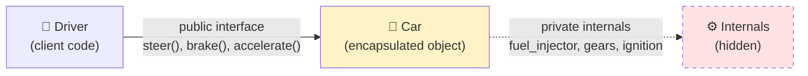
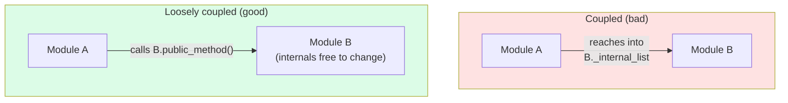
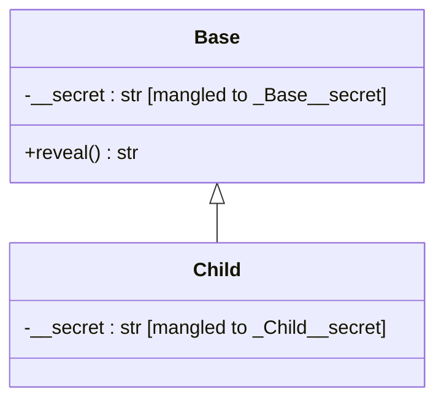
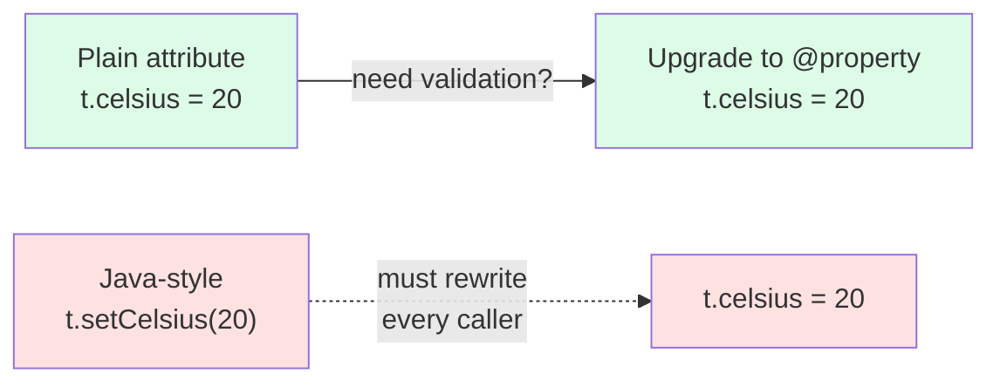
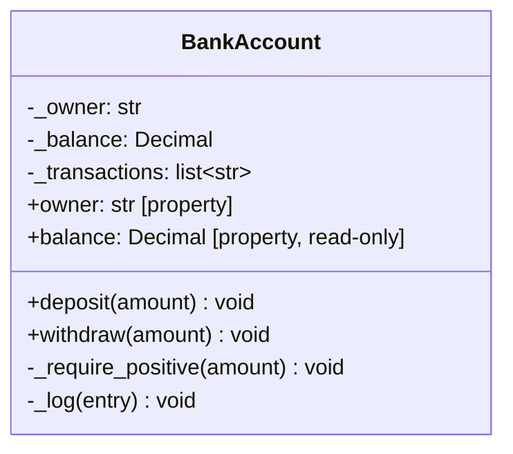
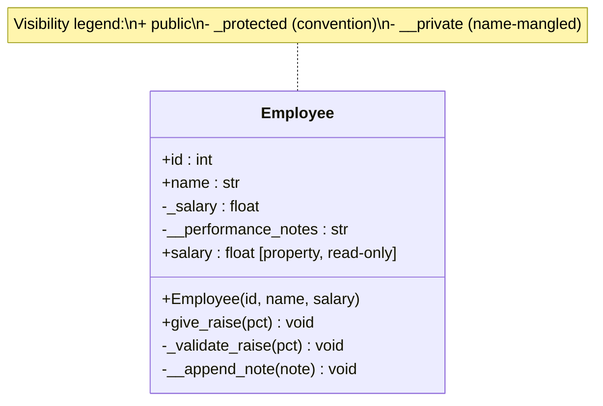
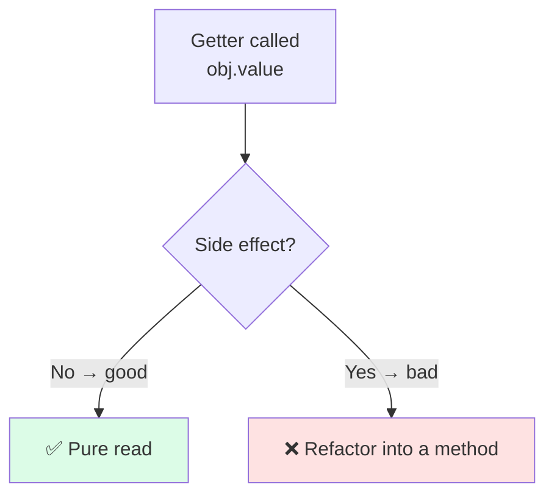
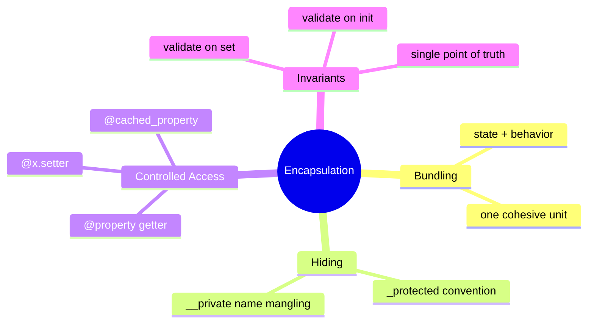

# Encapsulation — Bundling Data and Behavior

> [!note] The First Pillar
> **Encapsulation** is the practice of **bundling data (state)** together with **the methods (behavior)** that operate on that data, and **restricting direct access** to the internal representation. It is the "keep your hands off my internals" pillar.

Encapsulation is the foundation on which the other three pillars rest. Without it, invariants become impossible to maintain, [[abstraction]] leaks, [[inheritance]] breaks, and [[polymorphism]] has nothing to dispatch on. Teach this one *first* and *well*.

---

## 1. Definition and Intuition

### 1.1 The Intuition

Think of a **car**. From the driver's seat you interact with a small, well-defined interface:

- Steering wheel → turn
- Pedals → accelerate / brake
- Gear shift → change gear

You do **not** directly manipulate the fuel injectors, the transmission gears, or the engine's ignition timing. Those internals are *encapsulated* behind a clean interface.



Encapsulation gives you three things at once:

1. **Bundling** — state and behavior live together in one unit (the class).
2. **Hiding** — internals are not directly accessible from outside.
3. **Controlled access** — when external access *is* needed, it goes through methods/properties that can validate, log, or compute.

### 1.2 Formal Definition

> **Encapsulation** is the bundling of data with the methods that operate on that data, and the restriction of direct external access to some of the object's components.

---

## 2. Why Encapsulation Matters

> [!tip] Why before How
> If you cannot articulate *why* encapsulation matters, the `@property` decorator and the `_` convention will look like pointless ceremony. The "why" is the whole point.

### 2.1 Protecting Invariants

An **invariant** is a property of an object that must always be true. For example:

- A bank account balance can never go below zero.
- A temperature in Celsius cannot drop below −273.15.
- An email address must contain `@`.

If you expose the raw field, any caller can break the invariant:

```python
# ❌ Bad: public field, no protection
class BankAccount:
    def __init__(self, owner: str):
        self.owner = owner
        self.balance = 0.0   # anyone can set this!

acct = BankAccount("Ada")
acct.balance = -1_000_000   # 💥 invariant violated
```

Encapsulation lets you **gate** every mutation behind validation:

```python
# ✅ Good: balance is private, deposits/withdrawals are validated
class BankAccount:
    def __init__(self, owner: str):
        self.owner = owner
        self._balance = 0.0          # "private" by convention

    @property
    def balance(self) -> float:
        return self._balance

    def deposit(self, amount: float) -> None:
        if amount <= 0:
            raise ValueError("deposit must be positive")
        self._balance += amount

    def withdraw(self, amount: float) -> None:
        if amount <= 0:
            raise ValueError("withdrawal must be positive")
        if amount > self._balance:
            raise ValueError("insufficient funds")
        self._balance -= amount
```

Now `acct.balance = -1_000_000` is *impossible*: `balance` is a read-only property with no setter, and the only way to change `_balance` is through `deposit` / `withdraw`, both of which enforce the invariant.

### 2.2 Hiding Implementation

Clients should depend on **what** an object does, not **how** it does it. If a `Temperature` class stores its value internally as Kelvin, callers should not know or care — you must be free to swap the internal representation tomorrow without breaking the world.

### 2.3 Reducing Coupling

Coupling is the degree to which one module depends on the *internals* of another. Encapsulation draws a hard line between "public contract" and "private implementation," which is the single biggest weapon against spaghetti code.



---

## 3. Python's Approach to Encapsulation

> [!warning] Python's philosophy
> *"We are all consenting adults here."* Python does **not** enforce access control at the language level the way Java or C# do. Instead, it provides **conventions** and **name mangling** — and trusts you to behave.

### 3.1 The Three Tiers of Attribute Visibility

| Convention       | Meaning                                            | Enforcement                          |
| ---------------- | -------------------------------------------------- | ------------------------------------ |
| `name`           | **Public**. Part of the API.                       | None — free to use.                  |
| `_name`          | **Protected**. Internal use, subclasses may touch. | Convention only (linters may warn).  |
| `__name`         | **Private**. Name-mangled to `_ClassName__name`.   | Language-level name mangling.        |
| `__name__`       | **Dunder**. Reserved for Python protocols.         | Don't invent your own.               |

### 3.2 The Single Underscore `_protected` (Convention)

A leading underscore says *"I am an implementation detail; use me at your own risk."* Nothing stops external code from reading it, but you have signaled that you may change it without notice.

```python
class Logger:
    def __init__(self, name: str):
        self.name = name          # public
        self._buffer: list[str] = []   # protected — internal

    def log(self, msg: str) -> None:
        self._buffer.append(msg)
        self._flush_if_full()

    def _flush_if_full(self) -> None:   # protected helper
        if len(self._buffer) >= 100:
            # ... write to disk ...
            self._buffer.clear()
```

> [!tip] Convention is enough most of the time
> In Python culture, `_protected` is the *default* for internal state. Reserve `__private` for cases where you actively want to prevent accidental name collisions in subclasses.

### 3.3 The Double Underscore `__private` (Name Mangling)

A leading **double underscore** (with at most one trailing underscore) triggers **name mangling**: Python rewrites `__x` inside `class Foo` to `_Foo__x`. This *prevents accidental shadowing* in subclasses.

```python
class Base:
    def __init__(self) -> None:
        self.__secret = "base"     # becomes _Base__secret

    def reveal(self) -> str:
        return self.__secret        # inside the class, unmangled access

class Child(Base):
    def __init__(self) -> None:
        super().__init__()
        self.__secret = "child"     # becomes _Child__secret — different slot!

c = Child()
print(c.reveal())            # "base"   ← Base's secret is untouched
print(c._Base__secret)       # "base"   ← still reachable, just inconvenient
print(c._Child__secret)      # "child"
```



> [!danger] Name mangling is NOT security
> It is a **collision-avoidance** mechanism, not access control. Anyone determined can still read `obj._ClassName__field`. Do not use `__` to "secure" passwords, API keys, or anything sensitive — that is not what it is for.

### 3.4 The `@property` Decorator (Controlled Access)

`@property` turns a method into something that *looks like* an attribute but is *computed* and *controllable*. It is the canonical Python answer to getters and setters.

```python
class Circle:
    def __init__(self, radius: float) -> None:
        # The setter is invoked here, so validation runs on init too
        self.radius = radius

    @property
    def radius(self) -> float:
        return self._radius

    @radius.setter
    def radius(self, value: float) -> None:
        if value <= 0:
            raise ValueError("radius must be positive")
        self._radius = value

    @property
    def area(self) -> float:
        # Computed property — no setter, read-only
        import math
        return math.pi * self._radius ** 2
```

```python
>>> c = Circle(5)
>>> c.radius       # getter
5
>>> c.area         # computed
78.53981633974483
>>> c.radius = -1  # setter validates
ValueError: radius must be positive
>>> c.area = 10    # no setter → read-only
AttributeError: can't set attribute
```

---

## 4. Getters/Setters vs Properties

### 4.1 The Java-Style Pattern (Avoid in Python)

```python
# ❌ Un-Pythonic — looks like translated Java
class Thermometer:
    def __init__(self):
        self._celsius = 0.0

    def get_celsius(self) -> float:
        return self._celsius

    def set_celsius(self, value: float) -> None:
        if value < -273.15:
            raise ValueError("below absolute zero")
        self._celsius = value
```

### 4.2 The Pythonic Pattern (Preferred)

```python
# ✅ Pythonic — properties let callers write `t.celsius`
class Thermometer:
    def __init__(self):
        self.celsius = 0.0      # invokes the setter

    @property
    def celsius(self) -> float:
        return self._celsius

    @celsius.setter
    def celsius(self, value: float) -> None:
        if value < -273.15:
            raise ValueError("below absolute zero")
        self._celsius = value
```

> [!tip] Why properties win
> With properties, the **call site doesn't change** when you add validation. `t.celsius = 20` works whether `celsius` is a plain attribute or a property with a setter. You can start with a plain attribute and "upgrade" to a property later without breaking any caller. This is impossible in languages that require `getX()/setX()` from day one.



---

## 5. Worked Examples

### 5.1 Example: `BankAccount` — Protecting the Balance Invariant

```python
from decimal import Decimal


class BankAccount:
    """A bank account that never permits a negative balance."""

    def __init__(self, owner: str, initial_deposit: Decimal = Decimal("0")):
        if not owner:
            raise ValueError("owner must be non-empty")
        self._owner = owner
        self._balance = Decimal("0")
        self._transactions: list[str] = []
        self.deposit(initial_deposit)   # route through validation

    # ---- read-only public properties --------------------------------
    @property
    def owner(self) -> str:
        return self._owner

    @property
    def balance(self) -> Decimal:
        return self._balance

    # ---- mutating operations ----------------------------------------
    def deposit(self, amount: Decimal) -> None:
        self._require_positive(amount)
        self._balance += amount
        self._log(f"DEPOSIT  +{amount}")

    def withdraw(self, amount: Decimal) -> None:
        self._require_positive(amount)
        if amount > self._balance:
            raise ValueError("insufficient funds")
        self._balance -= amount
        self._log(f"WITHDRAW -{amount}")

    # ---- protected helpers ------------------------------------------
    @staticmethod
    def _require_positive(amount: Decimal) -> None:
        if not isinstance(amount, Decimal):
            raise TypeError("amount must be a Decimal")
        if amount <= 0:
            raise ValueError("amount must be positive")

    def _log(self, entry: str) -> None:
        self._transactions.append(entry)

    # ---- dunder for friendly printing -------------------------------
    def __repr__(self) -> str:
        return f"BankAccount(owner={self._owner!r}, balance={self._balance})"


acct = BankAccount("Ada", Decimal("100"))
acct.deposit(Decimal("50"))
acct.withdraw(Decimal("30"))
print(acct)                # BankAccount(owner='Ada', balance=120)
print(acct.balance)        # 120
# acct.balance = 0         # AttributeError — read-only property ✅
# acct.withdraw(Decimal("999999"))  # ValueError — invariant protected ✅
```



### 5.2 Example: `Temperature` — Validated Setter + Computed Properties

```python
class Temperature:
    """A temperature value stored internally in Celsius."""

    ABSOLUTE_ZERO_C = -273.15

    def __init__(self, celsius: float = 0.0):
        self.celsius = celsius    # uses the setter → validation on init

    @property
    def celsius(self) -> float:
        return self._celsius

    @celsius.setter
    def celsius(self, value: float) -> None:
        if value < self.ABSOLUTE_ZERO_C:
            raise ValueError(f"{value}°C is below absolute zero")
        self._celsius = float(value)

    @property
    def fahrenheit(self) -> float:
        return self._celsius * 9 / 5 + 32

    @fahrenheit.setter
    def fahrenheit(self, value: float) -> None:
        self.celsius = (value - 32) * 5 / 9   # reuses celsius validation

    @property
    def kelvin(self) -> float:
        return self._celsius - self.ABSOLUTE_ZERO_C

    @kelvin.setter
    def kelvin(self, value: float) -> None:
        self.celsius = value + self.ABSOLUTE_ZERO_C

    def __repr__(self) -> str:
        return f"Temperature({self._celsius:.2f}°C)"


t = Temperature(25)
print(t.fahrenheit)   # 77.0
t.fahrenheit = 32     # setter path: 32°F → 0°C
print(t.celsius)      # 0.0
t.kelvin = 300
print(t.celsius)      # 26.85
# t.celsius = -500    # ValueError ✅
```

> [!example] Notice the pattern
> The `fahrenheit` and `kelvin` setters *do not* store anything. They convert and delegate to `celsius.setter`, which is the single source of validation. This is the **single-point-of-truth** pattern made possible by encapsulation.

### 5.3 Example: `User` — Computed, Cached, and Derived Properties

```python
from __future__ import annotations
import re
from functools import cached_property


class User:
    _EMAIL_RE = re.compile(r"^[^@\s]+@[^@\s]+\.[^@\s]+$")

    def __init__(self, email: str, first: str, last: str):
        self.email = email            # setter validates
        self.first = first
        self.last = last
        self._login_count = 0

    # ---- validated email -------------------------------------------
    @property
    def email(self) -> str:
        return self._email

    @email.setter
    def email(self, value: str) -> None:
        if not self._EMAIL_RE.match(value):
            raise ValueError(f"invalid email: {value!r}")
        self._email = value
        # Invalidate cached derived data when the underlying value changes
        self.__dict__.pop("domain", None)

    # ---- computed property -----------------------------------------
    @property
    def full_name(self) -> str:
        return f"{self.first} {self.last}"

    # ---- cached property (computed once, memoized) -----------------
    @cached_property
    def domain(self) -> str:
        # Imagine this doing an expensive DNS / DB lookup
        return self._email.split("@", 1)[1]

    # ---- controlled mutation ---------------------------------------
    def record_login(self) -> None:
        self._login_count += 1

    @property
    def login_count(self) -> int:
        return self._login_count


u = User("ada@lovelace.dev", "Ada", "Lovelace")
print(u.full_name)   # Ada Lovelace
print(u.domain)      # lovelace.dev (computed once, cached)
u.record_login()
u.record_login()
print(u.login_count) # 2
u.email = "ada@analyticalengine.org"
print(u.domain)      # analyticalengine.org — cache invalidated
```

> [!warning] `cached_property` gotcha
> `@cached_property` stores the result in the instance `__dict__`. If the underlying value can change (like `email` here), you must **invalidate** the cache yourself, as shown. Alternatively, treat the object as **immutable** (use a frozen `@dataclass`) and the problem disappears.

---

## 6. A Class Diagram Showing Visibility Tiers



---

## 7. Common Mistakes and How to Avoid Them

> [!danger] Top encapsulation mistakes

### 7.1 Returning Internal Mutable State by Reference

```python
# ❌ Bad — caller can mutate the private list
class Team:
    def __init__(self):
        self._members: list[str] = []

    def members(self) -> list[str]:
        return self._members        # leaks the internal list!

t = Team()
t.members().append("Hacker")        # bypasses any add_member() validation
```

```python
# ✅ Good — return a copy or an immutable view
class Team:
    def __init__(self):
        self._members: list[str] = []

    def members(self) -> tuple[str, ...]:
        return tuple(self._members)   # immutable snapshot

    def add_member(self, name: str) -> None:
        if name in self._members:
            raise ValueError("duplicate")
        self._members.append(name)
```

### 7.2 Using `__private` for Everything

Excessive `__mangling` makes subclassing painful and debugging harder. Use `_protected` by default; reach for `__private` only when you genuinely fear name collisions in subclasses.

### 7.3 Boilerplate Getters/Setters for Every Field

```python
# ❌ Java-in-Python
class Point:
    def __init__(self):
        self._x = 0
        self._y = 0
    def get_x(self): return self._x
    def set_x(self, v): self._x = v
    def get_y(self): return self._y
    def set_y(self, v): self._y = v
```

```python
# ✅ Start simple, add properties only when needed
class Point:
    def __init__(self, x: float = 0.0, y: float = 0.0):
        self.x = x
        self.y = y
```

### 7.4 Forgetting That `@property` Hides Cost

A property looks like an attribute, so callers assume it's cheap. If your `@property` does a network call, **reconsider**: make it a method (`fetch_profile()`) so the cost is visible at the call site, or use `@cached_property`.

### 7.5 Mutating in a Getter

A getter should be **side-effect free**. If `account.balance` mutates state, you have broken the principle of least surprise. Put mutations in methods, not in properties.



---

## 8. Encapsulation and the Other Pillars

Encapsulation is the **bedrock** of the other three pillars:

- **[[abstraction]]** *depends* on encapsulation: an abstract interface is only meaningful if the implementation behind it can be hidden.
- **[[inheritance]]** *relies* on encapsulation: a subclass should manipulate parent state through protected/public methods, never by reaching into private fields.
- **[[polymorphism]]** *requires* encapsulation: substitution only works if each object's internal state is managed by that object's own methods.



---

## 9. Key Takeaways

1. **Encapsulation = bundling + hiding + controlled access.** All three are needed.
2. **Python trusts you.** `_protected` is convention; `__private` is name mangling — neither is security.
3. **Prefer `@property` over getter/setter methods.** Call sites stay clean, and you can add validation later without breaking anyone.
4. **Start with plain attributes; upgrade to properties only when needed.** YAGNI applies.
5. **Validate in setters, and route `__init__` through the setters** so invariants hold from construction.
6. **Never leak mutable internals by reference.** Return copies or immutable views.
7. **Invariants are the point.** If you can't name an invariant your class protects, your encapsulation may be cargo-cult.
8. **Encapsulation is the foundation** that makes abstraction, inheritance, and polymorphism safe.

---

## 10. Practice Exercises

> [!example] Try these to lock in the concepts

### Easy
1. **`Score` class.** Write a `Score` class whose `value` property must be an integer between 0 and 100 inclusive. The setter raises `ValueError` otherwise. `__init__` should route through the setter.

2. **`Password` class.** Build a `Password` class that stores a hashed password (use `hashlib.sha256`) internally as `_hashed`. Expose `set_password(plain)` and `verify(plain) -> bool`. Never store or expose the plaintext.

### Medium
3. **`Cart` with read-only total.** Implement a `Cart` that holds items (`(name, price, qty)`). The `total` property is computed and read-only. Add `add_item` and `remove_item` methods that validate prices and quantities.

4. **`Money` with currency.** Create a `Money` class storing amount as `Decimal` and a currency code. The `amount` setter must be non-negative. Add `convert_to(currency)` that uses a (fake) rates dict — cache the rates in a `@cached_property`.

### Hard
5. **`Matrix` with encapsulated storage.** Build a `Matrix` backed by a nested list. Expose `at(r, c)` (read) and `set(r, c, v)` (validated write), but never expose the underlying list. Add a `transposed` cached property.

6. **`StateMachine` with private state.** Design a `TrafficLight` whose `_state` is one of `"red"`, `"green"`, `"amber"`. Only allow transitions via `cycle()`. Make `_state` truly private (mangled). Add a `state` read-only property. Bonus: raise if someone tries an illegal transition from outside.

7. **Refactor exercise.** Take the following broken code and refactor it into a well-encapsulated `LibraryBook` class with proper validation, properties, and no leaking internals:
   ```python
   class LibraryBook:
       def __init__(self):
           self.title = ""
           self.copies = 0
           self.borrowers = []   # anyone can append!
   ```

---

Next: [[abstraction]] — same objects, but viewed from the *interface* side of the glass.
