# Inheritance — Deriving New Classes From Existing Ones

> [!note] The Third Pillar
> **Inheritance** lets you define a new class by **deriving** from an existing one, reusing its data and behavior, and overriding or extending it. It is the original "code reuse" mechanism of OOP — and the most overused.

Inheritance expresses an **"is-a"** relationship: a `Dog` *is an* `Animal`. When used well, it eliminates duplication and enables [[polymorphism]]. When used badly, it creates rigid, fragile hierarchies that haunt a codebase for years.

---

## 1. Definition and Intuition

### 1.1 The Intuition

Children inherit traits from their parents. In OOP, a **child class (subclass)** inherits attributes and methods from a **parent class (superclass)**, and may:

- **Add** new attributes or methods (extension)
- **Override** existing methods (specialization)
- **Reuse** unchanged behavior (inheritance proper)

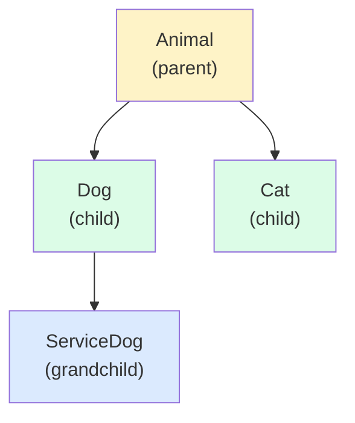

### 1.2 Formal Definition

> **Inheritance** is a mechanism by which a class (the subclass) derives attributes and methods from another class (the superclass), establishing an **"is-a"** relationship and enabling code reuse and polymorphic substitution.

### 1.3 The "Is-A" Test

Before you write `class B(A):`, ask: *is every `B` also an `A`?*

- ✅ `Dog` is an `Animal`
- ✅ `SavingsAccount` is a `BankAccount`
- ❌ `Engine` is *not* a `Car` — that's "has-a" → use **composition** instead (see [[four-pillars-summary]] and `04-advanced` for composition-over-inheritance)

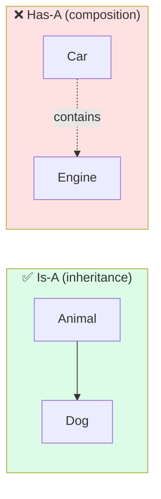

---

## 2. Types of Inheritance

Python supports **five** structural flavors of inheritance. The names matter less than the *shape*, but the terminology is universal.

### 2.1 Single Inheritance

One child, one parent. The simplest case.

```python
class Animal:
    def __init__(self, name: str) -> None:
        self.name = name

    def speak(self) -> str:
        return f"{self.name} makes a sound"


class Dog(Animal):
    def speak(self) -> str:                    # override
        return f"{self.name} says Woof"


d = Dog("Rex")
print(d.speak())   # Rex says Woof
print(d.name)      # inherited attribute
```

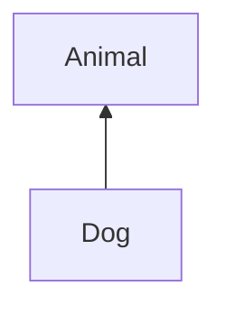

### 2.2 Multiple Inheritance

One child, two or more parents — simultaneously. Python supports this natively (unlike Java for classes). It is powerful and dangerous.

```python
class Flyer:
    def fly(self) -> str: return "flying"

class Swimmer:
    def swim(self) -> str: return "swimming"

class Duck(Flyer, Swimmer):
    def quack(self) -> str: return "quack"

d = Duck()
print(d.fly(), d.swim(), d.quack())   # flying swimming quack
```

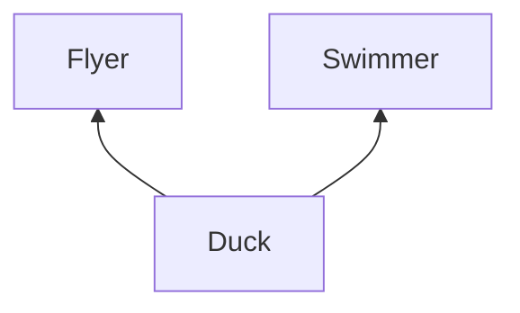

> [!warning] Multiple inheritance is a sharp tool
> Use it sparingly. Most "diamond" problems arise here. Python solves them with **MRO** — keep reading.

### 2.3 Multilevel Inheritance

A → B → C (a chain). Each level specializes the previous.

```python
class Vehicle:
    def move(self) -> str: return "moving"

class LandVehicle(Vehicle):
    def wheels(self) -> int: return 4

class Car(LandVehicle):
    def honk(self) -> str: return "beep"

c = Car()
print(c.move(), c.wheels(), c.honk())   # moving 4 beep
```

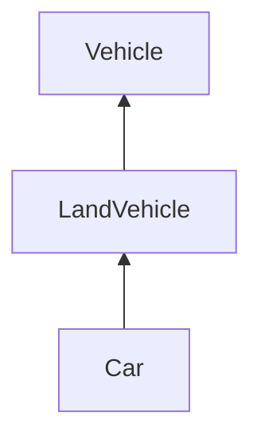

### 2.4 Hierarchical Inheritance

One parent, multiple siblings.

```python
class Shape:
    def describe(self) -> str:
        return f"I am a {type(self).__name__}"

class Circle(Shape): ...
class Square(Shape): ...
class Triangle(Shape): ...
```

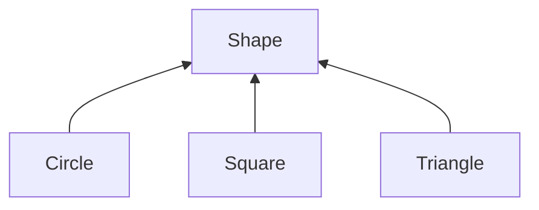

### 2.5 Hybrid Inheritance

Any combination of the above — typically multiple + multilevel. This is where the **diamond problem** lives.

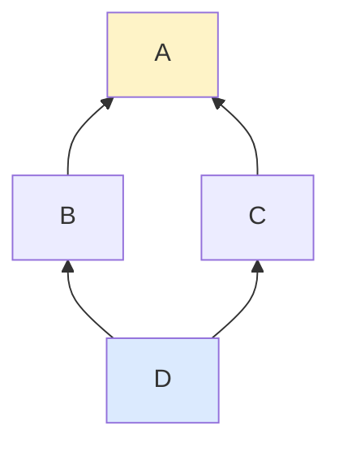

Here `D` inherits from `B` and `C`, both of which inherit from `A`. If `A` has a method `foo()`, which `foo()` does `D` get — `B`'s? `C`'s? `A`'s? This ambiguity is the **diamond problem**, and Python resolves it with **MRO** (next section).

---

## 3. Method Resolution Order (MRO) and C3 Linearization

> [!tip] The crown jewel of Python's inheritance design
> Python's MRO algorithm is one of the most elegant pieces of language engineering you'll ever meet. Understanding it deeply pays dividends every time you write `super()`.

### 3.1 What Is MRO?

The **Method Resolution Order** is the **linear order** in which Python searches classes for a method or attribute. Every class has one; you can inspect it:

```python
>>> D.__mro__
(<class 'D'>, <class 'B'>, <class 'C'>, <class 'A'>, <class 'object'>)
```

When you call `D().foo()`, Python looks left-to-right along the MRO until it finds `foo`.

### 3.2 The C3 Linearization Algorithm

Before Python 2.3, MRO was *depth-first, left-to-right* — which produced surprising, sometimes inconsistent results in diamond hierarchies. Python 2.3 switched to **C3 linearization** (the same algorithm Dylan and PG's CLOS use), which guarantees:

1. **Consistency with the left-to-right order** of base classes.
2. **Local precedence** — if `B` precedes `C` in `D`'s bases, `B` precedes `C` in `D`'s MRO.
3. **Monotonicity** — if `X` precedes `Y` in `B`'s MRO, then `X` precedes `Y` in any subclass MRO that includes both.

Informally, C3 merges the MROs of the parent classes left-to-right, never violating the constraints above. If the constraints can't be satisfied, Python refuses to create the class (a "metaclass conflict" / "TypeError: Cannot create a consistent MRO").

### 3.3 The Diamond, Solved

```python
class A:
    def who(self) -> str: return "A"

class B(A):
    def who(self) -> str: return "B"

class C(A):
    def who(self) -> str: return "C"

class D(B, C):
    pass

print(D().who())                # B
print(D.__mro__)
# (<class 'D'>, <class 'B'>, <class 'C'>, <class 'A'>, <class 'object'>)
```

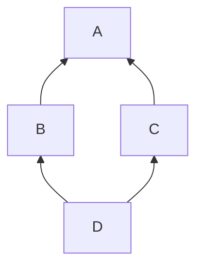

The MRO is `D → B → C → A → object`. Note that:

- `A` appears **only once**, and **after both** `B` and `C` (otherwise a base would precede its derived class — illegal).
- `B` precedes `C` because `B` was listed first in `class D(B, C)`.

### 3.4 When C3 Fails

```python
class X(A, B): ...
class Y(B, A): ...
class Z(X, Y): ...   # ❌ TypeError: Cannot create a consistent MRO
```

`X` says `A` before `B`; `Y` says `B` before `A`. `Z` inherits both — there is no consistent linearization. Python raises `TypeError` at class creation. This is a feature, not a bug: it tells you *at class-definition time* that your hierarchy is incoherent.

### 3.5 Inspecting MRO

Three equivalent ways:

```python
D.__mro__               # tuple of classes
D.mro()                 # list — same content, overridable hook
import inspect
inspect.getmro(D)       # tuple
```

> [!example] Mental model
> When in doubt, **print `__mro__`**. It will tell you exactly which order methods are searched in. Most inheritance mysteries resolve instantly.

---

## 4. `super()` Deep Dive — Cooperative Multiple Inheritance

### 4.1 The Two Faces of `super()`

`super()` does **two** things, and conflating them causes endless confusion:

1. **In a single-inheritance override:** call the parent's version of the method (the common, beginner usage).
2. **In a multiple-inheritance hierarchy:** call the *next class in the MRO*, **not necessarily the parent**. This is what makes cooperative multiple inheritance work.

### 4.2 `super()` in `__init__`

```python
class Base:
    def __init__(self, x: int) -> None:
        print(f"Base.__init__({x})")
        self.x = x

class Mid(Base):
    def __init__(self, x: int, y: int) -> None:
        print(f"Mid.__init__({x}, {y})")
        super().__init__(x)              # forwards to Base
        self.y = y

class Leaf(Mid):
    def __init__(self, x: int, y: int, z: int) -> None:
        print(f"Leaf.__init__({x}, {y}, {z})")
        super().__init__(x, y)           # forwards to Mid
        self.z = z

Leaf(1, 2, 3)
# Leaf.__init__(1, 2, 3)
# Mid.__init__(1, 2)
# Base.__init__(1)
```

### 4.3 `super()` in the Diamond — Cooperative Calls

The real magic of `super()` shows in diamonds. **Every** class in the hierarchy calls `super()`, and `super()` dispatches to the *next class in the MRO*, not a fixed parent. Each class passes along a uniform argument protocol, so all of them get called exactly once, in MRO order.

```python
class A:
    def __init__(self, **kwargs) -> None:
        print("A.__init__")
        self.a = kwargs.get("a", "default-a")

class B(A):
    def __init__(self, **kwargs) -> None:
        print("B.__init__")
        self.b = kwargs.get("b", "default-b")
        super().__init__(**kwargs)        # next in MRO = C

class C(A):
    def __init__(self, **kwargs) -> None:
        print("C.__init__")
        self.c = kwargs.get("c", "default-c")
        super().__init__(**kwargs)        # next in MRO = A

class D(B, C):
    def __init__(self, **kwargs) -> None:
        print("D.__init__")
        super().__init__(**kwargs)        # next in MRO = B

d = D(a="A!", b="B!", c="C!")
# D.__init__
# B.__init__
# C.__init__
# A.__init__          ← called ONCE, despite two paths to it
print(d.a, d.b, d.c)   # A! B! C!
print(D.__mro__)
# D → B → C → A → object
```

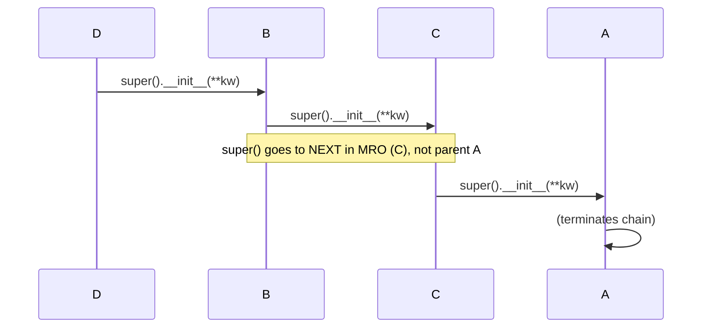

> [!tip] The Cooperative Rule
> For `super()` to work across a diamond, **every** class in the chain must:
> 1. Call `super().method(...)` (even `A` at the top — it just calls `object`'s version).
> 2. Accept and forward `**kwargs` so each layer can pull out what it needs and pass the rest along.
>
> This is called **cooperative multiple inheritance**. Miss it in one class and the whole chain breaks.

### 4.4 `super()` With Explicit Arguments (Python 2 style, rarely needed now)

```python
# Modern Python (3+) — preferred
super().__init__(x)

# Old / explicit form
super(Leaf, self).__init__(x)
```

The explicit form is occasionally useful in metaprogramming or when you want to skip ahead in the MRO deliberately — but it's a code smell in normal code.

### 4.5 `super()` Outside `__init__`

`super()` works on any method, not just `__init__`. Common pattern: **extend** a parent method rather than replace it.

```python
class Base:
    def greet(self) -> str:
        return "hello"

class Polite(Base):
    def greet(self) -> str:
        parent = super().greet()         # get parent's version
        return parent.capitalize() + ", sir"

Polite().greet()   # "Hello, sir"
```

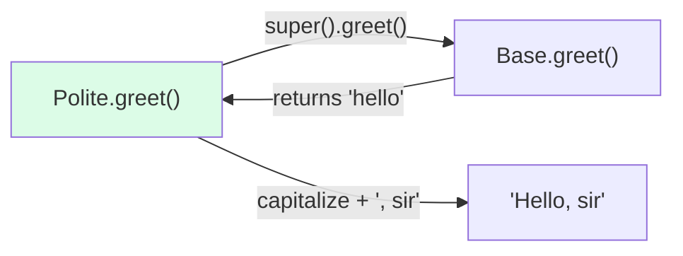

---

## 5. Overriding and Extending Parent Behavior

### 5.1 Override (Replace)

```python
class Animal:
    def sound(self) -> str: return "..."

class Cat(Animal):
    def sound(self) -> str: return "meow"   # full replace
```

### 5.2 Extend (Prepend / Append)

```python
class Animal:
    def speak(self) -> str: return "sound"

class LoudDog(Animal):
    def speak(self) -> str:
        original = super().speak()
        return original.upper() + "!!!"     # augment

print(LoudDog().speak())   # SOUND!!!
```

### 5.3 Constrain (Precondition Check Then Defer)

```python
class Account:
    def withdraw(self, amount: float) -> None:
        # base: assume any positive amount is fine
        if amount <= 0: raise ValueError("positive only")
        print(f"withdrew {amount}")

class CappedAccount(Account):
    def withdraw(self, amount: float) -> None:
        if amount > 1000:
            raise ValueError("over the cap")
        super().withdraw(amount)            # delegate after our check

CappedAccount().withdraw(50)    # withdrew 50
# CappedAccount().withdraw(2000)  # ValueError ✅
```

### 5.4 Customize Output via `super().__repr__`

```python
class Point:
    def __init__(self, x: float, y: float) -> None:
        self.x, self.y = x, y
    def __repr__(self) -> str:
        return f"Point({self.x}, {self.y})"

class ColoredPoint(Point):
    def __init__(self, x: float, y: float, color: str) -> None:
        super().__init__(x, y)
        self.color = color
    def __repr__(self) -> str:
        base = super().__repr__()
        return f"{base[:-1]}, color={self.color!r})"

ColoredPoint(1, 2, "red")   # Point(1, 2, color='red')
```

---

## 6. Worked Examples

### 6.1 Example: Animal → Dog → Cat Hierarchy

A complete, idiomatic single-inheritance example with `super()`.

```python
from dataclasses import dataclass, field


@dataclass
class Animal:
    name: str
    age: int

    def __post_init__(self) -> None:
        if self.age < 0:
            raise ValueError("age must be non-negative")

    def describe(self) -> str:
        return f"{self.name}, {self.age}y, species={self.species()}"

    def species(self) -> str:
        return "unknown"

    def sound(self) -> str:
        return "..."


@dataclass
class Dog(Animal):
    breed: str = "unknown"

    def species(self) -> str:
        return "dog"

    def sound(self) -> str:
        return "Woof"

    def fetch(self) -> str:                  # dog-only behavior
        return f"{self.name} fetches the ball"


@dataclass
class Cat(Animal):
    indoor: bool = True

    def species(self) -> str:
        return "cat"

    def sound(self) -> str:
        return "Meow"

    def purr(self) -> str:
        return f"{self.name} purrs"


pets: list[Animal] = [Dog("Rex", 5, "lab"), Cat("Whiskers", 3, indoor=False)]
for p in pets:
    print(p.describe(), "|", p.sound())
# Rex, 5y, species=dog | Woof
# Whiskers, 3y, species=cat | Meow
```

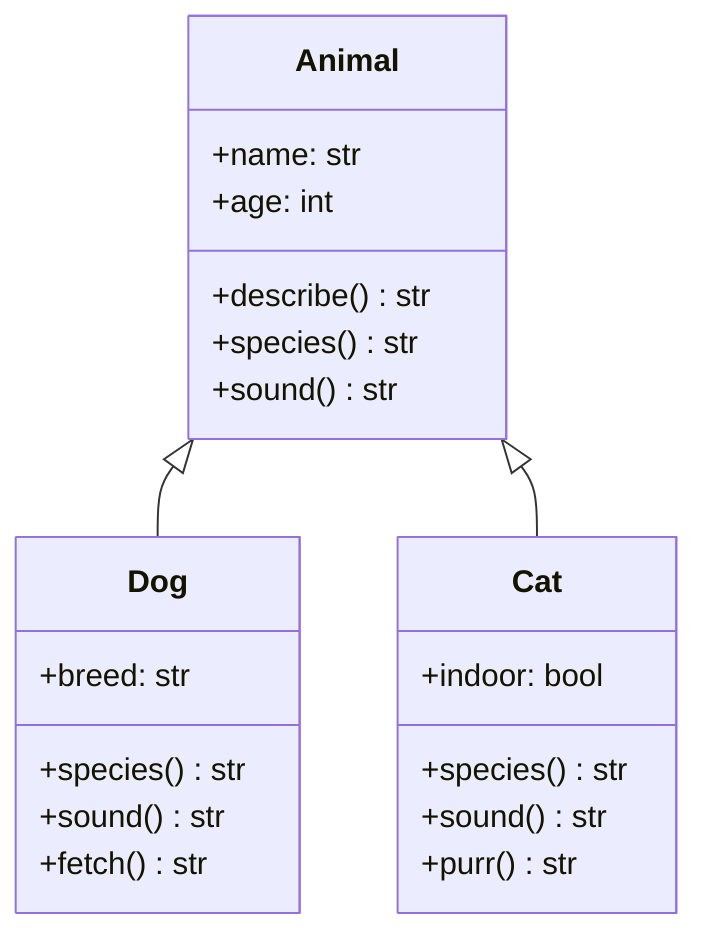

### 6.2 Example: Employee Hierarchy with `super().__init__`

A common business case: shared attributes plus role-specific attributes.

```python
from decimal import Decimal
from dataclasses import dataclass


@dataclass
class Employee:
    name: str
    base_salary: Decimal

    def __post_init__(self) -> None:
        if self.base_salary < 0:
            raise ValueError("salary must be non-negative")

    def annual_pay(self) -> Decimal:
        return self.base_salary

    def role(self) -> str:
        return "employee"


@dataclass
class Manager(Employee):
    reports: int = 0
    bonus: Decimal = Decimal("0")

    def __post_init__(self) -> None:
        super().__post_init__()              # reuse parent validation
        if self.reports < 0:
            raise ValueError("reports must be non-negative")

    def annual_pay(self) -> Decimal:
        base = super().annual_pay()          # parent's pay
        per_report = Decimal("100")
        return base + self.bonus + per_report * self.reports

    def role(self) -> str:
        return "manager"


@dataclass
class Engineer(Employee):
    specialty: str = "general"

    def annual_pay(self) -> Decimal:
        # Engineers get a 10% skill premium on top of base
        return super().annual_pay() * Decimal("1.10")

    def role(self) -> str:
        return f"engineer ({self.specialty})"


team: list[Employee] = [
    Manager("Ada", Decimal("120000"), reports=4, bonus=Decimal("15000")),
    Engineer("Alan", Decimal("90000"), specialty="ML"),
    Employee("Anonymous", Decimal("50000")),
]
for e in team:
    print(f"{e.role():20} → {e.annual_pay():>10}")
# manager              →   139400
# engineer (ML)        →     99000
# employee             →     50000
```

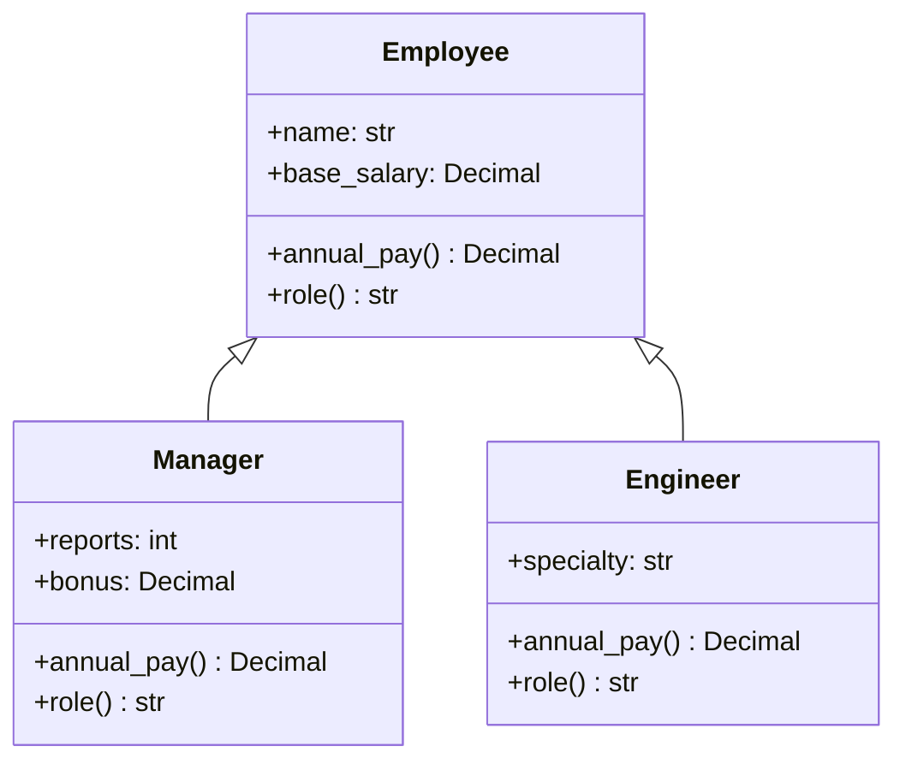

### 6.3 Example: The Diamond Problem, Solved Cooperatively

A canonical illustration of MRO + cooperative `super()`.

```python
class Base:
    def process(self, data: str) -> str:
        print(f"  [Base] received {data!r}")
        return data

class A(Base):
    def process(self, data: str) -> str:
        print(f"  [A] before super: {data!r}")
        data = super().process(data + "-A")       # forward in MRO
        print(f"  [A] after super: {data!r}")
        return data

class B(Base):
    def process(self, data: str) -> str:
        print(f"  [B] before super: {data!r}")
        data = super().process(data + "-B")
        print(f"  [B] after super: {data!r}")
        return data

class C(A, B):                                     # diamond
    def process(self, data: str) -> str:
        print(f"  [C] before super: {data!r}")
        data = super().process(data + "-C")
        print(f"  [C] after super: {data!r}")
        return data

print("MRO:", [c.__name__ for c in C.__mro__])
# MRO: ['C', 'A', 'B', 'Base', 'object']

print("Result:", C().process("start"))
#   [C] before super: 'start'
#   [A] before super: 'start-C'
#   [B] before super: 'start-C-A'
#   [Base] received 'start-C-A-B'
#   [B] after super: 'start-C-A-B'
#   [A] after super: 'start-C-A-B'
#   [C] after super: 'start-C-A-B'
# Result: start-C-A-B
```

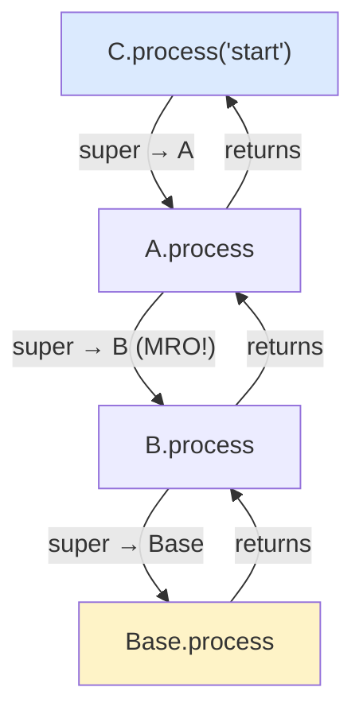

> [!example] The key insight
> `A.process`'s call to `super().process(...)` does **not** go to `Base` — it goes to `B`, because `B` is *next in C's MRO* after `A`. Without this rule, `Base` would be called twice (once via `A`, once via `B`), duplicating side effects. Cooperative `super()` is the cure.

---

## 7. Mermaid Class Diagrams for Each Inheritance Type

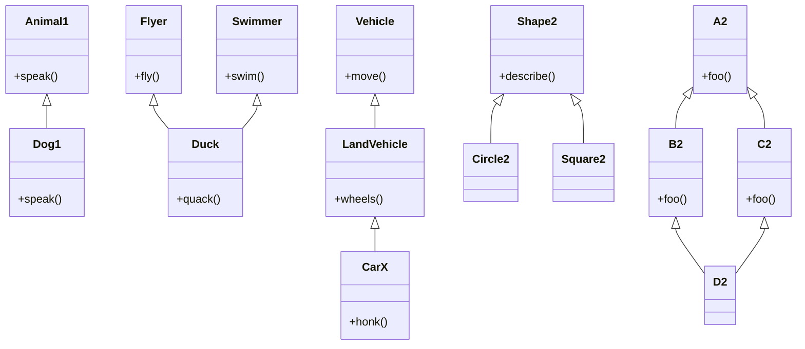

---

## 8. Pitfalls and Anti-Patterns

> [!danger] Inheritance is the most abused pillar

### 8.1 Deep Inheritance Trees

Each level adds coupling. Three levels deep is usually the limit before reasoning about "where does this method actually come from?" becomes painful.

```python
# ❌ Don't do this
class Shape: ...
class Polygon(Shape): ...
class Quadrilateral(Polygon): ...
class Parallelogram(Quadrilateral): ...
class Rectangle(Parallelogram): ...
class Square(Rectangle): ...
```

Six levels to express "a square." Use composition or flatter hierarchies.

### 8.2 The Fragile Base Class Problem

A change in a base class can break subclasses in non-obvious ways, because subclasses depend on parent internals.

```python
class Counter:
    def __init__(self) -> None:
        self._count = 0
    def add_one(self) -> None:
        self._count += 1
    def add_many(self, n: int) -> None:
        for _ in range(n):
            self.add_one()              # calls overridden add_one in subclass!

class LoggingCounter(Counter):
    def add_one(self) -> None:
        print("incrementing")
        super().add_one()

# LoggingCounter().add_many(3)  → prints 3 times (probably wanted)
# But if Counter.add_many is rewritten as self._count += n for speed,
# LoggingCounter silently stops logging. Fragile!
```

> [!warning] Mitigations
> - Mark override-sensitive methods as such in the docstring.
> - Prefer composition for "uses" relationships.
> - Design base classes for inheritance (Joshua Bloch's advice) or forbid it (`@final`).

### 8.3 Liskov Substitution Violation (Teaser)

If `B` is a subclass of `A`, you must be able to use a `B` anywhere an `A` is expected **without surprises**. Classic violation: a `Square` subclass of `Rectangle` whose `set_width` also changes height — code that sets width and reads height breaks. See [[four-pillars-summary]] and `04-advanced` (SOLID).

### 8.4 Using Inheritance for Code Reuse Alone

```python
# ❌ Bad: Stack "is-a" list just to reuse append/pop
class Stack(list):
    pass

# Better: Stack "has-a" list
class Stack:
    def __init__(self) -> None:
        self._items: list = []
    def push(self, x): self._items.append(x)
    def pop(self): return self._items.pop()
```

`Stack` inheriting from `list` exposes `insert`, `remove`, slicing, etc. — operations that violate the stack abstraction. **Inherit interfaces, not implementation, when the abstraction is narrow.**

### 8.5 Calling `super().__init__` with the Wrong Arguments

```python
class Bad(Animal):
    def __init__(self, name: str, age: int, trick: str) -> None:
        super().__init__(name, age, trick)   # ❌ Animal takes (name, age)
```

Always check the parent's signature. With cooperative multiple inheritance, prefer `**kwargs` forwarding.

### 8.6 Forgetting That `super()` Follows MRO, Not the Lexical Parent

```python
class A:
    def hi(self): print("A")

class B(A):
    def hi(self):
        super().hi()    # you might think "A" — but in a diamond, it's C
        print("B")

class C(A):
    def hi(self):
        super().hi()
        print("C")

class D(B, C):
    def hi(self):
        super().hi()
        print("D")

D().hi()    # A, C, B, D  — not A, B, D
```

> [!tip] When you see `super()`, ask "what's the MRO?"
> `super()` is *not* "call my parent"; it is "call the next class in *this instance's* MRO after *my class*." Different objects can have different MROs, so the same `super()` line can dispatch to different classes.

---

## 9. Inheritance and the Other Pillars

- **[[encapsulation]]** sets the visibility rules inheritance obeys: subclasses see `_protected` but not `__mangled` parent state.
- **[[abstraction]]** is often the *reason* for inheritance: subclasses fill in abstract methods (see ABCs in [[abstraction]]).
- **[[polymorphism]]** is the *payoff* of inheritance: a variable typed as the parent can dispatch to overridden child methods at runtime.

```mermaid
mindmap
  root((Inheritance))
    Definition
      is-a relationship
      code reuse + specialization
    Types
      Single
      Multiple
      Multilevel
      Hierarchical
      Hybrid / Diamond
    Mechanism
      MRO (C3 linearization)
      __mro__ inspection
      super() cooperative calls
    Patterns
      override
      extend (super + augment)
      Template Method
      Cooperative multiple inheritance
    Pitfalls
      deep trees
      fragile base class
      Liskov violation
      reuse-driven inheritance
```

---

## 10. Key Takeaways

1. **Inheritance expresses "is-a."** If `B` is-not-a `A`, don't inherit — compose.
2. **Five structural types:** single, multiple, multilevel, hierarchical, hybrid. Most real code uses single + occasional multiple.
3. **MRO + C3 linearization** is how Python resolves diamonds. Inspect it with `D.__mro__` whenever behavior surprises you.
4. **`super()` calls the next class in the MRO, not necessarily the parent.** This is the foundation of cooperative multiple inheritance.
5. **Cooperative multiple inheritance requires every class to call `super()` and forward `**kwargs`.** Break the rule in one class and the whole chain breaks.
6. **Override to specialize, extend to augment, constrain to add preconditions.** All three delegate via `super()`.
7. **Inheritance is a sharp tool.** Prefer composition for "has-a"; prefer shallow hierarchies; design base classes for inheritance or mark them `@final`.
8. **Watch for Liskov violations** — if a subclass breaks a parent's contract, polymorphism becomes a liability.

---

## 11. Practice Exercises

> [!example] Try these to lock in the concepts

### Easy
1. **Single inheritance.** Build `Appliance` with `turn_on()` / `turn_off()` and a `_running` flag. Subclass `WashingMachine` with a `wash_cycle()` method that requires the machine to be running.

2. **Inspect MRO.** Given:
   ```python
   class A: ...
   class B(A): ...
   class C(A): ...
   class D(B, C): ...
   ```
   Predict `D.__mro__` *before* running it. Then verify. Then make it fail by trying `class D(C, B)` *and* another class whose MRO conflicts.

### Medium
3. **Cooperative diamond.** Implement `A`, `B`, `C`, `D` where each `__init__` prints its name and calls `super().__init__(**kwargs)`. Pass `D(a=1, b=2, c=3, d=4)` and verify each class receives its own keyword. Show what happens if `C` forgets to call `super()`.

4. **Employee + bonus chain.** Extend the `Employee`/`Manager`/`Engineer` example from §6.2 with a `Director(Manager)` that adds `stock_options`. Compute `annual_pay` as `super().annual_pay() + stock_options_value`.

### Hard
5. **Mixin pattern.** Build `Jsonable` and `Yamlable` mixins (each defines a `to_json()` / `to_yaml()` using `__dict__`). Then `class Config(Jsonable, Yamlable): pass` and demonstrate both methods working. Print the MRO and explain why it works.

6. **Liskov demo.** Write a `Rectangle(width, height)` with setters, then a `Square(side)` that inherits from `Rectangle`. Write a function `area_of(r: Rectangle)` that sets width and height independently and asserts the area. Show how `Square` breaks the function. Refactor to composition and show the fix.

7. **Custom MRO.** Define six classes with a conflicting diamond (`class X(A, B)` and `class Y(B, A)` and `class Z(X, Y)`). Confirm Python raises a `TypeError`. Then *redesign* the hierarchy so it's consistent, and explain in a comment which inheritance link you removed and why.

---

Next: [[polymorphism]] — what inheritance is *for*.
