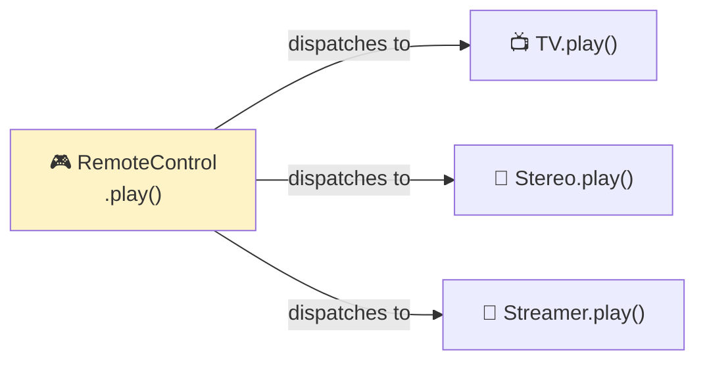
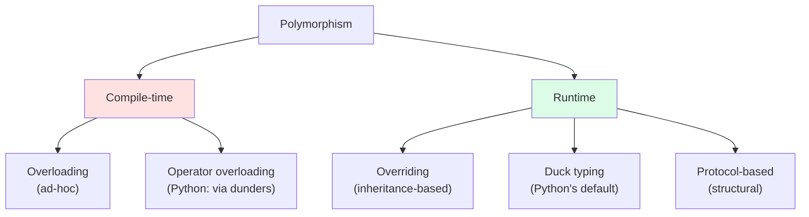
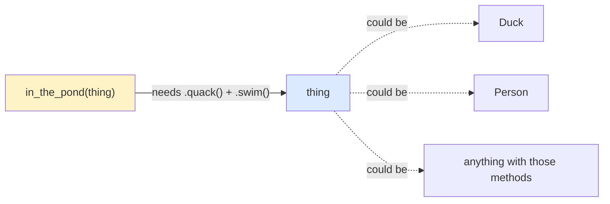
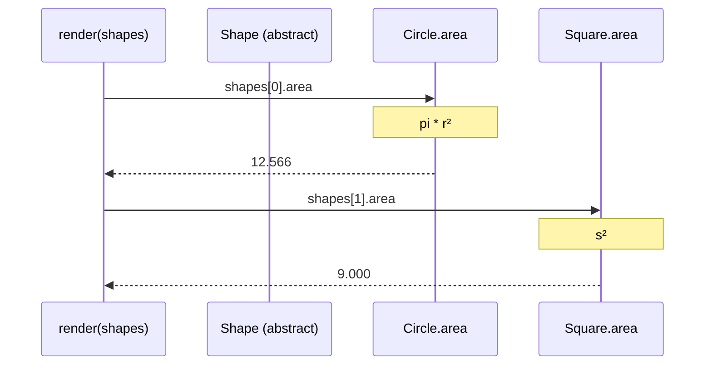
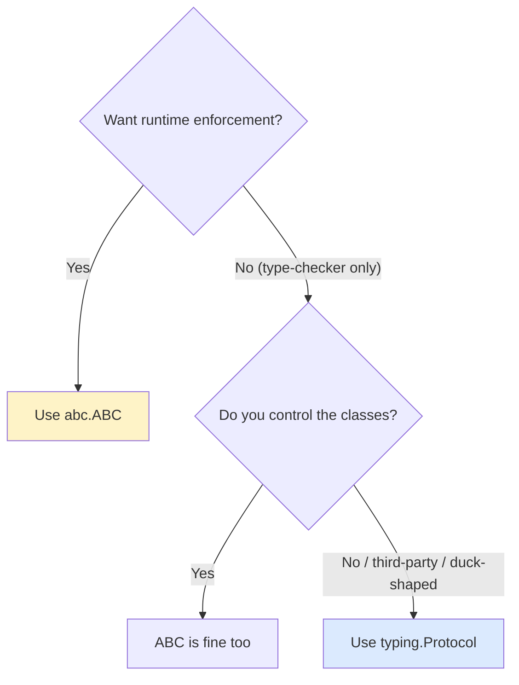
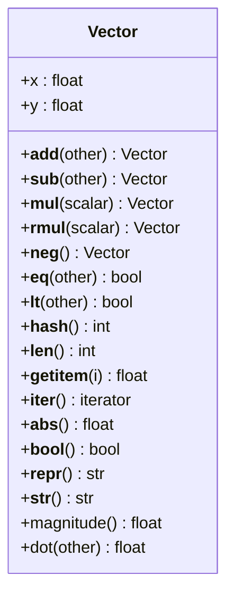
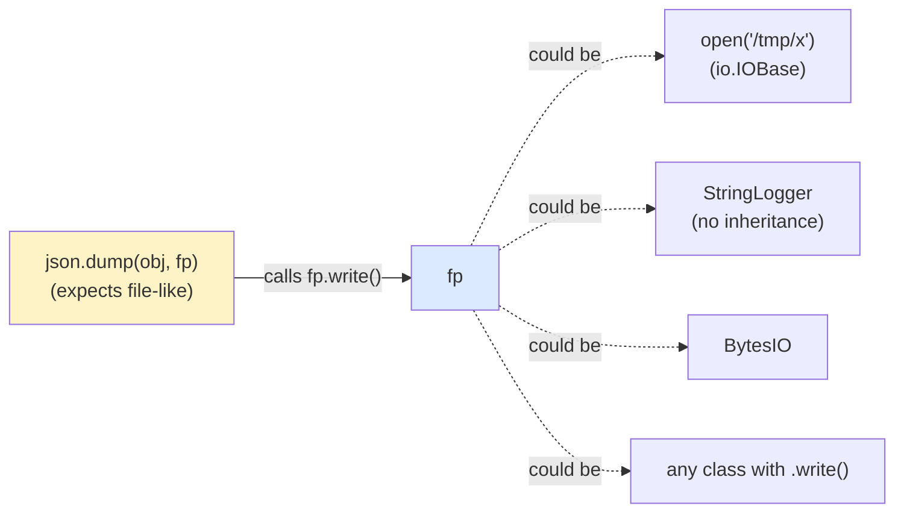
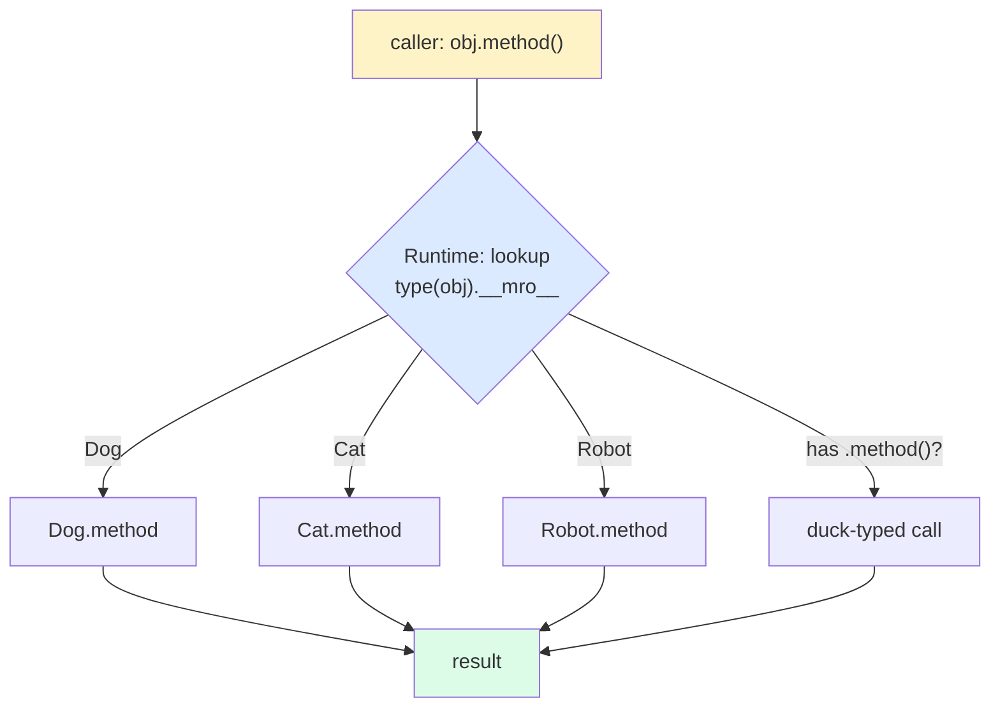
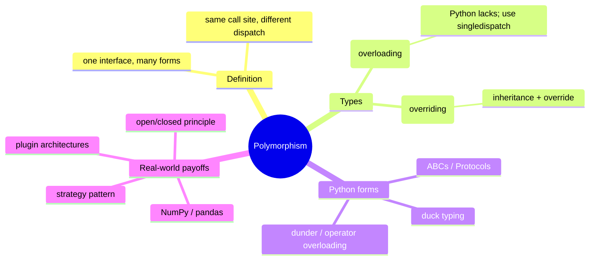

# Polymorphism — One Interface, Many Forms

> [!note] The Fourth Pillar
> **Polymorphism** (Greek: *poly* = many, *morph* = form) means that a single interface can take many concrete forms. The same call site dispatches to different behaviors depending on the runtime object.

Polymorphism is *why* the other three pillars exist. [[encapsulation]] protects state; [[abstraction]] defines contracts; [[inheritance]] reuses code — but it is **polymorphism** that lets you write `for x in things: x.draw()` and have each `x` draw itself correctly, without knowing or caring what kind of thing it is.

---

## 1. Definition and Intuition

### 1.1 The Intuition

A **remote control** has a single `play` button. It plays a TV show on the TV, a song on the stereo, or a video on the streaming box. Same button, different behavior depending on the device it points at. That's polymorphism.



The caller (`RemoteControl`) knows one **interface** (`play()`); the runtime picks the right **implementation**.

### 1.2 Formal Definition

> **Polymorphism** is the ability of different objects to respond to the same message (method call) in their own way, allowing a single call site to work uniformly across many types.

### 1.3 Why It Matters

Polymorphism is the engine of **open/closed** code: your code is *open for extension* (add a new type) but *closed for modification* (the calling code doesn't change).

```python
# This loop is open-closed: add a new Shape subclass tomorrow,
# and this code keeps working without edits.
def total_area(shapes: list) -> float:
    return sum(s.area for s in shapes)
```

---

## 2. Types of Polymorphism

The classical taxonomy distinguishes **compile-time** and **runtime** polymorphism. Python, being dynamically typed, leans almost entirely on runtime — but understanding both clarifies what Python does and doesn't have.



### 2.1 Compile-Time Polymorphism — Overloading (Python doesn't really have it)

In Java/C++, you can define multiple methods with the **same name** but different parameter types:

```java
// Java
int add(int a, int b);
double add(double a, double b);
String add(String a, String b);
```

The *compiler* picks the right one at the call site. This is **ad-hoc polymorphism**, and **Python has no compile-time overloading** — a function name refers to exactly one function object per namespace, so the second definition simply shadows the first.

```python
# ❌ In Python, the second def replaces the first; no overloading
def add(a: int, b: int) -> int: return a + b
def add(a: str, b: str) -> str: return a + b

add(1, 2)        # TypeError: can only concatenate str, not int
```

#### Python's idiomatic equivalents

- **Default arguments / keyword arguments** for the common case.
- **`functools.singledispatch`** for type-based dispatch (the closest Python comes to overloading).
- **`typing.overload`** for *type-checker-only* overloads (no runtime effect).
- **`@property` + setters** for "same name, different role."

```python
from functools import singledispatch

@singledispatch
def to_json(obj) -> str:
    raise TypeError(f"unsupported: {type(obj)}")

@to_json.register
def _(obj: int) -> str:   return str(obj)
@to_json.register
def _(obj: str) -> str:   return f'"{obj}"'
@to_json.register
def _(obj: list) -> str:  return "[" + ", ".join(to_json(x) for x in obj) + "]"

print(to_json(42))               # 42
print(to_json("hi"))             # "hi"
print(to_json([1, "a", [2]]))    # [1, "a", [2]]
```

> [!tip] `singledispatch` is real ad-hoc polymorphism
> It dispatches on the runtime type of the *first* argument, mimicking method overloading. Use it when a function needs different behavior per type but you can't (or don't want to) add methods to those types.

### 2.2 Runtime Polymorphism — Overriding

The classic OOP form: a child class overrides a parent's method, and the runtime dispatches based on the actual object's type.

```python
class Animal:
    def sound(self) -> str: return "..."

class Dog(Animal):
    def sound(self) -> str: return "Woof"

class Cat(Animal):
    def sound(self) -> str: return "Meow"

def make_sound(a: Animal) -> str:
    return a.sound()           # runtime picks Dog.sound or Cat.sound

print(make_sound(Dog()))   # Woof
print(make_sound(Cat()))   # Meow
```

This is what most people mean by "polymorphism" in a textbook.

---

## 3. Duck Typing in Python

> [!quote] "If it walks like a duck and quacks like a duck, it must be a duck."
> — Python community proverb

### 3.1 The Idea

Python's runtime doesn't care what an object **is** (its class), only what it **does** (its methods/attributes). Any object with the right method can be passed to any function that uses that method — *no inheritance required*.

```python
class Duck:
    def quack(self) -> str: return "Quack!"
    def swim(self) -> str:  return "paddling"

class Person:
    def quack(self) -> str: return "I'm pretending to be a duck!"
    def swim(self) -> str:  return "doing the breaststroke"

def in_the_pond(thing) -> None:
    # No type check, no isinstance, no inheritance.
    # If thing.quack() and thing.swim() work, we're good.
    print(thing.quack(), "/", thing.swim())

in_the_pond(Duck())    # Quack! / paddling
in_the_pond(Person())  # I'm pretending to be a duck! / doing the breaststroke
```



### 3.2 Why Duck Typing Is Polymorphism (Without Inheritance)

`in_the_pond` is polymorphic — the same call site dispatches to different `quack`/`swim` implementations — but there is no `class Animal` base class anywhere. Python is **structurally** polymorphic by default.

### 3.3 Easier to Ask Forgiveness Than Permission (EAFP)

Duck typing pairs naturally with the Pythonic **try/except** style rather than `isinstance` checks:

```python
# ❌ Java-style — checks type before using
def loud_quack(thing) -> str:
    if isinstance(thing, Duck):
        return thing.quack().upper()
    raise TypeError("not a duck")

# ✅ Pythonic — try it, handle the failure
def loud_quack(thing) -> str:
    try:
        return thing.quack().upper()
    except AttributeError:
        raise TypeError(f"{type(thing).__name__} can't quack") from None
```

> [!tip] EAFP over LBYL
> **Look Before You Leap** (`if hasattr(...)`) is verbose and racy. **Easier to Ask Forgiveness than Permission** (`try`) is idiomatic Python: it's clearer, faster in the success path, and aligns with duck typing.

---

## 4. Polymorphism via Inheritance + Overriding

The classic, textbook form. Already shown in §2.2 — but let's extend it with a real shape example that links back to [[abstraction]] and [[inheritance]].

```python
from abc import ABC, abstractmethod
from math import pi


class Shape(ABC):
    @property
    @abstractmethod
    def area(self) -> float: ...

def render(shapes: list[Shape]) -> None:
    # Polymorphic: dispatches on the concrete type of each shape.
    for s in shapes:
        print(f"{type(s).__name__:10} → area={s.area:6.3f}")

class Circle(Shape):
    def __init__(self, r: float): self.r = r
    @property
    def area(self) -> float: return pi * self.r ** 2

class Square(Shape):
    def __init__(self, s: float): self.s = s
    @property
    def area(self) -> float: return self.s ** 2

render([Circle(2), Square(3), Circle(0.5)])
# Circle     → area=12.566
# Square     → area= 9.000
# Circle     → area= 0.785
```



The caller has **one** call site (`s.area`); three different concrete methods run. That's polymorphism in its purest form.

---

## 5. Polymorphism via Duck Typing (No Inheritance)

The same loop works **without any shared base class** as long as each object responds to `area`:

```python
class Disk:        # no Shape parent
    def __init__(self, r): self.r = r
    @property
    def area(self): return 3.14159 * self.r ** 2

class Window:      # totally unrelated
    def __init__(self, w, h): self.w, self.h = w, h
    @property
    def area(self): return self.w * self.h

def total_area(things) -> float:
    return sum(t.area for t in things)

print(total_area([Disk(2), Window(3, 4)]))   # 24.566...
```

The only thing the two classes share is the **shape** of their interface (a property called `area`). This is structural polymorphism — the same idea that `typing.Protocol` makes type-checkable (next section).

---

## 6. Polymorphism via Protocols and ABCs

### 6.1 Protocols — Structural, Type-Checked

`typing.Protocol` (PEP 544) lets you declare an interface that **any** class can satisfy by shape — no inheritance required. The runtime still uses duck typing; the **type checker** enforces the protocol.

```python
from typing import Protocol


class Drawable(Protocol):
    def draw(self) -> str: ...


def render(d: Drawable) -> None:
    print(d.draw())


class SVG:                      # no inheritance from Drawable
    def draw(self) -> str: return "<svg>...</svg>"

class Canvas:
    def draw(self) -> str: return "[canvas paints pixels]"

render(SVG())     # ✅ type-checker happy
render(Canvas())  # ✅ type-checker happy
```

### 6.2 ABCs — Nominal, Runtime-Enforced

If you want **runtime** enforcement (can't instantiate the abstract class), use `abc.ABC`:

```python
from abc import ABC, abstractmethod


class Serializable(ABC):
    @abstractmethod
    def to_dict(self) -> dict: ...

class User(Serializable):
    def __init__(self, name): self.name = name
    def to_dict(self) -> dict: return {"name": self.name}

# Serializable()    # ❌ TypeError — abstract
User("ada").to_dict()   # ✅
```

### 6.3 When to Use Which



See [[abstraction]] for the full ABC vs Protocol comparison.

---

## 7. Operator Overloading via Dunder Methods

Python's **operator overloading** is polymorphism by another name: the same operator (`+`, `==`, `len()`, `[]`...) dispatches to different methods depending on the operands' types.

### 7.1 The Big Dunder Cheat Sheet

| Operator / Function | Dunder method            | Example                       |
| ------------------- | ------------------------ | ----------------------------- |
| `+`                 | `__add__`                | `a + b`                       |
| `-`                 | `__sub__`                | `a - b`                       |
| `*`                 | `__mul__`                | `a * b`                       |
| `/`                 | `__truediv__`            | `a / b`                       |
| `==`                | `__eq__`                 | `a == b`                      |
| `<`                 | `__lt__`                 | `a < b`                       |
| `len(x)`            | `__len__`                | `len(a)`                      |
| `x[i]`              | `__getitem__`            | `a[0]`                        |
| `x[i] = v`          | `__setitem__`            | `a[0] = 5`                    |
| `in`                | `__contains__`           | `x in a`                      |
| `str(x)` / `print`  | `__str__`                | `print(a)`                    |
| `repr(x)`           | `__repr__`               | `repr(a)`                     |
| `bool(x)`           | `__bool__`               | `if a:`                       |
| `for x in obj`      | `__iter__` / `__next__`  | `for x in a:`                 |
| `with x:`           | `__enter__` / `__exit__` | `with a as y:`                |
| `hash(x)`           | `__hash__`               | `{a}` / `d[a]`                |
| `del x[i]`          | `__delitem__`            | `del a[0]`                    |

### 7.2 Reflected / Reverse Operators

If `a + b` fails (`a.__add__(b)` returns `NotImplemented`), Python tries `b.__radd__(a)`. This is how `1 + my_vector` works even though `int` knows nothing about `Vector`.

### 7.3 In-Place Operators

`+=` calls `__iadd__` if defined; otherwise falls back to `__add__` (creating a new object). For mutable types, prefer `__iadd__` for performance.

### 7.4 Worked Example: A `Vector` Class

```python
from __future__ import annotations
import math
from typing import Iterable


class Vector:
    """A 2D vector demonstrating operator overloading."""

    __slots__ = ("x", "y")   # saves memory, blocks new attrs

    def __init__(self, x: float, y: float) -> None:
        self.x = float(x)
        self.y = float(y)

    # --- arithmetic ----------------------------------------------------
    def __add__(self, other: Vector) -> Vector:
        if not isinstance(other, Vector):
            return NotImplemented   # let Python try other.__radd__
        return Vector(self.x + other.x, self.y + other.y)

    def __sub__(self, other: Vector) -> Vector:
        if not isinstance(other, Vector):
            return NotImplemented
        return Vector(self.x - other.x, self.y - other.y)

    def __mul__(self, scalar: float) -> Vector:
        if not isinstance(scalar, (int, float)):
            return NotImplemented
        return Vector(self.x * scalar, self.y * scalar)

    __rmul__ = __mul__   # 3 * v  →  v * 3

    def __neg__(self) -> Vector:
        return Vector(-self.x, -self.y)

    # --- comparison ----------------------------------------------------
    def __eq__(self, other: object) -> bool:
        if not isinstance(other, Vector):
            return NotImplemented
        return math.isclose(self.x, other.x) and math.isclose(self.y, other.y)

    def __hash__(self) -> int:
        return hash((round(self.x, 9), round(self.y, 9)))

    def __lt__(self, other: Vector) -> bool:
        return self.magnitude() < other.magnitude()

    # --- protocol participation ---------------------------------------
    def __len__(self) -> int:
        return 2     # 2D vector → "length" 2

    def __getitem__(self, index: int) -> float:
        return (self.x, self.y)[index]

    def __iter__(self):
        yield self.x
        yield self.y

    def __abs__(self) -> float:
        return self.magnitude()

    # --- string representations ---------------------------------------
    def __repr__(self) -> str:
        return f"Vector({self.x!r}, {self.y!r})"

    def __str__(self) -> str:
        return f"⟨{self.x}, {self.y}⟩"

    def __bool__(self) -> bool:
        return self.magnitude() > 0

    # --- helpers -------------------------------------------------------
    def magnitude(self) -> float:
        return math.hypot(self.x, self.y)

    def dot(self, other: Vector) -> float:
        return self.x * other.x + self.y * other.y
```

Using it:

```python
>>> v = Vector(3, 4)
>>> w = Vector(1, 2)
>>> v + w                  # Vector(4.0, 6.0)
>>> v - w                  # Vector(2.0, 2.0)
>>> 3 * v                  # Vector(9.0, 12.0)  ← __rmul__
>>> v * 3                  # Vector(9.0, 12.0)
>>> -v                     # Vector(-3.0, -4.0)
>>> abs(v)                 # 5.0  ← __abs__ → magnitude
>>> len(v)                 # 2
>>> list(v)                # [3.0, 4.0]  ← __iter__
>>> v[0]                   # 3.0  ← __getitem__
>>> v == Vector(3, 4)      # True  ← __eq__
>>> bool(v)                # True
>>> bool(Vector(0, 0))     # False
>>> repr(v)                # 'Vector(3.0, 4.0)'
>>> str(v)                 # '⟨3.0, 4.0⟩'
>>> sorted([v, w, Vector(0,0)])
# [Vector(0.0, 0.0), Vector(1.0, 2.0), Vector(3.0, 4.0)]   ← __lt__
```



> [!tip] Why this is polymorphism
> Because `Vector` now works in `len()`, `abs()`, `sorted()`, `list()`, `+`, `==`, `in` (via iteration), `if`-conditions — all of which are generic operations defined for *any* object that implements the relevant dunder. The same `len()` call site works on a `str`, a `list`, a `dict`, a `Vector`. Many forms, one interface.

> [!warning] `__eq__` and `__hash__` are a pair
> If you override `__eq__`, Python sets `__hash__` to `None` (making instances unhashable) *unless* you also define `__hash__`. Two objects that compare equal must have the same hash, or sets/dicts will misbehave silently.

### 7.5 Worked Example: A File-Like Object (Duck Typing a Protocol)

Anything with `read()`, `write()`, `close()` can be passed to APIs expecting a file. You don't need to inherit from `io.IOBase` — just implement the methods.

```python
class StringLogger:
    """A file-like object that writes to an in-memory string."""

    def __init__(self) -> None:
        self._buf: list[str] = []
        self.closed = False

    def write(self, s: str) -> int:
        if self.closed:
            raise ValueError("write to closed logger")
        self._buf.append(s)
        return len(s)

    def read(self) -> str:
        return "".join(self._buf)

    def close(self) -> None:
        self.closed = True

    # Make it usable as a context manager too
    def __enter__(self) -> "StringLogger":
        return self

    def __exit__(self, *exc) -> None:
        self.close()


# Many stdlib APIs accept "any file-like object" — this works without
# inheriting from anything:
import json
log = StringLogger()
json.dump({"hi": 1}, log)   # writes JSON to our in-memory logger
print(log.read())           # {"hi": 1}

# And context managers:
with StringLogger() as f:
    f.write("hello ")
    f.write("world")
    # f.read() would be available here
```



> [!example] The power is on the call site
> `json.dump` was written long before your `StringLogger` existed. Yet it works. This is polymorphism in action: **the caller is open for extension without modification**.

---

## 8. Polymorphic Dispatch — The Big Picture



Every method call in Python is a tiny dispatch: the interpreter looks up the method on the object's class (following the MRO), and invokes whatever it finds. Inheritance-based polymorphism, duck-typed polymorphism, and dunder-based operator polymorphism are all the **same mechanism** at different surfaces.

---

## 9. Real-World: Why Polymorphism Makes Code Open for Extension

### 9.1 The Plugin Architecture

```python
from abc import ABC, abstractmethod


class NotificationChannel(ABC):
    @abstractmethod
    def send(self, to: str, msg: str) -> bool: ...


def notify(channels: list[NotificationChannel], to: str, msg: str) -> None:
    # This loop is open for extension:
    # add a new channel (Push, Webhook, ...) without touching this code.
    for ch in channels:
        try:
            if ch.send(to, msg):
                return
        except Exception as e:
            print(f"channel {type(ch).__name__} failed: {e}")
```

### 9.2 The Strategy Pattern (Polymorphism in Disguise)

```python
class SortStrategy(ABC):
    @abstractmethod
    def sort(self, items: list) -> list: ...

class Quick(SortStrategy):
    def sort(self, items): return sorted(items)            # placeholder
class Reverse(SortStrategy):
    def sort(self, items): return sorted(items, reverse=True)
class ByLen(SortStrategy):
    def sort(self, items): return sorted(items, key=len)

class ListEditor:
    def __init__(self, strategy: SortStrategy): self._s = strategy
    def arrange(self, items): return self._s.sort(items)

# Swap strategy by passing a different polymorphic object:
ListEditor(Reverse()).arrange(["a","bb","ccc"])  # ['ccc', 'bb', 'a']
ListEditor(ByLen()).arrange(["a","bb","ccc"])    # ['a', 'bb', 'ccc']
```

### 9.3 NumPy / Pandas — Massive Polymorphism

When you write `df["x"] + df["y"]`, the `+` operator dispatches to `pandas.Series.__add__`, which broadcasts elementwise across thousands of rows. The *call site* (`a + b`) is identical to integer addition — polymorphism in action at industrial scale.

---

## 10. Common Mistakes and How to Avoid Them

> [!danger] Top polymorphism mistakes

### 10.1 Type-Checking Instead of Trusting the Interface

```python
# ❌ Anti-polymorphic — defeats duck typing
def area(x):
    if isinstance(x, Circle):   return pi * x.r ** 2
    if isinstance(x, Square):   return x.s ** 2
    raise TypeError("unsupported")
```

Every new shape requires editing `area`. Use polymorphism: give each class an `area` property and write `def area(x): return x.area`.

### 10.2 Forgetting `NotImplemented` (vs `NotImplementedError`)

- `return NotImplemented` (the *value*) tells Python to try the other operand's reflected operator.
- `raise NotImplementedError` (the *exception*) signals an abstract method that wasn't overridden.

They are unrelated despite the similar names.

```python
def __add__(self, other):
    if not isinstance(other, Vector):
        return NotImplemented       # ← value, not exception
    return Vector(self.x + other.x, self.y + other.y)
```

### 10.3 Breaking Substitution (Liskov Violation)

If `Ostrich(Animal).fly()` raises `NotImplementedError`, code expecting `Animal.fly()` to work is broken. Either don't put `fly` in `Animal`, or make `Ostrich.fly` a no-op / no-fly behavior, not a stub exception. See [[four-pillars-summary]] and `04-advanced` (SOLID/L).

### 10.4 Overloading Operators with Surprising Semantics

`Vector + Vector` should produce a `Vector`. If your `__add__` returns a `float`, or mutates `self` in place, callers will be confused. Operators should be **predictable**: pure, side-effect-free, return sensible types.

### 10.5 Forgetting to Make `__eq__`-Equal Objects Hash-Consistently

After defining `__eq__`, always define `__hash__` (or explicitly set it to `None` if instances are mutable and shouldn't be hashed). Otherwise sets/dicts break.

### 10.6 Over-Engineering with ABCs When Duck Typing Suffices

If you only need polymorphism and have no need to enforce instantiation or share code, an ABC is overkill. Use a `Protocol` for type-checking, or just let duck typing do its thing.

---

## 11. Polymorphism and the Other Pillars

- **[[encapsulation]]** keeps each polymorphic object's state correct, so dispatch lands on a valid object.
- **[[abstraction]]** defines the *interface* that polymorphism dispatches on — without a contract, "many forms" has no common shape to share.
- **[[inheritance]]** is one (popular) way to *obtain* polymorphism, by overriding parent methods — but Python's duck typing means inheritance is *optional*, not *required*.



---

## 12. Key Takeaways

1. **Polymorphism = same interface, many implementations.** It is the payoff of OOP.
2. **Python has no method overloading** in the Java/C++ sense. Use `singledispatch` or `**kwargs` instead.
3. **Duck typing is Python's default polymorphism.** No inheritance needed — just match the shape.
4. **Inheritance + overriding** gives runtime polymorphism with a shared contract (often via ABCs).
5. **Protocols** give duck typing *type-checker support* without forcing inheritance.
6. **Operator overloading via dunders** is polymorphism in disguise: `+`, `len()`, `[]`, `==` all dispatch to your methods.
7. **Return `NotImplemented`** (not the exception) to opt out of an operator and let Python try the reflected one.
8. **Polymorphism is what makes code open for extension** — the loop `for x in things: x.act()` never needs to change when you add a new type of `thing`.
9. **Don't `isinstance`-check; trust the interface.** If you find yourself writing cascading `isinstance` branches, you've missed a polymorphism opportunity.

---

## 13. Practice Exercises

> [!example] Try these to lock in the concepts

### Easy
1. **`make_sound()` zoo.** Write `Animal`, `Dog`, `Cat`, `Cow`, `Duck` classes each with a `sound()` method. Write `chorus(animals: list[Animal])` that prints all their sounds. Add a `Car` class that also has a `sound()` method (returning `"vroom"`) and verify `chorus` accepts it without changes — that's duck typing.

2. **Dunder warm-up.** Build a `Money` class (amount in `Decimal`, currency code) with `__add__`, `__eq__`, `__lt__`, `__repr__`. Make `Money(10,'USD') + Money(5,'USD')` work and `Money(10,'USD') < Money(20,'USD')` work. Raise on currency mismatch.

### Medium
3. **`Vector` extended.** Take the `Vector` class from §7.4 and add: `__matmul__` for matrix-like multiplication (`v @ w` → dot product), `__iter__` so it works in `for x in v`, and `__contains__` so `3.0 in v` checks membership. Add unit tests using `assert`.

4. **File-like class.** Build a `CsvWriter` that implements `write`, `flush`, `close` and a `__enter__`/`__exit__` pair. Verify it works with the `csv` module's writer: `csv.writer(CsvWriter()).writerow(...)`.

### Hard
5. **Polymorphic plugin system.** Define a `Encoder` ABC with `encode(self, data: bytes) -> bytes`. Implement `Base64Encoder`, `HexEncoder`, `Rot13Encoder`. Write a `Pipeline` class that takes a list of encoders and pipes data through all of them in sequence — purely via the abstract interface.

6. **`singledispatch` JSON.** Implement a `to_json` function using `functools.singledispatch` that handles `int`, `float`, `str`, `bool`, `None`, `list`, `dict`, `tuple`, and any `dataclass` (use `dataclasses.is_dataclass` and `dataclasses.asdict`). Register handlers for each.

7. **Liskov checker.** Write a class `Bird` with `fly()`, then `Penguin(Bird)` that *overrides* `fly()` to raise `NotImplementedError`. Write a function `release(birds: list[Bird])` that calls `.fly()` on each, and demonstrate how a `Penguin` in the list causes a runtime crash. Refactor: extract `FlyingBird` as a subclass of `Bird`, move `fly()` there, and let `Penguin` inherit only from `Bird` (no `fly`). Explain in comments why the refactor fixes the Liskov violation.

---

Back: [[inheritance]] · [[abstraction]] · [[encapsulation]]
See also: [[four-pillars-summary]] for the integrated view.
