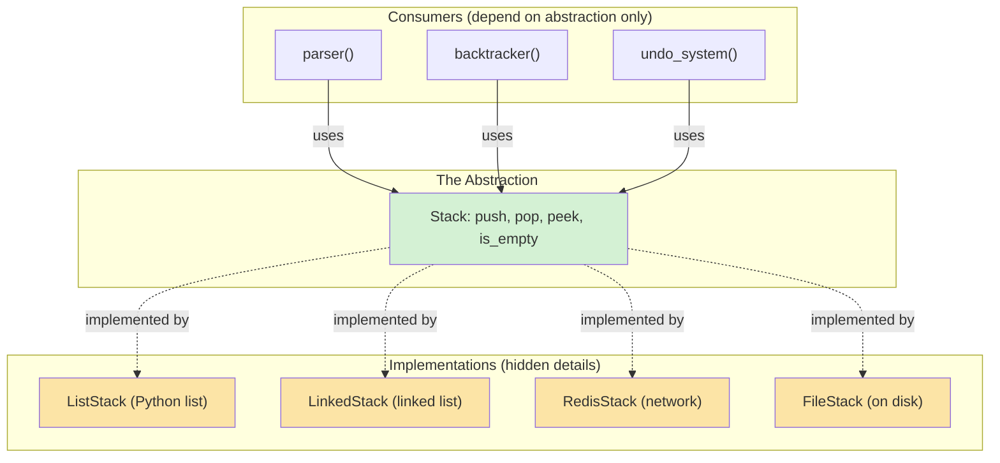
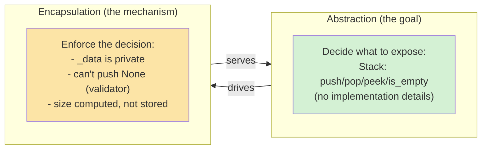
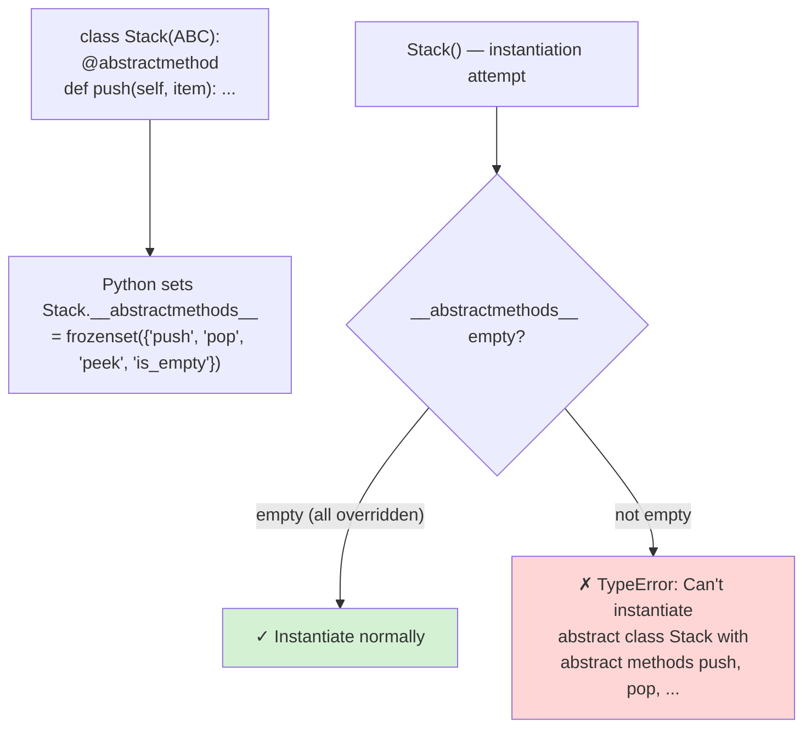
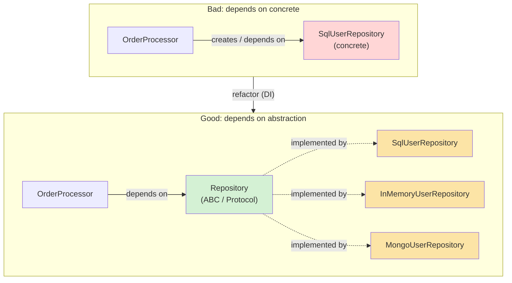
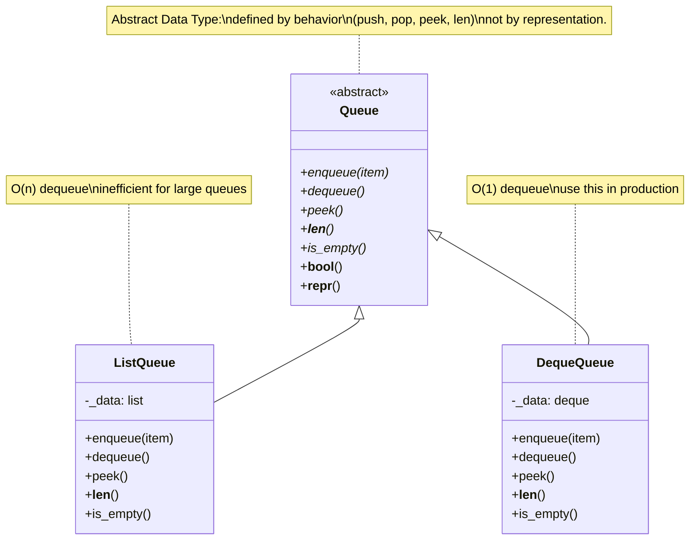
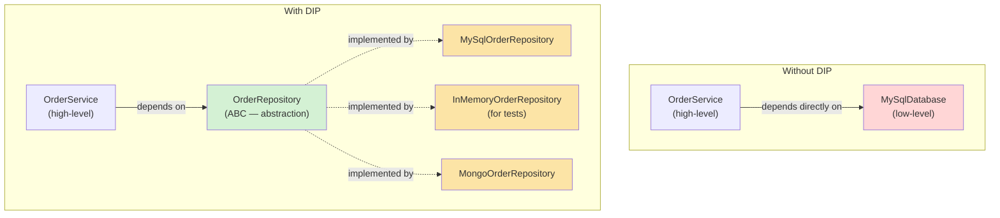
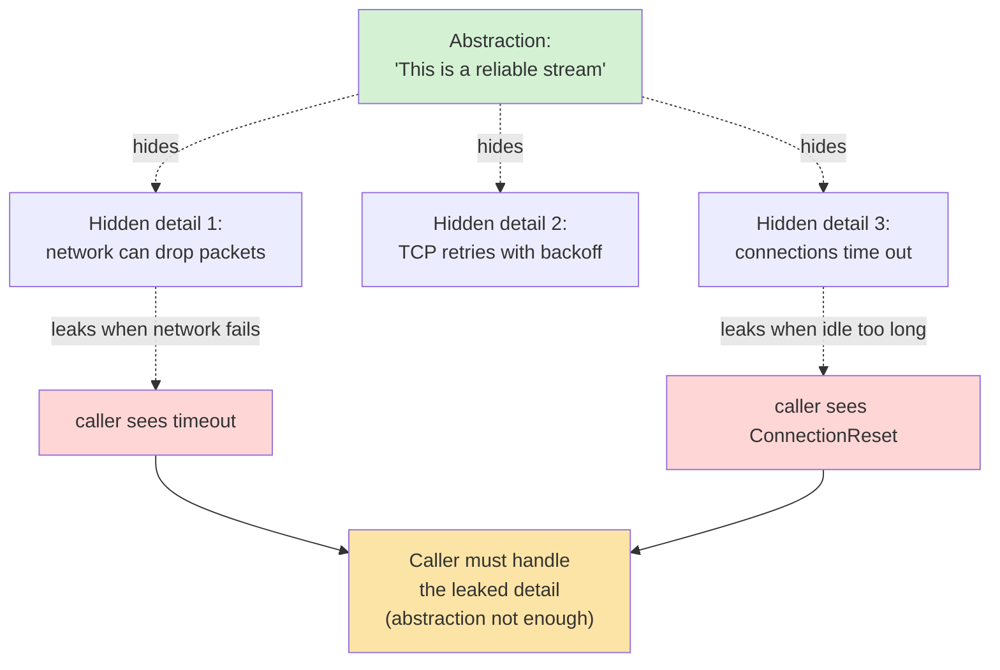
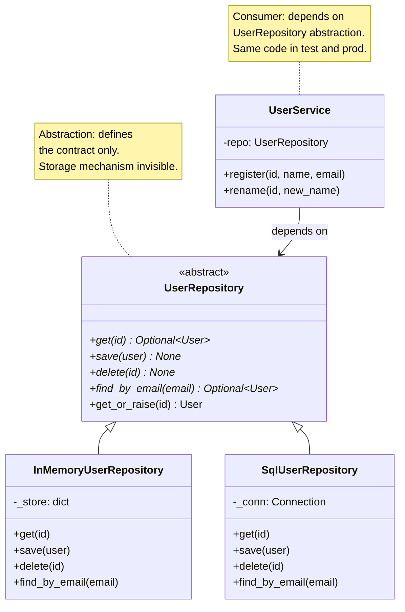
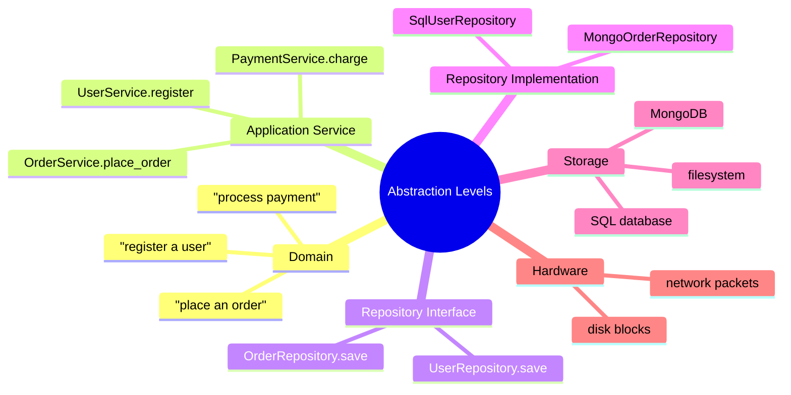

# Abstraction — The Fourth Pillar of OOP

#oop #four-pillars #abstraction #abc #interfaces #teaching #deep-dive

> [!quote] Joel Spolsky
> "All non-trivial abstractions, to some degree, are leaky."

Abstraction is the most *abstract* of the four pillars — appropriately enough. Where encapsulation is concrete (private fields, properties), inheritance is structural (class hierarchies, MRO), and polymorphism is behavioral (dispatch), abstraction is **conceptual**: it's the discipline of deciding *what* to expose and *what* to hide, of capturing the essential nature of a thing without coupling to its implementation.

This note is a deep dive: what abstraction is, how it differs from (and depends on) encapsulation, Python's mechanisms for it (ABCs, Protocols), how to design good abstractions, and how to recognize when abstraction goes wrong.

Prerequisite: [[Encapsulation]], [[Inheritance]], [[Polymorphism]].

---

## 1. What Is Abstraction?

Abstraction is the practice of **capturing the essential features of a thing while suppressing its non-essential details**. In OOP, this means designing a class (or interface) that exposes *what* an object does without specifying *how* it does it.

### 1.1 The Intuition

A `Stack` is an abstraction. It says: you can `push`, `pop`, `peek`, and check `is_empty`. It does *not* say whether the data lives in a list, a linked list, an array, or a database. The abstraction is the *contract* — the behavior — not the implementation.

```python
class Stack:
    def push(self, item): ...      # abstract behavior
    def pop(self): ...
    def peek(self): ...
    def is_empty(self) -> bool: ...
```

Three implementations might satisfy this contract:

```python
class ListStack(Stack):
    def __init__(self): self._data = []
    def push(self, item): self._data.append(item)
    def pop(self): return self._data.pop()
    # ...

class LinkedStack(Stack):
    def __init__(self): self._head = None
    # uses linked-list nodes
    # ...

class RedisStack(Stack):
    def __init__(self, key, conn): ...
    # uses LPUSH/RPOP on a Redis list
    # ...
```

Code that depends only on the `Stack` abstraction works with all three. *That* is the power of abstraction: decoupling the consumer from the producer's implementation choices.

### 1.2 Why Abstraction Matters

| Reason | What abstraction gives you |
|---|---|
| **Manage complexity** | Hide details so the mind can hold the whole system |
| **Enable change** | Swap implementations without touching callers |
| **Enable testing** | Substitute a fake implementation for tests |
| **Enable teamwork** | Teams agree on interfaces, work independently on implementations |
| **Focus on what, not how** | Reason at the level of the domain, not the mechanism |
| **Reduce coupling** | Depend on abstractions, not concrete classes (DIP — see §7) |



The abstraction (green) is the *only* thing consumers see. Implementations (yellow) can be swapped freely.

> [!info] Abstraction is older than OOP
> The idea is ancient in computer science. Abstract data types (ADTs) were formalized by Barbara Liskov in the 1970s (CLU language). Interfaces in Java, traits in Rust, typeclasses in Haskell, Protocols in Go, ABCs in Python — all are mechanisms for the same underlying idea: separate *what* from *how*. OOP didn't invent abstraction; it gave us a particularly ergonomic syntax for it.

---

## 2. Abstraction vs Encapsulation — CRITICAL Distinction

These two concepts are *constantly confused* because they're related and both deal with "hiding." But they answer different questions:

| | **Abstraction** | **Encapsulation** |
|---|---|---|
| Question | **What** to hide? | **How** to hide? |
| Concern | Interface design — what's the essential contract? | Implementation protection — what's private? |
| Mechanism | ABCs, interfaces, Protocols | Private fields, properties, access modifiers |
| Symbolic question | "What is the *essential nature* of this thing?" | "How do I keep callers from breaking my invariants?" |
| Failure mode if absent | Wrong concepts modeled; leaky abstractions | Internals leak; coupling to field names |
| Metaphor | The blueprint of a house | The walls of the house |

> [!quote] The one-liner
> **Encapsulation is the mechanism; abstraction is the goal.** Or: abstraction *decides* what to expose; encapsulation *enforces* that decision. They work together — abstraction without encapsulation is just a wish; encapsulation without abstraction is just walls around the wrong thing.



> [!danger] Common Student Misconception #1 — "Abstraction = abstract classes"
> No. Abstraction is a *concept* — the idea of separating essential interface from implementation. Abstract classes (ABCs in Python) are *one tool* for achieving abstraction. You can have abstraction without ABCs (e.g., a Protocol, a duck-typed interface, or even a well-documented plain class). You can also have an ABC without abstraction (a class marked `ABC` whose methods all expose implementation details). The concept is in the design; the keyword is just syntax.

> [!danger] Common Student Misconception #2 — "Abstraction and encapsulation are the same thing"
> They're related but different. Encapsulation is about *protection* (keeping callers out of internals). Abstraction is about *conceptual modeling* (deciding what the essential interface is). A class can be well-encapsulated but poorly abstracted (e.g., a class with private fields but a `do_everything()` method that violates SRP). Or well-abstracted but poorly encapsulated (e.g., a `Shape` ABC whose abstract methods leak implementation hints). Good OOP needs both.

---

## 3. Abstraction in Python

Python offers *four* mechanisms for abstraction, in increasing order of formality:

| Mechanism | Formality | Enforcement | Use Case |
|---|---|---|---|
| **Plain class + documentation** | Lowest | None | Small projects, internal code |
| **Duck typing (informal protocol)** | Low | None | Library code with many possible implementers |
| **`typing.Protocol`** | Medium | Type checker only | Modern Python (3.8+) type-checked code |
| **`abc.ABC` + `@abstractmethod`** | Highest | Runtime (instantiation blocked) | Libraries with strict contracts |

### 3.1 Plain Class — The Lightest Abstraction

A well-named class with a clear docstring *is* an abstraction, even without any `ABC` or `Protocol` machinery:

```python
class Stack:
    """A last-in, first-out container.

    Implementations should provide push, pop, peek, is_empty.
    """
    def push(self, item) -> None: raise NotImplementedError
    def pop(self): raise NotImplementedError
    def peek(self): raise NotImplementedError
    def is_empty(self) -> bool: raise NotImplementedError
```

This is the lightest form. It documents the contract. Subclasses that fail to implement a method get a `NotImplementedError` at *call* time (not at instantiation). For small, internal code, this is often enough.

### 3.2 ABC — Enforced Abstraction

```python
from abc import ABC, abstractmethod

class Stack(ABC):
    @abstractmethod
    def push(self, item) -> None: ...

    @abstractmethod
    def pop(self): ...

    @abstractmethod
    def peek(self): ...

    @abstractmethod
    def is_empty(self) -> bool: ...

    # Concrete methods can use the abstract ones
    def push_all(self, items):
        for item in items:
            self.push(item)         # calls subclass's push

    def __repr__(self):
        return f"{type(self).__name__}(empty={self.is_empty()})"
```

```python
# Stack()                   # TypeError: can't instantiate abstract class
class ListStack(Stack):
    def __init__(self): self._data = []
    def push(self, item): self._data.append(item)
    def pop(self): return self._data.pop()
    def peek(self): return self._data[-1]
    def is_empty(self): return not self._data

s = ListStack()
s.push_all([1, 2, 3])
print(s)                    # ListStack(empty=False)
print(s.pop())              # 3
```

Note the design pattern: **abstract methods define the contract; concrete methods use the contract**. `push_all` is concrete on `Stack` — it works for any subclass because it only calls abstract methods. This is the *Template Method pattern* in miniature (see [[Template-Method-Pattern]]).

### 3.3 The ABC Enforcement Flow



The mechanism: `ABCMeta` (the metaclass behind `ABC`) scans the class for methods marked with `@abstractmethod` and stores them in `__abstractmethods__`. When you try to instantiate, `object.__new__` checks: if `__abstractmethods__` is non-empty, raise `TypeError`. A subclass that overrides all the abstract methods has an empty `__abstractmethods__` (because its overrides aren't abstract) and can be instantiated.

```python
print(Stack.__abstractmethods__)
# frozenset({'push', 'pop', 'peek', 'is_empty'})
print(ListStack.__abstractmethods__)
# frozenset()  ← all overridden, can instantiate
```

> [!info] What counts as "overriding" an abstract method?
> Any method with the same name defined in a subclass — even if it's still marked `@abstractmethod` *but* you also called `super().method()`. The check is purely "is this method in `__abstractmethods__`?" Subclasses can *add* their own abstract methods too, making the subclass itself uninstantiable until *its* subclasses override those.

### 3.4 Abstract Properties, Classmethods, Staticmethods

```python
from abc import ABC, abstractmethod

class Plugin(ABC):
    @property
    @abstractmethod
    def name(self) -> str:
        """Each plugin must expose its name."""

    @property
    @abstractmethod
    def version(self) -> tuple[int, int]:
        """Major, minor version tuple."""

    @classmethod
    @abstractmethod
    def from_config(cls, config: dict) -> "Plugin":
        """Construct a plugin from a config dict."""

    @staticmethod
    @abstractmethod
    def default_config() -> dict:
        """Return the default config for this plugin."""

# Plugin()       # TypeError: abstract methods name, version, from_config, default_config
class MyPlugin(Plugin):
    name = "MyPlugin"                     # override abstract property with class attr
    version = (1, 0)
    @classmethod
    def from_config(cls, config): return cls()
    @staticmethod
    def default_config(): return {"enabled": True}

p = MyPlugin.from_config(MyPlugin.default_config())
print(p.name, p.version)   # MyPlugin (1, 0)
```

> [!warning] Decorator order matters
> `@abstractmethod` must be the **innermost** decorator — applied directly to the function, *before* `@property`, `@classmethod`, or `@staticmethod`. The order `@abstractmethod` → `@property` (abstractmethod outside) is wrong; `@property` → `@abstractmethod` (abstractmethod inside, closest to `def`) is correct. This trips up many beginners.

### 3.5 `typing.Protocol` — Structural Abstraction

`Protocol` (PEP 544, Python 3.8+) is *duck typing for the type checker*. A Protocol describes a shape; any class with matching methods is considered a subtype, *without* inheritance.

```python
from typing import Protocol, runtime_checkable

@runtime_checkable
class Drawable(Protocol):
    def draw(self, canvas: object) -> None: ...

class Circle:
    def draw(self, canvas): ...      # no inheritance from Drawable

class TextBox:
    def draw(self, canvas): ...

def render_all(items: list[Drawable]) -> None:
    for item in items:
        item.draw(canvas=None)

render_all([Circle(), TextBox()])   # mypy accepts this — both have draw
print(isinstance(Circle(), Drawable))   # True (because @runtime_checkable)
```

| | ABC | Protocol |
|---|---|---|
| Relationship | Nominal (must inherit) | Structural (just match) |
| Runtime enforcement | Yes (can't instantiate ABC) | No (except `isinstance` with `@runtime_checkable`) |
| Type checker enforcement | Yes | Yes |
| Subclass must declare | Yes (`class X(Stack)`) | No |
| Good for | Strict library contracts | Loose application interfaces |
| Adds to MRO | Yes | No |

> [!tip] Teaching Tip #1 — Use ABCs for *your* contracts, Protocols for *others'* types
> Rule of thumb:
> - Define an **ABC** when you control the type hierarchy and want to enforce that subclasses implement specific methods.
> - Define a **Protocol** when you want to type-hint a function that accepts "anything with these methods" — especially when the implementations are classes you don't control (third-party, stdlib, built-in).
>
> Example: a `Repository` ABC for your persistence layer (you control the subclasses). A `Sized` Protocol for "anything with `__len__`" (you don't control `list`, `dict`, `set`).

---

## 4. Interfaces in Python

Many languages (Java, C#, TypeScript) have an `interface` keyword — a pure contract with no implementation. Python doesn't. Instead, Python offers *two* mechanisms that together cover the same ground:

### 4.1 The Two "Interface" Mechanisms

```python
# Option 1: ABC (nominal interface)
class Repository(ABC):
    @abstractmethod
    def get(self, id: str) -> object: ...
    @abstractmethod
    def save(self, obj: object) -> None: ...
    @abstractmethod
    def delete(self, id: str) -> None: ...

# Option 2: Protocol (structural interface)
class RepositoryProto(Protocol):
    def get(self, id: str) -> object: ...
    def save(self, obj: object) -> None: ...
    def delete(self, id: str) -> None: ...
```

| Aspect | ABC version | Protocol version |
|---|---|---|
| Must inherit? | Yes — `class UserRepo(Repository):` | No — any class with the methods qualifies |
| Can have concrete methods? | Yes (default implementations) | Yes, but rarely used |
| `isinstance` runtime check | Works | Only with `@runtime_checkable` |
| Typical use | Library defines the interface, app implements it | App defines the interface, third-party code matches it |

### 4.2 "Program to an Interface, Not an Implementation"

This is the classic Gang of Four advice. In Python, it means:

```python
# Bad — depending on a concrete class
class OrderProcessor:
    def __init__(self):
        self.repo = SqlUserRepository()       # tight coupling

# Good — depending on an abstraction
class OrderProcessor:
    def __init__(self, repo: Repository):     # any Repository will do
        self.repo = repo

# Now you can substitute:
processor = OrderProcessor(SqlUserRepository())
processor = OrderProcessor(InMemoryUserRepository())   # for tests
processor = OrderProcessor(MongoUserRepository())      # different DB
```

The consumer (`OrderProcessor`) depends on the *abstraction* (`Repository`), not on a specific implementation. This is the **Dependency Inversion Principle** in action — see §7 and [[Dependency-Inversion]].



---

## 5. Abstract Data Types (ADTs)

An **abstract data type** is a type defined by its *behavior* (operations and axioms) rather than its *representation*. Classic examples: Stack, Queue, List, Set, Map, Tree. Each is defined by what you can do with it, not by how it's stored.

```python
from abc import ABC, abstractmethod

class Queue(ABC):
    """FIFO container. Defined by behavior, not representation."""

    @abstractmethod
    def enqueue(self, item) -> None: ...

    @abstractmethod
    def dequeue(self):
        """Remove and return the front item. Raises if empty."""
        ...

    @abstractmethod
    def peek(self):
        """Return (without removing) the front item. Raises if empty."""
        ...

    @abstractmethod
    def __len__(self) -> int: ...

    @abstractmethod
    def is_empty(self) -> bool: ...

    # Concrete methods using the abstract interface:
    def __bool__(self) -> bool:
        return not self.is_empty()

    def __repr__(self) -> str:
        return f"{type(self).__name__}(size={len(self)})"


class ListQueue(Queue):
    """Backed by a Python list — O(n) dequeue (inefficient)."""
    def __init__(self): self._data = []
    def enqueue(self, item): self._data.append(item)
    def dequeue(self):
        if self.is_empty(): raise IndexError("empty queue")
        return self._data.pop(0)
    def peek(self):
        if self.is_empty(): raise IndexError("empty queue")
        return self._data[0]
    def __len__(self): return len(self._data)
    def is_empty(self): return not self._data


from collections import deque
class DequeQueue(Queue):
    """Backed by collections.deque — O(1) dequeue."""
    def __init__(self): self._data = deque()
    def enqueue(self, item): self._data.append(item)
    def dequeue(self):
        if self.is_empty(): raise IndexError("empty queue")
        return self._data.popleft()
    def peek(self):
        if self.is_empty(): raise IndexError("empty queue")
        return self._data[0]
    def __len__(self): return len(self._data)
    def is_empty(self): return not self._data


# Callers don't care which:
def process(queue: Queue, items: list):
    for x in items: queue.enqueue(x)
    while not queue.is_empty():
        yield queue.dequeue()

print(list(process(ListQueue(), [1, 2, 3])))   # [1, 2, 3]
print(list(process(DequeQueue(), [1, 2, 3])))  # [1, 2, 3]
```

The two implementations behave identically from the caller's perspective; they differ in performance (`ListQueue.dequeue` is O(n), `DequeQueue.dequeue` is O(1)). The abstraction lets you swap one for the other without changing the caller.



> [!info] The standard library is full of ADTs
> `collections.abc` defines abstract base classes for `Iterable`, `Iterator`, `Container`, `Sized`, `Sequence`, `Mapping`, `Set`, `Hashable`, `Callable`, and more. These are *ADTs*: each defines the operations of a category of types without specifying representation. `list` and `tuple` are both `Sequence`; `dict` and `collections.defaultdict` are both `Mapping`. The abstraction lets you write code that works on the whole category.

---

## 6. The Dependency Inversion Principle

> [!quote] Robert C. Martin
> "A. High-level modules should not depend on low-level modules. Both should depend on abstractions. B. Abstractions should not depend on details. Details should depend on abstractions."

The DIP is the SOLID principle most directly about abstraction. The intuition:

- **Without DIP**: high-level policy (e.g., "process an order") depends on low-level details (e.g., "save to MySQL"). When MySQL changes, the policy code breaks.
- **With DIP**: both high and low levels depend on an *abstraction* (e.g., `OrderRepository` interface). The high level calls the interface; the low level implements it. Either side can change without affecting the other.

```python
# Without DIP — high level depends on concrete low level
class OrderService:
    def __init__(self):
        self.db = MySqlDatabase()       # hard dependency

    def place_order(self, order):
        self.db.execute("INSERT INTO orders ...")   # coupled to SQL

# With DIP — both depend on abstraction
class OrderRepository(ABC):
    @abstractmethod
    def save(self, order) -> None: ...

class MySqlOrderRepository(OrderRepository):
    def save(self, order):
        # SQL details here

class InMemoryOrderRepository(OrderRepository):
    def save(self, order):
        # In-memory details here (for tests)

class OrderService:
    def __init__(self, repo: OrderRepository):     # depend on abstraction
        self.repo = repo

    def place_order(self, order):
        self.repo.save(order)         # doesn't know or care about SQL
```

> [!success] Why this is so valuable
> DIP is the foundation of testability. `OrderService` can be tested with `InMemoryOrderRepository` (fast, no DB needed) and run in production with `MySqlOrderRepository`. The abstraction (`OrderRepository`) makes this substitution possible. Without abstraction, every test would need a real database — slow, brittle, painful.



See [[Dependency-Inversion]] for the full SOLID treatment.

---

## 7. Designing Good Abstractions

### 7.1 Interface Segregation

> [!quote] ISP
> Clients should not be forced to depend on interfaces they do not use.

A "fat" interface (many methods) forces every implementer to provide all of them, even those it doesn't need. The fix: split into smaller, focused interfaces.

```python
# Bad — fat interface
class MultiFunctionDevice(ABC):
    @abstractmethod
    def print(self, doc) -> None: ...
    @abstractmethod
    def scan(self, doc) -> None: ...
    @abstractmethod
    def fax(self, doc) -> None: ...

class SimplePrinter(MultiFunctionDevice):
    def print(self, doc): ...
    def scan(self, doc): raise NotImplementedError   # I can't scan!
    def fax(self, doc): raise NotImplementedError     # I can't fax!
```

```python
# Good — segregated interfaces
class Printer(ABC):
    @abstractmethod
    def print(self, doc) -> None: ...

class Scanner(ABC):
    @abstractmethod
    def scan(self, doc) -> None: ...

class Fax(ABC):
    @abstractmethod
    def fax(self, doc) -> None: ...

class SimplePrinter(Printer):       # only implements what it can do
    def print(self, doc): ...

class MultiFunctionPrinter(Printer, Scanner, Fax):
    def print(self, doc): ...
    def scan(self, doc): ...
    def fax(self, doc): ...
```

See [[Interface-Segregation]] for the full SOLID treatment.

### 7.2 Don't Leak Implementation Details

A leaky abstraction exposes details callers shouldn't see — and once they see them, they'll depend on them.

```python
# Bad — leaks implementation
class UserStore:
    def __init__(self):
        self._users_dict: dict[str, User] = {}    # dict in the name signals impl

    def get_user_dict(self) -> dict[str, User]:    # exposes the internal dict!
        return self._users_dict

# Caller now does:
store.get_user_dict()["alice"]   # depends on dict semantics
# If you later switch to a list, the caller breaks.
```

```python
# Good — abstracts implementation
class UserStore(ABC):
    @abstractmethod
    def get(self, id: str) -> User: ...
    @abstractmethod
    def put(self, user: User) -> None: ...
    @abstractmethod
    def all(self) -> Iterable[User]: ...
    # Internal storage (dict, list, DB) is invisible to callers.
```

### 7.3 Capture the Right Level of Abstraction

```python
# Too low-level — callers must understand file handles
class FileLogger:
    def write(self, fd, message): ...   # leaky: caller passes file descriptor

# Right level — caller says "log this"
class Logger(ABC):
    @abstractmethod
    def log(self, message: str) -> None: ...

class FileLogger(Logger):
    def __init__(self, path): self._fd = open(path, "a")  # internal
    def log(self, message): self._fd.write(message + "\n")
```

The right abstraction level: *what the caller cares about* (log a message), not *how the logger works* (write to a file descriptor).

### 7.4 The Rule of "Pronounceability"

A good abstraction has a name a domain expert would use. `OrderRepository`, `PaymentGateway`, `ShippingCalculator` — these are abstractions named after domain concepts. `OrderSqlDaoImpl`, `PaymentGatewayAdapterV2` — these are abstractions named after their implementation. The first kind survives implementation changes; the second becomes a lie when the implementation changes.

> [!tip] Teaching Tip #2 — Have students name the abstraction before implementing
> In design exercises, give students a problem and ask: "What's the *name* of the abstraction here? What are its operations? What's *not* in the interface?" Only after they've articulated the contract should they write code. Most bad abstractions come from skipping this step — the implementer starts coding and exposes whatever was easy to expose.

> [!tip] Teaching Tip #3 — Show students a leaky abstraction
> A great teaching example: a `BufferedReader` whose `readline()` occasionally returns partial lines because of internal buffer flushing. The caller thought "readline gives me a line" — that's the abstraction. The leak is "sometimes readline gives me half a line." Once students see this, they understand why leaky abstractions are *worse than no abstraction*: the caller has been misled into thinking they don't need to handle the edge case.

---

## 8. When Abstraction Goes Wrong

### 8.1 Premature Abstraction (YAGNI)

> [!quote] Kent Beck
> "Make it work, make it right, make it fast." — and only abstract when you've seen the same shape three times.

Building abstractions "for the future" produces code that's hard to use, hard to understand, and almost always wrong about what the future will need. The Rule of Three (Sandi Metz): *abstract when you have three concrete cases*. With one case, you don't know the variance; with two, you might; with three, you can see what's actually common.

```python
# Premature abstraction: a generic AbstractFactoryVisitorAdapterBuilder
# for a codebase with exactly one shape and one operation.

# Better: write the concrete code. When the second case appears,
# extract the common abstraction. Then the third. Then generalize.
```

### 8.2 Leaky Abstractions

> [!quote] Joel Spolsky — "The Law of Leaky Abstractions"
> "All non-trivial abstractions, to some degree, are leaky."

A leaky abstraction *promises* to hide a detail, but the detail leaks through in some cases. Examples:

- TCP promises a reliable stream over an unreliable network. But it leaks: when the network fails, TCP eventually times out, and the abstraction of "reliable stream" breaks down (you get errors, not infinite waiting).
- SQL promises declarative queries. But it leaks: the query plan matters for performance, so callers must know about indexes.
- A `BufferedReader` promises line-based reads. But it leaks: encoding issues can produce partial characters at buffer boundaries.



Leaky abstractions aren't always avoidable — the law says *all* non-trivial ones leak to some degree. The lesson: don't trust the abstraction blindly; understand the layer beneath enough to debug when the leak appears.

### 8.3 Over-Abstraction (Factories of Factories of Factories)

```python
# Anti-pattern: way too many layers
class UserRepositoryFactory:
    def create(self) -> UserRepository: ...

class UserRepositoryFactoryImpl(UserRepositoryFactory):
    def create(self) -> UserRepositoryImpl:
        return UserRepositoryImpl(DatabaseConnectionFactory().create())

class DatabaseConnectionFactory:
    def create(self) -> DatabaseConnection: ...

# ... and so on, seven layers deep
```

Each layer adds a name and an indirection, but no value. The caller just wants a `UserRepository`. This is *cargo-cult abstraction*: mimicking the *shape* of enterprise patterns without their *purpose*.

> [!danger] Common Student Misconception #3 — "More abstraction = better design"
> No. Abstraction has a cost: indirection, names to learn, files to navigate. Abstraction is worth it when the *cost of the alternative* (coupling, duplication, rigidity) is higher. For a one-off script, no abstraction is right. For a library used by hundreds of consumers, deep abstraction pays off. The skill is in *judging the right level for the context*.

> [!danger] Common Student Misconception #4 — "Python can't do abstraction"
> Wrong. Python's ABCs and Protocols are *first-class* abstraction mechanisms — as powerful as Java's `interface` for most use cases. What Python *doesn't* have is the keyword ceremony (`interface` keyword, `implements` clause). The ceremony is gone; the capability is intact. Many Java codebases have hundreds of trivial getter interfaces that add no abstraction at all — Python's approach (use ABCs when needed, plain classes otherwise) produces less boilerplate with the same expressive power.

### 8.4 The Wrong Abstraction

Worse than no abstraction is the *wrong* abstraction — one that captures a detail that turns out not to be essential. Once callers depend on the wrong abstraction, fixing it requires touching all of them.

Classic example: a `Shape` hierarchy that has `Circle`, `Square`, and `Triangle` — and then needs to support `Shape3D`. The original abstraction assumed 2D; adding 3D breaks the contract (`area()` becomes ambiguous, `perimeter()` doesn't apply to a sphere). The fix is invasive.

> [!warning] Teaching Tip #4 — Teach students to recognize when an abstraction is wrong
> The smell: callers keep needing to *work around* the abstraction. If every caller of `Shape` also calls a `get_dimensions()` method to know if it's 2D or 3D, the abstraction is wrong — it's forcing callers back into the implementation detail. The fix is usually to *split* the abstraction (one for 2D, one for 3D) rather than *extend* it (cram both into one).

---

## 9. Larger Example — Repository Pattern

The Repository pattern is the canonical abstraction for persistence. It hides the storage mechanism (SQL, NoSQL, file, in-memory) behind a uniform interface.

```python
from abc import ABC, abstractmethod
from dataclasses import dataclass
from typing import Optional

@dataclass
class User:
    id: str
    name: str
    email: str


class UserRepository(ABC):
    """Abstract repository for User persistence."""

    @abstractmethod
    def get(self, id: str) -> Optional[User]: ...

    @abstractmethod
    def save(self, user: User) -> None: ...

    @abstractmethod
    def delete(self, id: str) -> None: ...

    @abstractmethod
    def find_by_email(self, email: str) -> Optional[User]: ...

    # Concrete method using abstract ones:
    def get_or_raise(self, id: str) -> User:
        user = self.get(id)
        if user is None:
            raise KeyError(f"no user with id {id}")
        return user


class InMemoryUserRepository(UserRepository):
    """For tests. Backed by a dict."""
    def __init__(self):
        self._store: dict[str, User] = {}

    def get(self, id): return self._store.get(id)
    def save(self, user): self._store[user.id] = user
    def delete(self, id): self._store.pop(id, None)
    def find_by_email(self, email):
        return next((u for u in self._store.values() if u.email == email), None)


class SqlUserRepository(UserRepository):
    """For production. Uses an SQL connection."""
    def __init__(self, conn):
        self._conn = conn

    def get(self, id):
        row = self._conn.execute("SELECT * FROM users WHERE id = ?", id).fetchone()
        return User(*row) if row else None

    def save(self, user):
        self._conn.execute(
            "INSERT OR REPLACE INTO users (id, name, email) VALUES (?, ?, ?)",
            (user.id, user.name, user.email)
        )

    def delete(self, id):
        self._conn.execute("DELETE FROM users WHERE id = ?", id)

    def find_by_email(self, email):
        row = self._conn.execute(
            "SELECT * FROM users WHERE email = ?", email
        ).fetchone()
        return User(*row) if row else None


# The consumer — depends on the abstraction, not the implementation
class UserService:
    def __init__(self, repo: UserRepository):
        self.repo = repo

    def register(self, id: str, name: str, email: str) -> User:
        if self.repo.find_by_email(email):
            raise ValueError(f"email {email} already registered")
        user = User(id=id, name=name, email=email)
        self.repo.save(user)
        return user

    def rename(self, id: str, new_name: str) -> User:
        user = self.repo.get_or_raise(id)
        user.name = new_name
        self.repo.save(user)
        return user
```

```python
# Production wiring
# service = UserService(SqlUserRepository(real_db_conn))

# Test wiring — fast, no DB
service = UserService(InMemoryUserRepository())
ada = service.register("1", "Ada", "ada@example.com")
print(service.rename("1", "Ada Lovelace").name)   # Ada Lovelace
```

The *service* code is identical in test and production — only the wiring changes. This is abstraction paying off: tests are fast, code is decoupled, storage can change without ripple effects.



> [!success] Why this pattern is so common
> The Repository pattern is the backbone of hexagonal architecture, clean architecture, and DDD. It's also the simplest practical application of DIP: define an abstraction (`UserRepository`), depend on it from the service, and inject the implementation at construction time. Once students see this example, they understand *why* abstraction matters: it's not academic, it's how you write testable, changeable code.

---

## 10. Levels of Abstraction

A useful mental model: abstractions form a *stack*, each layer hiding the one below.



Each layer is an abstraction over the one below. The domain layer (`OrderService.place_order`) doesn't know about SQL; the SQL layer doesn't know about disk blocks. *Each* abstraction is justified by *what* it hides from the layer above.

The principle: **a layer should only talk to the layer directly below it** (and expose a clean interface to the layer directly above). Skipping layers is a *leaky abstraction* — the domain code reaching into SQL strings, for example.

> [!info] Why layered architecture matters
> When each layer talks only to the one below, you can swap any layer without disturbing the others. Switch from MySQL to PostgreSQL? Only the `Sql*Repository` layer changes. Switch from SQL to NoSQL? Only the repository implementations change. Add caching? Insert a `CachedUserRepository` decorator that wraps the real one. The domain layer never needs to know.

---

## 11. Common Misconceptions Recap

| # | Misconception | Reality |
|---|---|---|
| 1 | "Abstraction = abstract classes" | ABCs are a *tool* for abstraction; the concept is in the design |
| 2 | "Abstraction and encapsulation are the same" | Different questions: what to hide vs how to hide |
| 3 | "More abstraction = better design" | Abstraction has costs; use it when benefits exceed costs |
| 4 | "Python can't do abstraction" | Python has ABCs and Protocols — first-class abstraction mechanisms |
| 5 | "All abstractions leak, so why bother?" | Leaky abstractions are still better than no abstraction (debugging SQL is easier than debugging disk blocks) |

> [!danger] Common Student Misconception #5 — "All abstractions leak, so why bother?"
> The law of leaky abstractions is *descriptive*, not *prescriptive*. Yes, every non-trivial abstraction leaks in some edge case. But the abstraction still pays off in the 99% of cases where it doesn't leak. The lesson is *not* "abandon abstraction" — it's "understand the layer beneath enough to debug the leaks." A 1% leak you can debug is better than 100% exposure you must constantly reason about.

---

## 12. Teaching Tips Recap

| # | Tip |
|---|---|
| 1 | Use ABCs for your own contracts; Protocols for others' types |
| 2 | Have students *name* the abstraction before implementing it |
| 3 | Show a leaky abstraction (TCP timeouts, BufferedReader partial lines) so students feel the concept |
| 4 | Teach the smell of a wrong abstraction: callers keep working around it |
| 5 | Don't teach ABC syntax first — teach the *concept* of contract vs implementation, then show how ABC enforces it |
| 6 | Show the Repository pattern as the canonical DIP/abstraction example — it's concrete enough to be visceral |

> [!tip] Teaching Tip #5 — Concept first, syntax second
> The biggest teaching mistake with abstraction is starting with `from abc import ABC, abstractmethod`. Students learn the *syntax* but not the *concept*. Start instead with a problem: "I want to swap the database without touching the service." Show that this requires a *contract* the service depends on. Then — and only then — introduce ABC as Python's mechanism for enforcing that contract. The concept motivates the syntax; not the other way around.

> [!tip] Teaching Tip #6 — Repository pattern as the canonical example
> The Repository pattern (§9) is the single best teaching example for abstraction because:
> 1. It's realistic — every web app has this shape.
> 2. It shows DIP concretely (service depends on abstraction, not implementation).
> 3. It shows the test/prod swap (in-memory vs SQL repositories).
> 4. It shows concrete methods on an ABC (`get_or_raise`).
> 5. It connects to architecture patterns (hexagonal, clean architecture, DDD).
>
> Walk students through building it from scratch. The "aha" moment is when they see the service code is identical in test and production — *that's* what abstraction buys you.

---

## 13. What's Next

- [[Encapsulation]] — the mechanism that *enforces* the abstraction's decisions.
- [[Inheritance]] — the structural tool that connects concrete classes to abstractions (ABCs).
- [[Polymorphism]] — what abstraction enables at the call site: any implementation, called the same way.
- [[Dependency-Inversion]] — the SOLID principle that says "depend on abstractions."
- [[Interface-Segregation]] — the SOLID principle that says "keep interfaces small."
- [[Composition-Over-Inheritance]] — when to compose abstractions rather than inherit them.
- [[How-OOP-Works]] — the `ABCMeta` metaclass and `__abstractmethods__` mechanism under the hood.
- [[Hexagonal-Architecture]] / [[Clean-Architecture]] / [[DDD]] — architectures built on the abstraction principle.

---

## 14. Practice Exercises

1. **Build a `PaymentGateway` ABC.** Define `charge(amount, card_token) -> Result` and `refund(transaction_id) -> Result`. Implement two subclasses: `StripeGateway` (mock with print statements) and `MockGateway` (returns success). Write an `OrderService` that depends on `PaymentGateway` and demonstrate swapping implementations.
2. **Protocol for JSON-serializable.** Define a `JsonSerializable` Protocol with `to_json() -> str`. Implement three classes (`User`, `Product`, `Order`) that satisfy the protocol without inheriting from it. Write a function `serialize_all(items: list[JsonSerializable]) -> list[str]`. Verify mypy accepts your implementations.
3. **Refactor for DIP.** Take this code: `class Report: def generate(self): db = MySqlConn(); db.query(...)`. Refactor so `Report` depends on a `DataSource` ABC. Provide two implementations (`SqlDataSource`, `CsvDataSource`). Demonstrate that `Report` works with both.
4. **Identify the leaky abstraction.** Consider Python's `requests.get(url)`. What abstraction does it promise? In what situations does the abstraction leak (e.g., DNS failures, SSL errors, connection resets)? Write a list of leak scenarios and discuss how callers should handle each.
5. **Abstract Data Type: `Set`.** Build an ABC for `Set` with `add`, `remove`, `contains`, `__len__`, `__iter__`. Implement it with a `list` backend and a `dict` backend (with dummy values). Verify callers can swap them transparently. Compare performance characteristics.
6. **Interface segregation exercise.** Take the fat `MultiFunctionDevice` interface from §7.1. Refactor it into `Printer`, `Scanner`, `Fax`. Implement `SimplePrinter` (only prints), `ScannerOnly` (only scans), and `MultiFunctionPrinter` (all three). Write a function that takes `list[Printer]` and shows that `SimplePrinter` qualifies but `ScannerOnly` doesn't.
