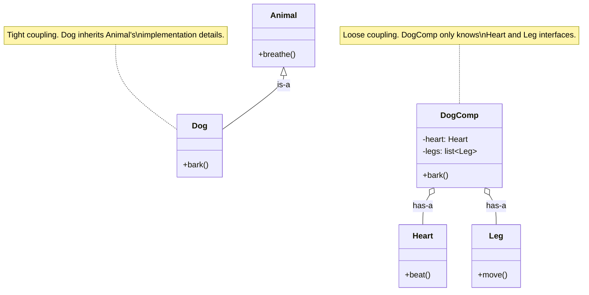
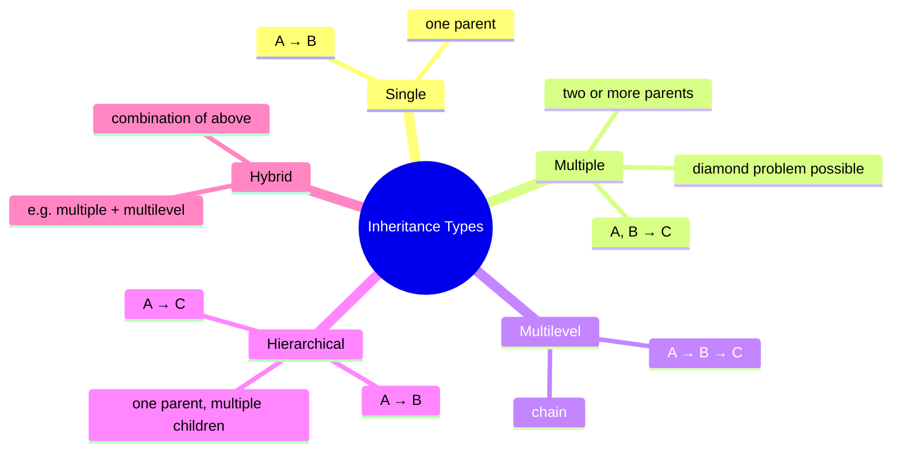
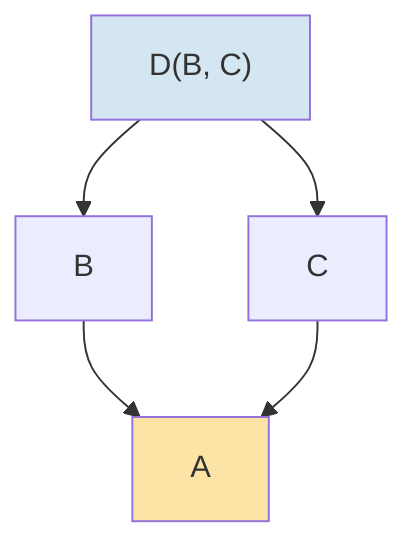
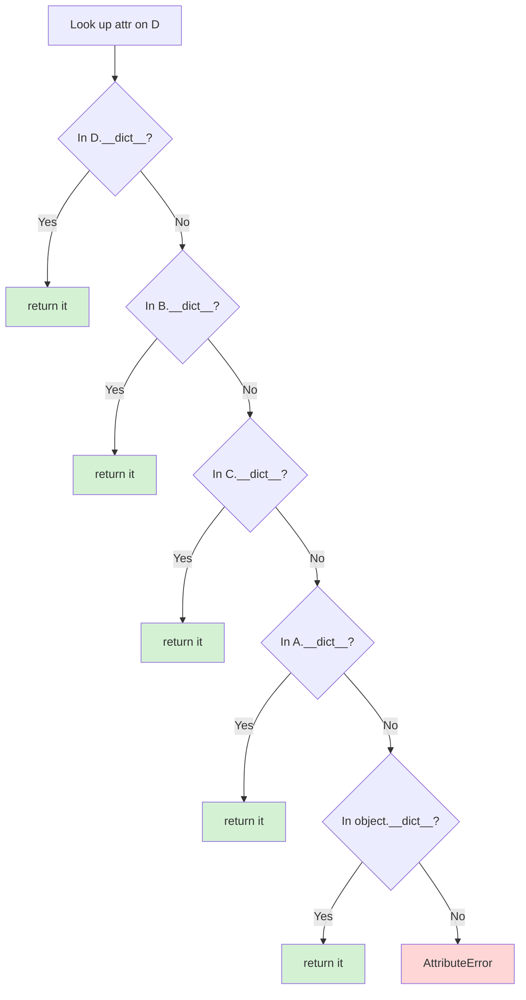
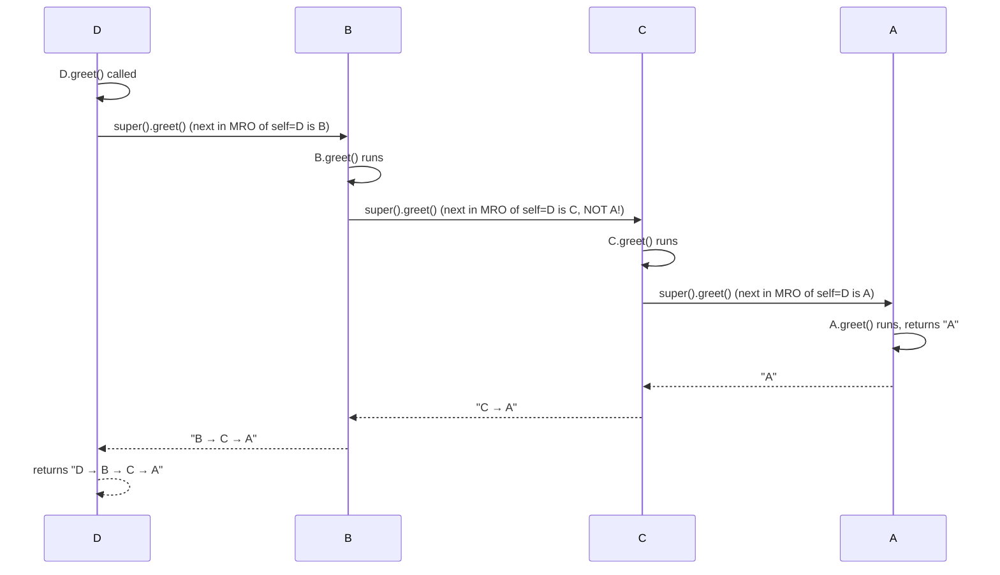
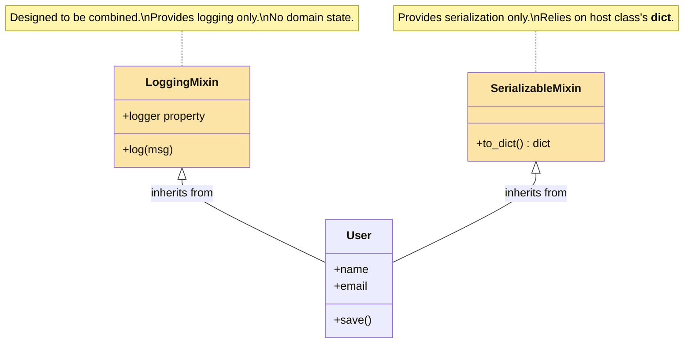
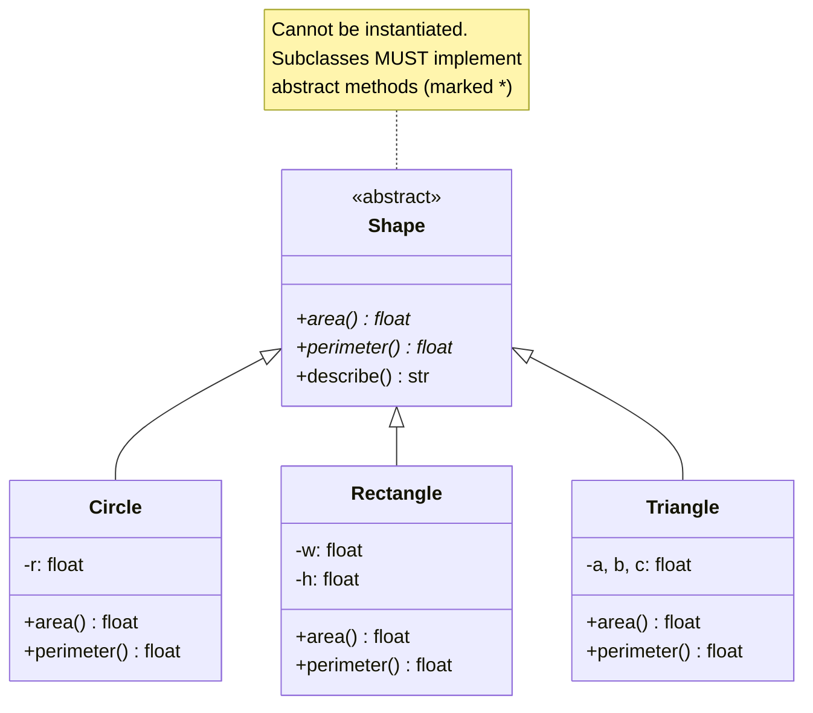
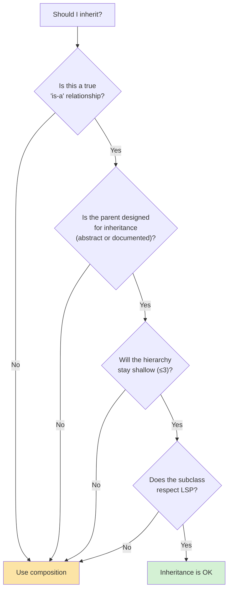
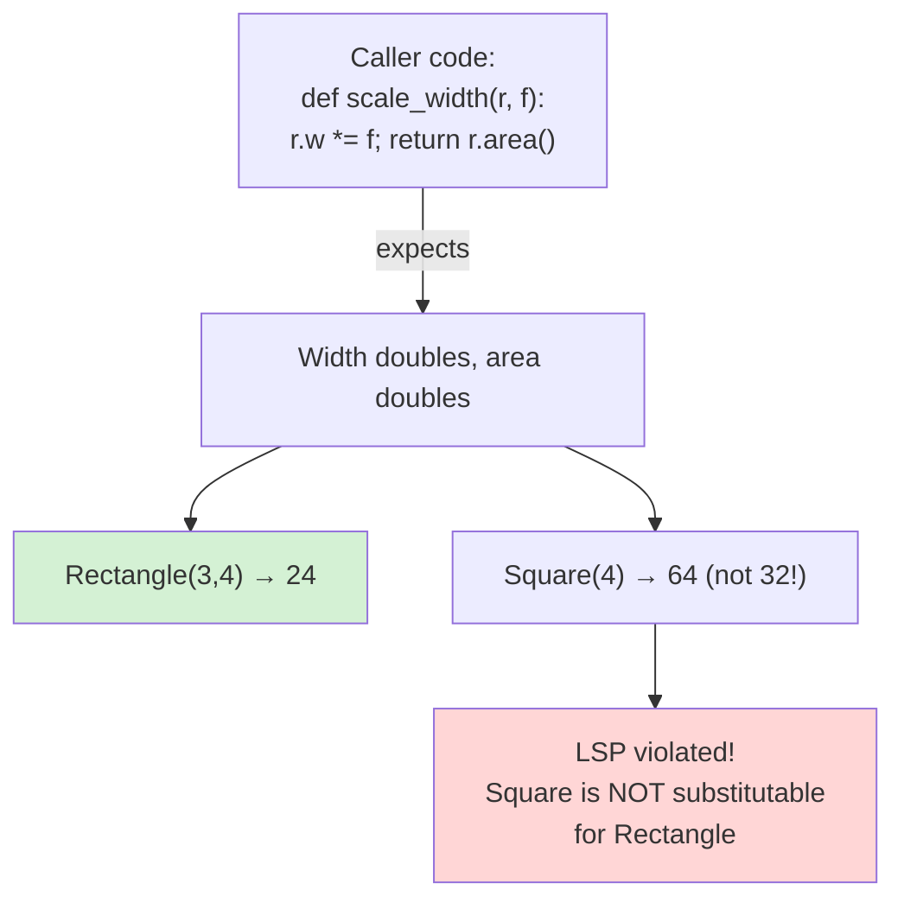
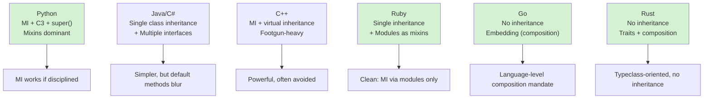

# Inheritance — The Second Pillar of OOP

#oop #four-pillars #inheritance #mro #super #teaching #deep-dive

> [!quote] Barbara Liskov
> "Subtype requirement: Let ϕ(x) be a property provable about objects x of type T. Then ϕ(y) should be true for objects y of type S where S is a subtype of T."

Inheritance is the most *visible* feature of OOP. When beginners say "object-oriented," they are usually picturing inheritance: a tree of classes flowing down from `Animal` to `Dog` to `Poodle`. But inheritance is also the most *misused* feature — the source of more bad design and refactor pain than any other OOP mechanism. This note is a deep dive into what inheritance is, when it's the right tool, what `super()` actually does (it is *not* "the parent"), and how to avoid the classic pitfalls.

Prerequisite: [[Classes-And-Objects]], [[Methods-And-Functions]], [[Encapsulation]].

---

## 1. What Is Inheritance?

Inheritance is a relationship between classes in which a **subclass** (or derived class) gets the attributes and methods of a **superclass** (or base class), and may then *extend*, *override*, or *specialize* that behavior.

```python
class Animal:                  # base class
    def __init__(self, name: str):
        self.name = name
    def speak(self) -> str:
        return f"{self.name} makes a sound"

class Dog(Animal):             # derived class — inherits from Animal
    def speak(self) -> str:    # override
        return f"{self.name} says Woof!"

d = Dog("Rex")
print(d.speak())               # Rex says Woof!
print(d.name)                  # Rex — inherited attribute
print(isinstance(d, Animal))   # True — Dog IS an Animal
```

Inheritance lets you write the *common* code once (in `Animal`) and only the *differences* in subclasses (`Dog.speak`).

### 1.1 Why Inheritance Exists

| Reason | Mechanism | Payoff |
|---|---|---|
| **Modeling "is-a" relationships** | `Dog` is an `Animal` | Code that operates on `Animal` accepts `Dog` transparently |
| **Code reuse** | Subclass inherits parent methods | Don't duplicate the common code |
| **Polymorphism** | Override `speak()` in each subclass | Callers call `animal.speak()` and get subclass-specific behavior |
| **Subtyping** | `Dog` is a subtype of `Animal` | Type checkers, `isinstance()`, dispatch all "know" the relationship |
| **Framework extension** | Override `handle_request()` in a Django view | Framework defines the contract; you provide the specialization |

The first three are good reasons. The fourth is *the* reason inheritance is a subtyping mechanism, not just a code-reuse mechanism. The fifth is the practical reason it shows up everywhere in frameworks.

### 1.2 What Inheritance Is *Not*

> [!danger] Common Student Misconception #1 — "Inheritance is for code reuse"
> It is, but only as a *side effect*. The real purpose of inheritance is **subtyping** — establishing that `Dog` *is an* `Animal`, so any code that works on `Animal` also works on `Dog`. If your only goal is to reuse a method, **composition is almost always better** (see §9 and [[Composition-Over-Inheritance]]). Inheriting for code reuse alone creates fragile hierarchies and tight coupling between unrelated classes.

> [!danger] Common Student Misconception #2 — "Inheritance models the real world"
> Beginners often build elaborate hierarchies mirroring biological taxonomy: `Vehicle → Car → SportsCar → Ferrari → FerrariF40`. This rarely survives contact with changing requirements. Inheritance models **type relationships in your domain logic**, not Linnaean taxonomy. A `FerrariF40` is a class only if your codebase has *behavior* specific to it; otherwise, instances of `Car` with different config parameters are better.

---

## 2. "Is-a" vs "Has-a" — Inheritance vs Composition

Two fundamental relationships between classes:

| | Inheritance ("is-a") | Composition ("has-a") |
|---|---|---|
| Syntax | `class Dog(Animal):` | `class Dog: def __init__(self): self.heart = Heart()` |
| Relationship | Dog **is an** Animal | Dog **has a** Heart |
| Coupling | Tight — Dog depends on Animal's interface *and* implementation | Loose — Dog depends only on Heart's interface |
| Reuse mechanism | Inherited methods | Delegated calls |
| Polymorphism | Subtype polymorphism via method override | Duck typing / interface polymorphism |
| Testability | Hard — Dog can't exist without Animal | Easy — Heart can be mocked |
| Flexibility | Fixed at class definition | Changeable at runtime (swap the Heart) |

```python
# Inheritance (is-a): Dog IS an Animal
class Animal:
    def breathe(self): ...

class Dog(Animal):       # Dog is an Animal
    def bark(self): ...

# Composition (has-a): Dog HAS a Heart and HAS Legs
class Heart:
    def beat(self): ...

class Leg:
    def move(self): ...

class Dog:
    def __init__(self):
        self.heart = Heart()    # Dog has a Heart
        self.legs = [Leg() for _ in range(4)]  # Dog has 4 Legs

    def bark(self): ...
```



> [!tip] Teaching Tip #1 — Ask "is-a" or "has-a" out loud
> When designing a class, ask: "Is X a Y, or does X have a Y?" A `Car` *is a* `Vehicle` (inheritance). A `Car` *has an* `Engine` (composition). A `Stack` *is a* `List`? No — a `Stack` *has a* `List` (it uses a list internally). Stack is *behaviorally* a stack, but it's not a list — exposing `insert(0, x)` would violate the stack abstraction. So: compose.

> [!success] The "Effective Java" rule
> Joshua Bloch's advice: **"Favor composition over inheritance."** Not "never inherit" — *favor* composition. Inheritance is the right tool when there's a true subtyping relationship *and* the parent class is designed for inheritance (or is abstract). Otherwise, compose. See [[Composition-Over-Inheritance]].

---

## 3. Types of Inheritance

Python supports five inheritance shapes:



### 3.1 Single Inheritance

```python
class Vehicle:
    def __init__(self, wheels: int):
        self.wheels = wheels
    def describe(self) -> str:
        return f"{self.wheels}-wheeled vehicle"

class Car(Vehicle):
    def __init__(self):
        super().__init__(wheels=4)
    def describe(self) -> str:
        return f"Car: {super().describe()}"
```

### 3.2 Multiple Inheritance

```python
class Flyable:
    def fly(self): return "flying"

class Swimmable:
    def swim(self): return "swimming"

class Duck(Flyable, Swimmable):    # multiple parents
    def intro(self):
        return f"I am {self.fly()} and {self.swim()}"

d = Duck()
print(d.intro())   # I am flying and swimming
```

### 3.3 Multilevel Inheritance

```python
class A: ...
class B(A): ...      # B extends A
class C(B): ...      # C extends B extends A
# C's MRO: C → B → A → object
```

### 3.4 Hierarchical Inheritance

```python
class Shape: ...
class Circle(Shape): ...
class Rectangle(Shape): ...
class Triangle(Shape): ...
# All three share Shape as parent
```

### 3.5 Hybrid (Multiple + Multilevel)

```python
class Base: ...
class A(Base): ...
class B(Base): ...
class C(A, B): ...    # diamond — see §5
```

---

## 4. Method Overriding and Extension

Two patterns for subclass methods:

- **Override** — replace the parent's implementation entirely.
- **Extend** — call `super().method()` first, then add behavior.

```python
class Animal:
    def __init__(self, name: str):
        self.name = name
    def speak(self) -> str:
        return f"{self.name} makes a sound"
    def greet(self) -> str:
        return f"Hello, I am {self.name}"

class Dog(Animal):
    def speak(self) -> str:                          # OVERRIDE
        return f"{self.name} says Woof!"
    def greet(self) -> str:                          # EXTEND
        parent = super().greet()
        return f"{parent} (and I bark)"

print(Dog("Rex").greet())   # Hello, I am Rex (and I bark)
print(Dog("Rex").speak())   # Rex says Woof!
```

> [!warning] Teaching Tip #2 — Distinguish override vs extend explicitly
> Students often conflate "define a method in a subclass" with "call super()." Make the vocabulary explicit: an **override** replaces; an **extension** augments by calling super first. Both are valid; the choice depends on whether the parent's behavior is still relevant.

---

## 5. Multiple Inheritance and the Diamond Problem

### 5.1 The Diamond

```python
class A:
    def greet(self): return "A"

class B(A):
    def greet(self): return "B"

class C(A):
    def greet(self): return "C"

class D(B, C):
    pass

print(D().greet())    # ?
```

`D` inherits from both `B` and `C`, which both inherit from `A`. The diamond shape:



The question: when `D().greet()` is called, which `greet` runs? `B`'s? `C`'s? `A`'s? In Python, the answer is determined by the **MRO**.

### 5.2 MRO — Method Resolution Order

Python uses the **C3 linearization** algorithm to compute a single, consistent order in which base classes are searched for an attribute. You can inspect it:

```python
print(D.__mro__)
# (<class 'D'>, <class 'B'>, <class 'C'>, <class 'A'>, <class 'object'>)
```

For `D(B, C)`, the MRO is `D → B → C → A → object`. So `D().greet()` returns `"B"`.

The C3 algorithm guarantees:

1. **Consistency with the inheritance order**: a subclass appears before its superclasses.
2. **Consistency with the order of base classes in the `class` declaration**: `B` before `C` in `class D(B, C)`.
3. **Monotonicity**: if `X` precedes `Y` in one part of the MRO, it precedes it everywhere.

If these three constraints cannot be satisfied (e.g. `class X(A, B)` where MRO of `A` puts `B` before `A`), Python raises `TypeError: Cannot create a consistent method resolution order`.



> [!info] Why C3?
> Before Python 2.3, the MRO was depth-first left-to-right (DFS), which could visit a class *before* its subclasses in some diamond cases — leading to subtly wrong method resolution. C3 was adopted (PEP 253, implemented by Barrett, Wawryk) because it produces an order that *every reasonable person would agree is correct*. The algorithm is also used by Dylan, Parrot, and other languages with multiple inheritance.

### 5.3 Cooperative `super()` in Diamonds

The magic of cooperative multiple inheritance: if *every* class in the diamond calls `super()`, all of them get to participate.

```python
class A:
    def greet(self) -> str:
        return "A"

class B(A):
    def greet(self) -> str:
        return f"B → {super().greet()}"

class C(A):
    def greet(self) -> str:
        return f"C → {super().greet()}"

class D(B, C):
    def greet(self) -> str:
        return f"D → {super().greet()}"

print(D().greet())
# D → B → C → A
```

The output `D → B → C → A` shows that `super().greet()` *inside `B`* calls `C.greet()`, not `A.greet()`! That's because `super()` doesn't mean "my parent" — it means **"the next class in the MRO of `self`"**.



> [!danger] Common Student Misconception #3 — "super() calls the parent"
> No! `super()` calls **the next class in the MRO of `self`**, which may not be the parent at all. In the example above, `B`'s `super().greet()` calls `C.greet()`, even though `B` does not inherit from `C`. The MRO is determined by the *runtime type* of `self`, not by the class where the method is defined. This is the single most misunderstood aspect of Python inheritance.

### 5.4 Cooperative `__init__` — The Pattern

For multiple inheritance to work, *every* class must accept and forward `**kwargs` so that arguments can flow through to the next class in the MRO:

```python
class Base:
    def __init__(self, **kwargs):
        super().__init__(**kwargs)        # forwards to next in MRO (eventually object)
        print("Base.__init__")

class Left(Base):
    def __init__(self, left_val, **kwargs):
        super().__init__(**kwargs)
        self.left_val = left_val
        print("Left.__init__")

class Right(Base):
    def __init__(self, right_val, **kwargs):
        super().__init__(**kwargs)
        self.right_val = right_val
        print("Right.__init__")

class Child(Left, Right):
    def __init__(self, **kwargs):
        super().__init__(**kwargs)        # distributes kwargs across the MRO
        print("Child.__init__")

c = Child(left_val=1, right_val=2)
# Base.__init__
# Right.__init__
# Left.__init__
# Child.__init__
print(c.left_val, c.right_val)   # 1 2
```

> [!tip] Teaching Tip #3 — `**kwargs` is the price of cooperative MI
> If you want cooperative multiple inheritance, *every* class in the hierarchy must:
> 1. Call `super().__init__(**kwargs)`.
> 2. Pop its own named arguments from `kwargs` (or accept `**kwargs` and pull from it).
> 3. Forward the rest to `super().__init__(**kwargs)`.
>
> The pattern is verbose but enables powerful mixin composition (see §7). If you don't need MI, plain `super().__init__(name, age)` is fine.

---

## 6. `super()` in Detail

### 6.1 The Two Forms

```python
# Modern (Python 3): zero-arg super
class Dog(Animal):
    def __init__(self, name):
        super().__init__(name)        # compiler fills in (Dog, self)

# Legacy (Python 2, also works in 3): explicit
class Dog(Animal):
    def __init__(self, name):
        super(Dog, self).__init__(name)   # explicit about which class to start from
```

The zero-arg form is implemented by the compiler reading `__class__` from the enclosing function's closure and binding `self` from the first argument. It is *not* magic; it's compile-time rewriting.

### 6.2 The Explicit Form — For When You Need to Skip

The explicit form `super(CurrentClass, self)` lets you start the MRO search *from a particular class*, skipping that class. Useful for advanced patterns:

```python
class C(B):
    def method(self):
        # Skip C, start MRO search from B
        super(B, self).method()       # calls A.method, not B.method
```

This is rare in application code, common in mixins and framework internals.

### 6.3 `super()` Outside Methods

Since Python 3.6, `super()` can be used *outside* instance methods, but you must provide both arguments explicitly:

```python
# Equivalent to inside a method calling super()
bound = super(Dog, my_dog_instance)
bound.speak()    # calls Animal.speak on my_dog_instance
```

Useful in `__init_subclass__` hooks and metaclasses.

### 6.4 The `super()` Chain Ends at `object`

The MRO always ends with `object`. `object.__init__` accepts no arguments (well, it accepts `*args, **kwargs` and ignores them in CPython, but it logs a deprecation warning in 3.x if you pass them). So if you have a cooperative chain, `object.__init__(**kwargs)` is the final call, and `kwargs` should be empty by then.

> [!warning] Teaching Tip #4 — Forgetting `super().__init__()` is the #1 inheritance bug
> Beginners routinely write:
> ```python
> class Dog(Animal):
>     def __init__(self, name, breed):
>         self.breed = breed       # forgot super().__init__(name)!
> ```
> Now `Dog("Rex", "Lab").name` raises `AttributeError` because `Animal.__init__` never ran. The fix is to always call `super().__init__(...)` first, then set subclass-specific attributes. Linters like pylint warn about this (`W0231: __init__ method from base class is not called`).

---

## 7. Mixins — Inheritance for Code Reuse, Done Right

A **mixin** is a class designed to be *combined* with other classes via multiple inheritance, providing a single piece of functionality. Mixins are the legitimate "inheritance for code reuse" pattern — *because they're designed for it*.

```python
import logging

class LoggingMixin:
    """Adds logging to any class. Uses self.logger if present, else creates one."""
    @property
    def logger(self):
        if not hasattr(self, '_logger'):
            self._logger = logging.getLogger(self.__class__.__name__)
        return self._logger

    def log(self, msg: str) -> None:
        self.logger.info(msg)

class SerializableMixin:
    """Adds a to_dict method by reading __dict__ (with some filtering)."""
    def to_dict(self) -> dict:
        return {k: v for k, v in vars(self).items() if not k.startswith('_')}

class User(LoggingMixin, SerializableMixin):
    def __init__(self, name: str, email: str):
        self.name = name
        self.email = email

    def save(self) -> None:
        self.log(f"saving user {self.email}")
        # ... persistence logic ...

u = User("Ada", "ada@example.com")
u.save()                  # logs via LoggingMixin
print(u.to_dict())        # {'name': 'Ada', 'email': 'ada@example.com'} via SerializableMixin
```



### 7.1 Mixin Design Rules

1. **A mixin provides a single, focused piece of behavior.** Not a domain entity; not a base class to be instantiated alone.
2. **A mixin cooperates with its host.** It uses `super()` to participate in the MRO, even if the host's other base classes don't have the methods it calls.
3. **A mixin does not own state.** It may add a `_logger` attribute, but it doesn't manage a `name` or `email`.
4. **A mixin is not instantiated alone.** It's an additive, not a standalone class.

> [!info] Mixins in the wild
> Django's class-based views (`ListView`, `DetailView`, `LoginRequiredMixin`), Flask's `MethodView`, and the standard library's `collections.abc` (`Iterable`, `Mapping`, `Sequence` — these are abstract mixins) all use the mixin pattern. It's the dominant pattern in Python web frameworks for composing request-handling behavior.

> [!tip] Teaching Tip #5 — Show the alternative to mixins
> Mixins are a way to share horizontal behavior. The composition alternative is a service class: instead of `class User(LoggingMixin)`, you have `class User: def __init__(self, logger): self.logger = logger`. Both work. Mixins win when the behavior is *closely tied to the class's identity* (logging is part of who User is); composition wins when the behavior is *configurable* (a User can have different loggers). This is the design call students need to learn to make.

---

## 8. Abstract Base Classes (ABCs)

An **abstract base class** (ABC) is a class that cannot be instantiated directly and that may declare **abstract methods** which subclasses must implement. ABCs are Python's mechanism for declaring an *interface* with enforcement.

```python
from abc import ABC, abstractmethod

class Shape(ABC):
    @abstractmethod
    def area(self) -> float: ...

    @abstractmethod
    def perimeter(self) -> float: ...

    def describe(self) -> str:           # concrete method
        return f"{type(self).__name__}: area={self.area():.2f}, perimeter={self.perimeter():.2f}"

class Circle(Shape):
    def __init__(self, r: float): self.r = r
    def area(self) -> float: return 3.14159 * self.r ** 2
    def perimeter(self) -> float: return 2 * 3.14159 * self.r

class Rectangle(Shape):
    def __init__(self, w: float, h: float): self.w, self.h = w, h
    def area(self) -> float: return self.w * self.h
    def perimeter(self) -> float: return 2 * (self.w + self.h)

# Shape()                       # TypeError: can't instantiate abstract class
c = Circle(2)
print(c.describe())             # Circle: area=12.57, perimeter=12.57
r = Rectangle(3, 4)
print(r.describe())             # Rectangle: area=12.00, perimeter=14.00
```



### 8.1 Abstract Properties, Classmethods, Staticmethods

```python
class Plugin(ABC):
    @property
    @abstractmethod
    def name(self) -> str: ...

    @classmethod
    @abstractmethod
    def from_config(cls, config: dict) -> "Plugin": ...

    @staticmethod
    @abstractmethod
    def default_config() -> dict: ...
```

> [!warning] Decorator order matters!
> `@abstractmethod` must be the **innermost** decorator (applied first to the function), so it goes *closest* to the `def`. Then `@property`, `@classmethod`, or `@staticmethod` wraps the abstract function. The order `@abstractmethod` → `@property` is wrong; `@property` → `@abstractmethod` is correct.

### 8.2 What ABCs Buy You

| Feature | Without ABC | With ABC |
|---|---|---|
| Can't instantiate the base | No | Yes — enforced at `__init__` time |
| Subclasses must implement a method | No — silent inheritance of `...` | Yes — `TypeError` at instantiation |
| Virtual subclass registration | No | Yes — `Shape.register(MyShape)` makes `isinstance(MyShape(), Shape)` true even without inheritance |
| Hook for `isinstance()` checks | Inheritance only | Inheritance OR structural match via `__subclasshook__` |
| Documents the contract | Docstrings only | Abstract methods *are* the contract |

> [!info] Virtual subclasses with `.register()`
> ABCs support a powerful feature: `Shape.register(SomeUnrelatedClass)` makes `isinstance(x, Shape)` return `True` for instances of `SomeUnrelatedClass`, *without* requiring `SomeUnrelatedClass` to inherit from `Shape`. This is how `collections.abc` makes built-in types like `list` and `dict` register as `Sequence` and `Mapping`. Use sparingly — it bypasses the type system — but it's the right tool for adapting third-party classes to your ABC.

See [[Abstraction]] for the deeper discussion of ABCs as an abstraction tool.

---

## 9. When NOT to Use Inheritance

Inheritance is a powerful, *dangerous* tool. These are the situations where it's the wrong choice:

### 9.1 No Real "Is-a" Relationship

If the relationship is "has-a" or "uses-a," compose. Don't make `Stack` inherit from `list` just to reuse `append` — `Stack` is not a list (lists have `insert`, `pop(0)`, `reverse`, all of which violate the stack abstraction).

### 9.2 Deep Inheritance Chains

```python
# Anti-pattern: 7 levels deep
class Entity: ...
class Character(Entity): ...
class Player(Character): ...
class Warrior(Player): ...
class EliteWarrior(Warrior): ...
class Berserker(EliteWarrior): ...
class BloodRagedBerserker(Berserker): ...
```

Each level adds a tiny bit of behavior; the MRO is 8 entries long; understanding what `self.attack()` does requires reading 8 files. **Three levels is usually enough.** If you find yourself at 5+, refactor toward composition.



### 9.3 Inheriting for Code Reuse Alone

```python
# Anti-pattern: reusing Helper's `parse` method via inheritance
class Helper:
    def parse(self, s): ...

class OrderProcessor(Helper):       # OrderProcessor is NOT a Helper!
    def run(self, order_str):
        return self.parse(order_str)
```

`OrderProcessor` is not a `Helper` — it *uses* a helper. The right pattern:

```python
class Helper:
    def parse(self, s): ...

class OrderProcessor:
    def __init__(self, helper: Helper):
        self.helper = helper        # composition
    def run(self, order_str):
        return self.helper.parse(order_str)
```

### 9.4 When the Parent Class Isn't Designed for Inheritance

Some classes are documented as "do not subclass" because their internals may change. Inheriting from `list`, `dict`, or `str` is sometimes appropriate, but inheriting from a third-party class whose author didn't think about subclasses is risky — your override might break the parent's invariants. The classic example: overriding `__setattr__` on a class that uses `__init__` to set many attributes — your override runs on every one of those sets, often with surprising results.

> [!danger] Common Student Misconception #4 — "Multiple inheritance is evil"
> It's not. It's a tool. Java bans MI for classes (allowing it only for interfaces) because Java's designers wanted to simplify the language, not because MI is inherently broken. Python's MI + C3 + cooperative `super()` is a well-understood, sound mechanism. The danger isn't MI per se — it's *undisciplined* MI: inheriting from many classes that weren't designed to be combined, or not calling `super()` in `__init__`. Used with mixins designed for cooperation, MI is one of Python's most expressive features.

> [!danger] Common Student Misconception #5 — "If the parent has a method, the child automatically inherits it correctly"
> Not necessarily. The child inherits the *code*, but the code may rely on invariants or attributes the child doesn't satisfy. For example, if `Animal.__init__` sets `self.species`, and your `Dog.__init__` overrides without calling `super().__init__()`, then `Dog().species` raises `AttributeError`. The inherited `species` property exists on the class but the underlying data was never set. Always verify inherited methods still work in the subclass's context — this is exactly what the LSP is about.

---

## 10. The Liskov Substitution Principle

> [!quote] Barbara Liskov, 1987
> If `S` is a subtype of `T`, then objects of type `T` may be replaced with objects of type `S` without breaking the program.

LSP is the test for whether your inheritance is *correct*. If a `Dog` "is-a" `Animal`, then *every* piece of code that works on `Animal` must work on `Dog` — without surprises, without type errors, without behavioral changes that callers wouldn't expect.

### 10.1 LSP Violations

```python
class Rectangle:
    def __init__(self, w, h): self.w, self.h = w, h
    def area(self): return self.w * self.h

class Square(Rectangle):
    """A square is a rectangle, right? WRONG (for LSP)."""
    def __init__(self, side):
        super().__init__(side, side)
    @property
    def w(self): return self._w
    @w.setter
    def w(self, v): self._w = self._h = v       # keep w == h
    @property
    def h(self): return self._h
    @h.setter
    def h(self, v): self._w = self._h = v

def scale_width(rect: Rectangle, factor: float):
    rect.w *= factor
    return rect.area()

r = Rectangle(3, 4); print(scale_width(r, 2))   # 24 (6 * 4)
s = Square(4);       print(scale_width(s, 2))   # 64 (8 * 8) — caller expected 32!
```

The caller's mental model: "doubling the width doubles the area." For `Rectangle`, that's true. For `Square`, doubling the width also doubles the height, quadrupling the area. `Square` violates LSP relative to `Rectangle` because it changes a behavioral contract callers rely on.



> [!info] The classic "Square is not a Rectangle" example
> This is the canonical LSP violation, dating to the 1980s. Mathematical taxonomy says a square *is a* rectangle, but **behavioral** subtyping says it isn't — because `Rectangle` promises independent width and height, and `Square` breaks that promise. Inheritance models behavior, not math.

### 10.2 Rules for LSP-Conformant Subtypes

1. **Preconditions cannot be strengthened.** If `Animal.feed(food)` accepts any food, `Dog.feed(food)` cannot reject some foods.
2. **Postconditions cannot be weakened.** If `Animal.speak()` returns a non-empty string, `Dog.speak()` cannot return `None`.
3. **Invariants must be preserved.** If `Account.withdraw()` keeps `balance >= -limit`, every subclass's `withdraw` must too.
4. **History constraint.** Subclasses cannot mutate state in ways the parent's interface doesn't permit (e.g., making an immutable object mutable).
5. **No new exceptions** beyond what the parent declares.

See [[Liskov-Substitution]] for the full SOLID treatment.

> [!tip] Teaching Tip #6 — Run the "outrageous subclass" thought experiment
> When designing an inheritance hierarchy, ask: "Could a subclass do X and still be considered a valid T?" If the answer is "no, that would be wrong," you've found an LSP constraint. The classic: "Could `Ostrich` (which can't fly) be a subclass of `Bird` (which has a `fly()` method)?" Only if `fly()` is defined to allow "I can't fly" as a legitimate response — otherwise, `Ostrich` violates LSP.

---

## 11. Larger Example — Employee Hierarchy with Cooperative `super()`

```python
class Employee:
    def __init__(self, name: str, **kwargs):
        super().__init__(**kwargs)
        self.name = name

    def pay(self) -> float:
        return 0.0

    def __repr__(self):
        return f"{type(self).__name__}({self.name!r}, pay={self.pay():.2f})"


class Salaried(Employee):
    def __init__(self, salary: float, **kwargs):
        super().__init__(**kwargs)
        self.salary = salary

    def pay(self) -> float:
        return self.salary


class Bonused(Employee):
    def __init__(self, bonus: float, **kwargs):
        super().__init__(**kwargs)
        self.bonus = bonus

    def pay(self) -> float:
        return super().pay() + self.bonus      # cooperative!


# Compose: a salaried employee who also gets a bonus
class Manager(Salaried, Bonused):
    """A manager is salaried AND receives a bonus."""
    pass


m = Manager(name="Ada", salary=120_000, bonus=20_000)
print(m)               # Manager('Ada', pay=140000.00)
print(Manager.__mro__)
# Manager → Salaried → Bonused → Employee → object
```

Notice the magic: `Manager` itself adds no code. Its MRO is `Manager → Salaried → Bonused → Employee → object`. When `m.pay()` is called:

1. `Manager.pay` — not defined, MRO walks to `Salaried.pay`.
2. `Salaried.pay` returns `self.salary` (120,000). Wait — it returns `self.salary`. But the example wants `bonus` added. Let me re-trace.

Actually, `Salaried.pay` returns `self.salary`. `Bonused.pay` returns `super().pay() + self.bonus`. The MRO is `Manager → Salaried → Bonused → Employee → object`. So when `Manager` calls `pay()` (inherited from `Salaried`), `Salaried.pay` returns `self.salary` directly — *without* calling `super().pay()`. The bonus is missed!

This is the classic cooperative-MI footgun: `Salaried.pay` must call `super().pay()` to participate in the chain. Let me fix it:

```python
class Salaried(Employee):
    def __init__(self, salary: float, **kwargs):
        super().__init__(**kwargs)
        self.salary = salary

    def pay(self) -> float:
        return super().pay() + self.salary    # ← cooperative!
```

Now the chain works: `Manager.pay` → `Salaried.pay` → `super().pay()` (= `Bonused.pay`) → `super().pay()` (= `Employee.pay`, returns 0) `+ self.bonus` → `0 + 20_000` → returned up to `Salaried.pay` → `20_000 + 120_000` → `140_000`. ✓

> [!warning] Teaching Tip #7 — Cooperative methods must *all* call `super()`
> The pattern only works if **every class** in the MRO participates. One class returning a value directly (without `super()`) cuts the chain, and classes later in the MRO never run. This is why mixin design requires discipline: every method that might be overridden must use `super()`, even if you "don't expect" a subclass to add behavior. See [[Composition-Over-Inheritance]] and [[Mixins]] for more.

---

## 12. Inheritance Across Languages

| Language | Multiple inheritance? | Mechanism | Notes |
|---|---|---|---|
| **Python** | Yes (classes) | C3 MRO + cooperative `super()` | Mixins are the dominant pattern |
| **Java** | No (classes); Yes (interfaces) | `implements` multiple, `extends` one | Default methods (Java 8+) blur the line |
| **C++** | Yes | Virtual inheritance to solve diamond | Powerful, footgun-heavy |
| **C#** | No (classes); Yes (interfaces) | Like Java | Default interface methods (C# 8+) |
| **Ruby** | No (classes); Mixins via `include Module` | Modules are mixins, not classes | Single inheritance + mixins = cleaner |
| **JavaScript** | Single (prototype chain) | ES6 `class extends` | Mixins via `Object.assign` or function chains |
| **Go** | No inheritance at all | Embedding (composition) | "Favor composition" enforced by the language |
| **Rust** | No inheritance | Traits (similar to typeclasses) | Composition + traits |



> [!info] Why modern languages avoid MI for classes
> Java, C#, Ruby, Go, Rust, Swift, Kotlin — none allow multiple *class* inheritance (some allow multiple *interface* inheritance). The reason: MI for classes drags in *state*, and state from multiple parents is hard to reason about (which `__init__` runs first? what if both parents have a `_count` field?). Python is unusual in allowing MI for classes — and the community has converged on the *mixin convention* to use it safely. Even in Python, you should default to single inheritance + mixins.

---

## 13. Anti-Patterns Recap

### 13.1 Inheriting to Override One Method

If you subclass to override one method and your subclass has no other reason to exist, prefer composition with a callable:

```python
# Anti-pattern
class LoudDog(Dog):
    def speak(self): return super().speak().upper()

# Composition alternative
class LoudSpeaker:
    def __init__(self, inner): self.inner = inner
    def speak(self): return self.inner.speak().upper()
```

### 13.2 The God Base Class

A single base class with 40 methods that every subclass overrides selectively. Subclasses end up inheriting methods they don't want, and the base class becomes a dumping ground. Split into multiple focused ABCs.

### 13.3 Inheritance for Configuration

```python
# Anti-pattern
class ProductionConfig(BaseConfig): DEBUG = False; DB = "prod"
class StagingConfig(BaseConfig): DEBUG = False; DB = "staging"
class DevConfig(BaseConfig): DEBUG = True; DB = "dev"
```

These aren't *behaviors* — they're data. Use instances, not classes:

```python
configs = {
    "prod": Config(debug=False, db="prod"),
    "staging": Config(debug=False, db="staging"),
    "dev": Config(debug=True, db="dev"),
}
```

### 13.4 Calling `super()` Conditionally

```python
class Bad:
    def __init__(self, x):
        if x > 0:                     # 🚨 don't conditionally call super
            super().__init__()
```

`super().__init__()` must be called *unconditionally* — otherwise cooperative MI breaks silently (some classes in the MRO won't be initialized). The conditional logic belongs elsewhere.

---

## 14. Common Misconceptions Recap

| # | Misconception | Reality |
|---|---|---|
| 1 | "Inheritance is for code reuse" | Inheritance is for *subtyping*; composition is for reuse |
| 2 | "Inheritance models the real world" | It models type relationships in your domain logic, not biological taxonomy |
| 3 | "super() calls the parent" | `super()` calls the next class in the MRO of `self`, which may not be the parent |
| 4 | "Multiple inheritance is evil" | MI is a tool; disciplined MI via mixins is one of Python's best features |
| 5 | "Inherited methods always work in subclasses" | They may depend on invariants the subclass breaks — verify LSP |

## 15. Teaching Tips Recap

| # | Tip |
|---|---|
| 1 | Ask "is-a" or "has-a" out loud when designing |
| 2 | Distinguish override (replace) from extend (call super first) |
| 3 | `**kwargs` is the price of cooperative MI; every class must call `super().__init__(**kwargs)` |
| 4 | Forgetting `super().__init__()` is the #1 inheritance bug — linters can catch it |
| 5 | Show the composition alternative to every mixin; let students see the trade-off |
| 6 | Run the "outrageous subclass" thought experiment to discover LSP constraints |
| 7 | Cooperative methods must *all* call `super()`; one returning directly cuts the chain |
| 8 | Three levels of inheritance is usually enough; at 5+, refactor toward composition |

---

## 16. What's Next

- [[Polymorphism]] — what inheritance enables at the call site.
- [[Abstraction]] — ABCs as an abstraction tool (vs inheritance as a subtyping tool).
- [[Composition-Over-Inheritance]] — the deep dive on the alternative.
- [[Liskov-Substitution]] — the SOLID principle that tests inheritance correctness.
- [[Mixins]] — the design pattern for safe code reuse via inheritance.
- [[Interface-Segregation]] — narrow interfaces are better than deep hierarchies.
- [[Constructors-And-Destructors]] — `__init__` and `super()` in depth.
- [[How-OOP-Works]] — the MRO walk under the hood, C3 linearization algorithm details.

---

## 17. Practice Exercises

1. **Build the Shape hierarchy.** `Shape(ABC)` with abstract `area()` and `perimeter()`. Subclasses `Circle`, `Rectangle`, `Triangle`. Add a `total_area(shapes: list[Shape]) -> float` function that uses polymorphism.
2. **Demonstrate the diamond.** Build the `A → B, C → D` diamond from §5.1. Print `D.__mro__` and trace what `D().greet()` returns. Predict it before running.
3. **Cooperative employee pay.** Build the `Employee → Salaried, Bonused → Manager` example from §11. Verify that adding `Overtime` as a fourth mixin (with `pay() -> super().pay() + self.overtime_pay`) works correctly with `Manager(Salaried, Bonused, Overtime)`.
4. **LSP test.** Write a function `area_doubler(rect: Rectangle, factor)` and run it on `Rectangle` and `Square`. Observe the LSP violation. Refactor: extract `Shape` ABC with `area()`, make both `Rectangle` and `Square` independent subclasses.
5. **Mixin design.** Build a `JsonSerializable` mixin that adds a `to_json()` method. Apply it to three unrelated classes (`User`, `Product`, `Order`). Verify each gets the method without code duplication. Discuss: when would composition (a `JsonEncoder` service) be better?
