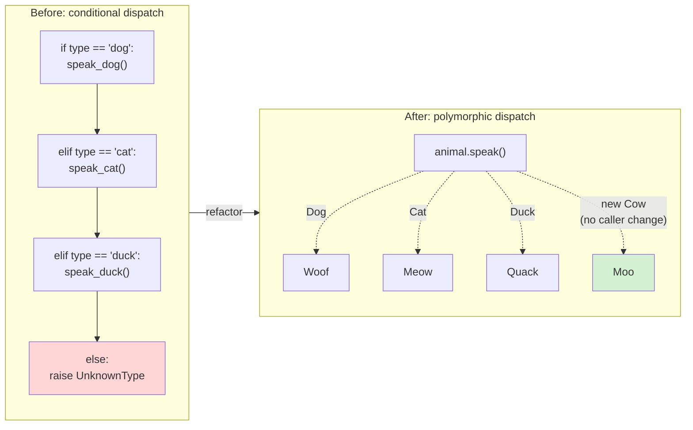
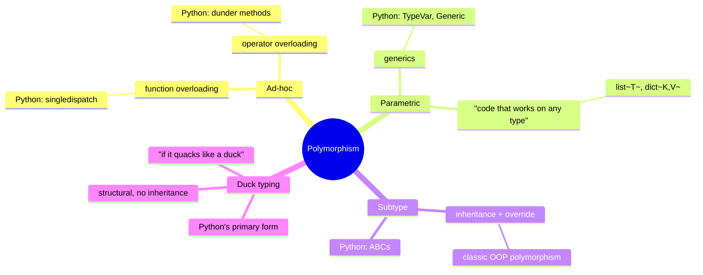
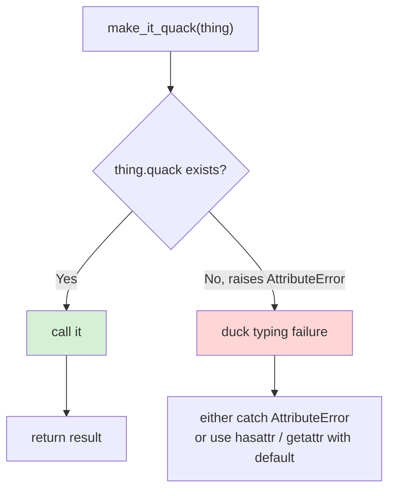
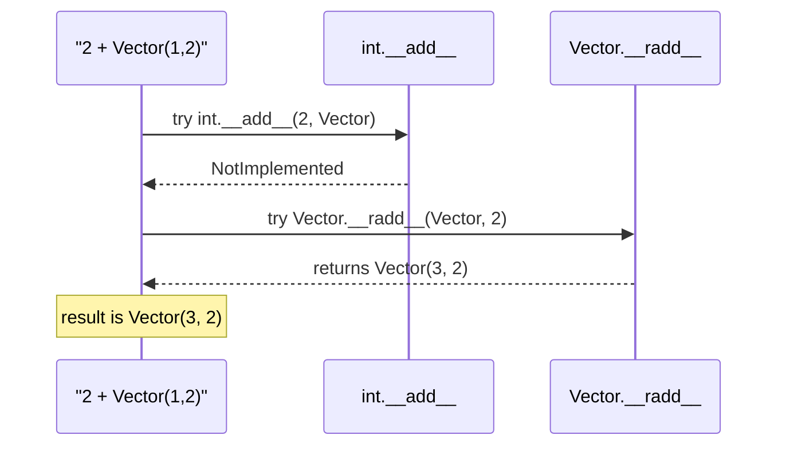
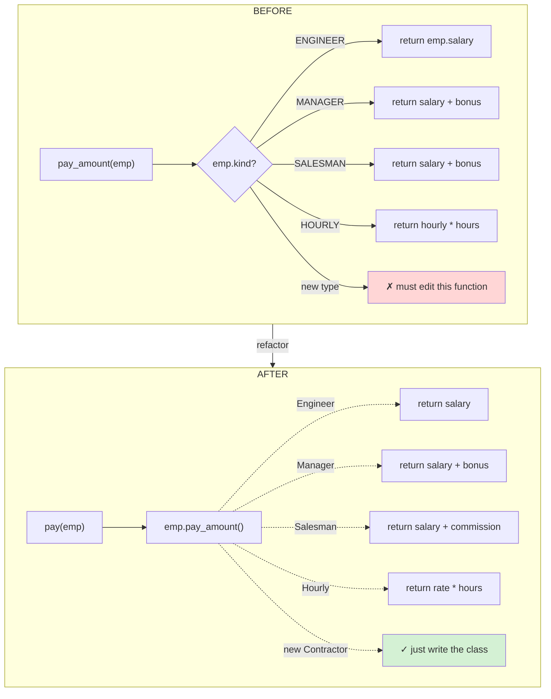
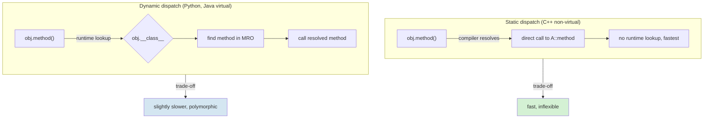
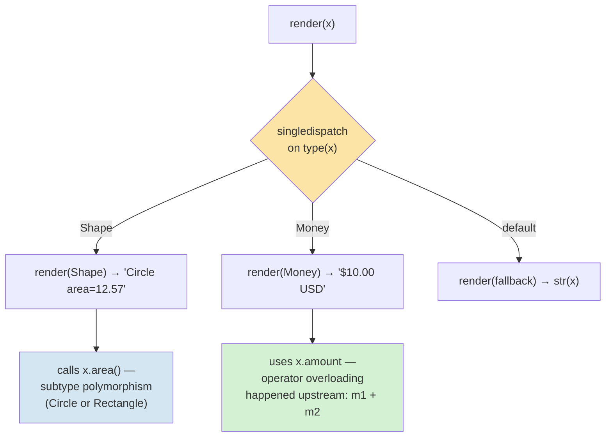

# Polymorphism — The Third Pillar of OOP

#oop #four-pillars #polymorphism #duck-typing #teaching #deep-dive

> [!quote] Christopher Strachey, 1967
> "Polymorphism is the ability of different things to be handled uniformly through a common interface."

Polymorphism is Greek for "many forms." In OOP, it means: **the same operation can take many forms depending on the object it operates on.** `len("abc")` returns 3. `len([1,2,3])` returns 3. `len({"a":1})` returns 1. One function name, many behaviors. That's polymorphism in one line.

Polymorphism is what makes OOP code *extensible*: you can add a new subclass without touching existing code that calls methods on its superclass. It is also what makes OOP code *clean*: long `if/elif` chains over type are replaced by a single method call. This note is a deep dive: the types of polymorphism, Python's distinctive flavor (duck typing), operator overloading, dispatch mechanics, and refactor patterns.

Prerequisite: [[Inheritance]], [[Methods-And-Functions]], [[Encapsulation]].

---

## 1. What Is Polymorphism?

Polymorphism is the property that lets a single interface (a function name, a method, an operator) operate on objects of different types, dispatching to type-appropriate behavior at runtime.

### 1.1 The Intuition

```python
def make_it_speak(thing):
    print(thing.speak())

class Dog:
    def speak(self): return "Woof"

class Cat:
    def speak(self): return "Meow"

class Duck:
    def speak(self): return "Quack"

make_it_speak(Dog())    # Woof
make_it_speak(Cat())    # Meow
make_it_speak(Duck())   # Quack
```

`make_it_speak` doesn't know or care what kind of thing it gets. It just calls `.speak()`. Each type does its own thing. That's polymorphism.

### 1.2 Why Polymorphism Matters

| Reason | What polymorphism gives you |
|---|---|
| **Replace conditionals** | `if type == "dog": ... elif type == "cat": ...` becomes `animal.speak()` |
| **Open/closed** | Add a new `Cow` subclass without modifying the caller (see [[OCP]]) |
| **Decoupling** | Callers depend on the *interface*, not the *implementation* |
| **Testability** | Substitute a fake/mock that implements the same interface |
| **Extensibility** | Plugins, hooks, strategies — all rely on polymorphism |
| **Readability** | `process(items)` beats 200 lines of type-switching |

> [!info] The "Replace Conditional with Polymorphism" refactor
> This is one of the most valuable refactors in OOP (Fowler, *Refactoring*). Whenever you see a `switch` or `if/elif` chain on a type field, you can usually replace it with a polymorphic call. The code becomes shorter, the dispatch is centralized in the type system, and adding a new type doesn't require touching existing code. See §6 for a full example.



---

## 2. Types of Polymorphism

Strachey (1967) distinguished two fundamental kinds, and Cardelli & Wegner (1985) extended the taxonomy. Here's the practical version for Python:



### 2.1 Ad-hoc Polymorphism — Overloading

**Ad-hoc polymorphism** is when a function or operator has different implementations depending on the *types of its arguments*. The classic example is operator overloading: `+` means "add" for numbers, "concatenate" for strings, "union" for sets.

In Java/C++, this is done via *function overloading* — multiple functions with the same name but different parameter types. Python doesn't have function overloading directly (the last definition wins), but it has two mechanisms:

1. **`functools.singledispatch`** — dispatch a function on the type of its first argument.
2. **Dunder methods** — overload operators and built-in functions.

```python
from functools import singledispatch

@singledispatch
def serialize(obj) -> str:
    raise TypeError(f"cannot serialize {type(obj).__name__}")

@serialize.register
def _(obj: int) -> str:
    return str(obj)

@serialize.register
def _(obj: str) -> str:
    return f'"{obj}"'

@serialize.register
def _(obj: list) -> str:
    return "[" + ", ".join(serialize(x) for x in obj) + "]"

print(serialize(42))            # 42
print(serialize("hi"))          # "hi"
print(serialize([1, "a", 2]))   # [1, "a", 2]
```

> [!info] Why Python doesn't have function overloading
> Python is dynamically typed and uses default arguments, `*args`, `**kwargs` instead. Function overloading makes sense in *statically* typed languages where the compiler picks the right overload at compile time. In Python, dispatch must happen at runtime — and `singledispatch` is the right mechanism for that. See [[Methods-And-Functions]] §"Method overloading" for the full discussion.

### 2.2 Parametric Polymorphism — Generics

**Parametric polymorphism** is when a function or type works *uniformly* across many types. `len(x)` works on any sized container regardless of element type. `list[T]` is a list of *whatever* `T` is.

```python
from typing import TypeVar, Generic

T = TypeVar("T")

class Stack(Generic[T]):
    def __init__(self) -> None:
        self._items: list[T] = []
    def push(self, item: T) -> None:
        self._items.append(item)
    def pop(self) -> T:
        return self._items.pop()

s: Stack[int] = Stack()
s.push(1); s.push(2)
# s.push("string")   # type checker would flag this

def first(items: list[T]) -> T:           # works on list of any T
    return items[0]
```

Parametric polymorphism in Python is mostly a *type-checking* feature — at runtime, `list[int]` and `list[str]` are the same `list` type. The type annotations help mypy/pyright catch type errors; they don't change runtime behavior. (This is "type erasure," similar to Java generics.)

### 2.3 Subtype Polymorphism — The Classic OOP Kind

**Subtype polymorphism** is what most people mean by "polymorphism" in OOP: a variable of type `Animal` can hold a `Dog` or `Cat`, and calling `.speak()` dispatches to the right implementation based on the runtime type.

```python
class Animal:
    def speak(self) -> str:
        raise NotImplementedError

class Dog(Animal):
    def speak(self) -> str: return "Woof"

class Cat(Animal):
    def speak(self) -> str: return "Meow"

def chorus(animals: list[Animal]) -> None:
    for a in animals:
        print(a.speak())           # subtype polymorphism

chorus([Dog(), Cat(), Dog()])      # Woof / Meow / Woof
```

This is the polymorphism you get for free from inheritance + method overriding. The caller depends only on the `Animal` interface; the runtime figures out which `speak` to call.

### 2.4 Duck Typing — Python's Primary Form

> [!quote] Alex Martelli
> "Don't check whether it *is* a duck: check whether it *quacks* like a duck, *walks* like a duck, etc., etc., depending on exactly what subset of duck-like behavior you need."

**Duck typing** is *structural* polymorphism: an object is considered compatible with an interface if it implements the methods that interface requires, *regardless of inheritance*. Python's primary form of polymorphism is duck typing — even subtype polymorphism in Python is technically duck typing against the type's method table.

```python
def make_it_quack(thing):
    """Anything with a .quack() method works. No inheritance required."""
    return thing.quack()

class Duck:
    def quack(self): return "Quack"

class Person:
    def quack(self): return "I'm pretending to be a duck"

class Toy:
    def quack(self): return "[electronic quack sound]"

for thing in [Duck(), Person(), Toy()]:
    print(make_it_quack(thing))
# Quack / I'm pretending to be a duck / [electronic quack sound]
```

No common base class. No `isinstance` check. Just call the method. This is *the* Pythonic form of polymorphism — and the reason Python feels so flexible compared to Java or C#.



> [!danger] Common Student Misconception #1 — "Polymorphism requires inheritance"
> No. *Subtype* polymorphism requires inheritance, but Python's dominant form is duck typing, which doesn't. `make_it_quack(thing)` above works on any class with a `quack` method, no matter its parentage. The whole point of duck typing is that you don't need to declare the relationship — the *behavior* is the relationship.

> [!danger] Common Student Misconception #2 — "Python can't overload methods"
> Python can't overload *by signature* (last definition wins), but it can overload:
> - **Operators** via dunder methods (`__add__`, `__eq__`, `__lt__`, ...).
> - **Functions on first-arg type** via `@singledispatch`.
> - **Methods on first-arg type** via `@singledispatchmethod` (Python 3.8+).
> See §3 and §4 below for both.

---

## 3. Operator Overloading via Dunder Methods

Operators in Python (`+`, `-`, `*`, `==`, `<`, `in`, `len()`, `[]`, etc.) are *syntactic sugar* for dunder method calls. By defining these methods on your class, you make your objects work with the standard operators — that's ad-hoc polymorphism.

```python
class Vector:
    def __init__(self, x: float, y: float):
        self.x, self.y = x, y

    def __repr__(self) -> str:
        return f"Vector({self.x}, {self.y})"

    def __add__(self, other: "Vector") -> "Vector":       # +
        return Vector(self.x + other.x, self.y + other.y)

    def __sub__(self, other: "Vector") -> "Vector":       # -
        return Vector(self.x - other.x, self.y - other.y)

    def __mul__(self, scalar: float) -> "Vector":         # *
        return Vector(self.x * scalar, self.y * scalar)

    def __eq__(self, other: object) -> bool:              # ==
        if not isinstance(other, Vector):
            return NotImplemented
        return self.x == other.x and self.y == other.y

    def __lt__(self, other: "Vector") -> bool:            # <
        return self.x**2 + self.y**2 < other.x**2 + other.y**2

    def __abs__(self) -> float:                           # abs()
        return (self.x**2 + self.y**2) ** 0.5

    def __bool__(self) -> bool:                           # bool()
        return self.x != 0 or self.y != 0

    def __len__(self) -> int:                             # len()
        return 2

    def __getitem__(self, i: int) -> float:               # v[i]
        return (self.x, self.y)[i]
```

```python
v = Vector(1, 2)
w = Vector(3, 4)
print(v + w)         # Vector(4, 6)
print(v * 3)         # Vector(3, 6)
print(v == Vector(1, 2))   # True
print(abs(w))        # 5.0
print(v < w)         # True
print(bool(Vector(0, 0)))   # False
print(v[0], v[1])    # 1 2
```

### 3.1 The Full Dunder Sampler

| Operator/Function | Dunder | Notes |
|---|---|---|
| `+` | `__add__`, `__radd__`, `__iadd__` | `__radd__` for `x + your_obj` when `x` doesn't know how |
| `-`, `*`, `/`, `//`, `%`, `**` | `__sub__`, `__mul__`, ... | Same pattern |
| `==`, `!=` | `__eq__`, `__ne__` | Define `__eq__` → also define `__hash__` |
| `<`, `<=`, `>`, `>=` | `__lt__`, `__le__`, ... | Use `@functools.total_ordering` to fill in the rest |
| `hash()` | `__hash__` | Must be consistent with `__eq__` |
| `repr()` | `__repr__` | Unambiguous; ideally `eval(repr(x)) == x` |
| `str()` | `__str__` | Pretty; defaults to `__repr__` |
| `len()` | `__len__` | Must return `int >= 0` |
| `bool()` | `__bool__` | Defaults to `True`; if `__len__` defined, falls back to `bool(len)` |
| `abs()` | `__abs__` | |
| `iter()` | `__iter__`, `__next__` | Iterator protocol |
| `in` | `__contains__` | Falls back to iterating if not defined |
| `[]` | `__getitem__`, `__setitem__`, `__delitem__` | Slice support comes for free |
| `()` | `__call__` | Makes instances callable |
| `with` | `__enter__`, `__exit__` | Context manager protocol |
| `del x` | `__del__` | Finalizer (see [[Constructors-And-Destructors]]) |

> [!tip] Teaching Tip #1 — Show the desugaring
> Write `v + w` on the board. Then write `Vector.__add__(v, w)`. They're identical. Then write `v.__add__(w)`. Also identical. This makes the *mechanism* visible: operators are method calls. Once students see this, dunder methods stop feeling magical.

### 3.2 Reflected Operators (`__radd__`, etc.)

When Python evaluates `x + y`, it tries `x.__add__(y)` first. If that returns `NotImplemented` (or `x` doesn't have `__add__`), Python tries `y.__radd__(x)` — the *reflected* version. This lets a non-`Vector` operand on the left work:

```python
class Vector:
    def __add__(self, other): ...
    def __radd__(self, other):
        # called when `other + self` and other.__add__(self) returns NotImplemented
        return self.__add__(other)

Vector(1, 2) + Vector(3, 4)   # __add__
[1, 2, 3] + Vector(1, 2)      # list.__add__ fails → Vector.__radd__ called
```

`int` doesn't know how to add to a `Vector`, so `2 + Vector(1, 2)` triggers `Vector.__radd__(self, 2)`. Without `__radd__`, this raises `TypeError`.



---

## 4. `singledispatch` — Function Overloading Python-Style

`singledispatch` lets you write a *family* of functions under one name, dispatched by the type of the first argument. This is the closest Python gets to Java-style method overloading.

```python
from functools import singledispatch
from numbers import Number
from collections.abc import Sequence

@singledispatch
def to_json(value) -> str:
    raise TypeError(f"unsupported type: {type(value).__name__}")

@to_json.register
def _(value: Number) -> str:
    if isinstance(value, bool):
        return "true" if value else "false"
    return repr(value)

@to_json.register
def _(value: str) -> str:
    escaped = value.replace("\\", "\\\\").replace('"', '\\"')
    return f'"{escaped}"'

@to_json.register
def _(value: Sequence) -> str:
    return "[" + ", ".join(to_json(v) for v in value) + "]"

@to_json.register
def _(value: dict) -> str:
    pairs = [f'{to_json(k)}: {to_json(v)}' for k, v in value.items()]
    return "{" + ", ".join(pairs) + "}"

@to_json.register
def _(value: type(None)) -> str:
    return "null"

print(to_json({"name": "Ada", "age": 36, "scores": [98, 76, 100], "active": True, "note": None}))
# {"name": "Ada", "age": 36, "scores": [98, 76, 100], "active": true, "note": null}
```

For methods, use `singledispatchmethod` (Python 3.8+):

```python
from functools import singledispatchmethod

class HTMLRenderer:
    @singledispatchmethod
    def render(self, value) -> str:
        raise TypeError(f"no renderer for {type(value).__name__}")

    @render.register
    def _(self, value: str) -> str:
        return value  # in real life, HTML-escape

    @render.register
    def _(self, value: int) -> str:
        return f"<span class='num'>{value}</span>"

    @render.register
    def _(self, value: list) -> str:
        return "<ul>" + "".join(f"<li>{self.render(v)}</li>" for v in value) + "</ul>"
```

> [!info] When to use `singledispatch` vs polymorphism
> `singledispatch` is right when the *behavior* is external to the type (e.g. serialization, rendering, validation). Polymorphism (methods on the type) is right when the *behavior* belongs to the type (e.g. `area()` for a `Shape`). The "Visitor pattern" in OOP is essentially `singledispatch` implemented manually — Python gives you the mechanism for free.

---

## 5. Polymorphism via ABCs and Protocols

### 5.1 ABCs — Enforcing the Contract

Subtype polymorphism works without an ABC, but an ABC makes the contract *explicit* and *enforced*:

```python
from abc import ABC, abstractmethod

class Animal(ABC):
    @abstractmethod
    def speak(self) -> str: ...

class Dog(Animal):
    def speak(self) -> str: return "Woof"

class Cat(Animal):
    def speak(self) -> str: return "Meow"

# Animal()        # TypeError: can't instantiate
# class Cow(Animal): pass
# Cow()            # TypeError: can't instantiate — speak not implemented
```

ABCs let you write `def chorus(animals: list[Animal])` and have the type checker enforce that every element actually is an `Animal` (or a registered virtual subclass). See [[Abstraction]] for the deep dive.

### 5.2 Protocols — Structural Subtyping (Python 3.8+)

`typing.Protocol` is *duck typing for the type checker*. A `Protocol` describes a shape (a set of method signatures); any class with matching methods is considered a subtype, *without* inheritance.

```python
from typing import Protocol

class Speaker(Protocol):
    def speak(self) -> str: ...

def make_it_speak(s: Speaker) -> str:
    return s.speak()

class Dog:
    def speak(self) -> str: return "Woof"

class Toast:
    def speak(self) -> str: return "Ding!"

make_it_speak(Dog())      # OK — Dog has speak
make_it_speak(Toast())    # OK — Toast has speak, even though no inheritance
```

The type checker (mypy/pyright) accepts both `Dog` and `Toast` because they *structurally* satisfy the `Speaker` protocol. At runtime, this is just duck typing — `Protocol` is a type-checking feature, not a runtime enforcement.

| | ABC | Protocol |
|---|---|---|
| Relationship | Nominal (must inherit) | Structural (just match the methods) |
| Runtime check | `isinstance` works | `isinstance` only with `@runtime_checkable` |
| Instantiation | Can't instantiate the ABC | Can't instantiate (but no enforcement) |
| Use case | "I want to declare an interface and enforce it" | "I want to type-hint a function that takes anything quack-shaped" |
| Good fit | Library API with implementations | Application code with duck-typed boundaries |

> [!tip] Teaching Tip #2 — Show ABC and Protocol side-by-side
> Build the same example with both. Same behavior, different philosophy. ABC says "you must inherit from me to be one of us"; Protocol says "if you have these methods, you're one of us." This is the nominal-vs-structural distinction made concrete.

---

## 6. Refactoring: Replace Conditional with Polymorphism

This is the most valuable polymorphism refactor. Take a function full of `if/elif` on type, and replace each branch with a method on a subclass.

### 6.1 Before — Type-Switching

```python
class Employee:
    def __init__(self, kind: str, salary: float, bonus: float = 0, hourly: float = 0, hours: float = 0):
        self.kind = kind
        self.salary = salary
        self.bonus = bonus
        self.hourly = hourly
        self.hours = hours

def pay_amount(emp: Employee) -> float:
    if emp.kind == "ENGINEER":
        return emp.salary
    elif emp.kind == "MANAGER":
        return emp.salary + emp.bonus
    elif emp.kind == "SALESMAN":
        return emp.salary + emp.bonus
    elif emp.kind == "HOURLY":
        return emp.hourly * emp.hours
    else:
        raise ValueError(f"unknown employee kind: {emp.kind}")
```

Every new employee type requires modifying `pay_amount`. The function grows without bound. Tests for one type risk breaking another. The `Employee` class carries fields irrelevant to most types (`hourly`, `hours` are meaningless for engineers).

### 6.2 After — Polymorphic

```python
from abc import ABC, abstractmethod

class Employee(ABC):
    @abstractmethod
    def pay_amount(self) -> float: ...

class Engineer(Employee):
    def __init__(self, salary: float): self.salary = salary
    def pay_amount(self) -> float: return self.salary

class Manager(Employee):
    def __init__(self, salary: float, bonus: float):
        self.salary, self.bonus = salary, bonus
    def pay_amount(self) -> float: return self.salary + self.bonus

class Salesman(Employee):
    def __init__(self, salary: float, commission: float):
        self.salary, self.commission = salary, commission
    def pay_amount(self) -> float: return self.salary + self.commission

class Hourly(Employee):
    def __init__(self, rate: float, hours: float):
        self.rate, self.hours = rate, hours
    def pay_amount(self) -> float: return self.rate * self.hours

def pay(emp: Employee) -> float:
    return emp.pay_amount()
```

Adding a `Contractor` subclass requires *zero* changes to existing code — write the new class, done. The dispatch is handled by the runtime. The `pay` function is one line. Each employee type carries only its own fields.



> [!success] Why this is the most important refactor
> This is the *Open/Closed Principle* in action (see [[OCP]]). The polymorphic version is *open for extension* (add a new subclass) and *closed for modification* (no existing code changes). The conditional version is the opposite — every extension requires modification. Most "extensibility" wins in OOP come from this one refactor.

> [!warning] Teaching Tip #3 — Don't over-refactor
> A 3-branch `if` that has been stable for years does not need polymorphism. Polymorphism pays off when (a) the type list grows, (b) multiple functions switch on the same type, or (c) the conditional logic is duplicated. Refactor when the pain of the conditional is real, not preemptively.

---

## 7. Polymorphism in Practice — Patterns

### 7.1 Strategy Pattern

A *strategy* is an object that encapsulates an algorithm. Switching algorithms means swapping the strategy object — no `if/elif`.

```python
from abc import ABC, abstractmethod

class DiscountStrategy(ABC):
    @abstractmethod
    def apply(self, total: float) -> float: ...

class NoDiscount(DiscountStrategy):
    def apply(self, total): return total

class PercentageDiscount(DiscountStrategy):
    def __init__(self, pct: float): self.pct = pct
    def apply(self, total): return total * (1 - self.pct)

class FixedDiscount(DiscountStrategy):
    def __init__(self, amount: float): self.amount = amount
    def apply(self, total): return max(0, total - self.amount)

class ShoppingCart:
    def __init__(self, discount: DiscountStrategy = NoDiscount()):
        self.items: list[tuple[str, float]] = []
        self.discount = discount
    def add(self, name: str, price: float): self.items.append((name, price))
    def total(self) -> float:
        return self.discount.apply(sum(p for _, p in self.items))

cart = ShoppingCart(PercentageDiscount(0.1))
cart.add("Widget", 100); cart.add("Gadget", 50)
print(cart.total())   # 135.0 (10% off 150)
```

See [[Strategy-Pattern]] for the full treatment.

### 7.2 Iterators

The iterator protocol is one of Python's most-used polymorphic interfaces. Anything with `__iter__` and `__next__` can be iterated by `for`:

```python
class Countdown:
    def __init__(self, start: int): self.n = start
    def __iter__(self): return self
    def __next__(self):
        if self.n <= 0: raise StopIteration
        self.n -= 1
        return self.n + 1

for x in Countdown(5):
    print(x, end=" ")    # 5 4 3 2 1

# works with sum, list, zip, ...
print(sum(Countdown(5)))   # 15
```

The `for` loop, `sum`, `list`, `zip`, `map`, `filter`, generator expressions — all of these are polymorphic over the iterator protocol. Define `__iter__` and your custom type plugs into a vast ecosystem.

### 7.3 Plugin Systems

A plugin is a class that implements an expected interface, registered dynamically:

```python
class Plugin:
    """Base interface for plugins."""
    name: str
    def run(self, ctx: dict) -> dict: ...

_REGISTRY: dict[str, type[Plugin]] = {}

def register(cls):
    _REGISTRY[cls.name] = cls
    return cls

@register
class GreetPlugin:
    name = "greet"
    def run(self, ctx): return {"msg": f"Hello, {ctx.get('user', 'guest')}!"}

@register
class StatsPlugin:
    name = "stats"
    def run(self, ctx): return {"count": len(ctx.get("items", []))}

def run_all(ctx: dict) -> dict:
    return {name: cls().run(ctx) for name, cls in _REGISTRY.items()}

print(run_all({"user": "Ada", "items": [1, 2, 3]}))
# {'greet': {'msg': 'Hello, Ada!'}, 'stats': {'count': 3}}
```

Adding a new plugin = writing a new class + `@register`. No central registry file needs editing. This is *open/closed* through polymorphism.

---

## 8. Dispatch: Static vs Dynamic

### 8.1 The Two Models

| | Static dispatch | Dynamic dispatch |
|---|---|---|
| When is the call target chosen? | Compile time | Runtime |
| Mechanism | Direct function call | Method table lookup (vtable) or attribute lookup |
| Speed | Fastest | Slower (one indirection) |
| Flexibility | Fixed at compile time | Can change with subclassing, monkey-patching |
| Languages | C++ (non-virtual), Rust (default), C | Python, Java (virtual by default), C++ (virtual), JS |



### 8.2 Python's Dispatch — Attribute Lookup + MRO

In Python, every method call is an attribute lookup followed by a function call. When you write `obj.method(args)`:

1. Python looks up `method` on `type(obj)` (and its MRO) via `__getattribute__`.
2. If found, the descriptor protocol binds the function to `obj`, producing a bound method.
3. The bound method is called with `args`.

This happens *every* time, at runtime. There's no static dispatch in pure Python (the interpreter can optimize in some cases, but the model is dynamic).

```python
class A:
    def greet(self): return "A"

class B(A):
    def greet(self): return "B"

obj: A = B()       # type annotation says A, but runtime type is B
print(obj.greet()) # B — runtime dispatch wins

# Even monkey-patching works at runtime:
def new_greet(self): return "patched!"
A.greet = new_greet
print(B().greet())  # "patched!" — because B inherits from A, which now has new_greet
```

### 8.3 C++ vtables vs Python Dicts

In C++, a class with `virtual` methods has a **vtable**: a per-class array of function pointers. Each instance carries a hidden pointer to its class's vtable. Dispatch is: read the vtable pointer, index into the array, call.

In Python, the "vtable" is the class's `__dict__` (and the MRO chain of `__dict__`s). Dispatch is a hash table lookup — slower than indexing an array, but more flexible (methods can be added/removed at runtime).

| | C++ vtable | Python `__dict__` |
|---|---|---|
| Lookup cost | One pointer deref + array index | Hash + probe in dict |
| Layout | Fixed at compile time | Dynamic |
| Runtime modification | Not possible (without UB) | Trivial (`Class.method = new_fn`) |
| Per-instance overhead | One vtable pointer | Object `__dict__` for instance attrs + shared class `__dict__` |

> [!info] Why Python's polymorphism is "slow but doesn't matter"
> A Python method call is ~100ns; a C++ virtual call is ~1ns. Python is ~100× slower *per dispatch*. But in real programs, the bottleneck is almost never method dispatch — it's I/O, allocation, the algorithm. Optimizing dispatch would make Python 1% faster on most workloads; the trade-off (giving up dynamic dispatch) would be devastating. See [[How-OOP-Works]] §"Dynamic dispatch" for the full discussion.

> [!danger] Common Student Misconception #3 — "Polymorphism is slow"
> In Python, polymorphism is essentially free. The cost of `obj.method()` is the same whether `obj` is a base class or a subclass — Python always does a runtime lookup. The "polymorphism is slow" intuition comes from C++ where virtual calls have measurable overhead. In Python, the overhead is the same as any method call.

---

## 9. Duck Typing vs `isinstance` — When to Use Which

The Pythonic default is duck typing: don't check types, just try the operation and catch `AttributeError`/`TypeError` if it fails. But there are cases where `isinstance` is right:

| Use duck typing when... | Use `isinstance` when... |
|---|---|
| The behavior is what matters (just call `.speak()`) | You need to differentiate types for *different* behavior |
| The set of compatible types is open (plugins) | The set is closed (a known small set of variants) |
| Performance of the happy path matters (no check overhead) | You want a clearer error message upfront |
| APIs that take "anything iterable" | APIs that take "a list specifically" (rare) |

```python
# Duck typing — Pythonic
def average(values):
    total = 0
    count = 0
    for v in values:           # duck: just needs to be iterable
        total += v
        count += 1
    return total / count

# isinstance — when types really do differ in behavior
def draw_shape(shape):
    if isinstance(shape, Circle):
        draw_circle(shape)
    elif isinstance(shape, Rectangle):
        draw_rect(shape)
    else:
        raise TypeError
# This is actually a code smell — should be polymorphic:
#   shape.draw()  # Circle and Rectangle implement draw() differently
```

> [!tip] Teaching Tip #4 — `isinstance` is sometimes a smell
> When you see `isinstance` chains, ask: "could this be a polymorphic method call?" Often the answer is yes — push the behavior into the type. But sometimes `isinstance` is the right tool: when serializing heterogeneous objects, when handling a small fixed set of variants, when bridging to a non-OOP API. Don't ban `isinstance`; just question it.

> [!info] EAFP vs LBYL
> Python style favors **EAFP** (*Easier to Ask Forgiveness than Permission*) over **LBYL** (*Look Before You Leap*). Duck typing is EAFP: just call `.speak()` and catch the `AttributeError` if it fails. LBYL would be `if hasattr(obj, 'speak'): obj.speak()`. EAFP is preferred because (a) it avoids TOCTOU races, (b) it's faster in the happy path (no extra attribute lookup), and (c) it produces cleaner code. Catch the specific exception you expect, not bare `except:`.

---

## 10. Larger Example — A Polymorphic Document Pipeline

Let's tie everything together: polymorphism via inheritance, duck typing, operator overloading, and `singledispatch` in one realistic example.

```python
from abc import ABC, abstractmethod
from functools import singledispatch

# 1. Subtype polymorphism: a Shape hierarchy
class Shape(ABC):
    @abstractmethod
    def area(self) -> float: ...

class Circle(Shape):
    def __init__(self, r: float): self.r = r
    def area(self) -> float: return 3.14159 * self.r ** 2

class Rectangle(Shape):
    def __init__(self, w: float, h: float): self.w, self.h = w, h
    def area(self) -> float: return self.w * self.h

# 2. Operator overloading: a Money class
class Money:
    def __init__(self, amount: float, currency: str = "USD"):
        self.amount, self.currency = amount, currency
    def __add__(self, other: "Money") -> "Money":
        if self.currency != other.currency:
            raise ValueError("currency mismatch")
        return Money(self.amount + other.amount, self.currency)
    def __mul__(self, k: float) -> "Money":
        return Money(self.amount * k, self.currency)
    def __eq__(self, other: object) -> bool:
        return isinstance(other, Money) and self.amount == other.amount and self.currency == other.currency
    def __repr__(self) -> str:
        return f"Money({self.amount:.2f} {self.currency})"

# 3. Duck typing: a renderer protocol (informal)
class HtmlReport:
    def to_html(self) -> str: ...
class CsvReport:
    def to_csv(self) -> str: ...

def export(report) -> str:
    """Duck-typed: works with anything that has to_html() OR to_csv()."""
    if hasattr(report, "to_html"):
        return report.to_html()
    if hasattr(report, "to_csv"):
        return report.to_csv()
    raise TypeError("no known export method")

# 4. singledispatch: render anything to a string
@singledispatch
def render(x) -> str:
    return str(x)

@render.register
def _(x: Shape) -> str:
    return f"{type(x).__name__} area={x.area():.2f}"

@render.register
def _(x: Money) -> str:
    return f"${x.amount:.2f} {x.currency}"

# Putting it all together
shapes = [Circle(2), Rectangle(3, 4)]
moneys = [Money(10), Money(20) + Money(5), Money(15) * 2]

for s in shapes:
    print(render(s))      # Circle area=12.57 / Rectangle area=12.00
for m in moneys:
    print(render(m))      # $10.00 USD / $25.00 USD / $30.00 USD
```

Notice how four different forms of polymorphism coexist:

- **Subtype** — `Shape.area()` dispatches to `Circle.area` or `Rectangle.area`.
- **Operator overloading** — `Money + Money` and `Money * float`.
- **Duck typing** — `export()` works on any class with `to_html` or `to_csv`.
- **`singledispatch`** — `render()` picks the right renderer by type.



---

## 11. Common Misconceptions Recap

| # | Misconception | Reality |
|---|---|---|
| 1 | "Polymorphism requires inheritance" | Subtype polymorphism does; duck typing doesn't |
| 2 | "Python can't overload methods" | It can via `singledispatch`, `singledispatchmethod`, and dunder methods |
| 3 | "Polymorphism is slow" | In Python, dispatch cost is the same as any method call; not a bottleneck |
| 4 | "Duck typing is unsafe; you should always check types" | EAFP is Pythonic; check types only when behavior truly differs |
| 5 | "Operator overloading is just sugar" | It's polymorphism — your type integrates with the language's operators |

> [!danger] Common Student Misconception #4 — "Duck typing is unsafe; always check types"
> The opposite is true. Type checks make code *less* flexible: a function that accepts `list` won't accept a `tuple` or a generator, even if it just iterates. Duck-typed code accepts anything that satisfies the actual operation. If you're worried about safety, use **type annotations** (checked by mypy/pyright at development time) — they catch errors without runtime cost or rigidity.

> [!danger] Common Student Misconception #5 — "Operator overloading is just sugar"
> No — it's polymorphism. When you write `v1 + v2`, Python calls `v1.__add__(v2)`, and `v1`'s class decides what "+" means. This is the same mechanism as `v1.add(v2)`. The sugar is `+` instead of `.add`; the polymorphism is that the *behavior* depends on the type of `v1`. A `Vector + Vector` is different from `int + int`, and that difference is *exactly* polymorphism.

---

## 12. Teaching Tips Recap

| # | Tip |
|---|---|
| 1 | Show the desugaring: `v + w` is `Vector.__add__(v, w)` is `v.__add__(w)` |
| 2 | Show ABC and Protocol side-by-side; nominal vs structural |
| 3 | Don't over-refactor: only replace conditionals with polymorphism when the pain is real |
| 4 | `isinstance` chains are sometimes a smell — push behavior into the type when you can |
| 5 | EAFP over LBYL: catch the specific exception, don't pre-check with `hasattr` |
| 6 | Show all four forms of polymorphism in one example so students see they coexist |
| 7 | Demonstrate that adding a subclass doesn't require touching callers — that's the whole point |

> [!tip] Teaching Tip #6 — Four forms in one example
> When teaching polymorphism, don't show four separate toy examples. Show one realistic system (like the document pipeline in §10) that uses subtype polymorphism, operator overloading, duck typing, and `singledispatch` together. Students see that the forms *compose* — they're not competing alternatives.

> [!tip] Teaching Tip #7 — Demonstrate "no caller change" with a live refactor
> In class, add a `Triangle` shape to a working pipeline. Show that the only file you touch is the one defining `Triangle`. The caller code that processes `list[Shape]` is unchanged. This *viscerally* demonstrates open/closed — students remember the moment they realize they didn't have to edit anything else.

---

## 13. What's Next

- [[Abstraction]] — the fourth pillar, the *contract* that polymorphism dispatches against.
- [[Encapsulation]] — the first pillar; without encapsulation, polymorphism just spreads broken state around.
- [[Inheritance]] — the most common mechanism for enabling subtype polymorphism.
- [[Strategy-Pattern]] — the design pattern most identified with polymorphism.
- [[Magic-Methods]] — the full catalog of dunder methods for operator overloading.
- [[Liskov-Substitution]] — the rule that ensures subtype polymorphism doesn't break.
- [[OCP]] — open/closed, the principle that motivates the "replace conditional with polymorphism" refactor.
- [[How-OOP-Works]] — the MRO and dispatch mechanics under the hood.

---

## 14. Practice Exercises

1. **Duck-typed `quack()`**. Write a function `make_quack(thing)` that calls `thing.quack()`. Implement three classes with `quack` methods but no common base. Demonstrate that `make_quack` works on all three. Add a fourth class *without* a `quack` method and show the `AttributeError`.
2. **Vector with operator overloading**. Build a `Vector2D` class with `__add__`, `__sub__`, `__mul__` (scalar), `__eq__`, `__abs__`, `__repr__`, and `__bool__`. Add `__radd__` so `[1,2,3] + Vector(0,0)` works. Test all operators.
3. **Replace conditional with polymorphism**. Refactor the `pay_amount` function from §6.1 to the polymorphic version in §6.2. Add a fifth employee type (`Intern` with monthly stipend). Verify the existing `pay` function needed no changes.
4. **`singledispatch` JSON encoder**. Build the `to_json` function from §4. Add support for `set` (rendered as a list), `tuple` (rendered as a list), and `datetime` (rendered as ISO 8601). Test with a complex nested structure.
5. **Protocol-based design**. Define a `Drawable` Protocol with a `draw(canvas)` method. Implement three classes (`Circle`, `Rectangle`, `Line`) that satisfy the protocol without inheriting from it. Write a `render_all(drawables: list[Drawable])` function. Verify mypy accepts your implementations.
6. **Iterator protocol**. Build a `Fibonacci` class that implements `__iter__` and `__next__`, terminating after N terms. Use it with `for`, `list`, `sum`, and `zip`.
