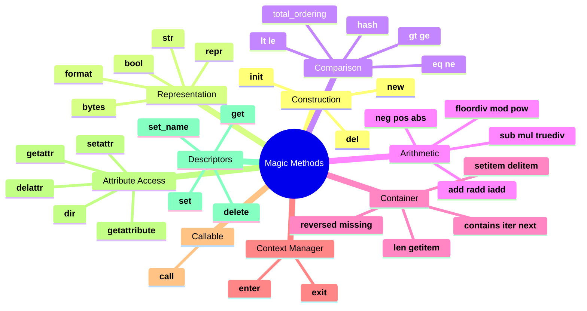

> [!tip] Prerequisite
> Read [[classes-and-objects]] for `__init__` / `__new__` basics, and [[methods]] for how methods dispatch. This note is the **catalog**: a tour of every category of magic method, with worked examples.

## 1. What Are Magic Methods?

Magic methods (a.k.a. **dunder methods** — *d*ouble *under*score) are special methods whose names begin and end with `__`. Python calls them **implicitly** in response to language syntax or built-in functions:

- `len(obj)` calls `obj.__len__()`.
- `obj + other` calls `obj.__add__(other)`.
- `for x in obj` calls `obj.__iter__()` (or falls back to `__getitem__`).
- `with obj as x:` calls `obj.__enter__()` and `obj.__exit__(...)`.
- `print(obj)` calls `obj.__str__()`.
- `repr(obj)` calls `obj.__repr__()`.

> [!note] Why "dunder"?
> "Dunder" is shorthand for "double underscore". The community says "dunder init" rather than "underscore underscore init underscore underscore". `__init__` is dunder-init; `__add__` is dunder-add. The convention is read in lower-case.

> [!warning] Never invent your own dunder names
> Names like `__my_thing__` are reserved for Python's future use. They won't break today, but they may shadow a future language feature. For private attributes, use `_single_leading_underscore` (convention) or `__double_leading` (name-mangling — see [[encapsulation]]).

## 2. Catalog Overview



## 3. Construction & Initialization

Already covered in [[classes-and-objects]]. Recap:

| Method     | Called by                 | Returns                  | Purpose                       |
| ---------- | ------------------------- | ------------------------ | ----------------------------- |
| `__new__`  | `type.__call__`           | new instance             | Allocate (override for immutables, singletons, interning) |
| `__init__` | `type.__call__` (after `__new__`) | `None`            | Configure the instance        |
| `__del__`  | GC / refcount → 0         | `None`                   | Best-effort finalization (don't rely on it) |

```python
class Singleton:
    _instance: "Singleton | None" = None

    def __new__(cls):
        if cls._instance is None:
            cls._instance = super().__new__(cls)
        return cls._instance

a, b = Singleton(), Singleton()
print(a is b)    # True
```

## 4. String Representation

### 4.1 `__repr__` vs `__str__`

- `__repr__` — **developer-facing**, ideally unambiguous and reproducible: `eval(repr(obj)) == obj`.
- `__str__` — **user-facing**, human-readable. Falls back to `__repr__` if not defined.

```python
class Point:
    def __init__(self, x: float, y: float) -> None:
        self.x, self.y = x, y

    def __repr__(self) -> str:
        return f"Point(x={self.x!r}, y={self.y!r})"

    def __str__(self) -> str:
        return f"({self.x}, {self.y})"

p = Point(1.5, 2.5)
print(repr(p))   # Point(x=1.5, y=2.5)
print(str(p))    # (1.5, 2.5)
print(f"{p!r}")  # Point(x=1.5, y=2.5)   ← !r forces repr in f-strings
print(f"{p}")    # (1.5, 2.5)
```

> [!tip] Always define `__repr__`; skip `__str__` if you're unsure
> `__str__` falls back to `__repr__`. The reverse isn't true. If you only have time for one, make it `__repr__`.

### 4.2 `__format__`

Called by `format(obj, spec)` and by f-strings (`f"{obj:spec}"`):

```python
class Color:
    def __init__(self, r: int, g: int, b: int) -> None:
        self.r, self.g, self.b = r, g, b

    def __format__(self, spec: str) -> str:
        if spec == "":
            return f"#{self.r:02x}{self.g:02x}{self.b:02x}"
        if spec == "rgb":
            return f"rgb({self.r}, {self.g}, {self.b})"
        if spec == "tuple":
            return f"({self.r}, {self.g}, {self.b})"
        raise ValueError(f"Unknown format spec {spec!r}")

c = Color(255, 128, 0)
print(f"{c}")        # #ff8000
print(f"{c:rgb}")    # rgb(255, 128, 0)
print(f"{c:tuple}")  # (255, 128, 0)
```

### 4.3 `__bool__`

Called by `bool(obj)`, `if obj:`, `while obj:`, and other truthiness checks:

```python
class Stack:
    def __init__(self) -> None:
        self._items: list[int] = []

    def push(self, x: int) -> None:
        self._items.append(x)

    def __bool__(self) -> bool:
        return bool(self._items)

s = Stack()
if not s:                  # True (empty)
    print("Empty")
s.push(1)
if s:                      # True (non-empty)
    print("Has items")
```

> [!note] Fallback
> If `__bool__` is missing, Python falls back to `__len__` (`0` is falsy). If neither is defined, the object is truthy.

## 5. Comparison & Hashing

### 5.1 The rich-comparison methods

| Method  | Expression  |
| ------- | ----------- |
| `__eq__`  | `a == b`    |
| `__ne__`  | `a != b` (defaults to negating `__eq__`) |
| `__lt__`  | `a < b`     |
| `__le__`  | `a <= b`    |
| `__gt__`  | `a > b`     |
| `__ge__`  | `a >= b`    |

Each returns a boolean, or `NotImplemented` (the *type*, not the exception) to let Python try the reflected method.

```python
from __future__ import annotations
from functools import total_ordering


@total_ordering
class Version:
    def __init__(self, major: int, minor: int, patch: int = 0) -> None:
        self.major, self.minor, self.patch = major, minor, patch

    def __eq__(self, other: object) -> bool:
        if not isinstance(other, Version):
            return NotImplemented
        return (self.major, self.minor, self.patch) == \
               (other.major, other.minor, other.patch)

    def __lt__(self, other: "Version") -> bool:
        if not isinstance(other, Version):
            return NotImplemented
        return (self.major, self.minor, self.patch) < \
               (other.major, other.minor, other.patch)

    def __repr__(self) -> str:
        return f"Version({self.major}, {self.minor}, {self.patch})"


print(Version(1, 2) == Version(1, 2, 0))   # True
print(Version(1, 2) < Version(1, 3))       # True
print(Version(2, 0) >= Version(1, 9))      # True   ← filled in by @total_ordering
print(Version(1, 0) != Version(2, 0))      # True
```

> [!tip] `functools.total_ordering`
> Define `__eq__` and **one** of `__lt__`, `__le__`, `__gt__`, `__ge__`, and the decorator fills in the rest. Huge boilerplate reducer.

### 5.2 `__hash__` and the `__eq__` contract

> [!danger] Critical contract
> If you override `__eq__`, Python **automatically sets `__hash__ = None`**, making instances unhashable. To stay hashable, you must explicitly define `__hash__` so that **equal objects have equal hashes**.

```python
class Money:
    def __init__(self, amount: int, currency: str) -> None:
        self.amount = amount
        self.currency = currency

    def __eq__(self, other: object) -> bool:
        if not isinstance(other, Money):
            return NotImplemented
        return self.amount == other.amount and self.currency == other.currency

    def __hash__(self) -> int:
        return hash((self.amount, self.currency))

    def __repr__(self) -> str:
        return f"Money({self.amount}, {self.currency!r})"


a = Money(100, "USD")
b = Money(100, "USD")
print(a == b)           # True
print(hash(a) == hash(b))   # True
print(len({a, b}))      # 1   ← deduplicated in a set
```

### 5.3 The reflexive, symmetric, transitive expectations

Python's data model assumes:

- `a == a` is `True` (reflexive).
- `a == b` implies `b == a` (symmetric).
- `a == b and b == c` implies `a == c` (transitive).
- `a == b` implies `hash(a) == hash(b)` (consistency with hash).
- (For ordering) `a < b and b < c` implies `a < c`.

Violating these will produce subtle bugs in `set`, `dict`, `sorted`, `bisect`, etc.

## 6. Arithmetic Operators

Each arithmetic operator has **three** forms:

| Operator | Forward           | Reflected         | In-place          |
| -------- | ----------------- | ----------------- | ----------------- |
| `+`      | `__add__`         | `__radd__`        | `__iadd__`        |
| `-`      | `__sub__`         | `__rsub__`        | `__isub__`        |
| `*`      | `__mul__`         | `__rmul__`        | `__imul__`        |
| `/`      | `__truediv__`     | `__rtruediv__`    | `__itruediv__`    |
| `//`     | `__floordiv__`    | `__rfloordiv__`   | `__ifloordiv__`   |
| `%`      | `__mod__`         | `__rmod__`        | `__imod__`        |
| `**`     | `__pow__`         | `__rpow__`        | `__ipow__`        |

Plus unary: `__neg__` (`-x`), `__pos__` (`+x`), `__abs__` (`abs(x)`), `__invert__` (`~x`).

### 6.1 Forward and reflected

When you write `a + b`:
1. Python calls `a.__add__(b)`.
2. If that returns `NotImplemented`, Python tries `b.__radd__(a)`.

This is how `1 + Fraction(1, 2)` works: `int.__add__(1, Fraction(...))` returns `NotImplemented`, then `Fraction.__radd__` does the work.

```python
from __future__ import annotations
from numbers import Number


class Scalar:
    def __init__(self, value: float) -> None:
        self.value = value

    def __repr__(self) -> str:
        return f"Scalar({self.value!r})"

    def __add__(self, other: object) -> "Scalar":
        if isinstance(other, Scalar):
            return Scalar(self.value + other.value)
        if isinstance(other, Number):
            return Scalar(self.value + other)
        return NotImplemented

    __radd__ = __add__        # symmetric: x + scalar == scalar + x

    def __mul__(self, other: object) -> "Scalar":
        if isinstance(other, Scalar):
            return Scalar(self.value * other.value)
        if isinstance(other, Number):
            return Scalar(self.value * other)
        return NotImplemented

    __rmul__ = __mul__


s = Scalar(2.0)
print(s + 3)         # Scalar(5.0)   ← __add__
print(3 + s)         # Scalar(5.0)   ← __radd__  (because int.__add__ returns NotImplemented)
print(s * 4)         # Scalar(8.0)
print(4 * s)         # Scalar(8.0)
```

### 6.2 In-place operators

`a += b` first tries `a.__iadd__(b)`; if that's missing or returns `NotImplemented`, it falls back to `a = a + b` (using `__add__`).

```python
class Vector:
    def __init__(self, *coords: float) -> None:
        self.coords = list(coords)

    def __repr__(self) -> str:
        return f"Vector{tuple(self.coords)}"

    def __add__(self, other: object) -> "Vector":
        if isinstance(other, Vector) and len(other) == len(self):
            return Vector(*(a + b for a, b in zip(self.coords, other.coords)))
        return NotImplemented

    def __iadd__(self, other: object) -> "Vector":
        if isinstance(other, Vector) and len(other) == len(self):
            for i, b in enumerate(other.coords):
                self.coords[i] += b
            return self          # ← must return self
        return NotImplemented


v = Vector(1, 2, 3)
v += Vector(4, 5, 6)
print(v)           # Vector(5, 7, 9)  (same object, mutated in place)
```

> [!warning] `__iadd__` must return `self`
> Python rebinds the name to whatever `__iadd__` returns. If you forget `return self`, `v += other` makes `v` become `None`.

## 7. Container & Sequence Protocol

Implement these to make your object behave like a list, dict, or set.

| Method         | Called by                                  |
| -------------- | ------------------------------------------ |
| `__len__`      | `len(obj)`                                 |
| `__getitem__`  | `obj[key]`, `obj[i]`, slicing, `for x in obj` fallback |
| `__setitem__`  | `obj[key] = value`                         |
| `__delitem__`  | `del obj[key]`                             |
| `__contains__` | `x in obj` (falls back to iteration)       |
| `__iter__`     | `iter(obj)`, `for x in obj`                |
| `__next__`      | `next(it)` (iterator objects)              |
| `__reversed__` | `reversed(obj)`                            |
| `__missing__`  | `dict` subclasses only: `obj[missing_key]` |

```python
from __future__ import annotations


class Matrix:
    """A 2-D matrix with `m[i, j]` indexing and iterable rows."""

    def __init__(self, rows: list[list[float]]) -> None:
        if not rows or not rows[0]:
            raise ValueError("Matrix must be non-empty")
        width = len(rows[0])
        if any(len(r) != width for r in rows):
            raise ValueError("All rows must have the same length")
        self._rows = [list(r) for r in rows]
        self.nrows = len(rows)
        self.ncols = width

    def __getitem__(self, key: tuple[int, int]) -> float:
        i, j = key
        if not (0 <= i < self.nrows and 0 <= j < self.ncols):
            raise IndexError(f"({i}, {j}) out of bounds for {self.nrows}x{self.ncols}")
        return self._rows[i][j]

    def __setitem__(self, key: tuple[int, int], value: float) -> None:
        i, j = key
        self._rows[i][j] = value

    def __len__(self) -> int:
        return self.nrows

    def __iter__(self):
        for row in self._rows:
            yield row

    def __contains__(self, value: float) -> bool:
        return any(value in row for row in self._rows)

    def __repr__(self) -> str:
        return "Matrix(\n  " + ",\n  ".join(repr(r) for r in self._rows) + "\n)"


m = Matrix([[1, 2, 3], [4, 5, 6]])
print(m[1, 2])         # 6
m[1, 2] = 99
print(m[1, 2])         # 99
print(len(m))          # 2
print([row for row in m])    # [[1, 2, 3], [4, 5, 99]]
print(5 in m)          # True
print(42 in m)         # False
```

### 7.1 Custom dict with `__missing__`

```python
class DefaultCounter(dict):
    """Like collections.defaultdict(int) but rolled by hand."""

    def __missing__(self, key):
        self[key] = 0
        return 0


c = DefaultCounter()
c["apple"] += 1
c["apple"] += 1
c["banana"] += 5
print(c)                # {'apple': 2, 'banana': 5}
```

### 7.2 Iterator objects vs. iterables

- An **iterable** implements `__iter__` (returns an iterator).
- An **iterator** implements `__iter__` (returns `self`) **and** `__next__` (returns next item or raises `StopIteration`).

```python
class Counter:
    """Iterable that counts from 0 to n-1 forever... no, up to n."""

    def __init__(self, n: int) -> None:
        self.n = n

    def __iter__(self) -> "CounterIterator":
        return CounterIterator(self.n)


class CounterIterator:
    def __init__(self, n: int) -> None:
        self.i = 0
        self.n = n

    def __iter__(self) -> "CounterIterator":
        return self        # iterators are iterable

    def __next__(self) -> int:
        if self.i >= self.n:
            raise StopIteration
        v = self.i
        self.i += 1
        return v


for x in Counter(3):
    print(x)              # 0, 1, 2
```

## 8. Context Managers

Implement `__enter__` and `__exit__` to support `with`:

```python
class Timer:
    def __enter__(self) -> "Timer":
        import time
        self.start = time.perf_counter()
        return self

    def __exit__(self, exc_type, exc, tb) -> bool | None:
        import time
        self.elapsed = time.perf_counter() - self.start
        print(f"Elapsed: {self.elapsed:.6f}s")
        # Return True to suppress the exception (rarely what you want).
        return None


with Timer() as t:
    sum(range(1_000_000))
# Elapsed: 0.023xxx s
```

> [!warning] `__exit__` semantics
> Returning a truthy value from `__exit__` *suppresses* the exception that occurred inside the `with` block. Almost always return `None`/`False`. Suppress only when you genuinely want to swallow the exception (e.g., a transaction rollback that should look successful).

For modern Python, also consider `contextlib.contextmanager` for a generator-based style:

```python
from contextlib import contextmanager
import time

@contextmanager
def timer():
    start = time.perf_counter()
    try:
        yield
    finally:
        print(f"Elapsed: {time.perf_counter() - start:.6f}s")

with timer():
    sum(range(1_000_000))
```

## 9. Callable Objects: `__call__`

Make an instance behave like a function:

```python
class Multiplier:
    def __init__(self, factor: float) -> None:
        self.factor = factor

    def __call__(self, x: float) -> float:
        return x * self.factor


double = Multiplier(2.0)
triple = Multiplier(3.0)

print(double(5))      # 10.0
print(triple(5))      # 15.0
print(callable(double))    # True
```

> [!tip] When to use `__call__`
> Use it when an object has *one primary action* that should feel like a function call. Examples: stateful function objects, ML model inference (`model(x)`), middleware decorators, strategy objects. Avoid it when the action is ambiguous — a regular named method is clearer.

## 10. Attribute Access Hooks

These let you intercept attribute access globally on a class. Use carefully — they're powerful and easy to get wrong.

| Method              | Called by                            | Typical use                                |
| ------------------- | ------------------------------------ | ------------------------------------------ |
| `__getattribute__`  | Every `obj.x` access                 | Audit, lazy loading (be careful: infinite recursion risk) |
| `__getattr__`       | Only when normal lookup fails        | Defaults, dynamic attributes, proxies      |
| `__setattr__`       | Every `obj.x = v`                    | Validation, immutability enforcement       |
| `__delattr__`       | `del obj.x`                          | Same                                       |

```python
class Strict:
    """Only attributes declared in __init__ may exist."""

    def __init__(self) -> None:
        # Bypass __setattr__ for the initial set
        object.__setattr__(self, "x", 0)

    def __setattr__(self, name: str, value: object) -> None:
        if name not in {"x"}:
            raise AttributeError(f"Cannot set unknown attribute {name!r}")
        object.__setattr__(self, name, value)

    def __getattr__(self, name: str) -> object:
        # Only called if normal lookup fails.
        if name == "description":
            return f"Strict(x={self.x})"
        raise AttributeError(name)


s = Strict()
s.x = 5
print(s.x)             # 5
print(s.description)   # Strict(x=5)
try:
    s.y = 10           # AttributeError: Cannot set unknown attribute 'y'
except AttributeError as e:
    print(e)
```

> [!danger] `__getattribute__` recursion trap
> ```python
> class Bad:
>     def __getattribute__(self, name):
>         return self.name     # ❌ self.name calls __getattribute__ again → infinite recursion
> ```
> Inside `__getattribute__`, always use `object.__getattribute__(self, name)` to read attributes.

## 11. Descriptors: `__get__`, `__set__`, `__delete__`, `__set_name__`

Descriptors power `@property`, `@classmethod`, `@staticmethod`, and most "field" libraries (`attrs`, `pydantic`, Django ORM fields, SQLAlchemy columns).

A **descriptor** is any object that defines `__get__`, `__set__`, or `__delete__`. If it defines `__get__` *and* `__set__`, it's a **data descriptor** and wins over instance `__dict__`. If only `__get__`, it's a **non-data descriptor** (like functions).

```python
class Validated:
    """A reusable descriptor that validates on set."""

    def __init__(self, *, min_value: int | None = None, max_value: int | None = None) -> None:
        self.min_value = min_value
        self.max_value = max_value
        self._name: str = ""    # filled in by __set_name__

    def __set_name__(self, owner: type, name: str) -> None:
        self._name = name
        self._private = f"_{name}"

    def __get__(self, instance: object, owner: type) -> object:
        if instance is None:
            return self
        return getattr(instance, self._private, None)

    def __set__(self, instance: object, value: int) -> None:
        if self.min_value is not None and value < self.min_value:
            raise ValueError(f"{self._name} must be >= {self.min_value}")
        if self.max_value is not None and value > self.max_value:
            raise ValueError(f"{self._name} must be <= {self.max_value}")
        setattr(instance, self._private, value)


class Player:
    level = Validated(min_value=1, max_value=99)
    hp    = Validated(min_value=0, max_value=9999)

    def __init__(self, level: int, hp: int) -> None:
        self.level = level
        self.hp = hp


p = Player(level=5, hp=100)
print(p.level)         # 5
p.level = 50
print(p.level)         # 50
try:
    p.level = 0        # ValueError: level must be >= 1
except ValueError as e:
    print(e)
```

> [!note] `__set_name__` was added in 3.6
> Before 3.6, descriptor authors had to scan the class's `__dict__` to learn the attribute name. `__set_name__` is called automatically at class creation time, giving the descriptor its own name.

## 12. Capstone: A Fully-Featured `Vector` Class

This example pulls together construction, representation, comparison, arithmetic, container, and iteration:

```python
from __future__ import annotations
from functools import total_ordering
from collections.abc import Iterable


@total_ordering
class Vector:
    """An n-dimensional vector supporting arithmetic, comparison, and iteration."""

    __slots__ = ("_coords",)        # memory-efficient, no __dict__

    def __init__(self, *coords: float) -> None:
        if not coords:
            raise ValueError("Vector requires at least one coordinate")
        self._coords = tuple(float(c) for c in coords)

    # --- representation ---
    def __repr__(self) -> str:
        return f"Vector{self._coords}"

    def __str__(self) -> str:
        return f"[{', '.join(str(c) for c in self._coords)}]"

    def __format__(self, spec: str) -> str:
        if spec == "csv":
            return ",".join(str(c) for c in self._coords)
        return str(self)

    def __bool__(self) -> bool:
        return any(c != 0 for c in self._coords)

    # --- container & iteration ---
    def __len__(self) -> int:
        return len(self._coords)

    def __getitem__(self, index: int | slice) -> float | "Vector":
        if isinstance(index, slice):
            return Vector(*self._coords[index])
        return self._coords[index]

    def __iter__(self):
        return iter(self._coords)

    def __contains__(self, value: float) -> bool:
        return value in self._coords

    # --- comparison ---
    def __eq__(self, other: object) -> bool:
        if not isinstance(other, Vector):
            return NotImplemented
        return self._coords == other._coords

    def __lt__(self, other: "Vector") -> bool:
        if not isinstance(other, Vector):
            return NotImplemented
        if len(self) != len(other):
            raise ValueError("Cannot compare Vectors of different dimensions")
        return self._coords < other._coords

    def __hash__(self) -> int:
        return hash(self._coords)

    # --- arithmetic ---
    def _check_same_dim(self, other: "Vector") -> None:
        if len(self) != len(other):
            raise ValueError("Dimension mismatch")

    def __add__(self, other: object) -> "Vector":
        if isinstance(other, Vector):
            self._check_same_dim(other)
            return Vector(*(a + b for a, b in zip(self, other)))
        return NotImplemented

    __radd__ = __add__

    def __sub__(self, other: object) -> "Vector":
        if isinstance(other, Vector):
            self._check_same_dim(other)
            return Vector(*(a - b for a, b in zip(self, other)))
        return NotImplemented

    def __mul__(self, other: object) -> "Vector":
        """Scalar multiplication: `v * 3` or `v * other_vector` (cross for 3D)."""
        if isinstance(other, (int, float)):
            return Vector(*(c * other for c in self))
        if isinstance(other, Vector):
            # element-wise (or dot product — choose one; we do element-wise here)
            self._check_same_dim(other)
            return Vector(*(a * b for a, b in zip(self, other)))
        return NotImplemented

    __rmul__ = __mul__

    def __neg__(self) -> "Vector":
        return Vector(*(-c for c in self))

    def __abs__(self) -> float:
        import math
        return math.sqrt(sum(c * c for c in self))

    # --- in-place ---
    def __iadd__(self, other: object) -> "Vector":
        if isinstance(other, Vector):
            self._check_same_dim(other)
            self._coords = tuple(a + b for a, b in zip(self, other))
            return self
        return NotImplemented


# --- Try it all ---
v = Vector(1, 2, 3)
w = Vector(4, 5, 6)
print(repr(v))         # Vector(1.0, 2.0, 3.0)
print(v + w)           # Vector(5.0, 7.0, 9.0)
print(v * 2)           # Vector(2.0, 4.0, 6.0)
print(2 * v)           # Vector(2.0, 4.0, 6.0)   ← __rmul__
print(-v)              # Vector(-1.0, -2.0, -3.0)
print(abs(v))          # 3.7416573867739413
print(len(v))          # 3
print(list(v))         # [1.0, 2.0, 3.0]
print(v[1])            # 2.0
print(v < w)           # True
print(v == Vector(1, 2, 3))   # True
print(hash(v) == hash(Vector(1, 2, 3)))   # True
print(bool(Vector(0, 0)))     # False
print(f"{v:csv}")      # 1.0,2.0,3.0
v += w
print(repr(v))         # Vector(5.0, 7.0, 9.0)
```

## 13. Common Pitfalls

> [!warning] `__hash__` must be consistent with `__eq__`
> If `a == b`, then `hash(a) == hash(b)` *must* hold. Violating this corrupts sets and dicts.

> [!warning] Don't make objects mutable *and* hashable
> If `a` is in a `set` and you mutate a field that contributes to `hash(a)`, the set can no longer find it. Either make hashable objects immutable (use `frozen=True` dataclasses — see [[dataclasses-and-attrs]]), or compute the hash from immutable parts only.

> [!warning] `__eq__` should return `NotImplemented`, not `False`, for unknown types
> Returning `NotImplemented` lets Python try the reflected operation, which may know how to compare.

> [!warning] Don't implement `__eq__` without `__hash__`
> If you define `__eq__`, instances become unhashable unless you also define `__hash__`.

> [!warning] `__getattr__` vs `__getattribute__`
> `__getattr__` is called only when normal lookup fails — safe and convenient. `__getattribute__` is called for *every* access — powerful but risky (recursion!).

> [!warning] `__repr__` should be unambiguous
> `__repr__ = "Some object"` is unhelpful. Aim for `ClassName(arg1=value1, ...)` so debuggers and tracebacks are useful.

> [!warning] Returning `self` from `__iadd__`/`__iexit__` is mandatory
> In-place operators must return the (mutated) instance. Forgetting this silently replaces the variable with `None`.

## 14. Key Takeaways

> [!tip] In five sentences
> 1. **Dunder methods** are Python's operator-overloading mechanism; the language calls them implicitly based on syntax.
> 2. Start with `__repr__` and `__eq__`/`__hash__` for any value class — that covers most day-to-day needs.
> 3. Use `functools.total_ordering` to define all four comparison operators from `__eq__` and one ordering method.
> 4. Forward → reflected → in-place is the arithmetic dispatch chain; return `NotImplemented` to delegate.
> 5. Descriptors (`__get__`/`__set__`/`__set_name__`) are the *engine* behind `@property`, `@classmethod`, and field libraries — learning them unlocks the entire Python "magic" ecosystem.

## 15. Practice Exercises

> [!example] Easy
> 1. Add `__str__` and `__repr__` to a `Book(title, author)` class. Verify that `print(b)` and `repr(b)` produce different outputs.
> 2. Make a `Temperature` class hashable and comparable. Two equal temperatures must hash equally; verify with `len({t1, t2})`.

> [!example] Medium
> 3. Implement a `Fraction` class with `__add__`, `__sub__`, `__mul__`, `__truediv__`, `__eq__`, `__repr__`, and `__hash__`. Include a reflected operator so `2 * Fraction(1, 3)` works.
> 4. Add `__iadd__` to your `Vector` and verify that `v += w` mutates `v` in place (use `id()` to confirm).
> 5. Build a `RomanNumeral` class with `__int__` (returns the integer value) and `__str__` (returns "XIV" etc.). Make `RomanNumeral("XIV") + 1` return an `int`.

> [!example] Hard
> 6. Implement a `Matrix` class supporting `m @ n` (matrix multiplication via `__matmul__`), `__getitem__` with `(i, j)` tuples and `[i]` row access, `__iter__` (rows), `__eq__`, and `__repr__` aligned for readability.
> 7. Write a `Reactor` class whose `__enter__`/`__exit__` start and stop a simulated reactor, and whose `__exit__` returns `True` only when the exception is `Reactor.SafeShutdown`. Test by triggering exceptions inside `with Reactor():` blocks.
> 8. Build a `LazyAttribute` descriptor that calls a builder function on first access and caches the result on the instance. Use it to declare `expensive_value = LazyAttribute(lambda self: compute())` on a class, and verify the builder runs only once per instance.

## 16. Related Notes

- [[classes-and-objects]] — `__new__`, `__init__`, lifecycle
- [[methods]] — descriptors make methods *and* properties work
- [[properties]] — `property` is a built-in descriptor
- [[dataclasses-and-attrs]] — `@dataclass` generates `__init__`, `__repr__`, `__eq__` for you
- [[encapsulation]] — using `__setattr__` to enforce invariants
- [[inheritance]] — overriding dunders in subclasses
- [[polymorphism]] — dunder methods are *how* Python achieves ad-hoc polymorphism
