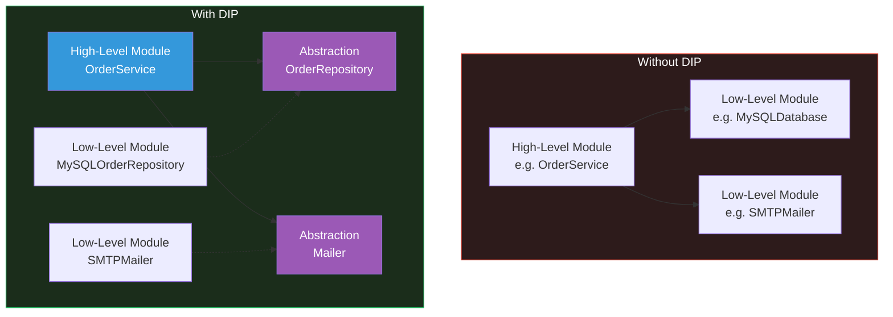
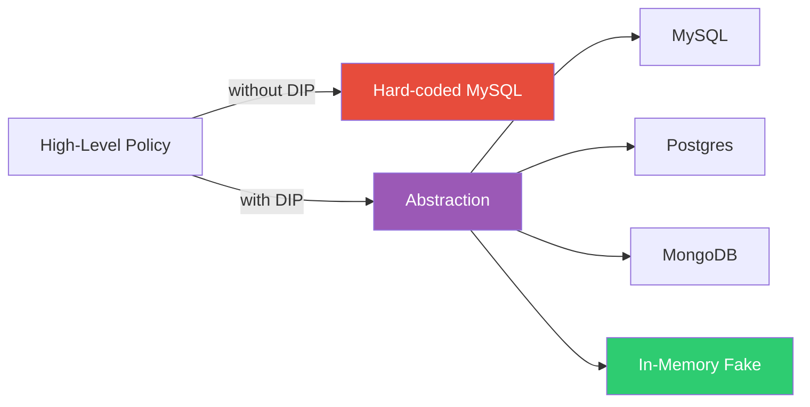
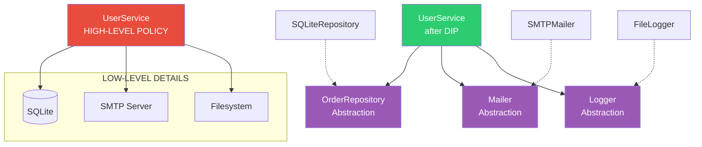
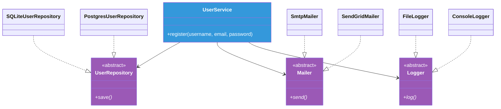
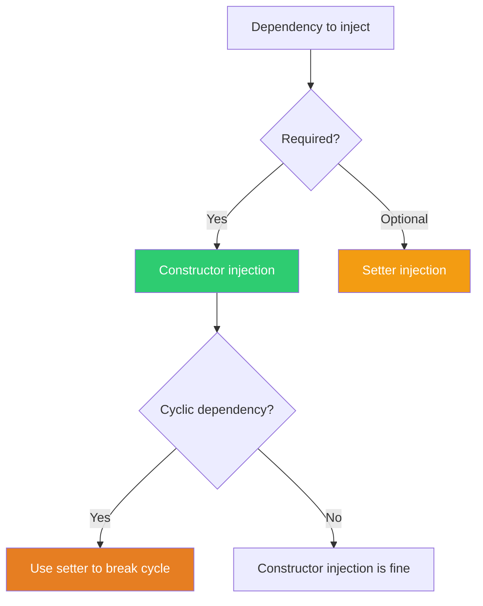
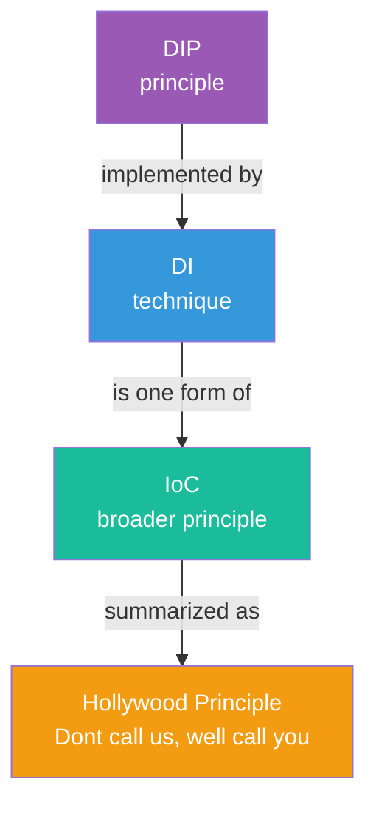
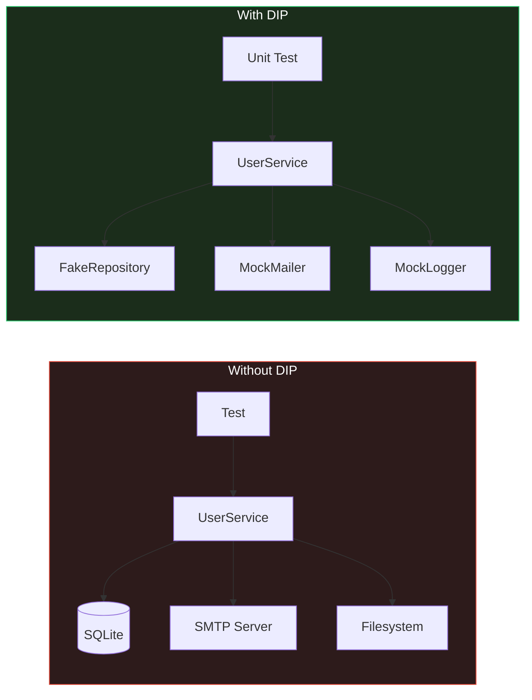
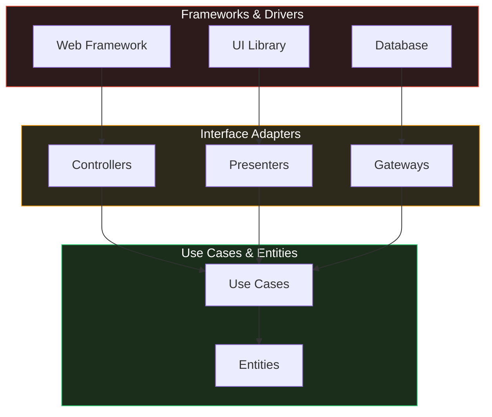
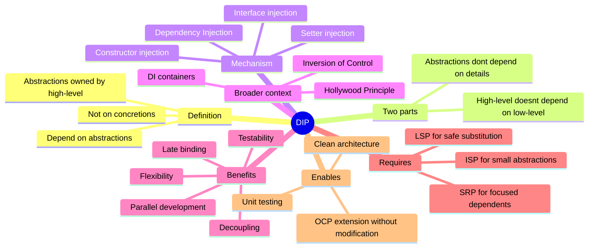

# Dependency Inversion Principle (DIP)

#oop #solid #dip #dependency-injection #ioc #hollywood-principle #teaching #deep-dive

> [!quote] Robert C. Martin
> "A. High-level modules should not depend on low-level modules. Both should depend on abstractions.
> B. Abstractions should not depend on details. Details should depend on abstractions."

The **Dependency Inversion Principle** is the *D* of [[SOLID-Overview|SOLID]]. It is the most architectural of the five — while [[Single-Responsibility|SRP]] is about a single class and [[Liskov-Substitution|LSP]] is about a single inheritance relationship, DIP is about the *direction of dependencies across an entire system*. Get DIP right and your system becomes flexible, testable, and resistant to rot. Get it wrong and your "high-level policy" becomes a hostage to your "low-level details."

This note unpacks DIP in depth: the two-part definition, what "inversion" means, the canonical `UserService` example (depending on `SMTPMailer` and `MySQLDatabase`) with full before/after Python code, the three forms of Dependency Injection (constructor, setter, interface), Inversion of Control vs Dependency Injection, the Hollywood Principle, DI containers, and the testing benefits that make DIP the foundation of unit-testable code.

Prerequisites: [[Abstraction]], [[Polymorphism]], [[Classes-And-Objects]]. Read [[SOLID-Overview]], [[Open-Closed]], and [[Interface-Segregation]] first.

---

## 1. The Principle, In Two Parts

Robert C. Martin's formulation of DIP has two clauses, and both matter.

### 1.1 Part A: High-level Modules Should Not Depend on Low-level Modules. Both Should Depend on Abstractions.

**High-level modules** are the parts of your system that contain the business policy — the *what* the system does. `OrderService`, `PaymentProcessor`, `UserAuthenticator` are high-level: they encode the rules that matter to the business.

**Low-level modules** are the parts that handle details — the *how*. `MySQLDatabase`, `SMTPMailer`, `RedisCache`, `FileLogger` are low-level: they handle infrastructure.

In a poorly designed system, high-level modules depend directly on low-level modules. `OrderService` imports `MySQLDatabase` and calls `db.execute(...)`. The result is that every change to the database (a low-level detail) ripples into `OrderService` (a high-level policy). The tail wags the dog.

DIP says: invert this. Both high-level and low-level modules should depend on **abstractions** — interfaces defined by the high-level module. The high-level module owns the abstraction; the low-level module implements it.



### 1.2 Part B: Abstractions Should Not Depend on Details. Details Should Depend on Abstractions.

The **abstraction** (the interface) should not mention anything specific to a detail. A `Mailer` abstraction should not have a method `send_via_smtp`; it should have a method `send`. The SMTP-specific knowledge belongs in the `SMTPMailer` implementation, not in the abstraction.

This clause is what makes the abstraction *reusable*. If the abstraction mentions SMTP, you cannot implement it with SendGrid, Mailgun, or a fake mailer for testing — every implementation must speak SMTP. By keeping the abstraction clean of details, you make it open to any implementation ([[Open-Closed|OCP]]).

### 1.3 The "Inversion"

The word "inversion" in DIP refers to the *direction* of the dependency. In traditional procedural design, dependencies point from high-level policy to low-level detail (the policy calls the detail). In DIP, dependencies point from low-level detail to high-level abstraction (the detail implements the abstraction owned by the policy).

The inversion is not of control flow (the high-level module still calls the low-level module at runtime), but of *source-code dependency*. The high-level module's source code does not mention the low-level module at all; the low-level module's source code mentions the high-level module's abstraction.

---

## 2. Why DIP Matters

### 2.1 Decoupling

Without DIP, high-level policy is coupled to low-level detail. Change the database schema, and `OrderService` breaks. Change the email provider, and `UserService` breaks. The system is rigid.

With DIP, high-level policy depends only on abstractions. The database schema can change (the `MySQLRepository` implementation changes, but the `OrderRepository` abstraction does not). The email provider can change (the `SMTPMailer` is replaced with `SendGridMailer`, but the `Mailer` abstraction is unchanged). The high-level policy is insulated.

### 2.2 Testability

Without DIP, testing high-level modules requires setting up real infrastructure: a database, an SMTP server, a Redis instance. The test setup is slow, fragile, and hard to run in CI.

With DIP, testing high-level modules requires only providing lightweight *fakes* or *mocks* of the abstractions. A test for `OrderService` provides a `FakeOrderRepository` and a `FakeMailer` — both pure Python objects — and runs in milliseconds. This is the foundation of unit testing.

### 2.3 Flexibility

Without DIP, swapping implementations is invasive. Switching from MySQL to PostgreSQL means editing every line that constructs a `MySQLDatabase`.

With DIP, swapping implementations is a one-line change: inject `PostgresRepository` instead of `MySQLRepository`. The high-level policy is unchanged.

### 2.4 Parallel Development

Without DIP, the team writing `OrderService` cannot start until the team writing `MySQLDatabase` finishes (or at least stabilizes its API).

With DIP, both teams can work in parallel. The `OrderService` team writes against the `OrderRepository` abstraction; the database team writes `MySQLOrderRepository` against the same abstraction. They integrate at the end.

### 2.5 Late Binding

Without DIP, the implementation is fixed at compile time (or import time in Python). The choice of database, mailer, or cache is hard-coded.

With DIP, the implementation is chosen at runtime. A configuration file or DI container decides which implementations to use. This enables plugins, A/B testing, and feature flags.



---

## 3. The Canonical Violation: `UserService`

Let's work through the textbook DIP violation.

### 3.1 The Violation

```python
# bad_user_service.py
import smtplib
import sqlite3
import hashlib
import json


class UserService:
    """
    A high-level service that handles user registration.
    Directly depends on concrete SMTPMailer, MySQLDatabase, and FileLogger.
    """

    def __init__(self, db_path: str, smtp_host: str, log_file: str):
        self._db_path = db_path
        self._smtp_host = smtp_host
        self._log_file = log_file

    def register(self, username: str, email: str, password: str) -> None:
        # Hash the password
        hashed = hashlib.sha256(password.encode()).hexdigest()

        # Save to MySQL — direct dependency on sqlite3
        conn = sqlite3.connect(self._db_path)
        try:
            conn.execute(
                "INSERT INTO users (username, email, password_hash) VALUES (?, ?, ?)",
                (username, email, hashed),
            )
            conn.commit()
        finally:
            conn.close()

        # Send welcome email — direct dependency on smtplib
        server = smtplib.SMTP(self._smtp_host)
        try:
            server.sendmail(
                "welcome@example.com",
                email,
                f"Welcome, {username}!",
            )
        finally:
            server.quit()

        # Log the registration — direct dependency on filesystem
        with open(self._log_file, "a") as f:
            f.write(json.dumps({
                "event": "user_registered",
                "username": username,
                "email": email,
            }) + "\n")
```

### 3.2 The Problems

1. **High-level policy is coupled to low-level details.** `UserService.register` knows about SQLite, SMTP, and the filesystem. Any change to any of these ripples into `UserService`.
2. **Testing is painful.** To test `register`, you need a real SQLite database, a real SMTP server, and a writable filesystem. Most teams skip the test entirely.
3. **Swapping implementations is invasive.** Switching to PostgreSQL, SendGrid, or a logging service requires editing `UserService`.
4. **Parallel development is impossible.** If the database team is still working on the schema, `UserService` cannot be tested.
5. **DIP violations usually come with SRP violations.** `UserService` is doing user logic, SQL, email, and logging — four responsibilities.



### 3.3 The Refactor: Introduce Abstractions

```python
# good_user_service.py
from abc import ABC, abstractmethod
import hashlib


# --- Abstractions owned by the high-level module ---
class UserRepository(ABC):
    @abstractmethod
    def save(self, username: str, email: str, password_hash: str) -> None: ...


class Mailer(ABC):
    @abstractmethod
    def send(self, to: str, subject: str, body: str) -> None: ...


class Logger(ABC):
    @abstractmethod
    def log(self, event: str, **fields) -> None: ...


# --- High-level module: depends only on abstractions ---
class UserService:
    def __init__(
        self,
        repository: UserRepository,
        mailer: Mailer,
        logger: Logger,
    ):
        self._repository = repository
        self._mailer = mailer
        self._logger = logger

    def register(self, username: str, email: str, password: str) -> None:
        password_hash = hashlib.sha256(password.encode()).hexdigest()

        self._repository.save(username, email, password_hash)
        self._mailer.send(email, "Welcome", f"Welcome, {username}!")
        self._logger.log("user_registered", username=username, email=email)


# --- Low-level modules: implement the abstractions ---
class SQLiteUserRepository(UserRepository):
    def __init__(self, db_path: str):
        self._db_path = db_path

    def save(self, username: str, email: str, password_hash: str) -> None:
        import sqlite3
        conn = sqlite3.connect(self._db_path)
        try:
            conn.execute(
                "INSERT INTO users (username, email, password_hash) VALUES (?, ?, ?)",
                (username, email, password_hash),
            )
            conn.commit()
        finally:
            conn.close()


class PostgresUserRepository(UserRepository):
    def __init__(self, dsn: str):
        self._dsn = dsn

    def save(self, username: str, email: str, password_hash: str) -> None:
        import psycopg2
        conn = psycopg2.connect(self._dsn)
        try:
            with conn.cursor() as cur:
                cur.execute(
                    "INSERT INTO users (username, email, password_hash) VALUES (%s, %s, %s)",
                    (username, email, password_hash),
                )
            conn.commit()
        finally:
            conn.close()


class SmtpMailer(Mailer):
    def __init__(self, smtp_host: str, sender: str):
        self._smtp_host = smtp_host
        self._sender = sender

    def send(self, to: str, subject: str, body: str) -> None:
        import smtplib
        server = smtplib.SMTP(self._smtp_host)
        try:
            server.sendmail(self._sender, to, f"Subject: {subject}\n\n{body}")
        finally:
            server.quit()


class SendGridMailer(Mailer):
    def __init__(self, api_key: str):
        self._api_key = api_key

    def send(self, to: str, subject: str, body: str) -> None:
        import requests
        requests.post(
            "https://api.sendgrid.com/v3/mail/send",
            headers={"Authorization": f"Bearer {self._api_key}"},
            json={"personalizations": [{"to": [{"email": to}]}],
                  "subject": subject,
                  "content": [{"type": "text/plain", "value": body}]},
        )


class FileLogger(Logger):
    def __init__(self, path: str):
        self._path = path

    def log(self, event: str, **fields) -> None:
        import json
        with open(self._path, "a") as f:
            f.write(json.dumps({"event": event, **fields}) + "\n")


class ConsoleLogger(Logger):
    def log(self, event: str, **fields) -> None:
        print(f"[{event}] {fields}")
```

### 3.4 Wiring It Up

The choice of implementations is made at *composition time* — typically in a `main` function or a DI container:

```python
# main.py
def main():
    # Choose implementations
    repository = SQLiteUserRepository("/var/data/users.db")
    mailer = SmtpMailer("smtp.example.com", "welcome@example.com")
    logger = FileLogger("/var/log/users.log")

    # Inject them into the high-level service
    service = UserService(repository, mailer, logger)

    # Use the service
    service.register("alice", "alice@example.com", "secret")


if __name__ == "__main__":
    main()
```

To switch to PostgreSQL and SendGrid, change only `main`:

```python
def main():
    repository = PostgresUserRepository("postgresql://...")
    mailer = SendGridMailer("SG.xxxxx")
    logger = FileLogger("/var/log/users.log")

    service = UserService(repository, mailer, logger)
    service.register("alice", "alice@example.com", "secret")
```

`UserService` is unchanged. That is DIP in action.



### 3.5 What We Gained

- `UserService` no longer mentions SQLite, SMTP, or the filesystem.
- Testing `UserService` requires only lightweight fakes.
- Switching database or mailer implementations is a one-line change in `main`.
- Each implementation is independently testable.
- The abstractions (`UserRepository`, `Mailer`, `Logger`) are small and focused ([[Interface-Segregation|ISP]]-compliant).

### 3.6 What We Paid

- More classes, more files.
- A `main` function (or DI container) that wires everything together.
- An extra layer of indirection between `UserService.register` and the actual database call.

For a 50-line script, this is overhead. For a system that will live for years, this is the difference between maintainable and unmaintainable.

---

## 4. Dependency Injection (DI)

**Dependency Injection** is the technique by which DIP is most often implemented. The dependency (a low-level module) is *injected* into the dependent (a high-level module) by an external actor — typically the calling code or a DI container.

### 4.1 Three Forms of DI

There are three classic forms of dependency injection.

#### 4.1.1 Constructor Injection

The dependency is passed to the constructor. This is the most common form.

```python
class UserService:
    def __init__(self, repository: UserRepository, mailer: Mailer):
        self._repository = repository
        self._mailer = mailer

    def register(self, ...): ...
```

**Pros**: The dependency is required and visible in the constructor signature. The object is fully initialized after construction.

**Cons**: The constructor can become long if there are many dependencies. Changing a dependency requires constructing a new object.

#### 4.1.2 Setter Injection

The dependency is set via a method (often a property setter) after construction.

```python
class UserService:
    def __init__(self):
        self._repository = None
        self._mailer = None

    def set_repository(self, repository: UserRepository) -> None:
        self._repository = repository

    def set_mailer(self, mailer: Mailer) -> None:
        self._mailer = mailer

    def register(self, ...):
        if self._repository is None or self._mailer is None:
            raise RuntimeError("Dependencies not configured")
        ...
```

**Pros**: Dependencies can be changed at runtime. Optional dependencies are natural.

**Cons**: The object may be in a partially configured state. The dependencies are not visible in the constructor signature.

#### 4.1.3 Interface Injection

The dependency is injected via an interface method that the dependent implements. This is rare in Python but common in Java frameworks.

```python
class RepositoryUser:
    """Interface for classes that need a repository."""
    def inject_repository(self, repository: UserRepository) -> None:
        raise NotImplementedError


class UserService(RepositoryUser):
    def __init__(self):
        self._repository = None

    def inject_repository(self, repository: UserRepository) -> None:
        self._repository = repository
```

**Pros**: Very explicit about which dependencies a class accepts.

**Cons**: Verbose. Each dependency needs its own interface and injector method. Not idiomatic in Python.

### 4.2 Which Form to Use?

In Python, **constructor injection is the default choice**. It is clear, idiomatic, and makes dependencies visible. Use setter injection only when:

- The dependency is genuinely optional.
- The dependency must be changed after construction (e.g., for reconfiguration).
- The construction order is cyclic (use setter to break the cycle).



---

## 5. Inversion of Control (IoC) vs Dependency Injection (DI)

The terms **Inversion of Control** and **Dependency Injection** are often used interchangeably, but they are not the same thing.

### 5.1 Inversion of Control

**Inversion of Control** is a broad principle: *the framework calls the application, not the other way around*. A traditional program controls its own flow (`main` calls library functions). An IoC program hands control to a framework, which calls back into the program at appropriate points.

Examples of IoC:

- A web framework (Django, Flask) calls your view functions when HTTP requests arrive.
- A GUI framework (Tkinter, Qt) calls your event handlers when buttons are clicked.
- A test framework (pytest, unittest) calls your test functions.
- A DI container calls your constructors when it wires up the application.

### 5.2 Dependency Injection

**Dependency Injection** is one specific form of IoC: the dependencies of an object are provided (injected) by an external actor (the DI container), rather than the object constructing them itself.

```python
# Without DI: the object constructs its own dependencies
class UserService:
    def __init__(self):
        self._repository = MySQLRepository("localhost")  # object is in control
        self._mailer = SMTPMailer("smtp.example.com")

# With DI: the dependencies are provided externally
class UserService:
    def __init__(self, repository, mailer):  # container is in control
        self._repository = repository
        self._mailer = mailer
```

### 5.3 The Hollywood Principle

The **Hollywood Principle** — "Don't call us, we'll call you" — is the catchy version of IoC. The framework (Hollywood) does not want you to call it; it will call you when it needs you. Your job is to define the methods (hooks, callbacks, overrides) that the framework will invoke.

- In Django: you define `view` functions; Django calls them.
- In pytest: you define `test_*` functions; pytest calls them.
- In a DI container: you define classes with constructor parameters; the container instantiates them and injects the dependencies.

### 5.4 Summary of the Three Terms

| Term | Meaning |
|---|---|
| **DIP** | A *design principle*: depend on abstractions, not concretions. |
| **DI** | A *technique*: dependencies are provided externally, not constructed internally. |
| **IoC** | A *broader principle*: the framework controls the flow, calling into application code. |



---

## 6. DI Containers and Frameworks

A **DI container** (or IoC container) is a framework that constructs objects and wires their dependencies automatically. You register your classes and their interfaces with the container; the container figures out the dependency graph and instantiates everything in the right order.

### 6.1 A Minimal DI Container in Python

You can build a minimal DI container in a few dozen lines:

```python
# minimal_container.py
from typing import Type, TypeVar, Callable, Any

T = TypeVar("T")


class Container:
    def __init__(self):
        self._factories: dict[Type, Callable[[], Any]] = {}

    def register(self, interface: Type[T], factory: Callable[[], T]) -> None:
        self._factories[interface] = factory

    def resolve(self, interface: Type[T]) -> T:
        if interface not in self._factories:
            raise KeyError(f"No factory registered for {interface}")
        return self._factories[interface]()


# Usage
container = Container()
container.register(UserRepository, lambda: SQLiteUserRepository("/var/data/users.db"))
container.register(Mailer, lambda: SmtpMailer("smtp.example.com", "welcome@example.com"))
container.register(Logger, lambda: FileLogger("/var/log/users.log"))
container.register(
    UserService,
    lambda: UserService(
        container.resolve(UserRepository),
        container.resolve(Mailer),
        container.resolve(Logger),
    ),
)

service = container.resolve(UserService)
service.register("alice", "alice@example.com", "secret")
```

### 6.2 Real Python DI Frameworks

Several mature DI frameworks exist for Python:

- **`dependency-injector`** — A popular, full-featured DI framework with containers, providers, and configuration. Supports both runtime and "wired" DI.
- **`lagom`** — A lightweight DI framework that uses type hints to resolve dependencies automatically.
- **`injector`** — A Python port of the Java Guice framework. Uses decorators and bindings.
- **`punq`** — A simple, explicit DI container.
- **` FastAPI`'s `Depends`** — While not a general DI container, FastAPI's dependency injection system uses type hints to inject dependencies into request handlers.

### 6.3 Should You Use a DI Container?

For small applications, manual wiring in `main()` is sufficient. For large applications with hundreds of services, a DI container reduces boilerplate and centralizes configuration.

Reasons to use a DI container:

- Many services with many dependencies.
- Different configurations for different environments (dev, test, prod).
- Lazy initialization (only construct services when first used).
- Singleton, scoped, or transient lifecycles for services.

Reasons not to use a DI container:

- The application is small enough that manual wiring is readable.
- The team is unfamiliar with the framework.
- The "magic" of the container makes debugging harder.

> [!tip] Teaching Tip
> When teaching DIP, start with manual constructor injection. Show students that DIP is just "pass dependencies through the constructor." Only after they understand manual DI should you introduce containers — otherwise, the container looks like magic, and students do not understand what problem it solves.

---

## 7. The Testing Benefits of DIP

DIP is the foundation of unit-testable code. Without DIP, you cannot unit-test high-level modules in isolation; you can only integration-test them with real infrastructure.

### 7.1 Fakes and Mocks

With DIP, you can replace a real dependency with a **fake** (a lightweight, in-memory implementation) or a **mock** (an object that records calls and asserts on them).

```python
# test_user_service.py
from unittest.mock import MagicMock


class FakeUserRepository:
    """A lightweight, in-memory repository for tests."""
    def __init__(self):
        self.users = []

    def save(self, username, email, password_hash):
        self.users.append({
            "username": username,
            "email": email,
            "password_hash": password_hash,
        })


def test_register_saves_user_to_repository():
    repo = FakeUserRepository()
    mailer = MagicMock()
    logger = MagicMock()
    service = UserService(repo, mailer, logger)

    service.register("alice", "alice@example.com", "secret")

    assert len(repo.users) == 1
    assert repo.users[0]["username"] == "alice"
    assert repo.users[0]["email"] == "alice@example.com"


def test_register_sends_welcome_email():
    repo = FakeUserRepository()
    mailer = MagicMock()
    logger = MagicMock()
    service = UserService(repo, mailer, logger)

    service.register("alice", "alice@example.com", "secret")

    mailer.send.assert_called_once_with(
        "alice@example.com", "Welcome", "Welcome, alice!"
    )


def test_register_logs_event():
    repo = FakeUserRepository()
    mailer = MagicMock()
    logger = MagicMock()
    service = UserService(repo, mailer, logger)

    service.register("alice", "alice@example.com", "secret")

    logger.log.assert_called_once_with(
        "user_registered", username="alice", email="alice@example.com"
    )
```

### 7.2 What We Did Not Need

The tests did not need:

- A real SQLite database.
- A real SMTP server.
- A writable filesystem.
- Any external process or network call.

The tests run in milliseconds, can run in parallel, and can run in any environment (including CI without infrastructure).

### 7.3 The Unit vs Integration Distinction

A **unit test** exercises a single unit (a class, a function) in isolation, with its dependencies faked. An **integration test** exercises multiple units together, with real dependencies.

Without DIP, you cannot write unit tests — every test is an integration test, because every class is coupled to its real dependencies. With DIP, you can write fast unit tests for the high-level policy and reserve slow integration tests for the low-level implementations.



### 7.4 The Test Pyramid

The **test pyramid** (Mike Cohn, *Succeeding with Agile*) recommends many fast unit tests at the base, fewer integration tests in the middle, and very few end-to-end tests at the top. DIP enables the broad base of fast unit tests. Without DIP, the pyramid inverts (a "ice cream cone"): few unit tests, many slow integration tests, and a fragile, slow CI pipeline.

---

## 8. Who Owns the Abstraction?

A subtle but critical point: **the high-level module should own the abstraction**. The `OrderRepository` interface should be defined in the same module (or package) as `OrderService`, not in the database module.

### 8.1 The Wrong Way

```python
# database/repository.py — defined in the low-level database package
class UserRepository(ABC): ...


# services/user_service.py — depends on the database package's interface
from database.repository import UserRepository

class UserService:
    def __init__(self, repo: UserRepository):
        ...
```

Here, `UserService` depends on the database package. The high-level module still depends on the low-level module (just on its interface, not its concrete class). This is *better* than depending on the concrete class, but it is not true DIP — the direction of the source-code dependency is still high → low.

### 8.2 The Right Way

```python
# services/user_service.py — defines the abstraction it needs
class UserRepository(ABC): ...


class UserService:
    def __init__(self, repo: UserRepository):
        ...


# database/sqlite_repository.py — depends on the services package
from services.user_service import UserRepository

class SQLiteUserRepository(UserRepository):
    ...
```

Now the source-code dependency points from the low-level module (database) to the high-level module (services). The high-level module is in control: it defines what it needs; the low-level module provides it.

This is the true "inversion": the dependency direction is reversed from the traditional high → low to low → high.

### 8.3 The Architecture View

Robert C. Martin's *Clean Architecture* takes this idea to its logical conclusion. The system is organized in concentric layers:

- **Entities** (innermost) — pure business rules.
- **Use Cases** — application-specific business rules.
- **Interface Adapters** — controllers, presenters, gateways.
- **Frameworks & Drivers** (outermost) — web, database, UI.

Dependencies always point *inward*: the outer layers depend on the inner layers; the inner layers never depend on the outer layers. The outer layers implement abstractions defined in the inner layers. This is DIP applied at the architectural level.



---

## 9. Common Student Misconceptions

> [!warning] Misconception 1: "DIP means using a DI framework."
> No. DIP is a *design principle*; DI frameworks are *tools*. You can fully satisfy DIP with manual constructor injection — no framework needed. The framework reduces boilerplate in large applications; it is not the principle itself.

> [!warning] Misconception 2: "DIP means every class must have an interface."
> No. DIP is most valuable at architectural seams — between layers, between modules, between the system and its external dependencies. Within a tightly cohesive module, depending on concretions is fine. Apply DIP where you need flexibility, not everywhere.

> [!warning] Misconception 3: "If I use type hints, I have DIP."
> No. Type hints help, but DIP is about depending on *abstractions* (ABCs, Protocols), not on *concretions*. `def __init__(self, repo: MySQLUserRepository)` is a type hint but not DIP — it depends on the concretion.

> [!warning] Misconception 4: "DIP is the same as DI."
> No. DIP is the principle (depend on abstractions); DI is the technique (inject dependencies). You can use DI without DIP (inject concretions) — but that is just shuffling the coupling, not inverting it.

> [!warning] Misconception 5: "DIP makes code slower."
> No. The extra interface call is one method dispatch — negligible. The real costs of DIP are cognitive (more classes, more indirection) and developmental (more boilerplate), not runtime.

> [!warning] Misconception 6: "Python doesn't need DIP because it's dynamic."
> No. Python codebases still rot when high-level modules depend on low-level concretions. Python's dynamism makes some aspects of DIP easier (no need for explicit interfaces — use Protocols), but the principle is fully applicable.

> [!warning] Misconception 7: "Mocking is bad, so DIP is bad."
> No. *Excessive* mocking is a smell — but the smell is usually that the abstraction is too large (an ISP violation) or that the test is testing implementation rather than behavior. The remedy is better abstractions, not abandoning DIP.

> [!warning] Misconception 8: "DIP causes cyclic dependencies."
> No. DIP *resolves* cyclic dependencies. If A depends on B and B depends on A, introduce an abstraction owned by A; B depends on the abstraction. The cycle is broken.

---

## 10. The Relationship to Other SOLID Principles

### 10.1 DIP is the Mechanism Behind OCP

[[Open-Closed|OCP]] says: open for extension, closed for modification. DIP provides the mechanism: depend on an abstraction, and you can extend by providing new implementations — without modifying the depending code.

### 10.2 DIP Depends on LSP

[[Liskov-Substitution|LSP]] says: subtypes must be substitutable. DIP says: depend on the abstraction. If the implementations of the abstraction are not substitutable, then depending on the abstraction is unsafe — code that works with one implementation breaks with another. LSP makes DIP safe.

### 10.3 DIP Depends on ISP

[[Interface-Segregation|ISP]] says: clients should not depend on what they do not use. DIP says: depend on abstractions. If the abstraction is fat (ISP violation), depending on it is painful — you must mock the entire fat interface. Segregating the abstraction (ISP) makes DIP clean.

### 10.4 DIP is Enabled by SRP

[[Single-Responsibility|SRP]] violations (God classes) make DIP hard, because a God class has many dependencies — and injecting all of them is painful. Splitting responsibilities (SRP) means each class has a small set of focused dependencies, making DIP clean and the constructor readable.



---

## 11. A Deeper Example: The Trading System

Consider a trading system that places orders on a stock exchange. The high-level policy is "when the price of X crosses threshold Y, buy Z shares." The low-level detail is "send an HTTP request to the exchange's API."

### 11.1 Without DIP

```python
# bad_trader.py
import requests


class Trader:
    def __init__(self, exchange_url: str, api_key: str):
        self._url = exchange_url
        self._api_key = api_key

    def watch_and_trade(self, symbol: str, threshold: float, qty: int) -> None:
        # Direct dependency on requests and the exchange's API
        price_response = requests.get(
            f"{self._url}/prices/{symbol}",
            headers={"Authorization": self._api_key},
        )
        price = price_response.json()["price"]

        if price < threshold:
            requests.post(
                f"{self._url}/orders",
                headers={"Authorization": self._api_key},
                json={"symbol": symbol, "qty": qty, "side": "buy"},
            )
```

To test `watch_and_trade`, you must mock `requests.get` and `requests.post` — and the test must know the exact URL, headers, and JSON structure of the exchange's API. The test is fragile (any change to the API breaks the test) and couples the test to the implementation.

### 11.2 With DIP

```python
# good_trader.py
from abc import ABC, abstractmethod


class PriceFeed(ABC):
    @abstractmethod
    def get_price(self, symbol: str) -> float: ...


class Exchange(ABC):
    @abstractmethod
    def place_buy_order(self, symbol: str, qty: int) -> None: ...


class Trader:
    """High-level policy: depends only on PriceFeed and Exchange abstractions."""

    def __init__(self, price_feed: PriceFeed, exchange: Exchange):
        self._price_feed = price_feed
        self._exchange = exchange

    def watch_and_trade(self, symbol: str, threshold: float, qty: int) -> None:
        price = self._price_feed.get_price(symbol)
        if price < threshold:
            self._exchange.place_buy_order(symbol, qty)


# Low-level implementations
class RESTPriceFeed(PriceFeed):
    def __init__(self, url: str, api_key: str):
        self._url = url
        self._api_key = api_key

    def get_price(self, symbol: str) -> float:
        import requests
        r = requests.get(
            f"{self._url}/prices/{symbol}",
            headers={"Authorization": self._api_key},
        )
        return r.json()["price"]


class RESTExchange(Exchange):
    def __init__(self, url: str, api_key: str):
        self._url = url
        self._api_key = api_key

    def place_buy_order(self, symbol: str, qty: int) -> None:
        import requests
        requests.post(
            f"{self._url}/orders",
            headers={"Authorization": self._api_key},
            json={"symbol": symbol, "qty": qty, "side": "buy"},
        )


# Test
class FakePriceFeed(PriceFeed):
    def __init__(self, price: float):
        self._price = price

    def get_price(self, symbol: str) -> float:
        return self._price


class RecordingExchange(Exchange):
    def __init__(self):
        self.orders = []

    def place_buy_order(self, symbol: str, qty: int) -> None:
        self.orders.append((symbol, qty))


def test_trader_buys_when_price_below_threshold():
    feed = FakePriceFeed(99.0)
    exchange = RecordingExchange()
    trader = Trader(feed, exchange)

    trader.watch_and_trade("AAPL", threshold=100.0, qty=10)

    assert exchange.orders == [("AAPL", 10)]


def test_trader_does_not_buy_when_price_above_threshold():
    feed = FakePriceFeed(101.0)
    exchange = RecordingExchange()
    trader = Trader(feed, exchange)

    trader.watch_and_trade("AAPL", threshold=100.0, qty=10)

    assert exchange.orders == []
```

Now the test is purely about the trading logic — no HTTP, no API structure, no fragility. The trading policy is fully testable in isolation.

This example illustrates the key insight: **DIP moves the seam**. Without DIP, the seam is at the HTTP boundary (you must mock `requests`). With DIP, the seam is at the application boundary (you provide a `FakePriceFeed` and a `RecordingExchange`). The latter is much cleaner to test.

---

## 12. Real-World Examples of DIP

### 12.1 Django's ORM

Django's models depend on `django.db.models.Model`, which abstracts the database. You can swap SQLite for PostgreSQL by changing `DATABASES` in settings — no model code changes. This is DIP at the framework level: the high-level models depend on the ORM abstraction; the database driver implements it.

### 12.2 Python's `logging` Module

`logging.Logger` depends on `Handler` (abstraction). `StreamHandler`, `FileHandler`, `SMTPHandler` are concrete implementations. You can add a new handler without touching the logger — DIP and OCP together.

### 12.3 FastAPI's `Depends`

FastAPI's dependency injection system (`Depends`) lets you declare dependencies in function signatures:

```python
from fastapi import FastAPI, Depends

app = FastAPI()


def get_db():
    db = SessionLocal()
    try:
        yield db
    finally:
        db.close()


@app.get("/users/")
def list_users(db: Session = Depends(get_db)):
    return db.query(User).all()
```

The route handler depends on `get_db`, which returns a `Session`. For testing, you can override `get_db` to return an in-memory session. This is DIP implemented by the framework.

### 12.4 Spring (Java)

Spring's IoC container is the canonical example of DIP in Java. You declare your classes with `@Service`, `@Repository`, `@Autowired`, and Spring wires them together. Spring popularized DI in the enterprise Java world.

### 12.5 .NET's Built-in DI

.NET Core has built-in DI in `Microsoft.Extensions.DependencyInjection`. You register services with `services.AddTransient<IUserRepository, SqlUserRepository>()` and the framework injects them into constructors.

---

## 13. Refactoring Toward DIP

When you encounter a DIP violation (a high-level module directly depending on a low-level module), here is a step-by-step refactoring path.

### 13.1 Step 1: Identify the Dependency

Find the `import` statement or constructor argument that ties the high-level module to a low-level module. Examples: `import sqlite3`, `import smtplib`, `import redis`, `import requests`.

### 13.2 Step 2: Define the Abstraction

Define an ABC or Protocol that captures the *operations* the high-level module needs from the low-level module. The abstraction should be small (ISP) and should not mention low-level details (Part B of DIP).

### 13.3 Step 3: Replace Direct Calls with Abstraction Calls

In the high-level module, replace direct calls to the low-level module with calls to the abstraction. The high-level module no longer imports the low-level module.

### 13.4 Step 4: Implement the Abstraction

Wrap the low-level module in a class that implements the abstraction. This class lives in the low-level layer and depends on the high-level abstraction (the inversion).

### 13.5 Step 5: Inject the Implementation

Pass an instance of the wrapper class to the high-level module's constructor. This is constructor injection.

### 13.6 Step 6: Test with Fakes

Write unit tests for the high-level module using fake implementations of the abstraction. Confirm that the tests are fast and require no infrastructure.

### 13.7 Worked Example: Refactoring the Bad UserService

Apply the steps to `bad_user_service.py`:

1. **Dependencies**: `sqlite3`, `smtplib`, `open` (filesystem).
2. **Abstractions**: `UserRepository` (with `save`), `Mailer` (with `send`), `Logger` (with `log`).
3. **Replace calls**: `UserService.register` calls `self._repository.save(...)`, `self._mailer.send(...)`, `self._logger.log(...)` instead of `sqlite3`, `smtplib`, and `open`.
4. **Implement**: `SQLiteUserRepository`, `SmtpMailer`, `FileLogger`.
5. **Inject**: `main()` constructs the implementations and passes them to `UserService`.
6. **Test**: unit tests use `FakeUserRepository`, `MagicMock` mailer, `MagicMock` logger.

The refactored `UserService` is now testable in milliseconds, swappable to different databases and mailers, and decoupled from infrastructure.

---

## 14. Exercises

> [!exercise] Exercise 1: Spot the DIP Violation
> A `WeatherService` class has a method `get_forecast(city)` that calls `requests.get(f"https://api.weatherapi.com/v1/forecast.json?key={API_KEY}&q={city}")`. What is the DIP violation? Propose a refactor.

> [!exercise] Exercise 2: Three Forms of DI
> Implement the `UserService` example using (a) constructor injection, (b) setter injection, and (c) interface injection. Compare the ergonomics.

> [!exercise] Exercise 3: Build a Minimal DI Container
> Build a minimal DI container (50 lines) that supports constructor injection by inspecting type hints. Use `inspect.signature` and `typing.get_type_hints`.

> [!exercise] Exercise 4: Test the Bad Code
> Write a test for the original `bad_user_service.py` `register` method. What infrastructure must you set up? Now write a test for the refactored `UserService`. Compare.

> [!exercise] Exercise 5: Clean Architecture
> Design a small application (e.g., a todo list) using Clean Architecture layers: entities, use cases, interface adapters, frameworks & drivers. Show how dependencies point inward.

> [!exercise] Exercise 6: Over-Abstraction
> A junior developer has introduced an interface for every class, including `User` (data class), `UserValidator` (pure function), and `UsernamePolicy` (a constant). Is this a good application of DIP? What would you advise?

---

## 15. Summary

The Dependency Inversion Principle says: **depend on abstractions, not on concretions**. The two clauses are:

1. **High-level modules should not depend on low-level modules. Both should depend on abstractions.**
2. **Abstractions should not depend on details. Details should depend on abstractions.**

- The "inversion" is in the *direction of source-code dependency*: from high → low (traditional) to low → high (inverted).
- DIP is implemented by **Dependency Injection** (DI): the dependency is provided externally, not constructed internally.
- DI has three forms: constructor injection (most common), setter injection (for optional or cyclic dependencies), interface injection (rare in Python).
- DI containers (like `dependency-injector`, `lagom`) automate wiring in large applications.
- DIP is the foundation of **unit-testable code**: by depending on abstractions, you can substitute fakes and mocks for real infrastructure.
- DIP is one form of **Inversion of Control** (IoC), summarized by the Hollywood Principle: "Don't call us, we'll call you."
- The high-level module should *own* the abstraction — defining it in its own module, with the low-level module depending on the high-level module's interface.
- DIP requires [[Liskov-Substitution|LSP]] (for safe substitution), [[Interface-Segregation|ISP]] (for small abstractions), and [[Single-Responsibility|SRP]] (for focused dependents). It enables [[Open-Closed|OCP]] (extension without modification).

DIP is the architectural climax of SOLID: it ties the other four principles together at the system level. With DIP applied consistently, your high-level policy is insulated from infrastructure rot, your code is unit-testable, and your system is flexible enough to evolve over years.

---

## 16. Further Reading

- Robert C. Martin, *Agile Software Development: Principles, Patterns, and Practices* (2002), Chapter 11 — DIP chapter.
- Robert C. Martin, *Clean Architecture* (2017) — DIP as the architectural rule.
- Martin Fowler, *"Inversion of Control Containers and the Dependency Injection Pattern"* (2004) — the canonical article on DI vs IoC.
- Mark Seemann, *Dependency Injection in .NET* (2011) — applicable to Python despite the title.
- `dependency-injector` documentation — https://python-dependency-injector.etslabs.org/
- `lagom` documentation — https://lagom-di.org/
- [[SOLID-Overview]] — for the broader context.
- [[Open-Closed]] — the principle DIP enables.
- [[Interface-Segregation]] — keeping DIP abstractions small.
- [[Liskov-Substitution]] — making DIP substitution safe.
- [[Abstraction]] — the language feature DIP relies on.

---

**Previous**: [[Interface-Segregation]]
**Next**: [[Composition-Over-Inheritance]] or [[Design Patterns]]
