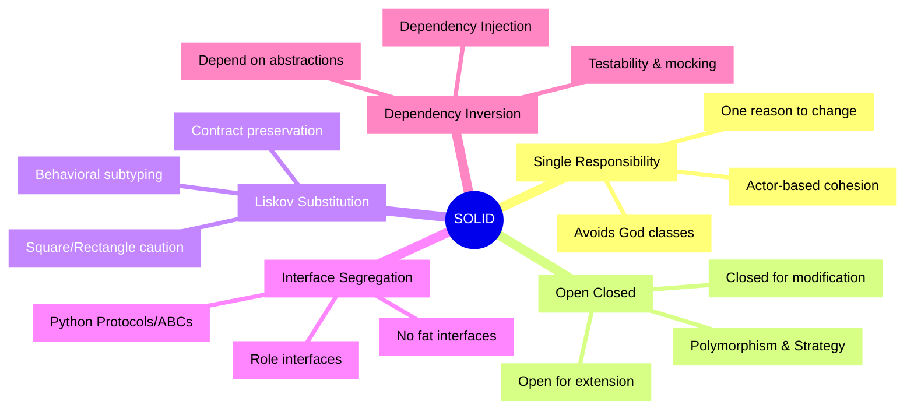
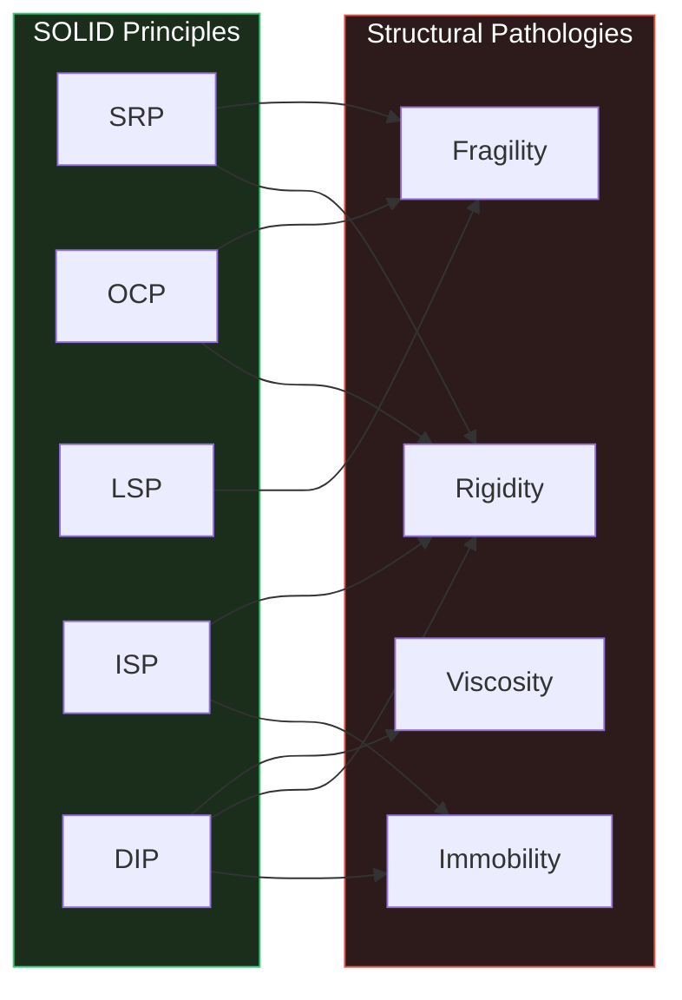
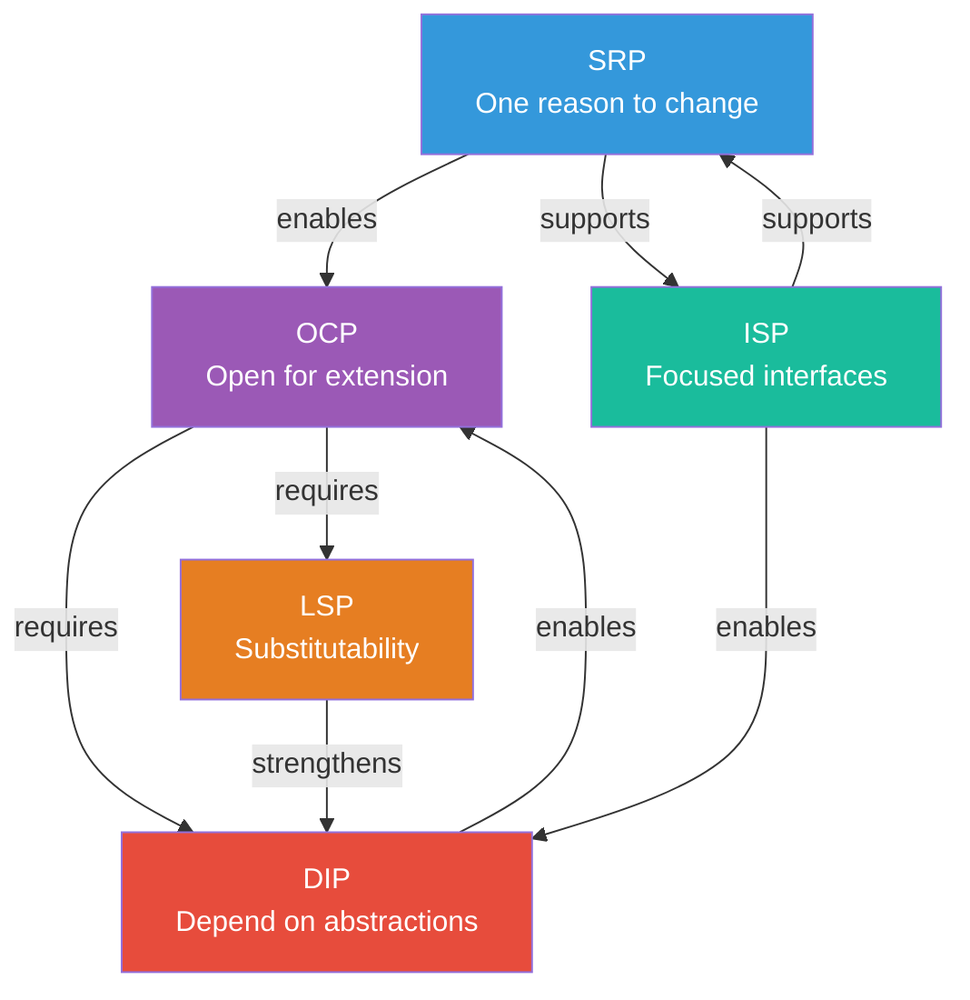
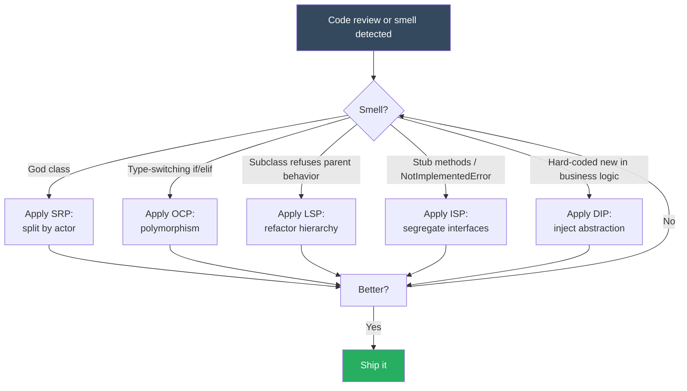

# SOLID Principles — The Five Pillars of Object-Oriented Design

#oop #solid #design-principles #uncle-bob #maintainability #teaching #deep-dive

> [!quote] Robert C. Martin (Uncle Bob)
> "The SOLID principles are not rules. They are not laws. They are not perfect truths. They are simply **heuristics** — guidelines that, when applied intelligently, lead to better software."

If the [[Four Pillars]] (Encapsulation, Inheritance, Polymorphism, Abstraction) are the *mechanics* of object-oriented programming, then **SOLID** is the *philosophy* of object-oriented *design*. SOLID is a set of five principles that help developers organize classes, interfaces, and dependencies in a way that resists rotting as systems grow and change.

This overview is the entry point. Each principle has its own deep-dive note:

- [[Single-Responsibility]] — *A class should have one, and only one, reason to change.*
- [[Open-Closed]] — *Software entities should be open for extension, but closed for modification.*
- [[Liskov-Substitution]] — *Subtypes must be substitutable for their base types.*
- [[Interface-Segregation]] — *Clients should not be forced to depend on interfaces they do not use.*
- [[Dependency-Inversion]] — *Depend on abstractions, not on concretions.*

Prerequisite reading: [[Classes-And-Objects]], [[Abstraction]], [[Polymorphism]], [[Inheritance]].

---

## 1. What Is SOLID?

**SOLID** is a mnemonic acronym for five design principles intended to make object-oriented designs more **understandable, flexible, and maintainable**. The principles guide how to:

- Partition responsibilities across classes (SRP)
- Organize code so that adding features does not require modifying existing code (OCP)
- Design inheritance hierarchies that do not surprise their users (LSP)
- Split fat interfaces into focused ones (ISP)
- Decouple high-level policy from low-level detail (DIP)

SOLID is *not* a framework, not a library, and not a checklist that says "now you have good code." It is a vocabulary for talking about **structural quality** — the shape of code, not its behavior.

### 1.1 The Origin

The five principles were assembled and named by **Robert C. Martin** ("Uncle Bob") in his seminal 2000 paper *"Design Principles and Design Patterns"* and later codified in his book *Agile Software Development: Principles, Patterns, and Practices* (2002). However, the individual principles have deeper roots:

- **SRP, OCP, ISP, DIP** were formulated by Martin himself throughout the 1990s.
- **LSP** was introduced by **Barbara Liskov** in a 1987 keynote at the *Data Abstraction and Hierarchy* conference, formalizing what "subtype" means in terms of substitutability.

> [!info] The Coining of "SOLID"
> The acronym itself was coined by **Michael Feathers** in the early 2000s. Feathers, working with Martin, noticed that the first letters of the five principles spelled **S-O-L-I-D** and proposed the mnemonic. The name stuck because it conveys *integrity* — a structural soundness — exactly the property the principles aim to deliver.

### 1.2 The Five Principles at a Glance

| # | Principle | One-Line Summary | Core Question It Answers |
|---|-----------|------------------|--------------------------|
| **S** | [[Single-Responsibility]] | A class should have one reason to change. | *Who is this class for?* |
| **O** | [[Open-Closed]] | Open for extension, closed for modification. | *Can I add features safely?* |
| **L** | [[Liskov-Substitution]] | Subtypes must be substitutable for base types. | *Does the subtype honor the contract?* |
| **I** | [[Interface-Segregation]] | Don't force clients to depend on unused methods. | *What does this client actually need?* |
| **D** | [[Dependency-Inversion]] | Depend on abstractions, not concretions. | *Who owns the policy?* |



---

## 2. Why SOLID Matters

Code spends far more of its life being *read, modified, and extended* than being written. SOLID exists to slow down the inevitable decay — what Martin Fowler calls **software rot** — that occurs when code is repeatedly modified under deadline pressure without a guiding design discipline.

### 2.1 The Forces SOLID Counters

SOLID principles directly address **three structural pathologies**:

1. **Rigidity** — every change requires cascading edits to many classes.
2. **Fragility** — a change in one place breaks something in an unrelated place.
3. **Immobility** — a class cannot be reused because it drags in unwanted dependencies.

Each principle attacks one or more of these forces:



### 2.2 Maintainability

A class with one responsibility (SRP) is easier to reason about because you only need to think about one concern at a time. When a bug report says "the report calculation is wrong," you know exactly which file to open. You are not also debugging the email notifier, because the notifier lives elsewhere.

### 2.3 Testability

SRP and DIP together make code trivially testable. A class with one responsibility has a small surface area; a class whose dependencies are abstractions (DIP) can be tested with lightweight stubs instead of real databases and SMTP servers. Without DIP, the unit test for a 50-line business rule ends up standing up a database, a message queue, and a mail server — so nobody runs the test, and the rule quietly rots.

### 2.4 Flexibility and Reuse

OCP, LSP, ISP, and DIP together create a design where adding new behavior is mostly a matter of writing new code, not rewriting old code. Want to add a new notification channel? Subclass `Notifier` or implement `NotificationChannel`. Want to swap MySQL for PostgreSQL? Provide a new implementation of the `UserRepository` interface. The cost of a new feature becomes additive rather than multiplicative.

### 2.5 Communication

SOLID gives the team a shared vocabulary. "That's an SRP violation — the calculator is also doing formatting" is a precise, actionable code-review comment. Without the vocabulary, the same observation becomes vague: "This class is doing too much, maybe we should split it?"

---

## 3. How the Principles Interact

SOLID is often taught as five independent rules. In practice, they are deeply interlocked — violations of one usually manifest as violations of others, and applying one often requires applying another.

### 3.1 The Dependency Web



A few of the most important interdependencies:

- **SRP enables OCP.** If a class has five responsibilities, extending any one of them probably requires modifying the class — which violates OCP. Splitting responsibilities (SRP) is usually the first step toward making the design open for extension.
- **OCP requires DIP.** The cleanest way to be open for extension is to depend on an abstraction and inject different implementations — which is precisely DIP.
- **OCP requires LSP.** If subclasses are not substitutable, then "open for extension by subclassing" is a lie: clients of the base class will break when given a subtype.
- **ISP enables DIP.** If you depend on a fat interface, you must provide or mock the entire fat interface. Segregating the interface (ISP) makes the dependency manageable.
- **LSP strengthens DIP.** If your abstractions have well-defined contracts that subtypes actually honor, then depending on the abstraction (DIP) is genuinely safe.

### 3.2 A Concrete Interaction

Consider a `UserService` that talks directly to a `MySQLDatabase` and an `SMTPMailer`. This design:

- Violates **DIP**: `UserService` depends on concretions, not abstractions.
- Violates **OCP**: extending to support PostgreSQL requires editing `UserService`.
- Likely violates **SRP**: `UserService` is doing user logic *and* SQL *and* email construction.
- Probably violates **ISP**: the mailer interface (if any) probably exposes more than `UserService` needs.

Fixing any one principle in isolation is hard. The proper refactor — introduce `UserRepository` and `Mailer` abstractions, inject them, and split the email-building logic out — simultaneously addresses four of the five.

---

## 4. The History

### 4.1 Before SOLID

Object-oriented programming emerged in the 1960s with **Simula 67** and matured in **Smalltalk** in the 1970s. By the late 1980s, OOP was mainstream — but developers were discovering that "object-oriented" did not automatically produce good design. **God classes**, **deep inheritance hierarchies**, and **fragile base classes** were everywhere. The community needed principles.

In 1987, **Barbara Liskov** delivered her influential keynote on data abstraction, proposing what would become LSP. In the 1990s, **Robert C. Martin** began publishing on the other four principles (SRP, OCP, ISP, DIP) in articles and conference talks, drawing on his experience consulting for many projects that had rotted into unusability.

### 4.2 The 2000 Paper

Martin's 2000 paper *"Design Principles and Design Patterns"* collected these principles in one place and connected them to the well-known [[Design Patterns]] catalog (Gang of Four, 1994). The paper argued that patterns *work* only when the underlying design respects certain principles — and SOLID is the most important subset of those principles.

### 4.3 The Acronym

**Michael Feathers**, then a consultant at Object Mentor (Martin's firm), suggested the acronym. He observed that the five principles, in the order SRP–OCP–LSP–ISP–DIP, spelled **SOLID** — a word connoting structural integrity. The acronym was a marketing success: it made the principles memorable and gave the consulting practice a recognizable brand. The terminology spread through Martin's books (*Agile Software Development: Principles, Patterns, and Practices*, 2002; *Clean Code*, 2007; *Clean Architecture*, 2017) and is now standard across the industry.

### 4.4 Modern Interpretations

The principles have aged well. In the age of:

- **Microservices** — DIP manifests as message contracts and protocol buffers between services.
- **Functional programming** — SRP manifests as small pure functions; OCP manifests as higher-order functions.
- **TypeScript and static typing** — ISP manifests as segregated interface types.
- **Dependency Injection containers** (Spring, .NET DI, Python's `dependency-injector`) — DIP is enforced by the framework.

The principles are language-agnostic. They were born in C++ and Java and apply equally to Python, Go, Rust, and TypeScript — with each language offering idiomatic tools for applying them.

---

## 5. SOLID Is a Guide, Not a Religion

> [!warning] The Cost of Over-Application
> Applying SOLID fanatically produces *worse* code, not better. Premature abstraction, interfaces with a single implementation, and five-layer indirection stacks are common symptoms of SOLID over-application. The principles describe the *direction* in which good design moves — not a destination you must reach immediately.

### 5.1 YAGNI vs OCP

**YAGNI** ("You Aren't Gonna Need It") from [[Extreme Programming]] says: do not build for hypothetical future requirements. OCP says: design so that adding features does not require editing existing code. These pull in opposite directions, and reconciling them is a judgment call.

A reasonable rule of thumb:

- For the *first* implementation, write the simplest thing that works.
- When you are about to add a *third* variant of something (a third notification channel, a third payment method), *then* refactor to satisfy OCP. This is the **Rule of Three**.
- For parts of the system that are explicitly designed for extension (plugins, strategies), invest in OCP from the start.

### 5.2 When SRP Hurts

Aggressive SRP can produce **shotgun surgery** — a single logical change requires touching twenty tiny classes. This is sometimes called **Scientologist decomposition** (after the religion's auditing practice of fragmenting attention). The remedy is to recognize that SRP is about *reasons to change* (actors), not about *lines of code* — a class with twenty small methods that all serve the same actor is fine.

### 5.3 When LSP Is Over-Modeled

Sometimes developers invent elaborate inheritance hierarchies to satisfy LSP for cases that would be better modeled by composition. If you find yourself saying "but a `Square` *is a* `Rectangle`," ask whether the inheritance is actually earning anything. Often, two separate classes with shared helpers are simpler.

### 5.4 When ISP Produces Interface Explosions

Segregating interfaces too finely produces dozens of one-method interfaces, each used by one client. This is verbose and hard to navigate. ISP is about grouping by *client role*, not about minimizing interface size. An interface with four methods that all serve the same client is fine.

### 5.5 When DIP Creates Indirection Without Value

If a class has exactly one implementation, and that implementation is never going to be swapped, mocked, or replaced, introducing an abstraction adds indirection and reading cost without benefit. Wait until you have a *reason* to abstract (a second implementation, or a test that needs a mock) before introducing the abstraction.

> [!tip] Teaching Tip
> When introducing SOLID to students, emphasize the **principles over the rules**. The question to ask is not "Does this code violate SOLID?" but "Does this code exhibit the *symptoms* SOLID was designed to prevent — rigidity, fragility, immobility?" If the symptoms are absent, the SOLID scorecard does not matter.

---

## 6. Code Smells That SOLID Addresses

SOLID is most useful as a diagnostic tool. The following code smells are *signals* that one or more SOLID principles have been violated.

| Code Smell | Likely SOLID Violation | Symptom |
|---|---|---|
| God class / Blob | SRP | One class doing everything |
| Long method | SRP | One method with many responsibilities |
| Feature envy | SRP | Method more interested in another class's data |
| Shotgun surgery | SRP (over-applied) or DIP | One change touches many files |
| Rigid if/elif on type | OCP | Adding a type requires editing the chain |
| Refused bequest | LSP | Subclass overrides methods to throw or no-op |
| Fat interface | ISP | Class implements methods it doesn't use |
| Hard-coded dependency | DIP | `new SMTPMailer()` in business logic |
| Mock-heavy test setup | DIP (or SRP) | Test must stub 5 collaborators to test 1 method |
| Parallel hierarchies | DIP / OCP | Adding a type requires adding a parallel handler |

### 6.1 The Diagnostic Flow



---

## 7. The Big Picture: SOLID in the Lifecycle

SOLID is most valuable during the **evolutionary** phase of a system — the long middle stretch where the system is being extended, refactored, and repaired. During the initial greenfield build, SOLID often feels like overhead. During maintenance, it pays back compound interest.


### 7.1 In Practice

A mature engineering organization uses SOLID in three concrete ways:

1. **Code review checklists** — reviewers cite specific principles when requesting changes ("This `User` class is also doing email — can we split out a `UserNotifier`? SRP.").
2. **Architecture decision records** — when choosing between options, the team explicitly reasons about which option better satisfies OCP/DIP for the expected changes.
3. **Technical debt registers** — known SOLID violations are logged, with the symptoms they cause, so that future refactors can prioritize the highest-impact fixes.

---

## 8. SOLID Beyond Classes

Although SOLID was originally framed in terms of classes and interfaces, the principles apply at every level of granularity:

- **Functions**: a function with one reason to change (SRP) is small and focused. A function that takes a strategy argument (DIP) is open for extension (OCP).
- **Modules / Packages**: a package that depends on abstractions from another package (DIP) is decoupled; a package whose public API is segregated by client (ISP) is easier to consume.
- **Microservices**: a service that owns one business capability (SRP) and exposes a stable contract (OCP) is independently deployable.
- **Frontend components**: a React component that takes a `renderProp` or `children` (DIP, OCP) is reusable; a component that fetches its own data via a hook that can be mocked (DIP) is testable.

### 8.1 In Functional Programming

Even in functional programming, the principles translate:

- **SRP** → small, single-purpose functions.
- **OCP** → higher-order functions, partial application.
- **LSP** → parametricity (functions that work for all types satisfying a constraint).
- **ISP** → minimal function signatures; avoid "option bag" parameters.
- **DIP** → dependency injection via function arguments; the Reader monad.

---

## 9. Common Student Misconceptions

> [!warning] Misconception 1: "SOLID makes code longer, so it must be slower."
> SOLID almost never affects runtime performance. The indirection it introduces (one extra method call, one extra interface lookup) is negligible compared to I/O, network, and database costs. SOLID is about *structural* quality, not *execution* quality.

> [!warning] Misconception 2: "If I follow SOLID, my code is good."
> SOLID is necessary but not sufficient. Code can satisfy every SOLID principle and still be poorly named, poorly tested, or built on the wrong abstractions. SOLID is one axis of quality among many (readability, performance, security, accessibility).

> [!warning] Misconception 3: "SOLID is a checklist I apply at the end."
> SOLID is most useful *during* design, as a vocabulary for making trade-offs. Retrofitting SOLID onto a large codebase is expensive and risky; doing it incrementally — refactoring toward SOLID when you touch each module — is more sustainable.

> [!warning] Misconception 4: "Every class needs an interface (DIP)."
> No. DIP is most valuable at architectural seams — between layers, between modules, between the system and its external dependencies. Within a tightly cohesive module, depending on concretions is fine.

> [!warning] Misconception 5: "Python doesn't need SOLID because it's dynamic."
> Python's dynamism makes some principles easier (no need for explicit interfaces — use Protocols) but does not make them unnecessary. Python codebases still rot, still have God classes, and still suffer from hard-coded dependencies. SOLID applies fully.

---

## 10. A Mini Case Study

Before diving into each principle, here is a single end-to-end example that violates *all five* principles, with a brief sketch of how to address each.

### 10.1 The Violation

```python
# bad_solid.py — violates SRP, OCP, LSP, ISP, DIP

class User:
    # SRP violation: User holds data + persistence + email logic
    def __init__(self, name, email):
        self.name = name
        self.email = email

    def save_to_mysql(self, conn):
        # SRP + DIP violation: business object knows about MySQL
        cursor = conn.cursor()
        cursor.execute(
            "INSERT INTO users (name, email) VALUES (%s, %s)",
            (self.name, self.email),
        )
        conn.commit()

    def send_welcome_email(self):
        # SRP + DIP violation: business object knows about SMTP
        import smtplib
        server = smtplib.SMTP("smtp.example.com")
        server.sendmail("welcome@example.com", self.email, "Welcome!")
        server.quit()


class Admin(User):
    # LSP violation: Admin "refuses bequest" by overriding save to do nothing
    def save_to_mysql(self, conn):
        raise PermissionError("Admins cannot be saved directly")


class NotificationService:
    # OCP violation: adding a new channel requires editing this method
    # ISP violation: clients that only need email still depend on all channels
    def send(self, channel: str, recipient: str, message: str):
        if channel == "email":
            self._send_email(recipient, message)
        elif channel == "sms":
            self._send_sms(recipient, message)
        elif channel == "push":
            self._send_push(recipient, message)
        # Adding a new channel here requires modifying this class — OCP violation

    def _send_email(self, recipient, message): ...
    def _send_sms(self, recipient, message): ...
    def _send_push(self, recipient, message): ...
```

### 10.2 The Refactor

```python
# good_solid.py — addresses all five principles

from abc import ABC, abstractmethod


# --- SRP: User holds only data ---
class User:
    def __init__(self, name: str, email: str):
        self.name = name
        self.email = email


# --- DIP + ISP: depend on focused abstractions ---
class UserRepository(ABC):
    @abstractmethod
    def save(self, user: User) -> None: ...


class Mailer(ABC):
    @abstractmethod
    def send(self, to: str, subject: str, body: str) -> None: ...


# --- OCP: new channels are new classes, not edits ---
class NotificationChannel(ABC):
    @abstractmethod
    def send(self, recipient: str, message: str) -> None: ...


class EmailChannel(NotificationChannel):
    def send(self, recipient, message):
        print(f"Email to {recipient}: {message}")


class SMSChannel(NotificationChannel):
    def send(self, recipient, message):
        print(f"SMS to {recipient}: {message}")


class PushChannel(NotificationChannel):
    def send(self, recipient, message):
        print(f"Push to {recipient}: {message}")


class NotificationService:
    # DIP: depends on the abstraction (channel chosen by caller or DI)
    def __init__(self, channels: dict[str, NotificationChannel]):
        self._channels = channels

    def send(self, channel: str, recipient: str, message: str) -> None:
        # OCP-compliant: no if/elif; new channel = new dict entry
        self._channels[channel].send(recipient, message)


# --- LSP: separate Admin and User do not share an unsuitable parent ---
class Admin:
    # No longer subclasses User — Admin is its own concept.
    # Substitutability is preserved because there is no longer a
    # broken inheritance relationship to violate.
    def __init__(self, name: str, email: str):
        self.name = name
        self.email = email


# --- Concrete implementations of the abstractions ---
class MySQLUserRepository(UserRepository):
    def __init__(self, conn):
        self._conn = conn

    def save(self, user: User) -> None:
        cursor = self._conn.cursor()
        cursor.execute(
            "INSERT INTO users (name, email) VALUES (%s, %s)",
            (user.name, user.email),
        )
        self._conn.commit()


class SMTPMailer(Mailer):
    def send(self, to, subject, body):
        # Real SMTP logic here
        print(f"SMTP → {to}: {subject}")


# --- Orchestration: composes the abstractions ---
class UserOnboarding:
    def __init__(self, repo: UserRepository, mailer: Mailer):
        self._repo = repo
        self._mailer = mailer

    def register(self, user: User) -> None:
        self._repo.save(user)
        self._mailer.send(user.email, "Welcome", "Thanks for joining!")
```

Each principle is now visible in the structure:

| Principle | Where it lives in the refactor |
|---|---|
| SRP | `User` only holds data; `UserOnboarding` orchestrates; `MySQLUserRepository` only persists; `SMTPMailer` only mails. |
| OCP | New notification channels are new classes — `NotificationService` never changes. |
| LSP | The LSP violation is removed by *eliminating the broken inheritance* — `Admin` is not a `User` subclass. |
| ISP | `UserRepository` exposes only `save`; `Mailer` exposes only `send`. Clients are not forced to depend on unused methods. |
| DIP | `UserOnboarding` depends on `UserRepository` and `Mailer` abstractions; concrete MySQL/SMTP are injected. |

---

## 11. How to Read the Rest of This Section

Each subsequent note in this folder follows the same structure:

1. **Definition** — the principle in one sentence, then expanded.
2. **Why it matters** — the pathology it prevents.
3. **Code examples** — a violation, then a refactor.
4. **Heuristics** — how to spot violations in your own code.
5. **Common misconceptions** — what the principle is *not*.
6. **Relationships** — how it interacts with the other four principles.
7. **Exercises** — problems for the reader.

Recommended reading order:

1. [[Single-Responsibility]] — the foundation; everything else builds on it.
2. [[Open-Closed]] — the goal; SRP and DIP are tools for achieving OCP.
3. [[Liskov-Substitution]] — the discipline of inheritance, which OCP relies on.
4. [[Interface-Segregation]] — keeping abstractions lean.
5. [[Dependency-Inversion]] — the architectural principle that ties it all together.

---

## 12. Summary

SOLID is a set of five design heuristics, assembled by Robert C. Martin and named by Michael Feathers, that together address the most common forms of structural decay in object-oriented systems:

- **Single Responsibility** — partition by actor.
- **Open-Closed** — extend without modifying.
- **Liskov Substitution** — honor the contract.
- **Interface Segregation** — depend on what you use.
- **Dependency Inversion** — depend on abstractions.

The principles are interdependent, language-agnostic, and most valuable as a *vocabulary* for design discussion rather than as a checklist. Applied judiciously — alongside YAGNI, the Rule of Three, and the broader patterns literature — SOLID produces designs that age gracefully. Applied dogmatically, it produces over-engineered code that is hard to read and slow to change.

The rest of this section unpacks each principle in depth. Read [[Single-Responsibility]] next.

---

## 13. Further Reading

- Robert C. Martin, *"Design Principles and Design Patterns"* (2000 paper)
- Robert C. Martin, *Agile Software Development: Principles, Patterns, and Practices* (2002)
- Robert C. Martin, *Clean Architecture* (2017) — Part IV covers SOLID in depth.
- Martin Fowler, *Refactoring: Improving the Design of Existing Code* (2nd ed., 2018)
- Barbara Liskov, *"Data Abstraction and Hierarchy"* (1987 OOPSLA keynote)
- Michael Feathers, *Working Effectively with Legacy Code* (2004)
- [[Design Patterns]] — Gang of Four (Gamma, Helm, Johnson, Vlissides, 1994)

## 14. Glossary

| Term | Meaning |
|---|---|
| **Heuristic** | A rule of thumb that usually leads to good outcomes but is not a guarantee. |
| **Rigidity** | The tendency of a design to be hard to change without cascading edits. |
| **Fragility** | The tendency of a change in one place to break unrelated code. |
| **Immobility** | The inability to reuse a module because it carries too many dependencies. |
| **Viscosity** | When hacks are easier than following the design; the design "resists" doing the right thing. |
| **Actor** | A group of users or stakeholders who would request a change for the same reason. (SRP term.) |
| **Contract** | The set of preconditions, postconditions, and invariants a method or class promises to uphold. (LSP term.) |
| **Concretion** | A specific, instantiable class — the opposite of an abstraction. (DIP term.) |

---

**Next**: [[Single-Responsibility]] — *A class should have one, and only one, reason to change.*
