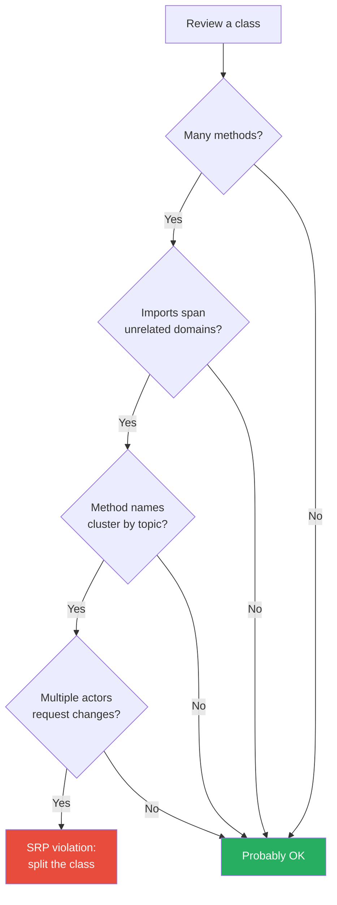
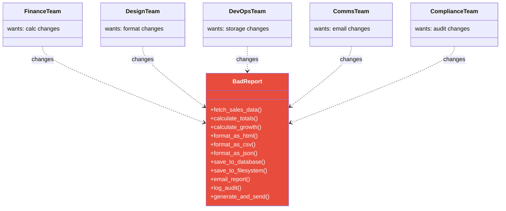
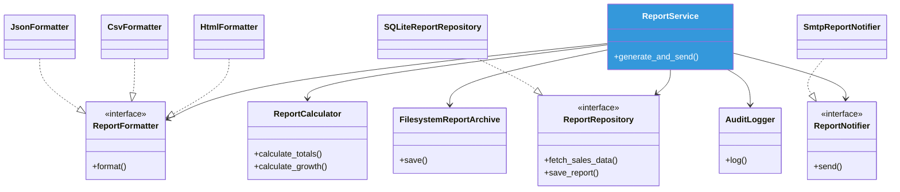
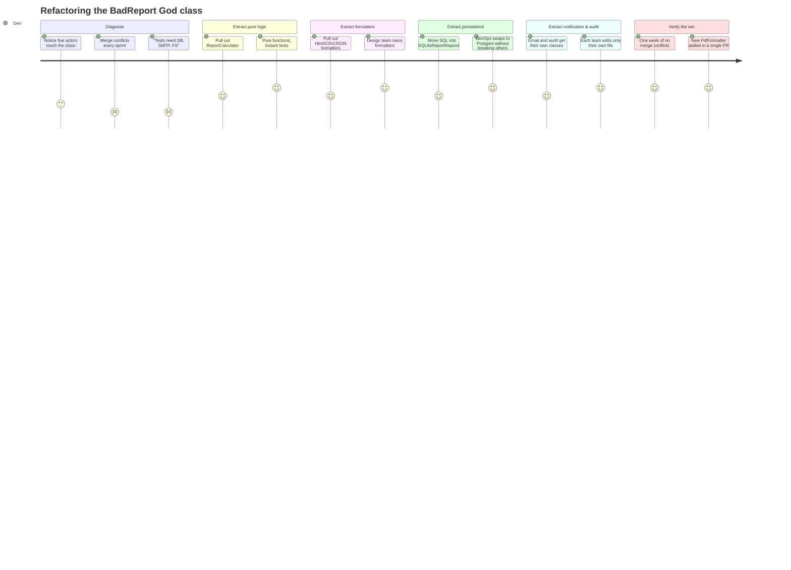
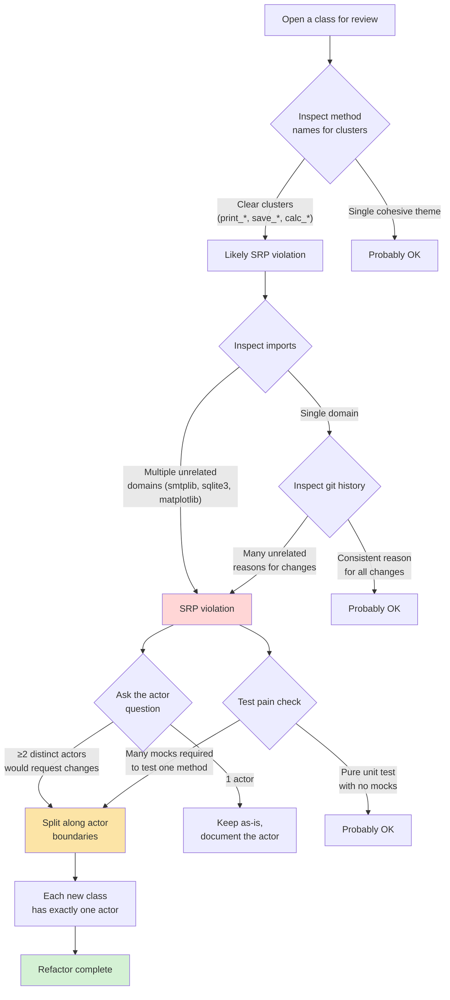
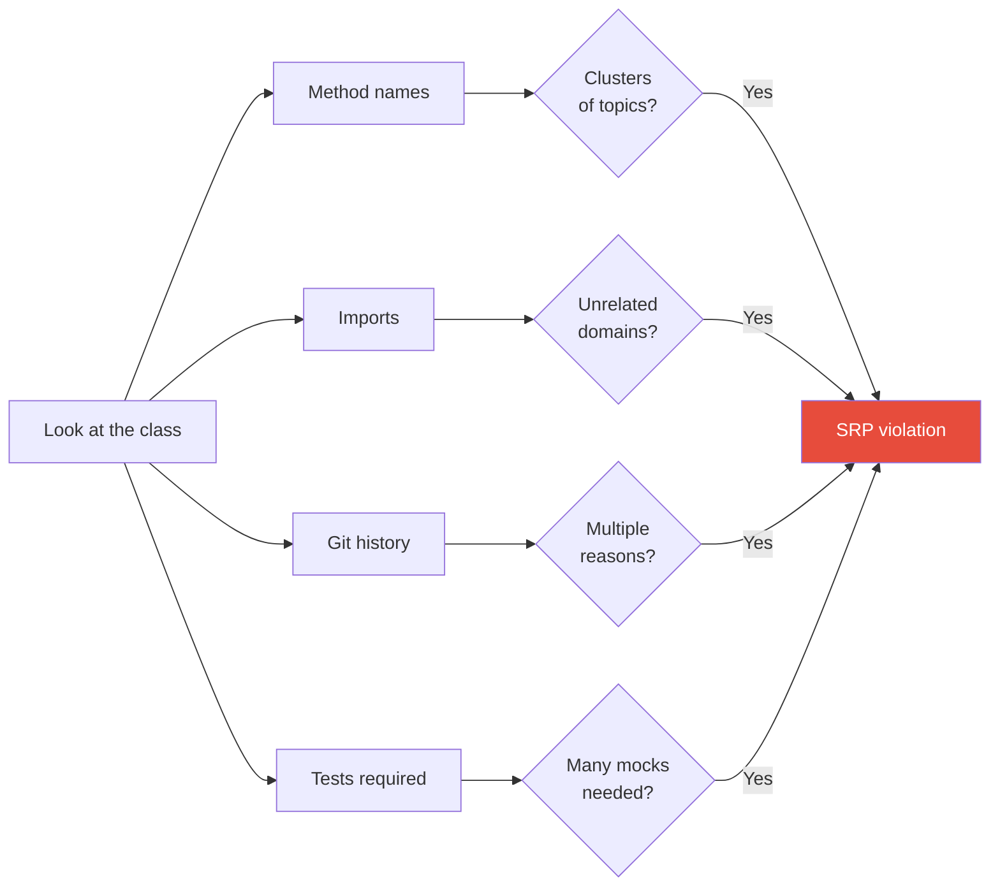
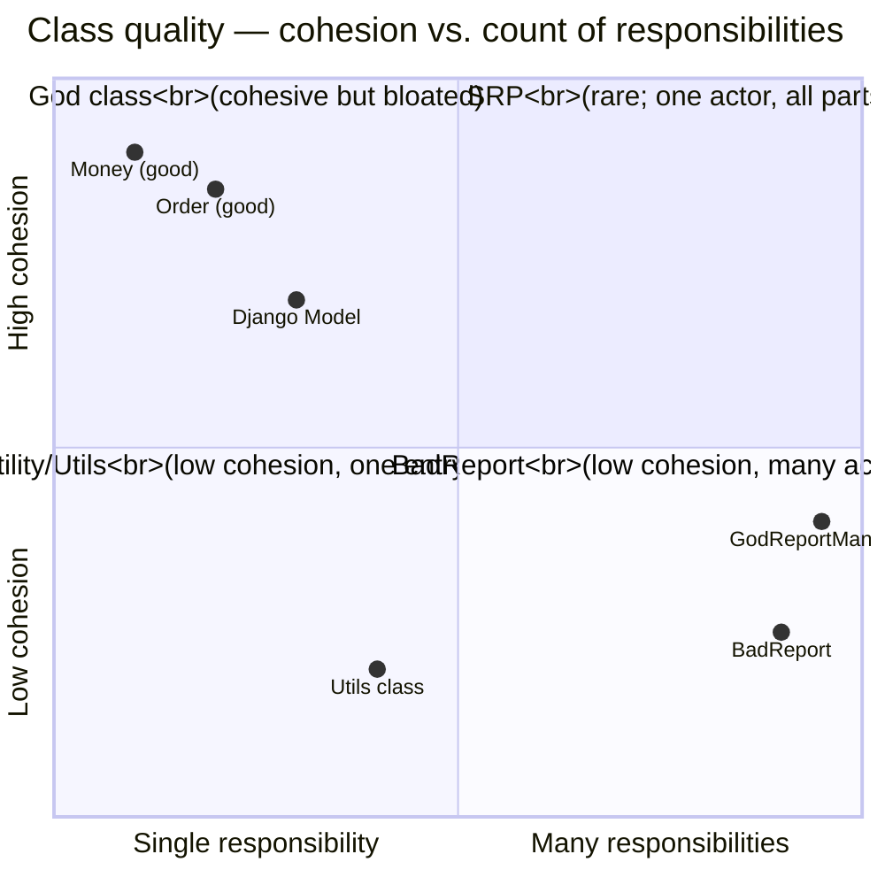
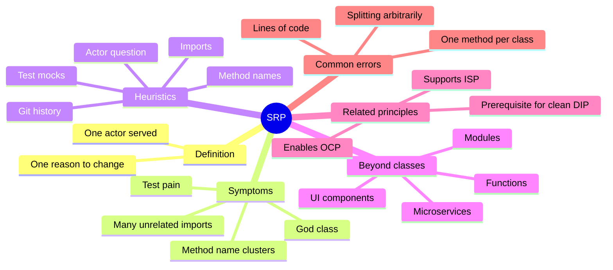
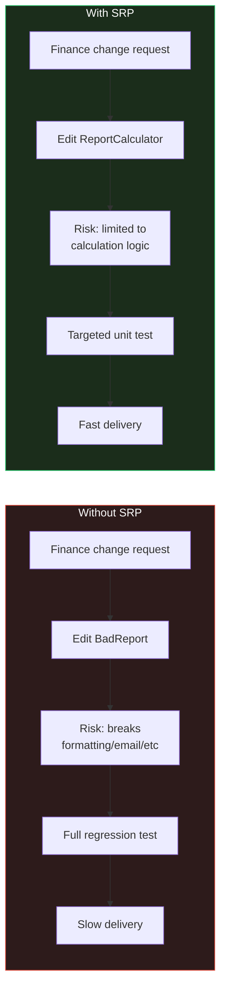

# Single Responsibility Principle (SRP)

#oop #solid #srp #cohesion #god-class #refactoring #teaching #deep-dive

> [!quote] Robert C. Martin
> "Gather together the things that change for the same reasons. Separate those things that change for different reasons."

The **Single Responsibility Principle** is the *S* of [[SOLID-Overview|SOLID]]. It is the most frequently cited, the most frequently misquoted, and — when properly understood — the most quietly powerful of the five. Misunderstood, SRP produces over-decomposed "nanoclasses" that nobody can navigate. Understood correctly, SRP produces cohesive modules that survive years of changes without rotting.

This note unpacks SRP in depth: what a "responsibility" really is (it is *not* "one method"), the actor-based interpretation that makes SRP actionable, the symptoms of violation, before/after refactors in Python, the relationship to cohesion and coupling, and the common student misconceptions that surround the principle.

Prerequisites: [[Classes-And-Objects]], [[Encapsulation]], [[Methods-And-Functions]]. Read [[SOLID-Overview]] first.

---

## 1. The Principle, In One Sentence

> **A class should have one, and only one, reason to change.**

That is the canonical formulation. Every word matters:

- "**A class**" — the principle also applies to modules, packages, and functions, but it is most often discussed at the class level.
- "**Should have one**" — exactly one. Not zero (an empty class has no purpose), not two or more.
- "**Reason to change**" — this is the subtle part. *A responsibility is a reason to change.*

### 1.1 The Subtle Trap

Most beginners read SRP as "a class should do one thing." This is *almost* right and dangerously misleading. "Do one thing" suggests you should look at the *methods* of a class and make sure they all do similar work. But that is a recipe for fragmentation: a class with five tiny methods that all manipulate the same data might be perfectly cohesive.

The correct reading is "**a class should have one reason to change**" — which is a statement about *who* would request a change, not about *what* the class does internally.

---

## 2. What Is a "Responsibility"?

> [!important] Definition
> A **responsibility** of a class is **a reason for that class to change**. Equivalently, it is **an actor** — a group of people or roles who would request a change to the class for their own purposes.

### 2.1 The Actor View

Robert C. Martin restated SRP in terms of **actors**: *"A class should have one, and only one, actor it serves."* An actor is a stakeholder — a person, role, or team that cares about some aspect of the class's behavior. Examples of actors:

- The **Accounting team** cares how invoice totals are calculated.
- The **Finance compliance team** cares how invoices are audited and logged.
- The **Operations team** cares how invoices are printed and mailed.
- The **Legal team** cares how invoices are archived for tax law.

If a single `Invoice` class has methods `calculate_total()`, `log_for_audit()`, `print_pdf()`, and `archive_to_s3()`, then *four* different actors can independently request changes to the class. The accounting team wants to change the tax calculation; the legal team wants to change the retention period; the operations team wants to change the PDF layout. Every change to the class is a *collision* between the interests of these unrelated actors.

That is an SRP violation.

### 2.2 Why "One Reason to Change" Beats "One Thing"

The actor view is more useful than the "do one thing" view because it gives you a precise question to ask:

> *If this class needed to change, who would be requesting the change?*

If you can name two distinct actors who would request different changes, the class has two responsibilities. If you can only name one actor — even if the class has twenty methods — it has one responsibility.

A class with twenty methods can be perfectly SRP-compliant if all twenty methods serve the same actor and would change together. A class with three methods can violate SRP if each method serves a different actor.

---

## 3. Symptoms of SRP Violation

### 3.1 The God Class / Blob

The most obvious symptom. A single class with hundreds or thousands of lines, dozens of methods, and a sprawling set of imports. The classic names: `Manager`, `Helper`, `Util`, `Service`, `Processor`. (These names are not *always* bad — but they are red flags.)

```python
class GodReportManager:
    """Does everything related to reports."""
    def fetch_data(self): ...
    def calculate_totals(self): ...
    def apply_business_rules(self): ...
    def format_as_pdf(self): ...
    def format_as_html(self): ...
    def format_as_csv(self): ...
    def save_to_database(self): ...
    def save_to_filesystem(self): ...
    def email_to_recipients(self): ...
    def log_audit_trail(self): ...
    def translate_labels(self, language): ...
    def render_chart(self, chart_type): ...
    # ...and 40 more methods
```

### 3.2 Unrelated Imports

If a class imports both `smtplib` (for email) and `sqlite3` (for persistence) and `matplotlib` (for charts), it almost certainly has multiple responsibilities. Each import points to a different *concern*, and each concern is likely owned by a different actor.

### 3.3 Method Name Clusters

Look at the method names. If you can group them into clusters where each cluster has a distinct prefix or topic — `print_*`, `save_*`, `calculate_*`, `email_*` — each cluster is a separate responsibility.

### 3.4 Tests Are Painful

If testing one method of a class requires setting up infrastructure for unrelated methods (you must configure a database to test the calculation logic, because the constructor opens a connection), the class is doing too much.

### 3.5 Frequent Merge Conflicts

If multiple teams frequently edit the same file in different pull requests, the file likely contains responsibilities owned by different actors. The merge conflict is a *symptom* of an SRP violation.



---

## 4. The Canonical Example: `BadReport`

Let's work through a complete example. The `BadReport` class is a textbook SRP violation: it calculates report data, formats it in three ways, persists it to two destinations, and emails it to recipients.

### 4.1 The Violation

```python
# bad_report.py
import json
import smtplib
import sqlite3
from datetime import datetime


class BadReport:
    """
    A single class that does EVERYTHING related to a monthly sales report:
    - queries the database
    - calculates totals, averages, growth
    - formats as HTML, PDF, CSV
    - saves to the database AND to a file
    - emails the report to a list of recipients
    - logs an audit trail
    """

    def __init__(self, db_path: str, smtp_host: str):
        self.db_path = db_path
        self.smtp_host = smtp_host
        self._audit_log: list[str] = []

    # --- Data access ---
    def fetch_sales_data(self, month: str) -> list[dict]:
        conn = sqlite3.connect(self.db_path)
        cursor = conn.cursor()
        cursor.execute(
            "SELECT product, quantity, price FROM sales WHERE month = ?",
            (month,),
        )
        rows = cursor.fetchall()
        conn.close()
        return [{"product": r[0], "qty": r[1], "price": r[2]} for r in rows]

    # --- Calculation ---
    def calculate_totals(self, rows: list[dict]) -> dict:
        total_revenue = sum(r["qty"] * r["price"] for r in rows)
        total_units = sum(r["qty"] for r in rows)
        avg_price = total_revenue / total_units if total_units else 0
        return {
            "total_revenue": total_revenue,
            "total_units": total_units,
            "avg_price": avg_price,
        }

    def calculate_growth(self, current: dict, previous: dict) -> float:
        if previous["total_revenue"] == 0:
            return 0.0
        return (current["total_revenue"] - previous["total_revenue"]) / previous["total_revenue"]

    # --- Formatting ---
    def format_as_html(self, totals: dict, growth: float) -> str:
        return (
            f"<h1>Monthly Sales Report</h1>"
            f"<p>Revenue: ${totals['total_revenue']:,.2f}</p>"
            f"<p>Units sold: {totals['total_units']}</p>"
            f"<p>Growth: {growth:.1%}</p>"
        )

    def format_as_csv(self, totals: dict, growth: float) -> str:
        return (
            "metric,value\n"
            f"revenue,{totals['total_revenue']}\n"
            f"units,{totals['total_units']}\n"
            f"growth,{growth}\n"
        )

    def format_as_json(self, totals: dict, growth: float) -> str:
        return json.dumps({**totals, "growth": growth}, indent=2)

    # --- Persistence ---
    def save_to_database(self, totals: dict, month: str) -> None:
        conn = sqlite3.connect(self.db_path)
        conn.execute(
            "INSERT INTO report_history (month, revenue, units) VALUES (?, ?, ?)",
            (month, totals["total_revenue"], totals["total_units"]),
        )
        conn.commit()
        conn.close()

    def save_to_filesystem(self, content: str, path: str) -> None:
        with open(path, "w") as f:
            f.write(content)

    # --- Notification ---
    def email_report(self, recipients: list[str], subject: str, body: str) -> None:
        server = smtplib.SMTP(self.smtp_host)
        for recipient in recipients:
            server.sendmail("reports@example.com", recipient, body)
        server.quit()

    # --- Audit ---
    def log_audit(self, action: str) -> None:
        entry = f"{datetime.now().isoformat()} - {action}"
        self._audit_log.append(entry)

    # --- Orchestration ---
    def generate_and_send(self, month: str, recipients: list[str]) -> None:
        rows = self.fetch_sales_data(month)
        totals = self.calculate_totals(rows)
        prev_rows = self.fetch_sales_data(self._previous_month(month))
        prev_totals = self.calculate_totals(prev_rows)
        growth = self.calculate_growth(totals, prev_totals)

        html = self.format_as_html(totals, growth)
        self.save_to_database(totals, month)
        self.save_to_filesystem(html, f"/var/reports/{month}.html")
        self.email_report(recipients, f"Report for {month}", html)
        self.log_audit(f"Sent report for {month} to {len(recipients)} recipients")

    @staticmethod
    def _previous_month(month: str) -> str:
        # Simplified for the example
        y, m = map(int, month.split("-"))
        m -= 1
        if m == 0:
            y, m = y - 1, 12
        return f"{y:04d}-{m:02d}"
```

### 4.2 Why This Is Bad

Count the actors who could request changes to `BadReport`:

1. **The Finance team** — wants the calculation logic to change (new tax rules, new growth formulas).
2. **The Design team** — wants the HTML/PDF formatting to change (new branding, new layout).
3. **The DevOps team** — wants the persistence to change (move from SQLite to PostgreSQL, switch file paths).
4. **The Email/Comms team** — wants the email logic to change (use SendGrid instead of raw SMTP, add CC recipients).
5. **The Compliance team** — wants the audit log to change (different fields, different retention).

Five actors. Five responsibilities. Five independent reasons for `BadReport` to change. When the design team asks for a new format, the finance team's code is at risk because it lives in the same file. When DevOps wants to migrate the database, they have to touch the file that contains the email code.

### 4.3 The Violation Diagram



---

## 5. The Refactor: Splitting by Actor

SRP says: separate the things that change for different reasons. We split `BadReport` into five classes, each owned by exactly one actor.

### 5.1 The Refactored Design

```python
# report_calculator.py — owned by Finance team
from dataclasses import dataclass


@dataclass
class ReportTotals:
    total_revenue: float
    total_units: int
    avg_price: float


@dataclass
class ReportData:
    rows: list[dict]
    totals: ReportTotals
    growth: float


class ReportCalculator:
    """Pure business logic for computing report totals and growth."""

    def calculate_totals(self, rows: list[dict]) -> ReportTotals:
        total_revenue = sum(r["qty"] * r["price"] for r in rows)
        total_units = sum(r["qty"] for r in rows)
        avg_price = total_revenue / total_units if total_units else 0
        return ReportTotals(total_revenue, total_units, avg_price)

    def calculate_growth(self, current: ReportTotals, previous: ReportTotals) -> float:
        if previous.total_revenue == 0:
            return 0.0
        return (current.total_revenue - previous.total_revenue) / previous.total_revenue
```

```python
# report_formatter.py — owned by Design team
import json
from typing import Protocol


class ReportFormatter(Protocol):
    def format(self, totals, growth: float) -> str: ...


class HtmlFormatter:
    def format(self, totals, growth: float) -> str:
        return (
            f"<h1>Monthly Sales Report</h1>"
            f"<p>Revenue: ${totals.total_revenue:,.2f}</p>"
            f"<p>Units sold: {totals.total_units}</p>"
            f"<p>Growth: {growth:.1%}</p>"
        )


class CsvFormatter:
    def format(self, totals, growth: float) -> str:
        return (
            "metric,value\n"
            f"revenue,{totals.total_revenue}\n"
            f"units,{totals.total_units}\n"
            f"growth,{growth}\n"
        )


class JsonFormatter:
    def format(self, totals, growth: float) -> str:
        return json.dumps(
            {"revenue": totals.total_revenue, "units": totals.total_units, "growth": growth},
            indent=2,
        )
```

```python
# report_repository.py — owned by DevOps team
from abc import ABC, abstractmethod


class ReportRepository(ABC):
    @abstractmethod
    def fetch_sales_data(self, month: str) -> list[dict]: ...

    @abstractmethod
    def save_report(self, totals, month: str) -> None: ...


class SQLiteReportRepository(ReportRepository):
    def __init__(self, db_path: str):
        self._db_path = db_path

    def fetch_sales_data(self, month: str) -> list[dict]:
        import sqlite3
        conn = sqlite3.connect(self._db_path)
        cursor = conn.cursor()
        cursor.execute(
            "SELECT product, quantity, price FROM sales WHERE month = ?",
            (month,),
        )
        rows = cursor.fetchall()
        conn.close()
        return [{"product": r[0], "qty": r[1], "price": r[2]} for r in rows]

    def save_report(self, totals, month: str) -> None:
        import sqlite3
        conn = sqlite3.connect(self._db_path)
        conn.execute(
            "INSERT INTO report_history (month, revenue, units) VALUES (?, ?, ?)",
            (month, totals.total_revenue, totals.total_units),
        )
        conn.commit()
        conn.close()


class FilesystemReportArchive:
    def save(self, content: str, path: str) -> None:
        with open(path, "w") as f:
            f.write(content)
```

```python
# report_notifier.py — owned by Comms team
from abc import ABC, abstractmethod


class ReportNotifier(ABC):
    @abstractmethod
    def send(self, recipients: list[str], subject: str, body: str) -> None: ...


class SmtpReportNotifier(ReportNotifier):
    def __init__(self, smtp_host: str):
        self._smtp_host = smtp_host

    def send(self, recipients: list[str], subject: str, body: str) -> None:
        import smtplib
        server = smtplib.SMTP(self._smtp_host)
        for recipient in recipients:
            server.sendmail("reports@example.com", recipient, body)
        server.quit()
```

```python
# audit_logger.py — owned by Compliance team
from datetime import datetime


class AuditLogger:
    def __init__(self):
        self._entries: list[str] = []

    def log(self, action: str) -> None:
        entry = f"{datetime.now().isoformat()} - {action}"
        self._entries.append(entry)

    def entries(self) -> list[str]:
        return list(self._entries)
```

```python
# report_service.py — orchestrates the collaborators
class ReportService:
    """
    Orchestrates report generation. Each collaborator is owned by a
    different team and can change independently.
    """

    def __init__(
        self,
        repository,        # ReportRepository
        calculator,        # ReportCalculator
        formatter,         # ReportFormatter
        archive,           # FilesystemReportArchive
        notifier,          # ReportNotifier
        audit,             # AuditLogger
    ):
        self._repo = repository
        self._calc = calculator
        self._fmt = formatter
        self._archive = archive
        self._notifier = notifier
        self._audit = audit

    def generate_and_send(self, month: str, recipients: list[str]) -> None:
        rows = self._repo.fetch_sales_data(month)
        totals = self._calc.calculate_totals(rows)

        prev_rows = self._repo.fetch_sales_data(self._previous_month(month))
        prev_totals = self._calc.calculate_totals(prev_rows)
        growth = self._calc.calculate_growth(totals, prev_totals)

        body = self._fmt.format(totals, growth)

        self._repo.save_report(totals, month)
        self._archive.save(body, f"/var/reports/{month}.html")
        self._notifier.send(recipients, f"Report for {month}", body)
        self._audit.log(f"Sent report for {month} to {len(recipients)} recipients")

    @staticmethod
    def _previous_month(month: str) -> str:
        y, m = map(int, month.split("-"))
        m -= 1
        if m == 0:
            y, m = y - 1, 12
        return f"{y:04d}-{m:02d}"
```

### 5.2 The Refactor Diagram



### 5.3 What We Gained

- The Finance team can change `ReportCalculator` without touching formatting, persistence, or email code.
- The Design team can add a `PdfFormatter` without touching anything else.
- DevOps can swap `SQLiteReportRepository` for `PostgresReportRepository` in exactly one place.
- Each class is independently testable: `ReportCalculator` is a pure-function class with no I/O.
- Each class can be owned by a different team with minimal coordination.

### 5.4 What We Paid

- More files, more classes, more imports to follow.
- The orchestration logic lives in `ReportService` — a new class that did not exist before.
- The cognitive overhead of understanding the collaboration graph is higher than reading one big class.

This tradeoff — more files, but each is simpler and independently changeable — is the core of SRP. It pays off as the system ages.



---

## 6. How to Identify Responsibilities

SRP is easy to describe but hard to apply. Here are concrete heuristics.

### 6.1 Method Name Inspection

Group method names by topic. If you see clusters, those clusters are candidate responsibilities.

```python
class UserService:
    # Cluster A: Authentication
    def login(self): ...
    def logout(self): ...
    def reset_password(self): ...

    # Cluster B: Persistence
    def save(self): ...
    def delete(self): ...
    def find_by_id(self): ...

    # Cluster C: Notification
    def send_welcome_email(self): ...
    def send_password_reset_email(self): ...
```

Three clusters, three responsibilities, three actors (security team, DBA team, comms team). Refactor target: split into `AuthService`, `UserRepository`, `UserNotifier`.

### 6.2 Import Inspection

Imports are responsibility indicators. If a class imports both `hashlib` (cryptographic concerns) and `smtplib` (email concerns) and `sqlite3` (storage concerns), it almost certainly has three responsibilities.

### 6.3 Change History

Look at the git log for the class. If the class is changed for many unrelated reasons over its history — bug fixes for the calculation, layout changes for the formatting, infrastructure changes for the persistence — each reason is a responsibility. This is the most empirical test: the *actual* change history is the ground truth of the class's responsibilities.

### 6.4 The Actor Question

Ask: *"Who would request a change to this class?"* If you can give multiple unrelated answers (the finance team, the legal team, the ops team), the class has multiple responsibilities. This is the canonical SRP test.

### 6.5 Test Pain

If writing a unit test for one method requires mocking three unrelated collaborators, the class has too many responsibilities. The mocks you have to set up are the responsibilities you should split out.





---

## 7. SRP Beyond Classes

SRP applies at every level of granularity.

### 7.1 Functions

A function should do one thing. The classic test: can you describe what the function does in a single sentence without using "and"? If you must say "it does X *and* Y," the function has two responsibilities.

```python
# Bad: two responsibilities
def calculate_and_email_report(month, recipients):
    totals = calculate_totals(month)
    body = format_html(totals)
    send_email(recipients, body)

# Good: one responsibility each
def generate_report_body(month) -> str:
    totals = calculate_totals(month)
    return format_html(totals)

def email_report(body: str, recipients: list[str]) -> None:
    send_email(recipients, body)
```

### 7.2 Modules and Packages

A package should serve one actor. If `accounting` package contains both invoice calculation (finance) and invoice printing (operations), it has two responsibilities. Split into `accounting.calculation` and `accounting.printing`.

### 7.3 Microservices

A microservice should own one business capability. The "reporting service" should not also be the "user authentication service." This is SRP applied at the service boundary — sometimes called the **Single Responsibility Principle for Services** or the **Service Boundary Principle**.

### 7.4 React/UI Components

A React component should have one reason to change: either it is a *presentational* component (changes when the design changes) or a *container* component (changes when the data flow changes). Mixing the two — a component that both fetches data and styles itself — is an SRP violation.

---

## 8. SRP and Cohesion

SRP is, in essence, a statement about **cohesion**. Cohesion is the degree to which the elements of a module belong together. High cohesion = the methods and data of a class are tightly related; low cohesion = they are unrelated.

### 8.1 Types of Cohesion

In the classic taxonomy (Yourdon & Constantine, 1979), cohesion is ranked from worst to best:

1. **Coincidental** — parts are grouped for no reason.
2. **Logical** — parts do similar things logically (e.g., all "print" methods).
3. **Temporal** — parts are called at the same time (e.g., all "init" methods).
4. **Procedural** — parts follow a sequence of steps.
5. **Communicational** — parts operate on the same data.
6. **Sequential** — output of one part is input to another.
7. **Functional** — all parts contribute to a single task.

SRP targets **functional cohesion** at the actor level: all parts of the class should serve one actor and one task.

### 8.2 SRP vs Coupling

Cohesion and coupling are related but distinct:

- **Cohesion** — how focused a module is internally.
- **Coupling** — how dependent a module is on other modules.

The goal is *high cohesion, low coupling*. SRP increases cohesion (by ensuring a class is focused) and, as a side effect, often reduces coupling (because a focused class needs fewer imports).



### 8.3 The Tension

High cohesion is good, but extreme cohesion can produce a system of nanoclasses where every class has one method and the orchestration logic is scattered across hundreds of files. This is **over-decomposition** — the failure mode of SRP applied fanatically.

> [!tip] Teaching Tip
> When teaching SRP, draw the curve: *too little* SRP produces God classes that are unreadable; *too much* SRP produces fragmented designs that are unreadable. The sweet spot is in the middle, guided by the actor question — not by a "one method per class" rule.

---

## 9. Common Student Misconceptions

> [!warning] Misconception 1: "SRP means one method per class."
> No. SRP is about *reasons to change*, not about method count. A class with twenty methods that all serve the same actor (e.g., a `Money` class with `add`, `subtract`, `multiply`, `divide`, `convert`, `round`, etc.) is perfectly SRP-compliant. A class with two methods that serve different actors (e.g., a `User` class with `save_to_db` and `send_email`) violates SRP.

> [!warning] Misconception 2: "SRP is about lines of code."
> No. A 500-line class can be SRP-compliant; a 20-line class can violate SRP. Line count is irrelevant; actor count is what matters.

> [!warning] Misconception 3: "SRP means every class needs an interface."
> No. SRP is orthogonal to interface design. A class can be SRP-compliant without implementing any interface. (Interface segregation is ISP — a different principle.)

> [!warning] Misconception 4: "If I split a class into smaller classes, I've satisfied SRP."
> Not necessarily. If you split `BadReport` into `BadReportV1` and `BadReportV2` along arbitrary lines (e.g., alphabetical), each part may still have multiple responsibilities. The split must be *by actor*, not by any other criterion.

> [!warning] Misconception 5: "SRP makes code slower."
> No. Splitting a class into multiple classes adds, at most, one or two extra method calls per operation. The runtime cost is negligible. The benefit is in maintainability and testability, which compound over the lifetime of the code.

> [!warning] Misconception 6: "SRP applies only to classes."
> No. SRP applies to functions, modules, packages, services, and even repositories. Any unit of code can have one or many reasons to change.

> [!warning] Misconception 7: "SRP is a hard rule."
> No. SRP is a heuristic. Sometimes a class genuinely serves two actors, and the cost of splitting (extra orchestration, extra files) outweighs the benefit. SRP tells you to *consider* splitting; it does not *require* splitting in every case.

---

## 10. The Relationship to Other SOLID Principles

### 10.1 SRP Enables OCP

If a class has multiple responsibilities, extending any one of them likely requires modifying the class — a violation of [[Open-Closed|OCP]]. Splitting responsibilities (SRP) is usually the first step toward making the design open for extension.

In the `BadReport` example: adding a new format (PDF) required editing `BadReport` to add a `format_as_pdf` method. After the refactor, adding a PDF format means writing a new `PdfFormatter` class — no existing code changes. SRP enabled OCP.

### 10.2 SRP Supports ISP

If a class has many responsibilities, its interface (the set of methods it exposes) is large. Clients that need only one responsibility are forced to depend on the entire fat interface — a violation of [[Interface-Segregation|ISP]]. Splitting the class (SRP) naturally segregates the interface.

### 10.3 SRP is a Prerequisite for Clean DIP

If a class has many responsibilities, injecting its dependencies is painful — you need to inject the database, the mailer, the formatter, the logger, all at once. Splitting the class (SRP) means each class has a small, focused set of dependencies, making [[Dependency-Inversion|DIP]] clean and the constructor readable.

### 10.4 SRP is Independent of LSP

[[Liskov-Substitution|LSP]] is about behavioral subtyping. SRP does not directly interact with LSP, except that violating SRP (a God class) makes it harder to design subclasses that honor the parent's contract — because the parent's contract is large and incoherent.



---

## 11. A Subtler Example: When the Actor is Not Obvious

Sometimes the actor is hard to identify because the responsibilities are technical rather than business-aligned. Consider:

```python
class HtmlDocument:
    def __init__(self, content: str):
        self.content = content

    def to_html(self) -> str:
        return self.content

    def to_pdf(self) -> bytes:
        # Uses weasyprint to render
        ...

    def validate(self) -> bool:
        # Checks for unclosed tags
        ...

    def minify(self) -> str:
        # Removes whitespace
        ...
```

Who are the actors?

- `to_pdf` — the rendering pipeline team (or the user who wants a PDF).
- `validate` — the data quality team.
- `minify` — the performance / CDN team.

These are *technical* responsibilities, but they are still distinct actors. The class can be split:

```python
class HtmlDocument:
    def __init__(self, content: str):
        self.content = content

    def to_html(self) -> str:
        return self.content


class HtmlPdfRenderer:
    def render(self, document: HtmlDocument) -> bytes: ...


class HtmlValidator:
    def validate(self, document: HtmlDocument) -> bool: ...


class HtmlMinifier:
    def minify(self, document: HtmlDocument) -> str: ...
```

Now the actors are clear: each operation is a separate class owned by a separate concern.

> [!tip] Teaching Tip
> Use this kind of example when students say "but my class is small, only 30 lines!" SRP is about actors, not size. A 30-line class with three technical responsibilities still violates SRP.

---

## 12. SRP and the Cost of Change

Why does SRP matter economically? Because **the cost of change grows with the size of the surface you must touch**.



When a class has one responsibility, a change request from its owning actor requires:

- Editing one focused class.
- Running one focused test suite.
- Reviewing one focused diff.

When a class has five responsibilities, the same change request requires:

- Editing a class that contains unrelated code.
- Risking regressions in the unrelated code.
- Running a large test suite (or skipping it because it is too slow).
- Reviewing a diff that includes unrelated context.

The cost difference compounds over time. This is why SRP is sometimes called the *principle of separation of concerns* at the class level.

---

## 13. Anti-Patterns Related to SRP

### 13.1 God Object / Blob

The classic anti-pattern. One class does everything. See `BadReport` above.

### 13.2 Feature Envy

A method that is more interested in another class's data than its own. Often a sign that the method belongs to the other class — i.e., an SRP violation in the *placement* of responsibility.

```python
class Report:
    def __init__(self, data):
        self.data = data


class ReportPrinter:
    def print(self, report):
        # Feature envy: this method is all about report.data
        for row in report.data:
            print(row["product"], row["qty"], row["price"])
```

The fix is usually to move the method to the envied class:

```python
class Report:
    def __init__(self, data):
        self.data = data

    def print(self):
        for row in self.data:
            print(row["product"], row["qty"], row["price"])
```

(Though this can conflict with SRP if `Report` then has both data and printing — use judgment.)

### 13.3 Shotgun Surgery

The opposite of the God class: a single logical change requires touching many tiny classes. Often a sign of *over-applied* SRP. The remedy is to merge classes that always change together.

### 13.4 Divergent Change

One class is changed in different ways for different reasons. This is the direct symptom of SRP violation — the class has multiple actors, each requesting their own changes.

### 13.5 Parallel Inheritance Hierarchies

Every time you add a subclass of `A`, you must also add a subclass of `B`. Often a sign that responsibilities are split across hierarchies that should be merged or that one hierarchy is doing two things.

---

## 14. Testing SRP-Compliant Code

One of the clearest benefits of SRP: each class becomes trivially testable.

```python
# test_report_calculator.py
from report_calculator import ReportCalculator, ReportTotals


def test_calculate_totals_sums_revenue_and_units():
    calc = ReportCalculator()
    rows = [
        {"product": "A", "qty": 2, "price": 10.0},
        {"product": "B", "qty": 3, "price": 5.0},
    ]
    totals = calc.calculate_totals(rows)
    assert totals.total_revenue == 35.0
    assert totals.total_units == 5
    assert totals.avg_price == 7.0


def test_calculate_growth_handles_zero_previous():
    calc = ReportCalculator()
    current = ReportTotals(100.0, 10, 10.0)
    previous = ReportTotals(0.0, 0, 0.0)
    assert calc.calculate_growth(current, previous) == 0.0
```

Note what is *not* in the test:

- No database setup.
- No SMTP server.
- No file system.
- No mocking.

The test is two lines of setup, one call, one assertion. This is what SRP-compliant code looks like when tested.

> [!tip] Teaching Tip
> Show students a unit test for `BadReport.generate_and_send` — it requires a real SQLite database, a fake SMTP server, a writable filesystem, and a careful teardown. Then show them the test for `ReportCalculator.calculate_totals`. The contrast is the most persuasive argument for SRP.

---

## 15. Common Pitfalls When Refactoring Toward SRP

### 15.1 Splitting Too Eagerly

A junior developer reads about SRP and splits a 200-line class into 20 ten-line classes. The result is a system where every operation requires following a chain of calls through five files. This is *over-decomposition*.

**Remedy**: use the actor test. If two classes serve the same actor, they probably belong together. If they serve different actors, they should be separate.

### 15.2 Naming the Orchestrator Badly

After splitting, you need a class to orchestrate the collaborators. Common bad names: `Manager`, `Service`, `Helper`, `Processor`. These names communicate nothing.

**Remedy**: name the orchestrator after the *use case* it coordinates. `ReportService` is acceptable; `GenerateMonthlyReportUseCase` is better; `Manager` is unacceptable.

### 15.3 Leaking Responsibilities Through the Orchestrator

If `ReportService` ends up containing formatting logic ("if the user prefers CSV, use CsvFormatter; otherwise, use HtmlFormatter"), it has absorbed a responsibility. The orchestration should be about *what* to do, not *how* to do it.

**Remedy**: any branching logic that picks between implementations of the same abstraction is a sign of an [[Open-Closed|OCP]] violation. Push the choice into a factory or a configuration object.

### 15.4 Circular Dependencies

After splitting, `ReportFormatter` might want to call `ReportCalculator` (to format fresh data) and `ReportCalculator` might want to call `ReportFormatter` (to return formatted output). This creates a cycle.

**Remedy**: the orchestrator should own the flow. Neither `ReportFormatter` nor `ReportCalculator` should depend on the other.

---

## 16. SRP in the Wild: Real Codebases

### 16.1 Django

Django's design reflects SRP at the framework level: `models.py` (data), `views.py` (request handling), `forms.py` (input validation), `serializers.py` (in DRF — JSON serialization), `templates/` (presentation). Each layer is owned by a different concern.

Within a single Django app, however, developers often violate SRP by putting business logic in views or models. The remedy (per django-ddd practitioners) is to introduce a `services.py` layer that holds use-case logic, keeping models focused on data and views focused on HTTP.

### 16.2 SQLAlchemy

SQLAlchemy separates `Engine` (connection management), `Session` (unit of work), `Table` (schema definition), `Mapper` (ORM mapping), and `Query` (data retrieval). Each class has a clear single responsibility.

### 16.3 The Standard Library

Python's standard library is largely SRP-compliant. `csv.reader` only reads CSV. `json.dumps` only serializes. `smtplib.SMTP` only speaks SMTP. The composition of these into a "send a CSV report via email" pipeline is left to the application — exactly as SRP would suggest.

---

## 17. Exercises

> [!exercise] Exercise 1: Identify the Actors
> Consider a `ShoppingCart` class with methods `add_item`, `remove_item`, `calculate_total`, `apply_discount_code`, `save_to_database`, `email_receipt`, and `generate_invoice_pdf`. List the actors and propose a refactor.

> [!exercise] Exercise 2: Spot the SRP Violation
> A `User` class has methods `set_password` (hashes and stores), `authenticate` (checks the hash), `update_email` (validates format and stores), `send_email` (sends an arbitrary email via SMTP), `to_json` (serializes), and `audit_log` (writes to a log file). Identify the responsibilities and propose a split.

> [!exercise] Exercise 3: Over-Decomposition
> A junior developer has split a class into 15 tiny classes, each with one method. The orchestrator is 200 lines long. Is this SRP-compliant? What would you advise?

> [!exercise] Exercise 4: Refactor
> Take a God class from your own codebase (or one you find online). Identify the actors. Propose a refactor. Implement it. Compare the test suites before and after.

> [!exercise] Exercise 5: Cohesion Ranking
> Rank the following class descriptions by cohesion (worst to best):
> (a) A `Utils` class with `format_date`, `send_email`, and `parse_csv`.
> (b) A `Money` class with `add`, `subtract`, `multiply`, `convert`.
> (c) An `Order` class with `add_item`, `remove_item`, `calculate_total`, `apply_discount`.
> (d) A `Database` class with `connect`, `query`, `format_result_as_html`, `email_result`.

---

## 18. Summary

The Single Responsibility Principle says: **a class should have one, and only one, reason to change** — equivalently, **one actor it serves**. It is a principle about *cohesion*: how focused a class is on a single concern owned by a single stakeholder.

- The most useful test is the *actor question*: who would request a change to this class?
- Symptoms of violation include God classes, unrelated imports, method name clusters, painful tests, and frequent merge conflicts.
- The fix is to split the class along *actor* boundaries, not arbitrary ones.
- SRP applies to functions, modules, packages, and services — not just classes.
- SRP is a heuristic, not a rule; over-application produces fragmented designs.

SRP is the foundation of [[SOLID-Overview|SOLID]]. It enables [[Open-Closed|OCP]], supports [[Interface-Segregation|ISP]], and is a prerequisite for clean [[Dependency-Inversion|DIP]]. Read [[Open-Closed]] next to see how SRP feeds into the goal of designs that can be extended without modification.

---

## 19. Further Reading

- Robert C. Martin, *Clean Architecture* (2017), Chapter 7 — *"SRP: The Single Responsibility Principle"*.
- Robert C. Martin, *Agile Software Development: Principles, Patterns, and Practices* (2002), Chapter 8.
- Martin Fowler, *Refactoring* (2nd ed., 2018) — "Extract Class" and "Move Method" refactorings.
- Yourdon & Constantine, *Structured Design* (1979) — the original taxonomy of cohesion.
- [[SOLID-Overview]] — for the broader context.
- [[Open-Closed]] — the next principle.
- [[Classes-And-Objects]], [[Encapsulation]] — prerequisites.

---

**Previous**: [[SOLID-Overview]]
**Next**: [[Open-Closed]]
