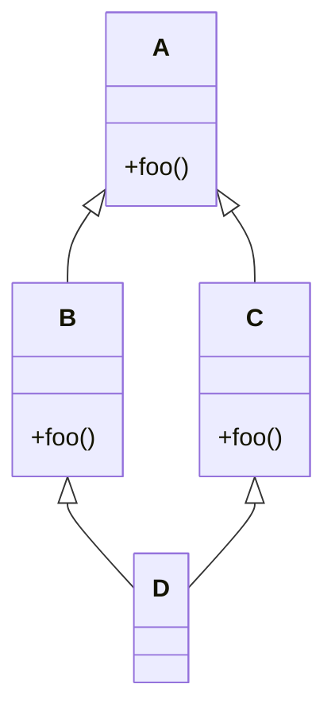
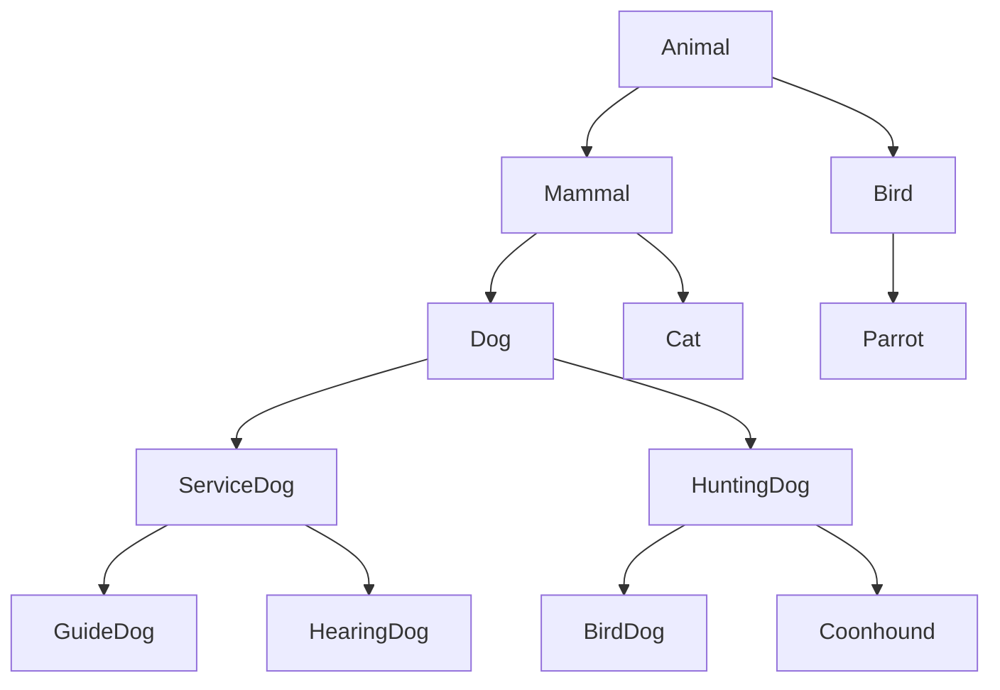
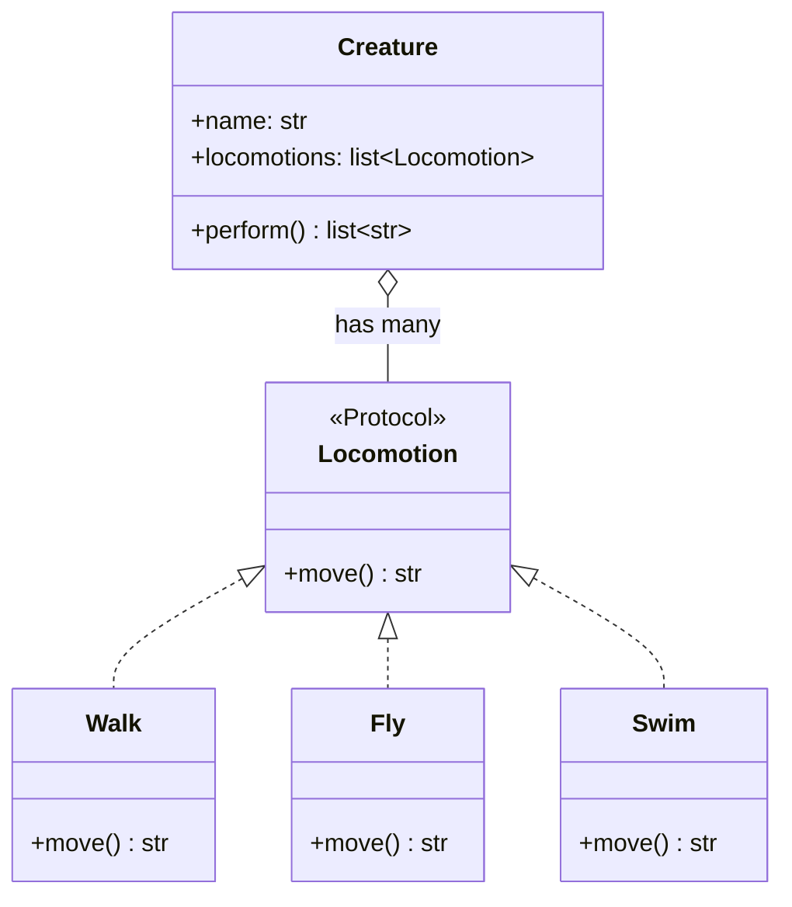
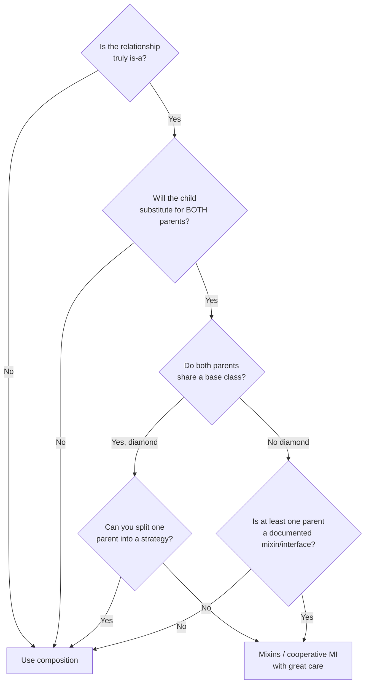
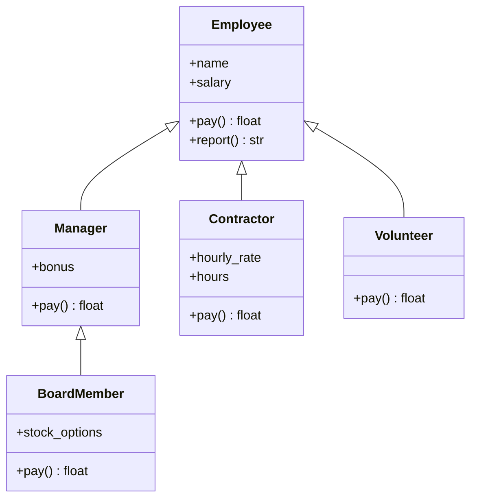
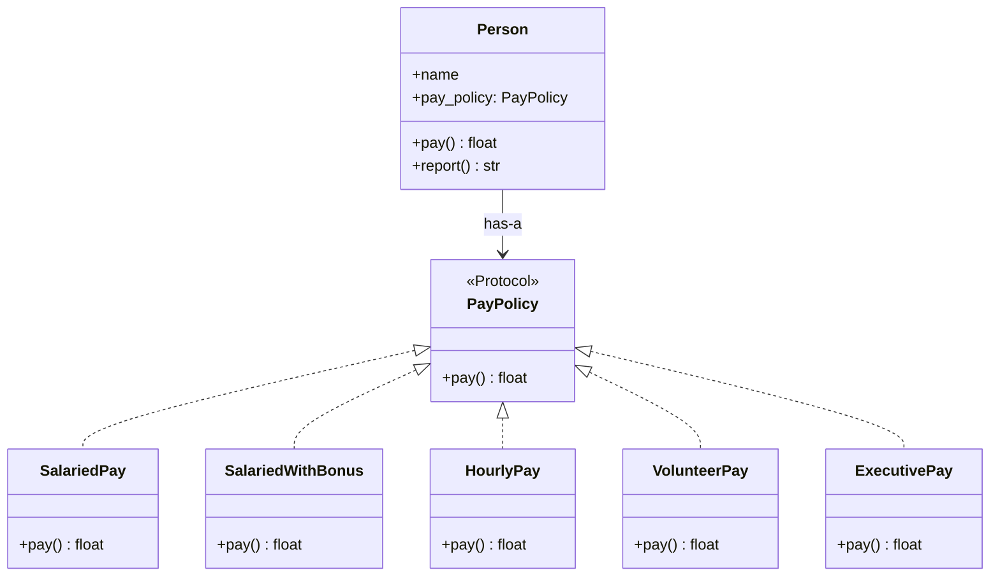

# Composition over Inheritance

> [!tip] The single most important OOP design heuristic
> "Favor **object composition** over **class inheritance**." — *Gang of Four (1994)*, p. 20.

Related: [[solid-principles]] (esp. LSP, DIP), [[inheritance]], [[abstraction]], [[design-patterns-structural]] (most structural patterns are composition in disguise), [[dependency-injection]], [[grasp-and-extra-principles]].

---

## Why This Matters

Inheritance is the **first** code-reuse mechanism most OOP courses teach, so it's the first one developers reach for. But it's also the most overused, and the most brittle. The GoF wrote the warning 30 years ago and most modern OOP literature (including [[solid-principles]]) has only amplified it.

> [!danger] Inheritance is the **strongest** form of coupling in OOP
> A subclass is **statically bound** to its parent at compile time, *forever*. You cannot change your mind at runtime, and a change to the parent ripples to every subclass. Composition is just a reference — you can swap it.

Let's see *why* inheritance rots.

---

## The Problems with Inheritance

### 1. The Diamond Problem (Multiple Inheritance)

When a class inherits from two classes that share a common ancestor, the inheritance graph forms a **diamond**:



Which `foo()` does `D` inherit? Different languages resolve this differently:

- **C++**: explicit virtual inheritance or ambiguity error.
- **Java**: forbids multiple class inheritance (only multiple interfaces).
- **Python**: uses **C3 linearization** (MRO — Method Resolution Order). You can always ask `D.__mro__`.

```python
class A:
    def hello(self) -> str:
        return "A"

class B(A):
    def hello(self) -> str:
        return "B"

class C(A):
    def hello(self) -> str:
        return "C"

class D(B, C):
    pass

print(D().hello())      # "B"   (B is first in MRO)
print(D.__mro__)        # (D, B, C, A, object)
```

The MRO is *predictable* but *non-obvious*. When a maintainer reads `D().hello()`, they have to mentally run the C3 algorithm to know which method fires. That's cognitive load.

> [!warning] Diamond problem in real code
> Most "diamonds" in real Python code don't even look like diamonds — they're accidental. Someone subclasses `dict` and `collections.UserDict` and `MyBase` and the MRO becomes a puzzle. Mixins amplify this — see [[#Mixins in Python (and their dangers)]].

### 2. The Fragile Base Class Problem

A base class that seems safe to evolve can break subclasses in non-obvious ways:

```python
class Counter:
    def __init__(self) -> None:
        self._count = 0

    def increment(self) -> None:
        self._count += 1

    def increment_twice(self) -> None:
        self.increment()
        self.increment()


class LoggingCounter(Counter):
    def increment(self) -> None:
        print(f"increment → {self._count + 1}")
        super().increment()
```

So far, so good. Now the base class author decides to optimise:

```python
class Counter:
    # ...
    def increment_twice(self) -> None:
        self._count += 2      # inline the calls for "efficiency"
```

Now `LoggingCounter.increment_twice()` no longer prints anything — the override was silently bypassed. The base class change is "safe" by its own contract but breaks every subclass that overrode `increment`.

> [!danger] Fragile base classes are a *fact of life* in inheritance-heavy code
> The base class author cannot predict every way subclasses will override methods. There is no clean solution except: **don't rely on inheritance across module boundaries** unless the base class documents its extension contract explicitly.

### 3. Deep Hierarchies Become Unreadable



To understand `GuideDog.bark()`, you must walk six levels up looking for the definition. Each level adds a fact ("GuideDog is a ServiceDog, which is a Dog, which is a Mammal, which is an Animal, which is alive"). Real codebases have hierarchies 7+ levels deep — and they're the ones nobody volunteers to maintain.

### 4. Inheritance Breaks Encapsulation

A subclass sees its parent's `protected` (and in Python, even "private" `_name`) attributes. The subclass is *implemented in terms of* the parent's internals. The parent can't change those internals without breaking subclasses it doesn't even know about.

> [!note] Joshua Bloch: "Design and document for inheritance, or else prohibit it."
> Either declare your class `final`/sealed, or carefully document every method's overridability and self-use. The middle ground — *inheritable but undocumented* — is where fragile-base-class bugs are born.

### 5. Inheritance Is Static

You pick a parent at class definition time. You cannot change it at runtime. If `GuideDog` extends `ServiceDog` extends `Dog`, you cannot later say "this particular dog is no longer a guide dog; demote it to plain `Dog`". With composition, you just unplug the strategy.

---

## Composition: The "Has-A" Alternative

**Inheritance** models *is-a*: `Dog` is an `Animal`.
**Composition** models *has-a*: `Car` has an `Engine`.

With composition, behaviour is delegated to *parts* — small focused objects held by reference. You can swap a part at runtime; you can mock it in tests; you can recombine parts freely.

### A trivial example — moving things

#### ❌ Inheritance version (rigid)

```python
# bad_inheritance.py
class Walker:
    def move(self) -> str:
        return "walking"

class Flyer(Walker):                    # Flyer is-a Walker? hmm
    def move(self) -> str:
        return "flying"

class Swimmer(Flyer):                   # Swimmer is-a Flyer? forced into a tower
    def move(self) -> str:
        return "swimming"

class Duck(Swimmer):                    # Duck is-a Swimmer
    pass                                # but ducks can walk, fly, AND swim
```

To model a duck that does *all three*, you'd need multiple inheritance, override `move` with a parameter, or — more honestly — give up and rewrite.

#### ✅ Composition version (flexible)

```python
# good_composition.py
from dataclasses import dataclass
from typing import Protocol


class Locomotion(Protocol):
    def move(self) -> str: ...


class Walk:
    def move(self) -> str: return "walking 🚶"

class Fly:
    def move(self) -> str: return "flying 🦅"

class Swim:
    def move(self) -> str: return "swimming 🏊"


@dataclass
class Creature:
    name: str
    locomotions: list[Locomotion]

    def perform(self) -> list[str]:
        return [f"{self.name} is {l.move()}" for l in self.locomotions]


duck = Creature("Duck", [Walk(), Fly(), Swim()])
penguin = Creature("Penguin", [Walk(), Swim()])
eagle = Creature("Eagle", [Fly()])

print(duck.perform())
# ['Duck is walking 🚶', 'Duck is flying 🦅', 'Duck is swimming 🏊']
print(penguin.perform())
# ['Penguin is walking 🚶', 'Penguin is swimming 🏊']
```



What changed?
- We modelled the **varying behaviour** (`move`) as a swappable object, not as a level of hierarchy.
- A creature **has** zero or more locomotion strategies — the cardinality is data, not type.
- Adding `Teleport` doesn't touch `Walk`/`Fly`/`Swim` ([[solid-principles#O — Open/Closed Principle (OCP)|OCP]]).

### Delegation

When the "part" should be transparent to clients, you can expose its methods through the container — that's **delegation**:

```python
class Duck:
    def __init__(self) -> None:
        self._legs = Walk()
        self._wings = Fly()
        self._flippers = Swim()

    def walk(self) -> str: return self._legs.move()
    def fly(self)  -> str: return self._wings.move()
    def swim(self) -> str: return self._flippers.move()

# Even shorter with __getattr__ for one-line delegation:
class Duck:
    def __init__(self) -> None:
        self._parts = {"walk": Walk(), "fly": Fly(), "swim": Swim()}

    def __getattr__(self, name: str) -> str:
        # Only called when normal attribute lookup fails
        if name in self._parts:
            return self._parts[name].move
        raise AttributeError(name)
```

> [!tip] `__getattr__` delegation is powerful — and dangerous
> It can hide methods you didn't intend to expose, break type checking, and confuse IDEs. Use sparingly, and consider `dataclasses` + explicit forwarding methods first.

---

## Mixins in Python (and their dangers)

A **mixin** is a class designed to be *multiply inherited* to add a slice of behaviour. Python uses them heavily: `collections.UserDict`, `contextlib.AbstractContextManager`, `logging.LoggerAdapter`, Django's many CBV mixins.

```python
# mixins.py
from datetime import datetime


class TimestampMixin:
    """Adds created_at / updated_at management."""
    def __init__(self, *args, **kwargs) -> None:
        super().__init__(*args, **kwargs)        # cooperative super()
        self.created_at = datetime.utcnow()
        self.updated_at = self.created_at

    def touch(self) -> None:
        self.updated_at = datetime.utcnow()


class JsonMixin:
    """Adds to_json() for any object with a __dict__."""
    def to_json(self) -> str:
        import json
        return json.dumps(self.__dict__, default=str)


class ReprMixin:
    def __repr__(self) -> str:
        attrs = ", ".join(f"{k}={v!r}" for k, v in self.__dict__.items())
        return f"{type(self).__name__}({attrs})"


class Document(TimestampMixin, JsonMixin, ReprMixin):
    def __init__(self, title: str) -> None:
        super().__init__()
        self.title = title


doc = Document("Hello")
print(doc)            # Document(title='Hello', created_at=..., updated_at=...)
print(doc.to_json())  # {"title": "Hello", "created_at": "...", "updated_at": "..."}
doc.touch()
```

### Why mixins work in Python

The `super().__init__()` calls walk the **MRO** cooperatively. Each mixin forwards to the next class, so all initialisers run. This is "cooperative multiple inheritance".

### The dangers

> [!danger] Mixins are still multiple inheritance
> Mixins are subject to every problem in this note — diamond, fragile base class, deep MRO. They *look* lightweight but they're inheritance.

| Danger                                              | Symptom                                                        |
| --------------------------------------------------- | -------------------------------------------------------------- |
| **Order matters**                                  | `class Foo(MixinA, MixinB)` vs `(MixinB, MixinA)` behave differently |
| **Cooperative super()** required                  | A mixin that doesn't call `super()` breaks the chain          |
| **Implicit state**                                  | Mixins store attributes on `self`; collisions with the host class are silent |
| **Naming collisions**                              | Two mixins both define `save()` → one is silently shadowed     |
| **Hard to test in isolation**                      | A mixin needs a host class to instantiate                     |

### Rules of thumb for mixins

1. **Stateless mixins** (pure method providers) are safer than stateful ones.
2. Don't use **more than 2–3 mixins** in a single class. If you need more, you're modelling a graph with a tree.
3. Each mixin should **call `super()`** in every method it overrides.
4. Use **explicit role interfaces** ([[solid-principles#I — Interface Segregation Principle (ISP)|ISP]]) over implicit mixins when you can.

> [!tip] Composition alternative
> Most mixins can be rephrased as **decorator objects** (see [[design-patterns-structural#4. Decorator|Decorator pattern]]) or **strategy objects**. The composed version is more flexible (swap parts at runtime) and easier to test (mock the part).

---

## Multiple Inheritance vs Composition — A Decision Framework

Use this checklist when you're about to write `class Child(ParentA, ParentB)`:



### Quick decision rules

| Question                                    | If "Yes" →          | If "No" →            |
| ------------------------------------------- | ------------------- | -------------------- |
| Is it `is-a` (substitutable)?               | candidate for inheritance | composition          |
| Is the parent designed & documented for inheritance? | inheritance OK | composition          |
| Will the child override methods?            | risk LSP violation  | composition          |
| Does the child need to swap behaviour at runtime? | composition    | inheritance          |
| Are there multiple unrelated parents?       | composition + interfaces | cooperative MI       |

### Heuristic: "If you have to ask 'should I inherit?', the answer is no."

Inheritance should be the *last* tool you reach for, after composition and interfaces have been considered and explicitly rejected.

---

## Refactoring Walkthrough: Inheritance → Composition

### Before: a tangled hierarchy

```python
# before.py — bad inheritance hierarchy
class Employee:
    def __init__(self, name: str, salary: float):
        self.name = name
        self.salary = salary

    def pay(self) -> float:
        return self.salary

    def report(self) -> str:
        return f"{self.name} earns {self.pay()}"


class Manager(Employee):
    def __init__(self, name, salary, bonus: float):
        super().__init__(name, salary)
        self.bonus = bonus

    def pay(self) -> float:
        return super().pay() + self.bonus


class Contractor(Employee):
    def __init__(self, name, hourly_rate: float, hours: int):
        super().__init__(name, 0)             # ⚠️ forced to pass 0
        self.hourly_rate = hourly_rate
        self.hours = hours

    def pay(self) -> float:
        return self.hourly_rate * self.hours


class Volunteer(Employee):
    def __init__(self, name):
        super().__init__(name, 0)

    def pay(self) -> float:
        return 0.0


class BoardMember(Manager):                  # board members are managers? hmm
    def __init__(self, name, salary, bonus, stock_options: float):
        super().__init__(name, salary, bonus)
        self.stock_options = stock_options

    def pay(self) -> float:
        return super().pay() + self.stock_options
```

Problems:
- `Contractor` and `Volunteer` are *not really* employees — they happen to share a `pay()` method. We forced them into the hierarchy to reuse two lines of code.
- `BoardMember` extends `Manager` to reuse `bonus` handling, but a board member is *not* a manager — they're a director.
- `pay()` is overridden 4 times, each calling `super().pay()`. Fragile.
- Adding a new pay model (e.g. `CommissionWorker`) means picking a parent.

### After: composition with a pay policy

```python
# after.py — composition with strategy
from __future__ import annotations
from dataclasses import dataclass
from typing import Protocol


class PayPolicy(Protocol):
    def pay(self) -> float: ...


@dataclass
class SalariedPay:
    salary: float
    def pay(self) -> float: return self.salary


@dataclass
class SalariedWithBonus:
    salary: float
    bonus: float
    def pay(self) -> float: return self.salary + self.bonus


@dataclass
class HourlyPay:
    rate: float
    hours: int
    def pay(self) -> float: return self.rate * self.hours


@dataclass
class VolunteerPay:
    def pay(self) -> float: return 0.0


@dataclass
class ExecutivePay:
    salary: float
    bonus: float
    stock_options: float
    def pay(self) -> float: return self.salary + self.bonus + self.stock_options


@dataclass
class Person:
    name: str
    pay_policy: PayPolicy

    def pay(self) -> float: return self.pay_policy.pay()

    def report(self) -> str:
        return f"{self.name} earns {self.pay()}"


# Build any combination freely
people: list[Person] = [
    Person("Alice", SalariedPay(60_000)),
    Person("Bob",   SalariedWithBonus(70_000, 10_000)),
    Person("Carol", HourlyPay(50, 160)),
    Person("Dan",   VolunteerPay()),
    Person("Eve",   ExecutivePay(120_000, 30_000, 200_000)),
]

for p in people:
    print(p.report())
```

### Before / After Diagrams





### What did we gain?

- **Open/Closed**: a new pay model means a new `PayPolicy` subclass — no edits to existing ones.
- **LSP**: no more fake `Employee` subclasses. `Person` is the only type callers see.
- **Testability**: each policy is a tiny pure dataclass — trivially unit-testable. Mock `PayPolicy` for `Person` tests.
- **Reusability**: `HourlyPay` could be used by `Invoice`, not just `Person`.
- **No fragile base**: no parent to break.

### What did we lose?

- Slightly more wiring at construction (typically done at the [[grasp-and-extra-principles#Composition root|composition root]]).
- One extra layer of indirection (`person.pay_policy.pay()` vs `employee.pay()`).

The trade is almost always worth it.

---

## When Inheritance Is Still Right

Don't throw out inheritance entirely — it has legitimate uses:

1. **Type substitution** that's *truly* `is-a`. `AssertionError` is an `Exception`. `OrderedDict` is a `dict`. The child really does everything the parent does, plus possibly more.
2. **Framework extension points** where the framework *documents* the inheritance contract (e.g. Django's `Model`, unittest's `TestCase`).
3. **Mixins** for small, well-defined slices of behaviour (with the caveats above).
4. **Abstract base classes** for shared *interface* + default *implementation* (e.g. `collections.abc.Mapping`).

> [!tip] The smell test
> If your subclass overrides a method to do something *different* (rather than *more*), it's probably composition in disguise. If your subclass's `isinstance` check fails LSP, it's definitely composition in disguise.

---

## Key Takeaways

1. **Inheritance is the strongest coupling** in OOP — use it sparingly.
2. The **diamond problem**, **fragile base class**, and **deep hierarchies** are the classic inheritance smells.
3. **Composition** models `has-a`: hold a reference to a part, delegate to it, swap it at runtime.
4. **Mixins** are multiple inheritance in disguise — useful but dangerous; keep them stateless and few.
5. **Strategy** ([[design-patterns-behavioral#8. Strategy|Strategy pattern]]) is composition applied to "varying algorithm".
6. **Decorator** ([[design-patterns-structural#4. Decorator|Decorator pattern]]) is composition applied to "add behaviour".
7. Reach for inheritance only when the relationship is **truly `is-a`** and the parent is **designed for inheritance**.
8. The refactoring *Inheritance Tower → Composition + Strategy* is one of the highest-leverage moves in OOP.

---

## Practice Exercises

> [!exercise] 1. Spot the misuse
> ```python
> class Stack(list):       # Stack "is-a" list
>     def push(self, x): self.append(x)
>     def pop(self): return super().pop()
> ```
> What does the user gain by inheriting from `list`? What problems will this cause? Rewrite using composition.

> [!exercise] 2. Locomotion
> Implement the locomotion example from this note. Add `Teleport` and `Climb`. Then add a `Chimera` that has all five locomotions.

> [!exercise] 3. Mixin audit
> Pick a Django class-based view or a Flask view that uses multiple mixins. List every method it actually has (via MRO). Identify at least one fragile dependency.

> [!exercise] 4. Refactor: payment
> Take the `Employee` hierarchy from the refactoring walkthrough and add two more pay models *without* refactoring — then with the composition version. Compare effort.

> [!exercise] 5. Decision framework
> Apply the decision framework flowchart to: `class JsonEncoder(dict)`. Should it inherit from `dict`? Why or why not?

> [!exercise] 6. Bridge from inheritance
> Take a hierarchy in a codebase you know that branches on two dimensions (e.g. `Notification` × `Transport`). Refactor it to a [[design-patterns-structural#2. Bridge|Bridge]]: split abstraction from implementation.

> [!exercise] 7. Convert a mixin to a strategy
> Find (or write) a `TimestampMixin`. Refactor it into a `Timestamp` strategy object that's composed into the host. What becomes easier? What becomes harder?

> [!exercise] 8. Diagram
> Draw a Mermaid diagram of a small system in your codebase that uses inheritance heavily. Then draw the composition-flavoured version. Compare coupling arrows.

> [!exercise] 9. Cooperative super()
> Write three mixins (`TimestampMixin`, `AuditMixin`, `CacheMixin`) that all override `__init__` and call `super().__init__()`. Verify they all run in the expected MRO order.

> [!exercise] 10. Reflection
> Write a paragraph (in your own words) explaining to a junior dev: "Why is `isinstance` in business code often a smell that inheritance was the wrong tool?"

---

Next: [[dependency-injection]] | [[grasp-and-extra-principles]] | [[solid-principles]] | [[design-patterns-structural]]
