# Behavioral Design Patterns — Object Communication in Python

#oop #design-patterns #behavioral #gof #chain-of-responsibility #command #iterator #observer #strategy #state #visitor #teaching #deep-dive

> [!quote] Gang of Four
> "Behavioral patterns are concerned with algorithms and the assignment of responsibilities between objects. They characterize complex control flow that's difficult to follow at run-time. They shift your focus away from flow of control to let you concentrate just on the way objects are interconnected."

Creational patterns are about *making* objects ([[Creational-Patterns]]). Structural patterns are about *connecting* objects ([[Structural-Patterns]]). **Behavioral patterns are about how objects *talk* to each other** — who sends what message to whom, when, and how.

This note covers all eleven GoF behavioral patterns:

- [[#1. Chain of Responsibility|Chain of Responsibility]] — pass requests along a chain
- [[#2. Command|Command]] — encapsulate a request as an object
- [[#3. Interpreter|Interpreter]] — grammar interpreter
- [[#4. Iterator|Iterator]] — sequential access without exposing internals
- [[#5. Mediator|Mediator]] — central object coordinates colleagues
- [[#6. Memento|Memento]] — capture and restore state
- [[#7. Observer|Observer]] — publish/subscribe
- [[#8. State|State]] — behavior changes with state
- [[#9. Strategy|Strategy]] — interchangeable algorithms
- [[#10. Template Method|Template Method]] — skeleton algorithm with hooks
- [[#11. Visitor|Visitor]] — separate algorithm from structure

Prerequisite reading: [[Polymorphism]], [[Encapsulation]], [[Abstraction]], [[Classes-And-Objects]].

---

## 0. Why Behavioral Patterns Exist

Once your code has more than a handful of objects, the **control flow** between them becomes the bottleneck on clarity. Behavioral patterns answer:

- *Who decides which handler processes this request?* → Chain of Responsibility
- *How do I queue, undo, or log an action?* → Command
- *How do I traverse a structure without knowing its shape?* → Iterator, Visitor
- *How do I broadcast events without coupling sender to receivers?* → Observer
- *How do I change behavior based on internal state?* → State
- *How do I swap an algorithm at runtime?* → Strategy

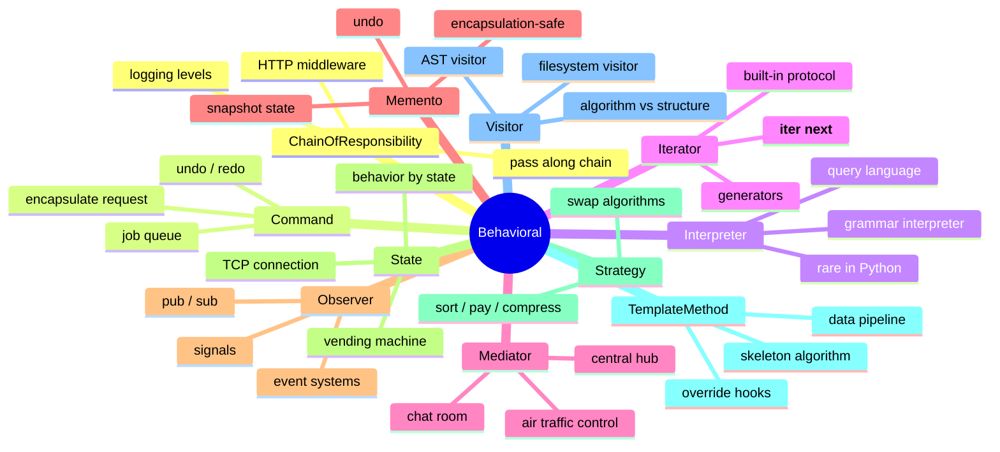

### 0.1 The Eleven Patterns at a Glance

| Pattern | Core Idea | Pythonic Hint |
|---------|-----------|----------------|
| **Chain of Responsibility** | Pass request until handled | Linked list of handlers |
| **Command** | Object encapsulates an action | Function + state = Command object |
| **Interpreter** | Define a grammar + evaluator | Use `ast`, `ply`, or just functions |
| **Iterator** | Traversal interface | `__iter__` / `__next__`, generators |
| **Mediator** | Central hub coordinates colleagues | Chat room, event bus |
| **Memento** | Snapshot for undo | `dataclass(frozen=True)` snapshots |
| **Observer** | Pub/sub event broadcasting | `signal`/`slot`, `Observable` mixin |
| **State** | Behavior tied to state objects | Replace `if state ==` with state class |
| **Strategy** | Swap algorithms | Pass a callable, or strategy class |
| **Template Method** | Inherited skeleton + hooks | `super().method()` between steps |
| **Visitor** | External algorithms over a structure | Double dispatch, `visit_*` methods |

> [!tip] Teaching Tip
> Behavioral patterns are where students get the most "aha" moments. Many of them turn out to be cousins: Strategy and State are structurally identical; Template Method and Strategy solve related problems; Command and Memento work together for undo.

---

## 1. Chain of Responsibility

### 1.1 Intent

Avoid coupling the sender of a request to its receiver by giving more than one object a chance to handle the request. Chain the receiving objects and pass the request along until an object handles it.

### 1.2 When to Use

- More than one object may handle a request, and the handler isn't known a priori.
- You want to issue a request to one of several objects without specifying the receiver explicitly.
- The set of objects that can handle a request should be specified dynamically.

### 1.3 When NOT to Use

- When the handler is fixed and known — a direct call is clearer.
- When the chain is short and never changes — a switch is fine.
- When each request must be handled by *every* link (that's a **pipeline**, not a chain).

### 1.4 Real-World Examples

- HTTP middleware (Django, Flask, FastAPI): request → auth → CORS → rate-limit → handler.
- Logging: DEBUG → INFO → WARNING → ERROR (each level may decide to handle or pass).
- Exception handlers in nested `try` blocks.
- Customer support escalation: tier 1 → tier 2 → tier 3 → engineering.
- DOM event bubbling in browsers.

### 1.5 Structure

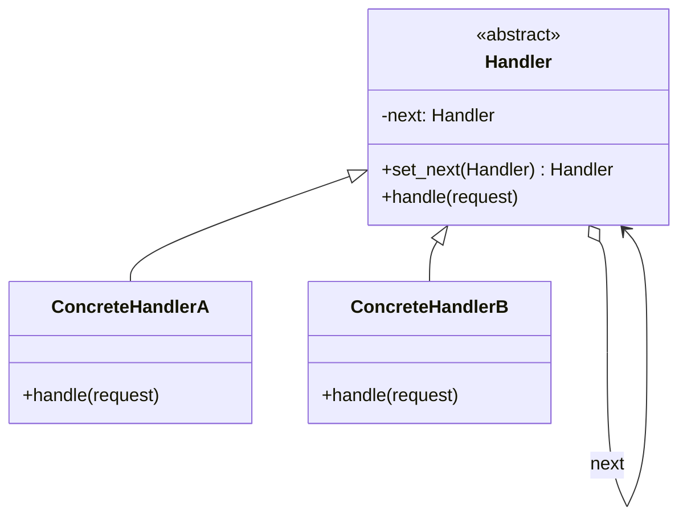

### 1.6 Python Implementation — HTTP Middleware

```python
from abc import ABC, abstractmethod
from dataclasses import dataclass


@dataclass
class Request:
    method: str
    path: str
    headers: dict[str, str]
    body: str = ""


@dataclass
class Response:
    status: int
    body: str


class Middleware(ABC):
    def __init__(self):
        self._next: Middleware | None = None

    def set_next(self, middleware: "Middleware") -> "Middleware":
        self._next = middleware
        return middleware

    @abstractmethod
    def handle(self, request: Request) -> Response | None:
        if self._next:
            return self._next.handle(request)
        return None


class AuthMiddleware(Middleware):
    def handle(self, request: Request) -> Response | None:
        token = request.headers.get("Authorization", "")
        if not token:
            return Response(401, "Missing auth token")
        if token != "Bearer secret":
            return Response(403, "Invalid token")
        return super().handle(request)


class CORSMiddleware(Middleware):
    def handle(self, request: Request) -> Response | None:
        if request.method == "OPTIONS":
            return Response(204, "")
        # Add CORS headers, then pass along
        return super().handle(request)


class RateLimitMiddleware(Middleware):
    def __init__(self, max_per_minute: int = 100):
        super().__init__()
        self._max = max_per_minute
        self._count = 0

    def handle(self, request: Request) -> Response | None:
        self._count += 1
        if self._count > self._max:
            return Response(429, "Too many requests")
        return super().handle(request)


class FinalHandler(Middleware):
    def handle(self, request: Request) -> Response | None:
        return Response(200, f"Hello! You requested {request.path}")


# Build the chain:
chain = AuthMiddleware()
chain.set_next(CORSMiddleware()).set_next(RateLimitMiddleware()).set_next(FinalHandler())

# Make a valid request:
r = Request("GET", "/api/users", {"Authorization": "Bearer secret"})
print(chain.handle(r))   # Response(status=200, body='Hello! You requested /api/users')

# Missing auth:
r = Request("GET", "/api/users", {})
print(chain.handle(r))   # Response(status=401, body='Missing auth token')
```

### 1.7 Functional Pipeline Alternative

In Python, chains are often built with plain functions:

```python
def auth(request, next_):
    if request.headers.get("Authorization") != "Bearer secret":
        return Response(401, "Unauthorized")
    return next_(request)


def cors(request, next_):
    if request.method == "OPTIONS":
        return Response(204, "")
    return next_(request)


def final(request, next_=None):
    return Response(200, f"Hello {request.path}")


def compose(*middlewares):
    def reduced(request):
        handler = final
        for mw in reversed(middlewares):
            handler = (lambda mw, h: (lambda req: mw(req, h)))(mw, handler)
        return handler(request)
    return reduced


pipeline = compose(auth, cors)
print(pipeline(Request("GET", "/x", {"Authorization": "Bearer secret"})))
# Response(status=200, body='Hello /x')
```

### 1.8 Common Mistakes

1. **Forgetting to forward**. A handler that returns `None` without calling `next_` silently swallows the request.
2. **Cycles in the chain**. If A's `next` is B and B's `next` is A, you get infinite recursion. Validate at `set_next` time.
3. **Long chains with hidden behavior**. A 10-deep chain is hard to debug. Provide a way to inspect the chain (e.g., `chain.describe()`).

### 1.9 Related Patterns

- **Command** — CoR handlers are often Command-like; the chain dispatches commands.
- **Composite** — recursive structures naturally form chains.
- **Decorator** — structurally similar (linked wrappers), but Decorator adds behavior; CoR decides whether to handle.

---

## 2. Command

### 2.1 Intent

Encapsulate a request as an object, thereby letting you parameterize clients with different requests, queue or log requests, and support undoable operations.

### 2.2 When to Use

- You need to **undo** operations.
- You need to **queue** operations (job queues, scheduling).
- You need to **log** operations (audit trail, replay).
- You want to parameterize an action by an object (e.g., GUI button → command).
- You want to support **transactions** (commit/rollback).

### 2.3 When NOT to Use

- When the action is trivial and one-shot — a plain function call is clearer.
- When you don't need undo/queue/log — wrapping everything in Command objects adds boilerplate.
- In Python, when a function with closures would suffice.

### 2.4 Real-World Examples

- GUI toolkits: a `Button` has an attached `Command`; clicking invokes `command.execute()`.
- `celery` tasks — Python functions wrapped as command-like message payloads.
- Database transaction logs — each operation is a command that can be replayed.
- `unittest.mock.Mock` records calls as command-like objects.

### 2.5 Structure

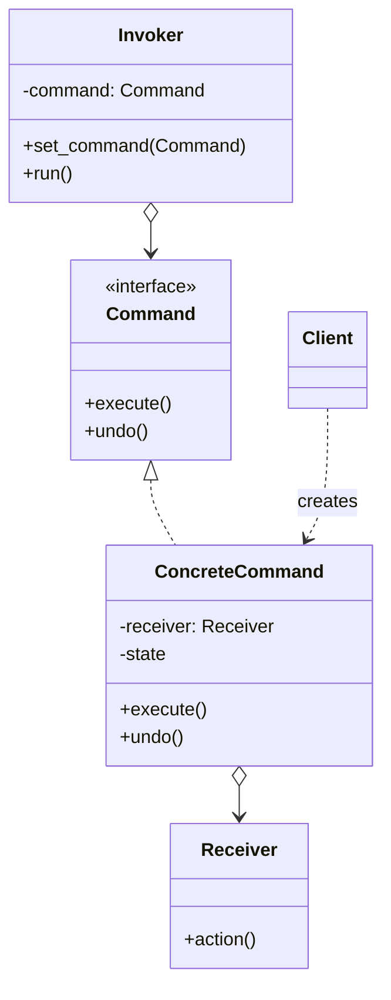

### 2.6 Python Implementation — Editor with Undo/Redo

```python
from abc import ABC, abstractmethod


class TextEditor:
    """Receiver — knows how to apply primitive operations."""
    def __init__(self):
        self._text = ""

    @property
    def text(self) -> str:
        return self._text

    def insert(self, text: str, position: int | None = None) -> None:
        if position is None:
            position = len(self._text)
        self._text = self._text[:position] + text + self._text[position:]

    def delete(self, start: int, end: int) -> str:
        removed = self._text[start:end]
        self._text = self._text[:start] + self._text[end:]
        return removed


class Command(ABC):
    @abstractmethod
    def execute(self) -> None: ...

    @abstractmethod
    def undo(self) -> None: ...


class InsertCommand(Command):
    def __init__(self, editor: TextEditor, text: str, position: int | None = None):
        self._editor = editor
        self._text = text
        self._position = position if position is not None else len(editor.text)
        self._executed = False

    def execute(self) -> None:
        self._editor.insert(self._text, self._position)
        self._executed = True

    def undo(self) -> None:
        if not self._executed:
            return
        end = self._position + len(self._text)
        self._editor.delete(self._position, end)
        self._executed = False


class DeleteCommand(Command):
    def __init__(self, editor: TextEditor, start: int, end: int):
        self._editor = editor
        self._start = start
        self._end = end
        self._deleted_text = ""

    def execute(self) -> None:
        self._deleted_text = self._editor.delete(self._start, self._end)

    def undo(self) -> None:
        self._editor.insert(self._deleted_text, self._start)


class CommandHistory:
    """Invoker — tracks undo / redo stacks."""
    def __init__(self):
        self._undo_stack: list[Command] = []
        self._redo_stack: list[Command] = []

    def execute(self, command: Command) -> None:
        command.execute()
        self._undo_stack.append(command)
        self._redo_stack.clear()

    def undo(self) -> None:
        if not self._undo_stack:
            return
        cmd = self._undo_stack.pop()
        cmd.undo()
        self._redo_stack.append(cmd)

    def redo(self) -> None:
        if not self._redo_stack:
            return
        cmd = self._redo_stack.pop()
        cmd.execute()
        self._undo_stack.append(cmd)


# Usage:
editor = TextEditor()
history = CommandHistory()

history.execute(InsertCommand(editor, "Hello"))
history.execute(InsertCommand(editor, " world"))
print(editor.text)  # Hello world

history.execute(DeleteCommand(editor, 0, 5))
print(editor.text)  #  world

history.undo()
print(editor.text)  # Hello world

history.undo()
print(editor.text)  # Hello

history.redo()
print(editor.text)  # Hello world
```

### 2.7 Macro Commands

A Command that aggregates other Commands — useful for batch operations:

```python
class MacroCommand(Command):
    def __init__(self, commands: list[Command]):
        self._commands = commands

    def execute(self) -> None:
        for cmd in self._commands:
            cmd.execute()

    def undo(self) -> None:
        # Undo in reverse order!
        for cmd in reversed(self._commands):
            cmd.undo()
```

### 2.8 Common Mistakes

1. **Undo that doesn't truly reverse**. A `DeleteCommand.undo` must restore exactly the deleted bytes, including any unicode boundaries.
2. **Forgetting to clear the redo stack on new execution**. Once you execute a new command after an undo, the old redo path is invalid.
3. **Commands with side effects outside the receiver** (e.g., sending an email). Undo can't un-send.

### 2.9 Related Patterns

- **Memento** — alternative for undo: snapshot state instead of inverse operations.
- **Composite** — MacroCommand is a Composite of Commands.
- **Strategy** — Command encapsulates *one* action; Strategy encapsulates *an algorithm*.

---

## 3. Interpreter

### 3.1 Intent

Given a language, define a representation for its grammar along with an interpreter that uses the representation to interpret sentences in the language.

### 3.2 When to Use

- The grammar is simple and unlikely to grow much.
- Efficiency is not critical (interpreters are slower than compiled parsers).
- You want to expose a small DSL to your users.

### 3.3 When NOT to Use

- For complex grammars — use a parser generator (`ply`, `lark`, `pyparsing`, `antlr`).
- When performance matters — compile, don't interpret.
- When the "language" is really just configuration — use JSON/YAML/TOML.

### 3.4 Real-World Examples

- SQL-like query languages in ORMs (Django ORM, SQLAlchemy expressions).
- Regular expressions (`re` compiles to an NFA/DFA, not strictly Interpreter, but the conceptual shape is similar).
- Spreadsheet formulas.
- `ast.literal_eval` — interprets a subset of Python's literal grammar.
- `doit`, `make`-like task DSLs.

### 3.5 Structure

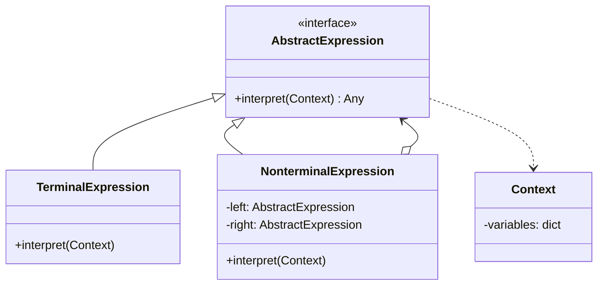

### 3.6 Python Implementation — Tiny Query Language

A mini-language that supports `field = value AND field2 = value2`, evaluated against a dict.

```python
from abc import ABC, abstractmethod
from typing import Any


class Expression(ABC):
    @abstractmethod
    def interpret(self, record: dict[str, Any]) -> bool: ...


class Equals(Expression):
    def __init__(self, field: str, value: Any):
        self.field = field
        self.value = value

    def interpret(self, record: dict[str, Any]) -> bool:
        return record.get(self.field) == self.value


class GreaterThan(Expression):
    def __init__(self, field: str, value: Any):
        self.field = field
        self.value = value

    def interpret(self, record: dict[str, Any]) -> bool:
        return record.get(self.field, float("-inf")) > self.value


class And(Expression):
    def __init__(self, left: Expression, right: Expression):
        self.left = left
        self.right = right

    def interpret(self, record: dict[str, Any]) -> bool:
        return self.left.interpret(record) and self.right.interpret(record)


class Or(Expression):
    def __init__(self, left: Expression, right: Expression):
        self.left = left
        self.right = right

    def interpret(self, record: dict[str, Any]) -> bool:
        return self.left.interpret(record) or self.right.interpret(record)


class Not(Expression):
    def __init__(self, expr: Expression):
        self.expr = expr

    def interpret(self, record: dict[str, Any]) -> bool:
        return not self.expr.interpret(record)


# Build: (age > 18) AND (country = "US" OR country = "CA")
rule = And(
    GreaterThan("age", 18),
    Or(Equals("country", "US"), Equals("country", "CA")),
)

records = [
    {"name": "Alice", "age": 30, "country": "US"},
    {"name": "Bob", "age": 17, "country": "US"},
    {"name": "Charlie", "age": 25, "country": "CA"},
    {"name": "Dora", "age": 40, "country": "FR"},
]

for r in records:
    if rule.interpret(r):
        print("match:", r["name"])
# match: Alice
# match: Charlie
```

### 3.7 A Real Parser Front-End

The above builds the AST manually. A real DSL needs a parser. With `lark`:

```python
# pip install lark
from lark import Lark, Transformer

grammar = """
    ?start: expr
    ?expr: expr "AND" expr -> and_
         | expr "OR" expr  -> or_
         | "NOT" expr      -> not_
         | comparison
    ?comparison: field "=" value   -> eq
               | field ">" NUMBER  -> gt
    field: NAME
    value: STRING | NUMBER
    %import common.ESCAPED_STRING -> STRING
    %import common.NUMBER -> NUMBER
    %import common.CNAME -> NAME
    %import common.WS
    %ignore WS
"""

parser = Lark(grammar, start="start", parser="lalr")


class ToAST(Transformer):
    def and_(self, items): return And(items[0], items[1])
    def or_(self, items):  return Or(items[0], items[1])
    def not_(self, items): return Not(items[0])
    def eq(self, items):
        field = str(items[0])
        value = items[1]
        return Equals(field, value)
    def gt(self, items):
        return GreaterThan(str(items[0]), float(items[1]))
    def field(self, items): return str(items[0])
    def value(self, items): return items[0]
    def STRING(self, s): return s[1:-1]
    def NUMBER(self, n): return float(n)


ast = ToAST().transform(parser.parse('age > 18 AND (country = "US" OR country = "CA")'))
print(ast.interpret({"age": 30, "country": "US"}))   # True
```

### 3.8 Common Mistakes

1. **Building the Interpreter pattern for what should be a config file**. If your "DSL" is just `key: value` pairs, use YAML.
2. **Forgetting to memoize**. Naive recursive interpretation can be exponentially slow on certain grammars.
3. **No error messages**. A DSL that fails silently is worse than no DSL. Provide line/column info on parse errors.

### 3.9 Related Patterns

- **Composite** — the AST is a Composite of Expressions.
- **Visitor** — Visitors can walk the AST to type-check or optimize it.
- **Iterator** — for traversing the AST.

---

## 4. Iterator

### 4.1 Intent

Provide a way to access the elements of an aggregate object sequentially without exposing its underlying representation.

### 4.2 When to Use

- When you want uniform traversal of different structures (lists, trees, files, generators).
- When you want multiple simultaneous traversals of one structure.
- When the structure's internal representation should be hidden.

### 4.3 When NOT to Use

- When Python's built-in `for x in y` already works — you'd be reinventing the wheel.
- When the structure is small and direct access is fine.

### 4.4 Real-World Examples

- Every Python iterable: `list`, `dict`, `set`, `str`, files, generators.
- `itertools` module — endless variations on iteration.
- Database cursors — iterate query results without loading all rows into memory.
- `os.walk()` — recursive directory iterator.

### 4.5 Structure

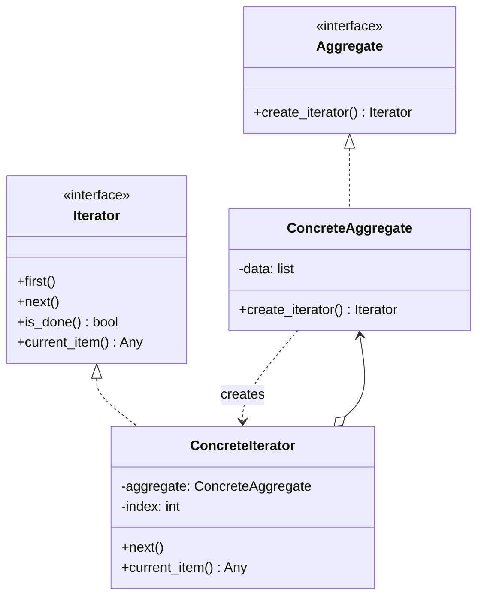

### 4.6 Python Implementation — The Iterator Protocol

Python's iterator protocol: an **iterable** implements `__iter__` returning an **iterator**; an iterator implements `__next__` returning the next item or raising `StopIteration`.

```python
class BinaryTree:
    def __init__(self, value, left=None, right=None):
        self.value = value
        self.left = left
        self.right = right


class InOrderIterator:
    """Iterates a binary tree in-order (left, root, right)."""
    def __init__(self, root: BinaryTree | None):
        self._stack: list[BinaryTree] = []
        self._push_left(root)

    def _push_left(self, node):
        while node is not None:
            self._stack.append(node)
            node = node.left

    def __iter__(self):
        return self

    def __next__(self):
        if not self._stack:
            raise StopIteration
        node = self._stack.pop()
        self._push_left(node.right)
        return node.value


# Build:
#       4
#      / \
#     2   6
#    / \ / \
#   1  3 5  7
tree = BinaryTree(4,
    BinaryTree(2, BinaryTree(1), BinaryTree(3)),
    BinaryTree(6, BinaryTree(5), BinaryTree(7)),
)

print(list(InOrderIterator(tree)))   # [1, 2, 3, 4, 5, 6, 7]
```

### 4.7 Generators Replace Iterator Classes

Python's `yield` makes most iterators trivial:

```python
def in_order(node: BinaryTree | None):
    if node is None:
        return
    yield from in_order(node.left)
    yield node.value
    yield from in_order(node.right)


print(list(in_order(tree)))   # [1, 2, 3, 4, 5, 6, 7]
```

> [!tip] Idiomatic Python
> Prefer generators over hand-written `__next__` classes. Reserve the class form for iterators that need extra methods (e.g., `is_done()`, `reset()`).

### 4.8 Multiple Traversals of the Same Structure

```python
class TreeIterable:
    def __init__(self, root: BinaryTree):
        self.root = root

    def __iter__(self):
        # Each call returns a fresh iterator — safe for parallel loops.
        return in_order(self.root)

    def pre_order(self):
        def gen(node):
            if node is None: return
            yield node.value
            yield from gen(node.left)
            yield from gen(node.right)
        return gen(self.root)

    def post_order(self):
        def gen(node):
            if node is None: return
            yield from gen(node.left)
            yield from gen(node.right)
            yield node.value
        return gen(self.root)


t = TreeIterable(tree)
print("in:  ", list(t))
print("pre: ", list(t.pre_order()))
print("post:", list(t.post_order()))
# in:   [1, 2, 3, 4, 5, 6, 7]
# pre:  [4, 2, 1, 3, 6, 5, 7]
# post: [1, 3, 2, 5, 7, 6, 4]
```

### 4.9 Common Mistakes

1. **Returning `self` from `__iter__` for a non-iterator iterable**. An iterable's `__iter__` should return a *fresh* iterator each call. Returning `self` means you can only iterate once.
2. **Forgetting `StopIteration`**. An infinite generator is fine if intentional; an iterator that never raises `StopIteration` in a `for` loop is a bug.
3. **Mutating the structure during iteration**. Most iterators don't handle structural changes well. Either copy or fail loudly.

### 4.10 Related Patterns

- **Composite** — Composites are typically iterable.
- **Visitor** — alternative way to walk a structure, supporting different operations.
- **Generator** (Python-specific) — the most common form of Iterator.

---

## 5. Mediator

### 5.1 Intent

Define an object that encapsulates how a set of objects interact. Mediator promotes loose coupling by keeping objects from referring to each other explicitly, and it lets you vary their interaction independently.

### 5.2 When to Use

- A set of objects communicate in well-defined but complex ways.
- Reusing an object is difficult because it refers to and uses many other objects.
- Behavior distributed between several classes should be customizable without subclassing.

### 5.3 When NOT to Use

- When there are only two collaborators — direct communication is simpler.
- When the mediator itself becomes a God Object (a common failure mode).
- When the same effect can be achieved with the Observer pattern and an event bus.

### 5.4 Real-World Examples

- Air traffic control: planes don't talk to each other; they talk to the tower.
- Chat room: users post messages to the room, which dispatches to all participants.
- GUI dialog: widgets (textbox, button, list) coordinate via a Form mediator.
- Message brokers (RabbitMQ, Kafka) — distributed mediators.

### 5.5 Structure

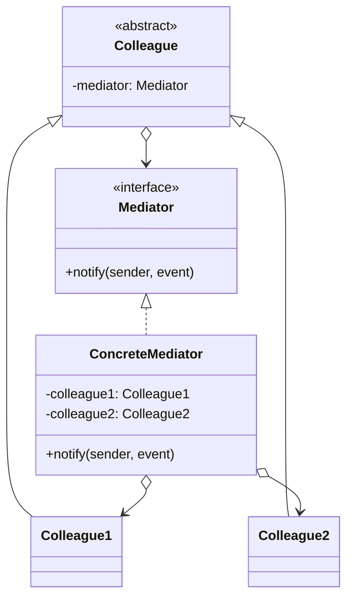

### 5.6 Python Implementation — Chat Room

```python
from abc import ABC, abstractmethod
from datetime import datetime


class ChatRoom:
    """Mediator."""
    def __init__(self):
        self._participants: list["User"] = []

    def register(self, user: "User") -> None:
        self._participants.append(user)
        user.mediator = self

    def send(self, message: str, sender: "User") -> None:
        timestamp = datetime.now().strftime("%H:%M")
        for p in self._participants:
            if p is not sender:
                p.receive(f"[{timestamp}] {sender.name}: {message}")


class Participant(ABC):
    def __init__(self, name: str):
        self.name = name
        self.mediator: ChatRoom | None = None

    @abstractmethod
    def receive(self, message: str) -> None: ...


class User(Participant):
    def __init__(self, name: str):
        super().__init__(name)
        self.inbox: list[str] = []

    def send(self, message: str) -> None:
        if self.mediator is None:
            raise RuntimeError("Not registered in a chat room")
        print(f"{self.name} sends: {message}")
        self.mediator.send(message, self)

    def receive(self, message: str) -> None:
        self.inbox.append(message)


# Usage:
room = ChatRoom()
alice = User("Alice")
bob = User("Bob")
carol = User("Carol")
for u in (alice, bob, carol):
    room.register(u)

alice.send("Hi everyone!")
bob.send("Hey Alice")
print("Bob's inbox:", bob.inbox)
# Bob's inbox: ['[14:30] Alice: Hi everyone!']
```

Without the mediator, each `User` would need a reference to every other `User` and would `for u in self.others: u.receive(...)` directly. Coupling.

### 5.7 Common Mistakes

1. **God Mediator**. If your Mediator knows about every colleague's internal state, you've just moved the God Object. Keep the mediator focused on *coordination*, not *business logic*.
2. **Colleagues calling each other directly**. Once a colleague calls `other_colleague.method()`, the mediator has been bypassed.
3. **No interface on the Mediator**. If only one Mediator implementation exists, the abstraction is unnecessary.

### 5.8 Related Patterns

- **Observer** — Mediator often uses Observer internally: colleagues subscribe to mediator events.
- **Facade** — Facade abstracts a subsystem *from outside*; Mediator abstracts communication *between* colleagues.
- **Command** — Mediators often dispatch Commands to colleagues.

---

## 6. Memento

### 6.1 Intent

Without violating encapsulation, capture and restore an object's internal state so the object can be restored to this state later.

### 6.2 When to Use

- A snapshot of an object's state must be saved and later restored.
- Direct access to the object's fields would expose implementation details and break encapsulation.

### 6.3 When NOT to Use

- When state is tiny and public — just copy the fields.
- When state is huge — snapshotting is too expensive; consider Command (inverse operations) instead.
- When the object has non-copyable resources (sockets, file handles) — snapshots don't make sense.

### 6.4 Real-World Examples

- Undo systems (text editors, image editors).
- Game save files.
- Database transaction savepoints.
- `git stash` — a memento of your working tree.

### 6.5 Structure

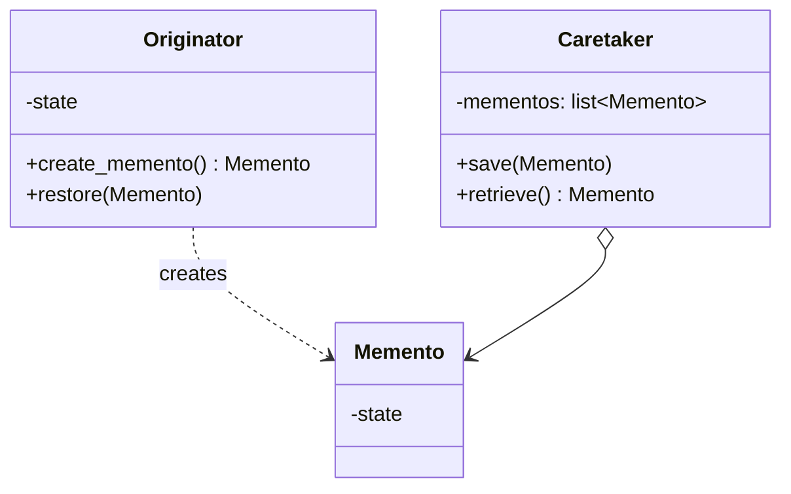

### 6.6 Python Implementation — Document with Undo

```python
from dataclasses import dataclass
from typing import Any


@dataclass(frozen=True)
class DocumentMemento:
    """Immutable snapshot of a document's state."""
    text: str
    cursor: int
    metadata: dict[str, Any]


class Document:
    """Originator."""
    def __init__(self, text: str = "", cursor: int = 0):
        self._text = text
        self._cursor = cursor
        self._metadata: dict[str, Any] = {}

    @property
    def text(self) -> str:
        return self._text

    @property
    def cursor(self) -> int:
        return self._cursor

    def type_text(self, text: str) -> None:
        self._text = self._text[:self._cursor] + text + self._text[self._cursor:]
        self._cursor += len(text)

    def move_cursor(self, position: int) -> None:
        self._cursor = max(0, min(position, len(self._text)))

    def set_metadata(self, key: str, value: Any) -> None:
        self._metadata[key] = value

    def create_memento(self) -> DocumentMemento:
        # Snapshot includes a *copy* of the mutable metadata dict.
        return DocumentMemento(self._text, self._cursor, dict(self._metadata))

    def restore(self, memento: DocumentMemento) -> None:
        self._text = memento.text
        self._cursor = memento.cursor
        self._metadata = dict(memento.metadata)


class History:
    """Caretaker — knows nothing about Document's internals."""
    def __init__(self):
        self._stack: list[DocumentMemento] = []

    def push(self, memento: DocumentMemento) -> None:
        self._stack.append(memento)

    def pop(self) -> DocumentMemento | None:
        if not self._stack:
            return None
        return self._stack.pop()


# Usage:
doc = Document()
history = History()

history.push(doc.create_memento())
doc.type_text("Hello")
doc.set_metadata("author", "Alice")

history.push(doc.create_memento())
doc.type_text(" world")

print(doc.text)        # Hello world
print(doc.cursor)      # 11

doc.restore(history.pop())
print(doc.text)        # Hello
print(doc.cursor)      # 5
```

The `History` class only sees opaque `DocumentMemento` objects — it cannot peek into or modify the document's state directly. Encapsulation is preserved.

### 6.7 Memento vs Command for Undo

| Aspect | Memento | Command |
|--------|---------|---------|
| Memory | High (full state per undo) | Low (just inverse operation) |
| Implementation effort | Low (just snapshot) | High (every command must support `undo()`) |
| Works for any operation? | Yes | Only for invertible ones |
| Works for non-invertible ops (e.g., send email)? | Yes (snapshot pre-state) | No |

Choose **Memento** when state is small or when operations are non-invertible. Choose **Command** when state is large and operations are cleanly invertible.

### 6.8 Common Mistakes

1. **Mutable mementos**. If the memento holds a reference to a mutable sub-object, modifying the originator also modifies the memento. Always copy mutable structures on snapshot.
2. **Letting the Caretaker inspect the memento**. The whole point is that the Caretaker cannot. Use opaque types.
3. **Snapshotting huge objects**. Memory grows linearly with stack depth. Consider compressing or summarizing older snapshots.

### 6.9 Related Patterns

- **Command** — alternative undo strategy.
- **Iterator** — history is often iterable.
- **State** — State objects can be saved as mementos.

---

## 7. Observer

### 7.1 Intent

Define a one-to-many dependency between objects so that when one object changes state, all its dependents are notified and updated automatically.

### 7.2 When to Use

- When a change to one object requires changing others, and you don't know how many others need to change.
- When an object should be able to notify others without knowing who they are.
- Event-driven systems, MVC models, reactive programming.

### 7.3 When NOT to Use

- When there's only one observer — direct calls are simpler.
- When the cascade of notifications creates infinite loops (A notifies B notifies A...).
- When ordering of notifications matters and Observer order is undefined.

### 7.4 Real-World Examples

- DOM events (`addEventListener`, `dispatchEvent`).
- `django.signals`, `blinker` — Python pub/sub.
- Excel recalculation — changing a cell notifies dependent cells.
- `asyncio` futures and tasks.
- React's component re-rendering.
- Stock market price tickers.

### 7.5 Structure

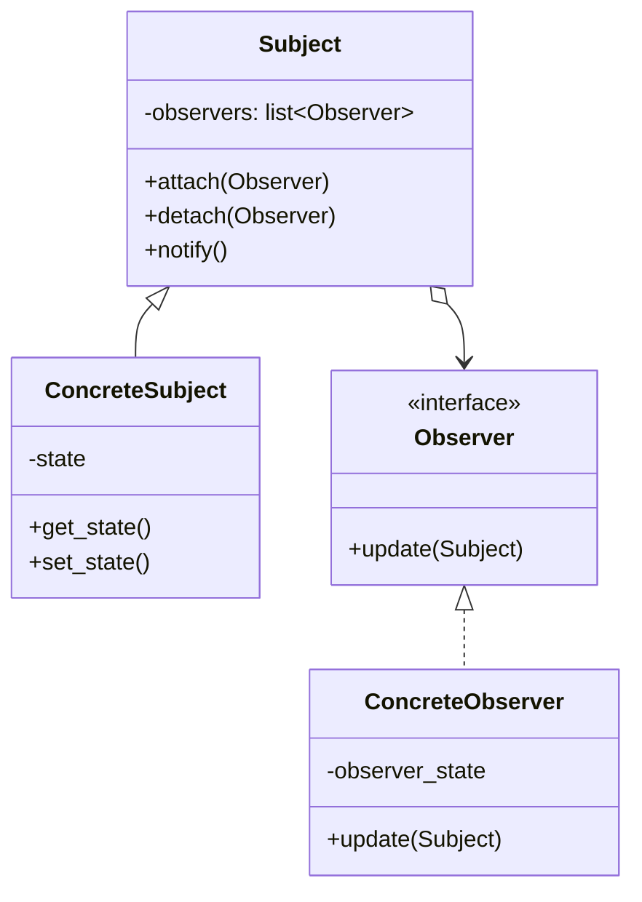

### 7.6 Python Implementation — Stock Price Ticker

```python
from abc import ABC, abstractmethod
from dataclasses import dataclass


@dataclass(frozen=True)
class PriceUpdate:
    symbol: str
    price: float


class Subject(ABC):
    def __init__(self):
        self._observers: list["Observer"] = []

    def attach(self, observer: "Observer") -> None:
        self._observers.append(observer)

    def detach(self, observer: "Observer") -> None:
        self._observers.remove(observer)

    def notify(self, payload) -> None:
        for obs in list(self._observers):  # copy: observers may detach during notify
            obs.update(self, payload)


class Observer(ABC):
    @abstractmethod
    def update(self, subject: Subject, payload) -> None: ...


class StockExchange(Subject):
    def __init__(self):
        super().__init__()
        self._prices: dict[str, float] = {}

    def set_price(self, symbol: str, price: float) -> None:
        self._prices[symbol] = price
        self.notify(PriceUpdate(symbol, price))


class PriceDisplay(Observer):
    def __init__(self, name: str):
        self.name = name

    def update(self, subject, payload: PriceUpdate) -> None:
        print(f"[{self.name}] {payload.symbol}: ${payload.price:.2f}")


class AlertThreshold(Observer):
    def __init__(self, symbol: str, threshold: float):
        self.symbol = symbol
        self.threshold = threshold

    def update(self, subject, payload: PriceUpdate) -> None:
        if payload.symbol == self.symbol and payload.price > self.threshold:
            print(f"🚨 ALERT: {self.symbol} crossed {self.threshold}! Now ${payload.price:.2f}")


# Usage:
exchange = StockExchange()
exchange.attach(PriceDisplay("Wall screen"))
exchange.attach(AlertThreshold("AAPL", 200.0))

exchange.set_price("AAPL", 195.0)
# [Wall screen] AAPL: $195.00

exchange.set_price("AAPL", 205.0)
# [Wall screen] AAPL: $205.00
# 🚨 ALERT: AAPL crossed 200.0! Now $205.00
```

### 7.7 Push vs Pull

- **Push**: Subject sends payload data to observers (as above). Simple, but tightly coupled to the data observers need.
- **Pull**: Subject just says "I changed"; observers query the subject for details. Looser coupling, but observers must know how to query.

```python
# Pull style
class StockExchangePull(Subject):
    def set_price(self, symbol: str, price: float) -> None:
        self._prices[symbol] = price
        self._last_changed = symbol
        self.notify(None)   # just "I changed"

# Observer:
def update(self, subject, _payload):
    symbol = subject.last_changed
    price = subject.get_price(symbol)
    # ...
```

### 7.8 Pythonic: `weakref` to Avoid Leaks

If a Subject holds a strong reference to Observers, dead Observers are never garbage-collected. Use `WeakSet`:

```python
import weakref


class WeakSubject:
    def __init__(self):
        self._observers: weakref.WeakSet = weakref.WeakSet()

    def attach(self, obs): self._observers.add(obs)
    def detach(self, obs): self._observers.discard(obs)
    def notify(self, payload):
        for obs in self._observers:  # dead observers are auto-removed
            obs.update(self, payload)
```

### 7.9 Common Mistakes

1. **Modifying the observer list during iteration**. Detaching inside `update()` can skip observers. Iterate a copy.
2. **Notification cascades**. A→B→A→B... infinite loop. Use a "currently notifying" guard.
3. **Forgetting to detach**. Memory leaks. Use `weakref` or `try/finally` to clean up.

### 7.10 Related Patterns

- **Mediator** — Observer is often the mechanism a Mediator uses to coordinate colleagues.
- **Publish-Subscribe** — distributed variant of Observer.
- **Memento** — sometimes used with Observer to snapshot before notifying.

---

## 8. State

### 8.1 Intent

Allow an object to alter its behavior when its internal state changes. The object will appear to change its class.

### 8.2 When to Use

- An object's behavior depends on its state, and it must change its behavior at runtime depending on that state.
- Operations have large, multipart conditional statements that depend on the object's state.

### 8.3 When NOT to Use

- When state is trivial (1-2 branches) — `if` is fine.
- When states rarely change — the abstraction costs more than it saves.
- When you really just want to swap an algorithm — use Strategy.

### 8.4 Real-World Examples

- Vending machine: states = Idle, HasCoin, Dispensing, OutOfStock.
- TCP connection: Closed, Listening, Established, CloseWait.
- Media player: Stopped, Playing, Paused.
- Document workflow: Draft, InReview, Published, Archived.

### 8.5 Structure

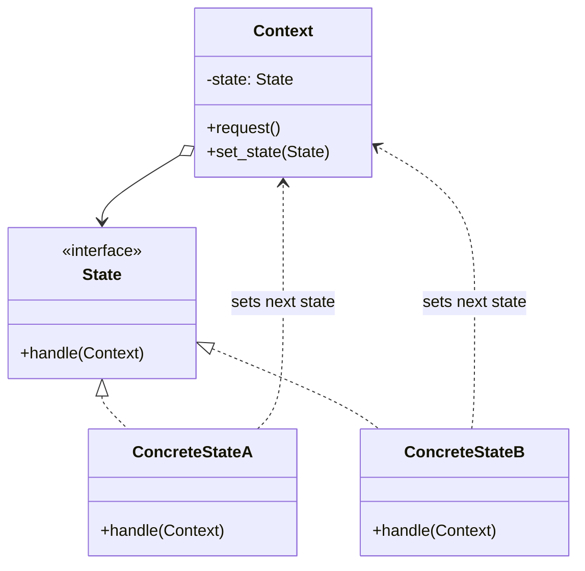

### 8.6 Python Implementation — Vending Machine

```python
from abc import ABC, abstractmethod


class VendingMachine:
    def __init__(self):
        self._state: "State" = IdleState()
        self._state.machine = self
        self._balance = 0
        self._stock = {"soda": 3, "chips": 2}

    @property
    def state(self): return self._state

    @state.setter
    def state(self, new_state: "State") -> None:
        self._state = new_state
        self._state.machine = self

    @property
    def balance(self): return self._balance
    @balance.setter
    def balance(self, v): self._balance = v

    @property
    def stock(self): return self._stock

    def insert_coin(self, amount: int) -> str:
        return self._state.insert_coin(amount)

    def select(self, product: str) -> str:
        return self._state.select(product)


class State(ABC):
    machine: VendingMachine

    @abstractmethod
    def insert_coin(self, amount: int) -> str: ...

    @abstractmethod
    def select(self, product: str) -> str: ...


class IdleState(State):
    def insert_coin(self, amount: int) -> str:
        self.machine.balance += amount
        self.machine.state = HasCoinState()
        return f"Inserted {amount}. Balance: {self.machine.balance}"

    def select(self, product: str) -> str:
        return "Insert a coin first."


class HasCoinState(State):
    def insert_coin(self, amount: int) -> str:
        self.machine.balance += amount
        return f"Added {amount}. Balance: {self.machine.balance}"

    def select(self, product: str) -> str:
        stock = self.machine.stock
        if stock.get(product, 0) == 0:
            return f"{product} is out of stock."
        price = 50
        if self.machine.balance < price:
            return f"Need {price - self.machine.balance} more for {product}."
        stock[product] -= 1
        self.machine.balance -= price
        result = f"Dispensing {product}. Change: {self.machine.balance}"
        self.machine.state = DispensingState()
        return result


class DispensingState(State):
    def insert_coin(self, amount: int) -> str:
        return "Please wait, dispensing..."

    def select(self, product: str) -> str:
        return "Already dispensing; please wait."

    # In a real impl, an event would return to IdleState here.


# Usage:
vm = VendingMachine()
print(vm.select("soda"))   # Insert a coin first.
print(vm.insert_coin(50))  # Inserted 50. Balance: 50
print(vm.select("soda"))   # Dispensing soda. Change: 0
print(vm.insert_coin(100)) # Please wait, dispensing...
```

### 8.7 Strategy vs State

| Aspect | Strategy | State |
|--------|----------|-------|
| Client controls? | Yes (sets strategy) | No (state transitions internally) |
| Number of states/strategies | Usually small, explicit | Often many, dynamic |
| Lifecycle | Often per-call | Persistent across calls |
| Same structure? | Yes | Yes |

If the "strategy" is changed by the object itself based on its history, it's a State pattern. If the client picks the algorithm, it's a Strategy.

### 8.8 Common Mistakes

1. **States holding mutable data**. State objects should be stateless (or have only immutable state); per-instance data lives in the Context.
2. **Context leaking**. If a State class reaches into the Context's private attributes, encapsulation is broken. Expose only what states need.
3. **Forgetting transitions**. A state with no outgoing transitions is a dead-end. Verify your state graph is connected.

### 8.9 Related Patterns

- **Strategy** — same structure, different intent.
- **Flyweight** — State objects are often shared Flyweights.
- **Singleton** — State classes are often Singletons.

---

## 9. Strategy

### 9.1 Intent

Define a family of algorithms, encapsulate each one, and make them interchangeable. Strategy lets the algorithm vary independently from clients that use it.

### 9.2 When to Use

- Many related classes differ only in their behavior.
- You need different variants of an algorithm.
- An algorithm uses data that clients shouldn't know about.
- A class defines many behaviors via multiple conditionals.

### 9.3 When NOT to Use

- When there are only a handful of variants and they never change.
- When the "strategy" is just a single function — pass the function directly.
- When strategies have wildly different signatures — they need a common interface.

### 9.4 Real-World Examples

- `sorted(iterable, key=...)` — `key` is a strategy.
- `json.dumps(obj, indent=...)` — formatting strategy.
- Payment processors: `StripeStrategy`, `PayPalStrategy`, `CryptoStrategy`.
- Compression: `GzipStrategy`, `Bzip2Strategy`, `Lz4Strategy`.
- Routing in web frameworks: choose a path-matching strategy.

### 9.5 Structure

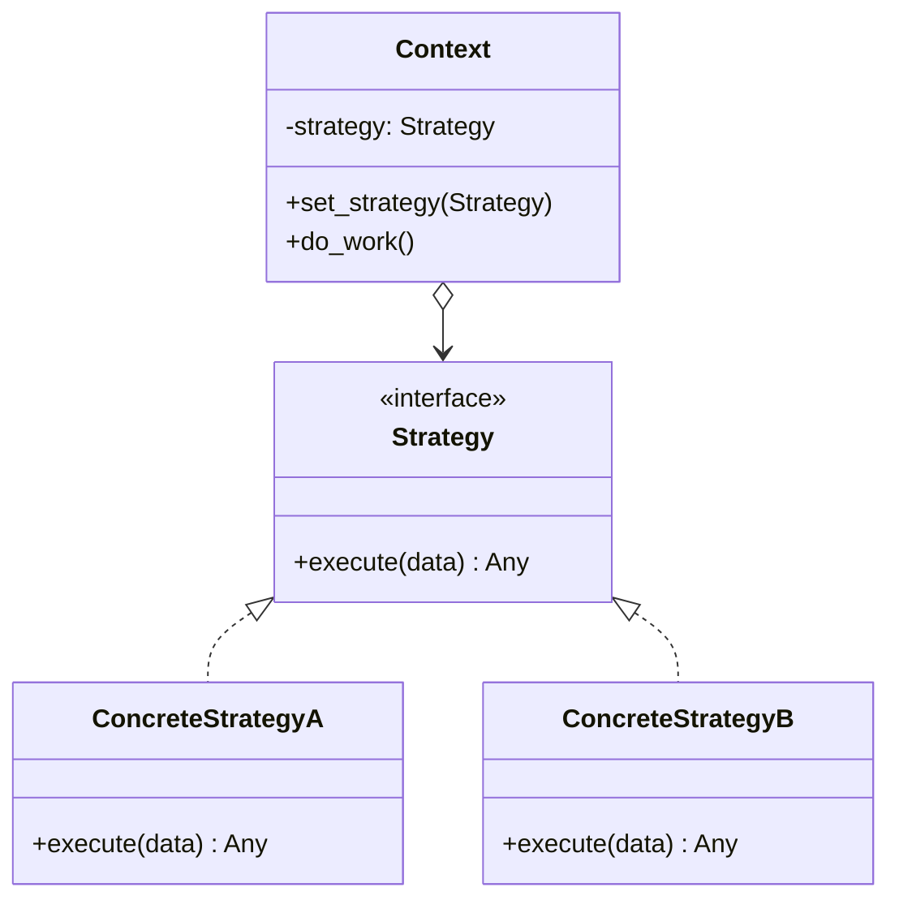

### 9.6 Python Implementation — Compression Strategy

```python
from abc import ABC, abstractmethod
import gzip
import bz2
import lzma
import zlib


class CompressionStrategy(ABC):
    @abstractmethod
    def compress(self, data: bytes) -> bytes: ...

    @abstractmethod
    def decompress(self, data: bytes) -> bytes: ...

    @property
    @abstractmethod
    def name(self) -> str: ...


class GzipStrategy(CompressionStrategy):
    def compress(self, data: bytes) -> bytes:
        return gzip.compress(data)
    def decompress(self, data: bytes) -> bytes:
        return gzip.decompress(data)
    @property
    def name(self): return "gzip"


class Bzip2Strategy(CompressionStrategy):
    def compress(self, data: bytes) -> bytes:
        return bz2.compress(data)
    def decompress(self, data: bytes) -> bytes:
        return bz2.decompress(data)
    @property
    def name(self): return "bzip2"


class LzmaStrategy(CompressionStrategy):
    def compress(self, data: bytes) -> bytes:
        return lzma.compress(data)
    def decompress(self, data: bytes) -> bytes:
        return lzma.decompress(data)
    @property
    def name(self): return "lzma"


class Compressor:
    def __init__(self, strategy: CompressionStrategy):
        self._strategy = strategy

    def set_strategy(self, strategy: CompressionStrategy) -> None:
        self._strategy = strategy

    def compress(self, data: bytes) -> bytes:
        compressed = self._strategy.compress(data)
        print(f"[{self._strategy.name}] {len(data)} -> {len(compressed)} bytes")
        return compressed

    def decompress(self, data: bytes) -> bytes:
        return self._strategy.decompress(data)


# Usage:
data = b"Hello, world! " * 1000
compressor = Compressor(GzipStrategy())
compressor.compress(data)
compressor.set_strategy(Bzip2Strategy())
compressor.compress(data)
compressor.set_strategy(LzmaStrategy())
compressed = compressor.compress(data)

# Decompress:
print(compressor.decompress(compressed) == data)   # True
```

### 9.7 Function-as-Strategy (Pythonic)

When the strategy has no state of its own, a plain callable is enough:

```python
import gzip
import bz2

def compress_with(strategy_name: str, data: bytes) -> bytes:
    strategies = {
        "gzip": gzip.compress,
        "bzip2": bz2.compress,
    }
    return strategies[strategy_name](data)


print(len(compress_with("gzip", b"hello" * 1000)))
```

This is shorter, faster, and more Pythonic when no shared interface is needed.

### 9.8 Strategy with Context Data

Sometimes strategies need context-specific configuration:

```python
from dataclasses import dataclass


@dataclass
class PaymentResult:
    success: bool
    transaction_id: str
    message: str


class PaymentStrategy(ABC):
    @abstractmethod
    def pay(self, amount: float) -> PaymentResult: ...


class StripeStrategy(PaymentStrategy):
    def __init__(self, api_key: str):
        self._api_key = api_key

    def pay(self, amount: float) -> PaymentResult:
        # Pretend to call Stripe API
        return PaymentResult(True, "stripe_xxx", f"Charged ${amount} via Stripe")


class PayPalStrategy(PaymentStrategy):
    def __init__(self, email: str):
        self._email = email

    def pay(self, amount: float) -> PaymentResult:
        return PaymentResult(True, "pp_yyy", f"Charged ${amount} via PayPal ({self._email})")


class CryptoStrategy(PaymentStrategy):
    def __init__(self, wallet_address: str):
        self._wallet = wallet_address

    def pay(self, amount: float) -> PaymentResult:
        return PaymentResult(True, "bc_zzz", f"Transferred ${amount} in crypto")


class Checkout:
    def __init__(self, strategy: PaymentStrategy):
        self._strategy = strategy

    def checkout(self, amount: float) -> None:
        result = self._strategy.pay(amount)
        print(result.message)


Checkout(StripeStrategy("sk_test_x")).checkout(99.99)
Checkout(PayPalStrategy("alice@example.com")).checkout(49.99)
```

### 9.9 Common Mistakes

1. **Strategies with hidden state**. If a strategy accumulates state between calls, it stops being interchangeable. Keep strategies stateless or reset them on swap.
2. **Huge strategy classes**. If your strategy has 20 methods, it's a subsystem — refactor or use Facade.
3. **Inconsistent interfaces**. Strategies must accept the same inputs and produce compatible outputs. Type hints help.

### 9.10 Related Patterns

- **State** — same structure, different intent.
- **Template Method** — Strategy uses composition; Template Method uses inheritance.
- **Bridge** — Bridge links two hierarchies; Strategy is one hierarchy swapped into a Context.

---

## 10. Template Method

### 10.1 Intent

Define the skeleton of an algorithm in an operation, deferring some steps to subclasses. Template Method lets subclasses redefine certain steps of an algorithm without changing the algorithm's structure.

### 10.2 When to Use

- To implement the invariant parts of an algorithm once and leave it up to subclasses to implement behavior that can vary.
- When common behavior among subclasses should be factored and localized in a common class.
- To control subclass extension (hooks).

### 10.3 When NOT to Use

- When the "algorithm" has only one step — Strategy is simpler.
- When subclasses shouldn't know about each other's implementation — Template Method couples them via the base class.
- When composition (Strategy) would be cleaner than inheritance.

### 10.4 Real-World Examples

- `unittest.TestCase`: `setUp()` → `runTest()` → `tearDown()` — a Template Method.
- `asyncio` event loop's `run_forever`, `run_until_complete`.
- Django's class-based views: `get`, `post`, `dispatch`.
- `http.server.BaseHTTPRequestHandler`: `do_GET`, `do_POST` overrides.

### 10.5 Structure

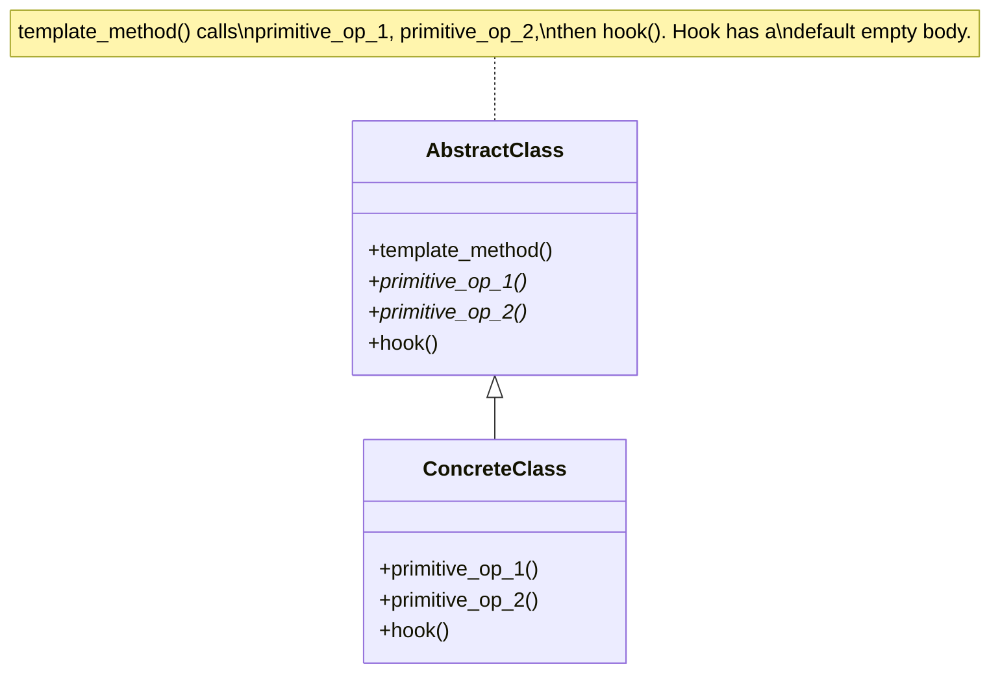

### 10.6 Python Implementation — Data Pipeline

```python
from abc import ABC, abstractmethod
from typing import Any, Iterable


class DataPipeline(ABC):
    """Skeleton: extract -> transform -> load. Subclasses override primitives."""

    def run(self, source: str) -> str:
        """Template method — final, not meant to be overridden."""
        raw = self.extract(source)
        cleaned = self.clean(raw)
        transformed = self.transform(cleaned)
        self.before_load(transformed)   # hook — default is no-op
        result = self.load(transformed)
        self.after_load(result)         # hook
        return result

    @abstractmethod
    def extract(self, source: str) -> Iterable[Any]: ...

    def clean(self, raw: Iterable[Any]) -> Iterable[Any]:
        """Default: filter out None values. Override to customize."""
        return [r for r in raw if r is not None]

    @abstractmethod
    def transform(self, cleaned: Iterable[Any]) -> Iterable[Any]: ...

    @abstractmethod
    def load(self, transformed: Iterable[Any]) -> str: ...

    # Hooks — empty default; subclasses may override.
    def before_load(self, data): pass
    def after_load(self, result): pass


class CSVToDatabasePipeline(DataPipeline):
    def extract(self, source: str):
        import csv
        with open(source) as f:
            return list(csv.DictReader(f))

    def transform(self, cleaned):
        return [{k.lower(): v for k, v in row.items()} for row in cleaned]

    def load(self, transformed):
        # Pretend to insert into DB
        for row in transformed:
            pass  # db.insert(row)
        return f"Loaded {len(transformed)} rows to DB"

    def after_load(self, result):
        print(f"  [Hook] post-load: {result}")


class APIToJSONPipeline(DataPipeline):
    def extract(self, source: str):
        # Pretend to fetch from an API
        return [{"id": 1, "name": "Alice"}, None, {"id": 2, "name": "Bob"}]

    def transform(self, cleaned):
        return [{"user_id": r["id"], "username": r["name"]} for r in cleaned]

    def load(self, transformed):
        import json
        return json.dumps(transformed)


# Usage:
pipeline = APIToJSONPipeline()
print(pipeline.run("https://api.example.com/users"))
# [{"user_id": 1, "username": "Alice"}, {"user_id": 2, "username": "Bob"}]
```

### 10.7 Hook Methods

Hooks are methods with empty (or default) bodies that subclasses may override. They differ from abstract primitive operations:

- **Primitive operation**: abstract — subclass *must* implement.
- **Hook**: concrete with default — subclass *may* override.

Hooks let subclasses customize *optional* parts of the algorithm without forcing every subclass to implement every detail.

### 10.8 Template Method vs Strategy

| Aspect | Template Method | Strategy |
|--------|-----------------|----------|
| Mechanism | Inheritance | Composition |
| Algorithm structure | Fixed by base class | Varies |
| Customization granularity | Multiple primitive ops | Whole algorithm |
| Runtime change | Hard (subclass fixed) | Easy (swap strategy) |
| Coupling | Tighter (inheritance) | Looser (composition) |

### 10.9 Common Mistakes

1. **Too many abstract methods**. If `run()` calls six primitives, all abstract, subclasses must implement all six — high cost. Provide defaults for the optional ones.
2. **Calling `super().template_method()`**. Template methods should be `final` (in spirit). In Python, you can't enforce this; document it.
3. **Mixing levels of abstraction**. The template method should call only primitive operations, not concrete utility methods of the base class.

### 10.10 Related Patterns

- **Strategy** — composition alternative to Template Method.
- **Factory Method** — often a step inside a Template Method.
- **Hook** — Python-specific idiom for overridable defaults.

---

## 11. Visitor

### 11.1 Intent

Represent an operation to be performed on the elements of an object structure. Visitor lets you define a new operation without changing the classes of the elements on which it operates.

### 11.2 When to Use

- An object structure contains many classes with differing interfaces, and you want to perform operations that depend on their concrete classes.
- Many distinct, unrelated operations need to be performed on objects in a structure, and you want to avoid "polluting" their classes with these operations.
- The classes defining the object structure rarely change, but you want to add new operations often.

### 11.3 When NOT to Use

- When the element classes change often — adding a new element type forces changes to every Visitor.
- When the structure is small — direct dispatch is simpler.
- In Python, when `isinstance` checks would be just as clear (rare, but possible for tiny hierarchies).

### 11.4 Real-World Examples

- AST walkers in compilers (`ast.NodeVisitor`).
- Filesystem traversals (visit files vs directories vs symlinks).
- Document exporters (HTML visitor, PDF visitor, Markdown visitor).
- `xml.etree.ElementTree` walkers.
- `unittest.mock` call recording.

### 11.5 Structure

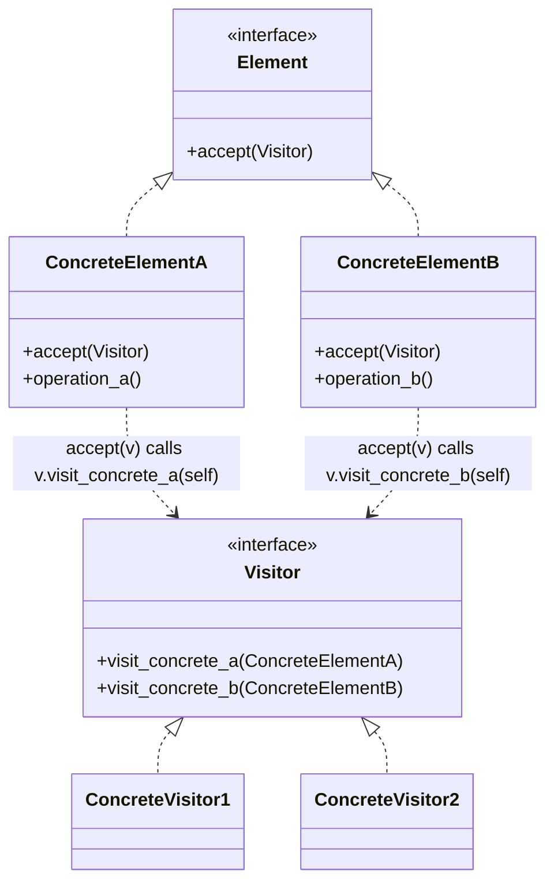

### 11.6 Python Implementation — AST Visitor

```python
from abc import ABC, abstractmethod


class Node(ABC):
    @abstractmethod
    def accept(self, visitor: "Visitor") -> Any: ...


class Number(Node):
    def __init__(self, value: float):
        self.value = value

    def accept(self, visitor):
        return visitor.visit_number(self)


class Add(Node):
    def __init__(self, left: Node, right: Node):
        self.left = left
        self.right = right

    def accept(self, visitor):
        return visitor.visit_add(self)


class Multiply(Node):
    def __init__(self, left: Node, right: Node):
        self.left = left
        self.right = right

    def accept(self, visitor):
        return visitor.visit_multiply(self)


from typing import Any


class Visitor(ABC):
    @abstractmethod
    def visit_number(self, n: Number) -> Any: ...

    @abstractmethod
    def visit_add(self, a: Add) -> Any: ...

    @abstractmethod
    def visit_multiply(self, m: Multiply) -> Any: ...


class Evaluator(Visitor):
    def visit_number(self, n: Number) -> float:
        return n.value

    def visit_add(self, a: Add) -> float:
        return a.left.accept(self) + a.right.accept(self)

    def visit_multiply(self, m: Multiply) -> float:
        return m.left.accept(self) * m.right.accept(self)


class Printer(Visitor):
    def visit_number(self, n: Number) -> str:
        return str(n.value)

    def visit_add(self, a: Add) -> str:
        return f"({a.left.accept(self)} + {a.right.accept(self)})"

    def visit_multiply(self, m: Multiply) -> str:
        return f"({m.left.accept(self)} * {m.right.accept(self)})"


# Build: (3 + 4) * (2 + 5)
expr = Multiply(Add(Number(3), Number(4)), Add(Number(2), Number(5)))

print(Evaluator().visit_multiply(expr))   # 49.0  -- but better to use accept:
print(expr.accept(Evaluator()))           # 49.0
print(expr.accept(Printer()))             # ((3 + 4) * (2 + 5))
```

The `accept` method does **double dispatch**: the visitor's `visit_*` method is chosen based on both (a) the visitor type and (b) the element type. Adding a new visitor (e.g., `TypeChecker`) requires no changes to the `Node` classes.

### 11.7 Python's `ast.NodeVisitor`

```python
import ast


class CountFunctions(ast.NodeVisitor):
    def __init__(self):
        self.count = 0

    def visit_FunctionDef(self, node):
        self.count += 1
        self.generic_visit(node)   # continue traversal into the function body

    def visit_AsyncFunctionDef(self, node):
        self.count += 1
        self.generic_visit(node)


code = """
def foo(): pass

def bar():
    def inner(): pass
    return inner

async def baz(): pass
"""

tree = ast.parse(code)
counter = CountFunctions()
counter.visit(tree)
print(counter.count)   # 3
```

Python's standard library uses the Visitor pattern for AST traversal.

### 11.8 Common Mistakes

1. **Forgetting `generic_visit`**. In `ast.NodeVisitor`, if you override `visit_X` and forget to call `generic_visit(node)`, children of `X` are not visited.
2. **Tight coupling to internals**. A Visitor that reaches into private attributes is fragile. Expose only what visitors need.
3. **Adding element types**. Each new `Node` subclass requires adding `visit_newtype` to every Visitor — annoying but explicit.

### 11.9 Related Patterns

- **Composite** — Visitors typically visit Composites.
- **Iterator** — Visitor walks the structure; Iterator provides the order.
- **Interpreter** — ASTs are often both visited (Visitor) and interpreted (Interpreter).

---

## 12. Comparison Matrix

| Pattern | What it solves | Pythonic alternative |
|---------|----------------|----------------------|
| Chain of Responsibility | Decouple sender from receiver | Function pipeline |
| Command | Encapsulate actions | Function + state |
| Interpreter | Small DSLs | `lark`, `ply`, plain functions |
| Iterator | Sequential access | Generators |
| Mediator | Decouple colleagues | Event bus, `blinker` |
| Memento | Snapshot state | `dataclass(frozen=True)` |
| Observer | Pub/sub | `weakref.WeakSet` callbacks |
| State | Behavior by state | State machine libraries |
| Strategy | Swap algorithms | Plain callables |
| Template Method | Skeleton + hooks | `unittest.TestCase` style |
| Visitor | External algorithms over a structure | `ast.NodeVisitor` |

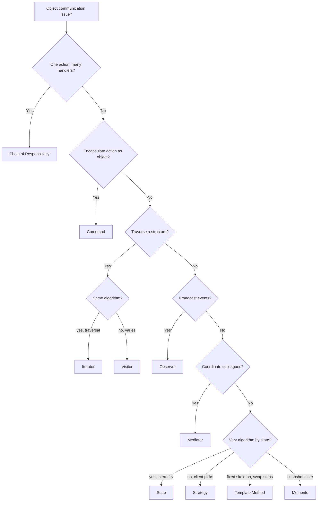

---

## 13. Cross-Pattern Relationships

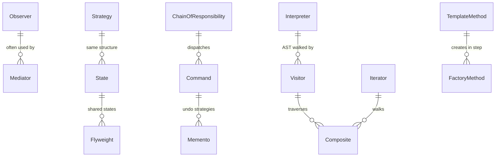

### 13.1 Common Combinations

- **Command + Memento**: full undo system — Command for inverse ops, Memento for snapshots.
- **Observer + Mediator**: Mediator notifies colleagues via Observer.
- **Visitor + Composite**: Visitor walks a Composite tree.
- **Strategy + Bridge**: Strategy picks algorithms; Bridge picks implementations.
- **State + Singleton**: State objects are often Singletons / Flyweights.

---

## 14. Python-Specific Notes

### 14.1 Generators Replace Iterator Classes

`yield` is the Pythonic way to build iterators. Use a class only when you need state across `next()` calls that doesn't fit a generator.

### 14.2 Functions Replace Many Strategy Implementations

When a strategy has no state, a function is sufficient:

```python
def sort_by_age(people):
    return sorted(people, key=lambda p: p.age)

# vs a class with the same logic — overkill
```

### 14.3 `functools.singledispatch` Replaces Some Visitor Use Cases

```python
from functools import singledispatch


@singledispatch
def to_html(node) -> str:
    raise NotImplementedError(f"Cannot render {type(node)}")


@to_html.register
def _(node: Number):
    return str(node.value)


@to_html.register
def _(node: Add):
    return f"({to_html(node.left)} + {to_html(node.right)})"


print(to_html(Add(Number(1), Number(2))))   # (1 + 2)
```

This achieves Visitor-like external dispatch without modifying element classes — perfect when you control neither.

### 14.4 `asyncio` Brings Observer-like Callbacks

Futures, tasks, and event loops use Observer-like notification. Master the patterns in this note and `asyncio` becomes much easier to reason about.

### 14.5 Dataclasses Make Memento Easy

```python
@dataclass(frozen=True)
class Snapshot:
    state: dict
```

A frozen dataclass with a copied dict is a one-line memento.

---

## 15. Refactoring to Behavioral Patterns

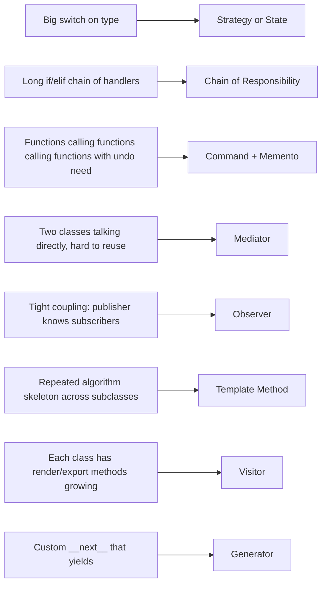

| Smell | Refactor to |
|-------|-------------|
| `if shape.type == "circle"` in 5 places | Visitor or `singledispatch` |
| Functions passed around with state for undo | Command |
| `for handler in handlers: if handler.can_handle(): handler.handle(); break` | Chain of Responsibility |
| A `switch(state)` with 10 branches | State pattern |
| Two classes mutate each other's state | Mediator |
| Identical extract-transform-load in 3 subclasses | Template Method |
| Snapshotting fields manually before mutating | Memento |

---

## 16. Teaching Path

1. **Strategy** first — simplest, clearest, and a great contrast with Template Method later.
2. **Observer** — students have seen event handlers; this formalizes the idea.
3. **Iterator** with generators — short, satisfying, and reinforces `__iter__`/`__next__`.
4. **Command** with undo — the "aha" pattern; shows objects-as-actions.
5. **State** — same shape as Strategy, different intent; great compare-and-contrast moment.
6. **Template Method** — show `unittest.TestCase` as the real-world anchor.
7. **Chain of Responsibility** with HTTP middleware — practical and immediate.
8. **Visitor** with an AST — challenging, but eye-opening about external algorithms.
9. **Mediator** with a chat room — fun, tangible example.
10. **Memento** with undo — pairs naturally with Command.
11. **Interpreter** last — rarest in Python, but ties together Composite, Visitor, and Iterator.

> [!success] Learning Check
> Given a problem statement, can students pick the right behavioral pattern *and explain why not the others*? Can they articulate the difference between Strategy and State? Between Command and Memento? Between Iterator and Visitor?

---

## 17. Summary

Behavioral patterns all do one thing: **shape the conversations between objects**. They differ in *what kind* of conversation:

- **Chain of Responsibility** — pass-the-baton.
- **Command** — "do this later / undo this".
- **Interpreter** — "speak this language".
- **Iterator** — "one at a time".
- **Mediator** — "talk through me".
- **Memento** — "remember this state".
- **Observer** — "tell me when it changes".
- **State** — "I act differently now".
- **Strategy** — "swap the algorithm".
- **Template Method** — "fill in the blanks".
- **Visitor** — "I'll come to you".

Most behavioral patterns have a Pythonic shortcut (functions, generators, `singledispatch`, dataclasses). Learn the pattern first so you know *what you're doing*; then learn the Python idiom so you do it concisely.

Continue with:
- [[Creational-Patterns]] — how objects are made.
- [[Structural-Patterns]] — how objects compose.
- [[Pattern-Selection-Guide]] — choosing the right pattern.
