# Creational Design Patterns — Object Construction in Python

#oop #design-patterns #creational #gof #singleton #factory #builder #prototype #teaching #deep-dive

> [!quote] Gang of Four (Gamma, Helm, Johnson, Vlissides)
> "Creational design patterns abstract the instantiation process. They help make a system independent of how its objects are created, composed, and represented."

Creational patterns deal with **object creation mechanisms**, trying to create objects in a manner suitable to the situation. Ordinary object creation (via `__init__` and direct class calls) can lead to design problems or added complexity. Creational patterns solve this problem by **decoupling the client code from the actual creation logic**.

This note covers all five GoF creational patterns in depth:

- [[#1. Singleton|Singleton]] — guarantee a single instance
- [[#2. Factory Method|Factory Method]] — subclass decides which class to instantiate
- [[#3. Abstract Factory|Abstract Factory]] — families of related objects
- [[#4. Builder|Builder]] — step-by-step construction of complex objects
- [[#5. Prototype|Prototype]] — clone an existing object

Prerequisite reading: [[Classes-And-Objects]], [[Constructors-And-Destructors]], [[Abstraction]], [[Polymorphism]].

---

## 0. Why Creational Patterns Exist

Imagine a codebase where every class directly calls `MyClass(...)` everywhere it needs an instance. Now imagine that `MyClass` changes its constructor signature, or that you need to swap it for `MyBetterClass`. You would have to find and modify every call site. **Creational patterns exist to centralize and encapsulate that knowledge**, so the *rest* of the system does not care *how* or *when* objects are made.

```
Client ──new()──▶ ??? ──▶ Concrete Object
                   ▲
        Creational pattern hides this
```

### 0.1 The Five Patterns at a Glance

| Pattern | Intent | Pythonic Equivalent / Hint |
|---------|--------|------------------------------|
| **Singleton** | One instance, global access | Modules, `@lru_cache`, Borg pattern |
| **Factory Method** | Subclass picks concrete class | `@classmethod` alternative constructors |
| **Abstract Factory** | Family of related products | Functions returning tuples of related objects |
| **Builder** | Step-by-step complex object | Fluent `dataclasses` + `kw_only=True` |
| **Prototype** | Clone existing object | `copy.deepcopy()`, `__copy__` / `__deepcopy__` |

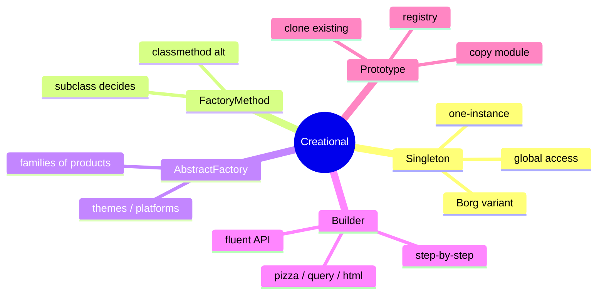

> [!tip] Teaching Tip
> When introducing creational patterns, ask students: *"Who should know how to make this object?"* The answer is rarely "everyone." Pattern choice is just deciding where to put that knowledge.

---

## 1. Singleton

### 1.1 Intent

Ensure a class has **only one instance** and provide a **global point of access** to it.

### 1.2 When to Use

- A single shared resource: configuration, logger, connection pool, cache.
- Hardware access wrappers (one printer, one serial port).
- Global state that *must* be coherent across modules.

### 1.3 When NOT to Use

- Anything that smells like a **global variable** — Singleton is often abused as a fancy global.
- When unit testing is hard (singletons are notoriously difficult to mock).
- When you need *N* instances in the future (e.g., one per tenant, one per request).
- When dependencies are unclear — Singleton hides coupling.

> [!warning] Singleton is the most overused (and most criticized) GoF pattern.
> Many Pythonistas argue you should **just use a module**. Modules are already singletons in Python — they are loaded once and shared globally.

### 1.4 Real-World Examples

- `logging.getLogger("name")` — Python's `logging` module returns the same logger object for the same name.
- Database connection pools (`psycopg2.pool`).
- `sys.modules` itself is a singleton dict tracking loaded modules.

### 1.5 Structure

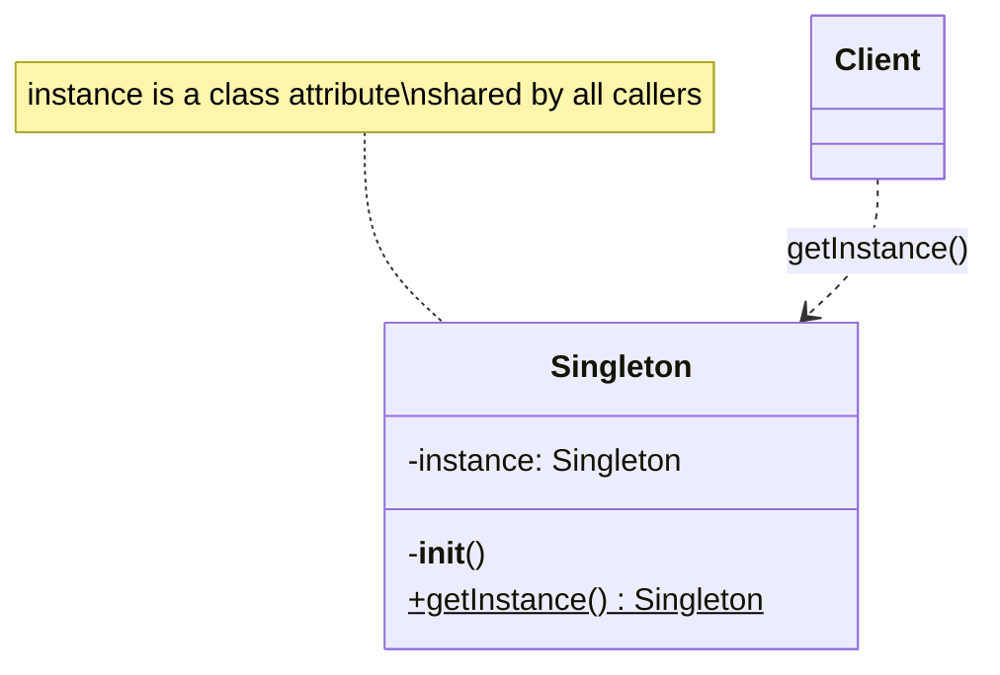

### 1.6 Python Implementations

#### 1.6.1 The `__new__` Approach

```python
class Singleton:
    _instance = None

    def __new__(cls, *args, **kwargs):
        if cls._instance is None:
            cls._instance = super().__new__(cls)
        return cls._instance

    def __init__(self, value=None):
        # WARNING: __init__ runs every time you call Singleton(...)!
        # Guard against re-initialization:
        if not hasattr(self, "_initialized"):
            self.value = value
            self._initialized = True


a = Singleton("first")
b = Singleton("second")
print(a is b)          # True
print(a.value)         # 'first'  (because of the guard)
```

> [!danger] Pitfall: `__init__` runs every call
> Because `__new__` returns the existing instance, Python still calls `__init__` on it. Use an `_initialized` flag (as above) or accept that calling `Singleton(x)` re-initializes.

#### 1.6.2 The Metaclass Approach (Cleanest)

```python
class SingletonMeta(type):
    _instances = {}

    def __call__(cls, *args, **kwargs):
        if cls not in cls._instances:
            cls._instances[cls] = super().__call__(*args, **kwargs)
        return cls._instances[cls]


class Database(metaclass=SingletonMeta):
    def __init__(self, dsn):
        self.dsn = dsn
        self.connection = self._connect()

    def _connect(self):
        print(f"Connecting to {self.dsn}...")
        return object()  # pretend


db1 = Database("postgres://prod")
db2 = Database("postgres://test")   # ignored — instance already exists
print(db1 is db2)                   # True
print(db1.dsn)                      # 'postgres://prod'
```

Metaclasses avoid the `__init__` double-call trap because `__call__` controls the *whole* construction.

#### 1.6.3 Module-Level Singleton (Most Pythonic)

```python
# config.py
class _Config:
    def __init__(self):
        self.settings = self._load()

    def _load(self):
        return {"debug": True, "timeout": 30}

# Single instance created at import time
config = _Config()
```

```python
# anywhere else
from config import config
print(config.settings["debug"])
```

Python modules are cached in `sys.modules`, so `config` is shared everywhere. No tricks needed.

#### 1.6.4 Borg / Monostate Pattern

Borg (named after the Star Trek Borg — "we share the same mind") lets you create **many instances that share state**. This is more flexible than Singleton: subclasses can have their own state-buckets.

```python
class Borg:
    _shared_state = {}

    def __init__(self):
        self.__dict__ = self._shared_state
        if not hasattr(self, "initialized"):
            self.state = "default"
            self.initialized = True


a = Borg()
b = Borg()
a.state = "modified"
print(b.state)        # 'modified'
print(a is b)         # False — different objects, shared state
```

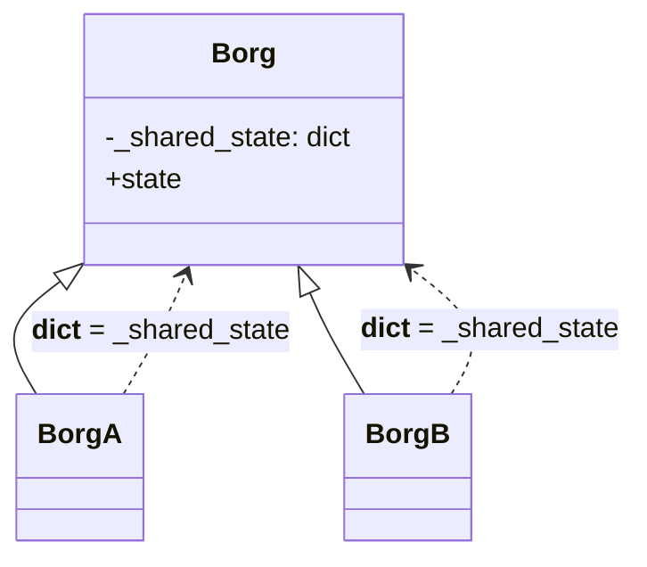

#### 1.6.5 Thread-Safe Singleton

```python
import threading

class ThreadSafeSingleton:
    _instance = None
    _lock = threading.Lock()

    def __new__(cls, *args, **kwargs):
        # First (unsynchronized) check — fast path
        if cls._instance is None:
            with cls._lock:
                # Double-checked locking
                if cls._instance is None:
                    cls._instance = super().__new__(cls)
        return cls._instance
```

Double-checked locking avoids taking the lock on the hot path while still preventing the race where two threads both see `None` and create two instances.

### 1.7 Common Mistakes

1. **Hiding the global state**. A Singleton is still global state, just dressed up. If you make `Database` a Singleton, every module that imports it has a hidden dependency that does not appear in the function signatures.
2. **Re-initializing in `__init__`**. As shown above, naive `__new__`-based Singletons run `__init__` on every call. Always guard with a flag, or use a metaclass.
3. **Forgetting thread safety**. The simple `__new__` Singleton has a TOCTOU race: two threads can both see `_instance is None` and create two instances. Use double-checked locking or just construct at import time (module-level).
4. **Using Singleton for test fixtures**. If your tests rely on global Singleton state, they cannot run in parallel, and one test's mutations leak into the next. Prefer dependency injection: pass the database in via constructor.

### 1.8 Testing Singleton Code

```python
import unittest

class TestWithFreshSingleton(unittest.TestCase):
    def setUp(self):
        # Reset the singleton before each test
        Database._instances.pop(Database, None)

    def test_first(self):
        db = Database("postgres://t1")
        self.assertEqual(db.dsn, "postgres://t1")

    def test_second(self):
        db = Database("postgres://t2")
        self.assertEqual(db.dsn, "postgres://t2")
```

The need to manually clear `_instances` is itself a smell. If you find yourself doing this a lot, refactor away from Singleton.

### 1.9 Related Patterns

- **Abstract Factory** — often implemented as a Singleton.
- **Prototype** — sometimes used to "reset" a Singleton to a known state.
- **Facade** — Facades are frequently Singletons (one application-wide facade).

### 1.10 Teaching Tip

Show students what breaks when they make a Singleton: write two unit tests that both create the Singleton, run them in the same process, and watch the second fail mysteriously. Then refactor to dependency injection.

---

## 2. Factory Method

### 2.1 Intent

Define an interface for creating an object, but **let subclasses decide which class to instantiate**. Factory Method defers instantiation to subclasses.

### 2.2 When to Use

- A class cannot anticipate the class of objects it must create.
- A class wants its subclasses to specify the objects it creates.
- You want to localize object-creation knowledge in one place.

### 2.3 When NOT to Use

- When there is only one product type — a plain constructor is fine.
- When you can replace the pattern with a Python **`@classmethod`** alternative constructor (`from_*`).
- When the factory grows into a switch-statement that changes constantly.

### 2.4 Real-World Examples

- `dict.fromkeys(seq)` — a classmethod alternative constructor.
- `datetime.datetime.fromisoformat()`, `datetime.fromtimestamp()` — Factory Method in Python's stdlib.
- `json.JSONDecoder` subclasses overriding `object_hook` to build custom objects.

### 2.5 Structure

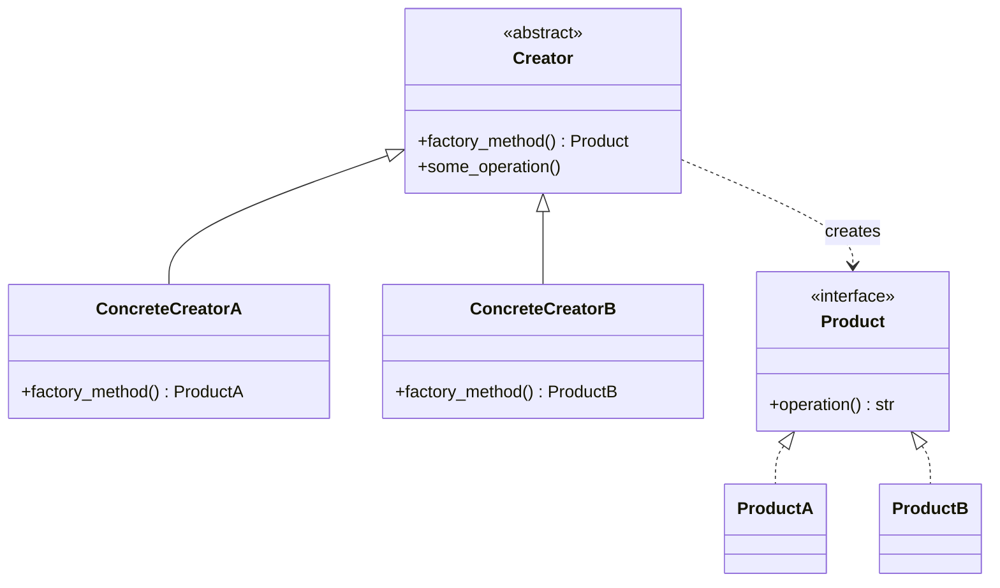

### 2.6 Python Implementation — Logistics Example

```python
from abc import ABC, abstractmethod


class Transport(ABC):
    @abstractmethod
    def deliver(self) -> str:
        ...


class Truck(Transport):
    def deliver(self) -> str:
        return "Delivering cargo by land in a box."


class Ship(Transport):
    def deliver(self) -> str:
        return "Delivering cargo by sea in a container."


class Logistics(ABC):
    @abstractmethod
    def create_transport(self) -> Transport:
        ...

    def plan_delivery(self) -> str:
        transport = self.create_transport()
        return f"Logistics plan: {transport.deliver()}"


class RoadLogistics(Logistics):
    def create_transport(self) -> Transport:
        return Truck()


class SeaLogistics(Logistics):
    def create_transport(self) -> Transport:
        return Ship()


# Client code
def client(logistics: Logistics) -> None:
    print(logistics.plan_delivery())


client(RoadLogistics())  # Logistics plan: Delivering cargo by land...
client(SeaLogistics())   # Logistics plan: Delivering cargo by sea...
```

### 2.7 Pythonic Alternative: `@classmethod` Constructor

When the polymorphism is on the *input format*, not on a subclass, a classmethod is often enough:

```python
import json


class Point:
    def __init__(self, x: float, y: float):
        self.x = x
        self.y = y

    @classmethod
    def from_tuple(cls, t: tuple[float, float]) -> "Point":
        return cls(*t)

    @classmethod
    def from_dict(cls, d: dict) -> "Point":
        return cls(d["x"], d["y"])

    @classmethod
    def from_json(cls, s: str) -> "Point":
        return cls(**json.loads(s))


p1 = Point.from_tuple((3, 4))
p2 = Point.from_dict({"x": 1, "y": 2})
p3 = Point.from_json('{"x": 5, "y": 6}')
```

> [!tip] Idiomatic Python
> If your factory method is just "choose constructor based on input," prefer `@classmethod`. Reserve the full GoF Factory Method for cases where the **subclass itself** holds the decision.

### 2.8 Parameterized Factory

A common simplification: one Creator with a parameter:

```python
class NotificationFactory:
    @staticmethod
    def create(channel: str) -> "Notifier":
        match channel:
            case "email": return EmailNotifier()
            case "sms":   return SMSNotifier()
            case "push":  return PushNotifier()
            case _:       raise ValueError(f"Unknown channel: {channel}")
```

This is *not* the strict GoF Factory Method (no subclass dispatch), but it is the version you will see most in Python code. The strict version shines when adding a new product means *also* adding a new Creator subclass — both follow [[Open-Closed]].

### 2.9 Common Mistakes

1. **Factory factory factories**. Developers new to patterns sometimes nest three layers of factories "just in case." A Factory Method is only justified when there is genuine polymorphism on the Creator side. If you only ever have one Creator, a plain function is enough.
2. **Switch-statement factories that change constantly**. If your `create()` method is a giant `match`/`if-elif` chain that gets edited every time a new product appears, you have not actually achieved Open/Closed. Consider a **registry** instead:

```python
class NotifierRegistry:
    _registry: dict[str, type] = {}

    @classmethod
    def register(cls, name: str, klass: type) -> None:
        cls._registry[name] = klass

    @classmethod
    def create(cls, name: str, **kwargs) -> "Notifier":
        if name not in cls._registry:
            raise ValueError(f"Unknown notifier: {name}")
        return cls._registry[name](**kwargs)


class EmailNotifier:
    def __init__(self, smtp_host: str): ...

NotifierRegistry.register("email", EmailNotifier)
```

3. **Returning `Any` type**. Factory methods should be typed to return the abstract `Product` interface, not the concrete class — otherwise clients are coupled to concretions again.
4. **Hiding side effects in factories**. A factory method called `create_user()` that also sends a welcome email is a Factory Method lying about its job. Keep construction pure; do work elsewhere.

### 2.10 Related Patterns

- **Abstract Factory** — uses Factory Methods internally to build each product.
- **Prototype** — an alternative to Factory Method: clone instead of construct.
- **Template Method** — Factory Method is often a single step inside a larger Template Method.

---

## 3. Abstract Factory

### 3.1 Intent

Provide an interface for creating **families of related or dependent objects** without specifying their concrete classes.

### 3.2 When to Use

- A system must be independent of how its products are created.
- A system must be configured with one of **multiple families** of products (e.g., Light UI vs Dark UI, Windows vs macOS widgets).
- You want to enforce that products from the same family are used together.

### 3.3 When NOT to Use

- When you only have one product family — use Factory Method.
- When products are not actually related — pointless indirection.
- When the family set changes often (adding a new family = new factory class + N new product classes).

### 3.4 Real-World Examples

- Cross-platform GUI toolkits (Qt, Tkinter) — each platform provides a family of widgets.
- Database drivers: `psycopg2`, `mysql.connector`, `sqlite3` each produce connections, cursors, errors that play together.
- Game engines with "fantasy", "sci-fi", "post-apocalyptic" themes (Enemy + Weapon + Treasure per theme).

### 3.5 Structure

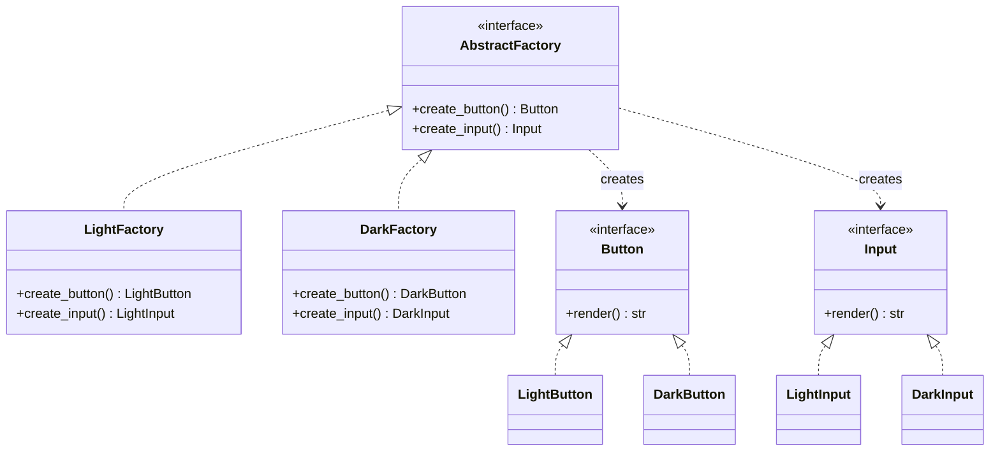

### 3.6 Python Implementation — UI Theme Factory

```python
from abc import ABC, abstractmethod


# ---- Abstract products ----
class Button(ABC):
    @abstractmethod
    def render(self) -> str: ...


class Input(ABC):
    @abstractmethod
    def render(self) -> str: ...


# ---- Light family ----
class LightButton(Button):
    def render(self) -> str:
        return "[ Light Button ] (white background)"


class LightInput(Input):
    def render(self) -> str:
        return "[ Light Input ] (white background)"


# ---- Dark family ----
class DarkButton(Button):
    def render(self) -> str:
        return "[ Dark Button ] (black background)"


class DarkInput(Input):
    def render(self) -> str:
        return "[ Dark Input ] (black background)"


# ---- Abstract factory ----
class UIFactory(ABC):
    @abstractmethod
    def create_button(self) -> Button: ...

    @abstractmethod
    def create_input(self) -> Input: ...


class LightUIFactory(UIFactory):
    def create_button(self) -> Button:
        return LightButton()

    def create_input(self) -> Input:
        return LightInput()


class DarkUIFactory(UIFactory):
    def create_button(self) -> Button:
        return DarkButton()

    def create_input(self) -> Input:
        return DarkInput()


# ---- Client ----
class Application:
    def __init__(self, factory: UIFactory):
        self.button = factory.create_button()
        self.input = factory.create_input()

    def paint(self) -> None:
        print(self.button.render())
        print(self.input.render())


# Toggle the entire UI by swapping one factory:
app = Application(LightUIFactory())
app.paint()
# [ Light Button ] (white background)
# [ Light Input ] (white background)

app = Application(DarkUIFactory())
app.paint()
# [ Dark Button ] (black background)
# [ Dark Input ] (black background)
```

### 3.7 Comparison: Factory Method vs Abstract Factory

| Aspect | Factory Method | Abstract Factory |
|--------|----------------|-------------------|
| Creates | **One** product | **A family** of related products |
| Decides via | Subclass override | Composition / swapping the factory object |
| Adding new product type | New method in abstract Creator (breaks OCP) | New method in AbstractFactory (breaks OCP) |
| Adding new family | New ConcreteCreator | New ConcreteFactory (OCP-friendly) |
| Typical size | Small | Larger |

> [!info] Both patterns break OCP for *different* axes
> Abstract Factory is OCP-friendly for adding families, but OCP-hostile for adding product types (every factory must implement the new method). Factory Method is the reverse. Pick the axis you expect to change.

### 3.8 Common Mistakes

1. **Forgetting that Abstract Factory is OCP-hostile to new product types**. Adding `create_slider()` to `UIFactory` requires modifying every concrete factory. If you add products often, prefer a Factory Method per product.
2. **Mixing families**. If `LightFactory.create_button()` returns `DarkButton` (a bug), the type system may not catch it if the abstract `create_button` returns the abstract `Button`. Use type narrowing or runtime assertions during development.
3. **Hardcoding the factory choice**. If the client code has `factory = LightUIFactory()` baked in, switching themes requires source edits. Inject the factory (e.g., from an environment variable or a config file).
4. **Overusing when one factory suffices**. If you only ship one family, you don't need an abstract factory — just use Factory Method.

### 3.9 Real-World Walkthrough — Database Driver Family

Python's DB-API 2.0 (PEP 249) is essentially an Abstract Factory specification. Each driver provides:

- `connect(...)` → `Connection`
- `Connection.cursor()` → `Cursor`
- `Cursor.execute(sql)`
- `Connection.commit()` / `rollback()`

`psycopg2`, `mysql.connector`, and `sqlite3` all expose this family. Application code talks only to the abstract `Connection`/`Cursor` interfaces and never knows which driver is in play.

```python
def get_connection_factory(driver: str):
    if driver == "sqlite":
        import sqlite3
        return sqlite3.connect
    elif driver == "postgres":
        import psycopg2
        return psycopg2.connect
    else:
        raise ValueError(driver)

# Application code is family-agnostic:
def list_users(connect_fn, db_url):
    conn = connect_fn(db_url)
    cur = conn.cursor()
    cur.execute("SELECT id, name FROM users")
    return cur.fetchall()
```

### 3.10 Related Patterns

- **Factory Method** — usually the implementation mechanism inside an Abstract Factory.
- **Singleton** — factories are often Singletons.
- **Prototype** — alternative when families are large and cloning is cheap.

---

## 4. Builder

### 4.1 Intent

Separate the construction of a complex object from its representation, so the same construction process can create different representations.

### 4.2 When to Use

- The algorithm for creating a complex object should be independent of its parts and how they are assembled.
- Construction has **many optional parameters** (telescoping constructor anti-pattern).
- The product has internal structure that must be built in steps (e.g., HTML, SQL queries, pizzas, documents).
- You want an **immutable product** built from mutable steps.

### 4.3 When NOT to Use

- When the product is simple (a few fields) — use a `dataclass` or keyword arguments.
- When construction is genuinely one-shot — use a constructor.
- When there are few permutations of optional parameters.

### 4.4 Real-World Examples

- `urllib.parse.ParseResult` / `urllib.request.Request` builders.
- `django.db.models.query.QuerySet` chainable API (`.filter().exclude().order_by()`).
- `pandas.DataFrame.plot()` builder accumulating chart configuration.
- `sqlalchemy` query builder.

### 4.5 Structure

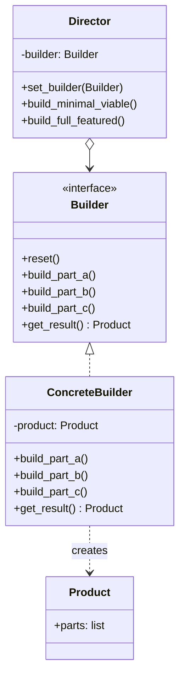

### 4.6 Python Implementation — Pizza Builder

```python
from dataclasses import dataclass, field


@dataclass
class Pizza:
    size: str = "medium"
    cheese: bool = False
    pepperoni: bool = False
    mushrooms: bool = False
    olives: bool = False
    extra_sauce: bool = False
    toppings: list[str] = field(default_factory=list)

    def describe(self) -> str:
        bits = [f"{self.size} pizza"]
        if self.cheese: bits.append("extra cheese")
        if self.pepperoni: bits.append("pepperoni")
        if self.mushrooms: bits.append("mushrooms")
        if self.olives: bits.append("olives")
        if self.extra_sauce: bits.append("extra sauce")
        return ", ".join(bits)


class PizzaBuilder:
    def __init__(self) -> None:
        self.reset()

    def reset(self) -> "PizzaBuilder":
        self._pizza = Pizza()
        return self

    def size(self, s: str) -> "PizzaBuilder":
        self._pizza.size = s
        return self

    def with_cheese(self) -> "PizzaBuilder":
        self._pizza.cheese = True
        return self

    def with_pepperoni(self) -> "PizzaBuilder":
        self._pizza.pepperoni = True
        return self

    def with_mushrooms(self) -> "PizzaBuilder":
        self._pizza.mushrooms = True
        return self

    def with_olives(self) -> "PizzaBuilder":
        self._pizza.olives = True
        return self

    def with_extra_sauce(self) -> "PizzaBuilder":
        self._pizza.extra_sauce = True
        return self

    def build(self) -> Pizza:
        pizza = self._pizza
        self.reset()  # builder can be reused
        return pizza


# Usage — note the fluent chain:
margherita = (
    PizzaBuilder()
    .size("large")
    .with_cheese()
    .with_extra_sauce()
    .build()
)
print(margherita.describe())
# large pizza, extra cheese, extra sauce
```

### 4.7 Director — Reusable Construction Recipes

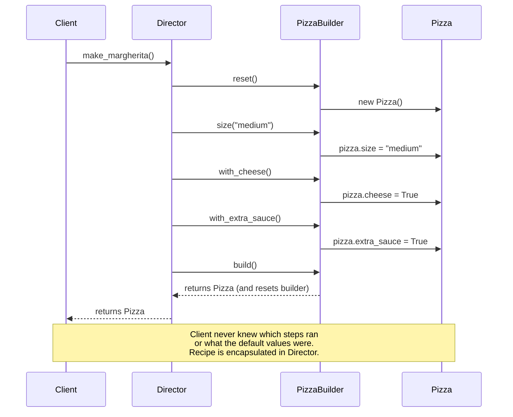

```python
class PizzaDirector:
    """Knows named recipes; uses any builder."""

    def __init__(self, builder: PizzaBuilder):
        self._builder = builder

    def make_margherita(self) -> Pizza:
        return (
            self._builder.reset()
            .size("medium")
            .with_cheese()
            .with_extra_sauce()
            .build()
        )

    def make_hawaiian(self) -> Pizza:
        return (
            self._builder.reset()
            .size("large")
            .with_cheese()
            .with_mushrooms()
            .build()
        )

    def make_meat_lovers(self) -> Pizza:
        return (
            self._builder.reset()
            .size("extra-large")
            .with_cheese()
            .with_pepperoni()
            .with_extra_sauce()
            .build()
        )


director = PizzaDirector(PizzaBuilder())
print(director.make_margherita().describe())
print(director.make_meat_lovers().describe())
```

### 4.8 Query Builder

```python
class QueryBuilder:
    def __init__(self, table: str):
        self._table = table
        self._select = ["*"]
        self._where = []
        self._order_by = None
        self._limit = None

    def select(self, *cols: str) -> "QueryBuilder":
        self._select = list(cols)
        return self

    def where(self, condition: str) -> "QueryBuilder":
        self._where.append(condition)
        return self

    def order_by(self, col: str, direction: str = "ASC") -> "QueryBuilder":
        self._order_by = f"{col} {direction}"
        return self

    def limit(self, n: int) -> "QueryBuilder":
        self._limit = n
        return self

    def build(self) -> str:
        sql = f"SELECT {', '.join(self._select)} FROM {self._table}"
        if self._where:
            sql += " WHERE " + " AND ".join(self._where)
        if self._order_by:
            sql += f" ORDER BY {self._order_by}"
        if self._limit is not None:
            sql += f" LIMIT {self._limit}"
        return sql + ";"


q = (
    QueryBuilder("users")
    .select("id", "name", "email")
    .where("age > 18")
    .where("active = TRUE")
    .order_by("name")
    .limit(10)
    .build()
)
print(q)
# SELECT id, name, email FROM users WHERE age > 18 AND active = TRUE ORDER BY name ASC LIMIT 10;
```

### 4.9 HTML Builder

```python
class HTMLBuilder:
    def __init__(self, root_tag: str):
        self._root = {"tag": root_tag, "children": [], "attrs": {}}

    def attr(self, key: str, value: str) -> "HTMLBuilder":
        self._root["attrs"][key] = value
        return self

    def child(self, tag: str, text: str = "") -> "HTMLBuilder":
        self._root["children"].append({"tag": tag, "text": text})
        return self

    def build(self) -> str:
        attrs = "".join(f' {k}="{v}"' for k, v in self._root["attrs"].items())
        if not self._root["children"]:
            return f"<{self._root['tag']}{attrs}/>"
        inner = "".join(
            f"<{c['tag']}>{c['text']}</{c['tag']}>" for c in self._root["children"]
        )
        return f"<{self._root['tag']}{attrs}>{inner}</{self._root['tag']}>"

html = (
    HTMLBuilder("div")
    .attr("class", "card")
    .attr("id", "main")
    .child("h1", "Hello")
    .child("p", "World")
    .build()
)
print(html)
# <div class="card" id="main"><h1>Hello</h1><p>World</p></div>
```

### 4.10 Modern Python: `dataclasses` Reduce Builder Need

```python
from dataclasses import dataclass


@dataclass(kw_only=True)
class PizzaConfig:
    size: str = "medium"
    cheese: bool = False
    pepperoni: bool = False
    mushrooms: bool = False
    olives: bool = False
    extra_sauce: bool = False


# Keyword-only construction is often all you need:
p = PizzaConfig(size="large", cheese=True, extra_sauce=True)
```

> [!tip] Teaching Tip
> Show students the "telescoping constructor" anti-pattern first (5, 6, 7-arg `__init__` variants), then introduce Builder as the cure. Finally, point out that Python's keyword arguments and `dataclasses(kw_only=True)` often eliminate the need for a full Builder.

### 4.11 Common Mistakes

1. **Mutable builders, mutable products**. If the builder returns a reference to its internal `_pizza`, callers can mutate it after `build()`. Always return a fresh copy or reset on `build()`.
2. **Returning `self` everywhere**. A *fluent* builder should only chain methods that genuinely contribute to the build state. Returning `self` from `build()` (the product!) is a common bug — `build()` should return the product, not the builder.
3. **Not validating invariants**. A Builder is the perfect place to assert "size is required" or "must have at least one topping." Use `build()` to check, then construct.
4. **Builder explosion**. If you write a Builder for every dataclass, you are doing twice the work. Reserve Builder for objects with complex construction rules.

### 4.12 Immutable Builder (Functional Style)

```python
from dataclasses import dataclass, replace


@dataclass(frozen=True)
class Pizza:
    size: str = "medium"
    cheese: bool = False
    pepperoni: bool = False
    mushrooms: bool = False


@dataclass(frozen=True)
class PizzaBuilder:
    size: str = "medium"
    cheese: bool = False
    pepperoni: bool = False
    mushrooms: bool = False

    def with_size(self, s: str) -> "PizzaBuilder":
        return replace(self, size=s)

    def with_cheese(self) -> "PizzaBuilder":
        return replace(self, cheese=True)

    def with_pepperoni(self) -> "PizzaBuilder":
        return replace(self, pepperoni=True)

    def with_mushrooms(self) -> "PizzaBuilder":
        return replace(self, mushrooms=True)

    def build(self) -> Pizza:
        return Pizza(self.size, self.cheese, self.pepperoni, self.mushrooms)


p = (
    PizzaBuilder()
    .with_size("large")
    .with_cheese()
    .with_pepperoni()
    .build()
)
```

Each `with_*` returns a *new* immutable builder — no shared state, thread-safe by construction. The cost is more allocations, but for most use cases it is negligible.

### 4.13 Related Patterns

- **Abstract Factory** — Builder focuses on step-by-step; Abstract Factory on families.
- **Composite** — Builders often produce Composite structures (HTML trees, ASTs).
- **Facade** — a Builder is sometimes a Facade over a complex construction subsystem.

---

## 5. Prototype

### 5.1 Intent

Specify the kinds of objects to create using a **prototypical instance**, and create new objects by **copying** this prototype.

### 5.2 When to Use

- When creation is expensive (DB lookup, network call, heavy computation) but copying is cheap.
- When subclasses are proliferating only to specify initial configuration — replace each with a configured prototype.
- When you want to avoid building a parallel class hierarchy of factories.

### 5.3 When NOT to Use

- When objects have no state to copy (just call the constructor).
- When the object graph has cycles or non-copyable resources (file handles, sockets, locks).
- When shallow vs deep copy semantics are ambiguous for your team.

### 5.4 Real-World Examples

- Python's `copy.copy` and `copy.deepcopy`.
- `numpy.ndarray.copy()` — clones array data.
- Prototypical game entities: spawn 1000 goblins by cloning one configured Goblin instead of constructing each from scratch.
- Document templates in word processors.

### 5.5 Structure

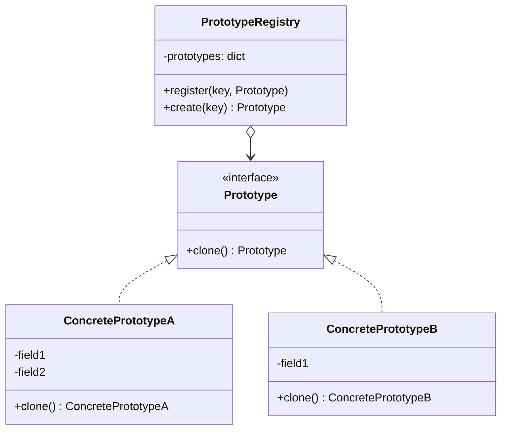

### 5.6 Python Implementation — `__copy__` and `__deepcopy__`

```python
import copy


class Address:
    def __init__(self, street: str, city: str):
        self.street = street
        self.city = city

    def __repr__(self):
        return f"Address({self.street!r}, {self.city!r})"


class Person:
    def __init__(self, name: str, address: Address):
        self.name = name
        self.address = address

    def __copy__(self):
        # Shallow copy: share the Address object
        return Person(self.name, self.address)

    def __deepcopy__(self, memo):
        # Deep copy: clone the Address object too
        return Person(self.name, copy.deepcopy(self.address, memo))

    def __repr__(self):
        return f"Person({self.name!r}, {self.address!r})"


original = Person("Alice", Address("1 Main St", "Springfield"))

shallow = copy.copy(original)
shallow.name = "Bob"
shallow.address.street = "2 Other St"
print(original)  # Person('Alice', Address('2 Other St', 'Springfield'))
# ^ Street was shared! Original got modified.

deep = copy.deepcopy(original)
deep.name = "Carol"
deep.address.street = "3 Deep Ln"
print(original)  # Person('Alice', Address('2 Other St', 'Springfield'))
# ^ Original untouched this time.
```

> [!warning] Shallow vs Deep
> `copy.copy` shares nested mutable objects — modifying a clone's nested attribute mutates the original. Use `copy.deepcopy` when in doubt, but be aware it is slower and may recurse into unexpected places (e.g., onto module references).

### 5.7 Prototype Registry

A registry stores pre-configured prototypes by name; clients ask for a clone by key:

```python
class PrototypeRegistry:
    def __init__(self):
        self._items: dict[str, Person] = {}

    def register(self, key: str, prototype: Person) -> None:
        self._items[key] = prototype

    def create(self, key: str) -> Person:
        prototype = self._items.get(key)
        if prototype is None:
            raise KeyError(f"No prototype registered for {key!r}")
        return copy.deepcopy(prototype)


registry = PrototypeRegistry()
registry.register("default", Person("Anonymous", Address("?", "?")))
registry.register("admin", Person("Root", Address("0 Root Rd", "Server")))

u1 = registry.create("default")
u1.name = "Alice"
u2 = registry.create("default")
print(u1 is u2)        # False — distinct clones
print(u2.name)         # 'Anonymous' — prototype unchanged
```

### 5.8 Common Mistakes

1. **Defaulting to `copy.deepcopy` everywhere**. Deep copy is slow and will happily recurse into things you didn't expect — module references, decorators, cached properties, weakrefs. Use it sparingly, profile if it's hot.
2. **Sharing mutable nested state via shallow copy**. Always check: "if I mutate `clone.nested.leaf`, does the original change?" If the answer is yes and you don't want that, you need deep copy.
3. **Forgetting `__deepcopy__` memoization**. Without `memo`, cyclic graphs (a list containing itself) cause infinite recursion. Always pass `memo` through.
4. **Cloning unclonable resources**. File handles, sockets, locks, and database connections cannot meaningfully be copied. Either skip them in `__deepcopy__` or refuse to clone (raise).

### 5.9 Worked Example — Game Entity Prototypes

```python
import copy
from dataclasses import dataclass, field


@dataclass
class Stats:
    hp: int = 100
    mana: int = 50
    attack: int = 10


@dataclass
class Goblin:
    name: str = "Goblin"
    stats: Stats = field(default_factory=Stats)
    abilities: list[str] = field(default_factory=list)


# Configure one prototypical goblin once:
GOBLIN_PROTOTYPE = Goblin(
    name="Goblin",
    stats=Stats(hp=80, mana=0, attack=12),
    abilities=["bite", "flee"],
)


def spawn_goblin(name: str) -> Goblin:
    g = copy.deepcopy(GOBLIN_PROTOTYPE)
    g.name = name
    return g


horde = [spawn_goblin(f"Goblin #{i}") for i in range(10)]
print(horde[0].name, horde[0].stats.hp)   # Goblin #0 80
print(horde[0] is horde[1])               # False
print(horde[0].stats is horde[1].stats)   # False — deeply copied
```

The prototype pays off when the configuration cost is high (parsing data files, computing derived stats) but clones are cheap.

### 5.10 Related Patterns

- **Abstract Factory** — Prototype is a competing pattern: clone vs construct.
- **Composite** — Prototypes often used to seed Composite trees.
- **Decorator** — Decorators are rarely cloneable by default; design carefully.
- **Memento** — uses similar state-snapshotting techniques, but for *undo* rather than *construction*.

---

## 6. Comparison Matrix

| Pattern | What it solves | Pythonic alternative | Pitfalls |
|---------|----------------|----------------------|----------|
| Singleton | One instance | Module | Hidden coupling, test difficulty |
| Factory Method | Subclass chooses class | `@classmethod` from_* | Over-engineering simple cases |
| Abstract Factory | Family of related products | Functions returning tuples | Adding new product type is painful |
| Builder | Many optional parts | `dataclass(kw_only=True)` | Verbose if product is simple |
| Prototype | Cheap clone of expensive object | `copy.deepcopy()` | Shallow-vs-deep bugs |

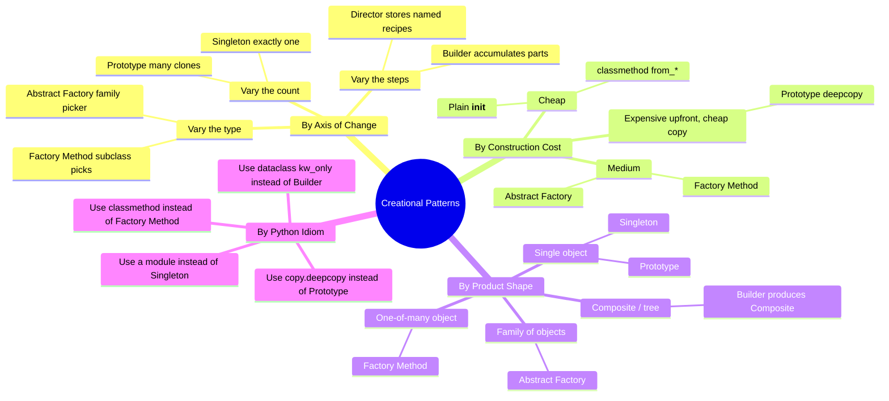

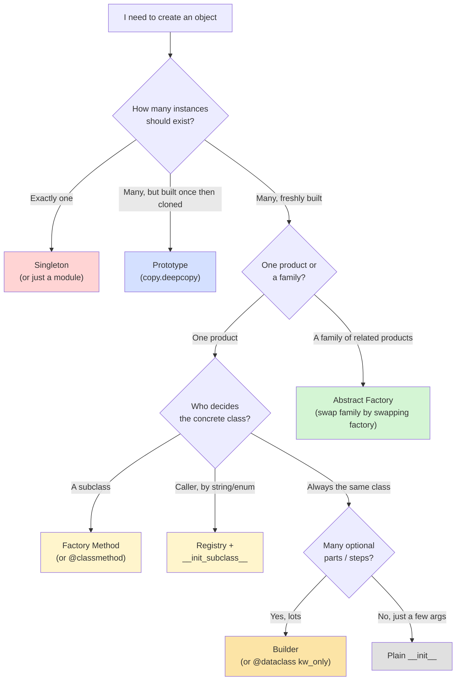

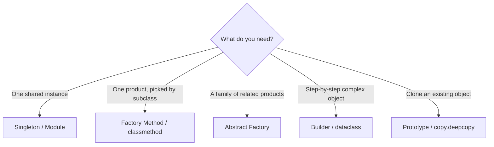

---

## 7. Python-Specific Notes

### 7.1 Modules Are Singletons

```python
# db.py
connection = create_connection("postgres://...")
```

Importing `db` anywhere returns the **same** module object (cached in `sys.modules`), so `db.connection` is shared. Most Python "singletons" should just be module-level state.

### 7.2 `@classmethod` Replaces Many Factories

The GoF Factory Method implies subclassing. Python idiom is to provide `from_*` classmethods:

```python
class Date:
    @classmethod
    def from_iso(cls, s: str) -> "Date": ...
    @classmethod
    def from_timestamp(cls, t: float) -> "Date": ...
```

This pattern is shorter, more discoverable, and works with subclassing automatically.

### 7.3 `dataclasses` Reduce Builder Need

`@dataclass(kw_only=True)` (Python 3.10+) gives you named, optional, type-checked construction for free. Reach for a Builder only when construction has *steps* or *invariants* (e.g., "you must call `add_header()` before `add_body()`").

### 7.4 `copy` Module Implements Prototype

You do not need to write a `clone()` method. Just implement `__copy__` / `__deepcopy__` and let `copy.copy(obj)` / `copy.deepcopy(obj)` do the work — that's the Pythonic protocol.

### 7.5 Avoid Metaclass Singletons in Application Code

Metaclass Singletons are cute but obscure. Reserve them for library/framework code where the singleton-ness is non-negotiable and the consumer must not be able to bypass it.

### 7.6 `__init_subclass__` for Registry-Style Factories

Python 3.6+ `__init_subclass__` lets subclasses auto-register with a base factory — a clean replacement for hand-maintained registries:

```python
class Plugin:
    _registry: dict[str, type] = {}

    def __init_subclass__(cls, name: str = None, **kwargs):
        super().__init_subclass__(**kwargs)
        if name:
            Plugin._registry[name] = cls

    @classmethod
    def create(cls, name: str, **kwargs) -> "Plugin":
        return cls._registry[name](**kwargs)


class CSVLoader(Plugin, name="csv"):
    def __init__(self, path: str): ...


class JSONLoader(Plugin, name="json"):
    def __init__(self, path: str): ...


loader = Plugin.create("csv", path="data.csv")
```

No central switch statement; new plugins self-register on import.

### 7.7 Dependency Injection Replaces Singleton

The Singleton pattern is often used to give a class access to a shared dependency (e.g., a database). Modern Python style prefers **dependency injection**: pass the dependency through the constructor. This makes the dependency visible in the signature, easy to mock, and easy to vary per request.

```python
# Bad: hidden Singleton dependency
class UserService:
    def get_user(self, id):
        db = Database()       # Singleton call hidden inside method
        return db.find(id)

# Good: injected dependency
class UserService:
    def __init__(self, db: Database):
        self.db = db

    def get_user(self, id):
        return self.db.find(id)
```

In tests, you can pass a `FakeDatabase`. In production, you pass the real one. The Singleton pattern is not needed.

---

## 8. Refactoring to Creational Patterns

### 8.1 From Constructor Explosion to Builder

**Smell**: a class has `__init__(self, a, b=None, c=None, d=None, e=None, f=None)` and most callers pass `None` for half of them.

**Refactor**: introduce a Builder. The class's `__init__` shrinks to required fields; optional fields move to Builder methods. Or, simpler, switch to `@dataclass(kw_only=True)` and let callers pass only what they need.

### 8.2 From Switch-Statement Factory to Registry

**Smell**: a `create_product(name)` function is a giant `if/elif` chain that grows every time a new product is added.

**Refactor**: replace with a `Registry` dict (or `__init_subclass__`). New products register themselves; the factory function stays unchanged (Open/Closed achieved).

### 8.3 From Global Singleton to Injected Dependency

**Smell**: every class in the codebase calls `Database()` to get the singleton, making testing painful.

**Refactor**: introduce a `Container` or `injector` (e.g., `dependency-injector`, `punq`) that wires dependencies together once at startup. Pass dependencies via constructors. Delete the Singleton.

### 8.4 From Cloning-Heavy Code to Prototype

**Smell**: a function copies a complex object field-by-field across many call sites.

**Refactor**: implement `__deepcopy__` once and use `copy.deepcopy(obj)` everywhere. Add a `PrototypeRegistry` if the same starting configurations are cloned repeatedly.

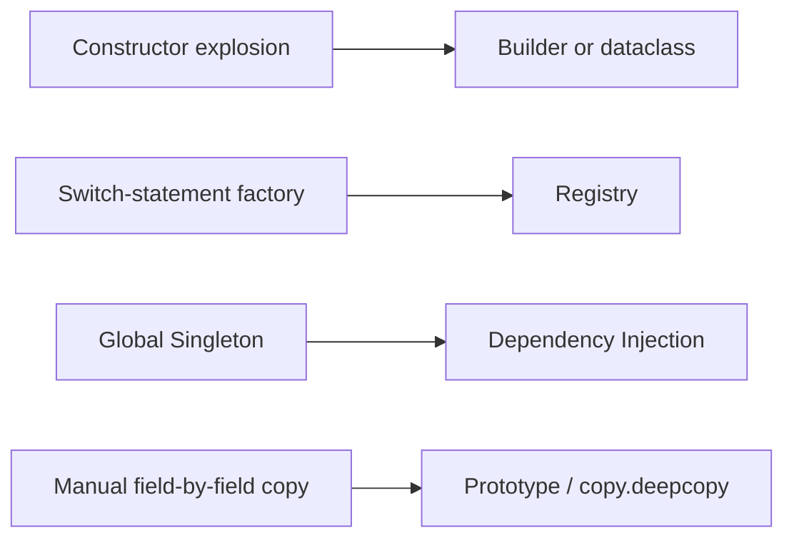

---

## 9. Cross-Pattern Relationships

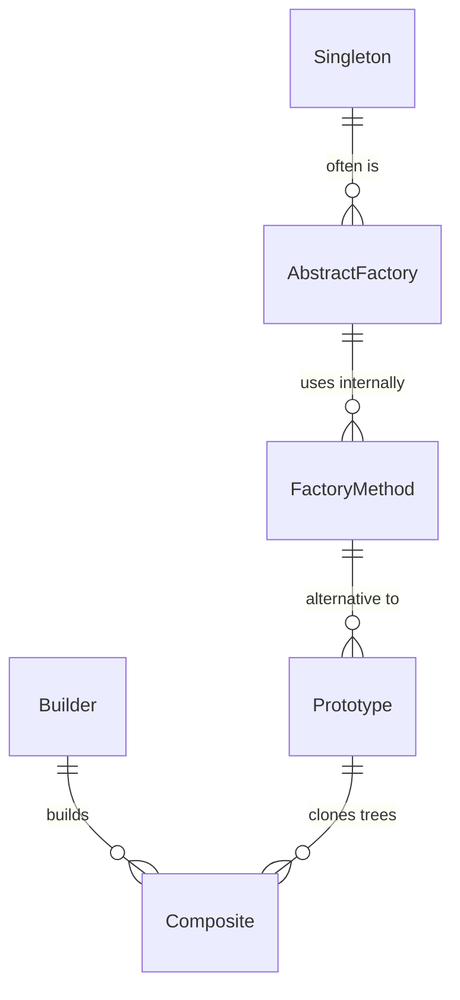

### 9.1 Common Combinations

- **Singleton + Abstract Factory**: one global factory instance (`UIFactory.get_instance()`).
- **Builder + Composite**: HTML/AST builders produce trees.
- **Prototype + Factory Method**: factory clones a prototype instead of constructing.
- **Factory Method + Template Method**: a base class defines an algorithm whose steps create products via factory methods.

---

## 10. Quick-Reference Cheat Sheet

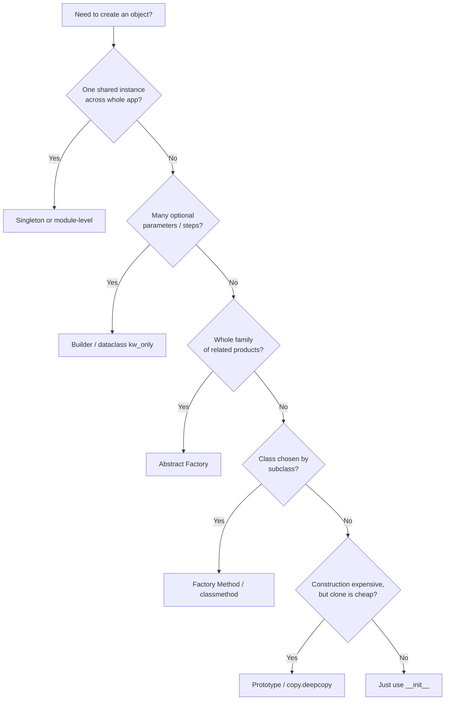

| If you find yourself writing... | Reach for... |
|----------------------------------|--------------|
| `if x == "a": return A() elif x == "b": return B() ...` | Registry or Factory Method |
| `__init__(self, a, b=None, c=None, d=None, e=None, f=None)` | Builder or `@dataclass(kw_only=True)` |
| The same `_instance` guard in every class | Metaclass Singleton (or just use a module) |
| Two factories that produce matching UI themes | Abstract Factory |
| Field-by-field copy of a complex object | Prototype (`copy.deepcopy`) |

> [!success] Pattern Hygiene Checklist
> Before adding a creational pattern, ask:
> - Will I really need more than one variant, or am I speculating?
> - Does this pattern pay for itself in clarity, or just in "cleverness"?
> - Can a `dataclass`, a `@classmethod`, or a plain function do the job?
> - Have I waited for the **Rule of Three** (see [[Pattern-Selection-Guide]])?

---

## 11. Teaching Path

1. Start with **Singleton** — students immediately get the idea of "one shared thing." Then immediately show why it is harmful (test difficulty) to inoculate them against overuse.
2. Move to **Factory Method** via the `@classmethod from_*` shortcut, then show the strict subclass version when motivation is real.
3. Introduce **Abstract Factory** with a UI theme example — the family-of-products concept becomes tangible when you can swap a single factory and watch the whole UI change.
4. Show **Builder** *after* the telescoping-constructor anti-pattern. Let students feel the pain first.
5. End with **Prototype** — quick, satisfying, and a great segue into `copy`/`pickle`/`__deepcopy__` Python lore.

> [!success] Learning Check
> Can you explain to a peer why Python's `logging.getLogger("name")` is essentially a Singleton *registry*, not a single-instance Singleton? Can you sketch how to extend it to per-thread loggers without breaking callers?

---

## 12. Summary

Creational patterns all do one thing: **hide the `new` operator** (or `__init__` call) so the rest of the system does not depend on a specific concrete class. The differences are in *when*, *why*, and *how* the hiding happens:

- **Singleton** — hide so there's only one.
- **Factory Method** — hide so a subclass can decide.
- **Abstract Factory** — hide so a *family* stays coherent.
- **Builder** — hide so step-by-step construction stays valid.
- **Prototype** — hide so you copy instead of construct.

Pick the pattern whose *axis of change* matches your problem. If the answer is "I don't have an axis of change yet," then **don't pattern — just write the constructor** (see [[Pattern-Selection-Guide]] on the Rule of Three).

Continue with:
- [[Structural-Patterns]] — how objects compose.
- [[Behavioral-Patterns]] — how objects communicate.
- [[Pattern-Selection-Guide]] — choosing the right pattern.
