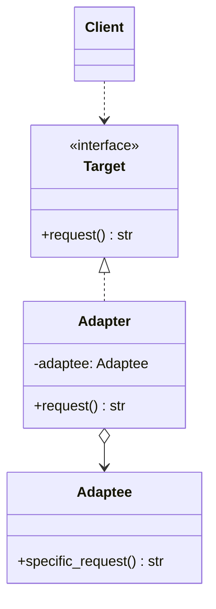
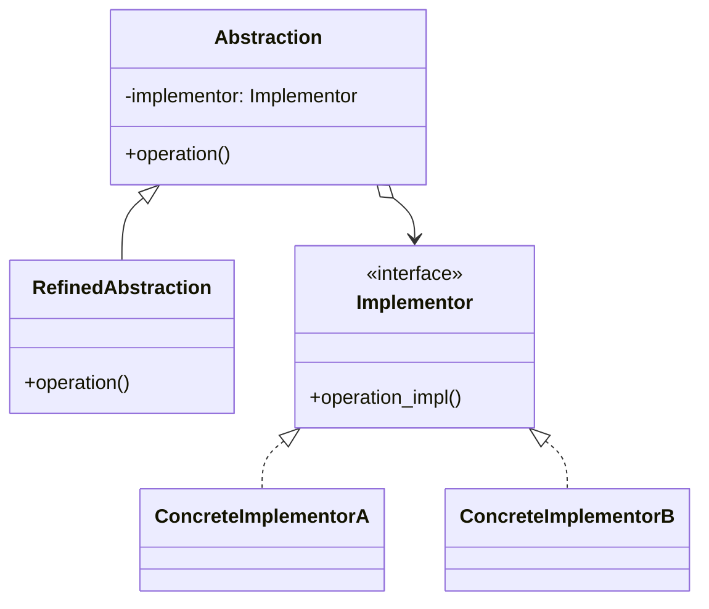
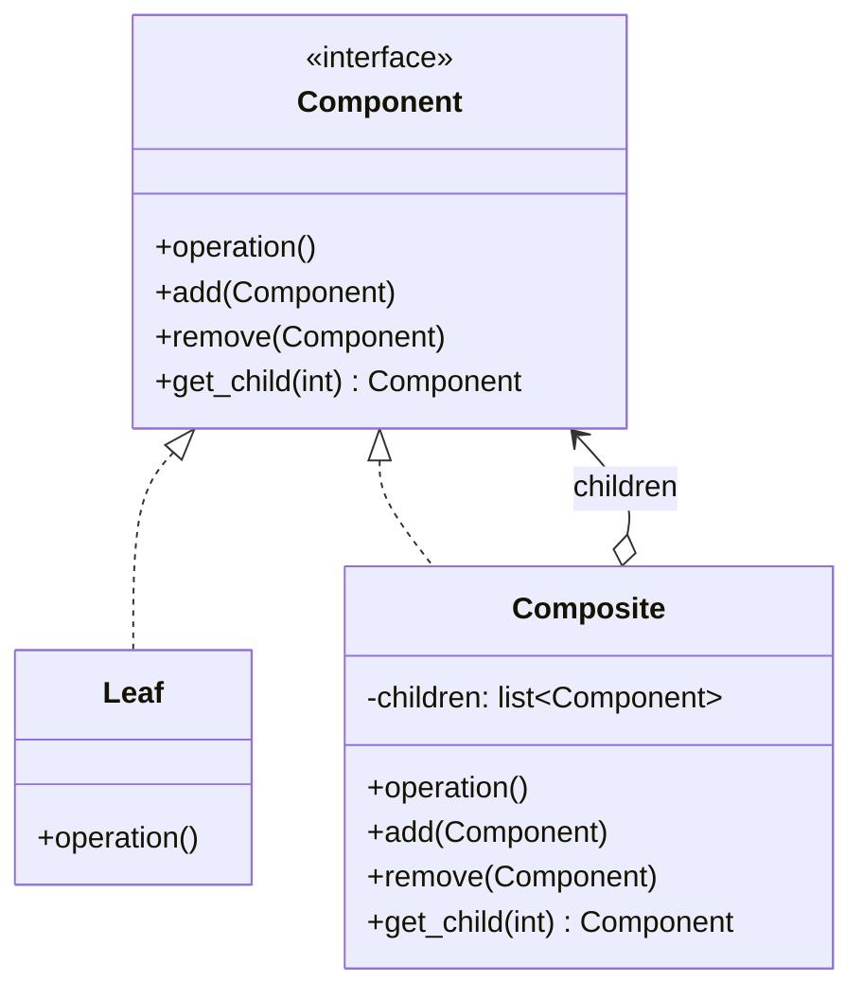
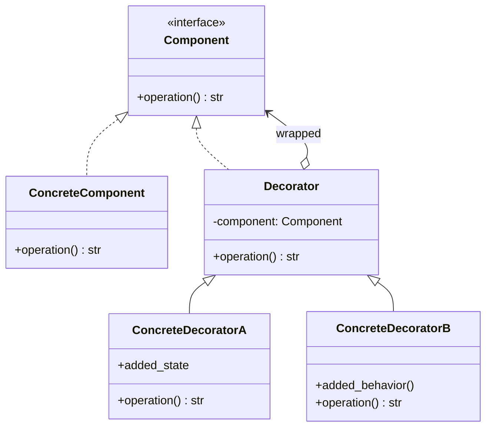
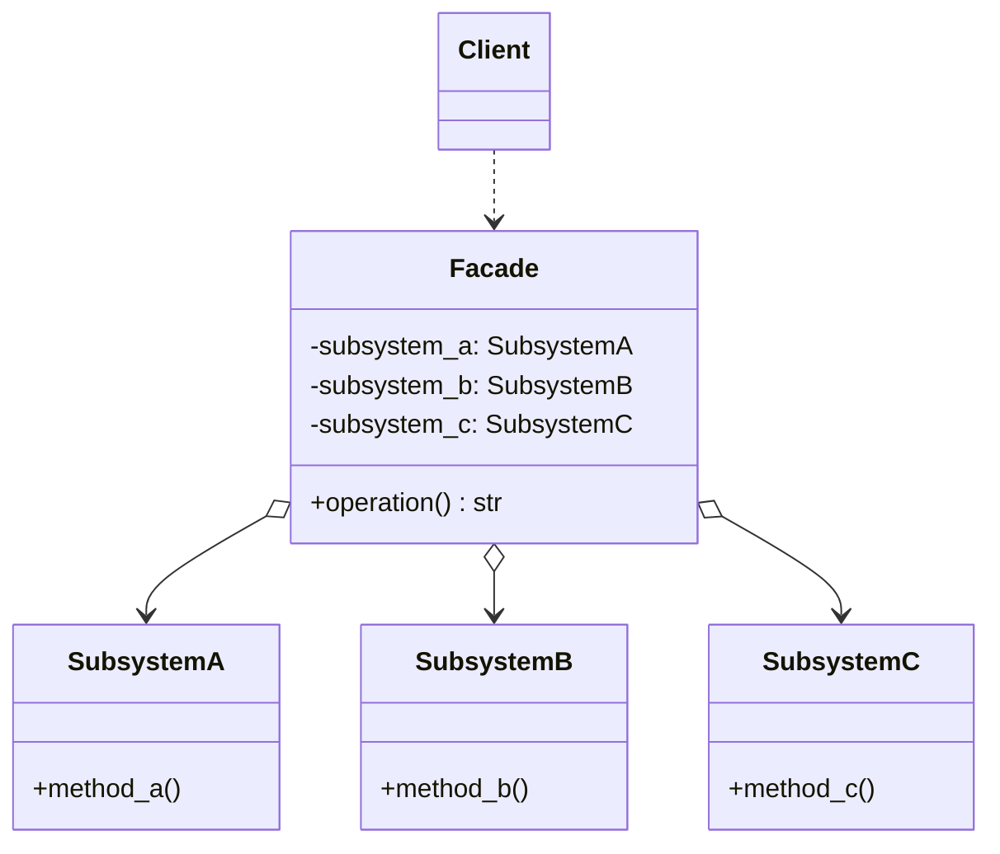
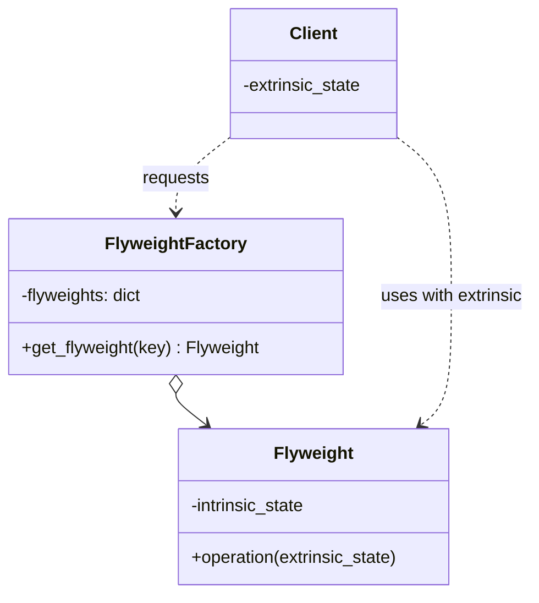
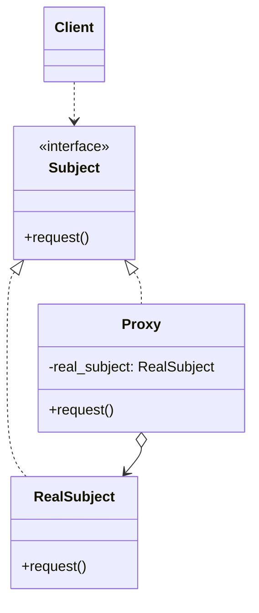
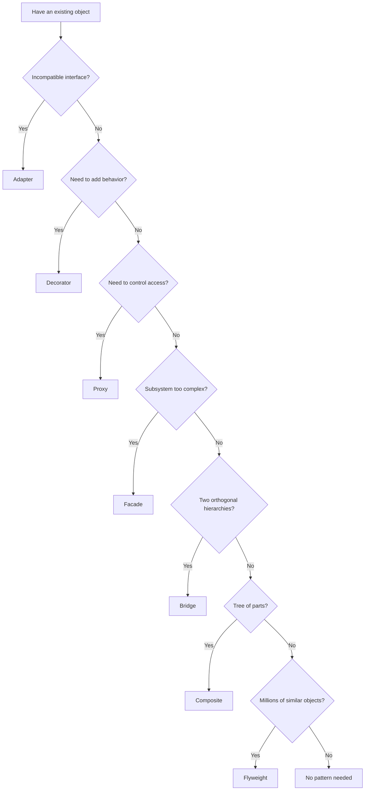
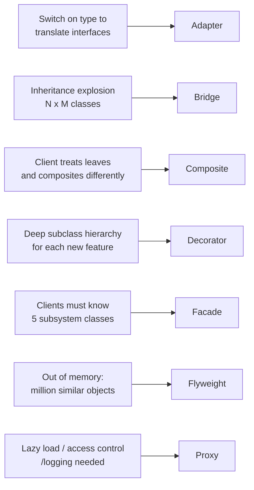
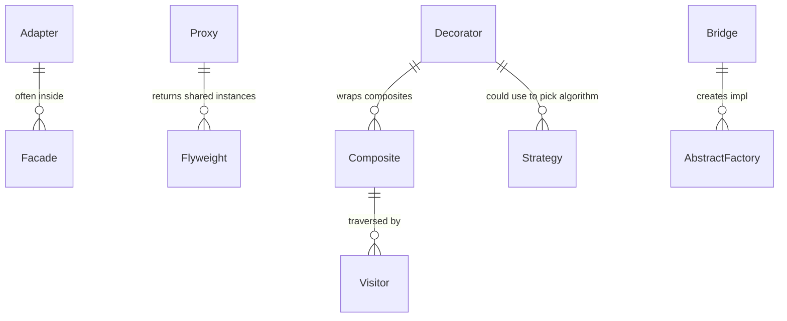

# Structural Design Patterns — Composing Objects in Python

#oop #design-patterns #structural #gof #adapter #bridge #composite #decorator #facade #flyweight #proxy #teaching #deep-dive

> [!quote] Gang of Four
> "Structural patterns are concerned with how classes and objects are composed to form larger structures. Structural class patterns use inheritance to compose interfaces or implementations. Structural object patterns describe ways to compose objects to realize new functionality."

If creational patterns (see [[Creational-Patterns]]) are about *how objects are born*, structural patterns are about **how objects connect and combine**. They let you build bigger structures from smaller parts — without rewriting the parts.

This note covers all seven GoF structural patterns:

- [[#1. Adapter|Adapter]] — make incompatible interfaces work together
- [[#2. Bridge|Bridge]] — decouple abstraction from implementation
- [[#3. Composite|Composite]] — uniform treatment of trees
- [[#4. Decorator|Decorator]] — add behavior without subclassing
- [[#5. Facade|Facade]] — simplify a complex subsystem
- [[#6. Flyweight|Flyweight]] — share fine-grained state
- [[#7. Proxy|Proxy]] — placeholder/surrogate for another object

Prerequisite reading: [[Classes-And-Objects]], [[Polymorphism]], [[Composition-vs-Inheritance]], [[Abstraction]].

---

## 0. Why Structural Patterns Exist

Software grows. As it does, you discover that:

- A useful class exists, but its interface does not match what you need. → **Adapter**
- An abstraction has multiple *orthogonal* variations, and inheritance explodes. → **Bridge**
- A tree-shaped data structure (filesystem, UI, AST) should be treated uniformly. → **Composite**
- You want to add responsibilities to individual objects dynamically. → **Decorator**
- A subsystem is correct but too complex for callers to use directly. → **Facade**
- You have millions of similar objects and memory is exhausted. → **Flyweight**
- You need to control or defer access to an expensive object. → **Proxy**

```mermaid
mindmap
  root((Structural))
    Adapter
      wrap incompatible interface
      USB-to-serial
      XML-to-JSON
    Bridge
      abstraction vs impl
      shape+renderer
      avoid inheritance explosion
    Composite
      tree of parts
      uniform treatment
      filesystem / UI tree
    Decorator
      add behavior at runtime
      NOT python @ decorator
      coffee add-ons
    Facade
      simplified gateway
      hides subsystem
      computer facade
    Flyweight
      shared intrinsic state
      text editor chars
      memory savings
    Proxy
      placeholder / surrogate
      lazy / cache / access / log
```

### 0.1 The Seven Patterns at a Glance

| Pattern | Core Idea | Pythonic Hint |
|---------|-----------|----------------|
| **Adapter** | Wrap object A so it looks like B | Subclass B, hold A as attribute |
| **Bridge** | Two orthogonal hierarchies, linked by composition | Inject `Renderer` into `Shape` |
| **Composite** | Leaf + Container share an interface | Recursive `__iter__`, `render()` |
| **Decorator** | Wrap to add behavior | *Not* Python's `@decorator`! |
| **Facade** | One easy interface over many hard ones | A simple class with 3-5 methods |
| **Flyweight** | Share immutable state | `intern()`, dict-pool of objects |
| **Proxy** | Stand-in that controls access | `__getattr__` forwarding |

> [!info] The Decorator Confusion
> Python has `@decorator` syntax (functions wrapping functions). The GoF Decorator is *similar in spirit* but applies to **objects of a class hierarchy**: a `Coffee` object wrapped by `MilkDecorator(Coffee)` wrapped by `WhipDecorator(...)`. Both decorate by wrapping, but the GoF version preserves an OOP interface. This note is about the GoF version.

---

## 1. Adapter

### 1.1 Intent

Convert the interface of a class into another interface clients expect. Adapter lets classes work together that otherwise couldn't because of incompatible interfaces.

### 1.2 When to Use

- You want to use an existing class, but its interface doesn't match the one you need.
- You want to reuse several existing subclasses but they lack a common interface, and you can't subclass each one.
- You're integrating a third-party library whose API doesn't match your domain.

### 1.3 When NOT to Use

- When you control both sides — just change one of them.
- When a thin wrapper function would do (Python often prefers functions to adapter classes).
- When the adaptation is so heavy that you're really rewriting the class — consider wrapping with a new domain object instead.

### 1.4 Real-World Examples

- `io.StringIO` / `io.BytesIO` adapt between in-memory buffers and file-like interfaces.
- USB-to-serial adapters, plug adapters in foreign countries.
- `requests` adapters for different transports (`HTTPAdapter`, custom transports).
- A payment library that wraps Stripe, PayPal, and Braintree under one `PaymentGateway` interface.

### 1.5 Structure



### 1.6 Python Implementation — XML-to-JSON Adapter

```python
import json
import xml.etree.ElementTree as ET


# ---- Target interface (what the client wants) ----
class JSONDataProvider:
    """Returns a dict from JSON text."""
    def get_data(self, text: str) -> dict:
        return json.loads(text)


# ---- Adaptee (existing class with incompatible interface) ----
class XMLDataProvider:
    """Returns an ElementTree from XML text."""
    def parse(self, text: str):
        return ET.fromstring(text)


# ---- Adapter ----
class XMLToJSONAdapter(JSONDataProvider):
    """Makes XMLDataProvider look like a JSONDataProvider."""

    def __init__(self, adaptee: XMLDataProvider):
        self._adaptee = adaptee

    def get_data(self, text: str) -> dict:
        root = self._adaptee.parse(text)
        return self._element_to_dict(root)

    def _element_to_dict(self, element) -> dict:
        result = {element.tag: {} if element.attrib else None}
        children = list(element)
        if children:
            child_dict: dict = {}
            for child in children:
                child_data = self._element_to_dict(child)
                for k, v in child_data.items():
                    if k in child_dict:
                        if not isinstance(child_dict[k], list):
                            child_dict[k] = [child_dict[k]]
                        child_dict[k].append(v)
                    else:
                        child_dict[k] = v
            result[element.tag] = child_dict
        if element.text and element.text.strip():
            text_content = element.text.strip()
            if result[element.tag]:
                result[element.tag]["#text"] = text_content
            else:
                result[element.tag] = text_content
        result[element.tag].update(element.attrib) if isinstance(result[element.tag], dict) else None
        return result


# Client code: talks only to JSONDataProvider
def print_user_age(provider: JSONDataProvider, raw: str) -> None:
    data = provider.get_data(raw)
    print("Age:", data.get("user", {}).get("age"))


xml_text = """<user><name>Alice</name><age>30</age></user>"""
adapter = XMLToJSONAdapter(XMLDataProvider())
print_user_age(adapter, xml_text)   # Age: 30
```

### 1.7 Class Adapter (Multiple Inheritance Variant)

In Python (and C++), an Adapter can also subclass *both* Target and Adaptee:

```python
class ClassAdapter(JSONDataProvider, XMLDataProvider):
    def get_data(self, text: str) -> dict:
        root = self.parse(text)  # inherited from XMLDataProvider
        return self._element_to_dict(root)

    def _element_to_dict(self, element) -> dict:
        # ... same as above ...
        ...
```

This is shorter but couples the adapter to the Adaptee's class hierarchy. The **object adapter** (composition) is preferred in Python because it works with Adaptee *instances* and doesn't drag in unwanted base-class behavior.

### 1.8 Adapter vs Decorator vs Facade

| Aspect | Adapter | Decorator | Facade |
|--------|---------|-----------|--------|
| Goal | Change interface | Add behavior, keep interface | Simplify interface |
| Wraps | One object | One object | A whole subsystem |
| Same interface as target? | Yes (yes, that's the point) | Yes | No (new, simpler interface) |
| Client aware? | No | No | Yes (calls facade) |

### 1.9 Common Mistakes

1. **Adapting too aggressively**. If your adapter maps every method 1-to-1, you didn't need an adapter — you needed to change one interface.
2. **Adapting values back and forth on every call**. If a method is called in a hot loop, the conversion overhead may be unacceptable. Cache or batch where possible.
3. **Letting Adaptee leak**. If the adapter exposes the wrapped object (e.g., via `adapter.adaptee`), clients can reach past the interface and you've lost encapsulation.

### 1.10 Related Patterns

- **Bridge** — both connect things, but Bridge separates abstraction from implementation up front; Adapter retrofits.
- **Decorator** — Decorator enhances without changing interface; Adapter changes interface.
- **Facade** — Facade defines a *new* simpler interface; Adapter makes an *existing* interface conform to a target.

---

## 2. Bridge

### 2.1 Intent

Decouple an abstraction from its implementation so the two can vary independently.

### 2.2 When to Use

- You want to avoid a permanent binding between an abstraction and its implementation (e.g., to swap implementations at runtime).
- Both the abstraction *and* its implementation should be extensible by subclassing.
- Changes in the implementation should not impact client code.

### 2.3 When NOT to Use

- When there is only one implementation.
- When the abstraction and implementation are tightly coupled by nature (e.g., a `Car` and its `Engine` are usually fine as direct composition).

### 2.4 Real-World Examples

- GUI shapes (Circle, Square) × renderers (Vector, Raster, OpenGL).
- Persistence: a `Repository` abstraction backed by SQL, NoSQL, or in-memory stores.
- Remote procedure call: high-level `Service` × low-level transport (HTTP, gRPC, in-process).

### 2.5 The Problem Bridge Solves

Without Bridge, you would subclass:

```
Shape
├── CircleShape
│   ├── CircleVector
│   └── CircleRaster
├── SquareShape
│   ├── SquareVector
│   └── SquareRaster
```

Add a Triangle and you get two more classes. Add a third renderer and *every* shape gets a new subclass. **N × M classes.** With Bridge, you have **N + M classes**.

### 2.6 Structure



### 2.7 Python Implementation — Shape + Renderer

```python
from abc import ABC, abstractmethod


class Renderer(ABC):
    @abstractmethod
    def render_circle(self, radius: float) -> str: ...

    @abstractmethod
    def render_square(self, side: float) -> str: ...


class VectorRenderer(Renderer):
    def render_circle(self, radius: float) -> str:
        return f"Drawing a vector circle of radius {radius}"

    def render_square(self, side: float) -> str:
        return f"Drawing a vector square of side {side}"


class RasterRenderer(Renderer):
    def render_circle(self, radius: float) -> str:
        return f"Drawing a raster circle (pixels) of radius {radius}"

    def render_square(self, side: float) -> str:
        return f"Drawing a raster square (pixels) of side {side}"


class Shape:
    def __init__(self, renderer: Renderer):
        self.renderer = renderer

    def draw(self) -> str:
        raise NotImplementedError


class Circle(Shape):
    def __init__(self, renderer: Renderer, radius: float):
        super().__init__(renderer)
        self.radius = radius

    def draw(self) -> str:
        return self.renderer.render_circle(self.radius)


class Square(Shape):
    def __init__(self, renderer: Renderer, side: float):
        super().__init__(renderer)
        self.side = side

    def draw(self) -> str:
        return self.renderer.render_square(self.side)


# Usage: shapes and renderers vary independently.
shapes = [
    Circle(VectorRenderer(), 5.0),
    Circle(RasterRenderer(), 5.0),
    Square(VectorRenderer(), 3.0),
    Square(RasterRenderer(), 3.0),
]
for s in shapes:
    print(s.draw())
# Drawing a vector circle of radius 5.0
# Drawing a raster circle (pixels) of radius 5.0
# Drawing a vector square of side 3.0
# Drawing a raster square (pixels) of side 3.0
```

> [!tip] Bridge = "Dependency Injection on Steroids"
> Bridge looks like ordinary dependency injection, and at the small scale it is. The pattern *earns its name* when both hierarchies are independently subclassable and you'd otherwise face N×M class explosion.

### 2.8 Common Mistakes

1. **Single-implementation Bridge**. If you only have one renderer, you don't have a Bridge — you have premature abstraction. Wait until the second implementation actually appears.
2. **Leaking implementation details through the abstraction**. If `Shape` exposes `set_pixel_buffer(...)`, the abstraction is no longer independent of raster rendering. The abstraction should only know the Implementor interface.
3. **Two hierarchies that aren't really orthogonal**. If `Circle` *requires* `VectorRenderer`, there is no Bridge — there is a constraint.

### 2.9 Related Patterns

- **Adapter** — Bridge designed up front; Adapter retrofitted.
- **Strategy** — structurally similar (both inject a dependency). Bridge is about *long-term* structure; Strategy is about *varying an algorithm* within a single class.
- **Abstract Factory** — can be used to create Implementor + Abstraction pairs together.

---

## 3. Composite

### 3.1 Intent

Compose objects into tree structures to represent part-whole hierarchies. Composite lets clients treat individual objects and compositions of objects uniformly.

### 3.2 When to Use

- You want to represent part-whole hierarchies of objects.
- You want clients to be able to ignore the difference between compositions of objects and individual objects.

### 3.3 When NOT to Use

- When the tree is shallow (1-2 levels) and the uniform interface isn't needed — a plain container is simpler.
- When leaf and composite have very different operations — forcing them into one interface produces lots of `NotImplementedError` stubs.

### 3.4 Real-World Examples

- Filesystems: `File` (leaf) and `Directory` (composite) both support `size()`, `delete()`, `move_to()`.
- UI toolkits: `Button`, `Label` (leaves) and `Panel`, `Window` (composites) all support `render()`, `handle_event()`.
- AST nodes: `Literal`, `Variable` (leaves) and `BinOp`, `Call` (composites) all support `eval()`, `visit()`.
- `unittest`'s `TestSuite` is a composite of test cases and other suites.

### 3.5 Structure



### 3.6 Python Implementation — Filesystem

```python
from abc import ABC, abstractmethod


class FileSystemNode(ABC):
    @abstractmethod
    def size(self) -> int: ...

    @abstractmethod
    def display(self, indent: int = 0) -> str: ...


class File(FileSystemNode):
    def __init__(self, name: str, size: int):
        self.name = name
        self._size = size

    def size(self) -> int:
        return self._size

    def display(self, indent: int = 0) -> str:
        return "  " * indent + f"📄 {self.name} ({self._size} bytes)"


class Directory(FileSystemNode):
    def __init__(self, name: str):
        self.name = name
        self._children: list[FileSystemNode] = []

    def add(self, node: FileSystemNode) -> "Directory":
        self._children.append(node)
        return self

    def remove(self, node: FileSystemNode) -> None:
        self._children.remove(node)

    def size(self) -> int:
        return sum(child.size() for child in self._children)

    def display(self, indent: int = 0) -> str:
        lines = ["  " * indent + f"📁 {self.name}/"]
        for child in self._children:
            lines.append(child.display(indent + 1))
        return "\n".join(lines)


# Build a tree:
root = Directory("root")
root.add(File("README.md", 1024))
src = Directory("src").add(File("main.py", 2048)).add(File("util.py", 512))
root.add(src)
root.add(File("LICENSE", 4096))

print(root.display())
print("Total size:", root.size())
# 📁 root/
#   📄 README.md (1024 bytes)
#   📁 src/
#     📄 main.py (2048 bytes)
#     📄 util.py (512 bytes)
#   📄 LICENSE (4096 bytes)
# Total size: 7680
```

### 3.7 Transparent vs Safe Composite

- **Transparent Composite**: `add`/`remove` declared on `Component`. Leaves inherit them and must raise (`NotImplementedError`). Pro: clients can call `add` on anything. Con: leaf operations fail at runtime.
- **Safe Composite**: `add`/`remove` declared only on `Composite`. Pro: leaves never get invalid calls. Con: clients must type-check to call `add`.

Python favors **safe** — adding `add()` to a `File` makes no sense.

### 3.8 Common Mistakes

1. **Forcing every leaf to implement `add`/`remove`/`get_child`**. Use the Safe Composite instead, or move those to a `Composite` base class.
2. **Forgetting to handle cycles**. If a Directory can contain itself (via a soft link), recursive `size()` will infinite-loop. Track visited nodes or refuse cyclic links.
3. **Per-node type checks in client code** (`if isinstance(node, Directory):`). If you find yourself doing this, you've broken the uniform treatment — push the behavior into the component interface.

### 3.9 Related Patterns

- **Visitor** — Visiting a Composite is the canonical Visitor use case.
- **Iterator** — Composites are usually iterable (depth-first or breadth-first).
- **Decorator** — Decorator has a similar structure (one-component-wraps-one-component) but adds behavior rather than aggregating children.

---

## 4. Decorator

### 4.1 Intent

Attach additional responsibilities to an object dynamically. Decorators provide a flexible alternative to subclassing for extending functionality.

### 4.2 When to Use

- To add responsibilities to individual objects dynamically and transparently, without affecting other objects.
- When extension by subclassing is impractical: a large number of independent extensions would produce an explosion of subclasses.
- For responsibilities that can be withdrawn (just unwrap).

### 4.3 When NOT to Use

- When the responsibility is essential to the type — bake it into the class.
- When the decorator needs to know about the structure of the wrapped object's *type* (not just its interface) — that's leakage.
- When a simple function would do.

### 4.4 Real-World Examples

- `io.BufferedReader` wraps `io.RawIOBase`. `io.TextIOWrapper` wraps `io.BufferedIOBase`. The `open()` builtin stacks them.
- `collections.abc` decorators for adding mixin behavior.
- Coffee toppings, pizza toppings, ice-cream add-ons (the textbook examples).
- `pytest` plugins that wrap test functions.

### 4.5 Important: GoF Decorator vs Python `@decorator`

| Aspect | GoF Decorator | Python `@decorator` |
|--------|---------------|----------------------|
| What is decorated | Objects of a class | Functions / classes |
| Mechanism | Wrapping object in another object of same interface | Higher-order function |
| Visibility | Runtime object composition | Definition-time |
| Type preserved? | Yes (decorator subclass of component) | Yes (but introspection sees a wrapper) |

This note is about the GoF version. Both share the principle: **wrap to extend**.

### 4.6 Structure



### 4.7 Python Implementation — Coffee with Add-ons

```python
from abc import ABC, abstractmethod


class Coffee(ABC):
    @abstractmethod
    def cost(self) -> float: ...

    @abstractmethod
    def description(self) -> str: ...


class SimpleCoffee(Coffee):
    def cost(self) -> float:
        return 2.0

    def description(self) -> str:
        return "Simple coffee"


class CoffeeDecorator(Coffee):
    def __init__(self, wrapped: Coffee):
        self._wrapped = wrapped

    def cost(self) -> float:
        return self._wrapped.cost()

    def description(self) -> str:
        return self._wrapped.description()


class MilkDecorator(CoffeeDecorator):
    def cost(self) -> float:
        return self._wrapped.cost() + 0.5

    def description(self) -> str:
        return self._wrapped.description() + ", milk"


class SugarDecorator(CoffeeDecorator):
    def cost(self) -> float:
        return self._wrapped.cost() + 0.2

    def description(self) -> str:
        return self._wrapped.description() + ", sugar"


class WhipDecorator(CoffeeDecorator):
    def cost(self) -> float:
        return self._wrapped.cost() + 0.7

    def description(self) -> str:
        return self._wrapped.description() + ", whipped cream"


# Compose:
coffee = WhipDecorator(MilkDecorator(SugarDecorator(SimpleCoffee())))
print(coffee.description())  # Simple coffee, sugar, milk, whipped cream
print(f"Cost: ${coffee.cost():.2f}")  # Cost: $3.40
```

### 4.8 Alternative: Python `@decorator` for the Same Idea

The same idea, expressed with Python's decorator syntax:

```python
def add_milk(func):
    def wrapper(*args, **kwargs):
        base = func(*args, **kwargs)
        return {"cost": base["cost"] + 0.5, "desc": base["desc"] + ", milk"}
    return wrapper


def add_whip(func):
    def wrapper(*args, **kwargs):
        base = func(*args, **kwargs)
        return {"cost": base["cost"] + 0.7, "desc": base["desc"] + ", whipped cream"}
    return wrapper


@add_whip
@add_milk
def make_coffee():
    return {"cost": 2.0, "desc": "Simple coffee"}


print(make_coffee())  # {'cost': 3.2, 'desc': 'Simple coffee, milk, whipped cream'}
```

The Python version is terser but loses the object structure: you can't `unwrap` or query the chain at runtime. The GoF version is more flexible; the Python version is more concise.

### 4.9 Stream Decorators (Like `io`)

```python
class DataSource:
    def read(self) -> str:
        return "raw data"


class CompressionDecorator:
    def __init__(self, source: DataSource):
        self._source = source

    def read(self) -> str:
        return f"[compressed({self._source.read()})]"


class EncryptionDecorator:
    def __init__(self, source):
        self._source = source

    def read(self) -> str:
        return f"[encrypted({self._source.read()})]"


class LoggingDecorator:
    def __init__(self, source):
        self._source = source

    def read(self) -> str:
        data = self._source.read()
        print(f"LOG: read {len(data)} chars")
        return data


source = LoggingDecorator(EncryptionDecorator(CompressionDecorator(DataSource())))
print(source.read())
# LOG: read 39 chars
# [encrypted([compressed(raw data)])]
```

The order matters: outermost decorator runs first on read, last on write.

### 4.10 Common Mistakes

1. **Forgetting to forward methods**. A decorator that overrides `cost` but forgets `description` will silently break. Use `__getattr__` to forward, or inherit from a `Decorator` base that forwards everything by default.
2. **Leaking the wrapped object**. If clients can do `coffee._wrapped.cost()`, they can bypass decorators.
3. **Over-decorating**. Five decorators in a chain that you can never re-order or test individually is a code smell. Sometimes a single `Coffee` with a list of `Topping` objects is simpler.

```python
# Sometimes simpler than Decorator:
@dataclass
class Coffee2:
    base_price: float = 2.0
    toppings: list[str] = field(default_factory=list)

    TOPPING_PRICES = {"milk": 0.5, "sugar": 0.2, "whip": 0.7}

    def cost(self) -> float:
        return self.base_price + sum(self.TOPPING_PRICES[t] for t in self.toppings)

    def description(self) -> str:
        return "Simple coffee" + (", " + ", ".join(self.toppings) if self.toppings else "")
```

### 4.11 Related Patterns

- **Adapter** — same wrapping structure; different intent (change interface vs add behavior).
- **Composite** — Decorator is a degenerate Composite (one child).
- **Strategy** — Strategy changes behavior by swapping the algorithm; Decorator adds behavior by stacking wrappers.
- **Chain of Responsibility** — structurally similar but each handler decides whether to pass along.

---

## 5. Facade

### 5.1 Intent

Provide a unified interface to a set of interfaces in a subsystem. Facade defines a higher-level interface that makes the subsystem easier to use.

### 5.2 When to Use

- You want to provide a simple interface to a complex subsystem.
- There are many dependencies between clients and implementation classes of an abstraction.
- You want to layer your subsystems — each layer's facade is the only entry point.

### 5.3 When NOT to Use

- When the subsystem is already simple — a facade just adds indirection.
- When only one or two clients use the subsystem — give them the real interface.
- When the facade becomes a "god object" — split into multiple facades.

### 5.4 Real-World Examples

- `subprocess.run()` is a facade over `Popen`, `communicate`, `pipe`, `wait`.
- `requests.get(url)` is a facade over `Session`, `Request`, `HTTPAdapter`, `Response`, etc.
- `pandas.read_csv()` hides a dozen internal parsers, type inferrers, and converters.
- A `BankingService` that wraps `AccountRepository`, `TransactionLog`, `FraudChecker`, `NotificationService`.

### 5.5 Structure



### 5.6 Python Implementation — Computer Facade

```python
class CPU:
    def freeze(self) -> str:
        return "CPU: freezing"

    def jump(self, address: int) -> str:
        return f"CPU: jumping to {hex(address)}"

    def execute(self) -> str:
        return "CPU: executing"


class Memory:
    def load(self, address: int, data: bytes) -> str:
        return f"Memory: loaded {len(data)} bytes at {hex(address)}"


class HardDrive:
    def read(self, lba: int, size: int) -> bytes:
        return bytes([lba % 256] * size)


class Power:
    def turn_on(self) -> str:
        return "Power: ON"

    def turn_off(self) -> str:
        return "Power: OFF"


# Facade
class Computer:
    BOOT_ADDRESS = 0x0000
    BOOT_SECTOR = 0
    SECTOR_SIZE = 512

    def __init__(self):
        self.cpu = CPU()
        self.memory = Memory()
        self.hard_drive = HardDrive()
        self.power = Power()

    def start(self) -> list[str]:
        log = []
        log.append(self.power.turn_on())
        log.append(self.cpu.freeze())
        boot_data = self.hard_drive.read(self.BOOT_SECTOR, self.SECTOR_SIZE)
        log.append(self.memory.load(self.BOOT_ADDRESS, boot_data))
        log.append(self.cpu.jump(self.BOOT_ADDRESS))
        log.append(self.cpu.execute())
        return log

    def shutdown(self) -> list[str]:
        return [self.cpu.freeze(), self.power.turn_off()]


# Client code — simple!
computer = Computer()
for line in computer.start():
    print(line)
# Power: ON
# CPU: freezing
# Memory: loaded 512 bytes at 0x0
# CPU: jumping to 0x0
# CPU: executing
```

Without the Facade, the client would need to know to call `Power.turn_on()` before `CPU.freeze()`, then `HardDrive.read()`, then `Memory.load()`, etc. The Facade encodes that *sequence* in one method.

### 5.7 Facade vs Adapter vs Mediator

| Aspect | Facade | Adapter | Mediator |
|--------|--------|---------|----------|
| Direction | Outward (simplifies external API) | Inward (adapts incoming) | Bidirectional (coordinates colleagues) |
| New interface? | Yes | No (matches target) | Yes, but for coordination |
| Subsystem aware? | Yes (knows all parts) | No (wraps one) | Yes (central hub) |
| Subsystem aware of it? | No | No | Yes (colleagues know mediator) |

### 5.8 Common Mistakes

1. **God facade**. A `SystemFacade` with 60 methods covering every subsystem feature is not a facade — it's a duplicate API. Keep facades small: 3-7 methods.
2. **Multiple, overlapping facades**. If you have `UserFacade`, `UserAdminFacade`, `UserReportFacade`, clients will be confused. Either consolidate or document the boundaries clearly.
3. **Facade that adds behavior**. A facade should *orchestrate* existing subsystems, not add new business logic. If it does, you've created a service layer, not a facade.

### 5.9 Related Patterns

- **Mediator** — similar centralizing role, but Mediator abstracts communication *between* colleagues; Facade abstracts a subsystem *from* clients.
- **Singleton** — facades are often Singletons.
- **Abstract Factory** — can be used with a Facade to create the subsystem.

---

## 6. Flyweight

### 6.1 Intent

Use sharing to support large numbers of fine-grained objects efficiently.

### 6.2 When to Use

- An application uses a *huge* number of objects.
- Storage costs are high because of the sheer quantity.
- Most object state can be made extrinsic (passed in by the client).
- The application doesn't rely on object identity.

### 6.3 When NOT to Use

- When the number of objects is modest — Flyweight adds complexity for no gain.
- When each object's state is mostly unique (intrinsic) — sharing buys nothing.
- When thread-safety of shared state is hard to guarantee.

### 6.4 Real-World Examples

- Text editors: one `Glyph` flyweight per character *type*, with position and style stored extrinsically per occurrence.
- Game engines: shared textures, meshes, and sound effects.
- `sys.intern()` on strings — Python interns short strings to share them.
- Connection pools: share a small number of `Connection` flyweights across many requests.

### 6.5 Intrinsic vs Extrinsic State

- **Intrinsic state**: stored inside the flyweight; shared; immutable (e.g., the character `'A'`).
- **Extrinsic state**: passed in by the client; not shared (e.g., the position `(x, y)` of this `'A'`).

### 6.6 Structure



### 6.7 Python Implementation — Text Editor Characters

```python
class CharacterFlyweight:
    """Intrinsic: just the character glyph and font metrics."""
    def __init__(self, char: str):
        self.char = char
        # Imagine this loads font glyph data — expensive!
        self._glyph_bitmap = self._load_glyph(char)

    def _load_glyph(self, char: str):
        return f"<bitmap for {char!r}>"

    def render(self, position: tuple[int, int], style: str) -> str:
        # Extrinsic: position + style passed in per call.
        return f"{self.char} at {position} [{style}] glyph={self._glyph_bitmap}"


class CharacterFactory:
    _pool: dict[str, CharacterFlyweight] = {}

    @classmethod
    def get(cls, char: str) -> CharacterFlyweight:
        if char not in cls._pool:
            cls._pool[char] = CharacterFlyweight(char)
        return cls._pool[char]

    @classmethod
    def pool_size(cls) -> int:
        return len(cls._pool)


# Render a paragraph:
text = "Hello, Flyweight!"
style = "bold"
for i, ch in enumerate(text):
    flyweight = CharacterFactory.get(ch)
    print(flyweight.render((i * 10, 0), style))

print(f"Distinct flyweights: {CharacterFactory.pool_size()}")
# Distinct flyweights: ~13 (some letters repeat, 'l' appears 2x, etc.)
```

Even though we "rendered" 16 characters, only ~13 `CharacterFlyweight` instances exist — duplicates share the same object.

### 6.8 Common Mistakes

1. **Sharing mutable intrinsic state**. If two clients mutate the shared flyweight, they corrupt each other's view. Make intrinsic state immutable.
2. **Flyweight for coarse objects**. A `User` object that's mostly unique per user is a bad flyweight. Flyweights shine when the *set* of distinct values is small but *occurrences* are many.
3. **Forgetting that `is` checks break extrinsic equality**. Two clients holding the same flyweight are *the same object* — comparing with `is` is true even when they conceptually have different positions.

### 6.9 Related Patterns

- **Composite** — shared leaf nodes are often Flyweights.
- **Singleton** — a Flyweight factory is often a Singleton.
- **State** — State objects are often Flyweights (shared state machines).

---

## 7. Proxy

### 7.1 Intent

Provide a surrogate or placeholder for another object to control access to it.

### 7.2 When to Use

- **Virtual proxy**: lazy-load expensive objects.
- **Protection proxy**: enforce access control.
- **Remote proxy**: represent an object in another address space / process.
- **Smart reference**: perform additional actions on access (logging, caching, ref-counting).
- **Caching proxy**: memoize expensive calls.

### 7.3 When NOT to Use

- When the proxy adds no value beyond the original — direct access is fine.
- When the indirection cost matters in a hot path.
- When the original object's identity must be visible (proxies break `is` checks).

### 7.4 Real-World Examples

- `weakref.proxy(obj)` — a smart reference that doesn't prevent garbage collection.
- `functools.lru_cache` wraps a function in a caching proxy.
- Django's `ForeignKey` fields use a proxy that lazy-loads related rows.
- HTTP proxies, reverse proxies.
- `unittest.mock.Mock` is a proxy that records calls.

### 7.5 Structure



### 7.6 Python Implementation — Lazy + Logging + Access-Control Proxy

```python
import time
from abc import ABC, abstractmethod


class Image(ABC):
    @abstractmethod
    def display(self) -> str: ...

    @abstractmethod
    def width(self) -> int: ...


class RealImage(Image):
    def __init__(self, filename: str):
        self.filename = filename
        self._loaded = False
        self._load_from_disk()

    def _load_from_disk(self) -> None:
        print(f"Loading {self.filename} from disk (slow)...")
        time.sleep(0.1)  # simulate I/O
        self._loaded = True
        self._width = 1024

    def display(self) -> str:
        return f"Displaying {self.filename}"

    def width(self) -> int:
        return self._width


class ImageProxy(Image):
    """Virtual (lazy) + access-control + logging proxy."""

    def __init__(self, filename: str, user_role: str = "guest"):
        self.filename = filename
        self.user_role = user_role
        self._real: RealImage | None = None

    def _ensure_loaded(self) -> RealImage:
        if self._real is None:
            print(f"[Proxy] Lazy-loading {self.filename}")
            self._real = RealImage(self.filename)
        return self._real

    def display(self) -> str:
        print(f"[Proxy] display() called by {self.user_role}")
        if self.user_role == "guest" and "private" in self.filename:
            return "[Proxy] Access denied: private image"
        return self._ensure_loaded().display()

    def width(self) -> int:
        return self._ensure_loaded().width()


# Usage:
images = [ImageProxy("photo1.jpg"), ImageProxy("private/secret.png")]
print("--- before display, nothing loaded ---")
for img in images:
    print(img.display())
# Loading photo1.jpg from disk (slow)...
# Displaying photo1.jpg
# [Proxy] Access denied: private image
```

### 7.7 Python Magic-Method Proxy

Forwarding *every* attribute via `__getattr__`:

```python
class LoggingProxy:
    def __init__(self, obj):
        object.__setattr__(self, "_obj", obj)

    def __getattr__(self, name):
        attr = getattr(self._obj, name)
        if callable(attr):
            def wrapper(*args, **kwargs):
                print(f"[LOG] calling {name}({args}, {kwargs})")
                result = attr(*args, **kwargs)
                print(f"[LOG] {name} returned {result!r}")
                return result
            return wrapper
        return attr

    def __setattr__(self, name, value):
        setattr(self._obj, name, value)


class Calculator:
    def add(self, a, b):
        return a + b


proxy = LoggingProxy(Calculator())
print(proxy.add(2, 3))
# [LOG] calling add((2, 3), {})
# [LOG] add returned 5
# 5
```

### 7.8 Caching Proxy

```python
import functools


class CachingProxy:
    def __init__(self, service):
        self._service = service
        self._cache: dict[tuple, object] = {}

    def __getattr__(self, name):
        attr = getattr(self._service, name)
        if not callable(attr):
            return attr

        @functools.wraps(attr)
        def wrapper(*args, **kwargs):
            key = (name, args, tuple(sorted(kwargs.items())))
            if key not in self._cache:
                self._cache[key] = attr(*args, **kwargs)
            else:
                print(f"[Cache] hit on {name}{args}")
            return self._cache[key]

        return wrapper


class SlowAPI:
    def fetch_user(self, user_id: int) -> dict:
        import time
        time.sleep(0.5)
        return {"id": user_id, "name": f"User{user_id}"}


api = CachingProxy(SlowAPI())
print(api.fetch_user(1))   # waits 0.5s
print(api.fetch_user(1))   # instant: [Cache] hit on fetch_user(1,)
```

### 7.9 Common Mistakes

1. **Forwarding magic methods**. `__getattr__` does NOT intercept `__add__`, `__len__`, etc. — those go through the type. To proxy magic methods you must define each one explicitly.
2. **Forgetting to forward `__class__`**. `isinstance(proxy, RealSubject)` returns `False` unless you override `__class__`. Better: implement the same ABC and use `isinstance` against the ABC.
3. **Proxy chains that double-log**. A LoggingProxy wrapping a CachingProxy wrapping RealSubject will log every call, including cached hits. Decide what semantics you want and document it.

### 7.10 Related Patterns

- **Adapter** — Proxy preserves interface; Adapter changes it.
- **Decorator** — Proxy controls access; Decorator adds behavior. Same structural shape.
- **Flyweight** — a Proxy can return shared Flyweight instances instead of constructing new ones.

---

## 8. Comparison Matrix

| Pattern | Wraps? | Changes interface? | Why? |
|---------|--------|---------------------|------|
| Adapter | Yes (one) | Yes (to target) | Make incompatible interface work |
| Bridge | No (composition) | No | Decouple orthogonal hierarchies |
| Composite | No (aggregates) | No (uniform) | Treat trees uniformly |
| Decorator | Yes (one) | No (adds behavior) | Add responsibilities dynamically |
| Facade | No (orchestrates) | Yes (simplifies) | Easy entry to a complex subsystem |
| Flyweight | No (shares) | No | Reduce memory for many similar objects |
| Proxy | Yes (one) | No (controls access) | Lazy / cache / protect / log |



---

## 9. Python-Specific Notes

### 9.1 Functions Often Replace Adapter/Facade

A thin adapter is often just a function:

```python
def xml_to_json(xml_text: str) -> dict:
    root = ET.fromstring(xml_text)
    return _element_to_dict(root)
```

This is shorter than a class. Reach for a class only when you need state, polymorphism, or multiple target methods.

### 9.2 `__getattr__` Powers Both Proxy and Decorator

`__getattr__` lets you forward arbitrary attribute access. Use it for proxies and decorators that need to delegate without listing every method. Caveat: magic methods bypass it.

### 9.3 `abc.ABC` for "Component" Interfaces

Python's `abc.ABC` + `@abstractmethod` is the closest thing to a GoF interface. It documents intent and produces clear errors if a subclass forgets to implement a method.

### 9.4 `dataclasses` Don't Replace Structural Patterns

`@dataclass` makes plain data containers shorter, but it doesn't help with composition concerns (interface adaptation, lazy loading, tree traversal, etc.). Structural patterns remain relevant.

### 9.5 `weakref` for Smart References

```python
import weakref

class Big:
    pass

obj = Big()
ref = weakref.ref(obj)
print(ref())  # <Big object>
del obj
print(ref())  # None — the object was collected
```

Use `weakref` to hold references without preventing garbage collection.

---

## 10. Refactoring to Structural Patterns



| Smell | Refactor to |
|-------|-------------|
| Client builds a 5-class chain to start a subsystem | Facade |
| Adapter class with 30 lines of conversion logic per call | Maybe a function, or two-step conversion |
| Inheritance depth 4+ for shape × renderer | Bridge |
| `if isinstance(node, Leaf)` everywhere | Composite |
| New topping = new subclass | Decorator (or just a list of toppings) |
| Million user objects, most with same default avatar | Flyweight |
| `db.query()` always logs, caches, checks permissions | Proxy |

---

## 11. Cross-Pattern Relationships



### 11.1 Common Combinations

- **Facade + Adapter**: facade adapts several subsystems into one interface.
- **Composite + Visitor**: visit a tree of parts with an algorithm.
- **Decorator + Strategy**: each decorator uses a strategy to decide its added behavior.
- **Proxy + Flyweight**: proxy lazily fetches; flyweight shares.
- **Bridge + Abstract Factory**: factory produces matching abstraction + implementation pairs.

---

## 12. Teaching Path

1. Start with **Adapter** — students who have used two libraries with similar APIs immediately get the pain.
2. Move to **Decorator** with the coffee example — visible, tactile, and reveals the difference from Python's `@decorator`.
3. Introduce **Composite** with a filesystem — recursion is satisfying when it works.
4. Show **Facade** by writing the subsystem *first*, letting students struggle, then introducing the facade.
5. Cover **Proxy** next — same structure as Decorator but different intent. Good moment to discuss intent vs mechanism.
6. Tackle **Bridge** — hardest of the bunch. Use the Shape + Renderer example, and show the N×M explosion *before* the pattern.
7. End with **Flyweight** — short, clever, and a nice detour into Python's `intern()` and `sys.intern()`.

> [!success] Learning Check
> Can students explain, in one sentence each, the difference between Adapter, Decorator, and Proxy? (They are structurally identical; only intent differs.) Can they spot which one to apply when given a concrete problem?

---

## 13. Summary

Structural patterns all do one thing: **shape the relationships between objects** so that the system is easier to extend and understand. The seven patterns differ in *what* they shape:

- **Adapter** — shapes the *interface*.
- **Bridge** — shapes the *variation axes*.
- **Composite** — shapes the *tree structure*.
- **Decorator** — shapes the *responsibilities*.
- **Facade** — shapes the *entry point*.
- **Flyweight** — shapes the *memory footprint*.
- **Proxy** — shapes the *access*.

Pick the pattern whose *concern* matches your problem. The shapes are similar; the intents are different.

Continue with:
- [[Creational-Patterns]] — how objects are made.
- [[Behavioral-Patterns]] — how objects communicate.
- [[Pattern-Selection-Guide]] — choosing the right pattern.
