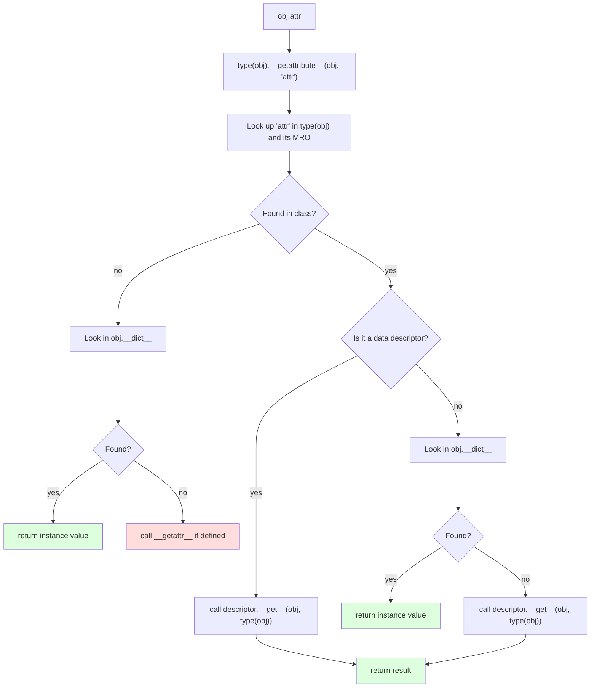
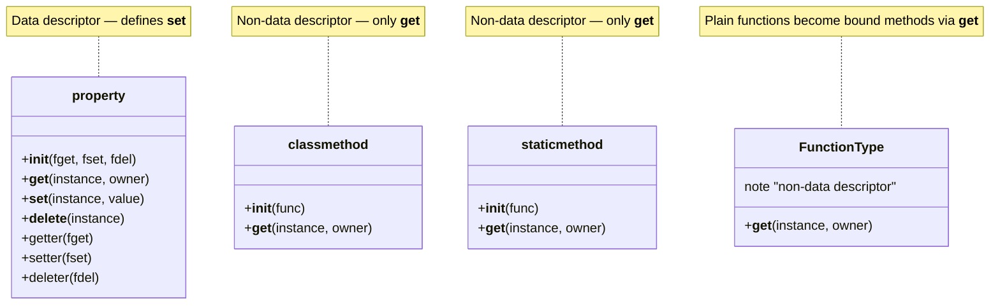
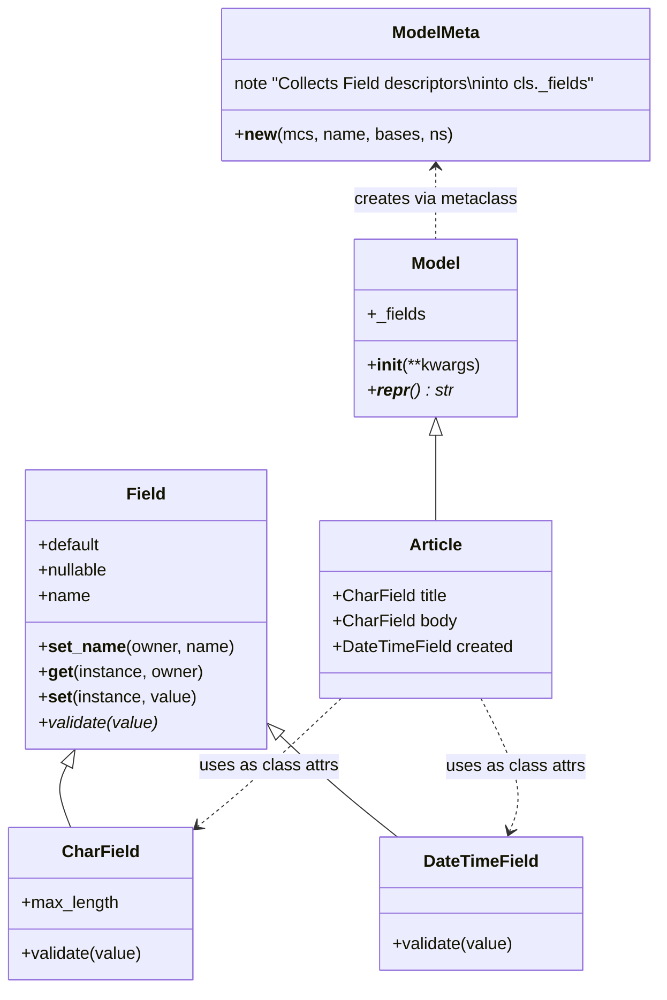
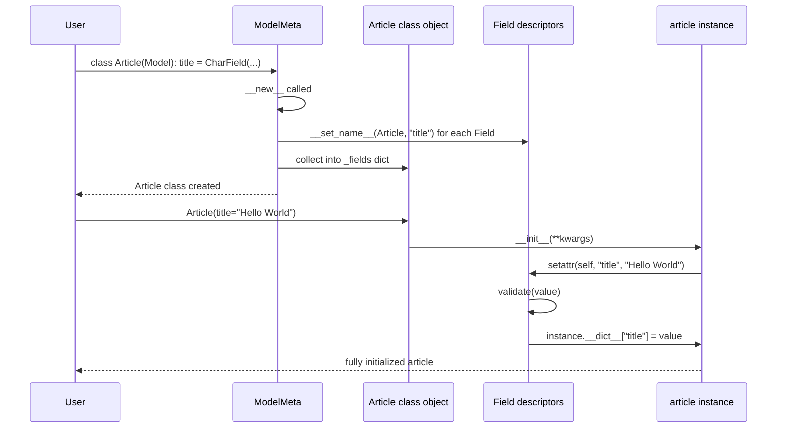
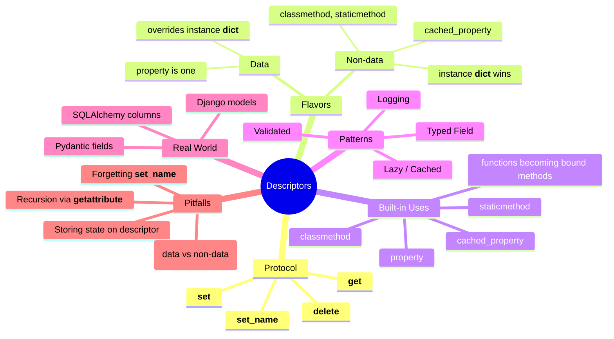

# Descriptors — Customizing Attribute Access

#python #descriptors #properties #metaprogramming #orm #teaching #deep-dive

> [!quote] Raymond Hettinger
> "Learn about descriptors and you understand Python."

A **descriptor** is any object that defines `__get__`, `__set__`, and/or `__delete__`. When such an object is placed as a *class attribute* on another class, Python routes attribute access through the descriptor instead of looking it up directly. Descriptors are the mechanism behind `property`, `classmethod`, `staticmethod`, ORM fields (Django, SQLAlchemy), and many other elegant APIs.

Once you "get" descriptors, you start seeing Python's attribute model as a small, uniform protocol rather than a pile of special cases. This note covers the protocol, the lookup algorithm, four reusable descriptor patterns, and a mini-ORM that ties it all together.

Prerequisites: [[Magic-Methods]] (especially attribute-access dunders), [[Attributes-And-Properties]], [[Metaclasses]].

---

## 1. What Is a Descriptor?

A descriptor is an object that **customizes what happens when it's accessed as an attribute of a class**. It does so by implementing one or more of:

| Method | Signature | Called by |
|---|---|---|
| `__get__` | `__get__(self, instance, owner)` | `instance.attr` or `Class.attr` |
| `__set__` | `__set__(self, instance, value)` | `instance.attr = value` |
| `__delete__` | `__delete__(self, instance)` | `del instance.attr` |
| `__set_name__` | `__set_name__(self, owner, name)` | Automatically, after class creation |

There are two flavors:

| Flavor | Implements | Overrides instance `__dict__`? |
|---|---|---|
| **Data descriptor** | `__get__` **and** (`__set__` or `__delete__`) | Yes — takes precedence |
| **Non-data descriptor** | Only `__get__` | No — instance `__dict__` wins |

This distinction matters: it's the difference between `property` (data descriptor) and `classmethod`/`staticmethod` (non-data descriptors).

### 1.1 A Minimal Example

```python
class RevealAccess:
    """A data descriptor that logs get/set and stores the value."""
    def __init__(self, initval=None, name="var"):
        self.val = initval
        self.name = name
    def __get__(self, instance, owner):
        print(f"  Retrieving {self.name} = {self.val!r}")
        return self.val
    def __set__(self, instance, value):
        print(f"  Updating {self.name} to {value!r}")
        self.val = value

class MyClass:
    x = RevealAccess(10, "x")

m = MyClass()
print(m.x)        # "Retrieving x = 10" → 10
m.x = 20          # "Updating x to 20"
print(m.x)        # "Retrieving x = 20" → 20
```

Notice: the descriptor *is* `m.x`, not `m`. Every access goes through `__get__`/`__set__`. The `MyClass` instance `m` never stores `x` itself — the value lives inside the descriptor object.

> [!tip] Teaching Tip
> Have students run `print(MyClass.__dict__["x"])`. They'll see it's the `RevealAccess` instance, not `10`. That single line reveals the entire mechanism: class attributes that *are* descriptors get intercepted.

---

## 2. The Lookup Algorithm

When you access `obj.attr`, Python runs a precise sequence. Understanding it is the key to writing descriptors that behave the way you expect.



### 2.1 The Key Insight

**Data descriptors win over the instance `__dict__`. Non-data descriptors lose to it.** That's why:

- `property` (data descriptor) lets you write `self.x = 5` and have it call the setter — even though the value would otherwise land in `self.__dict__["x"]`.
- `classmethod` (non-data descriptor) can be shadowed: `obj.method = lambda: ...` puts a function in `__dict__` and shadows the classmethod. (You rarely want this, but it explains the behavior.)

### 2.2 Setting an Attribute

`obj.attr = value` runs `type(obj).__setattr__(obj, "attr", value)`. The default `__setattr__`:

1. If `attr` is a data descriptor on the class → call `descriptor.__set__(obj, value)`.
2. Otherwise → put `value` in `obj.__dict__["attr"]`.

This is why a `property` with only a getter (no setter) raises `AttributeError: can't set attribute` — `__set__` is missing, so it's a non-data descriptor, but `property` overrides `__set__` to raise.

---

## 3. `property`, `classmethod`, `staticmethod` Are Descriptors



### 3.1 Reimplementing `property`

```python
class Property:
    """A simplified version of the built-in `property`."""
    def __init__(self, fget=None, fset=None, fdel=None, doc=None):
        self.fget, self.fset, self.fdel, self.__doc__ = fget, fset, fdel, doc

    def __get__(self, instance, owner):
        if instance is None:
            return self
        if self.fget is None:
            raise AttributeError("unreadable attribute")
        return self.fget(instance)

    def __set__(self, instance, value):
        if self.fset is None:
            raise AttributeError("can't set attribute")
        self.fset(instance, value)

    def __delete__(self, instance):
        if self.fdel is None:
            raise AttributeError("can't delete attribute")
        self.fdel(instance)

    def setter(self, fset):
        return type(self)(self.fget, fset, self.fdel, self.__doc__)

    def deleter(self, fdel):
        return type(self)(self.fget, self.fset, fdel, self.__doc__)

    def getter(self, fget):
        return type(self)(fget, self.fset, self.fdel, self.__doc__)
```

### 3.2 Reimplementing `classmethod` and `staticmethod`

```python
class ClassMethod:
    def __init__(self, func):
        self.func = func
    def __get__(self, instance, owner):
        # Return a bound callable that prepends the class
        return lambda *a, **kw: self.func(owner, *a, **kw)

class StaticMethod:
    def __init__(self, func):
        self.func = func
    def __get__(self, instance, owner):
        # Return the function unchanged — no binding
        return self.func
```

### 3.3 How Plain Functions Become Bound Methods

A `def` inside a class body produces a regular function object. Functions implement `__get__` (they're non-data descriptors). `func.__get__(instance, owner)` returns a `method` that has `instance` pre-bound as `self`. That's the entire "bound method" mechanism — there's no special syntax; it's just descriptors.

> [!warning] Common Student Misconception
> Students often ask "why does `self` get passed automatically?" The answer: it doesn't. The function descriptor's `__get__` returns a `method` wrapper that, when called, prepends the instance. If you access `MyClass.method` (class, not instance), you get the plain function — no `self` prepended. Try it: `MyClass.method(MyClass())` works fine.

---

## 4. `__set_name__` — Knowing Your Own Name

Python 3.6 added `__set_name__(self, owner, name)`, called automatically after the class is created. The descriptor learns **what attribute name it's bound to** — incredibly useful for storing the per-instance value under a predictable key.

```python
class Field:
    def __set_name__(self, owner, name):
        self.name = name
        self.storage = f"_{name}"          # private storage key

    def __get__(self, instance, owner):
        if instance is None: return self
        return getattr(instance, self.storage, None)

    def __set__(self, instance, value):
        setattr(instance, self.storage, value)

class User:
    name = Field()
    email = Field()

u = User()
u.name = "Alice"
print(u.__dict__)   # {'_name': 'Alice'} — descriptor stored value under _name
print(u.name)       # Alice
```

Before 3.6 you had to require the user to pass the name explicitly (`name = Field("name")`) or scan the class dict during `__init_subclass__`/metaclass. `__set_name__` is a vast simplification.

### 4.1 The Dispatch Order for `__set_name__`

`__set_name__` is called by `type.__new__` *after* the class object exists but *before* `type.__init__` runs. Specifically, Python iterates over the namespace and calls `__set_name__` on every value that has it. This means:

- `__set_name__` runs exactly once per descriptor per class definition.
- It runs at class creation time, not instance creation time.
- It does **not** re-run when a descriptor is inherited (only when defined in the subclass's own namespace).
- `owner` is the class being created; `name` is the attribute name the descriptor was assigned to.

### 4.2 A Common Use: Automatic Storage Naming

The most common idiom is what we showed above — derive a private storage name (`_name`) from the public name (`name`). This avoids collisions with the descriptor itself (which lives under the public name on the class) and keeps the instance's stored value hidden.

A more sophisticated variant uses a per-instance dict:

```python
class Field:
    def __set_name__(self, owner, name):
        self.name = name
    def __get__(self, inst, owner):
        if inst is None: return self
        return inst.__dict__.get(self.name)
    def __set__(self, inst, value):
        inst.__dict__[self.name] = value
```

Storing under the *public* name (`inst.__dict__[self.name]`) is fine because the descriptor lives on the class, not the instance — the instance dict is the natural per-instance storage.

> [!warning] Common Student Misconception
> "If I store under `inst.__dict__[self.name]`, won't the descriptor see itself?" No. The descriptor lives on the *class*, accessed via `type(inst).__dict__[self.name]`. The instance dict is a separate namespace. Python's lookup algorithm checks the class first (for data descriptors), then the instance dict, then non-data descriptors on the class.

---

## 5. Pattern 1: Validated Descriptor

```python
class Validated:
    """A descriptor that validates values on set."""
    def __init__(self, *, type_=object, min_=None, max_=None):
        self.type_ = type_
        self.min_ = min_
        self.max_ = max_
        self.name = None

    def __set_name__(self, owner, name):
        self.name = name

    def __get__(self, instance, owner):
        if instance is None: return self
        return instance.__dict__.get(self.name)

    def __set__(self, instance, value):
        if not isinstance(value, self.type_):
            raise TypeError(f"{self.name} must be {self.type_.__name__}, got {type(value).__name__}")
        if self.min_ is not None and value < self.min_:
            raise ValueError(f"{self.name} must be >= {self.min_}")
        if self.max_ is not None and value > self.max_:
            raise ValueError(f"{self.name} must be <= {self.max_}")
        instance.__dict__[self.name] = value

class Product:
    name  = Validated(type_=str)
    price = Validated(type_=(int, float), min_=0, max_=10_000)
    qty   = Validated(type_=int, min_=0, max_=1_000_000)

p = Product()
p.name  = "Widget"
p.price = 9.99
# p.price = -5         # ValueError
# p.qty   = "lots"     # TypeError
```

### 5.1 Composing Validators

A powerful pattern: build small validators and *compose* them:

```python
class Validator:
    def __init__(self, *checks):
        self.checks = checks
        self.name = None
    def __set_name__(self, owner, name):
        self.name = name
        for check in self.checks:
            if hasattr(check, "set_name"):
                check.set_name(name)
    def __get__(self, inst, owner):
        if inst is None: return self
        return inst.__dict__.get(self.name)
    def __set__(self, inst, value):
        for check in self.checks:
            check(value, self.name)
        inst.__dict__[self.name] = value

class IsType:
    def __init__(self, type_): self.type_ = type_
    def set_name(self, name): self.name = name
    def __call__(self, value, name):
        if not isinstance(value, self.type_):
            raise TypeError(f"{name} must be {self.type_.__name__}")

class InRange:
    def __init__(self, low=None, high=None): self.low, self.high = low, high
    def __call__(self, value, name):
        if self.low is not None and value < self.low:
            raise ValueError(f"{name} too small (< {self.low})")
        if self.high is not None and value > self.high:
            raise ValueError(f"{name} too large (> {self.high})")

class Account:
    balance = Validator(IsType((int, float)), InRange(0, 10**9))
    name    = Validator(IsType(str))

a = Account()
a.balance = 100        # OK
a.name = "Alice"       # OK
# a.balance = -5        # ValueError
# a.name = 42           # TypeError
```

This composable validator pattern is what `attrs` and `pydantic` use internally. Each `Validator` instance carries a list of `check` callables; setting a value runs them in order.

> [!tip] Teaching Tip
> Have students build a `Positive` descriptor and use it on a `BankAccount.balance` field. The moment they realize they can decorate *any* future class with the same descriptor and get validation for free, they'll understand why descriptors are the foundation of Python's most elegant APIs.

---

## 6. Pattern 2: Cached / Lazy Descriptor

```python
class Lazy:
    """Computes the value once, then caches it on the instance."""
    def __init__(self, func):
        self.func = func
        self.name = func.__name__
        self.__doc__ = func.__doc__

    def __set_name__(self, owner, name):
        self.name = name           # in case it's accessed under a different name

    def __get__(self, instance, owner):
        if instance is None:
            return self
        value = self.func(instance)
        # Cache in instance __dict__ under the same name —
        # this *shadows* the non-data descriptor on subsequent lookups!
        instance.__dict__[self.name] = value
        return value

class DataFrame:
    def __init__(self, raw): self.raw = raw

    @Lazy
    def stats(self):
        print("  computing stats...")
        return {"mean": sum(self.raw) / len(self.raw),
                "max":  max(self.raw)}

df = DataFrame([1, 2, 3, 4, 5])
print(df.stats)   # "computing stats..." → {'mean': 3.0, 'max': 5}
print(df.stats)   # (cached, no print) → {'mean': 3.0, 'max': 5}
```

The clever bit: because `Lazy` is a **non-data descriptor** (only `__get__`), the cached value in `instance.__dict__` shadows it on subsequent lookups. The descriptor runs once, then steps aside. This is exactly how `functools.cached_property` works.

---

## 7. Pattern 3: Logging / Tracing Descriptor

```python
class Logged:
    def __init__(self, name):
        self.name = name
    def __get__(self, instance, owner):
        print(f"[LOG] get {self.name} on {instance!r}")
        return instance.__dict__.get(self.name)
    def __set__(self, instance, value):
        print(f"[LOG] set {self.name} = {value!r} on {instance!r}")
        instance.__dict__[self.name] = value
    def __delete__(self, instance):
        print(f"[LOG] del {self.name} on {instance!r}")
        del instance.__dict__[self.name]
```

Great for debugging attribute-heavy code without sprinkling prints everywhere.

---

## 8. Pattern 4: Typed Descriptor (Django-style Field)

```python
class TypedField:
    """Like a Django model field — declares type and stores the value."""
    def __init__(self, type_, *, default=None, nullable=False):
        self.type_ = type_
        self.default = default
        self.nullable = nullable
        self.name = None

    def __set_name__(self, owner, name):
        self.name = name

    def __get__(self, instance, owner):
        if instance is None:
            return self               # so `Model.field` returns the descriptor itself
        return instance.__dict__.get(self.name, self.default)

    def __set__(self, instance, value):
        if value is None:
            if not self.nullable:
                raise ValueError(f"{self.name} cannot be None")
        elif not isinstance(value, self.type_):
            raise TypeError(f"{self.name} must be {self.type_.__name__}, got {type(value).__name__}")
        instance.__dict__[self.name] = value
```

---

## 9. Mini-ORM: Putting It All Together

A toy ORM that:

- Uses descriptors as field definitions.
- Uses a metaclass to collect fields into a schema.
- Validates on assignment.

```python
import datetime

class Field:
    """Base descriptor for model fields."""
    def __init__(self, *, default=None, nullable=False):
        self.default = default
        self.nullable = nullable
        self.name = None
    def __set_name__(self, owner, name):
        self.name = name
    def __get__(self, instance, owner):
        if instance is None: return self
        return instance.__dict__.get(self.name, self.default)
    def __set__(self, instance, value):
        self.validate(value)
        instance.__dict__[self.name] = value
    def validate(self, value):
        if value is None and not self.nullable:
            raise ValueError(f"{self.name} cannot be None")

class CharField(Field):
    def __init__(self, *, max_length=255, **kw):
        super().__init__(**kw)
        self.max_length = max_length
    def validate(self, value):
        super().validate(value)
        if value is not None:
            if not isinstance(value, str):
                raise TypeError(f"{self.name} must be str")
            if len(value) > self.max_length:
                raise ValueError(f"{self.name} too long (>{self.max_length})")

class DateTimeField(Field):
    def validate(self, value):
        super().validate(value)
        if value is not None and not isinstance(value, datetime.datetime):
            raise TypeError(f"{self.name} must be datetime")

class ModelMeta(type):
    """Collects Field descriptors into cls._fields."""
    def __new__(mcs, name, bases, ns):
        cls = super().__new__(mcs, name, bases, ns)
        fields = {}
        # Inherit fields from bases
        for base in bases:
            if hasattr(base, "_fields"):
                fields.update(base._fields)
        # Add new fields from this class
        for key, val in ns.items():
            if isinstance(val, Field):
                fields[key] = val
        cls._fields = fields
        return cls

class Model(metaclass=ModelMeta):
    def __init__(self, **kwargs):
        for fname, field in self._fields.items():
            setattr(self, fname, kwargs.get(fname, field.default))
    def __repr__(self):
        attrs = ", ".join(f"{f}={getattr(self, f)!r}" for f in self._fields)
        return f"{type(self).__name__}({attrs})"

class Article(Model):
    title    = CharField(max_length=200)
    body     = CharField(max_length=10_000, nullable=True)
    created  = DateTimeField(default=datetime.datetime.now)

a = Article(title="Hello World", body="My first post")
print(a)                      # Article(title='Hello World', body='My first post', created=datetime.datetime(2025, ...))
print(Article._fields)        # {'title': <CharField ...>, 'body': ..., 'created': ...}
# Article(title=42)           # TypeError: title must be str
```





This is essentially how Django, SQLAlchemy (declarative), and Peewee work under the hood. The metaclass collects descriptors; the descriptors validate and store; the model class is just a thin shell.

---

## 10. Real-World Uses

| Library | What Descriptors Do |
|---|---|
| **Django ORM** | `models.CharField`, `models.IntegerField`, etc. — declare columns, validate, lazy-load from DB |
| **SQLAlchemy** | `Column(Integer)`, `Column(String)` — declarative table definitions |
| **Pydantic** | `Field(...)` validators on data models |
| **Attrs / Dataclasses** | Internal use for default factories and converters |
| **`functools.cached_property`** | Lazy non-data descriptor that shadows itself after first call |
| **`property`** | The simplest descriptor — a getter/setter pair |

### 10.1 How `cached_property` Works Internally

`functools.cached_property` is a textbook non-data descriptor:

```python
# Simplified from CPython source
class cached_property:
    def __init__(self, func):
        self.func = func
        self.attrname = func.__name__
        self.__doc__ = func.__doc__

    def __get__(self, instance, owner=None):
        if instance is None:
            return self
        value = self.func(instance)
        instance.__dict__[self.attrname] = value    # SHADOWS the descriptor
        return value
```

The genius is the shadowing: by storing the result in `instance.__dict__[attrname]`, the *non-data* descriptor gets shadowed on subsequent accesses. Python's lookup algorithm finds the instance dict entry first and skips `__get__` entirely. So the first access computes; every subsequent access is a plain dict lookup — no function call at all.

This only works because `cached_property` is a **non-data** descriptor (no `__set__`). If it had `__set__`, it would be a data descriptor and the instance dict entry would never shadow it.

### 10.2 Why `property` Triggers Computation Every Time

By contrast, `property` is a **data descriptor** — it always has `__set__` (which raises `AttributeError` if no setter is defined). So even if you stash a value in `instance.__dict__`, the descriptor's `__get__` runs on *every* access. That's why `property`-based getters re-run their logic each time, while `cached_property` runs once.

This is the deepest reason the two feel different: it's not a deliberate design distinction, it's a direct consequence of data vs non-data descriptor lookup rules.

### 10.3 Django's `ForeignKey` Descriptor

When you write:

```python
class Article(models.Model):
    author = models.ForeignKey(User, on_delete=models.CASCADE)
```

`Article.author` is a descriptor. Accessing `article.author` triggers a DB query (lazy) and caches the result on the instance. Reassignment (`article.author = new_user`) goes through the descriptor's `__set__`, which validates the type and updates the FK column. This is *exactly* the descriptor pattern — just at industrial scale.

---

## 11. Pitfalls and Gotchas

### 11.1 Storing State on the Descriptor

```python
class Bad:
    def __init__(self): self.value = None
    def __get__(self, inst, owner): return self.value
    def __set__(self, inst, v): self.value = v

class C: x = Bad()

c1, c2 = C(), C()
c1.x = 1
print(c2.x)   # 1 — SHARED across instances! Bug!
```

The descriptor lives **on the class**, so any state stored on it is shared by every instance. Always store per-instance values in `instance.__dict__` (keyed by `self.name`).

### 11.2 Pickling and Copy Issues

Descriptors are class attributes, so they're typically not pickled. But if your descriptor holds lambdas or closures, pickling the *class* can fail. Be careful with `__getstate__`/`__setstate__` on classes that use rich descriptors.

### 11.3 `__get__` Returning `self` on Class Access

When `instance is None`, you're being accessed via the class (`Article.title`). Convention: return the descriptor itself (or a "field info" object). This lets users do introspection (`Article._fields["title"].max_length`).

> [!warning] Common Student Misconception: "Why do I need `__set_name__`?"
> Without `__set_name__`, the descriptor doesn't know what name it's been assigned. You'd need the user to write `title = CharField("title", max_length=200)` — repeating the name. `__set_name__` is a small ergonomic improvement that removes a whole class of typos (field name mismatch).

---

## 12. Best Practices

1. **Store per-instance values in `instance.__dict__`**, keyed by `self.name`.
2. **Implement `__set_name__`** to learn your name automatically.
3. **Make `__get__` return `self` (or a field-info object) when `instance is None`** — for class-level introspection.
4. **Choose data vs non-data deliberately.** Want assignment to override you? Non-data. Want to control assignment? Data.
5. **Compose with `__init_subclass__` or a metaclass** if you need a registry of descriptors across a class hierarchy.
6. **Avoid heavy computation in `__get__`** unless you're caching — descriptors run on *every* access.
7. **Document whether your descriptor is reentrant** — some validation descriptors call back into the instance, which can recurse.
8. **Prefer `functools.cached_property`** over rolling your own lazy descriptor for the common case.



> [!success] Final Teaching Tip
> Have students build a `Positive` descriptor and use it on a `BankAccount.balance` field. The moment they realize they can decorate *any* future class with the same descriptor and get validation for free, they'll understand why descriptors are the foundation of Python's most elegant APIs.

---

## See Also

- [[Magic-Methods]] — `__getattribute__`, `__setattr__`, `__getattr__` are the *engine* descriptors plug into.
- [[Metaclasses]] — metaclasses commonly *collect* descriptors at class-creation time.
- [[Attributes-And-Properties]] — `property` is the simplest descriptor.
- [[Encapsulation]] — descriptors are how you enforce invariants at the attribute level.
- [[Dataclasses]] — use descriptors internally for default factories.

## Appendix A: The Descriptor Lookup Algorithm — In Detail

Let's trace through a complete example to cement the lookup algorithm. Consider:

```python
class Field:
    def __get__(self, inst, owner):
        print(f"  Field.__get__(inst={inst!r}, owner={owner.__name__})")
        return inst._data.get("x") if inst else self
    def __set__(self, inst, value):
        print(f"  Field.__set__(inst={inst!r}, value={value!r})")
        inst._data["x"] = value

class Simple:
    x = Field()
    def __init__(self):
        self._data = {}

s = Simple()
```

Now let's trace `s.x = 5`:

1. Python calls `type(s).__setattr__(s, "x", 5)`.
2. Default `__setattr__` looks up `"x"` in `type(s)` (Simple) and its MRO.
3. It finds `Field` instance — a *data descriptor* (has both `__get__` and `__set__`).
4. Calls `Field.__set__(s, 5)`, which stores `5` in `s._data["x"]`.

Now `print(s.x)`:

1. Python calls `type(s).__getattribute__(s, "x")`.
2. Looks up `"x"` in `type(s)` — finds `Field` (data descriptor).
3. Calls `Field.__get__(s, Simple)`, which returns `s._data["x"]` (= 5).

If we tried to shadow it: `s.__dict__["x"] = 99`:

1. `s.__dict__["x"]` is now `99`.
2. But on next `s.x` access, the data descriptor *still wins* — Python sees `Field` is a data descriptor and calls `__get__` before checking `s.__dict__`.

Now compare with a *non-data* descriptor:

```python
class Getter:
    def __get__(self, inst, owner):
        return 42

class Thing:
    x = Getter()

t = Thing()
print(t.x)          # 42
t.x = 99            # stores in t.__dict__["x"] = 99
print(t.x)          # 99 — instance __dict__ shadows the non-data descriptor!
del t.__dict__["x"]
print(t.x)          # 42 — back to descriptor
```

This asymmetry is the heart of the descriptor protocol. Memorize it.

## Appendix B: Variance and `__set_name__` Chains

When a class inherits from a parent that has descriptors, `__set_name__` is called *only* for descriptors defined in the subclass's own namespace. Inherited descriptors keep the name they were originally bound to. This is almost always what you want — but it can surprise students who expect overriding the descriptor in a subclass to re-trigger `__set_name__`:

```python
class Field:
    def __set_name__(self, owner, name):
        print(f"  set_name: {owner.__name__}.{name}")
        self.name = name
    def __get__(self, inst, owner): return inst._data.get(self.name)
    def __set__(self, inst, v): inst._data[self.name] = v

class Base:
    x = Field()
    def __init__(self): self._data = {}

class Derived(Base):
    pass    # x is inherited; __set_name__ NOT called again

d = Derived()
d.x = 1     # works — uses the stored name "x"
```

## Appendix C: A Descriptor-Based Memoizer

A common pattern in machine-learning and data-processing code: cache the result of an expensive computation on the instance, lazily. We already showed `Lazy`; here's a more sophisticated version with explicit invalidation:

```python
class Cached:
    """Lazy descriptor with explicit invalidation."""
    def __init__(self, func):
        self.func = func
        self.name = f"_cached_{func.__name__}"

    def __get__(self, inst, owner):
        if inst is None: return self
        if self.name not in inst.__dict__:
            inst.__dict__[self.name] = self.func(inst)
        return inst.__dict__[self.name]

    def invalidate(self, inst):
        """Call to force re-computation on next access."""
        inst.__dict__.pop(self.name, None)

class DataFrame:
    def __init__(self, rows):
        self.rows = rows

    @Cached
    def mean(self):
        print("  computing mean...")
        return sum(self.rows) / len(self.rows)

df = DataFrame([1, 2, 3, 4, 5])
print(df.mean)   # computing mean... → 3.0
print(df.mean)   # 3.0 (cached)
df.rows.append(100)
df.mean.invalidate(df)    # explicit invalidation
print(df.mean)   # computing mean... → 19.0
```

## Appendix D: A Read-Only Descriptor

```python
class ReadOnly:
    """A descriptor that can be set once (at init) but never overwritten."""
    def __set_name__(self, owner, name):
        self.name = name
        self.storage = f"_readonly_{name}"
    def __get__(self, inst, owner):
        if inst is None: return self
        return getattr(inst, self.storage, None)
    def __set__(self, inst, value):
        if hasattr(inst, self.storage):
            raise AttributeError(f"{self.name} is read-only")
        setattr(inst, self.storage, value)

class Config:
    api_key = ReadOnly()
    def __init__(self, key):
        self.api_key = key

c = Config("abc123")
# c.api_key = "xyz"    # AttributeError: api_key is read-only
```

This is a tiny example of how descriptors let you build entire new attribute *semantics* — set-once, read-only, validated, typed, lazy — without inheriting from anything special.

## Appendix E: Common Pitfalls — Expanded

| Pitfall | What happens | Why | Fix |
|---|---|---|---|
| Storing state on the descriptor | Values shared across all instances | Descriptor lives on the class | Store in `instance.__dict__[self.name]` |
| Forgetting `__set_name__` | Descriptor doesn't know its name | Have to pass name manually | Use `__set_name__` (3.6+) |
| Wrong flavor (data vs non-data) | Instance dict shadows or doesn't shadow unexpectedly | Confusion about lookup order | Decide based on whether assignment should be intercepted |
| Returning `self` from `__get__` with `inst is None` breaks subclasses | Inheritance breaks | `Article.title` returns the wrong descriptor | Return `self` so introspection works |
| Recursion through `__getattribute__` | Stack overflow | Trying to override attribute access naively | Use `super().__getattribute__` or store via `object.__setattr__` |
| Pickling fails | Can't pickle the class | Descriptors with closures/lambdas | Use module-level functions for `default_factory` |
| Slot conflict | TypeError on class creation | Descriptor name appears in both `__slots__` and as a descriptor | Pick one or the other; descriptors don't need slots |

## Appendix F: A Comparison Matrix — Descriptors vs Alternatives

| Need | Best tool |
|---|---|
| Simple getter/setter with validation | `property` (a built-in descriptor) |
| Reusable validation across many fields | Custom data descriptor |
| Lazy computed attribute | `functools.cached_property` or `Lazy` descriptor |
| Field declaration for ORM-like schema | Custom descriptor + metaclass |
| Default-value injection | Custom descriptor with `__set_name__` |
| Type enforcement at runtime | Custom `Typed` descriptor (or use Pydantic) |
| Cross-cutting "log every access" | Custom logging descriptor |
| Class-level memoization | `classmethod` + cache, or descriptor on the class |

> [!success] Final Teaching Tip
> Have students build a `Positive` descriptor and use it on a `BankAccount.balance` field. The moment they realize they can decorate *any* future class with the same descriptor and get validation for free, they'll understand why descriptors are the foundation of Python's most elegant APIs.

## References

- Python "Descriptor HowTo Guide" — official docs
- Python Language Reference §3.3.2 — "Customizing attribute access"
- Raymond Hettinger, "Python's Descriptor Protocol" (PyCon talk)
- "Fluent Python" (Ramalho), Chapter 23 — "Attribute Access"
- PEP 487 — `__set_name__` (Python 3.6)
