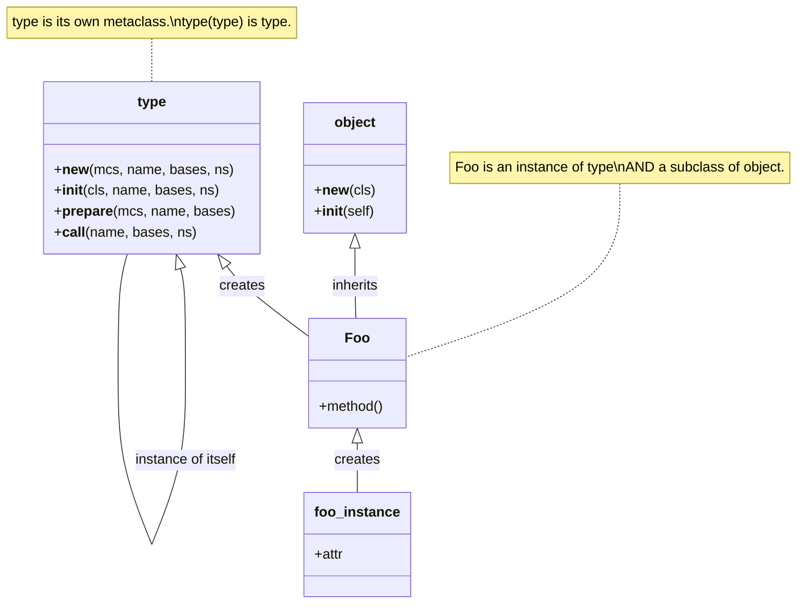
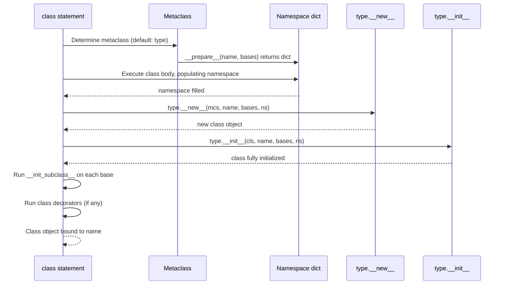
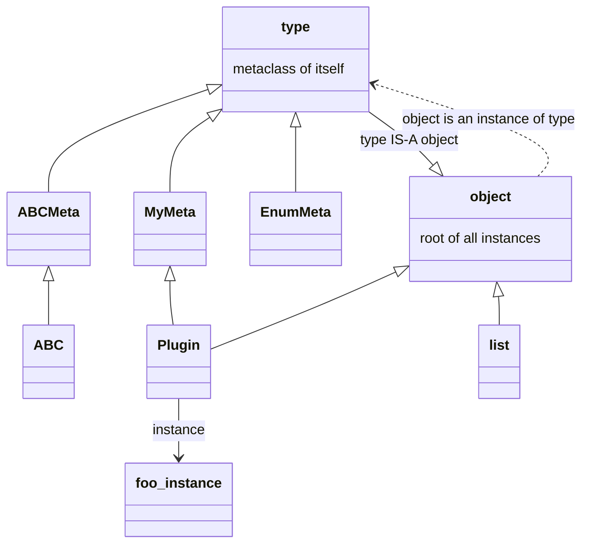
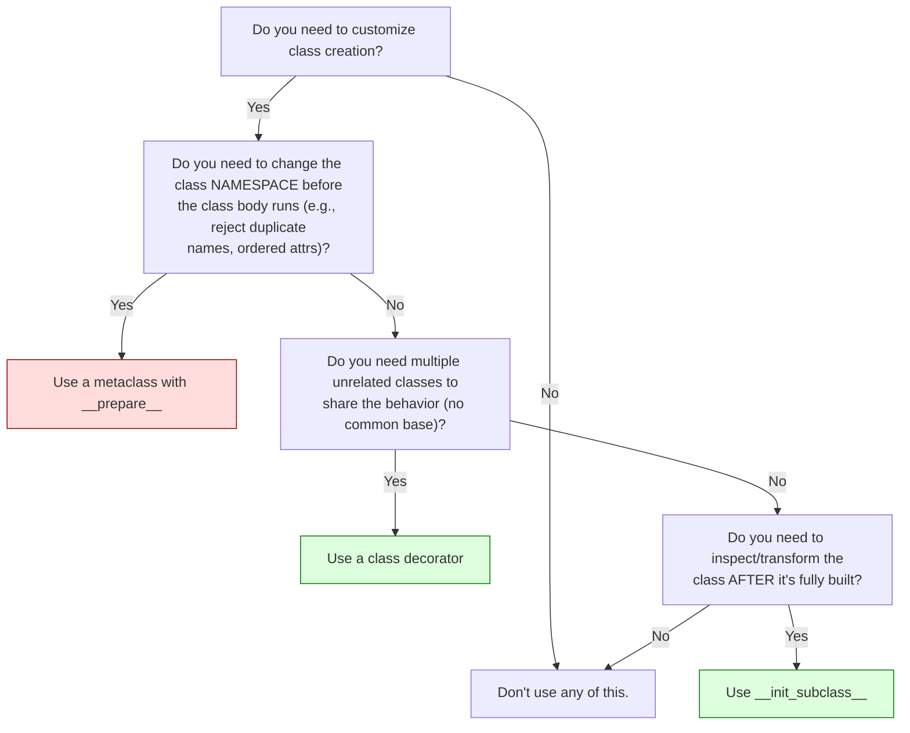
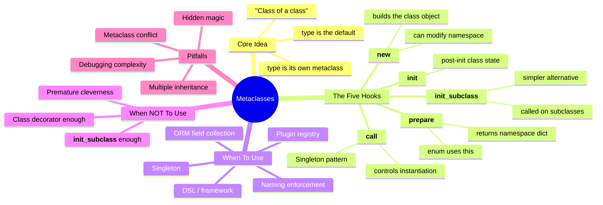

# Metaclasses — Classes That Create Classes

#python #metaclasses #metaprogramming #type #init-subclass #teaching #deep-dive

> [!quote] Tim Peters
> "Metaclasses are deeper magic than 99% of users should ever worry about. If you wonder whether you need them, you don't (the people who actually need them know with certainty that they need them, and don't need an explanation about why)."

A **metaclass** is "the class of a class". Just as an ordinary class is a blueprint for instances, a metaclass is a blueprint for classes themselves. In Python, `type` is the default metaclass — every class you've ever written is an instance of `type`. You can subclass `type` to customize how classes are constructed: enforce naming conventions, auto-register plugins, inject methods, or build DSLs.

But metaclasses are also **the most overused feature in Python**. Most problems people reach for metaclasses to solve are better solved with class decorators or `__init_subclass__`. This note covers both: how metaclasses actually work, *and* when you should reach for something simpler.

Prerequisites: [[Magic-Methods]], [[Classes-And-Objects]], [[Self-And-Cls]].

---

## 1. The Big Picture

```python
class Foo:                 # Foo is an instance of type
    pass

print(type(Foo))           # <class 'type'>
print(type(Foo()))         # <class '__main__.Foo'>
```

Every class is an instance of its metaclass. The default metaclass is `type`. `type` is *itself* a class, and — famously — `type(type) is type`. (Hold that thought; we'll come back to it.)



### 1.1 Three Roles of `type`

| Form | What it does |
|---|---|
| `type(obj)` | Returns the class of `obj` (one-argument form) |
| `type(name, bases, namespace)` | Dynamically **creates a class** (three-argument form) |
| `class Foo(metaclass=type): ...` | Names `type` as the metaclass for `Foo` |

The three-argument form is the dynamic equivalent of a `class` statement:

```python
# These two are equivalent:
class Dog:
    species = "Canis familiaris"
    def bark(self): return "Woof!"

Dog2 = type("Dog2", (), {"species": "Canis familiaris",
                          "bark": lambda self: "Woof!"})
```

---

## 2. The Class Creation Process

When Python encounters a `class` statement, it does **not** simply allocate an object. It runs a well-defined sequence:



### 2.1 The Five Hooks

| Hook | Called When | Typical Use |
|---|---|---|
| `__prepare__(mcs, name, bases, **kw)` | Before class body executes | Return a custom namespace (e.g., `OrderedDict`, or a custom dict that tracks insertion order / rejects duplicate names) |
| `__new__(mcs, name, bases, namespace, **kw)` | Creates the class object | Modify namespace, inject methods, enforce invariants, return a different class |
| `__init__(cls, name, bases, namespace, **kw)` | After `__new__` returns | Initialize class-level state (rarely overridden) |
| `__call__(mcs, name, bases, namespace, **kw)` | When `MyMeta(...)` is invoked | Controls whether/how `__new__`/`__init__` run (very rarely overridden) |
| `__init_subclass__(cls, **kw)` | Defined on a base class, called on each *subclass* | Modern, simpler alternative — see §6 |

### 2.2 Watching It Happen

```python
class TracingMeta(type):
    @classmethod
    def __prepare__(mcs, name, bases, **kw):
        print(f"  __prepare__({name})")
        return {}                            # could be OrderedDict or custom dict
    def __new__(mcs, name, bases, ns, **kw):
        print(f"  __new__({name}, bases={bases}, ns_keys={list(ns)})")
        return super().__new__(mcs, name, bases, ns)
    def __init__(cls, name, bases, ns, **kw):
        print(f"  __init__({name})")
        super().__init__(name, bases, ns)

class Foo(metaclass=TracingMeta):
    x = 1
    def hello(self): return "hi"
```

Output:

```
  __prepare__(Foo)
  __new__(Foo, bases=(), ns_keys=['__module__', '__qualname__', 'x', 'hello'])
  __init__(Foo)
```

> [!tip] Teaching Tip
> Have students add `print` statements to a metaclass before reading any theory. The printout *is* the theory — the order of `__prepare__` → body execution → `__new__` → `__init__` becomes obvious.

---

## 3. The Metaclass Hierarchy

Python's object model is a single rooted graph, with `type` and `object` at the top:



Two facts to memorize:

1. **`type` is an instance of `object`** (i.e., `type` *is* an object — you can pass it around, attach attributes, subclass it).
2. **`object` is an instance of `type`** (i.e., `object` is itself a class — created by `type`).
3. **`type` is an instance of `type`** (the bootstrap — `type(type) is type`).

This circularity is what lets the language bootstrap itself. It's a small piece of magic, but everything else flows from it.

### 3.1 Comparison with Other Languages

| Language | Metaclass mechanism | Notes |
|---|---|---|
| **Python** | `type`, subclass it freely | Every class has a metaclass; user can plug their own |
| **Smalltalk** | Every class has a metaclass (one per class) | Metaclasses are themselves instances of a Metaclass class |
| **Ruby** | No metaclasses; "eigenclass" / singleton class | Each object has its own hidden class for singleton methods |
| **Java** | `java.lang.Class` reflection; no user metaclasses | Class objects are read-only descriptors |
| **CLOS** | MOP (Metaobject Protocol) — extremely powerful | Closer to Python's, but more elaborate |

Python sits between Smalltalk (everything-is-an-object, open MOP) and Java (closed reflection). The MOP is real but not advertised as such — it lives in the `type` metaclass.

---

## 4. Practical Example 1: Auto-Registering Subclasses

A classic use case: a base class collects all its subclasses in a registry, so a plugin loader or command dispatcher can find them by name.

```python
class PluginMeta(type):
    registry: dict = {}

    def __init__(cls, name, bases, ns, **kw):
        super().__init__(name, bases, ns)
        # Skip the base class itself
        if bases:
            PluginMeta.registry[name.lower()] = cls

class Plugin(metaclass=PluginMeta):
    """Base class for all plugins. Subclasses auto-register."""
    def run(self): raise NotImplementedError

class GreetPlugin(Plugin):
    def run(self): return "Hello!"

class ByePlugin(Plugin):
    def run(self): return "Bye!"

print(PluginMeta.registry)
# {'greetplugin': <class '...GreetPlugin'>, 'byeplugin': <class '...ByePlugin'>}

def run_named(name):
    return PluginMeta.registry[name.lower()]().run()

print(run_named("greetplugin"))    # Hello!
```

### 4.1 Extending the Plugin System

The same pattern can be enriched. Let's add:

- A `name` class attribute each plugin declares.
- A "category" for grouping.
- A `validate()` classmethod the metaclass calls to enforce a contract.

```python
class PluginMeta(type):
    registry: dict[str, type] = {}

    def __new__(mcs, name, bases, ns, **kw):
        cls = super().__new__(mcs, name, bases, ns)
        # Skip the base Plugin class itself
        if bases and any(isinstance(b, PluginMeta) for b in bases):
            if not hasattr(cls, "name") or not isinstance(cls.name, str):
                raise TypeError(f"{name} must declare a string 'name' attribute")
            PluginMeta.registry[cls.name] = cls
        return cls

class Plugin(metaclass=PluginMeta):
    name: str          # subclasses MUST set this
    category: str = "misc"

    def run(self, ctx: dict) -> dict:
        raise NotImplementedError

class GreetPlugin(Plugin):
    name = "greet"
    category = "social"
    def run(self, ctx):
        return {"message": f"Hello, {ctx.get('user', 'world')}!"}

# class BrokenPlugin(Plugin): pass
# → TypeError: BrokenPlugin must declare a string 'name' attribute

# Plugin loading by category
def load_plugins(category: str) -> list:
    return [cls() for cls in PluginMeta.registry.values()
            if getattr(cls, "category", "") == category]
```

This is closer to what real plugin systems look like — a metaclass that *enforces* a contract at class-creation time, so mistakes fail fast.

> [!warning] Common Student Misconception
> Students often try to put the registry *on the base class* as a class variable, then mutate it inside `__init_subclass__` or `__init__`. That works — but they forget the registry then becomes a **shared mutable class attribute** that subclasses inherit *and can see* as `Plugin.registry`. The metaclass attribute (`PluginMeta.registry`) sidesteps this confusion.

### 4.2 The Same Thing with `__init_subclass__` (Better!)

```python
class Plugin:
    _registry = {}
    def __init_subclass__(cls, **kw):
        super().__init_subclass__(**kw)
        Plugin._registry[cls.__name__.lower()] = cls

# Subclasses auto-register the same way. No metaclass needed.
```

This is the modern idiom. Use it unless you need something metaclasses uniquely provide.

### 4.3 Class Decorator Equivalent

```python
registry = {}

def register(cls):
    registry[cls.__name__.lower()] = cls
    return cls

@register
class GreetPlugin:
    def run(self): return "Hello!"
```

A class decorator is even simpler — and works when you can't (or don't want to) modify the base class. The downside: you must remember to add `@register` to every class. The metaclass / `__init_subclass__` approach is automatic; the decorator is explicit.

---

## 5. Practical Example 2: Enforcing Naming Conventions

```python
class ConventionMeta(type):
    """Class names must be PascalCase; public methods must be snake_case."""
    def __new__(mcs, name, bases, ns):
        import re
        if not re.fullmatch(r"[A-Z][A-Za-z0-9]*", name):
            raise TypeError(f"Class name {name!r} must be PascalCase")
        for key, val in ns.items():
            if callable(val) and not key.startswith("_"):
                if not re.fullmatch(r"[a-z_][a-z0-9_]*", key):
                    raise TypeError(f"Method {key!r} must be snake_case")
        return super().__new__(mcs, name, bases, ns)

class Good_Name(metaclass=ConventionMeta):
    def do_thing(self): pass          # OK
    # def BadThing(self): pass         # would raise TypeError
```

This is the kind of "compile-time-ish" check that Python normally doesn't do — useful for large teams that want to lock in style.

---

## 6. Practical Example 3: Singleton via Metaclass

```python
class SingletonMeta(type):
    _instances = {}
    def __call__(cls, *args, **kwargs):
        if cls not in cls._instances:
            cls._instances[cls] = super().__call__(*args, **kwargs)
        return cls._instances[cls]

class Database(metaclass=SingletonMeta):
    def __init__(self):
        print("Connecting to DB (only once)...")
        self.connected = True

a = Database()    # "Connecting..."
b = Database()    # (no output)
assert a is b
```

> [!warning] When Singleton Goes Wrong
> The metaclass-controlled singleton is **global mutable state**. It breaks test isolation (one test connects, another sees the connection), makes mocking harder, and hides dependencies. For most "I just need one instance" cases, prefer a module-level instance or a dependency-injected object. Reach for the singleton metaclass only when you genuinely need to enforce "at most one instance of this class" at the class level.

---

## 7. `__init_subclass__` — The Modern Alternative

Introduced in Python 3.6, `__init_subclass__` lets a base class hook into subclass creation **without** a metaclass. It runs after the subclass is created but before it's bound to its name.

```python
class Plugin:
    _registry = {}
    def __init_subclass__(cls, *, name=None, **kw):
        super().__init_subclass__(**kw)
        Plugin._registry[name or cls.__name__] = cls

class Greet(Plugin, name="hello"):
    def run(self): return "Hi"

print(Plugin._registry)   # {'hello': <class '...Greet'>}
```

Notice the keyword-only argument `name=` — `__init_subclass__` receives any class-level kwargs you pass in the `class` statement, so subclasses can carry configuration metadata.

### 7.1 How `__init_subclass__` Is Dispatched

When `class Derived(Base): ...` is processed, Python calls `Base.__init_subclass__(Derived)` *after* the class is constructed but *before* it's bound to its name. This means:

- `__init_subclass__` runs at *definition time*, not instantiation time.
- It runs *once per subclass* — not for the base class itself.
- It receives the **subclass** as `cls`, not the base.
- It receives any keyword arguments passed in the `class` statement.
- It must call `super().__init_subclass__(**kw)` to cooperate with other base classes in a diamond.

```python
class Base:
    def __init_subclass__(cls, **kw):
        print(f"  Base.__init_subclass__({cls.__name__}, {kw})")
        super().__init_subclass__(**kw)

class Mixin:
    def __init_subclass__(cls, **kw):
        print(f"  Mixin.__init_subclass__({cls.__name__}, {kw})")
        super().__init_subclass__(**kw)

class Derived(Base, Mixin, tag="example"):
    pass

# Output:
#   Base.__init_subclass__(Derived, {'tag': 'example'})
#   Mixin.__init_subclass__(Derived, {'tag': 'example'})
```

The MRO matters here — `super()` in `__init_subclass__` follows the same MRO as any method, ensuring every cooperating base sees the call.

### 7.2 Metaclass vs `__init_subclass__` vs Class Decorator



| Need | Use |
|---|---|
| Transform a class after creation (one-off, no inheritance hierarchy involved) | **Class decorator** |
| Hook into *every* subclass of a base class (registry, validation, defaults) | **`__init_subclass__`** |
| Customize namespace *before* body executes, or replace `__new__` for class itself | **Metaclass** |
| Share behavior across unrelated class hierarchies | **Class decorator** |
| You're writing an ABC framework, ORM, or plugin system with deep DSL needs | **Metaclass** (you're the 1%) |

---

## 8. `__prepare__` — Custom Namespace Dicts

`__prepare__` returns the dict-like object used as the namespace while the class body executes. The default is `{}` (a regular dict; insertion-ordered since Python 3.7). Customizing this lets you:

- Track insertion order explicitly (rare now that dicts are ordered).
- Reject duplicate names.
- Auto-prefix or auto-validate names.
- Use an `OrderedDict` if you need stable iteration independent of dict ordering guarantees.

```python
class NoDuplicateMeta(type):
    @classmethod
    def __prepare__(mcs, name, bases, **kw):
        class _Ns(dict):
            def __setitem__(self, key, value):
                if key in self:
                    raise TypeError(f"duplicate name: {key}")
                super().__setitem__(key, value)
        return _Ns()
    def __new__(mcs, name, bases, ns, **kw):
        return super().__new__(mcs, name, bases, dict(ns))

class Clean(metaclass=NoDuplicateMeta):
    x = 1
    # x = 2        # would raise: duplicate name: x
```

### 8.1 Famous User: `enum.Enum`

`EnumMeta` uses `__prepare__` to return a special `_EnumDict` that captures the order members are defined in — that's how `Color.RED`, `Color.GREEN`, etc., become enumeration members instead of plain class attributes.

---

## 9. Real-World Metaclass Examples

### 9.1 `abc.ABCMeta`

The metaclass behind every ABC. It implements `__new__` to scan the namespace for `abstractmethod`-marked methods and records them on the class as `__abstractmethods__`. When you try to instantiate the class, `type.__call__` checks `__abstractmethods__` and raises if it's non-empty. See [[Abstract-Base-Classes]].

### 9.2 `enum.EnumMeta`

Powers `enum.Enum`. Captures the class body in order, builds member instances, attaches `__members__`, supports iteration, lookup by value, and the `Color.RED.name` / `Color.RED.value` API.

### 9.3 Django Models / SQLAlchemy

Django's `ModelBase` metaclass scans the class body for `Field` descriptors, builds a `_meta` object describing the schema, and registers the model with the app. SQLAlchemy's `DeclarativeMeta` does similar work for declarative table definitions.

```python
# Pseudo-Django:
class Model(metaclass=ModelBase):
    pass

class User(Model):
    username = CharField(max_length=50)
    email    = EmailField()
    # ModelBase sees CharField/EmailField descriptors, builds schema info
```

### 9.4 Dataclasses

Dataclasses use a **class decorator**, not a metaclass. This is intentional — decorators compose better and don't fight with other metaclasses.

### 9.5 Pydantic v1 vs v2

Pydantic v1 used a metaclass (`ModelMetaclass`) to scan the class body for annotated fields and build a validator. Pydantic v2 (released 2023) replaced this with a class decorator approach for performance and to reduce metaclass conflicts — a real-world validation that the Python community is moving away from metaclasses where possible.

### 9.6 Abstract Syntax Tree Nodes

The `ast` module in the standard library uses a metaclass (`ASTMeta`) to make AST node classes picklable, hashable by structure, and to enforce that every node has a fixed set of fields. Without the metaclass, you'd need to write dozens of repetitive `__init__`/`__eq__`/`__hash__` methods.

### 9.7 When *Should* You Write a Metaclass?

After all the caveats, here's a positive list — situations where a metaclass is genuinely the right tool:

1. **You're writing a framework whose entire purpose is to declaratively define schemas** (ORM, serialization, validation). Users will write *many* subclasses, and the metaclass saves them from boilerplate at every definition.
2. **You need to collect field descriptors into a schema** at class-creation time, before any instance exists. (`__init_subclass__` can do this too — but if you also need `__prepare__` for ordered or validated namespaces, only a metaclass works.)
3. **You need a custom namespace dict** that rejects duplicate names, tracks insertion order specially, or auto-prefixes attributes.
4. **You need to return a different class object than the one named in the `class` statement** (e.g., returning a cached class for interning).
5. **You're subclassing an existing metaclass** (e.g., extending `ABCMeta` to add your own checks on top of abstract-method tracking).

If your situation doesn't match one of these, **strongly prefer** `__init_subclass__` or a class decorator.

### 9.8 A Complete Worked Example: A Typed Field Collector

To pull everything together, here's a metaclass that:

- Collects `Typed` field descriptors into a `_fields` registry on the class.
- Validates that required fields are present at instantiation.
- Combines cleanly with `__init_subclass__` for one-off subclass customization.

```python
class Typed:
    """Descriptor that enforces a type on assignment."""
    def __init__(self, type_, *, required=False):
        self.type_ = type_
        self.required = required
        self.name = None
    def __set_name__(self, owner, name):
        self.name = name
    def __get__(self, inst, owner):
        if inst is None: return self
        return inst.__dict__.get(self.name)
    def __set__(self, inst, value):
        if value is None and self.required:
            raise ValueError(f"{self.name} is required")
        if value is not None and not isinstance(value, self.type_):
            raise TypeError(f"{self.name} must be {self.type_.__name__}")
        inst.__dict__[self.name] = value

class TypedModelMeta(type):
    """Collects Typed descriptors into _fields at class creation."""
    def __new__(mcs, name, bases, ns):
        cls = super().__new__(mcs, name, bases, ns)
        fields = {}
        # Inherit from bases
        for base in bases:
            if hasattr(base, "_fields"):
                fields.update(base._fields)
        # Add new fields from this class's namespace
        for key, val in ns.items():
            if isinstance(val, Typed):
                fields[key] = val
        cls._fields = fields
        return cls

class Model(metaclass=TypedModelMeta):
    def __init__(self, **kwargs):
        for fname, field in self._fields.items():
            value = kwargs.get(fname)
            setattr(self, fname, value)
        # Check required fields
        for fname, field in self._fields.items():
            if field.required and getattr(self, fname) is None:
                raise ValueError(f"{fname} is required")
    def __repr__(self):
        return f"{type(self).__name__}({', '.join(f'{k}={getattr(self, k)!r}' for k in self._fields)})"

class User(Model):
    name = Typed(str, required=True)
    age  = Typed(int)
    email = Typed(str)

u = User(name="Alice", age=30, email="a@x.com")
print(u)                          # User(name='Alice', age=30, email='a@x.com')
# User(age=30)                    # ValueError: name is required
# User(name="Bob", age="old")     # TypeError: age must be int
```

This is *exactly* how Django's `Model` and Pydantic's `BaseModel` work under the hood (with many more features, of course). The metaclass collects descriptors; the descriptors validate; the model is a thin shell.


---

## 10. The Metaclass Conflict Pitfall

```python
class A(metaclass=MetaA): pass
class B(metaclass=MetaB): pass
class C(A, B): pass        # TypeError: metaclass conflict
```

When you multiply inherit from classes with different metaclasses, Python refuses to pick one. The fix is to introduce a metaclass that subclasses **both**:

```python
class MetaAB(MetaA, MetaB): pass
class A(metaclass=MetaA): pass
class B(metaclass=MetaB): pass
class C(A, B, metaclass=MetaAB): pass       # OK
```

> [!warning] Why This Matters
> Metaclass conflicts are the #1 reason large frameworks end up with one shared base metaclass. If you write a library with a custom metaclass, every user who combines your classes with Django models or ABCs will hit this. **Strongly prefer `__init_subclass__` or decorators** unless you really, really need a metaclass.

---

## 11. Mental Model Summary



---

## 12. Best Practices

1. **Default to `__init_subclass__`** for "do X whenever someone subclasses my base class".
2. **Default to a class decorator** for one-off transformations.
3. **Reach for a metaclass** only when you need `__prepare__`, need to return a *different* class than the one being defined, or you're writing a framework whose whole job is class construction (ORM, ABC, Enum).
4. **Never have more than one custom metaclass** in a project if you can avoid it — composition via multiple inheritance is painful.
5. **Document the metaclass contract.** Users of your library need to know what the metaclass does to their classes.
6. **Beware `__init_subclass__` and `super()`** — always forward with `super().__init_subclass__(**kw)` so cooperating base classes see the call.
7. **Don't use a metaclass as a backdoor global state.** Singletons-as-metaclasses are tempting but break testing.
8. **Type-check your metaclass** with `__subclasscheck__` only if you really mean it (it overrides `issubclass`).

> [!success] Final Teaching Tip
> Tell students: "If you find yourself wanting a metaclass, write the version using `__init_subclass__` first. If that solves it, ship it. If it genuinely doesn't, *now* you have evidence the metaclass is justified."

---

## See Also

- [[Magic-Methods]] — `type` itself implements many dunders (`__new__`, `__call__`, etc.).
- [[Abstract-Base-Classes]] — `ABCMeta` is the canonical "useful metaclass" example.
- [[Descriptors]] — what ORM field descriptors do *with* the metaclass that collects them.
- [[Dataclasses]] — the canonical "we used a decorator instead of a metaclass" example.
- [[Self-And-Cls]] — `cls` is the class object, an instance of its metaclass.

## Appendix A: A Walk-Through — Tracing a Real Class Creation

To cement understanding, let's trace exactly what happens when Python encounters this code:

```python
class Greeter(metaclass=TracingMeta):
    name = "World"
    def hello(self):
        return f"Hello, {self.name}!"
```

Step-by-step:

1. **Python parses the `class` statement** and identifies the metaclass as `TracingMeta` (from `metaclass=` keyword). If no `metaclass` is given, Python walks the bases and uses the metaclass of the most-derived base; if there are no bases, it uses `type`.

2. **Python calls `TracingMeta.__prepare__("Greeter", ())`**. This must return a dict-like object — that's the namespace the class body will execute in. The default returns a plain `{}`. Returning a custom dict (e.g., an `OrderedDict` or a dict that rejects duplicates) is the first hook you have to influence class creation.

3. **Python executes the class body** as if it were a function. The local namespace is the dict from step 2. So `name = "World"` puts `"World"` into the namespace under key `"name"`, and `def hello(self)` puts a function object under `"hello"`. By the time the body finishes, the namespace contains `{'__module__': ..., '__qualname__': 'Greeter', 'name': 'World', 'hello': <function>}`.

4. **Python calls `TracingMeta.__new__(TracingMeta, "Greeter", (), namespace)`**. This is where the class object is actually constructed — usually via `type.__new__`. You can modify the namespace here, add methods, rename things, validate names, or even return a *different* class than the one being defined (rare and surprising).

5. **Python calls `TracingMeta.__init__(cls, "Greeter", (), namespace)`**. The class now exists; this is where you'd do post-construction setup like registering it, attaching metadata, or building lookup tables.

6. **Python calls `__set_name__` on every descriptor in the class** that defines it (Python 3.6+). This is how ORM field descriptors learn their attribute name.

7. **Python calls `__init_subclass__` on each base class** of the new class. This is the modern hook for "do X when a subclass is created".

8. **Python applies any class decorators** (e.g., `@dataclass`). Decorators receive the class object and may return a different one.

9. **Python binds the class object to the name `Greeter`** in the enclosing scope.

Every metaclass hook fits somewhere in this pipeline. Knowing the order is half the battle.

## Appendix B: Metaclass Methods That Aren't Hooks

`type` defines many ordinary methods you can override too — these aren't called automatically by `class` statements, but they affect how the resulting class behaves:

| Method | Called by | What it does |
|---|---|---|
| `__instancecheck__(cls, instance)` | `isinstance(x, cls)` | Override to lie about isinstance (rare) |
| `__subclasscheck__(cls, subclass)` | `issubclass(c, cls)` | Override to lie about issubclass (used by ABCs) |
| `__dir__(cls)` | `dir(cls)` | Customize what attributes show up |
| `__getattr__(cls, name)` | `cls.missing_attr` | Class-level dynamic attribute lookup |

The `__instancecheck__` / `__subclasscheck__` overrides are how `collections.abc` types do structural checking — but they're not the same as `__subclasshook__` (which is the *recommended* approach). Use `__subclasshook__` whenever possible.

## Appendix C: The `__class_getitem__` Hook — Generic Aliasing Without a Metaclass

When you write `list[int]` or `dict[str, int]`, you're not creating a new class — you're getting a `types.GenericAlias` that *represents* a parameterized type. This is powered by `__class_getitem__`, defined on the class itself (no metaclass needed):

```python
class MyContainer:
    def __class_getitem__(cls, item):
        print(f"  parameterizing {cls.__name__} with {item!r}")
        return f"{cls.__name__}[{item!r}]"

print(MyContainer[int])    # parameterizing MyContainer with int → "MyContainer[int]"
```

This is how Python 3.9+ supports `list[int]` syntax for built-in types. If you want your class to support `MyClass[T]` syntax for typing purposes, define `__class_getitem__` (typically `return GenericAlias(self, item)`).

## Appendix D: Common Metaclass Anti-Patterns

| Anti-pattern | Why it's bad | Fix |
|---|---|---|
| Singleton via metaclass as a global registry | Hidden mutable state, breaks testing | Use dependency injection |
| Metaclass that auto-adds methods to every subclass | Surprising, hard to debug | Use a mixin or explicit decorator |
| Metaclass that enforces style rules globally | Annoying for legitimate exceptions | Make it opt-in via a base class |
| Metaclass + multiple inheritance from another metaclass | Metaclass conflict errors | Use a base metaclass shared by both, or use `__init_subclass__` |
| Metaclass that does I/O at class creation time | Slows import, side effects on import | Defer to lazy property or explicit init |
| Returning a different class from `__new__` | Completely invisible to users | Almost never worth it |

## Appendix E: Quick Reference — Metaclass Decision Matrix

| Question | If Yes… | If No… |
|---|---|---|
| Need to validate a class after creation? | `__init_subclass__` | — |
| Need to share behavior across unrelated classes? | Class decorator | — |
| Need to modify the namespace *before* body runs? | Metaclass with `__prepare__` | — |
| Need to return a *different* class? | Metaclass with `__new__` | — |
| Need to customize `isinstance` / `issubclass`? | `__subclasshook__` (preferred) or `__instancecheck__` on metaclass | — |
| Building an ORM / framework-level DSL? | Metaclass justified | — |
| Just want to add a method to a subclass? | Mixin or `__init_subclass__` | — |
| Want to enforce naming conventions? | Metaclass *or* `__init_subclass__` scanning `cls.__dict__` | — |
| Want to register subclasses? | `__init_subclass__` | — |
| Want to make a class singleton? | Module-level instance or `__new__` override; avoid metaclass | — |

> [!success] Final Teaching Tip
> Tell students: "If you find yourself wanting a metaclass, write the version using `__init_subclass__` first. If that solves it, ship it. If it genuinely doesn't, *now* you have evidence the metaclass is justified."

## References

- Python Language Reference §3.3.3 — "Customizing class creation"
- PEP 3115 — Metaclass `__prepare__` in Python 3
- PEP 487 — `__init_subclass__` and `__set_name__` (the modern alternative)
- "Python Cookbook" (Beazley & Jones) — Chapter 9, metaprogramming recipes
- "Fluent Python" (Ramalho) — Chapter 24, "Class Metaprogramming"
