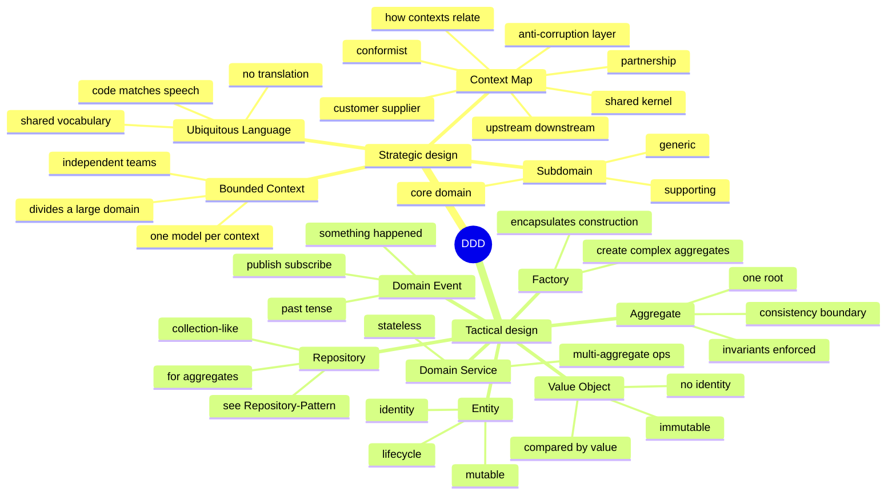
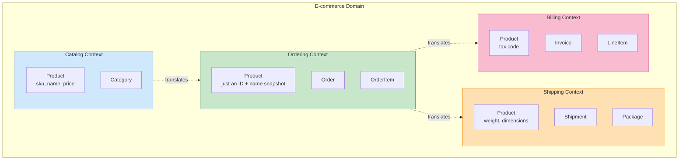
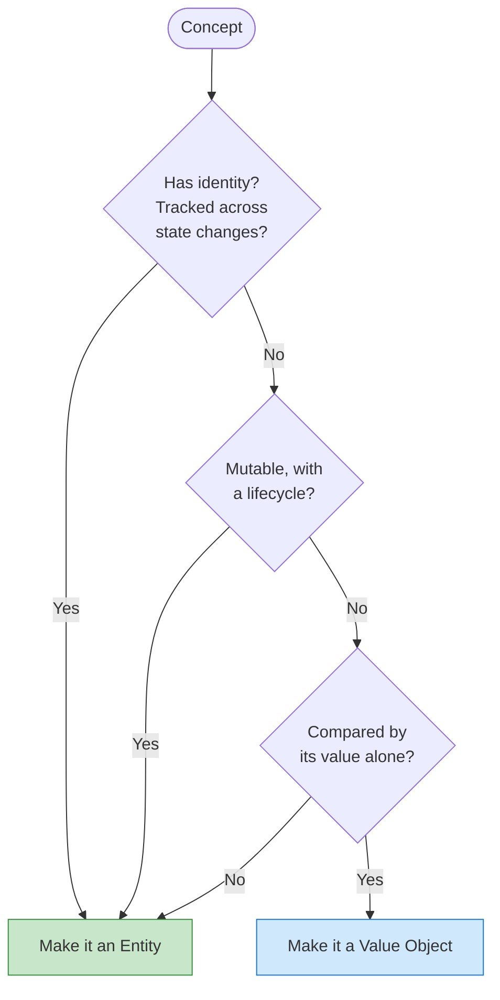
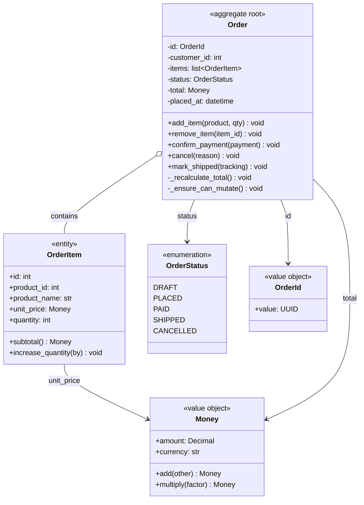
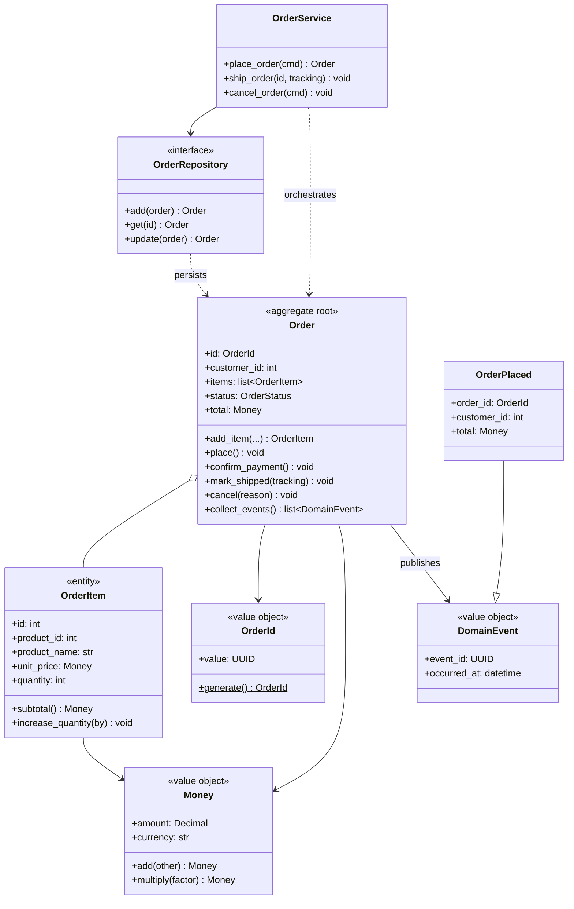
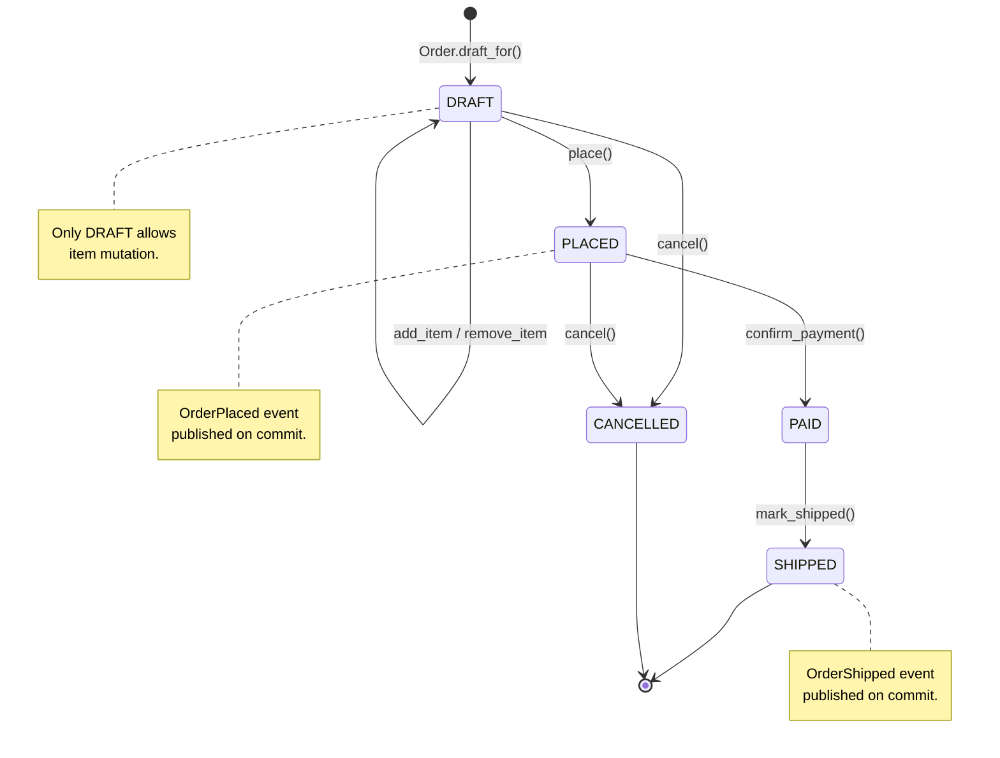

# Domain-Driven Design (DDD) — Modelling Complex Business Domains

#oop #architecture #ddd #domain-model #aggregate #value-object #entity #bounded-context #ubiquitous-language #teaching #deep-dive

> [!quote] Eric Evans, 2003
> "Domain-Driven Design is an approach to software development that tackles complexity in the heart of software by connecting the implementation to an evolving model of the core business domain."

Most architectural patterns are about *technology*: how to talk to a database, how to handle an HTTP request, how to layer services. **Domain-Driven Design is about *the business*.** Its central claim is that the source of complexity in serious software is not the framework, the database, or the network — it is the business domain itself, and the only durable way to manage that complexity is to make the **code** match the **mental model** the business experts carry in their heads.

This note covers DDD's strategic design (Bounded Contexts, Ubiquitous Language, Context Maps) and tactical design (Entity, Value Object, Aggregate, Repository, Domain Service, Domain Event, Factory), with complete Python examples. It is the longest note in the Architecture section because DDD has the most vocabulary — and the vocabulary *is* the technique.

Prerequisite reading: [[Encapsulation]], [[Abstraction]], [[Composition-Over-Inheritance]], [[Repository-Pattern]], [[Service-Layer]].

---

## 1. What Is DDD?

DDD is a methodology introduced by **Eric Evans** in his 2003 book *Domain-Driven Design: Tackling Complexity in the Heart of Software*. It has two halves:

- **Strategic design** — how to think about a large domain at the level of *teams*, *models*, and *boundaries*. Used by everyone — architects, product owners, business analysts.
- **Tactical design** — how to write the actual code. The building blocks: Entity, Value Object, Aggregate, Repository, Domain Service, Domain Event, Factory. Used by developers.

The two halves reinforce each other. Strategic design without tactical design produces slide decks; tactical design without strategic design produces a giant pile of entangled entities that *should* have been three bounded contexts.



---

## 2. Strategic Design

### 2.1 The Problem: One Model for Everything

Naïve teams try to build a single, unified model of the entire business. A `User` is the same in Marketing, Billing, and Security, right? It isn't. To Marketing, a User has preferences, segments, and consent flags. To Billing, a User is a customer with a payment method, invoices, and tax residency. To Security, a User is an identity with credentials, MFA, sessions, and audit logs. Forcing these into one class produces a God Object — and worse, every change for Marketing risks breaking Billing.

### 2.2 Bounded Contexts

A **Bounded Context** is a boundary within which a particular model is defined and applicable. Inside the Billing context, `Customer` means "the entity that owes us money". Inside the Marketing context, `Subscriber` means "the entity we can email". They might be backed by the same row in a `users` table — that's an integration concern — but conceptually they are different models with different rules.



Note that `Product` appears in *every* context but means something different. That is intentional and correct. The Catalog's `Product` (rich, with prices and categories) is not the Shipping context's `Product` (which has weight and dimensions, no price). A context translation happens at the boundary — typically via an **Anti-Corruption Layer** that converts the upstream representation into the downstream context's terms.

### 2.3 Ubiquitous Language

Within a Bounded Context, **developers and domain experts use the same words** — in conversation, in documentation, and in code. If the expert says "When a cart is abandoned for over 30 minutes, release the reserved stock", the code says `Cart.abandon()` and `StockReservation.release()`. There is no translation step. The class names *are* the domain vocabulary.

Symptoms of a broken ubiquitous language:

- Class names like `UserRecord`, `AccountInfo`, `CustomerData` — these are *database-shaped*, not domain-shaped.
- Code says `if user.status == 2` — a magic number, not a domain concept.
- Experts say "subscriber" but code says `User` — there's a translation step, and the model is already drifting.

### 2.4 Context Maps

A **Context Map** describes how Bounded Contexts relate. The common relationships:

| Relationship | Meaning |
|---|---|
| **Partnership** | Two contexts cooperate; teams synchronise. |
| **Shared Kernel** | Two contexts share a small, explicitly-agreed subset of model. Fragile; minimise. |
| **Customer-Supplier** | Upstream serves downstream; downstream's needs influence upstream priorities. |
| **Conformist** | Upstream is unmotivated to help; downstream conforms to upstream's model as-is. |
| **Anti-Corruption Layer** | Downstream context builds a translation layer to protect itself from upstream's model. |
| **Open Host Service** | One context exposes a protocol/API for many downstream consumers (e.g., REST API). |
| **Published Language** | A standardised, well-documented language for interchange (e.g., ISO 8583, HL7). |

### 2.5 Subdomains

A large domain divides into subdomains:

- **Core domain** — the thing that makes your business money. This is where DDD investment pays off most.
- **Supporting domain** — necessary but not differentiating (e.g., inventory for an e-commerce site). Model it well, but don't over-engineer.
- **Generic domain** — everyone needs it (auth, billing, email). Buy it or use a library; don't build it.

A common mistake is to apply heavy DDD tactical patterns to a generic subdomain. Authentication is rarely your core domain; use an off-the-shelf identity provider and save the rich modelling for the parts that matter.

---

## 3. Tactical Design — The Building Blocks

The tactical patterns are the vocabulary of the code itself. Each is small; their power comes from how they combine.

### 3.1 Value Object

A **Value Object** has *no identity*. It is defined entirely by its attributes. Two `Money(10, "USD")` instances are interchangeable. Value Objects are **immutable** — to "change" a Money, you create a new one.

```python
from dataclasses import dataclass
from decimal import Decimal

@dataclass(frozen=True)
class Money:
    amount: Decimal
    currency: str

    def __post_init__(self):
        # Invariant: amount must have the right scale for the currency
        if self.currency not in {"USD", "EUR", "GBP", "JPY"}:
            raise ValueError(f"unsupported currency: {self.currency}")
        if self.amount < 0:
            raise ValueError("money cannot be negative in this domain")

    def add(self, other: "Money") -> "Money":
        self._require_same_currency(other)
        return Money(self.amount + other.amount, self.currency)

    def multiply(self, factor: Decimal) -> "Money":
        if factor < 0:
            raise ValueError("cannot multiply by negative")
        return Money(self.amount * factor, self.currency)

    def is_greater_than(self, other: "Money") -> bool:
        self._require_same_currency(other)
        return self.amount > other.amount

    def _require_same_currency(self, other: "Money") -> None:
        if self.currency != other.currency:
            raise ValueError(
                f"currency mismatch: {self.currency} vs {other.currency}"
            )
```

Properties of a Value Object:

1. **Immutable.** All operations return new instances.
2. **Compared by value.** `Money(10, "USD") == Money(10, "USD")` is `True`.
3. **Self-validating.** The constructor enforces invariants — it's impossible to construct an invalid `Money`.
4. **Side-effect free.** Methods are pure functions.

Value Objects are the workhorses of DDD. They are *everywhere*: `Money`, `Address`, `DateRange`, `EmailAddress`, `Coordinates`, `Quantity`, `Percentage`. If a concept is defined by its values and has no lifecycle, make it a Value Object.

### 3.2 Entity

An **Entity** has *identity*. Two `User` objects with the same `id` are the same user, even if their email attributes differ. Entities are mutable and have a lifecycle: created, modified, archived.

```python
from dataclasses import dataclass, field
from typing import Optional

@dataclass
class OrderItem:
    """An OrderItem is an Entity *inside* the Order aggregate.
    It has its own id (so the order can refer to it) but is never
    loaded independently — only through the Order.
    """
    id: int
    product_id: int
    product_name: str  # snapshot at order time
    unit_price: Money
    quantity: int

    def subtotal(self) -> Money:
        return self.unit_price.multiply(Decimal(self.quantity))

    def increase_quantity(self, by: int) -> None:
        if by <= 0:
            raise ValueError("must increase by positive amount")
        self.quantity += by
```

Properties of an Entity:

1. **Identity.** Has an `id` (or another unique identifier) that persists across state changes.
2. **Mutable.** Methods change internal state, but identity stays stable.
3. **Compared by identity.** Two entities are equal iff their ids are equal.
4. **Self-validating.** Same as Value Objects — methods enforce invariants.

### 3.3 Value Object vs Entity — A Decision Rule



| Aspect | Value Object | Entity |
|---|---|---|
| Identity | None | Yes, stable |
| Mutability | Immutable | Mutable |
| Equality | By attributes | By identity |
| Lifecycle | None | Created, modified, deleted |
| Examples | Money, Address, DateRange | User, Order, Invoice, Product |

A useful test: *would two instances with identical attributes be interchangeable?* If yes (two $10 bills), it's a Value Object. If no (two users with the same name), it's an Entity.

### 3.4 Aggregate

An **Aggregate** is a *cluster* of related Entities and Value Objects treated as a single unit for data changes. It has:

- An **Aggregate Root** — one specific Entity that is the only entry point. External code may only hold references to the root, never to internal entities.
- A **consistency boundary** — invariants that span the cluster are enforced *inside* the aggregate, transactionally.

For example, an `Order` is an aggregate. Its root is the `Order` entity; its internals are `OrderItem` entities and `Money` value objects. The rule "an order cannot have more than 50 items" or "the total must match the sum of the item subtotals" lives on the `Order` root. Outside code never directly mutates an `OrderItem`; it asks the `Order` to do so.



### 3.5 The Aggregate Root in Code

```python
from enum import Enum
from datetime import datetime, timezone
from dataclasses import dataclass, field
from typing import Optional
import uuid

class OrderStatus(Enum):
    DRAFT = "draft"
    PLACED = "placed"
    PAID = "paid"
    SHIPPED = "shipped"
    CANCELLED = "cancelled"

@dataclass(frozen=True)
class OrderId:
    value: uuid.UUID
    @classmethod
    def generate(cls):
        return cls(uuid.uuid4())

@dataclass
class Order:
    """The Order aggregate root."""
    id: OrderId
    customer_id: int
    items: list[OrderItem] = field(default_factory=list)
    status: OrderStatus = OrderStatus.DRAFT
    total: Money = field(default_factory=lambda: Money(Decimal("0"), "USD"))
    placed_at: Optional[datetime] = None
    _next_item_id: int = 1

    # ---- factory: the only way to create a fresh Order ----
    @classmethod
    def draft_for(cls, customer_id: int) -> "Order":
        return cls(id=OrderId.generate(), customer_id=customer_id)

    # ---- invariants enforced on every mutation ----
    def add_item(self, product_id: int, name: str, price: Money, qty: int) -> OrderItem:
        self._ensure_can_mutate()
        if qty <= 0:
            raise ValueError("quantity must be positive")
        if len(self.items) >= 50:
            raise ValueError("order cannot exceed 50 distinct items")

        # Business rule: same product merges into the same line
        existing = next((i for i in self.items if i.product_id == product_id), None)
        if existing:
            existing.increase_quantity(qty)
            self._recalculate_total()
            return existing

        item = OrderItem(
            id=self._next_item_id,
            product_id=product_id,
            product_name=name,
            unit_price=price,
            quantity=qty,
        )
        self._next_item_id += 1
        self.items.append(item)
        self._recalculate_total()
        return item

    def remove_item(self, item_id: int) -> None:
        self._ensure_can_mutate()
        self.items = [i for i in self.items if i.id != item_id]
        self._recalculate_total()

    def place(self) -> None:
        if self.status != OrderStatus.DRAFT:
            raise ValueError(f"cannot place order in status {self.status}")
        if not self.items:
            raise ValueError("cannot place an empty order")
        if self.total.is_greater_than(Money(Decimal("10000"), "USD")):
            raise ValueError("orders over $10,000 require manual approval")
        self.status = OrderStatus.PLACED
        self.placed_at = datetime.now(timezone.utc)

    def confirm_payment(self) -> None:
        if self.status != OrderStatus.PLACED:
            raise ValueError("only placed orders can be paid")
        self.status = OrderStatus.PAID

    def cancel(self, reason: str) -> None:
        if self.status in (OrderStatus.SHIPPED, OrderStatus.CANCELLED):
            raise ValueError(f"cannot cancel order in status {self.status}")
        self.status = OrderStatus.CANCELLED

    def mark_shipped(self, tracking_number: str) -> None:
        if self.status != OrderStatus.PAID:
            raise ValueError("only paid orders can be shipped")
        self.status = OrderStatus.SHIPPED

    # ---- private helpers ----
    def _ensure_can_mutate(self) -> None:
        if self.status != OrderStatus.DRAFT:
            raise ValueError(f"cannot modify order in status {self.status}")

    def _recalculate_total(self) -> None:
        total = Money(Decimal("0"), "USD")
        for item in self.items:
            total = total.add(item.subtotal())
        self.total = total
```

Read this carefully. Notice:

- Every mutation goes through a method on the root. There is no public `order.items.append(...)` — that would bypass invariants.
- Every mutation enforces an invariant: status must be DRAFT to mutate, item count limit, amount limit, etc.
- `_recalculate_total` is private — the total is *derived* from the items; external code cannot set it directly without breaking consistency.
- The aggregate root is the *only* object outside code holds a reference to (in well-disciplined DDD).

### 3.6 Aggregate Design Rules

Three rules from Vaughn Vernon's *Implementing DDD*:

1. **Design small aggregates.** A 50-entity aggregate is too big. Most aggregates have fewer than 5 internal entities. If yours is huge, you probably have two aggregates that should be split.
2. **Reference other aggregates by identity only.** An `Order` doesn't hold a reference to a `Customer` object; it holds a `customer_id`. This keeps aggregates independently loadable and avoids object-graph nightmares.
3. **Update within one aggregate per transaction.** If a use case needs to update two aggregates, use a domain event + eventual consistency, or a saga. Don't open a transaction that spans two aggregates.

> [!warning] Common Student Misconception
> "An aggregate is just a parent class with children." No — the aggregate is a *consistency boundary*, not a containment hierarchy. A `Customer` is not automatically part of an `Order` aggregate just because orders belong to customers. The test is: *do these entities share an invariant that must be enforced transactionally?* If yes, they're in the same aggregate. If no — even if they're conceptually related — they're separate aggregates.

### 3.7 Repository (for Aggregates)

In DDD, a Repository is per-aggregate, not per-entity. There is no `OrderItemRepository`; you load the `Order` and reach into it for items. See [[Repository-Pattern]] for the full pattern.

```python
from abc import ABC, abstractmethod

class OrderRepository(ABC):
    @abstractmethod
    def add(self, order: Order) -> Order: ...
    @abstractmethod
    def get(self, order_id: OrderId) -> Optional[Order]: ...
    @abstractmethod
    def update(self, order: Order) -> Order: ...
    @abstractmethod
    def find_by_customer(self, customer_id: int) -> list[Order]: ...
```

### 3.8 Domain Service

A **Domain Service** is a stateless operation that doesn't naturally belong on any single Entity or Value Object. Typical examples: a transfer between two bank accounts, a pricing calculator that combines rules from multiple aggregates, a policy that decides which warehouse fulfils an order.

```python
class FundsTransferService:
    """Domain service: transfers money between two Account aggregates.
    Stateless; the rule spans two aggregates so it can't live on either.
    """

    def transfer(self, source: Account, target: Account, amount: Money) -> None:
        if source.currency != target.currency:
            raise ValueError("cross-currency transfer requires FX service")
        source.withdraw(amount)    # enforces "sufficient funds"
        target.deposit(amount)     # enforces "deposit limit"
```

Don't confuse a **Domain Service** with an **Application Service** (see [[Service-Layer]]). Domain services are part of the domain layer, stateless, and contain business rules. Application services coordinate use cases (load, call domain, save, publish events) but contain no business rules.

### 3.9 Domain Event

A **Domain Event** is a statement that *something happened in the past* that domain experts care about. Events are named in past tense: `OrderPlaced`, `PaymentConfirmed`, `OrderShipped`. They are published by aggregates (or services) and consumed by subscribers — possibly in other bounded contexts.

```python
from dataclasses import dataclass, field
from datetime import datetime, timezone
from typing import Callable
import uuid

@dataclass(frozen=True)
class DomainEvent:
    """Base class. All events are immutable and carry metadata."""
    event_id: uuid.UUID = field(default_factory=uuid.uuid4)
    occurred_at: datetime = field(default_factory=lambda: datetime.now(timezone.utc))

@dataclass(frozen=True)
class OrderPlaced(DomainEvent):
    order_id: OrderId
    customer_id: int
    total: Money

@dataclass(frozen=True)
class OrderShipped(DomainEvent):
    order_id: OrderId
    tracking_number: str

@dataclass(frozen=True)
class OrderCancelled(DomainEvent):
    order_id: OrderId
    reason: str


class EventBus:
    """A simple in-process event bus. Real systems use Kafka/RabbitMQ/etc."""
    def __init__(self):
        self._handlers: dict[type, list[Callable]] = {}

    def subscribe(self, event_type, handler):
        self._handlers.setdefault(event_type, []).append(handler)

    def publish(self, event: DomainEvent):
        for handler in self._handlers.get(type(event), []):
            handler(event)
```

Now the aggregate records events as it changes state, and the *application service* (see [[Service-Layer]]) publishes them after the transaction commits.

```python
@dataclass
class Order:
    # ... as above, plus:
    _events: list[DomainEvent] = field(default_factory=list)

    def place(self) -> None:
        # ... existing validation ...
        self.status = OrderStatus.PLACED
        self.placed_at = datetime.now(timezone.utc)
        self._events.append(OrderPlaced(
            order_id=self.id,
            customer_id=self.customer_id,
            total=self.total,
        ))

    def mark_shipped(self, tracking_number: str) -> None:
        # ... existing validation ...
        self.status = OrderStatus.SHIPPED
        self._events.append(OrderShipped(
            order_id=self.id,
            tracking_number=tracking_number,
        ))

    def collect_events(self) -> list[DomainEvent]:
        events = list(self._events)
        self._events.clear()
        return events
```

The application service then publishes them after commit:

```python
class OrderService:
    def place_order(self, cmd):
        with self._uow() as tx:
            order = Order.draft_for(cmd.customer_id)
            for product_id, qty in cmd.lines:
                product = self._products.get_or_raise(product_id)
                order.add_item(product.id, product.name, product.price, qty)
            order.place()
            self._orders.add(order)
            tx.on_commit(lambda: self._publish(order))
        return order

    def _publish(self, order):
        for event in order.collect_events():
            self._events.publish(event)
```

### 3.10 Factory

A **Factory** encapsulates complex aggregate construction. When construction involves multiple steps, defaults, or invariant checks that don't fit a single `__init__`, a factory — often a classmethod on the aggregate itself, or a dedicated Factory class — keeps the rules in one place.

```python
class OrderFactory:
    """Reconstitutes an Order from persistence or builds one with defaults."""

    @staticmethod
    def from_record(record) -> Order:
        """Used by the repository to rebuild an Order from a DB row."""
        order = Order(
            id=OrderId(record["id"]),
            customer_id=record["customer_id"],
            status=OrderStatus(record["status"]),
            total=Money(Decimal(record["total"]), record["currency"]),
            placed_at=record["placed_at"],
        )
        for item_record in record["items"]:
            order.items.append(OrderItem(
                id=item_record["id"],
                product_id=item_record["product_id"],
                product_name=item_record["product_name"],
                unit_price=Money(Decimal(item_record["unit_price"]),
                                  record["currency"]),
                quantity=item_record["quantity"],
            ))
        return order
```

In Python, factory methods on the aggregate itself are usually enough — you rarely need a separate Factory class. Reserve dedicated factories for *truly* complex construction (e.g., building an Order from a CSV import with multi-stage validation).

---

## 4. Anemic vs Rich Domain Models

The **Anemic Domain Model** is the anti-pattern that DDD most explicitly fights against. In an anemic model:

- Entities are bags of getters and setters.
- All behaviour lives in services.
- The "model" is just a data schema.

```python
# ANEMIC — anti-pattern
@dataclass
class Order:
    id: int
    customer_id: int
    items: list = field(default_factory=list)
    status: str = "draft"
    total: Decimal = Decimal("0")

class OrderService:
    def add_item(self, order, product, qty):
        # All the rules live here, not on Order.
        if order.status != "draft":
            raise ValueError("cannot modify")
        if len(order.items) >= 50:
            raise ValueError("too many items")
        # ... 30 more lines of logic that should be Order's responsibility
        order.items.append({...})
        order.total = sum(i["subtotal"] for i in order.items)
```

The problem with anemia is that the rules are *scattered*. Every service that touches an Order must remember to enforce the same rules. The first time someone forgets, an invariant is broken and you have a bug. A **rich** domain model puts the rules on the entity itself — `order.add_item(...)` — so the rules are *impossible* to bypass.

```python
# RICH — DDD-aligned
@dataclass
class Order:
    # ... fields ...
    def add_item(self, ...):
        self._ensure_can_mutate()
        # ... rules enforced here, can't be bypassed ...
```

> [!danger] Common Student Misconception
> "Anemic models are bad because they use getters and setters." No — getters and setters are a symptom, not the disease. The disease is that *behaviour lives outside the entity*. A rich model can have getters; what matters is that the rules are *on* the entity, so the entity enforces its own invariants. See Fowler's "Anemic Domain Model" blog post for the canonical statement.

---

## 5. A Complete Slice: Order Aggregate + Events + Repository + Service

Putting it all together:

```python
# domain/order.py — the aggregate, value objects, events
# domain/order_repository.py — abstract repository
# infrastructure/inmemory_order_repo.py — test implementation
# infrastructure/sqlite_order_repo.py — production implementation
# application/order_service.py — use cases
# adapters/http/order_controller.py — REST adapter

# (All the code in this note composes into the above layout.)
```

The class diagram below shows how the pieces fit:



---

## 6. State of an Aggregate

A useful diagram for teaching the lifecycle of an `Order`:



Each transition is a method on the aggregate. The state machine is the visual language you should share with domain experts — they will recognise it instantly.

---

## 7. When to Use DDD

### 7.1 Use DDD when:

- **The domain is complex and central to the business.** Insurance claims, banking, logistics, healthcare, tax — these are DDD sweet spots. The domain has hundreds of rules, decades of history, and a rich vocabulary.
- **The business model is still evolving.** DDD's emphasis on ubiquitous language and bounded contexts means the code can evolve with the business without becoming a tangle.
- **Multiple teams work on the same broader domain.** Bounded contexts let teams work independently with explicit translation points.
- **You can access domain experts.** DDD only works if you can sit with experts and learn their language. If your only source is a 5-year-old spec document, DDD will produce a model of the spec, not of the business.

### 7.2 Do NOT use DDD when:

- **The domain is CRUD.** A blog, a CMS for static pages, a contact form — these have no business rules worth modelling. Use the ORM directly.
- **The domain is generic.** Authentication, email sending, payment processing — buy or use a service. Don't model these yourself.
- **The project is short-lived.** DDD's payoff is over years. For a 3-month throwaway, it's overhead.
- **You can't talk to domain experts.** Without that conversation, your "ubiquitous language" is just guesses.
- **The team is junior and unfamiliar with OOP.** DDD demands fluency with entities, value objects, immutability, and event-driven thinking. Train on simpler patterns first.

> [!tip] Teaching Tip
> Run a 30-minute *event-storming* session before any DDD lecture. Give students a stack of sticky notes and a domain ("order groceries online"). Ask them to write down *events* (orange stickies, past tense: "Cart Created", "Order Placed", "Payment Captured") and put them on the wall in time order. The map they produce *is* the backbone of the domain model. Once students see their stickies turn into aggregates and events in code, DDD clicks.

---

## 8. Common Pitfalls

### 8.1 The Anaemic Aggregate

You called it an `Order` aggregate, but every method just mutates a field with no invariant. The aggregate is a fancy struct. Fix: ask the domain expert for the rules — "Can an order have zero items? Can the total go negative? Can a shipped order be modified?" — and encode each as a check inside a method.

### 8.2 The Giant Aggregate

One `User` aggregate that includes profile, preferences, orders, addresses, payment methods, audit logs, friends, follows. Loading a user now fetches 30 tables. Fix: split into `User` (identity), `Profile` (display), `Order` (history), etc., and reference by ID.

### 8.3 Cross-Aggregate Transactions

A use case opens a transaction that updates an `Order`, a `Customer`, a `Product`, and an `InventoryItem` together. The database supports it; the model shouldn't. Fix: emit `OrderPlaced` after committing the order, and let an event handler decrement inventory in a separate transaction (eventually consistent).

### 8.4 Domain Events Published Before Commit

If `OrderPlaced` is published before the COMMIT and the COMMIT fails, every subscriber has reacted to a non-existent order. Fix: collect events on the aggregate, publish them *after* the Unit of Work commits. Use an **outbox** pattern if you need guaranteed delivery across process boundaries.

### 8.5 Repository Per Entity

A `UserRepository`, an `OrderRepository`, *and* an `OrderItemRepository`. The last is wrong — `OrderItem` is internal to the `Order` aggregate. There should be no way to load an `OrderItem` without loading its `Order`.

### 8.6 Application Services With Business Rules

```python
# BAD — business rule in the service
class OrderService:
    def place_order(self, cmd):
        order = self._orders.get(cmd.order_id)
        if order.status != "draft":   # <-- rule, shouldn't be here
            raise ValueError("cannot place non-draft order")
        order.status = "placed"        # <-- bypassing the aggregate
        self._orders.update(order)
```

Fix: `order.place()` enforces the rule; the service just calls it.

### 8.7 Treating DTOs as Domain Objects

Returning ORM objects from services and letting the controller reach into their internals. Fix: services return DTOs or read models; domain objects stay inside the service boundary.

---

## 9. DDD and the Rest of the Architecture

DDD does not stand alone. It fits inside a layered architecture:

```mermaid
flowchart TB
    subgraph Adapters
        HTTP[HTTP Controller]
        CLI[CLI]
        MQ[Message Consumer]
    end
    subgraph Application[Application Layer]
        AS[Application Services<br/>use case orchestration]
        UoW[Unit of Work]
    end
    subgraph Domain[Domain Layer]
        AG[Aggregates]
        VO[Value Objects]
        DS[Domain Services]
        DE[Domain Events]
        R[Repository interfaces]
    end
    subgraph Infrastructure[Infrastructure Layer]
        SQL[SQL Repositories]
        Mem[In-Memory Repositories]
        Email[Email Sender]
        Bus[Event Bus]
    end
    HTTP --> AS
    CLI --> AS
    MQ --> AS
    AS --> UoW
    AS --> AG
    AS --> R
    AG --> VO
    AG --> DS
    AG --> DE
    R <|.. SQL
    R <|.. Mem
    AS --> Bus
    DE -.published by.-> Bus
    AS --> Email

    style Domain fill:#c8e6c9,stroke:#388e3c
    style Application fill:#cfe8fc,stroke:#1976d2
    style Infrastructure fill:#ffe0b2,stroke:#f57c00
```

The **Domain Layer** is at the centre; it depends on nothing. The **Application Layer** depends on the domain. The **Infrastructure Layer** implements the domain's interfaces (repositories, event bus, mailer). The Adapters talk HTTP, CLI, MQ. This is the same layering as [[Hexagonal-Architecture]] — DDD and Hexagonal compose naturally.

---

## 10. Key Takeaways

1. **DDD is about the domain, not the technology.** Use it when the business domain is complex, central, and evolving.
2. **Strategic design**: divide the domain into **Bounded Contexts**, agree on a **Ubiquitous Language** per context, and map the relationships with a **Context Map**.
3. **Tactical design** has seven building blocks: **Entity, Value Object, Aggregate, Repository, Domain Service, Domain Event, Factory**.
4. **Value Objects** are immutable and compared by value; they are the workhorses of DDD.
5. **Aggregates** are consistency boundaries with a single **root**; outside code only ever holds a reference to the root.
6. **Repositories** are per-aggregate, never per-entity.
7. **Domain events** are published *after* commit and consumed by other aggregates or contexts.
8. **Anaemic domain models are the anti-pattern** — rules live on entities, not in services.
9. **DDD is overkill** for CRUD apps, generic domains, or short-lived projects.

> [!success] Teaching Tip
> After students learn the building blocks, give them a single rich use case — "Library lending: a patron borrows a book, returns it late, pays a fine, and the book goes back on the shelf" — and ask them to identify every block: which are entities (Book, Patron, Loan), value objects (ISBN, Money, DueDate), aggregates (Loan is the root; Book and Patron are referenced by ID), events (BookBorrowed, BookReturned, FinePaid), and services (OverduePolicy is a domain service). One exercise, every concept.

### 10.1 Further Reading

- Eric Evans, *Domain-Driven Design* (2003) — the source text, dense but essential.
- Vaughn Vernon, *Implementing Domain-Driven Design* (2013) — the practical follow-up; the "three rules of aggregate design" come from here.
- Mathias Verraes and Rebecca Wirfs-Brock, *Patterns of Distributed Systems* and various DDD aggregate design papers.
- [[Repository-Pattern]] — the persistence side of aggregates.
- [[Service-Layer]] — Application Services vs Domain Services.
- [[Hexagonal-Architecture]] — the architectural envelope that holds a DDD domain.
- [[Encapsulation]] and [[Abstraction]] — the OOP foundations DDD builds on.
