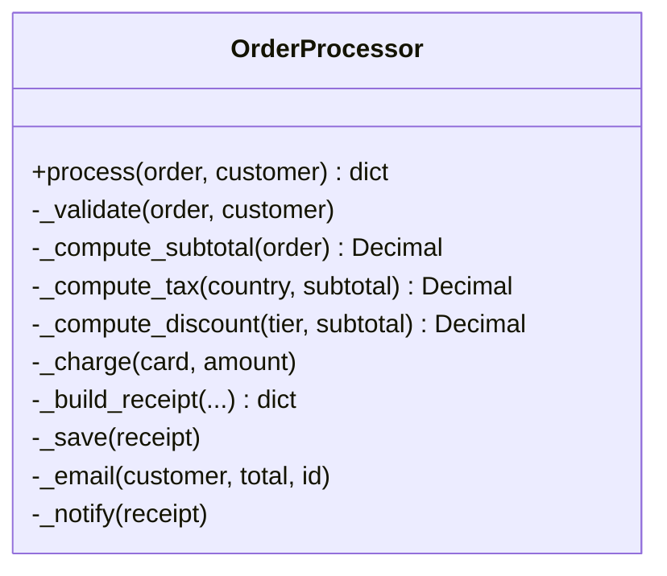
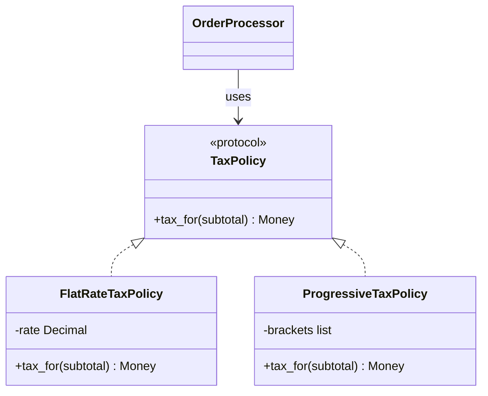
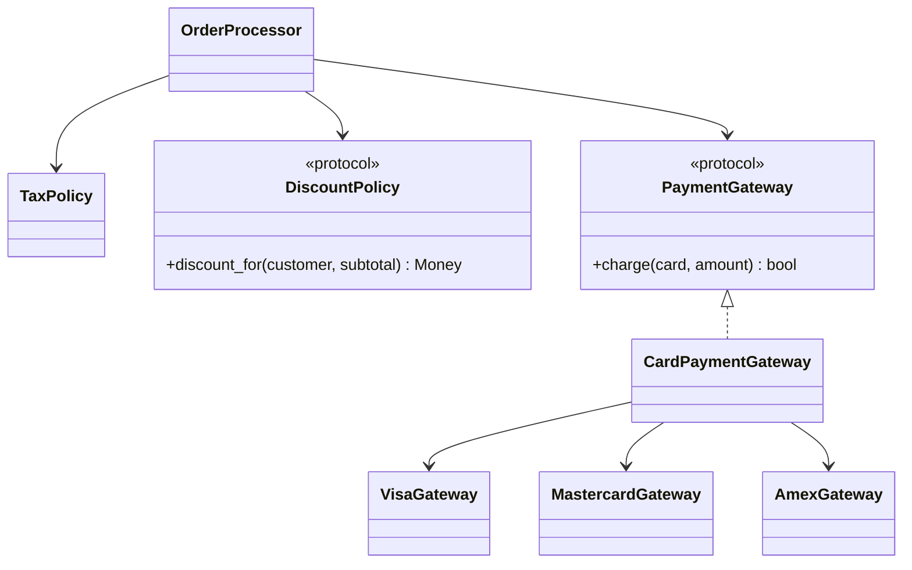
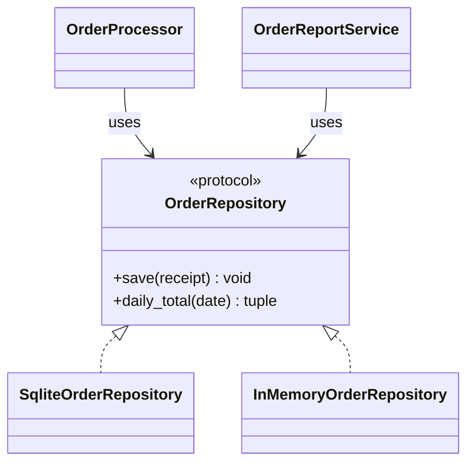
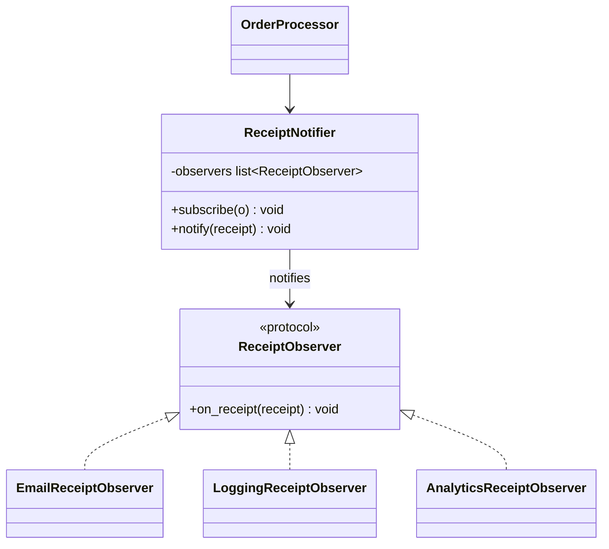
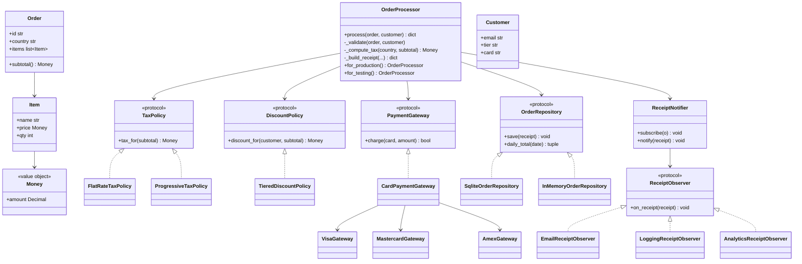
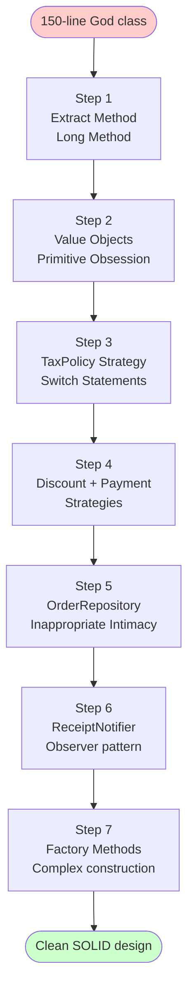

# Case Study — Refactoring an OrderProcessor God Class

> [!quote] "Refactoring is the art of changing the structure of code without changing its behavior. This is what that looks like, step by step."

This note is a single end-to-end case study. We start with a 150-line `OrderProcessor` God class riddled with smells, walk through seven refactoring steps, and end with a clean, SOLID-compliant design built on Strategy + Factory + Observer patterns.

Related notes: [[refactoring-techniques]], [[code-smells-catalog]], [[design-smells-and-principles]], [[solid-principles]], [[grasp-and-extra-principles]], [[composition-over-inheritance]], [[dependency-injection]], [[design-patterns-creational]], [[design-patterns-behavioral]].

---

## The Starting Point

A small e-commerce system has an `OrderProcessor` class. It works. Tests pass. But every new requirement takes longer than the last. Here is the original code in full:

```python
# order_processor.py — 150 lines, all smells
from datetime import datetime
import smtplib
import sqlite3
import json
from decimal import Decimal


class OrderProcessor:
    def __init__(self, db_path: str = "orders.db"):
        self.db_path = db_path
        self._observers: list = []

    # ---- entry point ----
    def process(self, order: dict, customer: dict) -> dict:
        # validate
        if not customer.get("email"):
            raise ValueError("customer email required")
        if not order.get("items"):
            raise ValueError("order has no items")
        if order.get("country") not in ("US", "CA", "UK", "EU"):
            raise ValueError(f"unsupported country: {order.get('country')}")
        for item in order["items"]:
            if item.get("price", 0) < 0 or item.get("qty", 0) < 0:
                raise ValueError("bad item")
        # compute subtotal
        subtotal = Decimal("0")
        for item in order["items"]:
            subtotal += Decimal(str(item["price"])) * item["qty"]
        # compute tax by country
        if order["country"] == "US":
            tax = subtotal * Decimal("0.08")
        elif order["country"] == "CA":
            tax = subtotal * Decimal("0.13")
        elif order["country"] == "UK":
            tax = subtotal * Decimal("0.20")
        elif order["country"] == "EU":
            tax = subtotal * Decimal("0.21")
        else:
            tax = Decimal("0")
        # apply discount
        if customer.get("tier") == "gold":
            discount = subtotal * Decimal("0.10")
        elif customer.get("tier") == "silver":
            discount = subtotal * Decimal("0.05")
        else:
            discount = Decimal("0")
        total = subtotal + tax - discount
        # charge card
        card = customer.get("card")
        if not card:
            raise ValueError("no card on file")
        if card.startswith("4"):
            # Visa
            success = self._charge_visa(card, total)
        elif card.startswith("5"):
            # Mastercard
            success = self._charge_mc(card, total)
        elif card.startswith("3"):
            # Amex
            success = self._charge_amex(card, total)
        else:
            raise ValueError(f"unsupported card: {card[:4]}")
        if not success:
            raise RuntimeError("charge failed")
        # build receipt
        receipt = {
            "order_id": order.get("id", f"order-{datetime.now().timestamp()}"),
            "customer_email": customer["email"],
            "items": order["items"],
            "subtotal": str(subtotal),
            "tax": str(tax),
            "discount": str(discount),
            "total": str(total),
            "timestamp": datetime.now().isoformat(),
        }
        # save to DB
        conn = sqlite3.connect(self.db_path)
        conn.execute(
            "INSERT INTO orders (id, email, total, ts) VALUES (?, ?, ?, ?)",
            (receipt["order_id"], customer["email"], str(total), receipt["timestamp"])
        )
        conn.commit()
        conn.close()
        # send email
        body = f"Subject: Order {receipt['order_id']}\n\n"
        body += f"Total: ${total}\nThanks for your purchase!"
        smtplib.SMTP("localhost").sendmail(
            "orders@example.com", [customer["email"]], body
        )
        # notify observers
        for obs in self._observers:
            obs(receipt)
        return receipt

    # ---- payment helpers ----
    def _charge_visa(self, card: str, amount: Decimal) -> bool:
        print(f"Charging Visa {card[:6]}... for ${amount}")
        return True

    def _charge_mc(self, card: str, amount: Decimal) -> bool:
        print(f"Charging Mastercard {card[:6]}... for ${amount}")
        return True

    def _charge_amex(self, card: str, amount: Decimal) -> bool:
        print(f"Charging Amex {card[:6]}... for ${amount}")
        return True

    # ---- observer registration ----
    def subscribe(self, callback) -> None:
        self._observers.append(callback)

    # ---- report ----
    def daily_report(self, date: str) -> str:
        conn = sqlite3.connect(self.db_path)
        rows = conn.execute(
            "SELECT id, email, total FROM orders WHERE ts LIKE ?",
            (f"{date}%",)
        ).fetchall()
        conn.close()
        total = sum(Decimal(r[2]) for r in rows)
        return json.dumps({"count": len(rows), "total": str(total)})
```

## Diagnosing the Smells

Before touching code, list every smell you see. Then prioritise.

> [!example] Smells spotted
> | # | Smell | Where | Severity |
> |---|---|---|---|
> | 1 | Long Method | `process()` — 70+ lines | High |
> | 2 | Long Class | whole class does 5 jobs | High |
> | 3 | Primitive Obsession | `dict` for `order`, `customer`, `item` | High |
> | 4 | Switch Statements | country → tax, card type → charge | High |
> | 5 | Feature Envy | email body uses customer fields | Medium |
> | 6 | Data Class | no real classes at all | High |
> | 7 | Shotgun Surgery | add a field → touch validation, receipt, DB, email | High |
> | 8 | Inappropriate Intimacy | DB connection inside business logic | Medium |
> | 9 | Divergent Change | change tax → edit process; change email → edit process | High |
> | 10 | Dead Code / Speculative Generality | none — but it's coming | Low |

Priority order (highest impact first):
1. Introduce real domain classes (cures 3, 6, 7).
2. Extract methods (cures 1).
3. Extract classes for tax, discount, payment, persistence, email (cures 2, 8, 9).
4. Replace conditionals with polymorphism (cures 4).
5. Apply Strategy, Factory, Observer patterns to land the design.

---

## Tests First

We can't refactor without a safety net. The original code has no tests, so we first write *characterisation tests* — tests that document the *current* behavior (warts and all).

```python
# test_order_processor.py
import pytest
from decimal import Decimal
from order_processor import OrderProcessor

@pytest.fixture
def customer():
    return {"email": "alice@example.com", "tier": "gold", "card": "4111111111111111"}

@pytest.fixture
def order():
    return {"id": "o-1", "country": "US",
            "items": [{"name": "Book", "price": 10.0, "qty": 2}]}

def test_us_order_gold_tier(customer, order, monkeypatch):
    monkeypatch.setattr("smtplib.SMTP", lambda *_: object())
    proc = OrderProcessor(db_path=":memory:")
    # need to create table — pretend this exists in setup
    receipt = proc.process(order, customer)
    assert receipt["subtotal"] == "20.00"
    assert receipt["tax"] == "1.60"
    assert receipt["discount"] == "2.00"
    assert receipt["total"] == "19.60"

def test_ca_order_no_discount(customer, order):
    customer["tier"] = "bronze"
    order["country"] = "CA"
    proc = OrderProcessor(db_path=":memory:")
    receipt = proc.process(order, customer)
    assert receipt["tax"] == "2.60"  # 13% of 20
    assert receipt["discount"] == "0"
    assert receipt["total"] == "22.60"

def test_missing_email_raises():
    with pytest.raises(ValueError):
        OrderProcessor().process({"items": []}, {})

def test_negative_price_raises(customer, order):
    order["items"][0]["price"] = -5
    with pytest.raises(ValueError):
        OrderProcessor().process(order, customer)
```

> [!warning] Tests that pass *before* refactoring
> These tests must pass against the original code. They are your safety net. Run them after every step.

---

## Refactoring Step 1 — Extract Methods from `process()`

**Smell:** Long Method.
**Refactoring:** [[refactoring-techniques#Extract Method|Extract Method]].

```python
def process(self, order: dict, customer: dict) -> dict:
    self._validate(order, customer)
    subtotal = self._compute_subtotal(order)
    tax = self._compute_tax(order["country"], subtotal)
    discount = self._compute_discount(customer.get("tier"), subtotal)
    total = subtotal + tax - discount
    self._charge(customer["card"], total)
    receipt = self._build_receipt(order, customer, subtotal, tax, discount, total)
    self._save(receipt)
    self._email(customer, total, receipt["order_id"])
    self._notify(receipt)
    return receipt

def _validate(self, order: dict, customer: dict) -> None:
    if not customer.get("email"): raise ValueError("customer email required")
    if not order.get("items"): raise ValueError("order has no items")
    if order.get("country") not in ("US", "CA", "UK", "EU"):
        raise ValueError(f"unsupported country: {order.get('country')}")
    for item in order["items"]:
        if item.get("price", 0) < 0 or item.get("qty", 0) < 0:
            raise ValueError("bad item")

def _compute_subtotal(self, order: dict) -> Decimal:
    return sum((Decimal(str(i["price"])) * i["qty"] for i in order["items"]),
               Decimal("0"))

def _compute_tax(self, country: str, subtotal: Decimal) -> Decimal:
    rates = {"US": "0.08", "CA": "0.13", "UK": "0.20", "EU": "0.21"}
    return subtotal * Decimal(rates.get(country, "0"))

def _compute_discount(self, tier: str | None, subtotal: Decimal) -> Decimal:
    rates = {"gold": "0.10", "silver": "0.05"}
    return subtotal * Decimal(rates.get(tier or "", "0"))

def _charge(self, card: str, amount: Decimal) -> None:
    if card.startswith("4"): self._charge_visa(card, amount)
    elif card.startswith("5"): self._charge_mc(card, amount)
    elif card.startswith("3"): self._charge_amex(card, amount)
    else: raise ValueError(f"unsupported card: {card[:4]}")

def _build_receipt(self, order, customer, subtotal, tax, discount, total) -> dict:
    return {
        "order_id": order.get("id", f"order-{datetime.now().timestamp()}"),
        "customer_email": customer["email"],
        "items": order["items"],
        "subtotal": str(subtotal),
        "tax": str(tax),
        "discount": str(discount),
        "total": str(total),
        "timestamp": datetime.now().isoformat(),
    }

def _save(self, receipt: dict) -> None: ...  # unchanged
def _email(self, customer, total, order_id) -> None: ...  # unchanged
def _notify(self, receipt: dict) -> None: ...  # unchanged
```

**Tests:** Green. Commit.

**Diagram:**



> [!note] We haven't changed behavior. We've only reorganised. But the shape of the next refactorings is now visible — each private method is a candidate to become a class.

---

## Refactoring Step 2 — Replace Primitive `dict` with Value Objects

**Smell:** Primitive Obsession, Data Class (anemic).
**Refactoring:** [[refactoring-techniques#Replace Data Value with Object|Replace Data Value with Object]].

```python
from dataclasses import dataclass, field
from typing import Optional

@dataclass(frozen=True)
class Money:
    amount: Decimal
    currency: str = "USD"
    def __post_init__(self):
        if self.amount < 0:
            raise ValueError("Money cannot be negative")
    def __add__(self, other: "Money") -> "Money":
        return Money(self.amount + other.amount, self.currency)
    def __sub__(self, other: "Money") -> "Money":
        return Money(self.amount - other.amount, self.currency)
    def times(self, factor: Decimal) -> "Money":
        return Money(self.amount * factor, self.currency)
    def __str__(self) -> str:
        return f"{self.amount:.2f}"

@dataclass(frozen=True)
class Item:
    name: str
    price: Money
    qty: int
    def __post_init__(self):
        if self.qty < 0:
            raise ValueError("qty cannot be negative")

@dataclass
class Customer:
    email: str
    tier: str = "bronze"
    card: Optional[str] = None

@dataclass
class Order:
    id: str
    country: str
    items: list[Item]
    def subtotal(self) -> Money:
        return sum((i.price.times(Decimal(i.qty)) for i in self.items),
                   Money(Decimal("0")))
```

Now `process()` becomes:

```python
def process(self, order: Order, customer: Customer) -> dict:
    self._validate(order, customer)
    subtotal = order.subtotal()  # behavior lives on Order — Information Expert
    tax = self._compute_tax(order.country, subtotal)
    discount = self._compute_discount(customer.tier, subtotal)
    total = subtotal + tax - discount
    ...
```

Update the tests to use the new types. **Tests:** Green. Commit.

> [!tip] Behavior moved to the data
> `Order.subtotal()` is now on `Order`, where it belongs. This is Information Expert (GRASP) and cures the Data Class smell.

---

## Refactoring Step 3 — Extract `TaxPolicy` (Replace Conditional with Polymorphism)

**Smell:** Switch Statements (country → tax rate).
**Refactoring:** [[refactoring-techniques#Replace Conditional with Polymorphism|Replace Conditional with Polymorphism]] + Strategy.

```python
from typing import Protocol

class TaxPolicy(Protocol):
    def tax_for(self, subtotal: Money) -> Money: ...

class FlatRateTaxPolicy:
    def __init__(self, rate: Decimal):
        self._rate = rate
    def tax_for(self, subtotal: Money) -> Money:
        return subtotal.times(self._rate)

TAX_POLICIES: dict[str, TaxPolicy] = {
    "US": FlatRateTaxPolicy(Decimal("0.08")),
    "CA": FlatRateTaxPolicy(Decimal("0.13")),
    "UK": FlatRateTaxPolicy(Decimal("0.20")),
    "EU": FlatRateTaxPolicy(Decimal("0.21")),
}

class OrderProcessor:
    def __init__(self, db_path: str = "orders.db",
                 tax_policies: dict[str, TaxPolicy] | None = None):
        self.db_path = db_path
        self._observers: list = []
        self._tax_policies = tax_policies or TAX_POLICIES

    def _compute_tax(self, country: str, subtotal: Money) -> Money:
        policy = self._tax_policies.get(country)
        if policy is None:
            raise ValueError(f"unsupported country: {country}")
        return policy.tax_for(subtotal)
```

Adding a new country now means adding a dictionary entry, not editing a method body. **Open/Closed Principle satisfied** — see [[solid-principles#O — Open/Closed Principle (OCP)]].

**Tests:** Green. Commit.



> [!example] OCP in action
> Now we can add a progressive tax policy for a fictional "NO" country (Norway) without touching `OrderProcessor`:
> ```python
> class ProgressiveTaxPolicy:
>     def __init__(self, brackets: list[tuple[Decimal, Decimal]]):
>         self._brackets = brackets
>     def tax_for(self, subtotal: Money) -> Money:
>         tax = Decimal("0")
>         remaining = subtotal.amount
>         for threshold, rate in self._brackets:
>             if remaining > threshold:
>                 tax += threshold * rate
>                 remaining -= threshold
>             else:
>                 tax += remaining * rate
>                 break
>         return Money(tax)
>
> TAX_POLICIES["NO"] = ProgressiveTaxPolicy([
>     (Decimal("1000"), Decimal("0.10")),
>     (Decimal("5000"), Decimal("0.20")),
>     (Decimal("1000000"), Decimal("0.30")),
> ])
> ```

---

## Refactoring Step 4 — Extract `DiscountPolicy` and `PaymentGateway`

**Smell:** Switch Statements (tier → discount), Shotgun Surgery (card type → method).
**Refactoring:** Extract Class + Strategy.

```python
class DiscountPolicy(Protocol):
    def discount_for(self, customer: Customer, subtotal: Money) -> Money: ...

class TieredDiscountPolicy:
    def __init__(self, rates: dict[str, Decimal]):
        self._rates = rates
    def discount_for(self, customer: Customer, subtotal: Money) -> Money:
        rate = self._rates.get(customer.tier, Decimal("0"))
        return subtotal.times(rate)


class PaymentGateway(Protocol):
    def charge(self, card: str, amount: Money) -> bool: ...

class VisaGateway:
    def charge(self, card: str, amount: Money) -> bool:
        print(f"Charging Visa {card[:6]}... for ${amount}")
        return True

class MastercardGateway:
    def charge(self, card: str, amount: Money) -> bool:
        print(f"Charging Mastercard {card[:6]}... for ${amount}")
        return True

class AmexGateway:
    def charge(self, card: str, amount: Money) -> bool:
        print(f"Charging Amex {card[:6]}... for ${amount}")
        return True


class CardPaymentGateway:
    """Factory + dispatcher. Picks the right gateway by card prefix."""
    def __init__(self, gateways: dict[str, PaymentGateway]):
        self._by_prefix = gateways  # {"4": VisaGateway(), "5": ..., "3": ...}
    def charge(self, card: str, amount: Money) -> bool:
        for prefix, gw in self._by_prefix.items():
            if card.startswith(prefix):
                return gw.charge(card, amount)
        raise ValueError(f"unsupported card: {card[:4]}")
```

`OrderProcessor` now delegates:

```python
class OrderProcessor:
    def __init__(self, db_path: str = "orders.db",
                 tax_policies: dict[str, TaxPolicy] | None = None,
                 discount_policy: DiscountPolicy | None = None,
                 payment_gateway: PaymentGateway | None = None):
        self.db_path = db_path
        self._observers: list = []
        self._tax_policies = tax_policies or TAX_POLICIES
        self._discount_policy = discount_policy or TieredDiscountPolicy(
            {"gold": Decimal("0.10"), "silver": Decimal("0.05")})
        self._payment_gateway = payment_gateway or CardPaymentGateway({
            "4": VisaGateway(), "5": MastercardGateway(), "3": AmexGateway(),
        })

    def process(self, order: Order, customer: Customer) -> dict:
        self._validate(order, customer)
        subtotal = order.subtotal()
        tax = self._compute_tax(order.country, subtotal)
        discount = self._discount_policy.discount_for(customer, subtotal)
        total = subtotal + tax - discount
        if not customer.card:
            raise ValueError("no card on file")
        if not self._payment_gateway.charge(customer.card, total):
            raise RuntimeError("charge failed")
        receipt = self._build_receipt(order, customer, subtotal, tax, discount, total)
        self._save(receipt)
        self._email(customer, total, receipt["order_id"])
        self._notify(receipt)
        return receipt
```

**Tests:** Green. Commit.



> [!note] Factory + Strategy combined
> `CardPaymentGateway` is a *Factory* (it dispatches to the right sub-gateway by prefix) wrapped in a *Strategy* interface (it implements `PaymentGateway`). This is a common OOP idiom — see [[design-patterns-creational]] and [[design-patterns-behavioral#Strategy]].

---

## Refactoring Step 5 — Extract `OrderRepository` (persistence)

**Smell:** Inappropriate Intimacy (DB connection inside business logic), Divergent Change (schema change touches `OrderProcessor`).
**Refactoring:** [[refactoring-techniques#Extract Class|Extract Class]] + [[refactoring-techniques#Extract Interface (Protocol)|Extract Protocol]].

```python
class OrderRepository(Protocol):
    def save(self, receipt: dict) -> None: ...
    def daily_total(self, date: str) -> tuple[int, Money]: ...

class SqliteOrderRepository:
    def __init__(self, db_path: str):
        self.db_path = db_path
    def save(self, receipt: dict) -> None:
        conn = sqlite3.connect(self.db_path)
        conn.execute(
            "INSERT INTO orders (id, email, total, ts) VALUES (?, ?, ?, ?)",
            (receipt["order_id"], receipt["customer_email"],
             receipt["total"], receipt["timestamp"])
        )
        conn.commit(); conn.close()
    def daily_total(self, date: str) -> tuple[int, Money]:
        conn = sqlite3.connect(self.db_path)
        rows = conn.execute(
            "SELECT total FROM orders WHERE ts LIKE ?", (f"{date}%",)
        ).fetchall()
        conn.close()
        return len(rows), sum((Decimal(r[0]) for r in rows), Decimal("0"))
```

`OrderProcessor` loses `_save` and `daily_report`:

```python
class OrderProcessor:
    def __init__(self, ..., repository: OrderRepository | None = None):
        ...
        self._repository = repository or SqliteOrderRepository(self.db_path)

    def process(self, order: Order, customer: Customer) -> dict:
        ...
        receipt = self._build_receipt(...)
        self._repository.save(receipt)
        self._email(customer, total, receipt["order_id"])
        self._notify(receipt)
        return receipt
```

Daily report moves to a separate class:

```python
class OrderReportService:
    def __init__(self, repo: OrderRepository):
        self._repo = repo
    def daily_json(self, date: str) -> str:
        count, total = self._repo.daily_total(date)
        return json.dumps({"count": count, "total": str(total)})
```

**Tests:** Green. Commit.



> [!tip] Tests get easier
> With `OrderRepository` injectable, we can use `InMemoryOrderRepository` in tests — no real database needed. Test setup goes from 5 lines to 1. This is the payoff of [[dependency-injection]].

---

## Refactoring Step 6 — Extract `ReceiptNotifier` (Observer pattern formalised)

**Smell:** Feature Envy (the `_notify` loop reads receipt fields), Implicit Observer (the `_observers` list + `subscribe()`).
**Refactoring:** Extract Class + formal Observer pattern.

```python
from typing import Protocol

class ReceiptObserver(Protocol):
    def on_receipt(self, receipt: dict) -> None: ...

class EmailReceiptObserver:
    def __init__(self, smtp_host: str = "localhost"):
        self._smtp_host = smtp_host
    def on_receipt(self, receipt: dict) -> None:
        body = f"Subject: Order {receipt['order_id']}\n\n"
        body += f"Total: ${receipt['total']}\nThanks for your purchase!"
        smtplib.SMTP(self._smtp_host).sendmail(
            "orders@example.com", [receipt["customer_email"]], body)

class LoggingReceiptObserver:
    def on_receipt(self, receipt: dict) -> None:
        print(f"[order] {receipt['order_id']} -> {receipt['total']}")

class AnalyticsReceiptObserver:
    def __init__(self, sink):
        self._sink = sink
    def on_receipt(self, receipt: dict) -> None:
        self._sink.track("order_completed", {
            "order_id": receipt["order_id"], "total": receipt["total"],
        })

class ReceiptNotifier:
    """Subject in the Observer pattern. Decouples processing from side-effects."""
    def __init__(self) -> None:
        self._observers: list[ReceiptObserver] = []
    def subscribe(self, observer: ReceiptObserver) -> None:
        self._observers.append(observer)
    def notify(self, receipt: dict) -> None:
        for o in self._observers:
            o.on_receipt(receipt)
```

`OrderProcessor` shrinks further:

```python
class OrderProcessor:
    def __init__(self, ..., notifier: ReceiptNotifier | None = None):
        ...
        self._notifier = notifier or ReceiptNotifier()

    def process(self, order: Order, customer: Customer) -> dict:
        ...
        receipt = self._build_receipt(...)
        self._repository.save(receipt)
        self._notifier.notify(receipt)
        return receipt
```

Wiring happens at composition root:

```python
# main.py
def build_order_processor() -> OrderProcessor:
    notifier = ReceiptNotifier()
    notifier.subscribe(EmailReceiptObserver())
    notifier.subscribe(LoggingReceiptObserver())
    notifier.subscribe(AnalyticsReceiptObserver(mixpanel))
    return OrderProcessor(
        repository=SqliteOrderRepository("orders.db"),
        tax_policies=TAX_POLICIES,
        discount_policy=TieredDiscountPolicy({"gold": Decimal("0.10"), "silver": Decimal("0.05")}),
        payment_gateway=CardPaymentGateway({
            "4": VisaGateway(), "5": MastercardGateway(), "3": AmexGateway(),
        }),
        notifier=notifier,
    )
```

**Tests:** Green. Commit.



> [!example] Open/Closed in action again
> Want to add an SMS observer? `notifier.subscribe(SmsReceiptObserver(...))`. No change to `OrderProcessor`. No change to existing observers. OCP wins.

---

## Refactoring Step 7 — Replace Constructor with Factory Method

**Smell:** Complex construction (lots of optional parameters with sensible defaults that callers shouldn't need to know).
**Refactoring:** [[refactoring-techniques#Replace Constructor with Factory Method|Replace Constructor with Factory Method]].

```python
class OrderProcessor:
    def __init__(self, repository: OrderRepository,
                 tax_policies: dict[str, TaxPolicy],
                 discount_policy: DiscountPolicy,
                 payment_gateway: PaymentGateway,
                 notifier: ReceiptNotifier):
        self._repository = repository
        self._tax_policies = tax_policies
        self._discount_policy = discount_policy
        self._payment_gateway = payment_gateway
        self._notifier = notifier

    @classmethod
    def for_production(cls, db_path: str = "orders.db",
                       analytics_sink=None) -> "OrderProcessor":
        notifier = ReceiptNotifier()
        notifier.subscribe(EmailReceiptObserver())
        notifier.subscribe(LoggingReceiptObserver())
        if analytics_sink is not None:
            notifier.subscribe(AnalyticsReceiptObserver(analytics_sink))
        return cls(
            repository=SqliteOrderRepository(db_path),
            tax_policies=TAX_POLICIES,
            discount_policy=TieredDiscountPolicy(
                {"gold": Decimal("0.10"), "silver": Decimal("0.05")}),
            payment_gateway=CardPaymentGateway({
                "4": VisaGateway(), "5": MastercardGateway(), "3": AmexGateway(),
            }),
            notifier=notifier,
        )

    @classmethod
    def for_testing(cls, repository: OrderRepository | None = None,
                    payment_gateway: PaymentGateway | None = None) -> "OrderProcessor":
        """All collaborators are stubs/fakes by default."""
        return cls(
            repository=repository or InMemoryOrderRepository(),
            tax_policies={"US": FlatRateTaxPolicy(Decimal("0.08"))},
            discount_policy=TieredDiscountPolicy({}),
            payment_gateway=payment_gateway or FakePaymentGateway(),
            notifier=ReceiptNotifier(),
        )
```

**Tests:** Green. Commit.

> [!tip] Two factory methods, two intents
> `for_production` wires real services. `for_testing` wires fakes. The constructor itself stays honest — it requires everything, no hidden defaults. This is the [[dependency-injection]] pattern done right.

---

## The Final State

### `OrderProcessor` after refactoring

```python
class OrderProcessor:
    """Thin orchestrator. Knows the use-case flow; knows nothing about
    tax rates, card networks, databases, or email servers."""

    def __init__(self, repository: OrderRepository,
                 tax_policies: dict[str, TaxPolicy],
                 discount_policy: DiscountPolicy,
                 payment_gateway: PaymentGateway,
                 notifier: ReceiptNotifier):
        self._repository = repository
        self._tax_policies = tax_policies
        self._discount_policy = discount_policy
        self._payment_gateway = payment_gateway
        self._notifier = notifier

    @classmethod
    def for_production(cls, db_path: str = "orders.db",
                       analytics_sink=None) -> "OrderProcessor":
        ...

    @classmethod
    def for_testing(cls, **kwargs) -> "OrderProcessor":
        ...

    def process(self, order: Order, customer: Customer) -> dict:
        self._validate(order, customer)
        subtotal = order.subtotal()
        tax = self._compute_tax(order.country, subtotal)
        discount = self._discount_policy.discount_for(customer, subtotal)
        total = subtotal + tax - discount
        if not customer.card:
            raise ValueError("no card on file")
        if not self._payment_gateway.charge(customer.card, total):
            raise RuntimeError("charge failed")
        receipt = self._build_receipt(order, customer, subtotal, tax, discount, total)
        self._repository.save(receipt)
        self._notifier.notify(receipt)
        return receipt

    def _validate(self, order: Order, customer: Customer) -> None:
        if not customer.email: raise ValueError("customer email required")
        if not order.items:    raise ValueError("order has no items")
        if order.country not in self._tax_policies:
            raise ValueError(f"unsupported country: {order.country}")

    def _compute_tax(self, country: str, subtotal: Money) -> Money:
        return self._tax_policies[country].tax_for(subtotal)

    def _build_receipt(self, order: Order, customer: Customer,
                       subtotal: Money, tax: Money, discount: Money,
                       total: Money) -> dict:
        return {
            "order_id": order.id,
            "customer_email": customer.email,
            "items": [{"name": i.name, "price": str(i.price), "qty": i.qty}
                      for i in order.items],
            "subtotal": str(subtotal),
            "tax": str(tax),
            "discount": str(discount),
            "total": str(total),
            "timestamp": datetime.now().isoformat(),
        }
```

The orchestrator is 30 lines. The rest of the system is in small, single-purpose classes.

### Final class diagram



### Patterns used

| Pattern | Where | See |
|---|---|---|
| Strategy | `TaxPolicy`, `DiscountPolicy`, `PaymentGateway` | [[design-patterns-behavioral#Strategy]] |
| Factory Method | `OrderProcessor.for_production`, `for_testing` | [[design-patterns-creational#Factory Method]] |
| Abstract Factory (lite) | `CardPaymentGateway` dispatching to `VisaGateway` etc. | [[design-patterns-creational#Abstract Factory]] |
| Observer | `ReceiptNotifier` + `ReceiptObserver` | [[design-patterns-behavioral#Observer]] |
| Adapter (lite) | `EmailReceiptObserver` adapts SMTP to `ReceiptObserver` | [[design-patterns-structural#Adapter]] |
| Value Object | `Money`, `Item` | [[identifying-classes-and-responsibilities]] |
| Dependency Injection | all collaborators are constructor params | [[dependency-injection]] |

### Smells cured

| Smell | Step cured in |
|---|---|
| Long Method | Step 1 (Extract Method) |
| Long Class | Steps 3–6 (Extract Class) |
| Primitive Obsession | Step 2 (Replace Data Value with Object) |
| Switch Statements | Steps 3, 4 (Replace Conditional with Polymorphism) |
| Feature Envy | Step 6 (ReceiptNotifier extracted) |
| Data Class | Step 2 (added behavior to `Order`, `Item`) |
| Shotgun Surgery | Steps 2, 5 (data and persistence localised) |
| Inappropriate Intimacy | Step 5 (`OrderRepository`) |
| Divergent Change | Steps 3–6 (each concern has its own class) |

### SOLID scorecard

- **S** (SRP): each class has one stakeholder. `OrderProcessor` is the only one with multiple collaborators, and it just orchestrates. ✓
- **O** (OCP): adding a country, a card network, a discount tier, or an observer requires *no change* to existing classes. ✓
- **L** (LSP): no inheritance used — no LSP risk. The Protocols have multiple implementations, all substitutable. ✓
- **I** (ISP): each Protocol has 1–2 methods. No "fat interface". ✓
- **D** (DIP): `OrderProcessor` depends on Protocols, not on concrete gateways/repositories. ✓

---

## Trade-offs: Was Every Refactoring Worth It?

> [!danger] Refactoring is not free
> The final design has ~12 classes where the original had 1. That's more files, more indirection, more to learn. Was it worth it?

### Wins

- **Adding a new country**: 1 line in `TAX_POLICIES`. Was: edit `process()` + risk of bugs.
- **Adding a new payment method**: 1 new class + 1 dict entry. Was: edit `_charge()` + add a helper method.
- **Adding an observer** (e.g. SMS): 1 new class + 1 `subscribe()` call. Was: edit `process()` to add the call.
- **Testing**: tests are 5 lines instead of 25. No real DB, no real SMTP.
- **Reading `OrderProcessor`**: 30 lines instead of 150. The flow is a paragraph you can hold in your head.

### Costs

- **More files** to navigate. (Mitigated by a clean folder structure.)
- **More classes** to learn. (Mitigated by single-purpose names.)
- **More indirection** to follow a single call. (Mitigated by IDE go-to-definition.)
- **A beginner might not understand the design** without reading all the classes.

### When to stop

We stopped when:
- The orchestrator became a paragraph.
- Each collaborator had one reason to change.
- Adding the most-anticipated next requirement (new country, new payment method, new observer) required no edits to existing classes.
- Tests became trivial.

> [!tip] Stop when the next change is easy
> Don't refactor for elegance. Refactor for change. When the next three changes are already easy, you're done.

### When *not* to do this

If the original code lived in a script run once a month, never modified, never extended — the refactoring is wasted effort. The original 150-line `OrderProcessor` is fine for *throwaway* code. Refactor when the code is *going to change*. See [[design-smells-and-principles]] — design for change, not for reuse.

---

## The Seven Steps at a Glance



---

## Key Takeaways

> [!note] If you remember nothing else

1. **Tests first, always.** Characterisation tests document current behavior; without them, every step is a gamble.
2. **Diagnose before you cut.** List smells, prioritise, then refactor. Don't refactor "what looks bad"; refactor "what hurts next change".
3. **Extract Method is the gateway drug.** Most refactorings start with extracting methods — each becomes a candidate class.
4. **Value objects kill Primitive Obsession.** `Money` is worth its weight in gold.
5. **Strategy kills switch statements.** One protocol per axis of variation.
6. **Repository kills Inappropriate Intimacy.** Persistence is a separate concern.
7. **Observer decouples side effects.** The orchestrator shouldn't know about email or analytics.
8. **Factory methods hide construction.** Two factories — production and testing — keep the constructor honest.
9. **The orchestrator should be a paragraph.** If you can't read `process()` aloud in one breath, keep refactoring.
10. **Stop when the next change is easy.** Not when the design is "pretty".

---

## Practice Exercises

### Exercise 1 — Find one more smell
Look at the final `OrderProcessor` and the supporting classes. Identify one remaining smell (yes, there are some) and propose a refactoring.

> [!tip] Hint
> The receipt is still a `dict`. Is that a smell? (Maybe — `Receipt` value object?) Or is it fine because it crosses a serialization boundary?

### Exercise 2 — Add a feature
Add a "loyalty points" feature: every order earns 1 point per $10 spent. Show that this requires adding *one* observer class and *zero* changes to `OrderProcessor`.

### Exercise 3 — Add a country
Add a "JP" country with a flat 10% tax rate but no discount allowed for that country. Show how the design accommodates this without touching `OrderProcessor`'s body.

### Exercise 4 — Add a payment method
Add PayPal support. PayPal doesn't use a card number — it uses an email and a token. How does the design need to change? Is `PaymentGateway` still the right abstraction?

### Exercise 5 — Reverse refactoring
Imagine you're an attacker trying to *re-introduce* a God class. Pick a refactoring step from above and reverse it. How quickly does the design rot?

### Exercise 6 — Apply the same process to your own code
Find a 100+ line class in your own project. Walk the seven-step process. Don't skip the diagnosis phase. Commit after each step. Open the final diff and observe the improvement.

> [!tip] Cross-references for further study
> - [[refactoring-techniques]] — the recipes applied here
> - [[code-smells-catalog]] — the smells diagnosed here
> - [[design-smells-and-principles]] — when to refactor and when to stop
> - [[solid-principles]] — the principles the final design satisfies
> - [[design-patterns-creational]], [[design-patterns-behavioral]], [[design-patterns-structural]] — the patterns used
> - [[dependency-injection]] — how the collaborators are wired
> - [[oop-design-process]] — the upstream process that prevents God classes in the first place

---

> [!quote] "Refactoring is the art of sculpting code — each cut reveals the shape that was always there." — adapted from Martin Fowler

This case study is the closing argument for refactoring. The pillars, principles, and patterns in the rest of this vault are *tools*; the *skill* is knowing when and how to apply them. That skill is built one refactor at a time. Start with your ugliest class.
