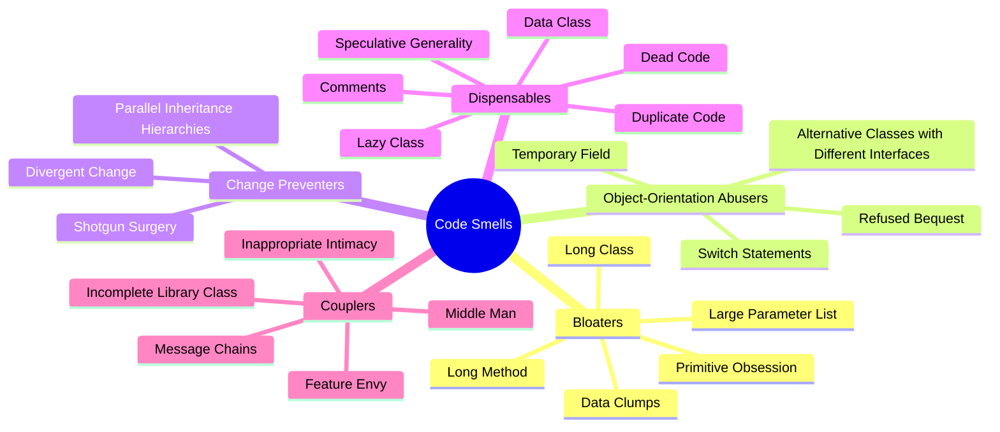
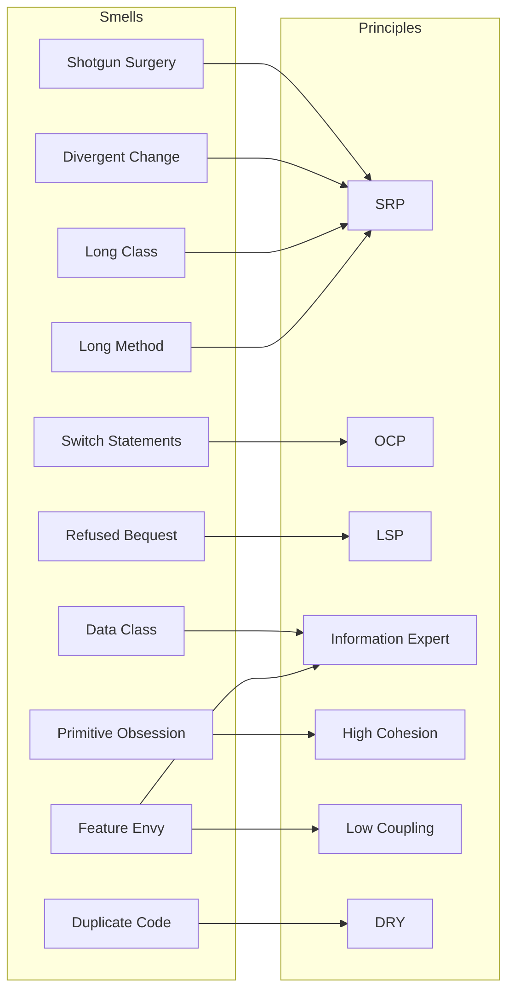

# Code Smells Catalog — Fowler's Refactoring Diagnostics

> [!quote] "A code smell is a hint that something has gone wrong in the design. It is not a bug — the code works. But it is a sign that the code will rot quickly." — Martin Fowler & Kent Beck

A **code smell** is a surface symptom that points to a deeper design problem. Smells are not bugs — code with smells still runs. They are *diagnostic*: each smell suggests a *refactoring* that, if applied, makes the code easier to change. This catalog is the diagnostic side of the [[refactoring-techniques]] note.

Related notes: [[refactoring-techniques]], [[case-study-refactoring]], [[design-smells-and-principles]], [[solid-principles]], [[common-pitfalls-and-anti-patterns]], [[oop-design-process]], [[identifying-classes-and-responsibilities]].

---

## The Six Smell Families (Fowler)



| Family | What it says | Meta-fix |
|---|---|---|
| **Bloaters** | Something has grown too big | Extract / split |
| **Object-Orientation Abusers** | OOP used wrongly | Replace conditionals with polymorphism; respect LSP |
| **Change Preventers** | One change touches many places | Reorganise responsibilities |
| **Dispensables** | Things that aren't pulling their weight | Delete / inline |
| **Couplers** | Classes too entangled | Hide internals, move behavior |

> [!tip] How to use this catalog
> Read code with this list in your head. When a section "feels off", find the matching smell, look up the refactoring in [[refactoring-techniques]], apply it. Repeat. This is the entire skill of refactoring.

---

## Quick-Reference Table

| Smell | Primary refactoring | See |
|---|---|---|
| Long Method | Extract Method | [[refactoring-techniques#Extract Method]] |
| Long Class | Extract Class | [[refactoring-techniques#Extract Class]] |
| Large Parameter List | Introduce Parameter Object | [[refactoring-techniques#Introduce Parameter Object]] |
| Primitive Obsession | Replace Data Value with Object | [[refactoring-techniques#Replace Data Value with Object]] |
| Data Clumps | Extract Class / Parameter Object | [[refactoring-techniques#Extract Class]] |
| Switch Statements | Replace Conditional with Polymorphism | [[refactoring-techniques#Replace Conditional with Polymorphism]] |
| Temporary Field | Introduce Null Object / Extract Class | [[refactoring-techniques#Extract Class]] |
| Refused Bequest | Replace Inheritance with Delegation | [[refactoring-techniques#Replace Inheritance with Delegation]] |
| Alternative Classes with Different Interfaces | Rename, Extract Interface | [[refactoring-techniques#Extract Interface (Protocol)]] |
| Divergent Change | Extract Class | [[refactoring-techniques#Extract Class]] |
| Shotgun Surgery | Move Method / Field | [[refactoring-techniques#Move Method]] |
| Parallel Inheritance Hierarchies | Move Method / Field | [[refactoring-techniques#Move Field]] |
| Comments | Extract Method / Rename | [[refactoring-techniques#Extract Method]] |
| Duplicate Code | Extract Method / Extract Superclass | [[refactoring-techniques#Extract Superclass]] |
| Lazy Class | Inline Class | [[refactoring-techniques#Inline Class]] |
| Data Class | Encapsulate Field / Move Method | [[refactoring-techniques#Encapsulate Field]] |
| Dead Code | Delete (no refactoring needed) | — |
| Speculative Generality | Inline Class / Remove Parameter | [[refactoring-techniques#Inline Class]] |
| Feature Envy | Move Method | [[refactoring-techniques#Move Method]] |
| Inappropriate Intimacy | Move Method / Hide Delegate | [[refactoring-techniques#Move Method]] |
| Message Chains | Hide Delegate | [[refactoring-techniques#Move Method]] |
| Middle Man | Remove Middle Man / Inline Method | [[refactoring-techniques#Inline Class]] |
| Incomplete Library Class | Introduce Foreign Method / Extension | — |

---

# 1. Bloaters

Bloaters are smells that **grow over time**. They are the most common smells because nothing forces you to stop growing a method or a class until it's too late.

## 1.1 Long Method

**Symptom.** A method that is more than ~10 lines and does several things at once.

**Root cause.** "I'll just add one more line here." Repeated for years.

**Why it's a problem.** Hard to name, hard to test, hard to reuse, hard to read. Each `if` deepens nesting.

**Python example (smelly).**
```python
def process_order(order: Order) -> Receipt:
    # validate
    if not order.customer:
        raise ValueError("no customer")
    if not order.items:
        raise ValueError("no items")
    if order.total() <= 0:
        raise ValueError("bad total")
    # compute tax
    tax = 0
    for item in order.items:
        if item.category == "book":
            tax += 0
        elif item.category == "food":
            tax += item.price * 0.05
        else:
            tax += item.price * 0.20
    # apply discount
    if order.customer.is_vip:
        discount = order.total() * 0.10
    else:
        discount = 0
    # charge
    if not charge_card(order.customer.card, order.total() + tax - discount):
        raise RuntimeError("charge failed")
    # send email
    body = f"Dear {order.customer.name}, your order #{order.id} is confirmed."
    send_email(order.customer.email, body)
    # return receipt
    return Receipt(order.id, order.total() + tax - discount, tax)
```

**Refactored.**
```python
def process_order(order: Order) -> Receipt:
    validate(order)
    tax = compute_tax(order)
    discount = compute_discount(order)
    charge(order, tax, discount)
    notify_customer(order)
    return Receipt(order.id, order.total() + tax - discount, tax)

def validate(order: Order) -> None:
    if not order.customer: raise ValueError("no customer")
    if not order.items:     raise ValueError("no items")
    if order.total() <= 0:  raise ValueError("bad total")

def compute_tax(order: Order) -> Money:
    return TaxPolicy().for_order(order)  # see Replace Conditional with Polymorphism

def compute_discount(order: Order) -> Money:
    return order.total() * 0.10 if order.customer.is_vip else Money(0)

def charge(order: Order, tax: Money, discount: Money) -> None:
    total = order.total() + tax - discount
    if not charge_card(order.customer.card, total):
        raise RuntimeError("charge failed")

def notify_customer(order: Order) -> None:
    send_email(order.customer.email,
               f"Dear {order.customer.name}, your order #{order.id} is confirmed.")
```

> [!tip] When is a method "too long"?
> Length is a proxy. The real test is: **can you give the method a single-sentence description that doesn't use the word "and"?** If not, extract until you can. See [[refactoring-techniques#Extract Method]].

## 1.2 Long Class (God Class)

**Symptom.** A class with 20+ methods or 200+ lines, doing many unrelated things.

**Root cause.** Convenience — "let me just add this here" rather than create a new class.

**Why it's a problem.** SRP violation — many reasons to change. Hard to test in isolation. Hard to subclass without dragging everything.

**Python example (smelly).**
```python
class OrderProcessor:
    def process(self, order): ...
    def validate(self, order): ...
    def compute_tax(self, order): ...
    def apply_discount(self, order): ...
    def charge_card(self, card, amount): ...
    def refund(self, order): ...
    def save_to_db(self, order): ...
    def load_from_db(self, order_id): ...
    def to_pdf(self, order): ...
    def to_html(self, order): ...
    def send_email(self, order): ...
    def generate_invoice_number(self): ...
    def archive(self, order): ...
    def export_csv(self, orders): ...
    # ... 30 more methods
```

**Refactored.** Split into `OrderValidator`, `TaxCalculator`, `PaymentGateway`, `OrderRepository`, `InvoiceRenderer`, `OrderMailer`. The remaining `OrderProcessor` becomes a thin orchestrator.

> [!note] See the full worked example in [[case-study-refactoring]].

## 1.3 Large Parameter List

**Symptom.** A function or method taking 4+ parameters, especially if several are often passed together.

**Root cause.** The method needs many pieces of data that belong together, but the author never made the grouping a type.

**Why it's a problem.** Hard to read, hard to call (positional bugs), hard to extend without breaking callers.

**Python example (smelly).**
```python
def create_invoice(customer_name: str, customer_email: str,
                   customer_address: str, items: list,
                   tax_rate: float, discount: float,
                   issue_date: datetime, due_date: datetime) -> Invoice: ...
```

**Refactored.** Group related parameters.
```python
@dataclass
class Customer:
    name: str
    email: str
    address: str

@dataclass
class InvoiceTerms:
    tax_rate: float
    discount: float
    issue_date: datetime
    due_date: datetime

def create_invoice(customer: Customer, items: list[Item],
                   terms: InvoiceTerms) -> Invoice: ...
```

See [[refactoring-techniques#Introduce Parameter Object]].

## 1.4 Primitive Obsession

**Symptom.** Using primitives (`str`, `int`, `float`, `dict`) for concepts that have invariants or behavior. Storing money as `float`, email as `str`, address as `dict`.

**Root cause.** "It's just a string." Until it isn't.

**Why it's a problem.** Invariants can't be enforced. Arithmetic on `float` money causes rounding bugs. No type-safety: passing a `user_id` where a `product_id` is expected compiles.

**Python example (smelly).**
```python
def transfer(from_account_id: str, to_account_id: str, amount: float) -> None:
    # what if amount is negative? what if ids are swapped?
    ...
```

**Refactored.**
```python
@dataclass(frozen=True)
class AccountId:
    value: str

@dataclass(frozen=True)
class Money:
    amount: Decimal
    currency: str
    def __post_init__(self):
        if self.amount < 0:
            raise ValueError("Money cannot be negative")

def transfer(src: AccountId, dst: AccountId, amount: Money) -> None: ...
```

> [!tip] Wrap primitives when they have **invariants** or **behavior**.
> `Email` (format), `Money` (non-negative, arithmetic), `PhoneNumber` (country code), `Percentage` (0-100), `UserId` vs `ProductId` (type safety). Don't wrap when there's no invariant — that's over-engineering.

## 1.5 Data Clumps

**Symptom.** The same group of parameters appears in many method signatures. `start_date, end_date`. `street, city, zip, country`. `host, port, username, password`.

**Root cause.** The grouping is a concept the author never named.

**Why it's a problem.** Duplication, easy to get the order wrong, hard to evolve.

**Python example (smelly).**
```python
def query_sales(start: datetime, end: datetime, region: str): ...
def query_returns(start: datetime, end: datetime, region: str): ...
def query_inventory(start: datetime, end: datetime, region: str): ...
```

**Refactored.**
```python
@dataclass(frozen=True)
class DateRange:
    start: datetime
    end: datetime
    def __post_init__(self):
        if self.end < self.start:
            raise ValueError("end before start")

@dataclass(frozen=True)
class Region:
    code: str  # e.g. "US-WEST"

def query_sales(range_: DateRange, region: Region): ...
def query_returns(range_: DateRange, region: Region): ...
```

> [!tip] The Data Clump rule
> If three parameters always appear together, they are *one* concept. Extract.

---

# 2. Object-Orientation Abusers

These smells happen when OOP features are used against their grain.

## 2.1 Switch Statements

**Symptom.** The same `if/elif` or `match` on the same type appears in multiple places.

**Root cause.** Behavior that should vary by type is expressed as conditionals on a type code.

**Why it's a problem.** Adding a new type requires finding every switch. Violates OCP — see [[solid-principles]].

**Python example (smelly).**
```python
def compute_tax(item: Item) -> Money:
    if item.category == "book":   return Money(0)
    elif item.category == "food": return item.price * 0.05
    elif item.category == "electronics": return item.price * 0.20
    else: return item.price * 0.10

def shipping_cost(item: Item) -> Money:
    if item.category == "book":   return Money(2)
    elif item.category == "food": return Money(5)
    elif item.category == "electronics": return Money(15)
    else: return Money(7)

def is_returnable(item: Item) -> bool:
    if item.category == "food": return False
    elif item.category == "electronics": return True
    ...
```

**Refactored.** Replace Conditional with Polymorphism — see [[refactoring-techniques#Replace Conditional with Polymorphism]].
```python
class ItemCategory(ABC):
    @abstractmethod
    def tax(self, price: Money) -> Money: ...
    @abstractmethod
    def shipping(self) -> Money: ...
    @abstractmethod
    def is_returnable(self) -> bool: ...

class Book(ItemCategory):
    def tax(self, price): return Money(0)
    def shipping(self): return Money(2)
    def is_returnable(self): return True

class Food(ItemCategory):
    def tax(self, price): return price * 0.05
    def shipping(self): return Money(5)
    def is_returnable(self): return False
# ...
```

> [!warning] `match` statements in Python 3.10+ are also switches
> A `match` on a type field is the same smell. Reach for polymorphism when the same `match` appears twice.

## 2.2 Temporary Field

**Symptom.** A field that is `None` most of the time, only set during a specific operation.

**Root cause.** A method needed several pieces of state and the author dumped them on the instance instead of passing them as parameters or making a separate object.

**Why it's a problem.** The object is in an inconsistent state most of the time. Null-checks spread.

**Python example (smelly).**
```python
class Report:
    def __init__(self):
        self.title = ""
        self.data = []
        self._filtered = None  # only used in generate()
        self._sorted = None    # only used in generate()

    def generate(self, filter_: Filter, sort: Sort):
        self._filtered = [d for d in self.data if filter_.matches(d)]
        self._sorted = sorted(self._filtered, key=sort.key)
        ...
```

**Refactored.** Extract the temporary state into its own object.
```python
@dataclass
class ReportContext:
    filtered: list[Row]
    sorted: list[Row]

class Report:
    def generate(self, filter_: Filter, sort: Sort) -> str:
        ctx = ReportContext(
            filtered=[d for d in self.data if filter_.matches(d)],
            sorted=[],
        )
        ctx.sorted = sorted(ctx.filtered, key=sort.key)
        return self._render(ctx)
```

## 2.3 Refused Bequest

**Symptom.** A subclass doesn't use most of what it inherits, or overrides methods to throw `NotImplementedError`.

**Root cause.** Inheritance used for implementation reuse rather than subtyping. LSP violation in spirit — see [[solid-principles]].

**Why it's a problem.** Subclass is not really a subtype; substituting breaks. Future maintainers misuse the inheritance.

**Python example (smelly).**
```python
class Stack(list):
    def push(self, x): self.append(x)
    def pop(self): return super().pop()
    # but inherits insert(), remove(), sort() — none make sense for a stack

class ReadOnlyList(list):
    def append(self, x): raise NotImplementedError
    def extend(self, xs): raise NotImplementedError
    def __setitem__(self, i, v): raise NotImplementedError
    # half the inherited API refuses the bequest
```

**Refactored.** Replace Inheritance with Delegation — see [[refactoring-techniques#Replace Inheritance with Delegation]].
```python
class Stack:
    def __init__(self): self._items: list = []
    def push(self, x): self._items.append(x)
    def pop(self): return self._items.pop()
    def __len__(self): return len(self._items)

class ReadOnlyList:
    def __init__(self, items: list): self._items = list(items)
    def __getitem__(self, i): return self._items[i]
    def __len__(self): return len(self._items)
    def __iter__(self): return iter(self._items)
```

## 2.4 Alternative Classes with Different Interfaces

**Symptom.** Two classes do the same job but with different method names and signatures. `EmailSender.send(...)`, `Notifier.dispatch(...)`, `Mailer.deliver(...)`.

**Root cause.** Different authors, different vocabularies, no shared interface.

**Why it's a problem.** Cannot swap implementations. Code calling one cannot be reused with the other.

**Python example (smelly).**
```python
class EmailSender:
    def send(self, to: str, subject: str, body: str) -> bool: ...

class SmsNotifier:
    def dispatch(self, recipient: str, message: str) -> None: ...

class PushMailer:
    def deliver(self, user_id: str, payload: dict) -> dict: ...
```

**Refactored.** Extract a Protocol with one consistent interface.
```python
class NotificationChannel(Protocol):
    def notify(self, recipient: str, message: str) -> bool: ...

class EmailChannel:
    def notify(self, recipient: str, message: str) -> bool: ...

class SmsChannel:
    def notify(self, recipient: str, message: str) -> bool: ...

class PushChannel:
    def notify(self, recipient: str, message: str) -> bool: ...
```

> [!tip] See [[refactoring-techniques#Extract Interface (Protocol)]].

---

# 3. Change Preventers

These smells make change hard: one logical change touches too many places.

## 3.1 Divergent Change

**Symptom.** One class changes for many *different* reasons (database migrations, UI tweaks, new business rules).

**Root cause.** SRP violation. Many stakeholders own the same class.

**Why it's a problem.** Each change risks breaking unrelated concerns. Merge conflicts.

**Python example (smelly).**
```python
class User:
    def full_name(self): ...        # domain
    def to_dict(self): ...          # serialization
    def to_html_row(self): ...      # presentation
    def save(self, db): ...         # persistence
    def send_welcome_email(self): ...  # delivery
```

**Refactored.** Extract Class — see [[refactoring-techniques#Extract Class]].
```python
class User:                     # domain only
    def full_name(self): ...

class UserSerializer:
    def to_dict(self, user): ...

class UserView:
    def to_html_row(self, user): ...

class UserRepository:
    def save(self, user, db): ...

class UserMailer:
    def send_welcome(self, user): ...
```

## 3.2 Shotgun Surgery

**Symptom.** One logical change requires touching many classes, each in a small way.

**Root cause.** A single responsibility was scattered across multiple classes.

**Why it's a problem.** Easy to miss a spot. Hard to test in isolation.

**Python example (smelly).** Adding a new field `loyalty_points` requires changes in:
- `User.__init__`
- `UserSerializer.to_dict`
- `UserView.to_html_row`
- `UserRepository.save`
- `UserExporter.to_csv`
- `UserReport.aggregate`

**Refactored.** Move all `loyalty_points` behavior into a `LoyaltyAccount` class associated with `User`. Now adding a new field touches one class.

```python
class LoyaltyAccount:
    def __init__(self, points: int = 0): self.points = points
    def add(self, n: int) -> None: self.points += n
    def to_dict(self) -> dict: ...
    def to_csv_row(self) -> str: ...

class User:
    def __init__(self, name: str):
        self.name = name
        self.loyalty = LoyaltyAccount()
```

## 3.3 Parallel Inheritance Hierarchies

**Symptom.** Whenever you add a subclass of `A`, you must also add a parallel subclass of `B`. The two hierarchies mirror each other.

**Root cause.** Behavior that should be polymorphic on one axis is split across two.

**Why it's a problem.** Doubling the work for every new type.

**Python example (smelly).**
```python
class Shape: ...
class Circle(Shape): ...
class Square(Shape): ...

class ShapeRenderer: ...
class CircleRenderer(ShapeRenderer): ...
class SquareRenderer(ShapeRenderer): ...
```

Adding `Triangle` requires editing *both* hierarchies.

**Refactored.** Move Method — see [[refactoring-techniques#Move Method]]. Make the renderer a Strategy parameterised by shape.
```python
class ShapeRenderer:
    def render(self, shape: Shape) -> None: ...  # branches on shape.type? no — polymorphism

class Circle:
    def render_with(self, r: Renderer) -> None:
        r.draw_circle(self.center, self.radius)

class Square:
    def render_with(self, r: Renderer) -> None:
        r.draw_square(self.topleft, self.size)

class Renderer(Protocol):
    def draw_circle(self, c, r): ...
    def draw_square(self, t, s): ...
```

Now adding a `Triangle` is one new class, no change to `Renderer`.

---

# 4. Dispensables

Things that aren't pulling their weight. Delete or merge.

## 4.1 Comments

**Symptom.** A method or block is preceded by a long comment explaining what it does.

**Root cause.** The code is unclear; the comment is a band-aid.

**Why it's a problem.** Comments rot. The code changes; the comment doesn't. Comments that explain *what* are usually redundant; comments that explain *why* are gold.

**Python example (smelly).**
```python
# This function takes an order and computes the total including tax
# but excludes shipping for VIP customers
def total(order):
    t = order.subtotal()
    if order.customer.is_vip:
        t = t * 1.20  # add 20% tax
        return t  # no shipping for VIPs
    else:
        t = t * 1.20
        return t + 5  # shipping
```

**Refactored.** Extract methods with intention-revealing names. Keep only "why" comments.
```python
def total(order: Order) -> Money:
    taxed = apply_tax(order.subtotal(), rate=0.20)
    return taxed if order.customer.is_vip else taxed + SHIPPING_FLAT_RATE

# 20% tax is hard-coded per EU requirement until Q3 migration.
```

> [!warning] Don't delete *all* comments
> Comments that explain *why* (regulatory context, non-obvious business rules, workarounds) are valuable. Delete comments that explain *what* — replace with better code.

## 4.2 Duplicate Code

**Symptom.** The same logic appears in two or more places, often copy-pasted with slight variations.

**Root cause.** Copy-paste programming. Fear of refactoring.

**Why it's a problem.** Bug fixes must be applied N times. They aren't.

**Python example (smelly).**
```python
def sales_total(orders):
    total = 0
    for o in orders:
        if o.status == "completed":
            total += o.amount
    return total

def returns_total(returns_):
    total = 0
    for r in returns_:
        if r.status == "completed":
            total += r.amount
    return total
```

**Refactored.** Extract Method / Extract Superclass.
```python
def sum_completed(transactions: list[Transaction]) -> Money:
    return sum(t.amount for t in transactions if t.status == "completed")

# or with a Protocol
class Transaction(Protocol):
    status: str
    amount: Money
```

## 4.3 Lazy Class

**Symptom.** A class that does almost nothing — a forwarding wrapper, a one-method class with no behavior.

**Root cause.** Speculative generality, or the result of past refactorings that left a husk.

**Why it's a problem.** Overhead without benefit.

**Python example (smelly).**
```python
class NameFormatter:
    @staticmethod
    def format(name: str) -> str:
        return name.title()
```

**Refactored.** Inline Class — see [[refactoring-techniques#Inline Class]]. Replace with a free function.
```python
def format_name(name: str) -> str:
    return name.title()
```

## 4.4 Data Class

**Symptom.** A class with only fields and getters/setters. No behavior.

**Root cause.** Anemic domain model. Behavior lives in services that operate on the data.

**Why it's a problem.** Violates Information Expert (GRASP) — see [[grasp-and-extra-principles]]. Behavior drifts away from data; bugs ensue.

**Python example (smelly).**
```python
@dataclass
class Order:
    items: list[Item]
    customer: Customer
    status: str

# behavior is elsewhere:
class OrderService:
    @staticmethod
    def subtotal(order: Order) -> Money: ...
    @staticmethod
    def cancel(order: Order) -> None: ...
    @staticmethod
    def ship(order: Order) -> None: ...
```

**Refactored.** Move behavior to the data class.
```python
class Order:
    def __init__(self, items: list[Item], customer: Customer):
        self.items = items
        self.customer = customer
        self.status = "new"

    def subtotal(self) -> Money:
        return sum(i.price for i in self.items)

    def cancel(self) -> None:
        if self.status != "new": raise RuntimeError("cannot cancel")
        self.status = "cancelled"

    def ship(self) -> None:
        if self.status != "new": raise RuntimeError("cannot ship")
        self.status = "shipped"
```

> [!warning] Not every data class is bad
> A `@dataclass` for a pure value object (`Money`, `DateRange`) is *correct*. The smell is a *domain* class with no behavior. See [[identifying-classes-and-responsibilities]].

## 4.5 Dead Code

**Symptom.** Variables, methods, classes, modules that are never called.

**Root cause.** Half-reverted features, commented-out code, abandoned experiments.

**Why it's a problem.** Confuses readers. Lies about the system.

**Python example (smelly).**
```python
def old_algorithm(x):
    """Deprecated, kept for reference."""
    ...

class LegacyUser:
    """We don't use this anymore but I'm scared to delete it."""
    ...

# def experimental_feature():
#     ...
```

**Refactored.** Delete it. Git remembers.

> [!tip] Enable linting
> `ruff` and `vulture` find dead code automatically. Make them part of CI.

## 4.6 Speculative Generality

**Symptom.** Abstractions, hooks, parameters, base classes that exist "in case we need them". Only one concrete use exists.

**Root cause.** "Design for reuse" run amok. YAGNI violated — see [[design-smells-and-principles]].

**Why it's a problem.** Indirection cost without payoff. The predicted future never arrives.

**Python example (smelly).**
```python
class AbstractRepository(ABC, Generic[T, ID]):
    @abstractmethod
    def get(self, id: ID) -> T: ...
    @abstractmethod
    def save(self, entity: T) -> None: ...
    @abstractmethod
    def delete(self, id: ID) -> None: ...
    @abstractmethod
    def list(self, filter_: Optional[Filter] = None) -> list[T]: ...
    # ... 8 more abstract methods

class InMemoryUserRepository(AbstractRepository[User, UserId]):
    # implements all 12 methods, only `get` and `save` are ever called
    ...
```

**Refactored.** Delete the abstract base. Keep the concrete class. Extract an interface only when a second implementation arrives.
```python
class UserRepository:
    def get(self, id: UserId) -> User: ...
    def save(self, user: User) -> None: ...
```

---

# 5. Couplers

Classes that know too much about each other.

## 5.1 Feature Envy

**Symptom.** A method on class `A` spends most of its time asking `B` for data.

**Root cause.** Behavior is on the wrong class. The data lives on `B`; the behavior should too.

**Why it's a problem.** Coupling. If `B`'s fields change, `A` breaks.

**Python example (smelly).**
```python
class Invoice:
    def __init__(self, customer, items):
        self.customer = customer
        self.items = items

class InvoicePrinter:
    def to_html(self, invoice: Invoice) -> str:
        rows = "".join(
            f"<tr><td>{i.name}</td><td>{i.price}</td></tr>"
            for i in invoice.items
        )
        return f"<h1>Invoice for {invoice.customer.name}</h1><table>{rows}</table>"
```

`InvoicePrinter` is envious of `Invoice`'s data. The printing logic *belongs* to `Invoice` (or to a `InvoiceView` that `Invoice` exposes — see below).

**Refactored.** Move Method — see [[refactoring-techniques#Move Method]].
```python
class Invoice:
    ...
    def to_html(self) -> str:
        rows = "".join(
            f"<tr><td>{i.name}</td><td>{i.price}</td></tr>"
            for i in self.items
        )
        return f"<h1>Invoice for {self.customer.name}</h1><table>{rows}</table>"
```

> [!tip] When Feature Envy is *not* a smell
> View-layer classes (renderers, serializers) are *supposed* to envy the data. The fix is to keep view and model separated — see [[solid-principles#S — Single Responsibility Principle (SRP)]]. Rule of thumb: envy is fine if it's *one direction* (view → model) and *bounded* (the model doesn't reach back).

## 5.2 Inappropriate Intimacy

**Symptom.** Two classes reach into each other's internals. `A` reads `B._fields` directly; `B` calls `A._private_method`.

**Root cause.** No encapsulation boundary. Classes evolved together without a clean interface.

**Why it's a problem.** Changes to either break the other. See [[encapsulation]].

**Python example (smelly).**
```python
class Engine:
    def __init__(self):
        self._rpm = 0
        self._temperature = 20

class Car:
    def __init__(self, engine: Engine):
        self.engine = engine
    def drive(self):
        self.engine._rpm = 3000  # reaching into internals
        if self.engine._temperature > 100:
            self._overheat_alarm()
```

**Refactored.** Expose intention-revealing methods.
```python
class Engine:
    def __init__(self):
        self._rpm = 0
        self._temperature = 20
    def accelerate(self, target_rpm: int) -> None:
        self._rpm = target_rpm
        self._temperature = self._compute_temp()
    def is_overheating(self) -> bool:
        return self._temperature > 100

class Car:
    def __init__(self, engine: Engine): self.engine = engine
    def drive(self):
        self.engine.accelerate(3000)
        if self.engine.is_overheating():
            self._overheat_alarm()
```

## 5.3 Message Chains

**Symptom.** `a.b().c().d().e()` — a client navigates through several objects to get what it wants.

**Root cause.** The client knows the structure of the object graph. Structural coupling.

**Why it's a problem.** Changing any link in the chain breaks the client.

**Python example (smelly).**
```python
discount = customer.getAccount().getPlan().getDiscountRate()
```

**Refactored.** Hide Delegate — see [[refactoring-techniques#Move Method]].
```python
class Customer:
    def discount_rate(self) -> float:
        return self._account.plan.discount_rate

discount = customer.discount_rate()
```

> [!note] Law of Demeter
> This smell is also called a **Law of Demeter violation**. The principle: "only talk to your immediate friends". A method `m` on `O` may call methods on: `O` itself, `m`'s parameters, objects `m` creates, `O`'s direct components. Anything else is a smell.

## 5.4 Middle Man

**Symptom.** A class whose methods are all `return self._delegate.method(...)`.

**Root cause.** Over-application of delegation. Probably a botched "hide delegate" or an unwanted interface layer.

**Why it's a problem.** Indirection without behavior. Reads go through useless layers.

**Python example (smelly).**
```python
class UserManager:
    def __init__(self, repo: UserRepository): self._repo = repo
    def get(self, id): return self._repo.get(id)
    def save(self, user): return self._repo.save(user)
    def delete(self, id): return self._repo.delete(id)
    def list(self): return self._repo.list()
```

**Refactored.** Remove Middle Man — let clients talk to the repo directly. Or, if `UserManager` adds behavior (validation, caching, events), keep it and *only* delegate the rest.
```python
class UserManager:
    def __init__(self, repo: UserRepository, validator: UserValidator):
        self._repo = repo
        self._validator = validator
    def save(self, user: User) -> None:
        self._validator.validate(user)  # real behavior
        self._repo.save(user)

# clients that just need CRUD talk to UserRepository directly
```

## 5.5 Incomplete Library Class

**Symptom.** You want a method on a library class, but can't modify it.

**Root cause.** Library authors didn't anticipate your use case. (Common, expected.)

**Why it's a problem.** Either you copy-paste the workaround everywhere, or you live without the method.

**Python example (smelly).**
```python
# everywhere you need this:
def parse_iso(s: str) -> datetime:
    return datetime.strptime(s, "%Y-%m-%dT%H:%M:%S")
```

**Refactored.** Use a free function (a "foreign method" in Fowler's terms), or a thin wrapper.
```python
# As a free function near where it's used
def parse_iso(s: str) -> datetime:
    return datetime.strptime(s, "%Y-%m-%dT%H:%M:%S")

# Or extend the library class with a subclass
class RichDateTime(datetime):
    @classmethod
    def parse_iso(cls, s: str) -> "RichDateTime":
        return cls.strptime(s, "%Y-%m-%dT%H:%M:%S")
```

> [!tip] In Python, prefer free functions or a small extension module
> Subclassing built-ins (`datetime`, `str`, `dict`) is rarely worth it. Free functions compose better.

---

## The Smell → Principle Map



---

## Smell-Spotting Drills (Practice)

> [!example] Train your eye

### Drill 1 — Name the smell
```python
class Account:
    def __init__(self):
        self._balance = 0
        self._last_audit = None  # only used during year-end close
    def deposit(self, amount): self._balance += amount
    def withdraw(self, amount): self._balance -= amount
    def year_end_close(self, auditor):
        self._last_audit = auditor.run(self)
```
**Answer:** Temporary Field (`_last_audit`).

### Drill 2 — Name the smell
```python
def total_spent(user):
    return sum(t.amount for t in user.get_transactions() if t.get_category().get_name() == "food")
```
**Answer:** Message Chains + Primitive Obsession (`"food"` string).

### Drill 3 — Name the smell
```python
class PDFExporter:
    def export(self, doc):
        # export header
        ...
        # export body
        ...
        # export footer
        ...
        # combine and return
        ...
```
**Answer:** Long Method + Comments (as section headers — extract methods).

### Drill 4 — Name the smell
```python
class EmptyList(list):
    def __init__(self):
        super().__init__()
    def append(self, x): pass  # always empty
    def __setitem__(self, i, v): pass
    def extend(self, xs): pass
    # inherits __getitem__, __iter__, __len__, __contains__, etc.
```
**Answer:** Refused Bequest.

### Drill 5 — Name the smell
```python
class OrderService:
    def process(self, order):
        validate(order)
        if order.customer.account.balance < order.total():
            decline(order)
        else:
            charge(order.customer.account, order.total())
            order.customer.account.balance -= order.total()
            order.customer.account.last_charge = datetime.now()
            order.customer.account.notify_owner()
            confirm(order)
```
**Answer:** Feature Envy on `order.customer.account`.

### Drill 6 — Name the smell
```python
class PaymentGateway:
    def charge(self, amount, currency, card, cvv, exp, name, address1, address2, city, state, zip, country): ...
```
**Answer:** Long Parameter List + Primitive Obsession + Data Clump (card details).

### Drill 7 — Fix one
Pick Drill 5 and refactor. Move behavior from `OrderService` to `Account` so that the service becomes a thin orchestrator.

### Drill 8 — Code review simulation
Find a 200-line file in your own code. Identify three smells using this catalog. For each, write down the smell name, the lines, and the refactoring you would apply. See [[refactoring-techniques]] for the recipes.

---

## Key Takeaways

> [!note] If you remember nothing else

1. **Smells are symptoms, not bugs.** Code with smells runs. Smells predict future pain.
2. **Five families.** Bloaters, OO Abusers, Change Preventers, Dispensables, Couplers.
3. **Each smell has a primary refactoring.** Learn the pairing — see [[refactoring-techniques]].
4. **Smells compound.** A Long Method often contains Switch Statements and Primitive Obsession. Refactor one at a time.
5. **Don't refactor without tests.** Smells are safe to *spot*; refactoring is safe only with a safety net.
6. **Some smells are sometimes OK.** A `@dataclass` for a value object is a "Data Class" smell — and that's correct. Context matters.
7. **Comments that explain *why* are gold.** Comments that explain *what* are a smell.
8. **Feature Envy is the most common smell in beginner code.** Watch for it.
9. **The Law of Demeter is your friend.** `a.b().c().d()` is almost always wrong.
10. **When you see one smell, look for two more.** Smells travel in packs.

---

> [!quote] "Smells are the code's way of telling you it is in pain. Listen." — Kent Beck

The catalog is your dictionary. The skill is recognising the smells in real code, fast. That skill is built by reading *and* refactoring — see [[case-study-refactoring]] for an end-to-end example.

## Cross-References

- [[refactoring-techniques]] — the recipes to fix each smell
- [[case-study-refactoring]] — worked end-to-end example
- [[design-smells-and-principles]] — higher-level design smells (rigidity, fragility…)
- [[solid-principles]] — the principles the smells violate
- [[grasp-and-extra-principles]] — Information Expert, Low Coupling, High Cohesion
- [[common-pitfalls-and-anti-patterns]] — Python-specific anti-patterns
- [[identifying-classes-and-responsibilities]] — preventing smells at design time
- [[oop-design-process]] — the upstream process
