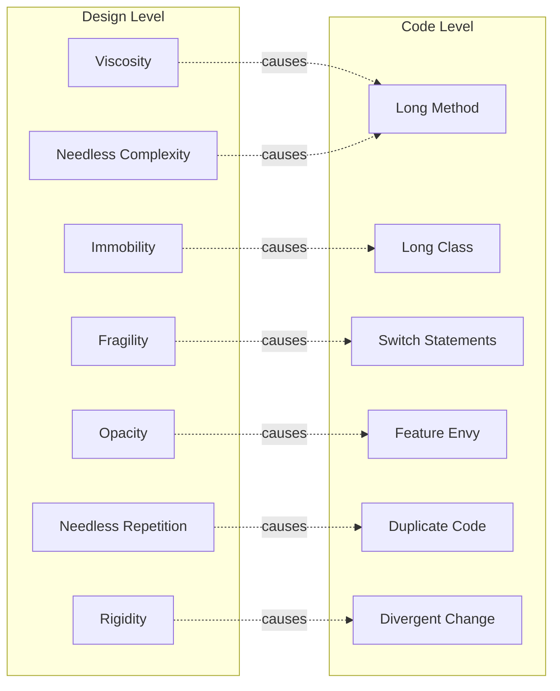
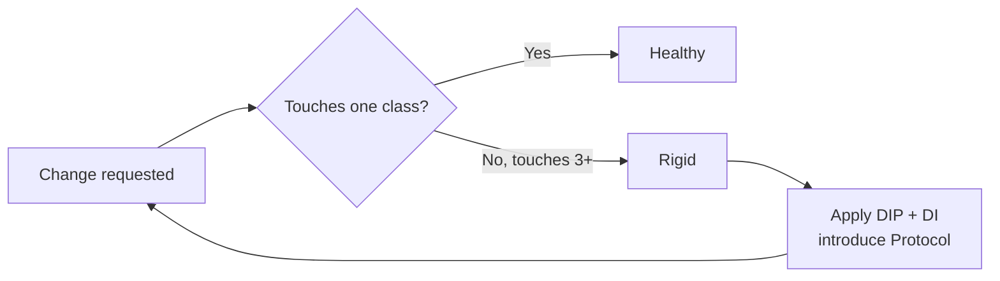
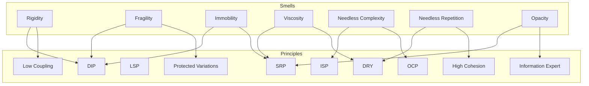
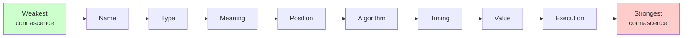
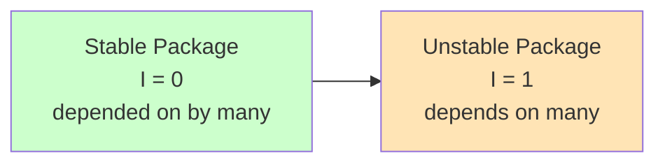
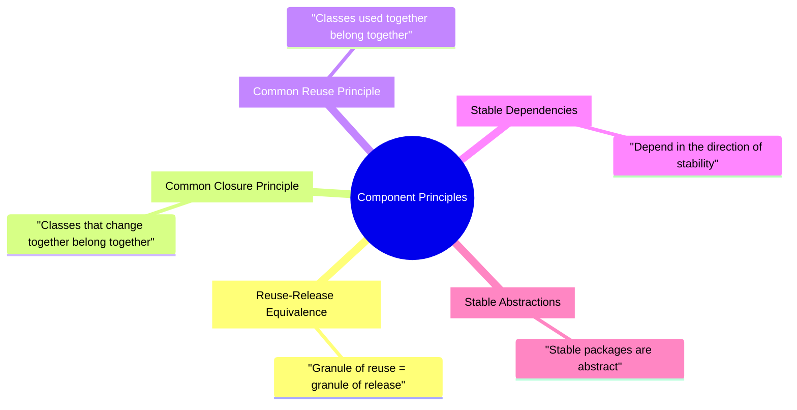
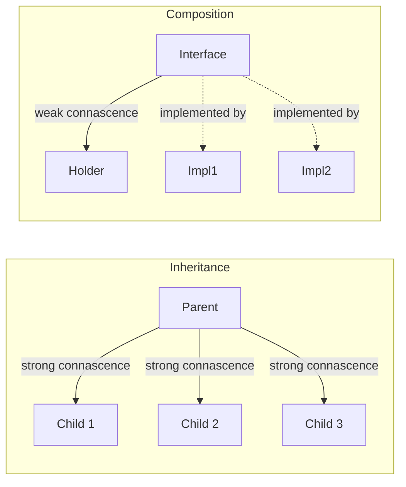
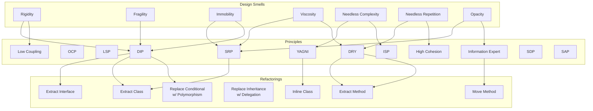

# Design Smells & Principles — The Higher-Level View

> [!quote] "A design smell is the result of a poor design decision. A code smell is the surface symptom. Design smells are what code smells grow from." — Robert C. Martin

[[code-smells-catalog]] catalogues **code smells** — symptoms you see in a single class or method. This note catalogues **design smells** — symptoms you see across an entire architecture. Design smells are subtler, more expensive, and harder to fix. They are the smells that, left untreated, *cause* the code smells.

Related notes: [[code-smells-catalog]], [[refactoring-techniques]], [[case-study-refactoring]], [[solid-principles]], [[grasp-and-extra-principles]], [[composition-over-inheritance]], [[dependency-injection]], [[oop-design-process]].

---

## The Two Levels of Smell



A **design smell** is a *design-level* symptom: "every change is painful". A **code smell** is a *code-level* symptom: "this method is too long". One design smell produces many code smells. Fixing code smells without addressing the design smell is whack-a-mole.

---

## The Seven Design Smells (Robert Martin)

From Robert C. Martin's *Agile Software Development: Principles, Patterns, and Practices* (2002).

| # | Smell | One-liner | Pain |
|---|---|---|---|
| 1 | **Rigidity** | Hard to change — every change cascades | "Just one more field" takes a week |
| 2 | **Fragility** | Changes break unrelated things | "I touched `User` and now invoicing crashes" |
| 3 | **Immobility** | Hard to reuse — code is tangled with its context | "I'd love to use that validator, but it imports the database" |
| 4 | **Viscosity** | Doing the wrong thing is easier than the right thing | "It's quicker to copy-paste than to refactor" |
| 5 | **Needless Complexity** | Over-design for hypothetical needs | "We have 14 factories for 2 implementations" |
| 6 | **Needless Repetition** | Same logic everywhere | "Find-and-replace programming" |
| 7 | **Opacity** | Code is hard to understand | "I wrote this; I don't recognise it" |

> [!tip] Design smells > code smells for long-term health
> Code smells are local. Design smells are systemic. You can refactor code smells one at a time; design smells require architectural thinking.

### 1. Rigidity

**Definition.** The software is hard to change because every change forces many other changes.

**Symptom.** Estimating a one-line feature takes days. Each change reveals new dependencies.

**Root cause.** High coupling. Classes know too much about each other's internals.

**Smells it produces.** [[code-smells-catalog#3.1 Divergent Change|Divergent Change]], [[code-smells-catalog#3.2 Shotgun Surgery|Shotgun Surgery]], [[code-smells-catalog#5.3 Message Chains|Message Chains]].

**Remedy.** Decouple. Introduce interfaces (Protocols), use [[dependency-injection]], apply [[refactoring-techniques#Move Method|Move Method]] to put behavior with its data.



### 2. Fragility

**Definition.** Changes break unrelated parts of the system.

**Symptom.** "I added a column to the user table and the report exporter crashed."

**Root cause.** Hidden coupling. Code that *appears* independent shares an implicit assumption (a magic string, a positional index, a side effect).

**Smells it produces.** [[code-smells-catalog#1.4 Primitive Obsession|Primitive Obsession]], [[code-smells-catalog#5.2 Inappropriate Intimacy|Inappropriate Intimacy]], [[code-smells-catalog#4.2 Duplicate Code|Duplicate Code]].

**Remedy.** Encapsulate. Replace primitives with value objects (so invariants are enforced). Move shared logic to one place. Add tests for the implicit assumptions.

> [!danger] Fragility is the worst smell
> Rigidity slows you down. Fragility *breaks you in production*. Treat fragility as a P0.

### 3. Immobility

**Definition.** The code could be reused, but extracting it is too painful.

**Symptom.** "I'd love to use that PDF generator, but it imports the database, the email client, and the logging framework."

**Root cause.** Layers violated. Domain code depends on infrastructure. Code mixes responsibilities.

**Smells it produces.** [[code-smells-catalog#1.2 Long Class|Long Class]], [[code-smells-catalog#2.1 Switch Statements|Switch Statements]] (when type is hardcoded).

**Remedy.** Apply [[solid-principles#D — Dependency Inversion Principle (DIP)|DIP]]. Domain code should depend on Protocols, not on `sqlite3` or `smtplib`. See the `OrderProcessor` case study — [[case-study-refactoring]].

### 4. Viscosity

**Definition.** Doing the wrong thing is easier than doing the right thing.

**Two forms.**
- **Design viscosity**: refactoring is harder than copy-pasting.
- **Environment viscosity**: the build is slow, the test suite is slow, the deploy is painful — so people avoid the right path.

**Symptom.** Code review: "Why did you copy-paste?" Answer: "The other option required editing 4 files and running 200 tests."

**Root cause.** Refactorings are too risky (no tests) or too slow (no tooling). Or the design is so tangled that any change is risky.

**Smells it produces.** [[code-smells-catalog#4.2 Duplicate Code|Duplicate Code]], [[code-smells-catalog#4.5 Dead Code|Dead Code]] (people add new code rather than find existing).

**Remedy.** Make the right thing easy. Improve test speed. Improve tooling. Refactor the design so the right path is the *default*.

> [!tip] Viscosity is often a tooling problem
> A 10-minute test suite breeds viscosity. A 2-second test suite breeds refactoring. Invest in fast tests.

### 5. Needless Complexity

**Definition.** The design includes elements that aren't currently useful. Speculative generality, premature abstraction.

**Symptom.** `AbstractRepositoryFactoryFactory`. Twelve design patterns in 200 lines of code. "We might need this someday."

**Root cause.** "Design for reuse" run amok. Fear of being wrong about the future. Pattern obsession.

**Smells it produces.** [[code-smells-catalog#4.6 Speculative Generality|Speculative Generality]], [[code-smells-catalog#4.3 Lazy Class|Lazy Class]].

**Remedy.** YAGNI. Delete the abstraction until the second concrete use case forces it. See [[refactoring-techniques#3. Inline Class|Inline Class]].

```python
# Needless complexity
class AbstractUserRepository(ABC, Generic[T, ID]):
    @abstractmethod
    def get(self, id: ID) -> T: ...
    @abstractmethod
    def save(self, entity: T) -> None: ...
    @abstractmethod
    def delete(self, id: ID) -> None: ...
    @abstractmethod
    def list(self) -> list[T]: ...
    # ... 8 more abstract methods

class InMemoryUserRepository(AbstractUserRepository[User, UserId]):
    # implements all 12 methods, only `get` and `save` are ever called
    ...

# Needful simplicity
class UserRepository:
    def get(self, id: UserId) -> User: ...
    def save(self, user: User) -> None: ...
```

### 6. Needless Repetition

**Definition.** The same logic appears in many places. Copy-paste programming.

**Symptom.** "Find all occurrences of `compute_tax`" returns 17 hits.

**Root cause.** Viscosity. Fear of refactor. Lack of abstractions.

**Smells it produces.** [[code-smells-catalog#4.2 Duplicate Code|Duplicate Code]].

**Remedy.** [[refactoring-techniques#1. Extract Method|Extract Method]], [[refactoring-techniques#21. Extract Superclass|Extract Superclass]], [[refactoring-techniques#22. Extract Interface (Protocol)|Extract Protocol]].

> [!note] DRY vs WET
> DRY = "Don't Repeat Yourself". WET = "Write Everything Twice" or "We Enjoy Typing". The rule of three: tolerate the first duplication, refactor at the third. Two occurrences might be coincidence; three is a pattern.

### 7. Opacity

**Definition.** The code is hard to read, hard to understand, hard to reason about.

**Symptom.** The author doesn't recognise their own code three months later.

**Root cause.** Poor names, missing types, magic numbers, leaky abstractions, comments that explain *what* not *why*.

**Smells it produces.** [[code-smells-catalog#1.1 Long Method|Long Method]], [[code-smells-catalog#4.1 Comments|Comments]], [[code-smells-catalog#1.4 Primitive Obsession|Primitive Obsession]].

**Remedy.** Rename. Extract methods with intention-revealing names. Replace primitives with named value objects. See [[refactoring-techniques#1. Extract Method|Extract Method]].

> [!quote] "Programs must be written for people to read, and only incidentally for machines to execute." — Harold Abelson and Gerald Jay Sussman, SICP

---

## Design Smells → SOLID/GRASP Violations



| Design smell | Most-violated principle(s) | See |
|---|---|---|
| Rigidity | DIP, Low Coupling | [[solid-principles#D — Dependency Inversion Principle (DIP)]], [[grasp-and-extra-principles]] |
| Fragility | DIP, Protected Variations | [[solid-principles#D — Dependency Inversion Principle (DIP)]] |
| Immobility | SRP, DIP | [[solid-principles#S — Single Responsibility Principle (SRP)]] |
| Viscosity | SRP, DRY | [[solid-principles#S — Single Responsibility Principle (SRP)]] |
| Needless Complexity | ISP, OCP (over-applied) | [[solid-principles#I — Interface Segregation Principle (ISP)]] |
| Needless Repetition | DRY, High Cohesion | [[grasp-and-extra-principles]] |
| Opacity | SRP, Information Expert | [[solid-principles#S — Single Responsibility Principle (SRP)]] |

> [!tip] The diagnostic chain
> Smell → principle → refactoring. Design smell → SOLID/GRASP → [[refactoring-techniques|refactoring recipe]].

---

## The Principle of Sustainable Software: "Design for Change, Not for Reuse"

> [!quote] "Reuse is not the goal. The goal is to make change easy." — paraphrased from Sandi Metz

A common misreading of SOLID is "design so code can be reused". That's how we get Needless Complexity. The correct reading is:

> **Design so that future *changes* are local, predictable, and cheap.**

Reusability is a *consequence* of good design, not a goal. If you design for change, reuse emerges naturally. If you design for reuse, you get abstractions for futures that never arrive.

### What "design for change" looks like

| Change type | Design response |
|---|---|
| New variant (new payment method, new tax region) | Strategy + Protocol |
| New step in a workflow | Observer |
| New type with shared algorithm | Template Method |
| New format (CSV, JSON, XML) | Visitor or Strategy |
| New configuration | Inject it as a parameter |
| New performance requirement | Hide behind an interface so the impl can swap |

> [!warning] Don't design for *every* change
> Design for the *likely* change. "What if we swap the database?" is unlikely. "What if we add a new tax region?" is likely. Invest in abstractions for the likely; leave the rest until it arrives.

---

## Connascence — A Rigorous Theory of Coupling

> [!quote] "Connascence is a more rigorous framework than 'coupling'. It names the *ways* in which two things are coupled." — Meilir Page-Jones

**Connascence** (Page-Jones, 1996) is the relationship between two software elements A and B such that if you change A, you may need to change B to maintain correctness. Page-Jones catalogues **eight types**, ordered from weakest (best) to strongest (worst).



### The Eight Types

| Type | Definition | Python example |
|---|---|---|
| **Connascence of Name** | A and B agree on a name | `order.subtotal()` — both caller and callee agree on the name `subtotal` |
| **Connascence of Type** | A and B agree on a type | `def f(x: int)` — caller passes `int`, callee expects `int` |
| **Connascence of Meaning** | A and B agree on the meaning of a value | `if status == 1:` — both agree `1` means "active" |
| **Connascence of Position** | A and B agree on the position of values | `def f(name, age): ...` called as `f("Alice", 30)` |
| **Connascence of Algorithm** | A and B must use the same algorithm | A encrypts with AES-256, B must decrypt with AES-256 |
| **Connascence of Timing** | A and B agree on the timing of operations | A calls `init()` then `run()` — order matters |
| **Connascence of Value** | A and B must agree on a particular value | A sets `MIN_PASSWORD = 8`, B validates `len >= 8` |
| **Connascence of Execution** | A and B must run in the same thread/process | A mutates shared state, B reads it — must be synchronised |

> [!tip] The strength order
> The order matters. Weaker connascence is *better*. Name > Type > Meaning > Position > Algorithm > Timing > Value > Execution.

### Examples and Refactorings

#### Connascence of Position → Connascence of Name

```python
# Smelly — positional
def create_user(name, age, email, role, country): ...
create_user("Alice", 30, "alice@x.com", "admin", "US")

# Better — keyword
create_user(name="Alice", age=30, email="alice@x.com",
            role="admin", country="US")

# Best — value object
@dataclass
class UserSpec:
    name: str
    age: int
    email: Email
    role: Role
    country: Country
create_user(UserSpec(...))
```

#### Connascence of Meaning → Connascence of Type

```python
# Smelly — magic number
if user.status == 1:  # 1 means "active"
    ...

# Better — named constant
if user.status == UserStatus.ACTIVE.value:
    ...

# Best — type (enum)
class UserStatus(Enum):
    ACTIVE = auto()
    INACTIVE = auto()

if user.status == UserStatus.ACTIVE:
    ...
```

#### Connascence of Value → Connascence of Name

```python
# Smelly — two places must agree on the same value
MIN_PASSWORD_LENGTH = 8  # in constants.py

def validate_password(pw: str) -> bool:
    return len(pw) >= 8  # duplicated literal — change one, miss the other

# Better — single source of truth
def validate_password(pw: str) -> bool:
    return len(pw) >= MIN_PASSWORD_LENGTH
```

### Rules of connascence

Page-Jones gives two rules:

1. **Minimise connascence overall.** Strive for weaker forms.
2. **Connascence at a distance is worse than connascence locally.** Two classes in the same module can afford stronger connascence than two classes across module boundaries.

> [!tip] Connascence across boundaries
> Inside a module: positional args are fine (close, refactorable). Across a public API: keyword args, named constants, value objects (the boundary is harder to refactor).

### Connascence vs Coupling

"Coupling" is a binary: A is coupled to B or not. "Connascence" is richer: A is coupled to B *by name*, *by type*, *by position*, etc. The richer vocabulary lets you reason about *which kind* of coupling hurts.

---

## Stable Dependencies Principle (SDP)

> [!quote] "Depend in the direction of stability." — Robert C. Martin

**Definition.** A package should depend only on packages that are *more stable* than itself.

**Why.** If a stable package depends on an unstable one, the unstable package's churn forces changes in the stable one — defeating the stability.

### What makes a package "stable"?

Stability here means *hard to change* — not "good". It's measured by:

- **Ce (efferent couplings)**: how many packages this package depends on.
- **Ca (afferent couplings)**: how many packages depend on this package.
- **I (instability) = Ce / (Ce + Ca)**.

| I = 0 | I = 1 |
|---|---|
| Depends on nothing, depended on by many | Depends on many, depended on by nobody |
| Maximally stable | Maximally unstable |
| "Leaf" / "foundation" | "Leaf" / "leaf of the call tree" |



> [!warning] Don't depend on unstable things
> If your domain layer imports `flask`, you depend on something volatile. The domain should be stable; infrastructure should depend on the domain, not the other way around. This is DIP at the package level.

---

## Stable Abstractions Principle (SAP)

> [!quote] "A package should be as abstract as it is stable." — Robert C. Martin

**Definition.** Stable packages should be *abstract* (interfaces, abstract classes). Unstable packages should be *concrete* (implementations).

**Why.** A stable concrete package is a nightmare: you can't change it (it's stable) but you can't extend it without changing it (it's concrete). A stable abstract package is the best of both: callers depend on the abstraction; implementers extend it.

```mermaid
flowchart TB
    subgraph Stable & Abstract
      Protocols[PaymentGateway<br/>TaxPolicy<br/>Repository protocols]
    end
    subgraph Unstable & Concrete
      Impl[StripeGateway<br/>FlatRateTaxPolicy<br/>SqliteRepository]
    end
    Caller[Caller code] --> Protocols
    Protocols <|.. Impl
```

| | Stable | Unstable |
|---|---|---|
| **Abstract** | ✅ Best — extendable, unchanging | ⚠️ Rare — abstract + changing is confusing |
| **Concrete** | ❌ Worst — can't change, can't extend | ✅ Fine — change as needed |

### The component principles trilogy

Together with the **Reuse-Release Equivalence Principle** (REP — "reuse only what's released as a unit"), SDP and SAP form the *component cohesion/coupling principles*:



---

## "Composition Over Inheritance" as Design-Smell Avoidance

> [!quote] "Favor object composition over class inheritance." — GoF, 1994

Why is composition preferred? Because inheritance is the **strongest form of connascence**. A subclass is connascent with its parent on:

- **Name** (every inherited method name)
- **Type** (the subclass *is* a parent)
- **Algorithm** (subclass may call super)
- **Meaning** (subclass may depend on parent's invariants)
- **Execution** (subclass may depend on parent's side effects)

Composition is connascent only on:

- **Name** (the method names of the collaborator's interface)
- **Type** (the interface type)

That's it. Change the collaborator's *internals* and the composing class is unaffected.



> [!tip] Use the connascence test
> Before choosing inheritance, ask: "What kind of connascence am I taking on?" If the answer is "Algorithm + Meaning + Execution + Type + Name", you probably want composition. See [[composition-over-inheritance]].

---

## The Smells → Principles → Remedies Map



---

## The Diagnostic Discipline

> [!example] How to use this note in practice

1. **Feel the pain.** "This change is taking too long." / "This bug shouldn't have happened." / "I can't reuse this." / "It's easier to copy-paste." / "I don't understand my own code."
2. **Name the design smell.** Use the table at the top.
3. **Identify the violated principle.** Use the Smells → Principles map.
4. **Apply the principle.** This usually means introducing an abstraction.
5. **Refactor toward the abstraction.** Use the [[refactoring-techniques]] recipes.
6. **Verify.** Tests stay green. The change you were trying to make is now easy.

### Worked example

> *Pain*: Adding a new tax region takes a week of edits across 6 files.
> *Design smell*: Rigidity.
> *Violated principle*: OCP + DIP.
> *Abstraction*: `TaxPolicy` Protocol.
> *Refactorings*: [[refactoring-techniques#6. Replace Conditional with Polymorphism|Replace Conditional with Polymorphism]] + [[refactoring-techniques#22. Extract Interface (Protocol)|Extract Interface]].
> *Result*: adding a region = 1 new class + 1 dict entry. No edits to existing classes. ✓

> See [[case-study-refactoring]] for this exact arc, end-to-end.

---

## Common Design Smells in the Wild

> [!example] Pattern-spotting in real codebases

### Smell: "Singletonitis"
**Design smell:** Needless Complexity + Viscosity.
**Symptom:** Every service is a singleton. Tests can't isolate state.
**Cause:** Misunderstood DI. "I need one instance, so I'll make it a singleton."
**Cure:** Use [[dependency-injection]]. Single instance is configured at composition root, not enforced by the class.

### Smell: "BaseBean"
**Design smell:** Rigidity + Fragility.
**Symptom:** Everything inherits from `BaseBean` / `BaseModel` / `BaseController`. The base class accumulates 50 methods.
**Cause:** Inheritance used for code sharing across unrelated classes.
**Cure:** Mixins (limited) or composition. See [[composition-over-inheritance]].

### Smell: "Anemic Domain"
**Design smell:** Immobility + Opacity.
**Symptom:** `User` has only fields. `UserService` has all behavior. The domain is data; the services are behavior. The two drift.
**Cause:** "Services are cleaner" / procedural thinking in OOP clothes.
**Cure:** Move behavior to the data. Information Expert (GRASP).

### Smell: "Layer Leak"
**Design smell:** Fragility + Immobility.
**Symptom:** Database types appear in the UI. HTTP status codes in the domain.
**Cause:** Layers not enforced.
**Cure:** DIP + repository pattern. See [[oop-design-process#Domain-Driven Design (DDD) Primer|DDD primer]].

### Smell: "God Config"
**Design smell:** Viscosity + Opacity.
**Symptom:** A 500-line `config.py` that everything imports.
**Cause:** Configuration treated as a global.
**Cure:** Inject configuration. Pass values, not modules.

### Smell: "Premature Library"
**Design smell:** Needless Complexity.
**Symptom:** A "reusable" library extracted from a single project, used by nobody else, breaks the original project's pace.
**Cause:** "Design for reuse" before reuse is needed.
**Cure:** YAGNI. Wait until the second project forces the abstraction.

---

## Key Takeaways

> [!note] If you remember nothing else

1. **Design smells are systemic.** Code smells are local. Diagnose the design before fixing the code.
2. **Seven design smells.** Rigidity, Fragility, Immobility, Viscosity, Needless Complexity, Needless Repetition, Opacity. Memorise them.
3. **Each design smell maps to a violated principle.** Use the map.
4. **Design for change, not for reuse.** Reuse is a side-effect.
5. **Connascence is the rigorous framework.** Eight types, weakest to strongest: Name, Type, Meaning, Position, Algorithm, Timing, Value, Execution.
6. **Weaker connascence is better.** Push for Name and Type; resist Position and Execution.
7. **Stable Dependencies Principle.** Depend in the direction of stability.
8. **Stable Abstractions Principle.** Stable packages should be abstract; unstable packages should be concrete.
9. **Composition is weaker connascence than inheritance.** That's why we prefer it.
10. **The diagnostic chain: smell → principle → refactoring.** Always.

---

## Practice Exercises

### Exercise 1 — Diagnose a project
Pick a project you know well. For each of the seven design smells, write one sentence describing where (if anywhere) you see it. Be specific: name a file or a class.

### Exercise 2 — Connascence audit
Find a function with five or more positional parameters. Identify each connascence type present. Refactor to reduce the strongest connascence to the weakest.

### Exercise 3 — Stability computation
For three modules in your project, estimate Ce (efferent) and Ca (afferent) couplings. Compute I (instability). Are dependencies flowing in the direction of stability? If not, propose a re-organisation.

### Exercise 4 — Smell → principle → refactor
Take this design smell: "Every time we add a new payment method, we have to edit the `Order` class to add an `elif` branch." Write down:
1. Which design smell is this?
2. Which principle is violated?
3. Which refactoring would you apply?
4. What does the design look like after?

### Exercise 5 — Composition vs. inheritance connascence audit
Take a real inheritance relationship in your code. List the connascences the subclass takes on. List what those connascences would be if the relationship were composition instead. Which is weaker?

### Exercise 6 — YAGNI hunting
Find three abstractions in your code that have only one implementation. Are they justified (e.g. for testing) or speculative? Inline the speculative ones using [[refactoring-techniques#3. Inline Class|Inline Class]].

### Exercise 7 — Design for the right change
Pick a feature you anticipate building in the next 6 months. Identify *one* axis of change (e.g. "new payment method", "new report format"). Design the seams that would make that change easy. Don't build the feature — just the seam.

### Exercise 8 — Reverse the diagnosis
Take a recent bug or outage. Which design smell was the root cause? Which principle would have prevented it? Write a one-paragraph "design autopsy".

> [!tip] Cross-references for further study
> - [[code-smells-catalog]] — the surface symptoms of design smells
> - [[refactoring-techniques]] — the recipes to apply
> - [[case-study-refactoring]] — design smells in action
> - [[solid-principles]] — the principles that prevent design smells
> - [[grasp-and-extra-principles]] — Low Coupling, High Cohesion, Protected Variations
> - [[composition-over-inheritance]] — the connascence argument
> - [[dependency-injection]] — the practical implementation of DIP
> - [[oop-design-process]] — how to prevent design smells from the start
> - [[common-pitfalls-and-anti-patterns]] — Python-specific anti-patterns

---

> [!quote] "The goal of software architecture is to minimize the human resources required to build and maintain the required system." — Robert C. Martin, *Clean Architecture*

Design smells are the symptoms of an architecture that requires *more* human resources than it should. The principles in this note are the diagnostic tools that let you see them. The refactorings in [[refactoring-techniques]] are the cures. The discipline to apply them, even when deadlines loom, is the craft.
