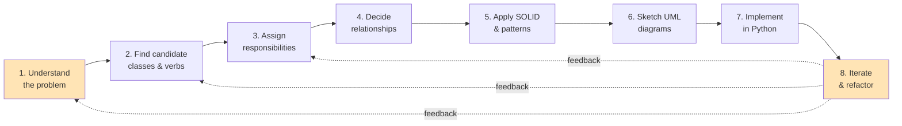
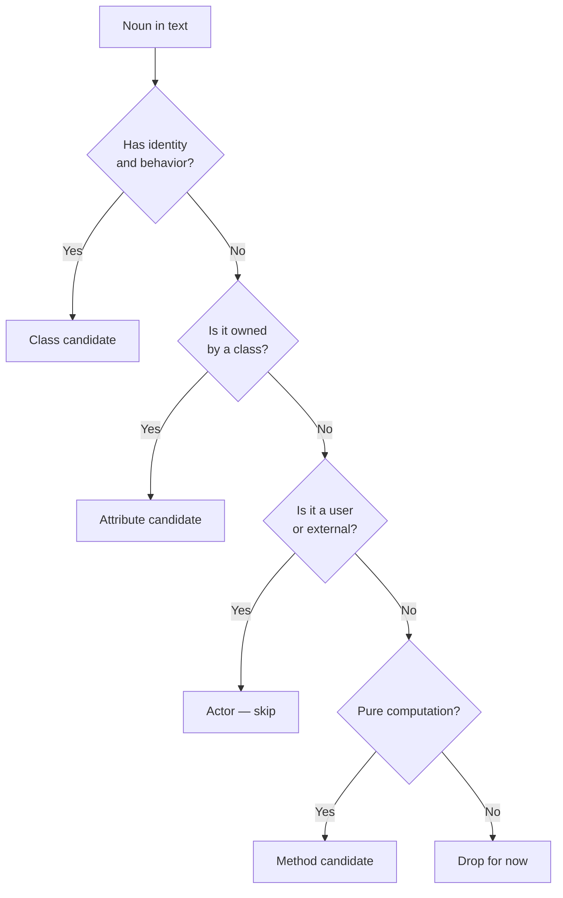
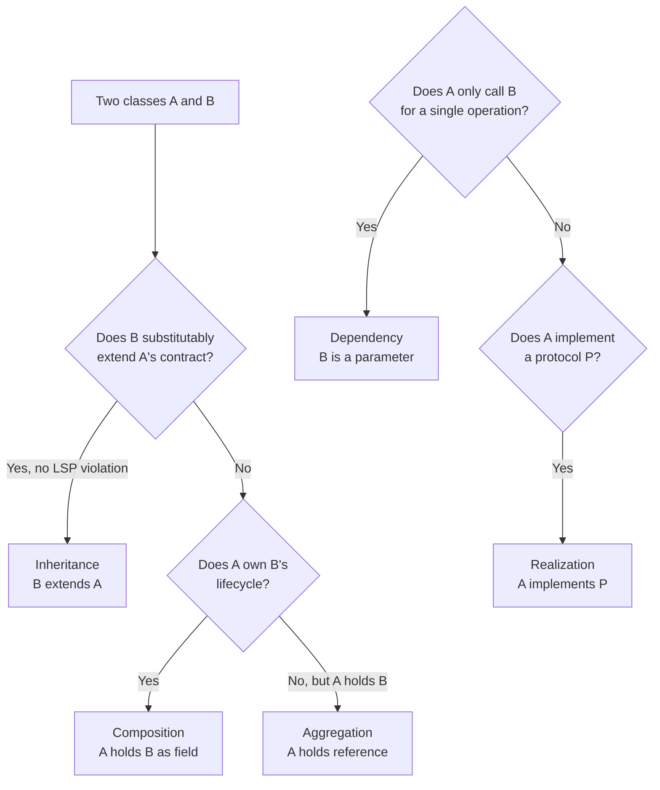
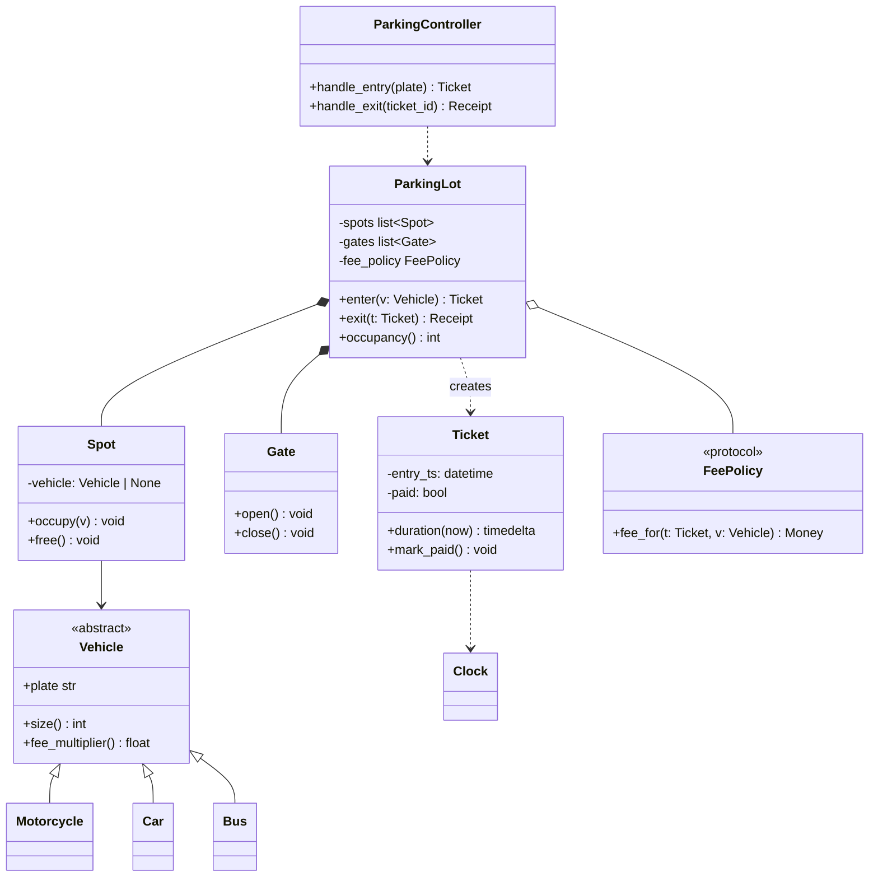
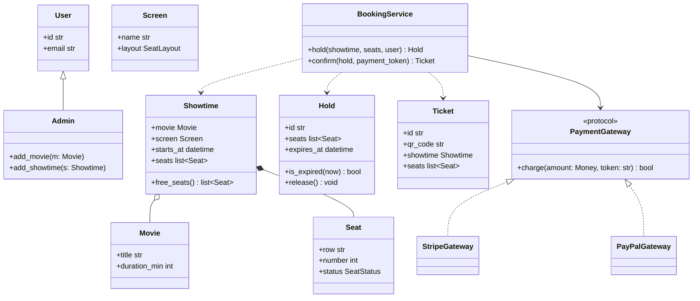
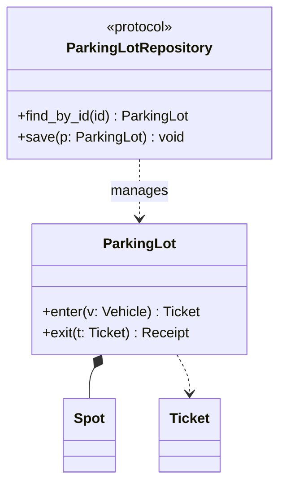

# The OOP Design Process — From Requirements to Classes

> [!quote] "Design is not just what it looks like and feels like. Design is how it works." — Steve Jobs

Most OOP tutorials teach you **what a class is**, then leave you alone with a blank editor. The hardest part of OOP is not the syntax — it's the **leap from a vague requirement to a coherent set of classes**. This note is the bridge. It is the "missing manual" the syllabus forgot.

Related notes: [[identifying-classes-and-responsibilities]], [[code-smells-catalog]], [[refactoring-techniques]], [[case-study-refactoring]], [[design-smells-and-principles]], [[solid-principles]], [[grasp-and-extra-principles]], [[composition-over-inheritance]], [[class-diagrams]], [[sequence-diagrams]], [[common-pitfalls-and-anti-patterns]], [[design-patterns-creational]].

---

## The Big Picture

The design process is **not** linear. It is a loop of *understand → sketch → implement → reflect → repeat*. But each pass follows the same six beats:



Each step has a **purpose**, a **technique**, and a **deliverable**:

| # | Step | Technique | Deliverable |
|---|------|-----------|-------------|
| 1 | Understand the problem | User stories, use cases | A paragraph you can repeat without looking |
| 2 | Find candidates | Noun-verb extraction, CRC cards | A list of candidate classes & verbs |
| 3 | Assign responsibilities | GRASP / RDD | CRC cards, responsibility lists |
| 4 | Decide relationships | "Has-a vs is-a" test | Class diagram with edges |
| 5 | Apply SOLID & patterns | Pattern catalog, code smell radar | Diagrams annotated with patterns |
| 6 | Sketch UML | Mermaid `classDiagram` | A class diagram you can defend |
| 7 | Implement | Python + type hints + tests | A working skeleton |
| 8 | Iterate & refactor | [[refactoring-techniques]] | A cleaner skeleton |

> [!tip] Why this order matters
> Steps 1–3 are about **what** the system *does*. Steps 4–5 are about **how** the system *is shaped*. Step 6 is the **contract** between the two. Steps 7–8 are **engineering**. Skipping straight to step 7 (writing code) is the single most common mistake among beginners.

---

## Step 1 — Understand the Problem

You cannot design what you do not understand. Before any class is named, you must be able to recite:

- **Who** uses the system? (actors)
- **What** do they want to do? (goals / use cases)
- **Why** does the current state of the world fail them? (pain)
- **Where** does the system boundary sit? (scope)

### Techniques

#### User stories

The agile workhorse: `As a <role>, I want <goal>, so that <benefit>.`

> [!example] Parking-lot example
> - *As a* driver, *I want* to enter the lot and get a ticket, *so that* I can park and pay later.
> - *As a* attendant, *I want* to see how many spots are free, *so that* I can decide whether to redirect traffic.
> - *As a* owner, *I want* daily revenue reports, *so that* I can run the business.

#### Use cases (more structured)

A use case is a user story with a **main success scenario** and **extensions** (alternate paths).

```mermaid
usecaseDiagram
    actor Driver
    actor Attendant
    actor Owner
    usecase "Enter & take ticket" as UC1
    usecase "Pay & exit" as UC2
    usecase "View occupancy" as UC3
    usecase "Daily revenue report" as UC4
    Driver --> UC1
    Driver --> UC2
    Attendant --> UC3
    Owner --> UC4
```

> [!warning] Don't over-model
> Beginners draw 30 use cases for a system that needs 5. Pick the **core** use cases that would still exist if you cut features. The rest are extensions.

#### The "elevator paragraph"

Compress the system into one paragraph you can say out loud. If you can't, you don't understand the problem yet.

> [!example] Parking-lot paragraph
> *A parking lot allows vehicles to enter through a gate that issues a numbered ticket, park in one of N numbered spots, and exit through a second gate where they pay based on the duration of stay. Attendants monitor live occupancy. Owners receive daily revenue reports. Different vehicle types (motorcycle, car, bus) pay different rates and consume different numbers of spots.*

This paragraph becomes your **anchor**. When you get lost in design, re-read it.

---

## Step 2 — Find Candidate Classes & Verbs

### Noun–verb extraction

Take your elevator paragraph (or use cases) and underline every **noun** and every **verb**.

> [!example] Parking-lot, nouns and verbs
> *A **parking lot** allows **vehicles** to **enter** through a **gate** that **issues** a numbered **ticket**, **park** in one of N numbered **spots**, and **exit** through a second **gate** where they **pay** based on the **duration** of **stay**. **Attendants** **monitor** live **occupancy**. **Owners** **receive** daily **revenue reports**.*

| Nouns (candidate classes) | Verbs (candidate methods) |
|---|---|
| ParkingLot | (manages) |
| Vehicle | enter, exit, park |
| Gate | issue ticket, open, close |
| Ticket | (issued, paid) |
| Spot | occupy, free |
| Duration | (computed) |
| Stay | (recorded) |
| Attendant | monitor |
| Owner | receive report |
| Occupancy | (queried) |
| RevenueReport | (generated) |

> [!warning] Not every noun becomes a class
> "Duration" is a *value* — it's an attribute of a `Stay`. "Occupancy" is a *derived quantity* — it's a method on `ParkingLot`. "Attendant" and "Owner" are actors — they live *outside* the system. They are classes only if the system models them.

This is the **first filter**: divide nouns into *classes*, *attributes*, *actors*, *external systems*.



### CRC cards

**CRC = Class–Responsibility–Collaboration.** A paper-index-card technique from Kent Beck & Ward Cunningham (1989). Each card has three sections:

```
+--------------------------------------+
| Class Name:  ParkingLot              |
+--------------------------------------+
| Responsibilities:                    |
| - Know which spots are free          |
| - Issue a ticket on entry            |
| - Compute fee on exit                |
| - Report current occupancy           |
+--------------------------------------+
| Collaborations:                      |
| - Ticket (creates)                   |
| - Spot (allocates, releases)         |
| - FeePolicy (delegates computation)  |
| - Gate (commands to open/close)      |
+--------------------------------------+
```

> [!tip] Why physical index cards still beat tools
> Cards are **cheap to throw away**. If you've drawn a card and it doesn't fit, bin it. Tools make you commit too early. The constraint of card size (about 4–5 responsibilities) is also a built-in SRP alarm — see [[solid-principles]].

A worked CRC session for the parking lot:

| Card | Responsibilities | Collaborations |
|---|---|---|
| `ParkingLot` | Manage spots, entry, exit | `Gate`, `Ticket`, `Spot`, `FeePolicy` |
| `Gate` | Open/close physically; issue ticket on entry | `Ticket`, `ParkingLot` |
| `Ticket` | Carry entry timestamp; mark paid | `Clock` |
| `Spot` | Know its size, occupancy, vehicle | `Vehicle` |
| `Vehicle` | Know its plate, type | — |
| `FeePolicy` | Compute fee given duration & vehicle type | `Ticket`, `Vehicle` |
| `RevenueReport` | Aggregate paid tickets for a day | `Ticket` |

> [!note] A verb that touches multiple classes becomes a *responsibility* on whichever class "knows best" (see GRASP Information Expert below). The other classes become *collaborations*.

---

## Step 3 — Assign Responsibilities

You have candidate classes. Now: **which class does what?** Two complementary frameworks help: **GRASP** (General Responsibility Assignment Software Patterns) and **RDD** (Responsibility-Driven Design, Rebecca Wirfs-Brock).

### GRASP — the nine patterns

| Pattern | One-liner | Example |
|---|---|---|
| **Information Expert** | Give responsibility to the class that has the info | `Ticket` knows its entry time → `Ticket.duration()` |
| **Creator** | B creates A if B contains/aggregates/initializes A | `ParkingLot` creates `Ticket`s |
| **Controller** | First object behind the UI; coordinator | `ParkingController` receives UI events |
| **Low Coupling** | Minimise dependencies | Don't import the database into `Ticket` |
| **High Cohesion** | Focused responsibilities | `Ticket` does ticket things, not printing |
| **Polymorphism** | Vary behavior by type, not by `if` | `Vehicle.fee_multiplier()` |
| **Pure Fabrication** | Make up a class that doesn't model the domain | `FeePolicy` is not a real-world noun |
| **Indirection** | Insert an intermediary to decouple | `PaymentGateway` interface |
| **Protected Variations** | Wrap unstable points behind stable interfaces | `Clock` protocol so tests can fake time |

> [!tip] See [[grasp-and-extra-principles]] for the full deep dive.

### Responsibility-Driven Design (RDD)

Wirfs-Brock's RDD replaces "what are the classes" with "what are the **roles**"? A *role* is a stereotyped set of responsibilities. Six stereotypes:

- **Information holder** — knows facts (`Ticket`, `Spot`).
- **Structurer** — maintains relationships (`ParkingLot`).
- **Service provider** — does work, stateless-ish (`FeePolicy`, `PdfGenerator`).
- **Controller** — orchestrates use cases (`ParkingController`).
- **Coordinator** — reacts to events, delegates (`EventBus`).
- **Interfacer** — bridges to other systems (`PaymentGateway`, `Clock`).

> [!example] Stereo-typing the parking lot
> - `ParkingLot` → **Structurer** + **Controller** (red flag: split it).
> - `Ticket` → **Information holder**.
> - `FeePolicy` → **Service provider**.
> - `PaymentGateway` → **Interfacer**.
> - `ParkingController` (new!) → pure **Controller**.

That red flag — *two stereotypes on one class* — is a signal to split. Splitting gives you a cleaner `ParkingLot` (structurer) and a new `ParkingController` (controller). This is exactly how SRP is applied in practice. See [[solid-principles]].

---

## Step 4 — Decide Relationships

For every pair of classes ask:

1. **Is-A?** — `B` is a kind of `A` → inheritance.
2. **Has-A, owning lifecycle?** — `A` cannot exist without `B` → **composition**.
3. **Has-A, shared lifecycle?** — `A` uses `B` but `B` lives elsewhere → **aggregation**.
4. **Uses?** — `A` calls `B` transiently → **association / dependency**.
5. **Realises?** — `A` implements protocol `P` → **realization**.

> [!danger] The is-a test is semantic, not syntactic
> A `Square` *is-a* `Rectangle` mathematically, but if `Rectangle.set_width` mutates width without height, `Square` violates LSP. Always run the [[solid-principles#L — Liskov Substitution Principle (LSP)|LSP test]]. When in doubt, prefer composition — see [[composition-over-inheritance]].

### Decision tree



### Parking-lot relationships

| From | To | Kind | Why |
|---|---|---|---|
| `ParkingLot` | `Spot` | Composition | A lot owns its spots; spots die with the lot |
| `ParkingLot` | `Gate` | Composition | Same — gates are physically part of the lot |
| `ParkingLot` | `FeePolicy` | Aggregation | Policy is injected; survives lot restarts |
| `Ticket` | `Clock` | Dependency | Ticket asks the clock for now() — doesn't own it |
| `Motorcycle`, `Car`, `Bus` | `Vehicle` | Inheritance | LSP-clean: all expose `fee_multiplier()` and `size()` |
| `ParkingController` | `ParkingLot` | Dependency | Controller orchestrates, doesn't own |



---

## Step 5 — Apply SOLID & Patterns

Now you have a draft diagram. Walk each class against SOLID (see [[solid-principles]]) and ask the design-pattern questions:

- Do I have a `switch` on type? → **Strategy** or **State** or **Template Method**.
- Do I create objects in many places? → **Factory Method** or **Abstract Factory**.
- Do I have a fat interface some clients ignore? → **Adapter** + **ISP**.
- Do I need one-and-only-one instance? → **Singleton** (rare; usually you want DI — see [[dependency-injection]]).
- Do I need to notify many objects of state changes? → **Observer**.

> [!tip] Patterns are not goals
> Patterns are **responses to forces**. Apply them when the force exists, not because the syllabus says so. See [[design-patterns-creational]], [[design-patterns-structural]], [[design-patterns-behavioral]].

In the parking lot, the obvious forces are:

- *Vehicle types differ in fee and size* → **Polymorphism** (already done via `Vehicle`).
- *Fee rules change over time (weekend rates, hourly caps, EV discounts)* → **Strategy** (`FeePolicy`).
- *Reports must be produced in multiple formats (CSV, PDF, JSON)* → **Visitor** or **Strategy**.
- *Attendants want live updates when occupancy changes* → **Observer**.

---

## Step 6 — Sketch UML Class Diagrams

You don't need a finished diagram to start — you need *a* diagram. Iterate on it. The [[class-diagrams]] note covers notation in depth. For the design process, the key habit is:

> [!quote] "A class diagram is a hypothesis, not a verdict." — paraphrased from Rebecca Wirfs-Brock
> Draw it, defend it, then revise it.

### Minimal viable diagram

For the parking lot, the diagram above is already a *minimum viable design*. It has:

- 6 classes + 1 abstract + 1 protocol
- 3 composition edges, 1 aggregation, 1 dependency, 3 inheritance edges
- Each class has 2–4 methods — well within the SRP comfort zone

> [!warning] If your diagram has more than ~12 classes on one page, it's not one design — it's three. Use packages (see [[use-case-and-package-diagrams]]) and split.

---

## Step 7 — Implement in Python (with type hints and tests)

This is where the rubber meets the road. Translate the diagram to a skeleton. Two rules:

1. **Type hints everywhere.** They are executable documentation.
2. **Tests before features.** Tests are the executable form of your CRC cards.

```python
from __future__ import annotations
from abc import ABC, abstractmethod
from dataclasses import dataclass, field
from datetime import datetime, timedelta
from decimal import Decimal
from typing import Protocol, Optional


# --- Value objects ---

@dataclass(frozen=True)
class Money:
    amount: Decimal
    currency: str = "USD"

    def times(self, factor: float) -> "Money":
        return Money((self.amount * Decimal(str(factor))).quantize(Decimal("0.01")),
                     self.currency)


# --- Domain model ---

class Vehicle(ABC):
    """Abstract base for vehicles. See [[polymorphism]]."""

    def __init__(self, plate: str) -> None:
        self.plate = plate

    @abstractmethod
    def size(self) -> int: ...
    @abstractmethod
    def fee_multiplier(self) -> float: ...


class Motorcycle(Vehicle):
    def size(self) -> int: return 1
    def fee_multiplier(self) -> float: return 0.5


class Car(Vehicle):
    def size(self) -> int: return 1
    def fee_multiplier(self) -> float: return 1.0


class Bus(Vehicle):
    def size(self) -> int: return 3
    def fee_multiplier(self) -> float: return 2.5


@dataclass
class Ticket:
    id: int
    entry_ts: datetime
    paid: bool = False

    def duration(self, now: datetime) -> timedelta:
        return now - self.entry_ts

    def mark_paid(self) -> None:
        self.paid = True


@dataclass
class Spot:
    number: int
    vehicle: Optional[Vehicle] = None

    def occupy(self, v: Vehicle) -> None:
        if self.vehicle is not None:
            raise RuntimeError(f"Spot {self.number} already occupied")
        self.vehicle = v

    def free(self) -> None:
        self.vehicle = None


class FeePolicy(Protocol):
    """Strategy interface — see [[design-patterns-behavioral]]."""

    def fee_for(self, ticket: Ticket, vehicle: Vehicle, now: datetime) -> Money: ...


class HourlyFeePolicy:
    """Default policy: $3 per hour, scaled by vehicle type."""

    def __init__(self, hourly_rate: Money) -> None:
        self.hourly_rate = hourly_rate

    def fee_for(self, ticket: Ticket, vehicle: Vehicle, now: datetime) -> Money:
        hours = ticket.duration(now).total_seconds() / 3600.0
        return self.hourly_rate.times(max(hours, 1.0)).times(vehicle.fee_multiplier())


class ParkingLot:
    """Structurer + lifecycle owner. Note: no business logic — it delegates."""

    def __init__(self, spots: list[Spot], gates: list["Gate"],
                 fee_policy: FeePolicy) -> None:
        self._spots = spots
        self._gates = gates
        self._fee_policy = fee_policy
        self._tickets: dict[int, Ticket] = {}
        self._next_ticket_id = 1

    def enter(self, vehicle: Vehicle) -> Ticket:
        spot = self._find_free_spot(vehicle.size())
        spot.occupy(vehicle)
        ticket = Ticket(self._next_ticket_id, datetime.utcnow())
        self._tickets[ticket.id] = ticket
        self._next_ticket_id += 1
        self._gates[0].open()
        return ticket

    def exit(self, ticket_id: int, now: datetime) -> "Receipt":
        ticket = self._tickets[ticket_id]
        vehicle = self._vehicle_for_ticket(ticket)
        fee = self._fee_policy.fee_for(ticket, vehicle, now)
        ticket.mark_paid()
        self._free_spot_of(vehicle)
        self._gates[1].open()
        return Receipt(ticket_id, fee)

    def occupancy(self) -> int:
        return sum(1 for s in self._spots if s.vehicle is not None)

    # --- private helpers ---

    def _find_free_spot(self, size: int) -> Spot:
        for s in self._spots:
            if s.vehicle is None:
                return s
        raise RuntimeError("Lot full")

    def _vehicle_for_ticket(self, ticket: Ticket) -> Vehicle:
        for s in self._spots:
            if s.vehicle is not None:
                return s.vehicle
        raise RuntimeError("Vehicle not found")

    def _free_spot_of(self, vehicle: Vehicle) -> None:
        for s in self._spots:
            if s.vehicle is vehicle:
                s.free()
                return


@dataclass
class Gate:
    number: int
    def open(self) -> None: print(f"Gate {self.number} opens")
    def close(self) -> None: print(f"Gate {self.number} closes")


@dataclass
class Receipt:
    ticket_id: int
    fee: Money
```

### Tests

```python
import pytest
from decimal import Decimal
from datetime import datetime, timedelta

def test_car_pays_one_hour_at_base_rate():
    lot = ParkingLot(
        spots=[Spot(1), Spot(2)],
        gates=[Gate(1), Gate(2)],
        fee_policy=HourlyFeePolicy(Money(Decimal("3.00"))),
    )
    car = Car("ABC-123")
    ticket = lot.enter(car)
    now = ticket.entry_ts + timedelta(hours=1)
    receipt = lot.exit(ticket.id, now)
    assert receipt.fee == Money(Decimal("3.00"))

def test_motorcycle_pays_half():
    # ... similar shape; motorcycle.fee_multiplier() == 0.5
    ...

def test_cannot_enter_full_lot():
    lot = ParkingLot(spots=[Spot(1)], gates=[Gate(1), Gate(2)],
                     fee_policy=HourlyFeePolicy(Money(Decimal("3.00"))))
    lot.enter(Car("A"))
    with pytest.raises(RuntimeError):
        lot.enter(Car("B"))
```

> [!tip] Tests are CRC cards in disguise
> Each test method corresponds to a use case. Each `assert` corresponds to a responsibility. If you struggle to write a test, your responsibilities are muddled — go back to step 3.

---

## Step 8 — Iterate & Refactor

First design is rarely the right design. Real iteration happens when:

- **A new requirement arrives** → which class does it touch? If it touches three, your seams are wrong.
- **A test is painful to write** → your dependencies are concrete where they should be abstract (DIP violation).
- **A bug fix ripples** → you have [[design-smells-and-principles#Shotgun Surgery]].

Each iteration repeats the loop: re-understand → re-extract nouns → re-assign → re-sketch → re-implement. The [[refactoring-techniques]] catalog gives you the moves; the [[code-smells-catalog]] gives you the diagnosis. See also [[case-study-refactoring]] for an end-to-end example.

> [!warning] Don't refactor without tests
> Refactoring without tests is gambling. Always: **red → green → refactor**. See [[best-practices]].

---

## A Full Worked Walkthrough — Movie Ticket Booking

Let's run the whole process end-to-end on a deliberately compact requirement.

### Requirement (one paragraph)

> Design a movie ticket booking system. Users browse movies and showtimes, pick seats, and pay. The system holds seats for 10 minutes during payment; if payment fails or expires, seats are released. On success, the system issues a ticket (QR code) and decrements available seats. Theater admins can add movies and showtimes.

### Step 1 — Understand

**Actors:** User, Admin.
**Use cases:** browse movies, view showtimes, select seats, hold seats, pay, issue ticket, release hold, add movie, add showtime.
**Invariants:** seats are never double-sold; held seats expire after 10 minutes.
**Scope:** we will NOT model food ordering, loyalty programs, refunds, or seat pricing tiers — those are extensions.

### Step 2 — Nouns & verbs

| Noun | Class? | Notes |
|---|---|---|
| User | class | Identity, profile |
| Admin | subclass of User | Admin adds movies/showtimes |
| Movie | class | Title, duration, genre |
| Showtime | class | Movie + screen + start time + seat map |
| Seat | class | Row, number, status (free / held / sold) |
| Ticket | class | QR code, seats, showtime |
| Payment | class | Amount, status, method |
| Hold | class | Seats held + expiry |
| Theater | class | Owns screens |
| Screen | class | Physical room with seat layout |
| QR code | attribute | On ticket |
| 10-minute expiry | attribute / policy | On Hold |

Verbs → responsibilities: browse, hold, release, pay, issue, decrement.

### Step 3 — Responsibilities (CRC)

| Class | Responsibilities | Collaborators |
|---|---|---|
| `Movie` | Hold metadata | — |
| `Showtime` | Know its seat map; know how many seats free | `Seat` |
| `Seat` | Know its status | `Hold` |
| `Hold` | Track which seats + expiry; release on expiry | `Seat`, `Clock` |
| `BookingService` | Orchestrate hold → pay → ticket | `Showtime`, `Hold`, `Payment`, `Ticket` |
| `PaymentGateway` | Take payment (interface) | — |
| `Ticket` | Hold QR + seats + showtime | `Showtime`, `Seat` |
| `AdminService` | Add movies / showtimes | `Movie`, `Showtime`, `Screen` |

> [!note] A "BookingService" is a **Pure Fabrication** (GRASP). It is not a domain noun — it exists to coordinate. That's fine; not every class models reality.

### Step 4 — Relationships

- `Theater` ◆— `Screen` (composition)
- `Screen` ◆— `Seat` (composition)
- `Showtime` ◆— `Seat` (composition — actually *projection* of screen seats for that show)
- `Showtime` ○— `Movie` (aggregation)
- `BookingService` ..> `Showtime`, `Hold`, `Payment`, `Ticket` (dependencies)
- `Admin` ↑— `User` (inheritance — admins are users with extra powers)
- `CreditCardPayment`, `PayPalPayment` ..|> `PaymentGateway` (realization)

### Step 5 — SOLID & patterns

- **SRP**: `BookingService` is getting fat? Split into `SeatHoldingService`, `PaymentService`, `TicketIssuer`.
- **OCP**: New payment methods added without modifying `BookingService` → **Strategy** via `PaymentGateway`.
- **LSP**: `Admin` extends `User` — must work anywhere a `User` works (yes — admin has same identity contract).
- **ISP**: Don't put admin methods on `User`. Define `Administrator` protocol.
- **DIP**: `BookingService` depends on `PaymentGateway` protocol, not on `StripeGateway`.

- **Observer**: Notify `HoldExpiryWatcher` when a hold is created → background task releases on timeout.
- **Factory Method**: `Ticket.issue_for(...)` instead of constructor scattered across services.

### Step 6 — UML



### Step 7 — Python skeleton

```python
from __future__ import annotations
from abc import ABC, abstractmethod
from dataclasses import dataclass, field
from datetime import datetime, timedelta
from decimal import Decimal
from enum import Enum
from typing import Protocol, Optional
import uuid


class SeatStatus(Enum):
    FREE = "free"
    HELD = "held"
    SOLD = "sold"


@dataclass(frozen=True)
class Money:
    amount: Decimal
    currency: str = "USD"


@dataclass
class Movie:
    id: str
    title: str
    duration_min: int


@dataclass
class Seat:
    row: str
    number: int
    status: SeatStatus = SeatStatus.FREE

    def hold(self) -> None:
        if self.status != SeatStatus.FREE:
            raise RuntimeError(f"Seat {self.row}{self.number} not free")
        self.status = SeatStatus.HELD

    def sell(self) -> None:
        if self.status != SeatStatus.HELD:
            raise RuntimeError("Can only sell held seats")
        self.status = SeatStatus.SOLD

    def release(self) -> None:
        if self.status == SeatStatus.HELD:
            self.status = SeatStatus.FREE


@dataclass
class Showtime:
    id: str
    movie: Movie
    starts_at: datetime
    seats: list[Seat]

    def free_seats(self) -> list[Seat]:
        return [s for s in self.seats if s.status == SeatStatus.FREE]


@dataclass
class Hold:
    id: str
    showtime: Showtime
    seats: list[Seat]
    user_id: str
    expires_at: datetime

    @classmethod
    def for_duration(cls, showtime: Showtime, seats: list[Seat],
                     user_id: str, now: datetime,
                     minutes: int = 10) -> "Hold":
        for s in seats:
            s.hold()
        return cls(str(uuid.uuid4()), showtime, seats, user_id,
                   now + timedelta(minutes=minutes))

    def is_expired(self, now: datetime) -> bool:
        return now >= self.expires_at

    def release(self) -> None:
        for s in self.seats:
            s.release()


@dataclass
class Ticket:
    id: str
    showtime: Showtime
    seats: list[Seat]
    qr_code: str

    @classmethod
    def issue_for(cls, hold: Hold) -> "Ticket":
        for s in hold.seats:
            s.sell()
        return cls(
            id=str(uuid.uuid4()),
            showtime=hold.showtime,
            seats=list(hold.seats),
            qr_code=str(uuid.uuid4()),
        )


class PaymentGateway(Protocol):
    """Strategy — see [[design-patterns-behavioral]]."""
    def charge(self, amount: Money, token: str) -> bool: ...


class StripeGateway:
    def charge(self, amount: Money, token: str) -> bool:
        # call Stripe API in real life
        return True


class FakeClock:
    """Indirection (GRASP) so tests can fast-forward time."""
    def __init__(self, now: datetime) -> None:
        self.now = now
    def advance(self, minutes: int) -> None:
        self.now += timedelta(minutes=minutes)


class BookingService:
    """Controller (GRASP). Orchestrates use cases; holds no domain state."""

    def __init__(self, payments: PaymentGateway, clock: FakeClock) -> None:
        self._payments = payments
        self._clock = clock
        self._holds: dict[str, Hold] = {}

    def hold_seats(self, showtime: Showtime, seats: list[Seat],
                   user_id: str) -> Hold:
        hold = Hold.for_duration(showtime, seats, user_id, self._clock.now)
        self._holds[hold.id] = hold
        return hold

    def confirm(self, hold_id: str, payment_token: str,
                amount: Money) -> Ticket:
        hold = self._holds[hold_id]
        if hold.is_expired(self._clock.now):
            hold.release()
            raise RuntimeError("Hold expired")
        if not self._payments.charge(amount, payment_token):
            hold.release()
            raise RuntimeError("Payment failed")
        ticket = Ticket.issue_for(hold)
        del self._holds[hold_id]
        return ticket

    def expire_holds(self) -> None:
        """Called periodically by a scheduler."""
        for hid, hold in list(self._holds.items()):
            if hold.is_expired(self._clock.now):
                hold.release()
                del self._holds[hid]
```

### Step 8 — Tests (the real design verification)

```python
def test_hold_then_confirm_issues_ticket():
    seats = [Seat("A", 1), Seat("A", 2)]
    movie = Movie("m1", "Inception", 148)
    show = Showtime("s1", movie, datetime(2025, 1, 16, 20, 0), seats)
    svc = BookingService(StripeGateway(), FakeClock(datetime(2025, 1, 15, 10, 0)))

    hold = svc.hold_seats(show, [seats[0]], user_id="u1")
    ticket = svc.confirm(hold.id, "tok_ok", Money(Decimal("12.00")))

    assert ticket.showtime is show
    assert seats[0].status == SeatStatus.SOLD
    assert seats[1].status == SeatStatus.FREE

def test_expired_hold_releases_seats():
    seats = [Seat("A", 1)]
    show = Showtime("s1", Movie("m1", "X", 90), datetime(2025, 1, 16, 20, 0), seats)
    clock = FakeClock(datetime(2025, 1, 15, 10, 0))
    svc = BookingService(StripeGateway(), clock)

    svc.hold_seats(show, seats, user_id="u1")
    assert seats[0].status == SeatStatus.HELD

    clock.advance(minutes=11)
    svc.expire_holds()
    assert seats[0].status == SeatStatus.FREE
```

Each test exercises a use case. The seams (FakeClock, Protocol) make the test fast and deterministic. This is the payoff of steps 3 and 5.

---

## Domain-Driven Design (DDD) Primer

When the domain is rich (insurance, banking, logistics), noun-verb extraction alone isn't enough. **Domain-Driven Design** (Eric Evans, 2003) layers a vocabulary on top:

| Building block | Definition | Example (parking lot) |
|---|---|---|
| **Entity** | Object with identity that persists over time | `Ticket`, `Vehicle` |
| **Value object** | Immutable, identified by its values | `Money`, `Duration`, `SpotNumber` |
| **Aggregate** | Cluster of entities treated as a unit; has a *root* | `ParkingLot` (root) containing `Spot`s |
| **Aggregate root** | Only entry point into the aggregate | `ParkingLot.enter(...)` |
| **Repository** | Collection-like interface to load aggregates | `ParkingLotRepository.find_by_id(id)` |
| **Domain service** | Stateless operation that doesn't fit an entity | `FeePolicy` (operations on multiple entities) |
| **Factory** | Encapsulates complex construction | `ParkingLotFactory.from_config(...)` |
| **Ubiquitous language** | Use the same words in code as in the business | "Hold", "Showtime", "Receipt" |



> [!tip] DDD in one sentence
> Build a model that **matches the way domain experts talk**, then protect that model from infrastructure (persistence, messaging, UI) with **repositories** and **services**.

See [[grasp-and-extra-principles]] for how DDD aligns with Information Expert and Pure Fabrication.

---

## Common Design Mistakes Beginners Make

> [!danger] Watch for these on every project

1. **Starting with code, not understanding.** You write classes before you know the use cases. You then refactor a dozen times. Solution: write the elevator paragraph first.
2. **One class per real-world noun.** Not every noun is a class (see [[identifying-classes-and-responsibilities]]). "Duration" is a value, "Attendant" is an actor.
3. **Deep inheritance hierarchies.** `Animal → Mammal → Dog → Poodle → ToyPoodle`. After depth 3, you have a fragile base class. Prefer composition — see [[composition-over-inheritance]].
4. **God controllers.** `BookingService` that holds seats, charges cards, sends emails, and generates PDFs. Apply SRP ruthlessly.
5. **Anemic domain models.** `Ticket` with only getters, and `TicketService` with all behavior. Behavior belongs with the data it operates on (Information Expert).
6. **Premature pattern obsession.** Adding `AbstractBookingFactory` when one concrete class would do. YAGNI until the second use case forces the abstraction.
7. **Ignoring time and side effects.** "Now" is a hidden dependency. Inject a `Clock`. See [[dependency-injection]].
8. **Treating tests as afterthought.** If you cannot test it, the design is wrong. Refactor for testability — see [[best-practices]].
9. **Confusing data with behavior.** `User` with 30 fields and zero methods is a struct, not a class. Either give it behavior or use a `@dataclass` honestly.
10. **Designing for hypothetical reuse.** "Maybe we'll need to swap the database." You won't. Build for clarity *now*, abstraction *later*.

---

## Key Takeaways

> [!note] If you read nothing else, read this

1. **Design is iterative.** First pass is always wrong; the loop is the method.
2. **Understand before you sketch, sketch before you code.** Skipping steps 1–6 is technical debt you pay back with interest.
3. **CRC cards are training wheels that work.** The constraint of card size enforces SRP before you've ever heard of it.
4. **Responsibilities come before classes.** RDD flips the question: not "what classes?" but "who does what?".
5. **Relationships are commitments.** Inheritance is the strongest, then composition, then aggregation, then dependency. Pick the *weakest* that works.
6. **SOLID is a checklist, not a religion.** Run through it; apply what fits.
7. **Patterns are responses to forces.** No force, no pattern.
8. **Tests are executable CRC cards.** If a test is hard to write, your responsibilities are wrong.
9. **DDD gives you the words** when the domain is rich. Use entities, value objects, aggregates, repositories.
10. **The goal is sustainable software, not pretty diagrams.** See [[design-smells-and-principles]] — design for change, not for reuse.

---

## Practice Exercises

> [!example] Three design briefs — pick one, run the whole 8-step process

### Brief A — Vending machine
Design a vending machine that accepts coins and bills, dispenses products, returns change, and reports sold-out items to a restocker. Products have prices and quantities. Coins have denominations. The machine has a finite change float.

**Hints**
- `VendingMachine` is the aggregate root.
- `Coin`, `Bill`, `Product` are value objects / entities.
- `ChangeCalculator` is a domain service (Pure Fabrication).
- Don't model the physical dispenser — model the *decisions*.

### Brief B — Library loans
Design a library system where members borrow books. Books have copies. Loans have a due date and a fine policy. Members can reserve unavailable books. Librarians register new books and members.

**Hints**
- `Book` (catalog) vs `Copy` (physical) — common DDD split.
- `Loan` is an entity with status (`active`, `returned`, `overdue`).
- `FinePolicy` is a strategy (children's books free, DVDs $1/day, etc.).
- `Reservation` is a separate aggregate — don't try to model it as part of `Loan`.

### Brief C — Elevator control
Design an elevator controller for a 10-floor building. The controller assigns pickup requests to one of N elevators, opens doors on arrival, and respects capacity. Requests come from floor buttons (up/down) and inside elevators (target floor).

**Hints**
- `Elevator` and `Request` are obvious.
- `Dispatcher` is a domain service that picks which elevator answers which request.
- `Door` is a separate class — don't pollute `Elevator` with door logic.
- The state machine (`Moving`, `Stopped`, `DoorsOpen`) smells like the **State** pattern — see [[design-patterns-behavioral]].

### Deliverables for each brief
1. The elevator paragraph (Step 1).
2. A noun–verb table (Step 2).
3. Three CRC cards (Step 3).
4. A class diagram in Mermaid (Steps 4–6).
5. A Python skeleton with type hints (Step 7).
6. At least three tests covering main use cases (Step 7).
7. One paragraph on what you'd refactor next and why (Step 8).

> [!tip] Cross-references that will help
> - [[identifying-classes-and-responsibilities]] — the deep dive on Step 2–3
> - [[code-smells-catalog]] — to spot design rot in your skeleton
> - [[refactoring-techniques]] — the moves you'll apply in Step 8
> - [[case-study-refactoring]] — a worked end-to-end refactor
> - [[design-smells-and-principles]] — the higher-level principles
> - [[class-diagrams]] — notation reference
> - [[solid-principles]], [[grasp-and-extra-principles]] — the principles
> - [[composition-over-inheritance]] — the decision that defines your design

---

> [!quote] "There are two ways of constructing a software design: one way is to make it so simple that there are obviously no deficiencies, and the other way is to make it so complicated that there are no obvious deficiencies." — C.A.R. Hoare

Design is choosing, repeatedly, between those two ways. The process in this note is a checklist that nudges you toward the first.
