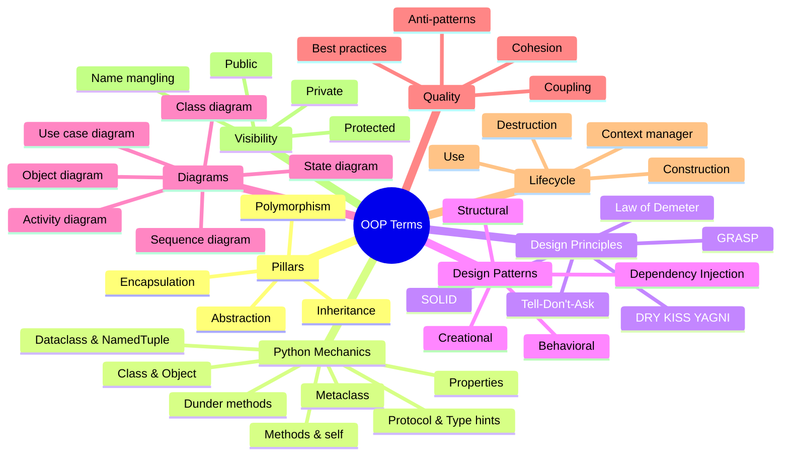

# 📖 OOP Glossary — A to Z

> [!tip] How to use this glossary
> Use the **letter index** below to jump. Every term has a one-line definition and a wikilink (`[[like this]]`) to its deep-dive note. Terms that *reference other terms* use wikilinks inline — click through to chase the chain.

Companion cards: [[oop-quick-reference]] · [[python-oop-syntax-cheatsheet]] · [[design-patterns-cheatsheet]] · [[solid-and-principles-cheatsheet]] · [[uml-cheatsheet]] · [[common-mistakes-cheatsheet]].

---

## 🔤 Letter Index

[A](#a) · [B](#b) · [C](#c) · [D](#d) · [E](#e) · [F](#f) · [G](#g) · [H](#h) · [I](#i) · [J](#j) · [K](#k) · [L](#l) · [M](#m) · [N](#n) · [O](#o) · [P](#p) · [Q](#q) · [R](#r) · [S](#s) · [T](#t) · [U](#u) · [V](#v) · [W](#w) · [Y](#y)

---

## A

**ABC (Abstract Base Class)** — A class that cannot be instantiated and may define `@abstractmethod`s that subclasses must implement; provided by Python's `abc` module. See [[abstraction]].

**Abstraction** — Pillar of OOP: exposing essential features while hiding implementation complexity. See [[abstraction]].

**Abstract Factory pattern** — Creational pattern: create families of related objects without specifying their concrete classes. See [[design-patterns-creational]].

**Abstract method** — A method declared but not implemented in a base class; subclasses must override it. See [[abstraction]] · [[solid-and-principles-cheatsheet]].

**Access modifier** — Keywords/conventions controlling visibility (public, protected, private). Python uses `_`/`__` prefixes; see [[encapsulation]].

**Adapter pattern** — Structural pattern: convert one interface into another clients expect. See [[design-patterns-structural]].

**Aggregation** — UML relationship: "has-a" with shared parts (parts outlive the container). See [[class-diagrams]] · [[uml-cheatsheet]].

**Alias** — A second name for a note, defined in YAML frontmatter; lets wikilinks use synonyms. See [[start-here-student-guide]].

**Annotation** — A type hint attached to a variable or function parameter (e.g. `x: int`). See [[protocols-and-type-hints]].

**Anti-pattern** — A common "solution" that is usually worse than the problem; catalogued in [[common-pitfalls-and-anti-patterns]].

**Association** — UML relationship: a long-term "uses" structural link between classes. See [[class-diagrams]].

**Attribute** — A named value bound to an object or class; Python uses `obj.name` for both data and methods. See [[classes-and-objects]].

**Attribute access** — The mechanism of reading/writing an object's attributes; customizable via `__getattr__`, `__getattribute__`, descriptors. See [[magic-methods]].

---

## B

**Base class** — A class that other classes inherit from; aka parent or superclass. See [[inheritance]].

**Behavioral pattern** — GoF category covering how objects distribute responsibility and communicate (11 patterns). See [[design-patterns-behavioral]].

**Bridge pattern** — Structural pattern: decouple abstraction from implementation so they vary independently. See [[design-patterns-structural]].

**Builder pattern** — Creational pattern: construct a complex object step by step. See [[design-patterns-creational]].

---

## C

**C3 linearization** — The algorithm Python uses to compute the MRO of a class with multiple inheritance; monotonic and predictable. See [[methods]].

**Callable** — Any object with a `__call__` method; can be invoked like a function. See [[magic-methods]].

**Chain of Responsibility pattern** — Behavioral pattern: pass a request along a chain of handlers until one handles it. See [[design-patterns-behavioral]].

**Class** — A blueprint/template for creating objects; defines attributes and methods. See [[classes-and-objects]].

**Class attribute** — An attribute defined on the class itself; shared across all instances unless shadowed. See [[classes-and-objects]].

**Class diagram** — UML structural diagram showing classes, attributes, operations, and relationships. See [[class-diagrams]].

**Class method** — A method decorated with `@classmethod`; receives the class (`cls`) as its first argument. See [[methods]].

**Class variable** — Synonym for [[class attribute]]; see also `typing.ClassVar`. See [[protocols-and-type-hints]].

**Client** — Code that uses a class, interface, or service without knowing its internals. See [[solid-principles]].

**Cohesion** — How focused a class's responsibilities are; "high cohesion" is good. See [[grasp-and-extra-principles]].

**Collaborator** — An object that another object depends on or works with. See [[grasp-and-extra-principles]].

**Command pattern** — Behavioral pattern: encapsulate a request as an object (enables undo, queueing). See [[design-patterns-behavioral]].

**Composition** — "Has-a" relationship where the container owns its parts (parts die with the container). See [[composition-over-inheritance]] · [[class-diagrams]].

**Composition Root** — The single location near `main()` where dependencies are wired; libraries should not have one. See [[dependency-injection]].

**Concrete class** — A non-abstract class that can be instantiated. See [[abstraction]].

**Constructor** — The special method that initializes a new instance; in Python, `__init__` (preceded by `__new__`). See [[classes-and-objects]].

**Context manager** — An object with `__enter__`/`__exit__` methods, usable in `with` blocks for resource management. See [[magic-methods]].

**Controller (GRASP)** — First non-UI object receiving a system operation; delegates to the model. See [[grasp-and-extra-principles]].

**Coupling** — Degree of interdependence between classes; "low coupling" is good. See [[grasp-and-extra-principles]].

**Creator (GRASP)** — Assigning class B the responsibility to create A's instances when B contains/composes/uses A. See [[grasp-and-extra-principles]].

---

## D

**Data class** — A class primarily holding data, often generated by `@dataclass` or `NamedTuple`. See [[dataclasses-and-attrs]].

**Data hiding** — Synonym for [[encapsulation]]: restricting external access to internal state. See [[encapsulation]].

**Dataclass** — Python decorator (`@dataclass`) that auto-generates `__init__`, `__repr__`, `__eq__`, etc. See [[dataclasses-and-attrs]].

**Decorator (GoF pattern)** — Structural pattern: attach additional responsibilities dynamically without subclassing. See [[design-patterns-structural]].

**Decorator (Python `@`)** — Syntax for wrapping a function/class with another callable; *different* from the GoF pattern. See [[design-patterns-structural]].

**Delegation** — An object forwards a call to a collaborator; basis of composition. See [[composition-over-inheritance]].

**Dependency** — UML relationship: a temporary "uses" between classes (often a parameter or local variable). See [[class-diagrams]].

**Dependency Injection (DI)** — Provide a class with its collaborators from outside rather than constructing them inside. See [[dependency-injection]].

**Dependency Inversion Principle (DIP)** — SOLID: depend on abstractions, not concretions. See [[solid-principles]].

**Descriptor** — Any object implementing `__get__`, `__set__`, or `__delete__`; properties are descriptors. See [[properties]] · [[magic-methods]].

**Diamond problem** — Multiple-inheritance ambiguity: a class inherits from two classes that share a base; resolved in Python by MRO. See [[inheritance]] · [[methods]].

**DRY** (Don't Repeat Yourself) — Every piece of knowledge has one unambiguous representation; about *knowledge*, not just code. See [[grasp-and-extra-principles]].

**Duck typing** — "If it walks like a duck and quacks like a duck, it's a duck"; Python's structural typing at runtime. See [[polymorphism]] · [[protocols-and-type-hints]].

**Dunder method** — "Double underscore" method like `__init__`, `__repr__`; aka magic or special methods. See [[magic-methods]].

**Dynamic dispatch** — Runtime selection of which method to invoke based on the actual object type. See [[polymorphism]].

---

## E

**Encapsulation** — Pillar of OOP: bundle state and behavior; control access via visibility and [[property|properties]]. See [[encapsulation]].

**Event** — A signal raised by an object that interested observers can react to; basis of the [[Observer pattern]]. See [[design-patterns-behavioral]].

**Exception** — An object representing an error or unusual condition, raised to break normal flow. See [[best-practices]].

**Extension method** — Adding a method to a class without modifying it (rare in Python; usually via composition or `singledispatch`). See [[design-patterns-behavioral]].

---

## F

**Facade pattern** — Structural pattern: provide a simplified front to a complex subsystem. See [[design-patterns-structural]].

**Factory Method** — Creational pattern: define an interface for object creation, let subclasses decide which class to instantiate. See [[design-patterns-creational]].

**Field** — A data attribute, especially in a `@dataclass` or `NamedTuple`. See [[dataclasses-and-attrs]].

**Final** — Type-hint marker (`@final` or `Final`) preventing subclassing or reassignment; enforced by mypy. See [[protocols-and-type-hints]].

**Flyweight pattern** — Structural pattern: share many fine-grained objects efficiently by separating intrinsic and extrinsic state. See [[design-patterns-structural]].

**Forwarding** — Delegating a method call to a collaborator without modification. See [[composition-over-inheritance]].

**Framework** — A reusable architecture that calls your code (Inversion of Control); contrasted with a library. See [[dependency-injection]].

---

## G

**Generic** — A type parameterized over other types (e.g., `Stack[T]`); in Python via `typing.Generic` or PEP 695. See [[protocols-and-type-hints]].

**God class** — Anti-pattern: a class that knows too much and does too much. See [[common-pitfalls-and-anti-patterns]].

**GoF (Gang of Four)** — The four authors of *Design Patterns* (Gamma, Helm, Johnson, Vlissides); the 23 patterns they catalogued. See [[design-patterns-creational]].

**GRASP** (General Responsibility Assignment Software Patterns) — 9 patterns for assigning responsibilities to classes. See [[grasp-and-extra-principles]].

**Getter** — A method or [[property]] that returns an attribute's value. See [[properties]].

---

## H

**Has-a** — Relationship indicating containment; basis of [[composition]] and [[aggregation]]. See [[composition-over-inheritance]].

**Hash** — Integer computed from an object's state via `__hash__`; required for dict keys and set membership. See [[magic-methods]].

**Helper method** — A private utility method extracted to support a public method; improves readability. See [[best-practices]].

**Hook** — A method with a default implementation that subclasses may override to extend behavior. See [[design-patterns-behavioral]].

---

## I

**Identity** — The property that an object is itself, distinct from any other object; checked via `is` (vs `==` for equality). See [[classes-and-objects]].

**Implementation** — The concrete code that fulfills an interface's contract. See [[abstraction]].

**Indirection (GRASP)** — Insert an intermediate object to decouple two others; basis of [[Adapter pattern|Adapter]], [[Facade pattern|Facade]], [[Mediator pattern|Mediator]]. See [[grasp-and-extra-principles]].

**Inheritance** — Pillar of OOP: derive a new class from an existing one, reusing and specializing its behavior. See [[inheritance]].

**Information Expert (GRASP)** — Assign a responsibility to the class that has the information needed to fulfill it. See [[grasp-and-extra-principles]].

**Init** — Short for `__init__`; the initializer method called after `__new__`. See [[classes-and-objects]].

**Initializer** — Synonym for [[init]]; see [[classes-and-objects]].

**Instance** — A specific object created from a class. See [[classes-and-objects]].

**Instance attribute** — An attribute bound to a specific instance, set via `self.x = ...`. See [[classes-and-objects]].

**Instance method** — A method that takes `self` and operates on an instance; the default method type. See [[methods]].

**Instantiation** — The act of creating an instance from a class (e.g., `MyClass()`). See [[classes-and-objects]].

**Interface** — A contract defining methods a class must implement; in Python, an [[ABC]] or [[Protocol]]. See [[abstraction]].

**Interface Segregation Principle (ISP)** — SOLID: many specific interfaces beat one fat interface. See [[solid-principles]].

**Interpreter pattern** — Behavioral pattern: define a grammar and an interpreter for sentences in it. See [[design-patterns-behavioral]].

**Invariant** — A condition that must always hold for an object to be valid; protected by [[encapsulation]]. See [[encapsulation]].

**Is-a** — Relationship indicating subtyping; basis of [[inheritance]] and [[realization]]. See [[inheritance]].

**isinstance** — Python built-in checking whether an object is an instance of a class (or its subclasses). See [[polymorphism]].

**Iterator pattern** — Behavioral pattern: sequential access to a collection's elements without exposing its internals. See [[design-patterns-behavioral]].

---

## J

**JSON serialization** — Converting an object to a JSON-compatible form; often via `__dict__` or a custom encoder. See [[oop-in-production]].

---

## K

**KISS** (Keep It Simple, Stupid) — Simplicity is a feature; choose the simplest design that works. See [[grasp-and-extra-principles]].

---

## L

**Law of Demeter (LoD)** — Principle of least knowledge: an object should only talk to its immediate collaborators, not reach through them. See [[grasp-and-extra-principles]].

**Lazy initialization** — Deferring construction until first use; basis of the [[Proxy pattern|Proxy]] and cached properties. See [[properties]].

**Lifecycle** — The phases an object goes through: creation → use → destruction. See [[classes-and-objects]].

**Liskov Substitution Principle (LSP)** — SOLID: subtypes must be substitutable for their base types without breaking correctness. See [[solid-principles]].

**Loose coupling** — Desirable property where changes in one class minimally affect others. See [[grasp-and-extra-principles]].

---

## M

**Magic method** — Synonym for [[dunder method]]. See [[magic-methods]].

**Mediator pattern** — Behavioral pattern: centralize complex interactions between objects. See [[design-patterns-behavioral]].

**Member** — Any attribute or method belonging to a class or object. See [[classes-and-objects]].

**Memento pattern** — Behavioral pattern: capture and externalize an object's internal state for later restoration (undo). See [[design-patterns-behavioral]].

**Message passing** — Alan Kay's OOP vision: objects communicate by sending messages (method calls). See [[what-is-oop]] · [[sequence-diagrams]].

**Metaclass** — A class whose instances are classes; default is `type`; customize class creation. See [[metaclasses-and-class-creation]].

**Method** — A function defined inside a class; invoked via `instance.method()`. See [[methods]].

**Method Resolution Order (MRO)** — The order Python searches classes for a method; computed via C3 linearization. See [[methods]].

**Method overloading** — Defining multiple methods with the same name but different signatures; Python simulates via `@overload` (type-check only). See [[protocols-and-type-hints]].

**Method overriding** — A subclass redefines a method inherited from a parent. See [[inheritance]].

**Mixin** — A class designed to be multiply-inherited to add a specific behavior; not meant to stand alone. See [[composition-over-inheritance]].

**Model** — Object representing domain data and behavior (in MVC). See [[real-world-examples]].

**Module** — A Python file; serves as a namespace and a singleton-like container. See [[oop-in-production]].

**Multiple inheritance** — A class inheriting from more than one parent; resolves via MRO. See [[inheritance]].

**Mutable** — An object whose state can change after creation; contrasted with immutable. See [[dataclasses-and-attrs]].

---

## N

**Name mangling** — Python's rewriting of `__attr` inside a class to `_ClassName__attr`; the only "enforced" privacy. See [[encapsulation]].

**NamedTuple** — A tuple subclass with named fields, defined via `typing.NamedTuple`; immutable, indexable, hashable. See [[dataclasses-and-attrs]].

**Namespace** — A mapping from names to objects; modules, classes, and functions all have one. See [[classes-and-objects]].

---

## O

**Object** — An instance of a class; bundles state (attributes) and behavior (methods). See [[classes-and-objects]].

**Object diagram** — UML structural diagram: a snapshot of instances and links at one moment. See [[object-diagrams]].

**Object-Oriented Programming (OOP)** — Programming paradigm based on objects that bundle state and behavior. See [[what-is-oop]].

**Observer pattern** — Behavioral pattern: a subject notifies dependents of state changes (pub-sub). See [[design-patterns-behavioral]].

**Open/Closed Principle (OCP)** — SOLID: open for extension, closed for modification. See [[solid-principles]].

**Overload** — See [[method overloading]]. See [[protocols-and-type-hints]].

**Override** — See [[method overriding]]. See [[inheritance]].

---

## P

**Package diagram** — UML diagram showing how packages/modules depend on each other. See [[use-case-and-package-diagrams]].

**Paradigm** — A style of programming (procedural, OOP, functional, logic). See [[paradigm-comparison]].

**Pattern** — A reusable solution to a recurring design problem; catalogued by GoF. See [[design-patterns-creational]].

**Polymorphism** — Pillar of OOP: same interface, many forms; runtime dispatch. See [[polymorphism]].

**Polymorphism (GRASP)** — Use polymorphic calls instead of `if isinstance` chains for varying behavior. See [[grasp-and-extra-principles]].

**Primitive obsession** — Anti-pattern: using primitive types (str, int) where a small value-object class would clarify intent. See [[common-pitfalls-and-anti-patterns]].

**Private** — Visibility marker indicating only the defining class should access; Python uses `__` (mangled). See [[encapsulation]].

**Property** — Python's idiomatic getter/setter mechanism via `@property`. See [[properties]].

**Protected** — Visibility marker indicating only the class and subclasses should access; Python uses `_` (convention). See [[encapsulation]].

**Protected Variations (GRASP)** — Wrap points of variation behind a stable interface so changes don't ripple. See [[grasp-and-extra-principles]].

**Prototype pattern** — Creational pattern: clone an existing object instead of constructing fresh. See [[design-patterns-creational]].

**Protocol** — Python's structural interface (PEP 544); classes implicitly satisfy a `Protocol` by having the right methods. See [[protocols-and-type-hints]].

**Proxy pattern** — Structural pattern: a stand-in controlling access to another object. See [[design-patterns-structural]].

**Public** — Visibility marker indicating unrestricted access; the default in Python. See [[encapsulation]].

**Pure Fabrication (GRASP)** — Inventing a non-domain class (e.g. `Validator`) to satisfy cohesion/coupling. See [[grasp-and-extra-principles]].

**Pythonic** — Code that follows Python's idioms and conventions; contrasted with writing Java/Python in Python. See [[best-practices]].

---

## Q

**Query** (in CQS) — A method that returns a value without side effects; contrasted with a command. See [[best-practices]].

---

## R

**Realization** — UML relationship: "implements" an interface (dashed line with hollow triangle). See [[class-diagrams]].

**Refactoring** — Restructuring code without changing its behavior to improve design. See [[best-practices]].

**Reference** — A handle to an object; in Python, all variables are references. See [[classes-and-objects]].

**Repository pattern** — Mediate between domain and data layer with a collection-like interface. See [[real-world-examples]].

**Responsibility** — An obligation of a class to fulfill a particular kind of work; see [[SRP]] and [[GRASP]]. See [[solid-principles]].

**Reuse** — Using existing code in new contexts; via [[inheritance]], [[composition]], or function calls. See [[composition-over-inheritance]].

---

## S

**Self** — The conventional name for the first parameter of an instance method; refers to the instance. Also `typing.Self` for self-types. See [[methods]] · [[protocols-and-type-hints]].

**Sequence diagram** — UML behavioral diagram showing messages between objects over time. See [[sequence-diagrams]].

**Service** — A stateless class that performs operations; often a [[Pure Fabrication|pure fabrication]]. See [[grasp-and-extra-principles]].

**Setter** — A method or `@property` setter that assigns to an attribute, often with validation. See [[properties]].

**Singleton pattern** — Creational pattern: ensure a class has exactly one instance with global access. See [[design-patterns-creational]].

**SOLID** — Acronym for SRP, OCP, LSP, ISP, DIP — five core OOP design principles. See [[solid-principles]].

**Special method** — Synonym for [[dunder method]]. See [[magic-methods]].

**SRP (Single Responsibility Principle)** — SOLID: a class should have one reason to change. See [[solid-principles]].

**State pattern** — Behavioral pattern: an object's behavior changes with its internal state. See [[design-patterns-behavioral]].

**State diagram** — UML behavioral diagram showing an object's lifecycle and transitions. See [[state-and-activity-diagrams]].

**Static method** — A method decorated with `@staticmethod`; receives neither instance nor class. See [[methods]].

**Strategy pattern** — Behavioral pattern: encapsulate interchangeable algorithms behind a common interface. See [[design-patterns-behavioral]].

**Structural pattern** — GoF category covering how classes and objects are composed (7 patterns). See [[design-patterns-structural]].

**Structural subtyping** — Type compatibility based on shape (duck typing for static checkers); Python's `Protocol`. See [[protocols-and-type-hints]].

**Subclass** — A class that inherits from another (its [[superclass]]). See [[inheritance]].

**Subtype** — A type that can substitute for another (its supertype) per [[LSP]]. See [[solid-principles]].

**Super** — Python's `super()` returns a proxy that delegates to the next class in the MRO. See [[methods]].

**Superclass** — A class that is inherited from; aka [[base class]] or parent. See [[inheritance]].

---

## T

**Tell-Don't-Ask** — Principle: tell objects what to do, don't interrogate them for state and decide for them. See [[grasp-and-extra-principles]].

**Template Method pattern** — Behavioral pattern: define an algorithm skeleton in a base class; let subclasses override steps. See [[design-patterns-behavioral]].

**Trait** — A named bundle of methods that can be mixed into a class; Python uses [[mixin]]s. See [[composition-over-inheritance]].

**Type hint** — An annotation indicating the expected type of a variable or expression. See [[protocols-and-type-hints]].

**TypeVar** — `typing.TypeVar` defines a generic type variable; used with `Generic[T]`. See [[protocols-and-type-hints]].

---

## U

**UML** (Unified Modeling Language) — A standard visual notation for software design; 14 diagram types. See [[uml-overview]].

**Unit of Work pattern** — Maintain a list of objects affected by a transaction; commit/rollback atomically. See [[oop-in-production]].

**Use case diagram** — UML diagram showing actors and their goals (use cases). See [[use-case-and-package-diagrams]].

---

## V

**Value object** — An immutable object defined by its state, not identity; `Money`, `Point`. See [[dataclasses-and-attrs]].

**Variable** — A named reference to an object; in Python, all variables are references. See [[classes-and-objects]].

**Visitor pattern** — Behavioral pattern: add operations to a class hierarchy without changing the classes (double dispatch). See [[design-patterns-behavioral]].

---

## W

**Wrapper** — An object that surrounds another to add behavior; basis of [[Decorator pattern|Decorator]] and [[Adapter pattern|Adapter]]. See [[design-patterns-structural]].

---

## Y

**YAGNI** (You Aren't Gonna Need It) — Don't build for hypothetical future requirements. See [[grasp-and-extra-principles]].

---

## 🧬 Term Families

Terms grouped by theme. Use these clusters when studying a topic — every term in a family cross-references the others.

### 🏛️ The Four Pillars Family

| Pillar | Core term | Related |
|---|---|---|
| **Encapsulation** | [[encapsulation]] | Access modifier, Data hiding, Property, Getter, Setter, Private, Protected, Public, Name mangling, Invariant |
| **Abstraction** | [[abstraction]] | ABC, Abstract method, Interface, Protocol, Implementation, Concrete class, Realization |
| **Inheritance** | [[inheritance]] | Base class, Subclass, Superclass, Super, MRO, C3 linearization, Diamond problem, Multiple inheritance, Method overriding, Refused bequest, Mixin |
| **Polymorphism** | [[polymorphism]] | Duck typing, Dynamic dispatch, isinstance, Method overriding, LSP, Subtype, Message passing |

### 🪄 Dunder Methods Family

| Category | Members |
|---|---|
| **Construction** | `__new__`, `__init__`, `__del__`, `__post_init__` |
| **Representation** | `__repr__`, `__str__`, `__format__`, `__bytes__`, `__bool__` |
| **Comparison** | `__eq__`, `__ne__`, `__lt__`, `__le__`, `__gt__`, `__ge__`, `__hash__` |
| **Arithmetic** | `__add__`, `__sub__`, `__mul__`, `__truediv__`, `__floordiv__`, `__mod__`, `__pow__`, `__matmul__`, `__neg__`, `__pos__`, `__abs__`, and `__radd__`/`__iadd__` variants |
| **Containers** | `__len__`, `__getitem__`, `__setitem__`, `__delitem__`, `__contains__`, `__iter__`, `__next__`, `__reversed__`, `__missing__` |
| **Context managers** | `__enter__`, `__exit__` |
| **Callable / Descriptors** | `__call__`, `__get__`, `__set__`, `__delete__`, `__set_name__` |
| **Attribute access** | `__getattr__`, `__getattribute__`, `__setattr__`, `__delattr__`, `__dir__` |
| **Type hints / generics** | `__class_getitem__`, `__init_subclass__` |
| **Pickle / copy** | `__getstate__`, `__setstate__`, `__reduce__`, `__copy__`, `__deepcopy__` |

See [[magic-methods]].

### 🧩 GoF Patterns Family

| Category | Members |
|---|---|
| **Creational (5)** | Singleton, Factory Method, Abstract Factory, Builder, Prototype |
| **Structural (7)** | Adapter, Bridge, Composite, Decorator, Facade, Flyweight, Proxy |
| **Behavioral (11)** | Chain of Responsibility, Command, Iterator, Mediator, Memento, Observer, State, Strategy, Template Method, Visitor, Interpreter |

See [[design-patterns-creational]] · [[design-patterns-structural]] · [[design-patterns-behavioral]].

### 🧭 SOLID Family

| Letter | Principle | Smell |
|---|---|---|
| **S** | Single Responsibility (SRP) | God class |
| **O** | Open/Closed (OCP) | `if isinstance` chains |
| **L** | Liskov Substitution (LSP) | Refused bequest |
| **I** | Interface Segregation (ISP) | Fat interface |
| **D** | Dependency Inversion (DIP) | `new` inside business logic |

See [[solid-principles]] · [[solid-and-principles-cheatsheet]].

### 🌿 GRASP Family

Information Expert · Creator · Controller · Low Coupling · High Cohesion · Polymorphism · Pure Fabrication · Indirection · Protected Variations.

See [[grasp-and-extra-principles]].

### 📐 UML Relationships Family

Inheritance · Realization · Composition · Aggregation · Association · Dependency.

See [[class-diagrams]] · [[uml-cheatsheet]].

### 🧱 Building-Block Terms Family

Class · Object · Instance · Attribute · Method · Field · Constructor · Initializer · Self · Module · Namespace.

See [[classes-and-objects]].

### 🔄 Lifecycle Family

Instantiation · Init · Lifecycle · Constructor · `__new__` · `__init__` · `__del__` · Context manager · Lazy initialization.

See [[classes-and-objects]] · [[magic-methods]].

### 🔒 Visibility Family

Public · Protected · Private · Access modifier · Name mangling · Encapsulation · Data hiding.

See [[encapsulation]].

### 🧰 Modern Python OOP Family

Dataclass · NamedTuple · Protocol · Type hint · Annotation · TypeVar · Generic · Final · Self · ClassVar · Overload · Structural subtyping · Metaclass · `__init_subclass__`.

See [[dataclasses-and-attrs]] · [[protocols-and-type-hints]] · [[metaclasses-and-class-creation]].

### 💉 Dependency Management Family

Dependency · Dependency Injection · Dependency Inversion Principle · Composition Root · Framework · Inversion of Control.

See [[dependency-injection]].

### 🧪 Quality Attributes Family

Cohesion · Coupling · Cohesion vs Coupling · Loose coupling · High cohesion · DRY · KISS · YAGNI · Law of Demeter · Tell-Don't-Ask · Fail Fast · Boy Scout Rule · Command-Query Separation.

See [[grasp-and-extra-principles]] · [[best-practices]].

### 🚫 Anti-Patterns Family

God class · Primitive obsession · Feature envy · Shotgun surgery · Divergent change · Anemic domain model · Refused bequest · Inappropriate intimacy · Circle-ellipse · Singleton overuse · `isinstance` abuse.

See [[common-pitfalls-and-anti-patterns]].

### 🧠 Misconception-Prone Terms Family

`self` (not a keyword) · `__init__` (not a constructor proper) · `__` (not security) · `@property` (not Java getter) · Decorator (GoF vs Python `@`) · MRO (not depth-first) · `==` (calls `__eq__`, not identity) · `super()` (not parent-class) · `Protocol` (not ABC).

See [[common-misconceptions]].

---

## 🗺️ Mind-Map of Major Term Families

---

## 🧭 Cross-Reference Quick Lookup

| If you're confused about… | Look up… |
|---|---|
| `self` vs `cls` | [[methods]] (instance vs class methods) |
| `__init__` vs `__new__` | [[classes-and-objects]] · [[magic-methods]] |
| Inheritance vs Composition | [[inheritance]] · [[composition-over-inheritance]] |
| ABC vs Protocol | [[abstraction]] · [[protocols-and-type-hints]] |
| Property vs getter/setter | [[properties]] |
| `==` vs `is` | [[classes-and-objects]] · [[magic-methods]] (`__eq__`) |
| `super()` and MRO | [[methods]] · [[inheritance]] |
| SOLID vs GRASP | [[solid-principles]] · [[grasp-and-extra-principles]] |
| GoF Decorator vs Python `@decorator` | [[design-patterns-structural]] |
| Duck typing vs structural typing | [[polymorphism]] · [[protocols-and-type-hints]] |
| Aggregation vs Composition | [[class-diagrams]] · [[composition-over-inheritance]] |
| LSP vs simple inheritance | [[solid-principles]] · [[inheritance]] |
| SRP vs cohesion | [[solid-principles]] · [[grasp-and-extra-principles]] |
| Singleton vs module-level instance | [[design-patterns-creational]] · [[dependency-injection]] |
| Metaclass vs `__init_subclass__` | [[metaclasses-and-class-creation]] |

---

## 🔑 Key Takeaways

- **150+ OOP terms** defined in one-liners, each linking to a deep-dive note.
- **Term families** cluster related concepts so you can study a whole topic at once.
- The **mind-map** shows how the major families interconnect — print it for your wall.
- The **cross-reference quick lookup** table resolves the most common "is X the same as Y?" confusions.
- Use the **letter index** at the top for fast scanning.
- This glossary is the universal lookup for the whole pack — when a note uses a term you don't recognize, come here.

---

*See also: [[oop-quick-reference]] · [[python-oop-syntax-cheatsheet]] · [[design-patterns-cheatsheet]] · [[solid-and-principles-cheatsheet]] · [[uml-cheatsheet]] · [[common-mistakes-cheatsheet]] · [[start-here-student-guide]] · [[MOC]]*
