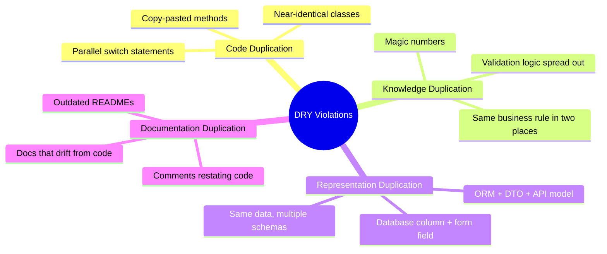
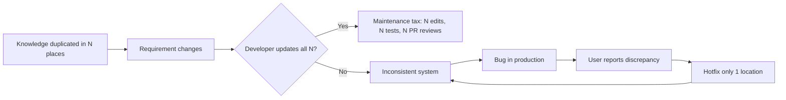
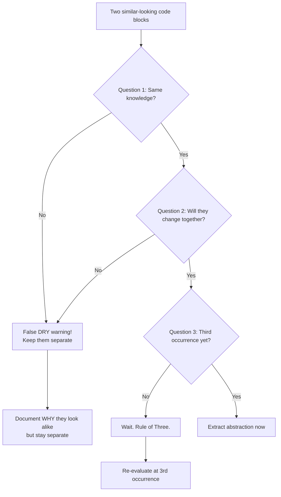
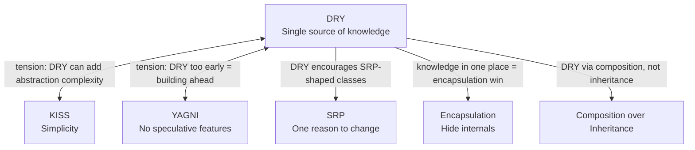

# DRY Principle — Don't Repeat Yourself

#oop #design-principles #dry #refactoring #maintainability #duplication #abstraction #teaching #deep-dive

> [!quote] Hunt & Thomas, *The Pragmatic Programmer*
> "Every piece of knowledge must have a single, unambiguous, authoritative representation within a system."

The **DRY Principle** is one of the most cited maxims in software engineering — and one of the most consistently misunderstood. Beginners think DRY means "no copy-pasted code." That is the trivial case. The real principle is much deeper: it is about **knowledge**, not text, and once you internalize the distinction, your designs change shape.

This note unpacks DRY in full: what *knowledge* means here, the four kinds of repetition, why DRY violations rot codebases, the refactor moves that achieve DRY, and — crucially — when DRY goes wrong (premature abstraction, false DRY, and the cost of over-consolidation).

Prerequisites: [[Encapsulation]], [[Classes-And-Objects]], [[Methods-And-Functions]]. Read alongside [[KISS-Principle]] and [[YAGNI-Principle]] — the three form a tension triangle that every senior engineer juggles daily.

---

## 1. The Principle, In One Sentence

> **Every piece of knowledge must have a single, unambiguous, authoritative representation within a system.**

Three words deserve close attention:

- **"Knowledge"** — not "code," not "text," not "lines." Knowledge means *any* fact, rule, decision, or piece of information that the system encodes. A tax rate is knowledge. A URL pattern is knowledge. A decision about how emails are formatted is knowledge.
- **"Single"** — exactly one place. Not "mostly one place, with a few mirrors."
- **"Authoritative"** — when the knowledge changes, you change one location, and the entire system reflects the new truth automatically. No "remember to also update the docs" reminders, no "find-and-replace across 14 files" rituals.

> [!important] The DRY Test
> If you change a piece of knowledge in one place and you must also change another place to keep the system consistent, you have a DRY violation.

This test is more useful than any text-similarity detector. Two functions can look 99% identical and still represent *different* knowledge (see [[#7.2 False DRY: Things Look Similar but Aren't]]). Two functions can look completely different and still violate DRY because they encode the same business rule in two forms.

---

## 2. What DRY Is NOT

> [!warning] Common Misconception
> DRY is **not** "don't copy-paste code." Code duplication is the *shallowest* form of repetition. Eliminating copy-paste without understanding *what* is being duplicated produces worse code, not better.

### 2.1 Not "Never Repeat Lines of Code"

Consider two functions:

```python
def validate_email(email: str) -> bool:
    return "@" in email and "." in email.split("@")[1]

def validate_phone(phone: str) -> bool:
    return phone.startswith("+") and phone[1:].isdigit()
```

These look *structurally* identical: both check a string format. A junior engineer, "DRYing" them, might extract a `validate_string(value, rules)` function. But the *knowledge* in each function is different: email format rules and phone format rules are unrelated business facts that change for unrelated reasons. Forcing them into one abstraction *couples* them. This is **false DRY**, and it is one of the most common over-engineering mistakes in the wild.

### 2.2 Not "Reduce Line Count"

DRY is about reducing *representations of knowledge*, not about reducing lines. A 200-line function may be perfectly DRY. A 20-line function may violate DRY three times. Line count is a proxy for nothing.

### 2.3 Not "Use Inheritance Everywhere"

The original *Pragmatic Programmer* formulation predates the modern OOP inheritance backlash. Many developers in the 2000s "achieved DRY" by pushing shared code up a class hierarchy. This often trades duplication for the Fragile Base Class problem. Modern DRY is achieved through [[Composition-Over-Inheritance|composition]] and small focused functions far more often than through inheritance.

---

## 3. The Four Kinds of Repetition

Hunt and Thomas describe DRY violations across four dimensions. Recognising each kind is the first step to removing them.



### 3.1 Code Duplication (Obvious)

The kind everyone recognises. Two functions with identical bodies, two classes with similar fields, parallel `if/elif` ladders in different files.

```python
# WET — Write Everything Twice
def calculate_monthly_salary_engineer(engineer):
    base = engineer.base_salary
    bonus = engineer.bonus or 0
    tax = (base + bonus) * 0.25
    return (base + bonus) - tax

def calculate_monthly_salary_manager(manager):
    base = manager.base_salary
    bonus = manager.bonus or 0
    tax = (base + bonus) * 0.30
    return (base + bonus) - tax
```

The duplicated code here is the formula `return (base + bonus) - tax`. Only the rate differs. DRY refactor:

```python
def calculate_monthly_salary(employee, tax_rate: float) -> float:
    base = employee.base_salary
    bonus = employee.bonus or 0
    tax = (base + bonus) * tax_rate
    return (base + bonus) - tax

ENGINEER_TAX_RATE = 0.25
MANAGER_TAX_RATE = 0.30
```

Now the *formula* has one home; the *rate* has one home. Change either, and you change one place.

### 3.2 Knowledge Duplication (Dangerous)

The same business rule encoded in two different places, often in two different forms. This is far worse than code duplication because the duplication is invisible to text comparison tools.

```python
# File: pricing.py
def compute_discount(customer):
    if customer.tier == "GOLD":
        return 0.10
    elif customer.tier == "SILVER":
        return 0.05
    return 0.0

# File: report.py
def discount_label(customer):
    if customer.tier == "GOLD":
        return "10% off"
    elif customer.tier == "SILVER":
        return "5% off"
    return "no discount"
```

The *knowledge* "GOLD = 10%, SILVER = 5%" exists in two places. When marketing decides GOLD should now be 12%, somebody has to remember to update both. They won't. The system rots.

DRY refactor: extract a single source of truth.

```python
# File: tiers.py
from enum import Enum

class CustomerTier(Enum):
    GOLD = 0.10
    SILVER = 0.05
    BRONZE = 0.0

    @property
    def label(self) -> str:
        return f"{int(self.value * 100)}% off" if self.value else "no discount"

# File: pricing.py
from tiers import CustomerTier

def compute_discount(customer) -> float:
    return customer.tier.value

# File: report.py
from tiers import CustomerTier

def discount_label(customer) -> str:
    return customer.tier.label
```

Now the rule lives in the `CustomerTier` enum. Marketing changes one constant; the entire system updates.

### 3.3 Representation Duplication

The same data exists in multiple forms: a database row, an ORM model, a DTO, a JSON API schema, a form on the frontend. Each form is technically necessary (different layers need different shapes), but the *knowledge* of the shape is often duplicated.

```python
class UserORM:                # Database layer
    id: int
    email_address: str
    full_name: str

class UserDTO:                # Service layer
    user_id: int
    email: str
    name: str

class UserAPIResponse:        # API layer
    id: int
    email: str
    displayName: str
```

Each class redefines the *knowledge* that "a user has an ID, an email, and a name" — and each uses slightly different field names. A rename in one layer drifts from the others. DRY approaches include shared schema definitions (e.g., Pydantic models that the ORM also uses), or code generation from a single source (e.g., OpenAPI → client + server stubs).

### 3.4 Documentation Duplication

> [!quote] The Pragmatic Programmer
> "Comments that restate code are not DRY. They are a maintenance liability."

Documentation that duplicates code drifts. If you write `# adds 5% tax` next to `tax = price * 0.05`, you have two representations of the same fact. When someone changes `0.05` to `0.07` and forgets to update the comment, you have a lie in your codebase. The DRY approach: write self-documenting code (good names, expressive types) and reserve comments for *why* (decisions, trade-offs), not *what*.

---

## 4. The Cost of DRY Violations

Why does DRY matter? Because every duplication is a *future bug waiting to happen*.



### 4.1 The Maintenance Tax

Every duplicated piece of knowledge multiplies the cost of change. If the tax rate appears in seven places, every rate change costs seven edits, seven test runs, seven reviews. Over a year, that is hundreds of dollars of engineering time spent on a fact that should cost one edit.

### 4.2 The Inconsistency Trap

Worse than the cost is the *risk*. If a developer updates six of the seven locations and misses one, the system is now internally inconsistent. Some customers pay the old rate; some pay the new rate. The bug appears only in the code path that hits the missed location. It may not be discovered for months.

### 4.3 The Fear of Change

Codebases with pervasive duplication develop a culture of fear. Engineers stop refactoring because "we don't know what else will break." They add new code rather than modify existing code, because new code is safe. The codebase grows monotonically. Eventually nobody understands it.

---

## 5. WET — The Opposite of DRY

The acronym **WET** is variously expanded as:

- **W**rite **E**verything **T**wice
- **W**e **E**njoy **T**yping
- **W**aste **E**veryone's **T**ime

WET code is the default state of an undisciplined codebase. Without conscious effort, duplication accumulates. The reason is simple: it is faster *in the moment* to copy a block of code than to design a shared abstraction. WET optimises for the next ten minutes; DRY optimises for the next ten months.

> [!tip] Teaching Tip
> Have students keep a "duplication diary" for one week. Every time they copy-paste, they log it. At the end of the week, ask: which of those duplications would have hurt you if the underlying requirement changed? They will be surprised how many would have.

---

## 6. How to Achieve DRY

DRY is achieved through refactoring moves. Each move has a context where it fits.

### 6.1 Extract Method / Extract Function

The simplest move. When two functions share a meaningful block, extract that block into a third function.

```python
# Before
def send_welcome_email(user):
    subject = f"Welcome, {user.name}!"
    body = render_template("welcome.html", user=user)
    smtp.send(user.email, subject, body)

def send_password_reset(user):
    subject = f"Reset your password, {user.name}"
    body = render_template("reset.html", user=user)
    smtp.send(user.email, subject, body)

# After
def send_email(user, template_name: str, subject: str) -> None:
    body = render_template(template_name, user=user)
    smtp.send(user.email, subject, body)

def send_welcome_email(user):
    send_email(user, "welcome.html", f"Welcome, {user.name}!")

def send_password_reset(user):
    send_email(user, "reset.html", f"Reset your password, {user.name}")
```

The shared *knowledge* — "emails are sent by rendering a template and calling SMTP" — now has one home.

### 6.2 Extract Class

When a class grows to contain multiple unrelated responsibilities (a [[Single-Responsibility|SRP]] violation), the shared code often belongs in a separate collaborator.

```python
# Before — report class mixes data + formatting + transmission
class Report:
    def __init__(self, data):
        self.data = data
    def to_pdf(self) -> bytes: ...
    def to_html(self) -> str: ...
    def email_to(self, recipient: str) -> None: ...
    def upload_to_s3(self) -> str: ...

# After — separate concerns
class Report:
    def __init__(self, data):
        self.data = data

class PdfFormatter:
    def format(self, report: Report) -> bytes: ...

class EmailSender:
    def send(self, content: bytes, to: str) -> None: ...

class S3Uploader:
    def upload(self, content: bytes) -> str: ...
```

Each class has one responsibility. The knowledge of "how to format PDF" lives in `PdfFormatter` and nowhere else.

### 6.3 Inheritance (Carefully)

When two classes genuinely share an *is-a* relationship and the same logic, inheritance can DRY the code. Use with caution: it couples the classes for life, and changes to the parent ripple to all children.

```python
from abc import ABC, abstractmethod

class Employee(ABC):
    def __init__(self, name, base_salary):
        self.name = name
        self.base_salary = base_salary

    @abstractmethod
    def bonus(self) -> float: ...

    def monthly_pay(self) -> float:
        return (self.base_salary + self.bonus()) / 12

class Engineer(Employee):
    def bonus(self) -> float:
        return self.base_salary * 0.10

class Manager(Employee):
    def bonus(self) -> float:
        return self.base_salary * 0.20
```

The `monthly_pay` formula has one home. Each subclass owns only what differs: the bonus rule.

### 6.4 Composition

The modern, preferred alternative to inheritance for DRY. Define small focused classes and compose them.

```python
class BonusPolicy:
    def for_base(self, base: float) -> float: ...

class TenPercentBonus(BonusPolicy):
    def for_base(self, base: float) -> float:
        return base * 0.10

class TwentyPercentBonus(BonusPolicy):
    def for_base(self, base: float) -> float:
        return base * 0.20

class Employee:
    def __init__(self, name, base_salary, bonus_policy: BonusPolicy):
        self.name = name
        self.base_salary = base_salary
        self.bonus_policy = bonus_policy

    def monthly_pay(self) -> float:
        return (self.base_salary + self.bonus_policy.for_base(self.base_salary)) / 12
```

Composition lets you mix policies freely (`Manager` with `TenPercentBonus` for a probationary period) without inheritance gymnastics.

### 6.5 Configuration over Code

When the *knowledge* is a set of constants (rates, thresholds, URLs, tier names), lift it out of code entirely into configuration.

```python
# Before — knowledge is embedded in code
def shipping_cost(weight):
    if weight < 1.0:
        return 5.00
    elif weight < 5.0:
        return 10.00
    return 20.00

# After — knowledge lives in config
# config.yaml:
#   shipping:
#     tiers:
#       - max_weight: 1.0
#         cost: 5.00
#       - max_weight: 5.0
#         cost: 10.00
#       - max_weight: inf
#         cost: 20.00

def shipping_cost(weight, tiers):
    for tier in tiers:
        if weight < tier["max_weight"]:
            return tier["cost"]
    return tiers[-1]["cost"]
```

Now operations staff can change shipping rates without a code deploy.

---

## 7. When DRY Goes Wrong

DRY has a shadow side. Pursued blindly, it produces over-abstraction, accidental coupling, and code that is harder to read than the duplication it replaced.

### 7.1 Premature DRY

Extracting an abstraction on the *second* occurrence is almost always a mistake. You don't yet know what varies and what stays the same. The right moment to DRY is the *third* occurrence — the **Rule of Three**.

> [!important] Rule of Three
> "Three strikes and you refactor." When the same knowledge appears for the third time, extract the abstraction. By the third occurrence you have enough information to design the abstraction correctly.

Premature DRY usually extracts the wrong interface. You generalise on two examples; the third example doesn't fit; you either distort the abstraction or add parameters to handle the special case, and the abstraction rots.

### 7.2 False DRY: Things Look Similar but Aren't

Two pieces of code can be textually similar yet represent different knowledge.

```python
def validate_username(name: str) -> bool:
    return 3 <= len(name) <= 20 and name.isalnum()

def validate_product_code(code: str) -> bool:
    return 3 <= len(code) <= 20 and code.isalnum()
```

The bodies are identical. The temptation is to extract `validate_alnum_field(value, min_len, max_len)`. But the *knowledge* is different: username rules and product-code rules change for unrelated reasons. Marketing may decide product codes can include hyphens next quarter; that decision has nothing to do with usernames.

Forcing them into one abstraction couples them: a change to product-code validation now risks breaking username validation. This is worse than duplication.



### 7.3 Over-Abstraction

Even when the knowledge is the same, the abstraction can be wrong. Symptoms:

- The shared function takes a `config` dict with twenty optional keys.
- Every caller passes different combinations of parameters.
- The function is harder to read than the duplicated code would have been.
- Tests for the abstraction are themselves complex enough to need tests.

When you find yourself writing `if config.get("mode") == "advanced"` inside an abstraction, you have over-abstracted. Back off. Split into two simpler abstractions, or accept some duplication.

> [!warning] The Wrong-Abstraction Problem
> "Duplication is far cheaper than the wrong abstraction." — Sandi Metz. A wrong abstraction *forces* every future change to fight the abstraction. Duplication just costs an extra edit. When in doubt, leave the duplication and add a `# TODO: revisit when we have a third case` comment.

---

## 8. The Rule of Three

The Rule of Three is the *safety valve* on DRY. It says: tolerate duplication twice; on the third occurrence, refactor.

### 8.1 Why Three?

- **One occurrence** is just code. You have no information about variation.
- **Two occurrences** tells you *that* something is repeated. You still don't know what varies versus what stays the same. The two examples may differ in subtle ways that you'll only see in the third.
- **Three occurrences** gives you a triangle. You can now see the axis of variation. The abstraction you design will be informed by three data points, not two.

### 8.2 The Refactor Ritual

On the third occurrence:

1. Write the new case, *copy-pasted*, with a `# TODO: Rule of Three — refactor` marker.
2. The tests pass; ship it.
3. In a separate commit, extract the abstraction. Update all three call sites.
4. The tests still pass; ship the refactor.

This separation keeps the refactor reviewable. The diff is "introduce abstraction," not "add feature and also restructure everything."

---

## 9. A Complete Before/After Example

### 9.1 The WET Version

```python
# order_service.py
def process_order(order):
    subtotal = sum(item.price * item.quantity for item in order.items)
    tax = subtotal * 0.20
    total = subtotal + tax
    if order.customer.tier == "GOLD":
        discount = total * 0.10
        total -= discount
    elif order.customer.tier == "SILVER":
        discount = total * 0.05
        total -= discount
    order.total = total
    return total

# invoice_service.py
def generate_invoice(order):
    subtotal = sum(item.price * item.quantity for item in order.items)
    tax = subtotal * 0.20
    total = subtotal + tax
    if order.customer.tier == "GOLD":
        total *= 0.90  # 10% off — but expressed differently!
    elif order.customer.tier == "SILVER":
        total *= 0.95
    invoice = Invoice(subtotal=subtotal, tax=tax, total=total)
    return invoice
```

The duplicated knowledge:
1. The subtotal formula (appears twice).
2. The tax rate `0.20` (appears twice).
3. The tier-disount rules (appear twice, and expressed differently — `total - discount` vs `total * 0.90`).

A change to any of these is a bug waiting to happen.

### 9.2 The DRY Version

```python
# pricing.py
from enum import Enum

TAX_RATE = 0.20

class CustomerTier(Enum):
    GOLD = 0.10
    SILVER = 0.05
    BRONZE = 0.0

def subtotal_of(order) -> float:
    return sum(item.price * item.quantity for item in order.items)

def discount_for(customer) -> float:
    return customer.tier.value

def total_for(order) -> float:
    sub = subtotal_of(order)
    taxed = sub * (1 + TAX_RATE)
    return taxed * (1 - discount_for(order.customer))

# order_service.py
from pricing import total_for

def process_order(order):
    order.total = total_for(order)
    return order.total

# invoice_service.py
from pricing import total_for, subtotal_of, TAX_RATE, discount_for

def generate_invoice(order):
    sub = subtotal_of(order)
    tax = sub * TAX_RATE
    total = total_for(order)
    return Invoice(subtotal=sub, tax=tax, total=total)
```

Every piece of pricing knowledge now has exactly one home. Marketing changes `GOLD = 0.12`? One edit. Finance changes the tax rate? One edit. The two services compose the primitives; they don't re-derive them.

```mermaid
flowchart LR
    subgraph WET ["WET (Before)"]
        direction TB
        A1[order_service<br/>calculates subtotal]
        A2[order_service<br/>hard-codes tax 0.20]
        A3[order_service<br/>hard-codes GOLD=0.10]
        B1[invoice_service<br/>calculates subtotal]
        B2[invoice_service<br/>hard-codes tax 0.20]
        B3[invoice_service<br/>hard-codes GOLD=0.90]
    end
    subgraph DRY ["DRY (After)"]
        direction TB
        C1[pricing.py<br/>subtotal_of]
        C2[pricing.py<br/>TAX_RATE]
        C3[pricing.py<br/>CustomerTier]
        D1[order_service<br/>calls total_for]
        D2[invoice_service<br/>calls total_for]
    end
    WET -->|refactor| DRY
```



---

## 10. DRY Across Layers

DRY applies beyond classes. It applies to:

- **Database schemas and ORM models** — the schema and the model both represent "what fields a User has." Use code generation or a single source (SQLAlchemy's `declarative_base`, Django's models) so they cannot drift.
- **API contracts** — OpenAPI specs, client SDKs, and server stubs all encode the same shapes. Generate them from one spec.
- **Validation logic** — frontend forms and backend validators often duplicate the same rules. Generate validators from a shared schema (Pydantic, JSON Schema).
- **Configuration and defaults** — defaults in code, defaults in config files, defaults documented in READMEs. Three representations of the same fact. Pick one (the config file) and have the code read from it.

---

## 11. DRY and Tests

Tests are also subject to DRY, but with a twist. Over-DRYing tests produces *mystery tests* — tests so abstracted that you cannot tell what they verify by reading them.

```python
# Over-DRYed — opaque
def test_all_endpoints():
    for endpoint, expected in ENDPOINT_MATRIX:
        assert client.get(endpoint).status_code == expected
```

If this fails, the failure message tells you "expected 200, got 404" but not *which* endpoint or *why* it matters. A DRYer-in-spirit version keeps each test self-explanatory:

```python
def test_users_endpoint_returns_200():
    assert client.get("/users").status_code == 200

def test_orders_endpoint_returns_200():
    assert client.get("/orders").status_code == 200
```

These tests are textually repetitive but each encodes a distinct requirement. This is acceptable — even desirable — duplication. See [[KISS-Principle]] for the trade-off.

---

## 12. Teaching Tips

> [!tip] Teaching Tip 1 — The "Change One Thing" Exercise
> Give students a small WET codebase (the order/invoice example above works well). Ask them to change the GOLD discount from 10% to 12%. Time them. Then ask them to change the tax rate from 20% to 18%. Time them again. The pain they feel *is* the lesson.

> [!tip] Teaching Tip 2 — The False-DRY Trap
> Show students the `validate_username` / `validate_product_code` example and ask them to "DRY it." Most will extract a shared validator. Then ask: "Marketing wants product codes to allow hyphens, but usernames must stay alphanumeric. Update your DRY code." Watch them struggle. The struggle teaches why false DRY is worse than duplication.

> [!tip] Teaching Tip 3 — The Duplication Diary
> Assign students to keep a one-week log of every copy-paste they perform in a real project. At the end of the week, classify each as "true duplication" (same knowledge) or "coincidental similarity" (different knowledge). Most students discover that fewer than half of their copy-pastes were true duplication.

---

## 13. Common Student Misconceptions

> [!warning] Misconception 1 — "DRY means no two functions can look alike."
> False. DRY means no two places encode the same *knowledge*. Two functions can be textually identical and represent different knowledge; they should stay separate.

> [!warning] Misconception 2 — "If I see duplication, I must extract an abstraction immediately."
> False. The Rule of Three says wait for the third occurrence. Premature DRY produces wrong abstractions, which are worse than duplication.

> [!warning] Misconception 3 — "DRY always reduces line count."
> False. A DRY refactor may *increase* lines (more small functions, more type hints, more docstrings) while reducing the *knowledge* surface. Line count is the wrong metric.

> [!warning] Misconception 4 — "Inheritance is the way to achieve DRY."
> Sometimes. Modern DRY prefers composition. Inheritance couples subclasses to the parent forever; composition lets you swap collaborators. See [[Composition-Over-Inheritance]].

> [!warning] Misconception 5 — "Comments re-stating the code are helpful documentation."
> They are DRY violations. They drift. Comments should explain *why* (decisions, trade-offs, links to tickets), never *what* (the code already says what).

---

## 14. Relationship to Other Principles



- **DRY vs [[KISS-Principle|KISS]]** — DRY can introduce abstraction layers that complicate the code. The Rule of Three helps: refactor only when the duplication is clearly costly.
- **DRY vs [[YAGNI-Principle|YAGNI]]** — DRYing speculative code locks in abstractions you may not need. Wait until the code is real.
- **DRY and [[Single-Responsibility|SRP]]** — A class with one responsibility tends to be a natural home for one piece of knowledge. SRP-shape classes are easier to keep DRY.
- **DRY and [[Encapsulation]]** — Encapsulation gives knowledge a place to live (inside the object). DRY ensures it lives in *only one* place.

---

## 15. Summary

| Aspect | Insight |
|---|---|
| **Core claim** | Every piece of knowledge has one authoritative home. |
| **Misunderstood as** | "Don't copy-paste code." (That's the shallow form.) |
| **Four kinds of duplication** | Code, Knowledge, Representation, Documentation. |
| **Cost of violation** | Maintenance tax, inconsistency bugs, fear of change. |
| **Safety valve** | Rule of Three — refactor on the third occurrence. |
| **Failure mode** | Premature / false DRY produces wrong abstractions. |
| **Achieved through** | Extract method, extract class, composition, configuration. |
| **Relationship** | Tension with KISS and YAGNI; aligned with SRP and Encapsulation. |

> [!success] The One-Sentence Takeaway
> DRY is not about eliminating repetition; it is about ensuring that when knowledge changes, you edit exactly one place — and the system updates itself.

## See Also

- [[KISS-Principle]] — the counterweight: simplicity over abstraction.
- [[YAGNI-Principle]] — the counterweight: don't DRY speculative code.
- [[Single-Responsibility]] — SRP-shaped classes are easier to keep DRY.
- [[Composition-Over-Inheritance]] — the modern way to DRY without inheritance pain.
- [[Refactoring-Strategies]] — extract method, extract class, and friends.
- [[Code-Smells]] — duplicated code is the canonical code smell.
- [[Encapsulation]] — gives knowledge a place to live.
