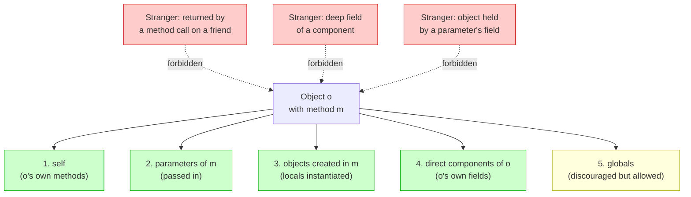
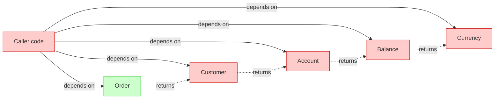
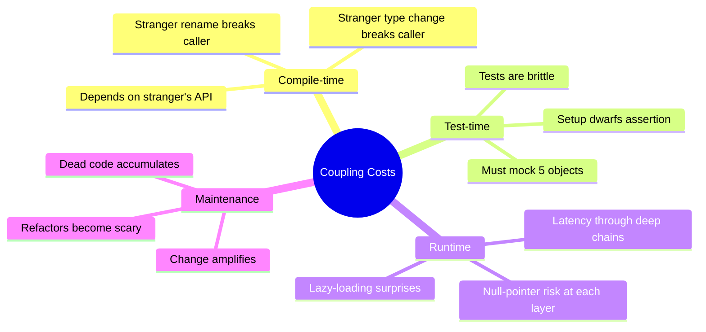
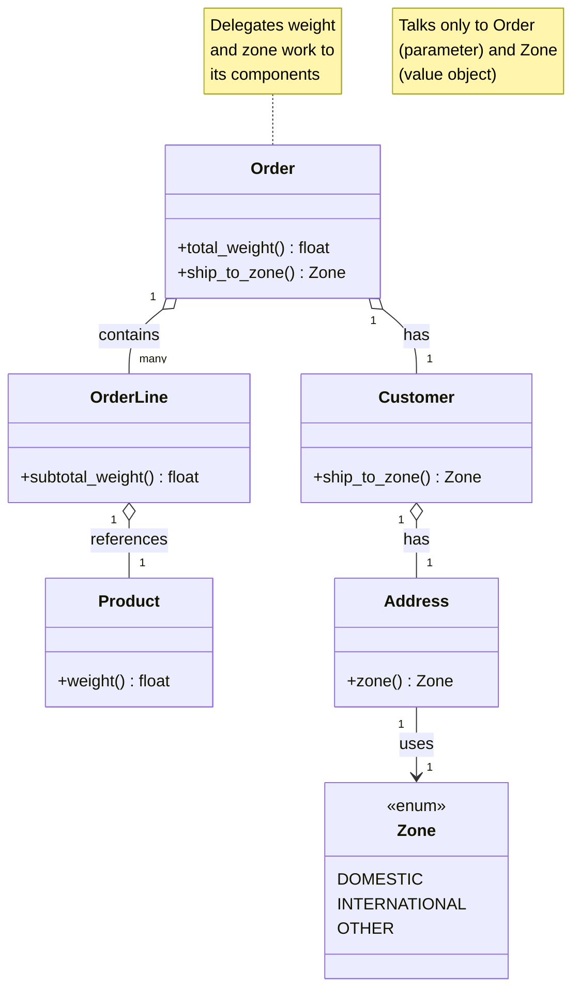
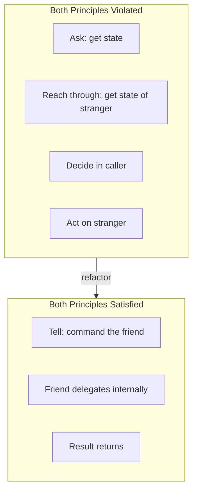
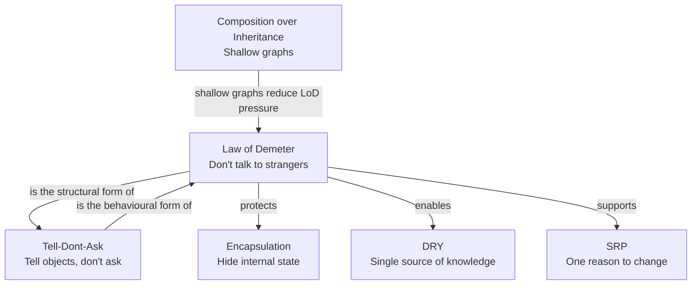

# Law of Demeter — Principle of Least Knowledge

#oop #design-principles #law-of-demeter #encapsulation #coupling #train-wreck #teaching #deep-dive

> [!quote] Ian Holland, Northeastern University, 1987
> "Each unit should have only limited knowledge about other units: only units closely related to the current unit. Each unit should only talk to its friends; don't talk to strangers. Only talk to immediate friends."

The **Law of Demeter** (LoD), also called the **Principle of Least Knowledge**, is a coupling-reduction rule for object-oriented design. Its memorable slogan — *"don't talk to strangers"* — captures the spirit: an object should interact only with its immediate collaborators, not with the internals of those collaborators. The classic violation is the **train wreck**:

```python
customer.get_account().get_balance().get_currency()
```

Each `.get_*()` call reaches one layer deeper. The original object (`customer`) ends up depending on the *currency* object — something it has never been introduced to. That is a stranger. Talking to strangers couples your code to the stranger's API, and when the stranger changes, your code breaks.

This note unpacks the Law: its formal statement, the train wreck smell, why violations are costly, the delegation refactor that fixes them, the relationship to [[Tell-Dont-Ask]], and the legitimate exceptions (DTOs, builders, fluent APIs).

Prerequisites: [[Encapsulation]], [[Classes-And-Objects]], [[Methods-And-Functions]]. Read alongside [[Tell-Dont-Ask]] — the two principles are siblings.

---

## 1. The Principle, In One Sentence

> **Only talk to your immediate friends; don't talk to strangers.**

The metaphor is social. If you want to borrow a ladder from your neighbour, you ask your neighbour. You do *not* walk through your neighbour's house, into their garage, past their car, and grab the ladder yourself. The neighbour decides whether to lend the ladder, which ladder, and how to deliver it.

In software: if object `A` wants something that object `C` can provide, and `A` only has a reference to `B` which has a reference to `C`, then `A` asks `B` to ask `C`. `A` does not reach through `B` to grab `C`.

---

## 2. Origin

The Law was formulated in 1987 at **Northeastern University** (Boston, USA) by **Ian Holland** and colleagues, as part of the **Demeter Project** — a research project on adaptive object-oriented programming, named after the Greek goddess of agriculture (the project's focus was on "growing" software). The Demeter project studied how to make object-oriented systems more adaptable to change; the Law emerged as a heuristic that reduced the ripple effect of changes.

The original formulation was more formal than the popular slogan. It was a constraint on methods: a method `m` of an object `o` may invoke only the methods of certain classes of objects. The popularisation as "don't talk to strangers" came later, as the rule spread beyond the research community into mainstream OOP practice via the Smalltalk, C++, and eventually Java and Python communities.

---

## 3. The Formal Rule

Let `o` be an object and `m` a method of `o`. Inside `m`, the method may send messages (call methods) only on the following objects:

1. **`o` itself** — calling `self.other_method()` is always allowed.
2. **Parameters of `m`** — arguments passed into the method.
3. **Objects created within `m`** — local variables instantiated inside the method body.
4. **Direct component objects of `o`** — fields of `o` (objects that `o` "owns" or holds a direct reference to).
5. **Global variables** (allowed in the original formulation, though modern practice discourages globals entirely).

Anything else is a **stranger** and must not be talked to.



### 3.1 What "Talks" Means

"Talking" means invoking a method. Reading a field (via attribute access or property) also counts: `customer.account.balance` is the same violation as `customer.get_account().get_balance()`. In Python, attribute chains are train wrecks just as much as method chains.

### 3.2 The Friend List, Precisely

A method's "friends" are precisely:

- `self`
- the method's parameters (positional and keyword)
- objects the method itself constructs (`X()` calls inside the method)
- `self`'s attributes (the object's direct components)
- module-level globals (rarely a good idea)

A friend of a friend is *not* a friend. If `B` is a friend (e.g., a parameter) and `B` returns `C`, then `C` is a stranger. Calling any method on `C` violates the Law.

---

## 4. The Train Wreck Smell

The most visible LoD violation. A train wreck is a chain of method or attribute calls, each reaching deeper into the object graph.

```python
# Train wreck — three strangers in a row
currency_code = order.get_customer().get_account().get_balance().get_currency().code

# Equivalent in attribute form (still a train wreck):
currency_code = order.customer.account.balance.currency.code
```

### 4.1 Why It's a Smell

The calling code now depends on:

- `order` (legitimate — direct friend)
- `order.customer` (a stranger — returned by `order`)
- `customer.account` (a stranger of a stranger)
- `account.balance` (a stranger of a stranger of a stranger)
- `balance.currency` (a stranger⁴)
- `currency.code` (a stranger⁵)

Six classes are coupled to this one line. If any of `Customer`, `Account`, `Balance`, or `Currency` changes its API — for example, if `Balance` is refactored to store currency as a string instead of a `Currency` object — this line breaks.



### 4.2 The Change Amplification

If `Account`'s API changes (say, `get_balance()` is renamed to `current_balance()`), the change ripples through every caller that reached into `account`. The LoD-compliant version, by contrast, would only require changes inside `Customer` (or wherever the delegation lives).

### 4.3 The Test Pain

Train wrecks are notoriously hard to unit test. To test `order.get_customer().get_account().get_balance().get_currency().code`, the test must construct a real `Order`, a real `Customer`, a real `Account`, a real `Balance`, and a real `Currency`. Five mock setups for one line of code. This is the test's way of telling you the design is wrong.

---

## 5. Why the Law Matters

### 5.1 Reduces Coupling

The fundamental benefit. By restricting whom an object talks to, the Law restricts what the object *knows about*. A LoD-compliant object knows its immediate collaborators' APIs and nothing else. When a deep collaborator changes API, the LoD-compliant caller is unaffected.

### 5.2 Improves Encapsulation

Each object hides not only its own state but the *existence* of its collaborators. `Customer` does not expose that it has an `Account`; it exposes behaviour like `customer.currency_for_statement()`. The internal structure of `Customer` (whether it uses an `Account`, a `Wallet`, or just a `currency` string) is private.

See [[Encapsulation]].

### 5.3 Localises Change

When `Account`'s internal structure changes, only `Account` and its direct friends need to update. Callers of `Customer` are shielded. This is the locality-of-change property that makes large codebases maintainable.

### 5.4 Improves Testability

LoD-compliant code has fewer deep dependencies. Tests mock only the direct collaborators of the unit under test. Each test is small and focused.

### 5.5 Enables Polymorphism

When you reach through an object (`customer.account.balance`), you bind to a concrete type. When you tell the object what you need (`customer.statement_currency()`), the object can decide how to satisfy the request — including by polymorphism. `Customer` subclasses can return different currencies without the caller knowing.

---

## 6. How to Fix Violations

The canonical fix is **delegation**. Add a method to the immediate friend that performs the work and returns the result. The caller stays shallow; the work moves into the friend.

### 6.1 Before — Train Wreck

```python
def print_invoice(order):
    # Reaches four layers deep
    currency = order.customer.account.balance.currency
    amount = order.customer.account.balance.amount
    print(f"Total: {amount} {currency.code}")
```

### 6.2 After — Delegation

Add delegating methods at each layer:

```python
class Order:
    def __init__(self, customer):
        self._customer = customer

    def invoice_total(self) -> "Money":
        return self._customer.invoice_total()

class Customer:
    def __init__(self, account):
        self._account = account

    def invoice_total(self) -> "Money":
        return self._account.balance()

class Account:
    def __init__(self, balance: "Money"):
        self._balance = balance

    def balance(self) -> "Money":
        return self._balance

class Money:
    def __init__(self, amount: float, currency: "Currency"):
        self._amount = amount
        self._currency = currency

    @property
    def amount(self) -> float:
        return self._amount

    @property
    def currency(self) -> "Currency":
        return self._currency

    def format(self) -> str:
        return f"{self._amount} {self._currency.code}"

# Caller — now LoD-compliant
def print_invoice(order):
    print(f"Total: {order.invoice_total().format()}")
```

The caller now talks only to `order` (a direct friend, presumably a parameter) and to the `Money` object that `order.invoice_total()` returns. The `Money` object is allowed because it was *returned* by a method on a friend — but wait, isn't that a stranger?

> [!note] A Subtle Point
> The strictest reading of LoD forbids calling *any* method on a returned object. In practice, the rule is relaxed for **value objects** and **DTOs** — objects whose purpose is to be data carriers. Calling `.format()` on a returned `Money` is acceptable because `Money` is a value object. Calling `.get_account()` on a returned `Customer` is *not* acceptable, because `Customer` is an entity with hidden internal structure. The distinction is discussed in [[#8. When the Law Is Too Strict]].

```mermaid
flowchart LR
    subgraph Before ["Before — Train Wreck"]
        direction LR
        B0["print_invoice(order)"] --> B1[order.customer]
        B1 --> B2[customer.account]
        B2 --> B3[account.balance]
        B3 --> B4[balance.currency]
        B4 --> B5[currency.code]
    end
    subgraph After ["After — Delegation"]
        direction LR
        A0["print_invoice(order)"] --> A1["order.invoice_total()"]
        A1 --> A2["money.format()"]
        A2 --> A3["formatted string"]
    end
    Before -->|refactor| After
    style Before fill:#fdd,stroke:#c00
    style After fill:#dfd,stroke:#0a0
```



### 6.3 The Delegation Cost

Delegation is not free. Each delegation method is a small amount of boilerplate: a one-line method that calls through to the collaborator. For a deep object graph, this can add up. Three mitigations:

1. **Don't delegate everything.** Delegate only the methods that callers actually need. If nobody outside `Customer` ever calls `customer.account.balance`, do not add `customer.balance()`. Add delegations when a real call site needs them.
2. **Reconsider the object graph.** If `Order` is constantly reaching into `Customer`, maybe `Order` should *hold* a direct reference to `Money` (its invoice total) rather than computing it on demand. Restructuring beats blind delegation.
3. **Use composition over deep nesting.** Shallow object graphs rarely produce train wrecks. See [[Composition-Over-Inheritance]].

### 6.4 Tell, Don't Ask

The deeper fix is often to *tell* the object what to do rather than *ask* it for data. Instead of `print(order.customer.account.balance.format())`, tell the order: `order.print_invoice(stream)`. The order knows how to format itself; the caller doesn't need to know the internal structure at all. See [[Tell-Dont-Ask]].

---

## 7. Coupling, Visualised



The Law of Demeter is fundamentally about controlling the **coupling fan-out** of a method. A LoD-compliant method has a small, enumerable set of dependencies: itself, its parameters, its components. A LoD-violating method has a fan-out that grows with the depth of the chain — and grows further every time the deep structure changes.

---

## 8. When the Law Is Too Strict

The Law in its strict form is impractical for some idioms. Recognising these exceptions prevents over-application.

### 8.1 Data Transfer Objects (DTOs)

A DTO is an object whose entire purpose is to carry data across a boundary (network, layer, process). DTOs have public fields or trivial getters; their job is to be inspected. Reaching into a DTO (`response.user.email`) is not a LoD violation in spirit — there is no encapsulation to violate.

> [!important] DTO Exception
> When an object is *designed* to be a passive data carrier (a DTO, a parsed JSON response, a configuration object), the Law of Demeter does not apply. The Law protects encapsulation; DTOs have no encapsulation to protect.

### 8.2 Builders and Fluent APIs

The Builder pattern and fluent APIs (e.g., `QueryBuilder.select(...).where(...).order_by(...).execute()`) deliberately chain method calls. Each call returns the builder itself (or a related builder), so the caller is always talking to a friend — the same object. The Law is not violated because the return type is the builder, and the builder is the friend.

```python
# Fluent API — looks like a train wreck but is LoD-compliant
query = (QueryBuilder()
         .select("name", "email")
         .where("active = True")
         .order_by("name")
         .build())
```

Each method returns `self` (the `QueryBuilder`), so every call is on the same friend. The chain reads naturally and the Law is satisfied.

### 8.3 Collections and Iteration

Iterating over a collection and operating on each element is a LoD-acceptable pattern, because the elements are typically value objects or because the iteration itself is a single conceptual operation:

```python
for user in users:
    print(user.name)  # acceptable: user is a value object
```

### 8.4 The Heuristic

> [!tip] When to Apply the Law
> Apply the Law aggressively to **entities** (objects with identity, behaviour, and hidden state). Apply it loosely to **value objects** (immutable data carriers like `Money`, `Date`, `Point`). Do not apply it to **DTOs** (passive data shapes), **builders** (fluent APIs), or **collections of value objects**.

The distinction maps to the [[Abstraction|abstraction]] level: the Law protects *encapsulated* objects. Objects with no encapsulation have nothing to protect.

---

## 9. A Complete Before/After Example

### 9.1 The Violation

A shipping cost calculator reaches deep into the order's structure:

```python
def shipping_cost(order) -> float:
    weight = 0.0
    for line in order.get_lines():
        product = line.get_product()
        weight += product.get_weight() * line.get_quantity()

    address = order.get_customer().get_address()
    zone = address.get_zone()
    if zone == "DOMESTIC":
        rate = 0.5
    elif zone == "INTERNATIONAL":
        rate = 2.5
    else:
        rate = 1.0

    return weight * rate
```

The function depends on `Order`, `OrderLine`, `Product`, `Customer`, `Address`, and the zone constants. Six classes. A change to any of them — say, `Address` storing zone as an enum instead of a string — breaks this function.

The zone logic itself is also a [[DRY-Principle|DRY]] violation: the rate-per-zone mapping is duplicated here and probably elsewhere.

### 9.2 The Fix — Delegation and Tell-Dont-Ask

Push the weight calculation into `Order`, the zone lookup into `Customer`, and the rate into a `ShippingRate` policy:

```python
class Order:
    def __init__(self, lines, customer):
        self._lines = lines
        self._customer = customer

    def total_weight(self) -> float:
        return sum(line.subtotal_weight() for line in self._lines)

    def ship_to_zone(self) -> "Zone":
        return self._customer.ship_to_zone()

class OrderLine:
    def __init__(self, product, quantity):
        self._product = product
        self._quantity = quantity

    def subtotal_weight(self) -> float:
        return self._product.weight() * self._quantity

class Product:
    def __init__(self, weight):
        self._weight = weight

    def weight(self) -> float:
        return self._weight

class Customer:
    def __init__(self, address):
        self._address = address

    def ship_to_zone(self) -> "Zone":
        return self._address.zone()

class Address:
    def __init__(self, zone):
        self._zone = zone

    def zone(self) -> "Zone":
        return self._zone

from enum import Enum

class Zone(Enum):
    DOMESTIC = 0.5
    INTERNATIONAL = 2.5
    OTHER = 1.0

    @classmethod
    def rate_for(cls, zone: "Zone") -> float:
        return zone.value

def shipping_cost(order) -> float:
    weight = order.total_weight()             # one friend: order
    zone = order.ship_to_zone()               # one friend: order
    return weight * zone.value                # zone is a value object: acceptable
```

The `shipping_cost` function now talks only to `order` (its parameter) and to `zone` (a value object returned by `order`). It no longer knows about `OrderLine`, `Product`, `Customer`, or `Address`. Changes to any of those classes do not break it.



### 9.3 The Test Improvement

The before-version required five mocks. The after-version requires constructing a real `Order` with simple components:

```python
def test_shipping_cost_domestic():
    product = Product(weight=2.0)
    line = OrderLine(product=product, quantity=3)  # 6 kg
    address = Address(zone=Zone.DOMESTIC)
    customer = Customer(address=address)
    order = Order(lines=[line], customer=customer)

    cost = shipping_cost(order)

    assert cost == 6.0 * 0.5  # weight * domestic rate
```

The test reads naturally. No mocks of `Customer` or `Address` — those are real objects with trivial behaviour. The test exercises the real delegation chain.

---

## 10. LoD and Tell-Dont-Ask

The Law of Demeter and [[Tell-Dont-Ask]] are siblings. Both reduce coupling by restricting what a caller can know.

- **LoD** says: don't reach *through* an object to get to its internals. Talk to your immediate friend.
- **Tell-Dont-Ask** says: don't *ask* an object for its state and then decide. *Tell* the object what to do; let it decide.



A train wreck is almost always both an LoD violation *and* an Ask-Dont-Tell pattern: the caller is reaching through the object to *ask* about state, then making decisions on that state. The fix — delegation — is also both: the caller tells the friend what it needs, the friend decides how to satisfy it.

See [[Tell-Dont-Ask]] for the full version.

---

## 11. LoD and DRY

The Law of Demeter and [[DRY-Principle|DRY]] reinforce each other. When you reach through an object to compute something, the *knowledge* of how to compute it lives in the caller — and is duplicated across every caller that does the same reach. When you push the computation into the object via delegation, the knowledge has one home (the object), and the callers become DRY.

In the shipping example, the weight calculation `sum(line.product.weight * line.quantity for line in order.lines)` was duplicated wherever shipping was computed. After delegation, `order.total_weight()` is the single source.

---

## 12. Teaching Tips

> [!tip] Teaching Tip 1 — The Train-Wreck Hunt
> Have students grep an existing codebase for `.*\..*\..*\..*` patterns (attribute chains of depth 3+). For each match, classify: is it an entity (apply LoD), a value object (acceptable), a DTO (acceptable), or a builder (acceptable)? The exercise builds the discriminating judgement that the Law requires.

> [!tip] Teaching Tip 2 — The Mock Count
> When reviewing a student's unit test, count how many mocks it sets up. If a single test mocks more than two objects, the code under test is almost certainly violating LoD. Have the student refactor until the test mocks one or two collaborators. The test leads the design.

> [!tip] Teaching Tip 3 — The Refactor Ripple
> Give students a train-wreck-heavy codebase. Ask them to rename a deep attribute (say, `balance.currency` to `balance.currency_code`). Time how long it takes to fix the resulting breakage. Then have them apply delegation and repeat the exercise. The before-version breaks in N places; the after-version breaks in one. The contrast is visceral.

> [!tip] Teaching Tip 4 — The DTO vs Entity Distinction
> Show students a `User` entity and a `UserResponse` DTO with identical fields. Ask: which one should the Law apply to? Students often say "both." The answer: only the entity. The DTO is a passive data carrier; reaching into it is fine. This builds the discriminating skill.

---

## 13. Common Student Misconceptions

> [!warning] Misconception 1 — "LoD means I can never call a method on a returned object."
> Too strict. The Law applies to *entities* (encapsulated objects with hidden state). For *value objects* and *DTOs* — whose purpose is to be data carriers — calling methods on returned objects is acceptable.

> [!warning] Misconception 2 — "Every delegation method is good."
> No. Blind delegation produces "shotgun" code: dozens of one-line passthrough methods that add no value. Delegate only what callers actually need; restructure the object graph when delegation becomes pervasive.

> [!warning] Misconception 3 — "Fluent APIs violate LoD."
> No. Fluent APIs return `self` (or a related builder), so every call is on the same friend. The chain looks like a train wreck but is LoD-compliant.

> [!warning] Misconception 4 — "LoD is only about method calls, not attribute access."
> No. `customer.account.balance` is the same violation as `customer.get_account().get_balance()`. The Law applies to attribute access just as much as to method calls. Python's `@property` blurs the line further; treat the Law as applying to all "reach-through" access.

> [!warning] Misconception 5 — "LoD requires deep wrapper hierarchies."
> No. If your object graph is shallow (objects collaborating directly, not nesting deeply), the Law is satisfied naturally. Deep nesting is the smell; delegation is the patch. The deeper fix is to flatten the graph.

> [!warning] Misconception 6 — "LoD is academic; nobody follows it in production."
> False. Mature codebases (the Spring framework, the Django ORM, the .NET BCL) follow LoD extensively. The reason production codebases feel maintainable is precisely because senior engineers internalise the Law.

---

## 14. Relationship to Other Principles



- **LoD and [[Tell-Dont-Ask]]** — siblings. LoD is structural (don't reach through); Tell-Dont-Ask is behavioural (don't ask, tell).
- **LoD and [[Encapsulation]]** — LoD *enforces* encapsulation by forbidding reach-through.
- **LoD and [[DRY-Principle|DRY]]** — delegation moves knowledge from the caller into the object, giving it a single home.
- **LoD and [[Single-Responsibility|SRP]]** — a class that delegates cleanly tends to have one responsibility (mediating between its collaborators).
- **LoD and [[Composition-Over-Inheritance|Composition]]** — shallow composition graphs rarely produce train wrecks.

---

## 15. Summary

| Aspect | Insight |
|---|---|
| **Core claim** | Talk only to immediate friends; don't reach through them. |
| **Origin** | Northeastern University, Demeter Project, 1987 (Ian Holland). |
| **Formal rule** | `m` of `o` may call methods on: `o`, params of `m`, objects created in `m`, components of `o`, globals. |
| **Smell** | Train wreck: `a.b().c().d()`. |
| **Cost** | Coupling fan-out, change amplification, test pain. |
| **Fix** | Delegation: push the work into the friend. |
| **Exceptions** | DTOs, value objects, fluent APIs, builders. |
| **Siblings** | Tell-Dont-Ask (behavioural); Encapsulation (foundation). |

> [!success] The One-Sentence Takeaway
> If your code reaches through an object to grab something the object's collaborator owns, ask the object to hand it to you instead — and let the object decide whether and how to do so.

## See Also

- [[Tell-Dont-Ask]] — the behavioural twin of LoD.
- [[Encapsulation]] — what LoD protects.
- [[DRY-Principle]] — delegation centralises knowledge.
- [[Composition-Over-Inheritance]] — shallow graphs reduce LoD pressure.
- [[Single-Responsibility]] — delegation encourages SRP-shaped classes.
- [[Code-Smells]] — train wrecks (message chains) are a recognised smell.
- [[Refactoring-Strategies]] — Hide Delegate is the canonical LoD refactor.
