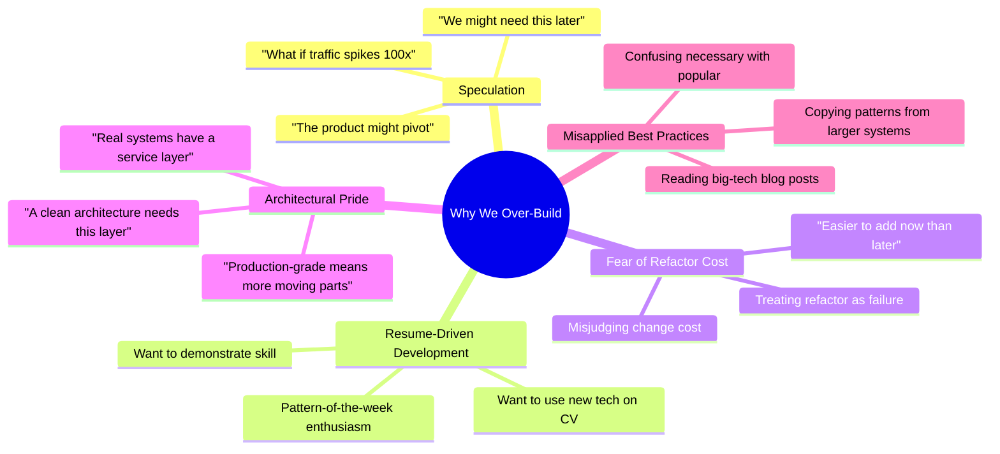
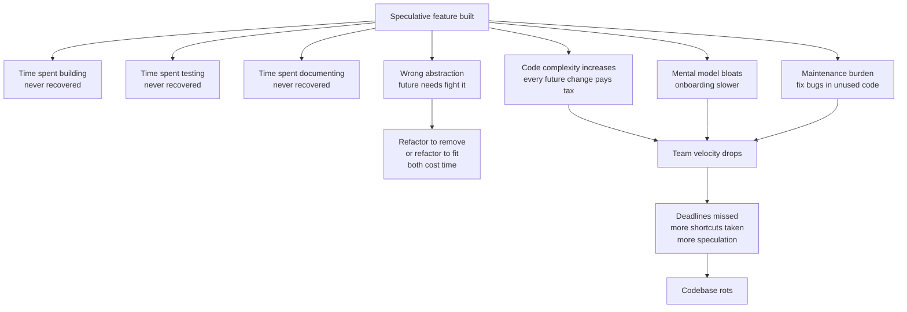
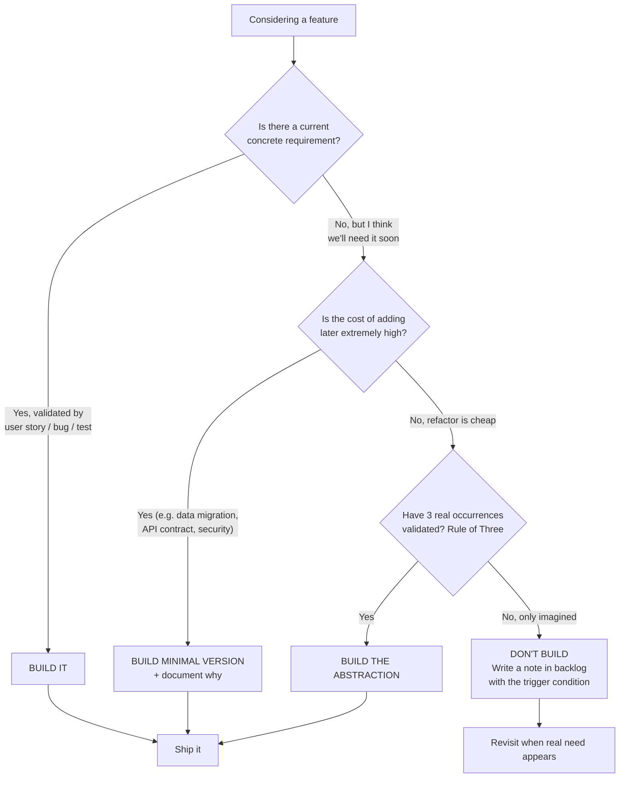
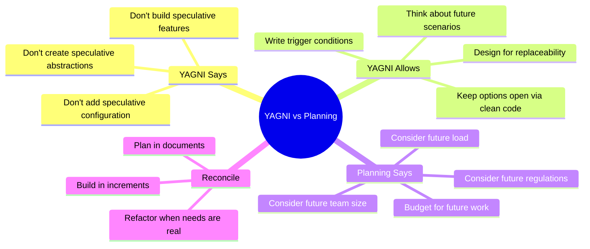
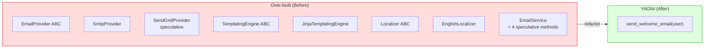
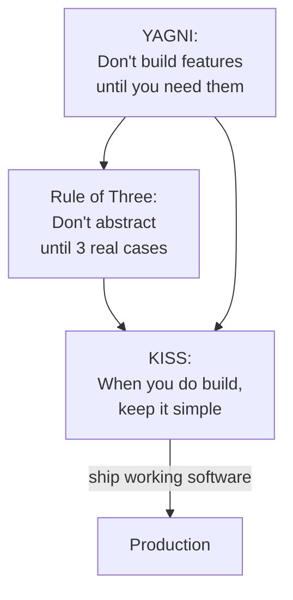
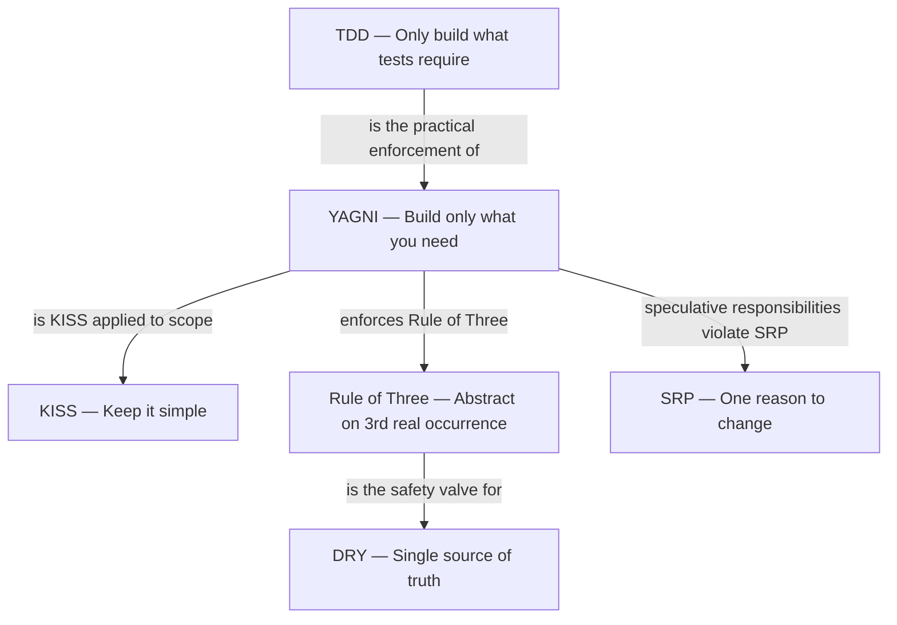

# YAGNI Principle — You Aren't Gonna Need It

#oop #design-principles #yagni #xp #simplicity #refactoring #teaching #deep-dive

> [!quote] Kent Beck, *Extreme Programming Explained*
> "Always implement things when you actually need them, never when you just foresee that you need them."

The **YAGNI Principle** is the brutal corrective to over-engineering. It says: **do not build functionality until you need it.** Not next quarter. Not "in case the product pivots." Not "because the architect thinks we might." Build it when — and only when — a concrete requirement forces it.

YAGNI originated in the **Extreme Programming (XP)** movement of the late 1990s, championed by **Ron Jeffries**, **Kent Beck**, and **Ward Cunningham**. It is the scope-flavour of [[KISS-Principle|KISS]]: KISS says "make the code you write simple," YAGNI says "don't write code you don't yet need." Together they form a powerful guard against the most common cause of codebase rot.

This note unpacks YAGNI: why we over-build, the costs of speculative features, when YAGNI is wrong, and the techniques that help engineers resist the temptation to build ahead.

Prerequisites: [[KISS-Principle]], [[DRY-Principle]], [[Classes-And-Objects]]. Read alongside [[Single-Responsibility]] (YAGNI violations often appear as speculative responsibilities).

---

## 1. The Principle, In One Sentence

> **Don't build functionality until you need it.**

Every word is load-bearing:

- **"Don't build"** — the principle is about *implementation*, not *thinking*. You should think ahead. You should *not* code ahead.
- **"Functionality"** — features, abstractions, configuration points, extension hooks. Anything that adds code to the system.
- **"Until you need it"** — need means a concrete, current requirement, validated by a user story, a failing test, or a production bug. Not a forecast.

> [!important] The YAGNI Test
> "If I deleted this code today, would any current user, test, or production behaviour break?" If the answer is no, the code is speculative. Delete it.

---

## 2. Origin and Context

YAGNI emerged from Extreme Programming's emphasis on **incremental design**. The XP community observed that large upfront designs — even those crafted by senior architects — were almost always wrong. The future did not unfold as predicted; the abstractions designed for the predicted future did not fit the actual future; and the team paid for the unused abstractions forever.

Ron Jeffries is often credited with the phrase itself, summarised in the XP mantra: *"Make it work, make it right, make it fast."* The order matters: first build what works, then refactor it right, then optimise it. *Speculative* generality skips "make it work" and jumps straight to "make it (speculatively) right" — and almost always guesses wrong.

The principle resonates with [[KISS-Principle|KISS]] (simplicity), with Agile's "working software over comprehensive documentation," and with the Lean Startup's "build-measure-learn" loop. All three say: build the smallest thing that teaches you something.

---

## 3. Why We Over-Build

Engineers over-build for predictable reasons. Naming them helps resist them.



### 3.1 Speculation — "We Might Need This Later"

The most common driver. The engineer imagines a future requirement and pre-builds for it. The imagined future is almost always more elaborate than the real future. The real future brings requirements nobody imagined, and the speculative code gets in the way.

### 3.2 Resume-Driven Development

Engineers want to use the latest framework, the latest pattern, the latest database. They find a way to justify it. The justification is often a speculative "we'll need this when we scale." The actual scaling need never materialises; the team is left maintaining Kafka, Kubernetes, and a microservice mesh for a system that serves 200 requests per day.

### 3.3 Fear of Refactor Cost

"We'll save time if we add it now." This belief — that adding a feature later is much more expensive than adding it now — is the root of much over-building. In practice, the cost of refactoring later is usually far smaller than the cost of maintaining speculative code for the months in between. Modern refactoring tools, comprehensive tests, and small commits have made "add it later" cheap.

### 3.4 Architectural Pride

Some engineers feel that "real" architectures have many layers: a controller, a service, a repository, a domain, a DTO, a mapper, a factory. For a CRUD app with 4 entities, this is theatre. The layers add cognitive load and zero value. The pride is in the architecture diagram, not in the working software.

### 3.5 Misapplied Best Practices

A team reads that Netflix uses a chaos engineering platform. They have 12 microservices. They build a chaos engineering platform. This is cargo-culting: copying the surface form of a practice without understanding the context that made it useful. See [[When-Not-To-Use-OOP]] for related anti-patterns.

---

## 4. The Cost of YAGNI Violations

Speculative code is not free. It taxes the system every day it exists.



### 4.1 Wasted Implementation Effort

The most visible cost: the hours spent designing, coding, reviewing, and testing a feature that is never used. Those hours are gone forever.

### 4.2 Maintenance Burden

Less visible but more damaging: speculative code stays in the codebase. Every refactor must navigate around it. Every code search returns it. Every test suite must continue to run its tests. Every dependency update must consider its dependencies. The cost compounds over time.

### 4.3 Wrong Abstractions

The deepest cost. When you build ahead, you guess at the abstraction. Your guess is based on imagined future requirements. When the real future arrives, the requirements are different — and your abstraction now *fights* the new requirements. You have two choices: refactor the abstraction (expensive, risky), or twist the new code to fit the old abstraction (produces ugly, hard-to-read code).

> [!quote] Sandi Metz
> "Duplication is far cheaper than the wrong abstraction."

The wrong abstraction is *worse* than no abstraction, because no abstraction lets you design the right one when the need is real.

### 4.4 Code Complexity

Every speculative feature adds branches, classes, configuration flags. The reader's cognitive load increases. The test surface area increases. The build time increases. All for code that does not serve any current user.

### 4.5 Documentation Drift

Speculative code is often underdocumented (because nobody knows how it should work). When it finally gets used, the new user reads the code, makes assumptions, and implements against the wrong assumptions. The speculative code becomes a trap.

### 4.6 The Mental-Model Tax

Every senior engineer on the team carries a mental model of the codebase. Speculative code bloats that model. The engineer spends more time remembering what the code does and less time thinking about what it should do.

---

## 5. The YAGNI Decision Tree



### 5.1 The Trigger Condition

When you decide *not* to build, write down the **trigger condition**: the specific event that would change the decision. "Add a plugin system when we have 3 customers asking for custom integrations." "Add a read replica when read latency exceeds 50ms p99." This is *planning* without *building*. It satisfies the architect's instinct to think ahead without burdening the codebase with speculation.

---

## 6. YAGNI vs Planning

This is the most common misunderstanding. YAGNI does *not* say "don't think about the future." It says "don't *build* for the future."



### 6.1 Thinking Ahead Is Allowed

Architects should think about future scaling, future team growth, future regulations. They should write architecture decision records (ADRs) describing the *anticipated* future and the *current* choices that keep options open.

### 6.2 Building Ahead Is Not

What YAGNI forbids is implementing the speculative future in code today. The thinking happens in documents; the building happens in increments. When the future arrives, you build *then*, with full information.

### 6.3 Designing for Replaceability

A subtle middle path: design current code so that *if* the future arrives, replacing the implementation is cheap. This means using small, well-named interfaces; keeping I/O at the edges; favouring [[Composition-Over-Inheritance|composition]]. None of this requires building the future feature. It just keeps the seam clean so the future feature can be slotted in without rewriting the world.

---

## 7. When YAGNI Is Wrong (Rare Cases)

YAGNI is a default, not an absolute. There are cases where building ahead is correct. They are rarer than engineers think, but they exist.

### 7.1 Data Migrations

If your system stores data, schema migrations are expensive. Adding a column later requires a backfill, a deploy, a verification. Adding the column *now*, when the table is small or empty, may be 100× cheaper. In this case, "build ahead" is justified — but the justification must be explicit, and the speculative column must be cheap to maintain (nullable, ignored by current code).

### 7.2 API Contracts

Once an API is public, changing it is brutal. You must version, deprecate, support old clients. Adding fields later is easy; *removing* or *renaming* fields later is hard. If you anticipate a field, you might add it now as `null`-able and document it as reserved. This is a calculated trade.

### 7.3 Security and Compliance

Security controls are difficult to retrofit. If you anticipate that a future feature will handle PII, building audit logging into the framework now — even before the feature exists — is cheaper than retrofitting audit logs across the entire codebase later. The cost of being wrong (no future PII) is low; the cost of being unprepared (PII ships without audit) is high.

### 7.4 The Heuristic

> [!important] When YAGNI Doesn't Apply
> YAGNI's exception applies when: (a) the cost of adding the feature later is *orders of magnitude* higher than adding it now, AND (b) the cost of maintaining the speculative code in the meantime is low. Both conditions must hold. If only one holds, YAGNI applies.

If you cannot articulate both conditions explicitly, default to YAGNI.

---

## 8. How to Fight the Urge to Over-Build

### 8.1 Test-Driven Development (TDD)

TDD is the single most effective YAGNI enforcement tool. You write a failing test that describes a real, current requirement. You write the minimum code to make it pass. You refactor. The discipline of "only build what tests require" makes speculation almost impossible — there is no test for "we might need this later," so the code for it never gets written.

See [[TDD-With-OOP]] for the workflow.

### 8.2 User Stories

A user story is a concrete, current requirement phrased from a user's perspective: "As a customer, I want to reset my password so I can log in when I forget it." If a feature cannot be phrased as a current user story, it is speculative. Park it in the backlog with a trigger condition.

### 8.3 Timeboxing

Set a strict timebox for the first version of any feature: "I will build password reset in 4 hours, no more." When the timer rings, ship what you have. Timeboxing forces you to cut speculative scope: you build the happy path, ship it, and add complexity only when real users demand it.

### 8.4 The "Three Real Occurrences" Rule

When tempted to extract an abstraction, ask: "How many *real* occurrences of this pattern exist in the current codebase?" If fewer than three, do not extract. See [[DRY-Principle]]'s Rule of Three. Real means code that ships, not code that's imagined.

### 8.5 Delete Unused Code

Cultivate a habit of deleting code. If a feature was built speculatively and six months later still has no users, delete it. The deletion is a small PR. The codebase gets simpler. The team learns that speculation is reversible — which reduces the pressure to "build it now in case we need it."

### 8.6 Pair Programming and Code Review

A second pair of eyes catches speculation that the author rationalised. Reviewers should ask: "Which current user story requires this?" If the author cannot answer, the code should not merge.

---

## 9. A Complete Before/After Example

### 9.1 The Over-Engineered "Flexible" Solution

The requirement: send a welcome email to a new user.

The engineer, anticipating future email types, future providers, future localisation, future templating engines:

```python
from abc import ABC, abstractmethod
from typing import Dict, Any, List

class EmailProvider(ABC):
    @abstractmethod
    def send(self, to: str, subject: str, body: str) -> None: ...

class SmtpProvider(EmailProvider):
    def send(self, to: str, subject: str, body: str) -> None:
        # ... SMTP implementation
        pass

class SendGridProvider(EmailProvider):
    def send(self, to: str, subject: str, body: str) -> None:
        # ... SendGrid implementation (speculative — no SendGrid account)
        pass

class TemplatingEngine(ABC):
    @abstractmethod
    def render(self, template_name: str, context: Dict[str, Any]) -> str: ...

class JinjaTemplatingEngine(TemplatingEngine):
    def render(self, template_name, context):
        # ... Jinja2 implementation
        pass

class Localizer(ABC):
    @abstractmethod
    def translate(self, key: str, locale: str) -> str: ...

class EnglishLocalizer(Localizer):
    def translate(self, key, locale):
        return key  # speculatively only English

class EmailService:
    def __init__(self, provider: EmailProvider, templating: TemplatingEngine,
                 localizer: Localizer, default_locale: str = "en"):
        self._provider = provider
        self._templating = templating
        self._localizer = localizer
        self._default_locale = default_locale

    def send_welcome(self, user):
        subject = self._localizer.translate("welcome.subject", self._default_locale)
        body = self._templating.render("welcome.html", {"user": user})
        self._provider.send(user.email, subject, body)

    # Speculative methods for emails we don't yet send:
    def send_password_reset(self, user): ...
    def send_invoice(self, user, invoice): ...
    def send_dunning(self, user, invoice): ...
    def send_reengagement(self, user): ...
```

Seven classes, two abstract bases, four speculative email types, a localizer for a single locale, a SendGrid provider with no SendGrid account. To send one welcome email.

### 9.2 The YAGNI Solution

```python
def send_welcome_email(user):
    subject = "Welcome!"
    body = f"Hi {user.name}, thanks for signing up."
    smtp.send(user.email, subject, body)
```

Three lines. One function. One provider. No localisation (the product is English-only for now). No templating engine (the body is a single string). When — *if* — the product adds French, you add a localiser then. When — *if* — the product needs SendGrid for throughput, you add a provider abstraction then, with full knowledge of the real throughput requirements. When — *if* — password-reset emails are needed, you add `send_password_reset_email` then, with the actual reset flow in front of you.



### 9.3 The Refactor Path (When Real Needs Appear)

Six months later, the product adds password reset. The YAGNI code now looks like:

```python
def send_welcome_email(user):
    subject = "Welcome!"
    body = f"Hi {user.name}, thanks for signing up."
    smtp.send(user.email, subject, body)

def send_password_reset_email(user, reset_link):
    subject = "Reset your password"
    body = f"Click here to reset: {reset_link}"
    smtp.send(user.email, subject, body)
```

Two functions, structurally similar. *Now* the Rule of Three suggests waiting for one more email type. After the third (say, an invoice email), you refactor:

```python
def send_email(to: str, subject: str, body: str) -> None:
    smtp.send(to, subject, body)

def send_welcome_email(user):
    send_email(user.email, "Welcome!", f"Hi {user.name}, thanks for signing up.")

def send_password_reset_email(user, reset_link):
    send_email(user.email, "Reset your password", f"Click here to reset: {reset_link}")

def send_invoice_email(user, invoice):
    send_email(user.email, f"Invoice {invoice.number}", invoice.as_text())
```

Three real callsites. One shared function. The abstraction is informed by three real examples. This is the right time to abstract — not before.

---

## 10. YAGNI and the Rule of Three

YAGNI and the Rule of Three (from [[DRY-Principle]]) are allies. They both say "wait." YAGNI says "wait for a real requirement." The Rule of Three says "wait for a real third occurrence before abstracting." Together they form a strong defence against premature abstraction.



The three together encode the XP workflow: make it work (YAGNI: only what's needed), make it right (Rule of Three: refactor when patterns are real), make it fast (KISS: keep the refactor simple).

---

## 11. Teaching Tips

> [!tip] Teaching Tip 1 — The "What If" List
> Have students write down every "what if" that came up during a recent project: "What if we need to support multiple currencies?" "What if traffic spikes 10x?" For each, ask: was it built? Was it needed? What was the cost? Most students discover that 80% of "what ifs" never happened, and the 20% that did happen were different from what was anticipated.

> [!tip] Teaching Tip 2 — The Speculative Code Audit
> Have students audit an existing project (open-source works well) for speculative code: features not reachable from any user flow, configuration flags always set to the default, classes with no production callers. Quantify the percentage of "dead" code. The number is usually shocking.

> [!tip] Teaching Tip 3 — The Build-Ahead vs Refactor-Later Costing
> Give students a small feature and have them estimate: (a) time to build it now with full speculative generality, (b) time to build it now minimally + estimated time to refactor when a real second use case appears. Run the experiment: have half the class do (a), half do (b), introduce the second use case after a week. Compare total time spent. The YAGNI team almost always wins.

> [!tip] Teaching Tip 4 — The Trigger Condition
> When a student proposes a speculative feature, require them to write a *trigger condition*: the measurable event that, if it occurs, justifies the feature. "Add a caching layer when p99 latency exceeds 200ms." If they cannot write a trigger, the feature is not "anticipated" — it is fanciful.

---

## 12. Common Student Misconceptions

> [!warning] Misconception 1 — "YAGNI means don't plan."
> No. YAGNI means don't *build* for speculation. Planning (thinking, documenting, considering) is encouraged. The output of planning is documents and trigger conditions, not code.

> [!warning] Misconception 2 — "YAGNI means no abstractions."
> No. YAGNI means no *speculative* abstractions. The Rule of Three tells you when a real abstraction is justified: on the third real occurrence.

> [!warning] Misconception 3 — "If we don't build it now, we'll never have time to build it later."
> False in practice. The time spent building speculative features is time *not* spent on real features. When the real need appears, the team will prioritise it because it is real. Speculation displaces real work.

> [!warning] Misconception 4 — "Adding it later is expensive; we should add it now while we're here."
> Often the opposite. Adding it later, with full information about the real requirement, is usually *cheaper* than adding it now and then refactoring it to fit the real requirement. The "while we're here" instinct is the single largest source of accidental complexity in software.

> [!warning] Misconception 5 — "Senior engineers build for the future."
> Senior engineers *think* about the future. They build for the present. Junior engineers build for an imagined future because they have not yet been burned by the wrong abstraction.

> [!warning] Misconception 6 — "YAGNI is incompatible with architecture."
> YAGNI is compatible with thoughtful architecture. The architecture lives in documents and ADRs; the code lives in incremental, just-in-time implementations. The architecture describes where the seams are; the code fills in only the seams that are currently needed.

---

## 13. Relationship to Other Principles



- **YAGNI and [[KISS-Principle|KISS]]** — aligned. YAGNI is KISS applied to *scope*.
- **YAGNI and [[DRY-Principle|DRY]]** — tension, reconciled by the Rule of Three.
- **YAGNI and [[TDD-With-OOP|TDD]]** — TDD is the enforcement mechanism. No speculative test = no speculative code.
- **YAGNI and [[Single-Responsibility|SRP]]** — speculative responsibilities are SRP violations waiting to happen.
- **YAGNI and [[Refactoring-Strategies]]** — refactoring makes "add it later" cheap, which makes YAGNI viable.

---

## 14. Summary

| Aspect | Insight |
|---|---|
| **Core claim** | Don't build functionality until you need it. |
| **Origin** | Extreme Programming (Beck, Jeffries, Cunningham, late 1990s). |
| **Costs of violation** | Wasted effort, maintenance burden, wrong abstractions, complexity. |
| **Exception** | When later cost is orders of magnitude higher AND current maintenance is cheap. |
| **Reconciliation with planning** | Plan in documents; build in increments. |
| **Enforcement** | TDD, user stories, timeboxing, Rule of Three, code review. |
| **Allies** | KISS, Rule of Three, TDD, SRP. |

> [!success] The One-Sentence Takeaway
> The best code is the code you didn't write — because the need never materialised, and the codebase stayed simple for the needs that did.

## See Also

- [[KISS-Principle]] — YAGNI is KISS applied to scope.
- [[DRY-Principle]] — tension partner; the Rule of Three is the reconciliation.
- [[TDD-With-OOP]] — the practical enforcement mechanism for YAGNI.
- [[Single-Responsibility]] — speculative responsibilities are SRP violations.
- [[Refactoring-Strategies]] — refactoring makes "add it later" cheap.
- [[Code-Smells]] — speculative generality is a recognised code smell.
- [[When-Not-To-Use-OOP]] — over-engineering anti-patterns.
- [[Composition-Over-Inheritance]] — design for replaceability without building ahead.
