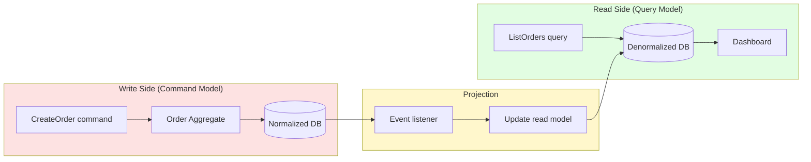
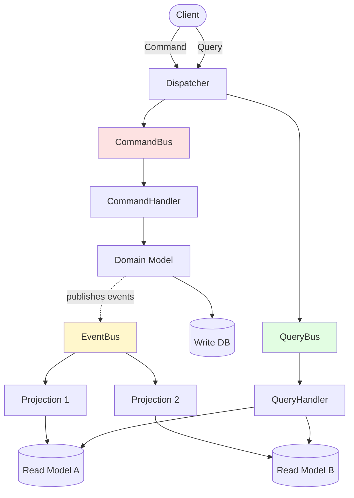
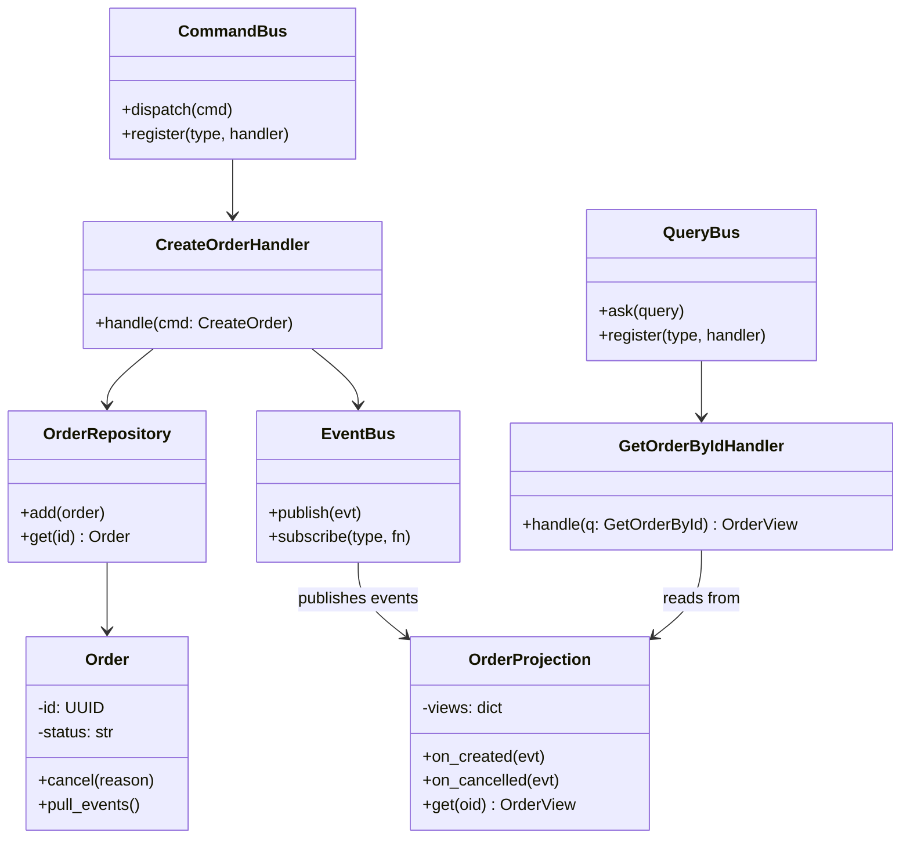
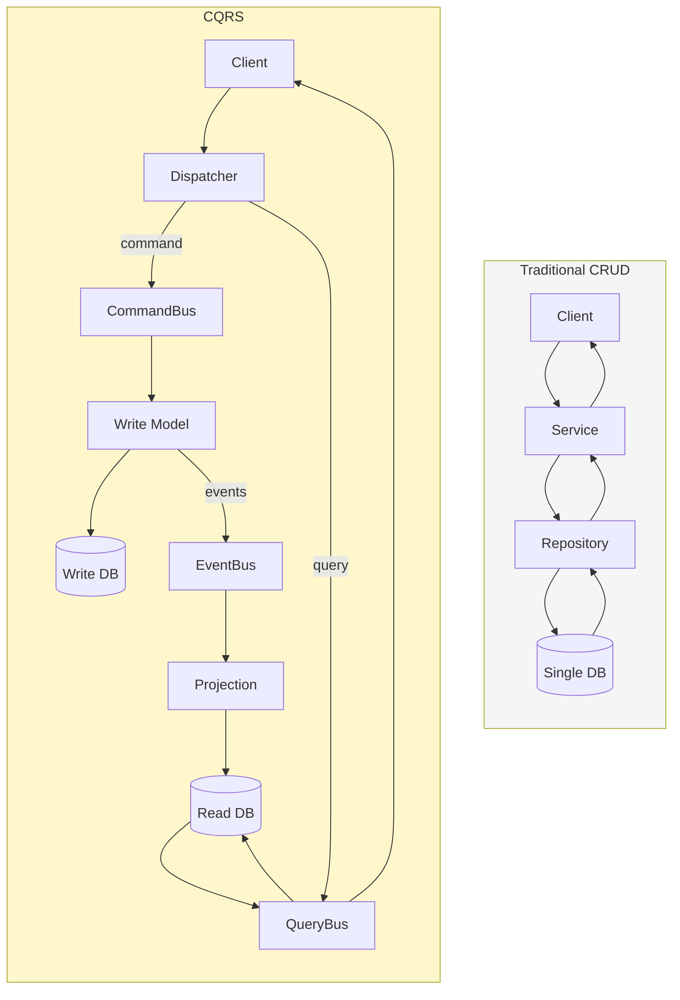
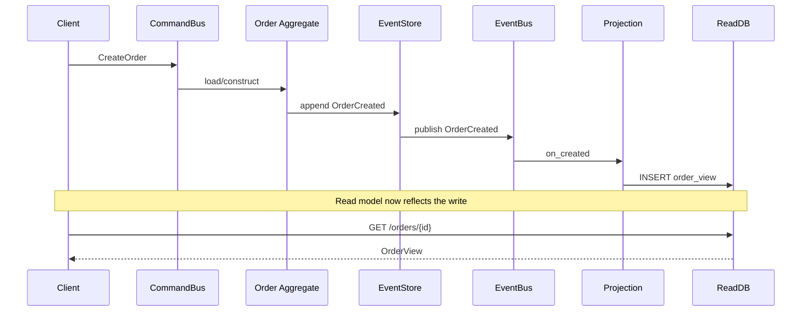

# CQRS Pattern — Command Query Responsibility Segregation

#oop #architecture #enterprise-patterns #cqrs #cqs #event-sourcing #separation-of-concerns #scalability #teaching #deep-dive

> [!quote] Greg Young, 2010
> "CQRS is not a philosophy. It is a pattern. It is a pattern that allows you to take a complex domain and split it into a model for reading and a model for writing, each of which can be optimized independently."

Most business applications spend their day doing two very different jobs: **changing state** (an order is placed, an invoice is paid, a user is registered) and **reading state** (show me my dashboard, list today's orders, fetch this customer's history). Traditional architectures force both jobs through the same model — one set of classes, one database schema, one set of SQL queries — and pay a hidden tax for it: the writes are slowed down by joins the reads need, and the reads are slowed down by normalization the writes need.

**CQRS (Command Query Responsibility Segregation)** is the architectural pattern that says: *stop forcing these two jobs through the same pipe.* Have one model for handling commands (state changes) and a *different* model for answering queries. Each model can be shaped, scaled, and optimized for what it actually does.

This note covers the origin of CQRS in Bertrand Meyer's CQS principle, the why and the how, the dangerous trap of applying it to simple CRUD apps, and the natural partnership with [[Event-Sourcing]].

Prerequisite reading: [[Single-Responsibility]], [[Repository-Pattern]], [[Domain-Driven-Design]], [[Service-Layer]].

---

## 1. The Ancestor: CQS (Command-Query Separation)

CQRS is the architectural descendant of a much older principle. In *Object-Oriented Software Construction* (1988), Bertrand Meyer proposed **Command-Query Separation (CQS)**:

> Every method should either be a **command** that performs an action (mutates state, returns nothing), or a **query** that returns data (no state mutation) — but not both.

A method like `pop()` on a stack violates CQS: it both mutates the stack (removes the top) *and* returns a value. Under CQS you would split it into `pop()` (command, returns nothing) and `top()` (query, returns the top without removing it). Some languages enshrine this culturally — Rust distinguishes `&mut self` methods from `&self` methods; C# conventionally marks commands with `void`.

### 1.1 Why CQS matters at the method level

CQS makes code predictable. When you call a query, you can call it ten thousand times in a tight loop without changing anything. When you call a command, you know the world is going to change. Methods that both read and write — `pop()`, `next()` on an iterator, `increment_and_get()` on an atomic counter — are subtle, hard to test in isolation, and a common source of bugs when called in surprising orders.

```python
# Violates CQS — both mutates and returns
class BankAccount:
    def withdraw(self, amount: float) -> float:
        self._balance -= amount
        return self._balance   # returning state we just mutated

# CQS-compliant version
class BankAccount:
    def withdraw(self, amount: float) -> None:        # command
        if amount > self._balance:
            raise InsufficientFunds(self._balance)
        self._balance -= amount

    def balance(self) -> float:                       # query
        return self._balance
```

CQRS takes this idea — *separate the things that change state from the things that answer questions* — and applies it not to a single method, but to the **entire architectural model**.

> [!info] The naming
> "CQRS" was coined by **Greg Young** around 2010. The "R" stands for *Responsibility*, not *Resource* or *Repository*. It is the responsibility for handling commands vs. answering queries that gets segregated.

---

## 2. Why CQRS: Reads and Writes Have Different Needs

In a typical business application, reads outnumber writes by 10:1, 100:1, or even 1000:1. A news site might serve a million page views per article and accept a handful of edits. A banking app shows balances thousands of times for every deposit. Yet the same domain model serves both ends.

### 2.1 Different shape, different scale

| Concern | Write side | Read side |
|---|---|---|
| Schema | Normalized, integrity-focused | Denormalized, join-free |
| Volume | Low (1× writes) | High (10×–1000× reads) |
| Latency target | Consistency, validation | Speed, availability |
| Data shape | Aggregate-oriented (one order with its lines) | Flat (a row per dashboard cell) |
| Caching | Hard (cache invalidation) | Easy (snapshot, denormalize) |
| Optimization | Indexes on lookup keys | Indexes on every filter |

Trying to make a single model excellent at both is like trying to design a vehicle that is simultaneously a racing bicycle and a moving van. Each compromise that helps one side hurts the other.

### 2.2 The dashboard example

Consider a "Sales by Region for Last 30 Days" dashboard. To produce it from a normalized schema:

```sql
SELECT r.name, SUM(ol.qty * ol.unit_price) AS total
FROM orders o
JOIN order_lines ol ON ol.order_id = o.id
JOIN customers c ON c.id = o.customer_id
JOIN regions r ON r.id = c.region_id
WHERE o.placed_at >= NOW() - INTERVAL '30 days'
GROUP BY r.name;
```

That join is cheap for the write side (it lets the schema stay clean and normalized) but expensive for the read side when 50,000 users hit the dashboard every minute. With CQRS, you maintain a **pre-computed read model**: a single `regional_sales` table, updated as events arrive, that the dashboard queries with `SELECT region, total FROM regional_sales`. The dashboard becomes a single-table scan; the write side stays normalized.



---

## 3. The Architecture at a Glance



The client talks to a dispatcher that routes to either a **command bus** (write side) or a **query bus** (read side). Commands flow through the domain model, which persists to the write database and publishes domain events. **Projections** subscribe to those events and update one or more **read models**, each shaped for a specific query. Queries hit those read models directly — bypassing the domain entirely.

> [!tip] Teaching Tip
> Draw this diagram on the board before showing any code. Students who see the picture first internalize the *shape* of CQRS; students who see the code first get lost in handler boilerplate.

---

## 4. The Command Side

A **command** is an intention — a request to change state. Commands are imperatively named: `CreateOrder`, `CancelOrder`, `AssignOrderToDriver`. They carry everything the handler needs to execute them.

```python
from dataclasses import dataclass
from typing import UUID
from datetime import datetime

@dataclass(frozen=True)
class CreateOrder:
    """Command: a customer wants to place an order."""
    order_id: UUID
    customer_id: UUID
    items: list[tuple[UUID, int]]   # (product_id, quantity)
    placed_at: datetime
```

Commands are immutable and have no behaviour — they are pure data. The behaviour lives in a **command handler**, which:

1. Loads the relevant aggregate from the repository.
2. Calls a method on the aggregate (the aggregate enforces invariants).
3. Persists the new state via the repository.
4. Publishes any resulting domain events.

```python
class CreateOrderHandler:
    def __init__(self, repo: OrderRepository, bus: EventBus):
        self._repo = repo
        self._bus = bus

    def handle(self, cmd: CreateOrder) -> None:
        # 1. Guard: idempotency
        if self._repo.has(cmd.order_id):
            return  # already created, ignore (idempotent)

        # 2. Construct the aggregate (invariants checked in __init__)
        order = Order.create(
            order_id=cmd.order_id,
            customer_id=cmd.customer_id,
            items=cmd.items,
            placed_at=cmd.placed_at,
        )

        # 3. Persist
        self._repo.add(order)

        # 4. Publish events
        for evt in order.pull_events():
            self._bus.publish(evt)
```

Notice the handler returns `None`. That is **CQS at the architectural level** — commands don't return data. If the client needs to know the new state, they issue a follow-up query (after the read model has been updated).

> [!warning] Common Student Misconception
> "If `CreateOrder` returns nothing, how does the client know it worked?" — The answer is twofold: (1) the command's success/failure is communicated via the HTTP status code (202 Accepted, 400 Bad Request, etc.), and (2) the client either subscribes to the resulting `OrderCreated` event or polls the read model. The command is *fire-and-confirm-later*, not fire-and-return.

---

## 5. The Query Side

A **query** is a request for data. Queries never modify state and never invoke the domain model. They go straight to a read-optimized store — often a separate database, a denormalized table, a search index, or a materialized view.

```python
@dataclass(frozen=True)
class GetOrderById:
    order_id: UUID

@dataclass(frozen=True)
class ListOrders:
    customer_id: UUID | None
    status: str | None
    page: int
    page_size: int


class OrderQueryHandler:
    def __init__(self, read_db: ReadDB):
        self._db = read_db

    def handle_get_order(self, q: GetOrderById) -> OrderView | None:
        row = self._db.fetch_one(
            "SELECT * FROM order_view WHERE id = %s", (q.order_id,)
        )
        return OrderView.from_row(row) if row else None

    def handle_list_orders(self, q: ListOrders) -> list[OrderView]:
        sql = "SELECT * FROM order_view WHERE 1=1"
        params: list = []
        if q.customer_id:
            sql += " AND customer_id = %s"
            params.append(q.customer_id)
        if q.status:
            sql += " AND status = %s"
            params.append(q.status)
        sql += " LIMIT %s OFFSET %s"
        params.extend([q.page_size, q.page * q.page_size])
        return [OrderView.from_row(r) for r in self._db.fetch_all(sql, params)]
```

`OrderView` is a **DTO** (Data Transfer Object) — a flat, persistence-shaped object that has no business rules. It can have whatever shape the UI wants: a `total_price` field, a `customer_name` field, even a `thumbnail_url` field. None of those need to live in the write-side domain.

> [!info] Why the read model is allowed to be "dumb"
> The read model is *purposefully* anemic. It has no methods, no invariants, no behaviour. That is not a violation of OOP principles — it is the recognition that *reading is not a domain operation*. Reading is a presentation concern, and presentation concerns belong to thin DTOs.

---

## 6. A Minimal CQRS Implementation in Python

Below is a tiny but complete CQRS pipeline. It demonstrates the dispatcher, the command bus, the query bus, and an in-memory event-driven projection that builds the read model.

```python
from __future__ import annotations
from dataclasses import dataclass
from typing import Callable, Any, Protocol
from collections import defaultdict
from uuid import UUID, uuid4
from datetime import datetime, timezone

# ---------- Events ----------
@dataclass(frozen=True)
class OrderCreated:
    order_id: UUID
    customer_id: UUID
    items: list[tuple[UUID, int]]
    total: float
    placed_at: datetime

@dataclass(frozen=True)
class OrderCancelled:
    order_id: UUID
    reason: str
    cancelled_at: datetime

# ---------- Aggregate (write model) ----------
class Order:
    def __init__(self, order_id: UUID, customer_id: UUID,
                 items: list[tuple[UUID, int]], placed_at: datetime):
        if not items:
            raise ValueError("Order must have at least one item")
        self.id = order_id
        self.customer_id = customer_id
        self._items = list(items)
        self.status = "new"
        self.placed_at = placed_at
        self._events: list[Any] = [OrderCreated(
            order_id, customer_id, list(items), self.total(), placed_at
        )]

    def total(self) -> float:
        return sum(qty for _, qty in self._items)  # simplified

    def cancel(self, reason: str) -> None:
        if self.status == "cancelled":
            return
        self.status = "cancelled"
        self._events.append(OrderCancelled(
            self.id, reason, datetime.now(timezone.utc)
        ))

    def pull_events(self) -> list[Any]:
        evts, self._events = self._events, []
        return evts

# ---------- Command & query buses ----------
class CommandBus:
    def __init__(self) -> None:
        self._handlers: dict[type, Callable[[Any], None]] = {}

    def register(self, cmd_type: type, handler: Callable[[Any], None]) -> None:
        self._handlers[cmd_type] = handler

    def dispatch(self, cmd: Any) -> None:
        handler = self._handlers.get(type(cmd))
        if handler is None:
            raise RuntimeError(f"No handler for {type(cmd).__name__}")
        handler(cmd)

class QueryBus:
    def __init__(self) -> None:
        self._handlers: dict[type, Callable[[Any], Any]] = {}

    def register(self, q_type: type, handler: Callable[[Any], Any]) -> None:
        self._handlers[q_type] = handler

    def ask(self, query: Any) -> Any:
        handler = self._handlers.get(type(query))
        if handler is None:
            raise RuntimeError(f"No handler for {type(query).__name__}")
        return handler(query)

# ---------- EventBus + Projection (read model) ----------
class EventBus:
    def __init__(self) -> None:
        self._subs: dict[type, list[Callable[[Any], None]]] = defaultdict(list)

    def subscribe(self, evt_type: type, fn: Callable[[Any], None]) -> None:
        self._subs[evt_type].append(fn)

    def publish(self, evt: Any) -> None:
        for fn in self._subs.get(type(evt), []):
            fn(evt)

@dataclass
class OrderView:
    order_id: UUID
    customer_id: UUID
    status: str
    total: float
    placed_at: datetime

class OrderProjection:
    """Listens to events and updates the read model."""
    def __init__(self) -> None:
        self._views: dict[UUID, OrderView] = {}

    def on_created(self, evt: OrderCreated) -> None:
        self._views[evt.order_id] = OrderView(
            order_id=evt.order_id,
            customer_id=evt.customer_id,
            status="new",
            total=evt.total,
            placed_at=evt.placed_at,
        )

    def on_cancelled(self, evt: OrderCancelled) -> None:
        v = self._views.get(evt.order_id)
        if v is not None:
            v.status = "cancelled"

    def get(self, oid: UUID) -> OrderView | None:
        return self._views.get(oid)

    def list_for(self, customer_id: UUID) -> list[OrderView]:
        return [v for v in self._views.values() if v.customer_id == customer_id]

# ---------- Wiring it together ----------
class CreateOrderCommand:
    def __init__(self, customer_id: UUID, items: list[tuple[UUID, int]]):
        self.order_id = uuid4()
        self.customer_id = customer_id
        self.items = items
        self.placed_at = datetime.now(timezone.utc)

class GetOrderByIdQuery:
    def __init__(self, order_id: UUID):
        self.order_id = order_id

# Setup
bus = CommandBus()
qbus = QueryBus()
events = EventBus()
projection = OrderProjection()
events.subscribe(OrderCreated, projection.on_created)
events.subscribe(OrderCancelled, projection.on_cancelled)

orders: dict[UUID, Order] = {}

def handle_create(cmd: CreateOrderCommand) -> None:
    order = Order(cmd.order_id, cmd.customer_id, cmd.items, cmd.placed_at)
    orders[cmd.order_id] = order
    for evt in order.pull_events():
        events.publish(evt)

def handle_get(q: GetOrderByIdQuery) -> OrderView | None:
    return projection.get(q.order_id)

bus.register(CreateOrderCommand, handle_create)
qbus.register(GetOrderByIdQuery, handle_get)

# Usage
cust = uuid4()
cmd = CreateOrderCommand(cust, [(uuid4(), 2), (uuid4(), 1)])
bus.dispatch(cmd)              # write side
view = qbus.ask(GetOrderByIdQuery(cmd.order_id))   # read side
print(view.status, view.total)  # 'new' 3
```

Run through it once with students: the command flows *down* through the aggregate and produces an event; the event flows *across* to the projection; the query flows *up* through the projection. Two distinct pipelines, one domain.

> [!tip] Teaching Tip
> Hand students this code in a Jupyter notebook and ask them to add a `CancelOrder` command, the `OrderCancelled` event, and a `ListCancelledOrdersForCustomer` query. The exercise forces them to walk the full CQRS path and feel the *separation* in their fingers.

---

## 7. Class Diagram of a CQRS Application



Note the **acyclic** dependency: handlers depend on the repository and the event bus, but the projection depends only on events. The read side has no knowledge of the write side's existence. This is what lets you scale them independently.

---

## 8. When to Use CQRS

CQRS adds machinery: two models, an event bus, projections, eventual consistency. That machinery is justified only when the pain it relieves is greater than the pain it introduces.

> [!success] Use CQRS when…
> - The **read/write ratio is highly skewed** (10:1 or more) and reads need to be very fast.
> - The **domain is complex** with rich business rules (see [[Domain-Driven-Design]]) — the write model needs to be clean, and polluting it with read concerns would hurt.
> - Different **stakeholders need different read shapes** (operations wants order history, finance wants revenue reports, support wants customer timelines) — each gets its own projection.
> - You need **independent scalability** (the read side runs on 20 nodes, the write side on 2).
> - You are already using **[[Event-Sourcing]]** — CQRS comes almost for free.
> - You need **temporal queries** ("what was the state at 3pm Tuesday?") that are hard on a mutable store.

> [!failure] Do NOT use CQRS when…
> - The application is **simple CRUD** (admin screens to edit a small lookup table).
> - The team is **unfamiliar with event-driven thinking** and the deadline is tight.
> - **Strong consistency on reads** is required immediately after a write — eventual consistency will frustrate users.
> - You have **one read shape** that matches the write shape — the second model is pure overhead.
> - The infrastructure to operate **two databases** with replication/projection pipelines is not available.

> [!warning] Common Student Misconception
> "CQRS means we always need two databases." — No. CQRS is about two **models**, which can live in the same database (different schemas or views) or in two different stores. Many CQRS systems start with one DB and split later when read load justifies it. The *segregation of responsibility* is what matters, not the physical topology.

---

## 9. CQRS vs. CRUD — A Comparison



| Aspect | CRUD | CQRS |
|---|---|---|
| Number of models | 1 | 2 (or more) |
| Schema | Shared | Separate, optimized per side |
| Read consistency | Strong | Eventually consistent (usually) |
| Complexity | Low | High |
| Scalability of reads | Bounded by write schema | Effectively unbounded |
| Best fit | Admin tools, simple CRUD | Complex domains, dashboards, audit-heavy systems |
| Learning curve | Shallow | Steep |

The right question to ask before adopting CQRS is: *"What does my CRUD system not let me do that I actually need to do?"* If the answer is "nothing," stay with CRUD. If the answer is "serve 50,000 dashboard hits per second" or "support six totally different report shapes," CQRS earns its keep.

---

## 10. CQRS + Event Sourcing

CQRS and [[Event-Sourcing]] (ES) are independent patterns — you can do either without the other — but they are frequently combined because they amplify each other's strengths:

- **ES without CQRS** is awkward: every read must replay the entire event history, which is slow.
- **CQRS without ES** is fine, but the write side still mutates current state, so you lose the audit log.
- **CQRS + ES** is the canonical combination: events are the source of truth, the write side appends events, projections build read models from events, and you get a complete audit log "for free."



> [!info] The "free audit log" is not actually free
> Combining CQRS + ES gives you audit *data*, but turning that data into useful audit *information* (who did what, when, and why) requires versioning, snapshotting, and a query layer. See [[Event-Sourcing]] for the full picture.

---

## 11. Eventual Consistency and the User Experience

The single biggest cultural shift when adopting CQRS is accepting **eventual consistency** on the read side. After a command succeeds, the read model might not reflect the change for several milliseconds (or seconds, on a laggy projection).

This is invisible when the command is async (e.g., "your order has been placed, we'll email you") and jarring when it is sync (e.g., user clicks "Add to cart" and the cart doesn't update for 200 ms).

Three common mitigations:

1. **Client-side optimism**: the client updates its local state immediately and trusts the projection to catch up. If the projection disagrees, reconcile.
2. **Read-your-writes consistency**: route the issuing client's next read to the write-side DB directly, falling back to the read model once the projection has caught up. (Adds coupling.)
3. **Synchronous projection for that event**: the command handler updates the read model in the same transaction. (Loses the scalability win, but only for that one read shape.)

> [!warning] Common Student Misconception
> "Eventual consistency means we'll lose data." — No. Eventual consistency means the read model *will* converge, just not instantly. Loss of data is a different problem (a durability failure) and is not implied by eventual consistency.

---

## 12. Variants of CQRS

Not every CQRS system looks the same. Three common variants:

### 12.1 Same database, two models

The simplest entry point. Both the write side and the read side talk to the same PostgreSQL database. The read side reads from materialized views or denormalized tables; the write side writes to the normalized tables. Triggers or application code keep them in sync.

**Pros**: easy to deploy, single source of truth, transactional consistency possible.
**Cons**: no independent scaling, the database becomes a shared bottleneck.

### 12.2 Separate databases, projection-driven

The write DB is the source of truth (often an append-only event store). Projections run as background workers, read events, and update the read DB (often Elasticsearch, Redis, a different RDBMS, or a denormalized schema).

**Pros**: independent scaling, read DB can be specialized (full-text search, time-series, etc.).
**Cons**: operational complexity, eventual consistency, harder to debug.

### 12.3 Event-sourced with multiple read models

Same as 12.2, but the write store is an event store and you have **many** read models — one per UI screen, one per report. Adding a new read model means adding a new projection, not changing the schema.

**Pros**: maximum flexibility; new queries don't require schema migrations.
**Cons**: highest complexity; event schema evolution becomes a real concern.

---

## 13. Testing CQRS

Testing CQRS is often *easier* than testing a CRUD system because the seams are explicit:

- **Aggregate tests**: given an event history, when a command is applied, expect a new event. Pure functions, fast, no DB.
- **Projection tests**: given an event, expect a specific row in the read model. Pure functions, fast, no DB.
- **Handler tests**: mock the repository and event bus, assert the handler calls them correctly.
- **End-to-end**: dispatch a command, wait for the projection, query the read model, assert the result.

```python
def test_creating_an_order_publishes_event():
    order = Order.create(uuid4(), uuid4(), [(uuid4(), 1)], datetime.now(timezone.utc))
    events = order.pull_events()
    assert len(events) == 1
    assert isinstance(events[0], OrderCreated)
    assert events[0].total == 1

def test_projection_updates_on_created():
    proj = OrderProjection()
    evt = OrderCreated(uuid4(), uuid4(), [], 1, datetime.now(timezone.utc))
    proj.on_created(evt)
    assert proj.get(evt.order_id).status == "new"
```

> [!tip] Teaching Tip
> Have students write the tests *first* (TDD-style). The tests force them to think about what the command should produce (an event) and what the projection should do (insert a row) — which is the entire essence of CQRS.

---

## 14. Pitfalls and Anti-Patterns

### 14.1 CQRS-everywhere disease

Teams that learn CQRS sometimes apply it to every service, including trivial CRUD admin screens. The result is massive boilerplate (command, handler, event, projection, view) for things that could be a five-line Django view. CQRS is a tool for *specific* pain; do not prescribe it universally.

### 14.2 Leaking domain logic into queries

If your query handlers start enforcing business rules ("only show orders the user is allowed to see"), you have moved authorization into the read side. Authorization belongs on the *command* side (where the state change happens); the read side should only filter by what the caller is allowed to see at the data level.

### 14.3 Synchronous projections everywhere

If every projection runs synchronously in the command handler's transaction, you have re-invented a slow CRUD system with extra steps. Reserve synchronous projection for the rare case where read-your-writes consistency is essential.

### 14.4 Forgetting idempotency

Projections will see the same event twice (retries, replays, at-least-once delivery). Every projection must be idempotent: applying the same event twice must produce the same state as applying it once.

```python
def on_created(self, evt: OrderCreated) -> None:
    if evt.order_id in self._views:
        return  # idempotent: already processed
    self._views[evt.order_id] = OrderView(...)
```

---

## 15. When the Read Side Becomes the Write Side

Sometimes a "read model" needs to be updated by user action — e.g., a denormalized `last_viewed_at` column on the dashboard. The temptation is to update the read model directly. **Don't.** Instead, issue a command (`RecordOrderViewed`) that flows through the write side, produces an event, and updates the read model via projection. This keeps the architecture honest: state changes *always* flow through the command side.

---

## 16. Summary

| Question | Answer |
|---|---|
| What is CQRS? | Separating the model that handles commands (writes) from the model that answers queries (reads). |
| Where does it come from? | Bertrand Meyer's CQS principle (1988), extended to the architecture level by Greg Young (2010). |
| When should I use it? | Complex domains, high read/write disparity, need for independent scaling, multiple read shapes. |
| When should I avoid it? | Simple CRUD apps, teams new to event-driven thinking, when strong read consistency is mandatory. |
| Does it require event sourcing? | No. The two are independent but frequently combined. |
| Does it require two databases? | No. Two *models* are required; they may share a database. |
| What's the biggest cultural shift? | Accepting eventual consistency on the read side. |

CQRS is not a silver bullet — it is a tool for a specific kind of pain. Used judiciously, it lets complex domains scale reads without sacrificing write-side clarity. Used carelessly, it turns a 200-line CRUD app into a 2000-line distributed system with the same business value.

> [!quote] Greg Young
> "If you are not forced into CQRS by the complexity of your domain, you are probably doing it wrong."

Continue with [[Event-Sourcing]] to see how the write side becomes an immutable log, and with [[Unit-Of-Work]] for transactional coordination on the command side.

---

## See Also

- [[Event-Sourcing]] — the natural companion to CQRS on the write side.
- [[Unit-Of-Work]] — coordinating atomic command execution.
- [[Repository-Pattern]] — the typical write-side persistence interface.
- [[Domain-Driven-Design]] — the source of the rich aggregates CQRS protects.
- [[Service-Layer]] — where the command bus usually lives.
- [[Single-Responsibility]] — CQRS is SRP at the architectural level.
- [[Hexagonal-Architecture]] — both patterns share the "domain at the centre" philosophy.
