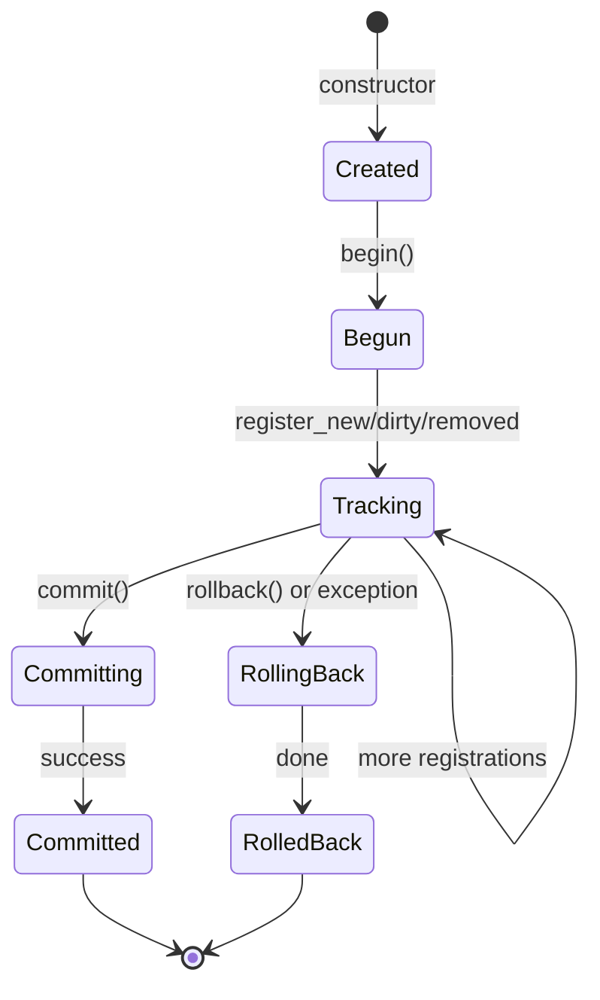
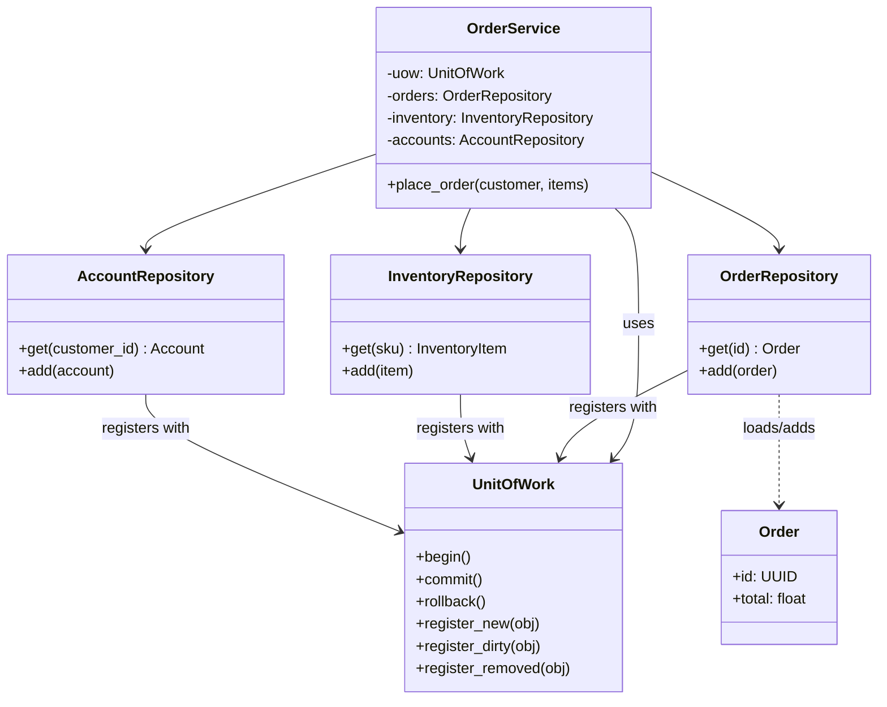
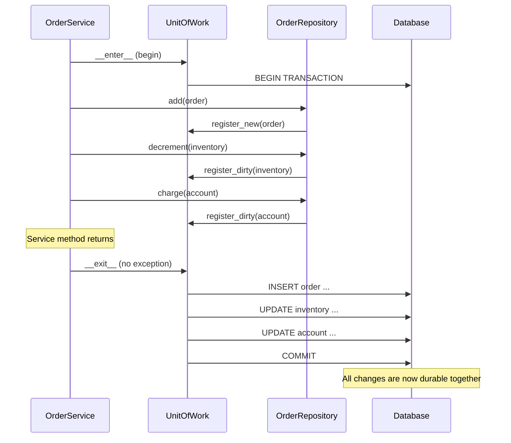
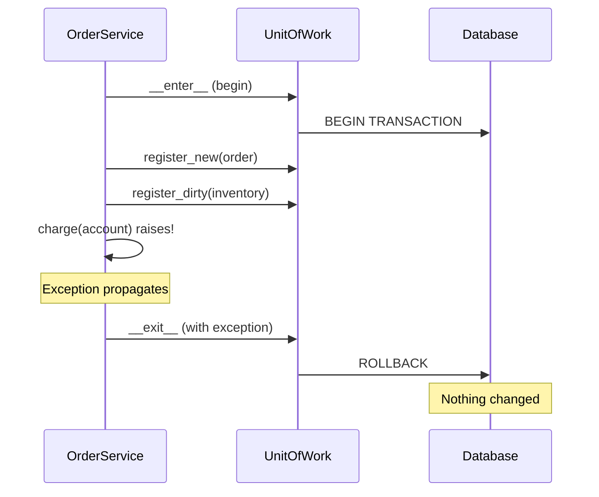
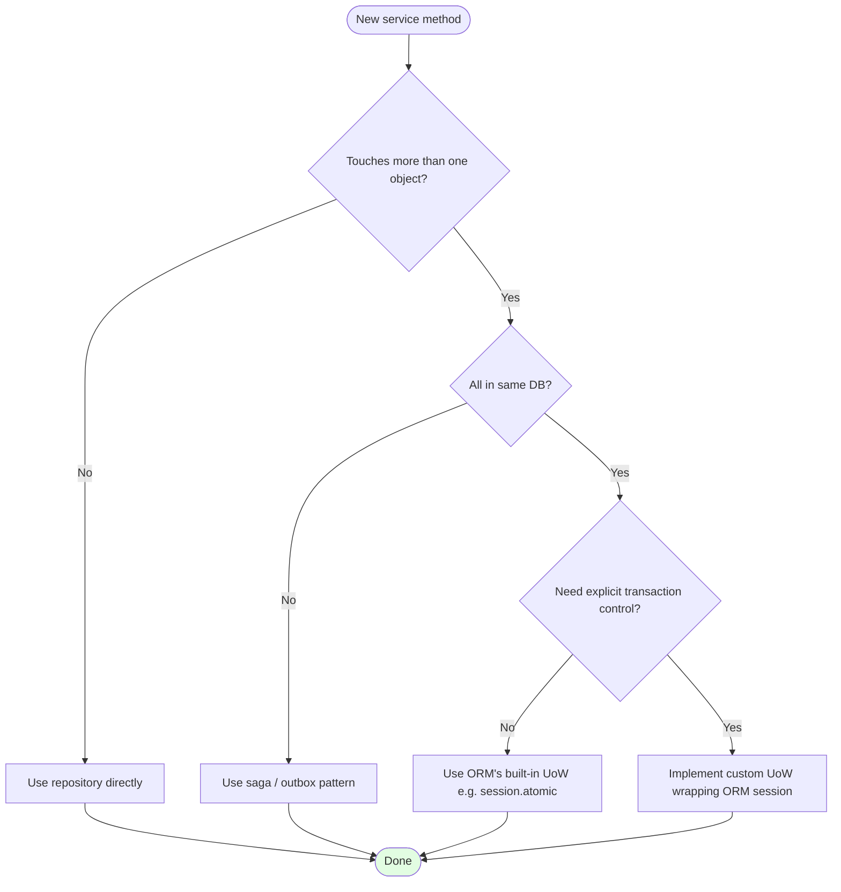

# Unit of Work — Coordinating Atomic Business Transactions

#oop #architecture #enterprise-patterns #unit-of-work #transactions #acid #repository-pattern #change-tracking #teaching #deep-dive

> [!quote] Martin Fowler, PoEAA
> "Maintains a list of objects affected by a business transaction and coordinates the writing out of changes and the resolution of concurrency problems."

Most business operations span multiple objects. Placing an order creates an `Order`, decrements `Inventory`, charges a `Customer`'s account, and writes an `AuditLog` entry. If any of these writes fails, the others must be undone — otherwise the system is in an inconsistent state (customer charged, no order; or inventory decremented, customer not charged). The classic answer to this is the database transaction: `BEGIN; … COMMIT;` and the database guarantees atomicity.

But there is a gap. The database transaction is a *persistence* concern; the business operation is a *domain* concern. If the service layer calls `orders.add(order)`, `inventory.decrement(sku, qty)`, `accounts.charge(cust, total)`, and `audit.log("order placed")` — and each of those repositories opens and commits its own database transaction — atomicity is lost. The first two might succeed, the third fails, and the system is broken.

The **Unit of Work (UoW)** pattern bridges the gap. It is an object that *knows about* all the changes happening during a business transaction and *coordinates* writing them out as one atomic batch. Either all changes commit, or none do.

This note covers the pattern, its relationship to the [[Repository-Pattern]] and the ACID properties, a from-scratch implementation, and the way modern ORMs (SQLAlchemy, Django, Hibernate) bake UoW into their sessions.

Prerequisite reading: [[Repository-Pattern]], [[Service-Layer]], [[Domain-Driven-Design]], [[Encapsulation]].

---

## 1. The Problem the Unit of Work Solves

Consider a service that places an order:

```python
class OrderService:
    def __init__(self, orders, inventory, accounts, audit):
        self._orders = orders
        self._inventory = inventory
        self._accounts = accounts
        self._audit = audit

    def place_order(self, customer, items) -> Order:
        order = Order(customer, items)
        self._orders.add(order)                  # write 1
        for sku, qty in items:
            self._inventory.decrement(sku, qty)  # write 2
        self._accounts.charge(customer, order.total())  # write 3
        self._audit.log(f"order {order.id} placed")     # write 4
        return order
```

If write 3 raises `InsufficientFunds`, writes 1 and 2 are already committed to their respective repositories. The system now has an order with no payment and inventory that has been decremented with nothing to show for it.

A naive fix wraps the whole thing in a `try/except` and undoes each write manually:

```python
def place_order(self, customer, items) -> Order:
    order = Order(customer, items)
    self._orders.add(order)
    try:
        for sku, qty in items:
            self._inventory.decrement(sku, qty)
        try:
            self._accounts.charge(customer, order.total())
            try:
                self._audit.log(f"order {order.id} placed")
            except Exception:
                # undo charge, undo inventory decrement, undo order...
                ...
        except InsufficientFunds:
            # undo inventory decrement, undo order...
            ...
    except Exception:
        # undo order...
        ...
```

This is a horror show. The cleanup code is complex, error-prone, and half of it is unreachable in tests. Worse, the same pattern repeats for every service method that touches more than one repository.

The Unit of Work pattern replaces this with: "Let one object know about every change, and let *it* coordinate the commit/rollback."

---

## 2. The Unit of Work Interface

Fowler's classic UoW exposes:

- `begin()` — start tracking changes
- `register_new(obj)` — record an object that should be inserted
- `register_dirty(obj)` — record an object that should be updated
- `register_removed(obj)` — record an object that should be deleted
- `commit()` — flush all pending changes atomically
- `rollback()` — discard all pending changes

Variants exist — some combine `begin` with construction, some use `register_clean` for objects loaded but not yet modified — but the shape is stable.

```python
from typing import Protocol, Any

class UnitOfWork(Protocol):
    def __enter__(self) -> "UnitOfWork": ...
    def __exit__(self, exc_type, exc_val, exc_tb) -> None: ...
    def register_new(self, obj: Any) -> None: ...
    def register_dirty(self, obj: Any) -> None: ...
    def register_removed(self, obj: Any) -> None: ...
    def commit(self) -> None: ...
    def rollback(self) -> None: ...
```

Used as a context manager, the UoW commits on clean exit and rolls back on exception:

```python
with uow:
    uow.register_new(order)
    uow.register_dirty(inventory_item)
    uow.register_removed(reserved_cart)
# Either all three changes are persisted, or none are.
```

> [!info] Why "Unit of Work"?
> The "unit" is the business operation. Whatever work it takes to fulfill that operation — across any number of objects — is one unit, and it succeeds or fails as a whole.

---

## 3. The Unit of Work Lifecycle



The lifecycle has five states:

1. **Created** — the UoW object exists but is not yet tracking.
2. **Begun** — `begin()` has been called; registrations are accepted.
3. **Tracking** — at least one change has been registered.
4. **Committing** — `commit()` is flushing changes to the database.
5. **Committed / RolledBack** — the UoW is done; further registrations are errors.

---

## 4. A From-Scratch Implementation

Below is a complete, in-memory Unit of Work that uses change tracking. It is intentionally simple — it doesn't talk to a real database, but it shows the shape of the pattern.

```python
from __future__ import annotations
from dataclasses import dataclass, field
from typing import Any, Callable
from uuid import UUID, uuid4

class ConcurrencyError(Exception): ...

@dataclass
class Identity:
    """Tracks which objects have been registered, by their identity."""
    _new: set[int] = field(default_factory=set)
    _dirty: set[int] = field(default_factory=set)
    _removed: set[int] = field(default_factory=set)

    def is_tracked(self, obj: Any) -> bool:
        oid = id(obj)
        return oid in self._new or oid in self._dirty or oid in self._removed


class InMemoryUnitOfWork:
    """A simple Unit of Work with in-memory change tracking."""

    def __init__(self) -> None:
        self._identity = Identity()
        self._new: list[Any] = []
        self._dirty: list[Any] = []
        self._removed: list[Any] = []
        self._began = False
        self._committed = False
        self._rolled_back = False

    # --- Context manager ---
    def __enter__(self) -> "InMemoryUnitOfWork":
        self.begin()
        return self

    def __exit__(self, exc_type, exc_val, exc_tb) -> None:
        if exc_type is not None:
            self.rollback()
        else:
            self.commit()

    # --- Lifecycle ---
    def begin(self) -> None:
        if self._began:
            raise RuntimeError("UoW already begun")
        self._began = True

    def _ensure_active(self) -> None:
        if not self._began:
            raise RuntimeError("UoW not begun")
        if self._committed or self._rolled_back:
            raise RuntimeError("UoW already finished")

    # --- Registrations ---
    def register_new(self, obj: Any) -> None:
        self._ensure_active()
        if self._identity.is_tracked(obj):
            raise RuntimeError("Object already tracked")
        self._identity._new.add(id(obj))
        self._new.append(obj)

    def register_dirty(self, obj: Any) -> None:
        self._ensure_active()
        if id(obj) in self._identity._new:
            return  # already in new list; will be inserted with new state
        if id(obj) in self._identity._dirty:
            return  # already dirty
        self._identity._dirty.add(id(obj))
        self._dirty.append(obj)

    def register_removed(self, obj: Any) -> None:
        self._ensure_active()
        if id(obj) in self._identity._new:
            # Was going to be inserted; just drop it from the new list
            self._new.remove(obj)
            self._identity._new.discard(id(obj))
            return
        if id(obj) not in self._identity._removed:
            self._identity._removed.add(id(obj))
            self._removed.append(obj)
        # If it was dirty, that's now irrelevant
        if obj in self._dirty:
            self._dirty.remove(obj)
            self._identity._dirty.discard(id(obj))

    # --- Commit / rollback ---
    def commit(self) -> None:
        self._ensure_active()
        # In a real implementation, this is a single database transaction.
        # We simulate it by writing to a shared "database" object.
        try:
            for obj in self._new:
                self._db_insert(obj)
            for obj in self._dirty:
                self._db_update(obj)
            for obj in self._removed:
                self._db_delete(obj)
            self._db_commit()
        except Exception:
            self._db_rollback()
            raise
        finally:
            self._committed = True

    def rollback(self) -> None:
        self._ensure_active()
        self._db_rollback()
        self._rolled_back = True
        self._new.clear()
        self._dirty.clear()
        self._removed.clear()

    # --- Database simulation (override in tests/subclasses) ---
    def _db_insert(self, obj: Any) -> None: ...
    def _db_update(self, obj: Any) -> None: ...
    def _db_delete(self, obj: Any) -> None: ...
    def _db_commit(self) -> None: ...
    def _db_rollback(self) -> None: ...
```

Using it:

```python
class FakeDB(InMemoryUnitOfWork):
    def __init__(self) -> None:
        super().__init__()
        self.committed = []
        self.rolled_back = False

    def _db_insert(self, obj): self.committed.append(("insert", obj))
    def _db_update(self, obj): self.committed.append(("update", obj))
    def _db_delete(self, obj): self.committed.append(("delete", obj))
    def _db_commit(self): pass
    def _db_rollback(self): self.rolled_back = True


@dataclass
class Order:
    id: UUID
    total: float


uow = FakeDB()
with uow:
    order = Order(uuid4(), 99.0)
    uow.register_new(order)
# Auto-committed on clean exit
assert uow.committed == [("insert", order)]
assert not uow.rolled_back
```

> [!warning] Common Student Misconception
> "The UoW just calls `repository.save(obj)` for each tracked object." — Not quite. The whole point is that the UoW batches writes inside *one* transaction. Calling `save()` per object — each with its own commit — defeats the purpose. The UoW's `commit()` should open one transaction, write all changes, and commit once.

---

## 5. UoW + Repository: The Common Partnership

The Unit of Work is almost always combined with the [[Repository-Pattern]]. The repository loads objects and registers them with the current UoW; the UoW tracks changes and commits them.

```python
class SqlOrderRepository:
    def __init__(self, session, uow):
        self._session = session
        self._uow = uow

    def get(self, order_id: UUID) -> Order:
        row = self._session.execute(
            "SELECT * FROM orders WHERE id = %s", (order_id,)
        ).fetchone()
        order = Order.from_row(row)
        # The UoW now tracks this object as "clean".
        # When the caller mutates it, the UoW must notice.
        return order

    def add(self, order: Order) -> None:
        self._uow.register_new(order)
```

The tricky bit is **change tracking**: how does the UoW know the caller mutated the order? Two strategies:

### 5.1 Snapshot-based tracking

The repository stores a copy of the loaded object. At commit time, the UoW compares each tracked object with its snapshot and registers dirty ones. Simple to reason about, but expensive in memory.

### 5.2 Proxy / property-based tracking

The domain object uses Python properties (or `__setattr__`) to flag itself dirty on any mutation. The repository just registers the object as "loaded"; the object tells the UoW when it changes.

```python
class TrackedModel:
    _uow: "UnitOfWork | None" = None
    _dirty_flag: bool = False

    def __setattr__(self, key, value):
        super().__setattr__(key, value)
        if key not in ("_uow", "_dirty_flag") and self._uow is not None:
            self._dirty_flag = True
            self._uow.register_dirty(self)


class Order(TrackedModel):
    def __init__(self, id, total):
        self.id = id
        self.total = total
        self._dirty_flag = False
```

> [!tip] Teaching Tip
> Have students implement snapshot tracking first — it makes the "compare two versions and emit a diff" idea concrete. Then introduce property-based tracking as an optimization. Starting with property-based tracking hides the algorithm behind Python magic.

---

## 6. Class Diagram: UoW + Repositories



The UoW is the shared dependency. Every repository takes the UoW in its constructor; every service takes both the UoW and the repositories it needs. The repositories never commit; the UoW does, once, at the end.

---

## 7. Commit / Rollback Sequence



On exception, the picture changes: `__exit__` is called with the exception, the UoW calls `ROLLBACK`, and no changes reach the database.



---

## 8. Relationship to ACID

The UoW pattern is the **application-level** embodiment of the ACID properties — the four guarantees a transactional database makes:

| ACID property | What it means | How UoW helps |
|---|---|---|
| **Atomicity** | All changes happen, or none do | UoW batches writes into one DB transaction; on error, all roll back |
| **Consistency** | The database moves from one valid state to another | UoW ensures invariants are checked before commit; nothing partial is persisted |
| **Isolation** | Concurrent transactions don't see each other's intermediate state | UoW holds a single DB connection / transaction; isolation is delegated to the DB |
| **Durability** | Committed changes survive crashes | UoW calls `COMMIT` only after all writes succeed; the DB ensures durability |

The UoW does not *implement* ACID — the database does. The UoW *enables* it by ensuring that the application groups its writes into one transaction. Without UoW, each repository would commit independently, and atomicity would be lost.

> [!info] Cross-resource atomicity
> If your business transaction spans *multiple databases* or *a database and a message broker*, a single DB transaction is not enough. You need a distributed transaction (2PC), a saga pattern, or outbox pattern. The UoW alone does not solve this — but it makes the boundary explicit, which is the first step to solving it.

---

## 9. UoW in Modern ORMs

Most production code does not write a UoW from scratch — the ORM provides one. Three examples:

### 9.1 SQLAlchemy Session

SQLAlchemy's `Session` *is* a Unit of Work. It tracks every object loaded via `session.query(...)` or `session.get(...)`, notices mutations on those objects, and writes them all out in one transaction when you call `session.commit()`.

```python
from sqlalchemy import create_engine, Column, String, Float
from sqlalchemy.orm import declarative_base, sessionmaker, Session
from contextlib import contextmanager

Base = declarative_base()

class OrderORM(Base):
    __tablename__ = "orders"
    id = Column(String, primary_key=True)
    total = Column(Float)

class InventoryItemORM(Base):
    __tablename__ = "inventory"
    sku = Column(String, primary_key=True)
    qty = Column(Float)

engine = create_engine("sqlite:///:memory:")
Base.metadata.create_all(engine)
SessionMaker = sessionmaker(bind=engine)

@contextmanager
def unit_of_work() -> Session:
    session = SessionMaker()
    try:
        yield session
        session.commit()
    except Exception:
        session.rollback()
        raise
    finally:
        session.close()

# Usage: one atomic unit of work
with unit_of_work() as session:
    order = OrderORM(id="ord-1", total=99.0)
    session.add(order)
    item = session.get(InventoryItemORM, "sku-1")
    item.qty -= 1
# Both changes committed together (or both rolled back on error)
```

The `unit_of_work` context manager is a thin wrapper that turns SQLAlchemy's session into an explicit, business-aligned scope.

### 9.2 Django's transaction.atomic

Django provides `transaction.atomic()`, which is a UoW at the database level:

```python
from django.db import transaction

def place_order(customer, items):
    with transaction.atomic():
        order = Order.objects.create(customer=customer, total=sum(...))
        for sku, qty in items:
            inv = Inventory.objects.select_for_update().get(sku=sku)
            inv.qty -= qty
            inv.save()
        customer.account.balance -= order.total
        customer.account.save()
```

Inside `atomic()`, all writes are committed together; an exception rolls them all back. Django's ORM, like SQLAlchemy, tracks dirty objects via the model's `save()` calls — though you must remember to call `save()` for changes to be persisted.

### 9.3 Hibernate's Session / EntityManager (JPA)

In Java, Hibernate's `Session` (or JPA's `EntityManager`) is a UoW:

```java
@Transactional
public void placeOrder(Customer customer, List<OrderItem> items) {
    Order order = new Order(customer, items);
    session.persist(order);
    for (OrderItem item : items) {
        Inventory inv = session.get(Inventory.class, item.getSku());
        inv.decrement(item.getQty());   // dirty; Hibernate notices
    }
    customer.getAccount().charge(order.total());
}  // @Transactional commits on clean return, rolls back on exception
```

Hibernate uses proxy-based change tracking: the loaded entities are wrapped in proxies that intercept setters and mark themselves dirty.

> [!tip] Teaching Tip
> Show students the from-scratch UoW first, then show SQLAlchemy's session and ask: "Where is `register_dirty`?" The answer — "the session tracks it automatically via the ORM's mapper" — clicks immediately once they've built one by hand.

---

## 10. Thread Safety and Concurrency

A Unit of Work is **per-request** (or per-business-transaction). It is not a singleton. Each request gets its own UoW; two concurrent requests never share one. Sharing would mix their changes and break isolation.

In a web framework, the typical pattern is:

```python
def view(request):
    with request.uow_factory() as uow:  # one UoW per request
        service = OrderService(uow, ...)
        return service.place_order(request.user, request.items)
```

The `uow_factory` is a session-scoped dependency (per-request); the UoW itself is created fresh for each call.

For optimistic concurrency, the UoW can carry a version number per aggregate. At commit time, the UoW checks that each tracked object's version still matches the database's. If not, someone else changed it first → `ConcurrencyError`, the whole unit rolls back.

---

## 11. When to Use Unit of Work

> [!success] Use UoW when…
> - A business operation **modifies multiple objects** that must be persisted atomically.
> - You are using the [[Repository-Pattern]] and want to keep repositories focused on loading/saving, not on transactions.
> - You need **explicit transaction boundaries** that match business operations, not framework boundaries.
> - You want to **unit test** service-layer code without a real database (the UoW can be a fake).

> [!failure] Do NOT use UoW when…
> - The operation touches a single object — let the repository handle it directly.
> - The persistence framework already provides a perfectly good UoW (SQLAlchemy session, Django atomic) and your wrapper adds no value.
> - The "transaction" spans multiple resources (DB + message broker) — you need a saga or outbox, not a UoW.

> [!warning] Common Student Misconception
> "If we have a UoW, we don't need repositories." — Wrong. The UoW coordinates transactions; the repository provides the collection-like interface for loading and saving aggregates. They solve different problems and are almost always used together.

---

## 12. Transaction Flowchart: Decide Whether to Use UoW



---

## 13. Testing with UoW

One of the biggest wins of UoW is testability. The UoW is a single, narrow seam: tests substitute a fake UoW that records registrations without touching a database.

```python
class FakeUoW:
    def __init__(self):
        self.new = []
        self.dirty = []
        self.removed = []
        self.committed = False
        self.rolled_back = False

    def __enter__(self): return self
    def __exit__(self, exc_type, *_):
        if exc_type: self.rolled_back = True
        else: self.committed = True

    def register_new(self, obj): self.new.append(obj)
    def register_dirty(self, obj): self.dirty.append(obj)
    def register_removed(self, obj): self.removed.append(obj)
    def commit(self): self.committed = True
    def rollback(self): self.rolled_back = True


def test_place_order_commits_atomically():
    uow = FakeUoW()
    orders = FakeOrderRepository()
    inventory = FakeInventoryRepository()
    accounts = FakeAccountRepository()
    service = OrderService(uow, orders, inventory, accounts)

    service.place_order(customer=cust, items=[("sku-1", 2)])

    assert uow.committed
    assert len(uow.new) == 1        # the new order
    assert len(uow.dirty) == 2      # inventory + account
    assert not uow.rolled_back
```

No database. No network. The test runs in microseconds and asserts the *intent* of the service — that it tracked the right changes and committed them.

---

## 14. Pitfalls and Anti-Patterns

### 14.1 The "save everywhere" anti-pattern

If repositories call `commit()` themselves (e.g., `orders.add(order); orders.commit()`), the UoW is dead. Either repositories are unaware of transactions and the UoW coordinates commits, or you don't have a UoW. Pick one.

### 14.2 The "long-running" UoW

A UoW that spans a human interaction (open at the start of a wizard, commit at the end) is a recipe for deadlocks and stale data. Keep UoW scopes short — seconds, not minutes. For long interactions, use optimistic offline locking or a saga.

### 14.3 Mixing UoW with manual SQL

If part of the service uses the UoW's repositories and part calls `db.execute("UPDATE ...")` directly, the two writes happen in different transactions and atomicity is lost. Either route everything through the UoW or accept that the manual SQL is outside the transaction.

### 14.4 Nested UoWs

A common confusion: can you nest `with uow:` blocks? The answer depends on the implementation. Some UoWs support nesting (the inner `commit` is a no-op; only the outer commits). Others treat each `with` as a separate transaction. Be explicit about which you are doing; implicit nesting is a bug factory.

### 14.5 Forgetting to register loaded objects

If your change tracking is manual (the caller must call `register_dirty`), it's easy to forget. The result: a mutation that silently doesn't get persisted. Mitigate with property-based tracking or a snapshot diff at commit time.

---

## 15. Summary

| Question | Answer |
|---|---|
| What is the Unit of Work pattern? | An object that tracks changes to multiple objects during a business transaction and commits them atomically. |
| What problem does it solve? | Atomicity across multiple object writes. |
| Where does it come from? | Martin Fowler's *Patterns of Enterprise Application Architecture* (2002). |
| Does it replace the Repository? | No — it works *with* repositories; repositories load/save, UoW commits. |
| Is the ORM session a UoW? | Yes. SQLAlchemy's `Session`, Django's `transaction.atomic`, Hibernate's `Session` are all UoW implementations. |
| When should I write my own? | Rarely. Wrap the ORM's UoW in a thin context manager and call it a day. |
| What's the testability win? | The UoW is a single seam; a fake UoW lets you test services without a DB. |

The Unit of Work is the unsung hero of enterprise OOP. It rarely appears in design pattern primers, yet every non-trivial application uses it (often via the ORM). Understanding it as a *pattern* — not just an ORM feature — gives you the vocabulary to reason about transaction boundaries, testability, and atomicity across the service layer.

> [!quote] Martin Fowler
> "The Unit of Work… acts as an in-memory collection of all the things you've done during a business transaction. When you're done, you tell it to commit, and it works out what needs to be written to the database."

Continue with [[CQRS-Pattern]] and [[Event-Sourcing]] to see how UoW coordinates the command side of those patterns, and with [[Active-Record-Vs-Data-Mapper]] for the persistence styles UoW typically wraps.

---

## See Also

- [[Repository-Pattern]] — almost always combined with UoW.
- [[CQRS-Pattern]] — the command side uses UoW for atomic writes.
- [[Event-Sourcing]] — the event store's `append` is naturally atomic, but UoW coordinates multi-aggregate writes.
- [[Domain-Driven-Design]] — aggregates define the unit of consistency that UoW protects.
- [[Service-Layer]] — where UoW is typically scoped.
- [[Active-Record-Vs-Data-Mapper]] — both ORM styles include a UoW under the hood.
