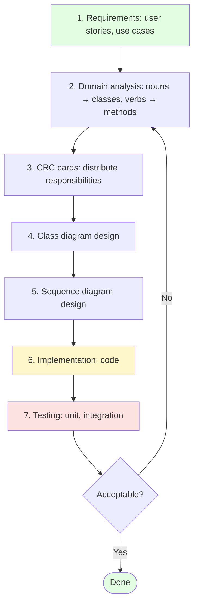
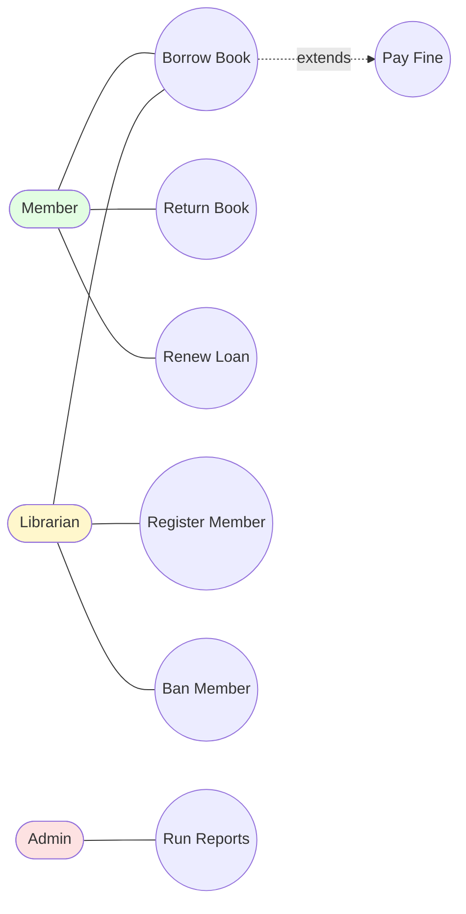
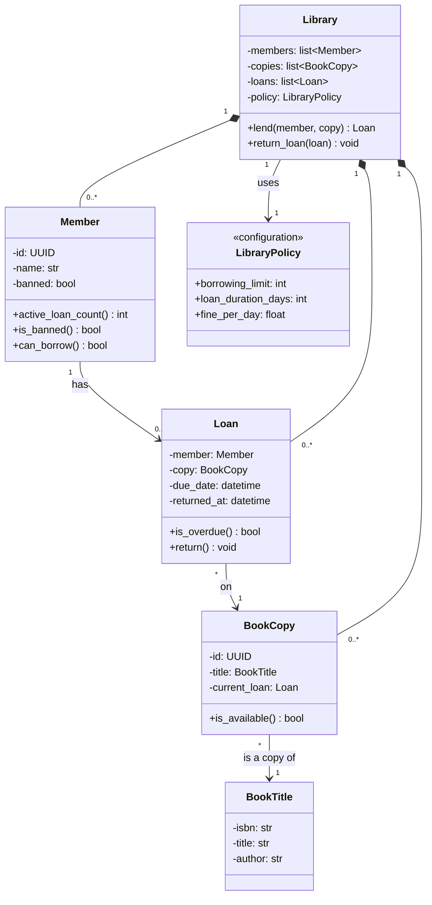
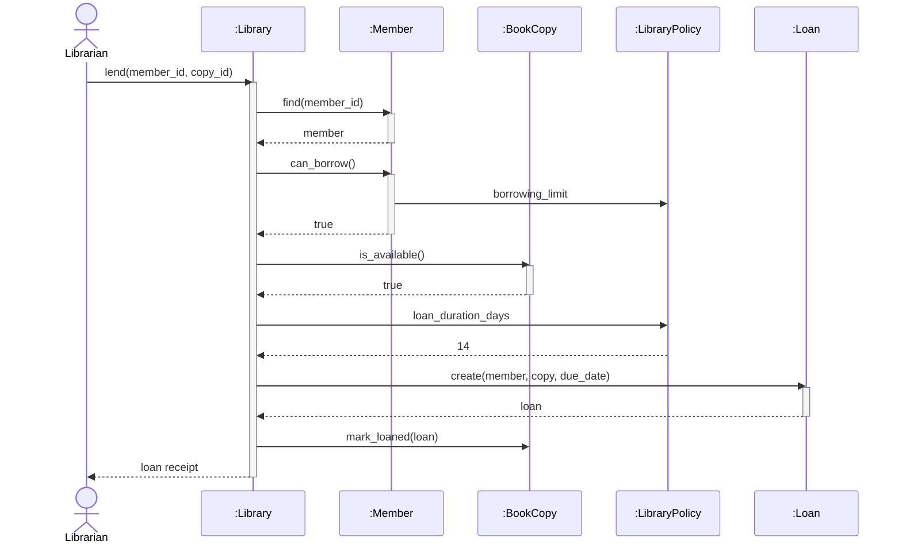
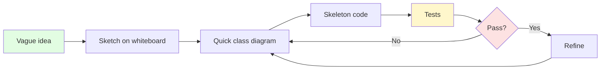
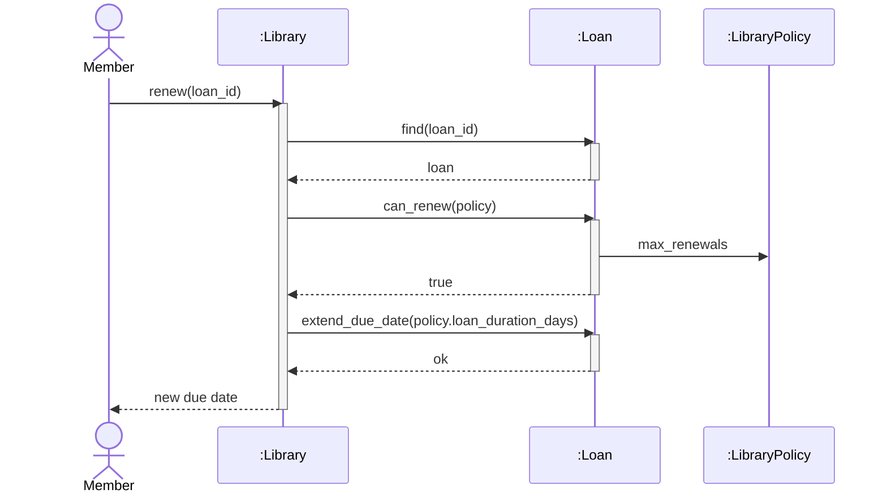

# Object-Oriented Analysis and Design — From Requirements to Code

#oop #methodology #ooad #analysis #design #modeling #crc-cards #use-cases #teaching #deep-dive

> [!quote] Grady Booch
> "Analysis is the study of a problem domain, leading to a specification of behaviour. Design is the invention of a solution that meets the specification. Object-oriented analysis and design is the discipline of doing both through the lens of objects."

Most teaching of OOP begins with syntax: classes, attributes, methods, inheritance. Students learn the *mechanics* of writing a class. But the question "what classes should I write, and why?" is barely addressed — and it is the question that actually determines whether a design is good or bad.

**Object-Oriented Analysis and Design (OOA&D)** is the discipline that answers that question. It is a *process*: starting from a vague problem statement, you arrive at a coherent set of classes with clear responsibilities and relationships. The process is iterative, sketch-heavy, and conversational. It produces [[UML-Class-Diagrams|class diagrams]], [[UML-Sequence-Diagrams|sequence diagrams]], and ultimately code.

This note covers the full OOA&D process — requirements → analysis → design → implementation → testing — with a worked example (a small library system), the noun-verb technique for finding classes and methods, the CRC card technique for distributing responsibilities, and the common mistakes that derail designs.

Prerequisite reading: [[Classes-And-Objects]], [[UML-Class-Diagrams]], [[UML-Sequence-Diagrams]], [[Single-Responsibility]], [[Encapsulation]].

---

## 1. The Three Phases: Analysis, Design, Implementation

OOA&D splits the work into three phases, each with a distinct artefact:

| Phase | Question answered | Artefact |
|---|---|---|
| **Analysis (OOA)** | What does the system need to do? | Domain model: classes in the problem domain, no decisions about technology. |
| **Design (OOD)** | How will the system do it? | Design model: classes with methods, attributes, relationships, interaction diagrams. |
| **Implementation (OOP)** | Build it. | Code. |

The phases blur in practice — design reveals analysis gaps; implementation reveals design flaws — but the distinction matters because the *questions* are different. In analysis, you ask "what is true about the world?" In design, you ask "what code should I write?" Confusing the two leads to premature design (deciding on a database before understanding the domain) or analysis paralysis (describing the domain forever without writing code).

> [!info] The blurry boundary
> Booch's famous diagram of the OOA&D process is a *spiral*: each turn visits analysis, design, implementation, and testing, with growing detail. The phases are not sequential checkpoints — they are perspectives you cycle through as your understanding deepens.

---

## 2. The OOA&D Process



The process is iterative. Each cycle of the spiral produces a more detailed model, until the model is detailed enough to code. Then code, test, and — when the test reveals a flaw — go back and refine the model. The diagram is a loop, not a line.

> [!tip] Teaching Tip
> Show students the spiral early. Many students assume "design" means "draw the diagram once, then write code forever". The spiral makes iteration visible: the diagram is *revised* after implementation reveals gaps, just as code is *revised* after testing reveals bugs. The model and the code evolve together.

---

## 3. Step 1: Requirements Gathering

The input to OOA&D is a set of **requirements**. They come in three flavours:

### 3.1 User stories (Agile)

> As a library member, I want to borrow a book so that I can read it at home.

A user story is short — one sentence, plus optional acceptance criteria. It captures *who*, *what*, and *why*. It does not capture *how* (that is design).

### 3.2 Use cases (more structured)

A **use case** is a longer description of a single interaction between an actor and the system:

> **Use case: Borrow a book**
> **Actor**: Member
> **Precondition**: Member is registered and not banned.
> **Main flow**:
> 1. Member presents their card and the book at the desk.
> 2. Librarian scans the book.
> 3. System verifies the book is available and the member has fewer than 5 active loans.
> 4. System records the loan with a due date 14 days from today.
> 5. System prints a receipt.
> **Alternative flows**:
> - 3a. Book is already loaned: system reports "not available", use case ends.
> - 3b. Member has 5 loans: system reports "limit reached", use case ends.
> - 3c. Member is banned: system reports "member banned", use case ends.

Use cases are the bridge between requirements and analysis. They are scenarios — concrete sequences — that you will later turn into sequence diagrams.

### 3.3 Use case diagrams (briefly)

A **use case diagram** is a UML diagram showing actors and use cases as ovals, with associations between them. It is a high-level overview of system scope.



(Strictly, use case diagrams use ellipses for use cases and stick figures for actors; the Mermaid approximation above is illustrative.)

> [!warning] Common Student Misconception
> "A use case is a feature." — No. A use case is a *goal* of an actor. "Login" is a feature; "Borrow a book" is a use case (login is a precondition). Conflating the two leads to over-decomposing systems into tiny use cases that no actor cares about.

---

## 4. Step 2: Domain Analysis — The Noun-Verb Technique

The simplest analysis technique is the **noun-verb** method: read the use cases, underline the nouns and verbs, and use them as candidates for classes and methods.

> Use case excerpt: "The **member** presents their **card** and the **book** at the desk. The **librarian** scans the book. The **system** verifies the book is **available** and the member has fewer than 5 active **loans**. The system records the loan with a **due date** 14 days from today."

Nouns (candidate classes): `Member`, `Card`, `Book`, `Librarian`, `System`, `Loan`, `DueDate`.

Verbs (candidate methods): `present`, `scan`, `verify`, `record`.

Now apply some filters:

- **`System`** is not a class — it's the application itself. Drop it.
- **`Librarian`** is an actor, not a domain class — unless the librarian has state in the system (e.g., a staff account), in which case it's a class. Keep for now.
- **`Card`** is a physical artefact, not a domain concept. It maps to the member's identity. Drop, or merge into `Member`.
- **`DueDate`** is a value, not a class — it's a `datetime`. Drop (or make it a value object, in DDD terms).
- **`Loan`** is the central concept. Keep.
- **`Book`** is a class. But there's a subtlety: a *book title* (e.g., "The Hobbit") vs. a *book copy* (the physical copy on the shelf). For a library, the distinction matters. Keep both: `BookTitle` and `BookCopy`.

The candidate class list after filtering:

- `Member`
- `Librarian`
- `BookTitle`
- `BookCopy`
- `Loan`

And the candidate methods, attributed to classes:

- `Member.has_active_loans_count() -> int`
- `Member.is_banned() -> bool`
- `BookCopy.is_available() -> bool`
- `Loan.create(member, copy, due_date)` (or `Library.lend(member, copy)`)

> [!tip] Teaching Tip
> Hand students a paragraph of natural-language requirements and have them underline nouns in red and verbs in blue. The exercise takes 5 minutes and reveals an enormous amount about how they read. Some students underline every noun (including "system", "the", "today"); others miss the domain-relevant ones. Both errors are teachable moments.

### 4.1 What nouns to drop

The most common analysis mistake is keeping too many nouns. Some rules of thumb:

- Drop **meta-nouns**: "system", "application", "database", "screen", "button". These are infrastructure, not domain.
- Drop **actors** unless they have state in the system. "Admin" with a username is a class; "Admin" who just clicks buttons is an actor.
- Drop **value nouns** that are primitive types: "date", "amount", "name". These are `datetime`, `Decimal`, `str`.
- Drop **physical artefacts** unless the system tracks them: "card", "receipt", "shelf".
- Drop **vague nouns**: "information", "data", "details". If you can't say what's in them, they aren't classes yet.
- Merge **synonyms**: "user", "member", "borrower" — pick one term, use it everywhere (this is [[Domain-Driven-Design|ubiquitous language]]).

---

## 5. Step 3: CRC Cards

**CRC (Class-Responsibility-Collaboration) cards** are the most underrated tool in OOA&D. They are physical index cards (or digital equivalents) with three sections:

```
+------------------------------------+
|              Member                |   ← class name
+------------------------------------+
| Responsibilities:                  |   ← what this class knows / does
|  - Know my active loans            |
|  - Know if I'm banned              |
|  - Know my borrowing limit         |
+------------------------------------+
| Collaborators:                     |   ← other classes I talk to
|  - Loan                            |
|  - LibraryPolicy                   |
+------------------------------------+
```

The genius of CRC cards is **physicality**: you can shuffle them on a table, point at them, hand them to people. A role-play session where each person holds one card and "executes" a use case by talking to the other cards is one of the most effective design activities ever invented.

### 5.1 The CRC method

1. **Identify candidate classes** (from the noun-verb technique).
2. **Write one card per class.** Don't fill in responsibilities yet.
3. **Walk through a use case.** "The member wants to borrow a book. Member card, what do you do?" The Member card-holder thinks aloud: "I need to know how many loans I have. So my responsibility is 'know my active loans'. To do that, I need to talk to Loan."
4. **Write the responsibility and collaborator as they emerge.** Add cards if new classes appear; remove cards if a class turns out to have no responsibilities.
5. **Move to the next use case.** Cards accumulate responsibilities.
6. **Review.** A card with 15 responsibilities is a god class (see [[God-Object]]); split it. A card with one trivial responsibility is probably a value object; demote it.

### 5.2 Worked CRC example

For the library system, after walking through "Borrow a book":

```
+------------------------------------+
|              Member                |
+------------------------------------+
| Responsibilities:                  |
|  - Know my active loans count      |
|  - Know my borrowing limit         |
|  - Know if I'm banned              |
+------------------------------------+
| Collaborators:                     |
|  - Loan                            |
|  - LibraryPolicy                   |
+------------------------------------+

+------------------------------------+
|              Loan                  |
+------------------------------------+
| Responsibilities:                  |
|  - Know which member and copy      |
|  - Know my due date                |
|  - Know if I'm overdue             |
+------------------------------------+
| Collaborators:                     |
|  - Member                          |
|  - BookCopy                        |
+------------------------------------+

+------------------------------------+
|            BookCopy                |
+------------------------------------+
| Responsibilities:                  |
|  - Know my title                   |
|  - Know if I'm currently loaned    |
+------------------------------------+
| Collaborators:                     |
|  - BookTitle                       |
|  - Loan                            |
+------------------------------------+

+------------------------------------+
|          LibraryPolicy             |
+------------------------------------+
| Responsibilities:                  |
|  - Define borrowing limit          |
|  - Define loan duration            |
|  - Define fine per day overdue     |
+------------------------------------+
| Collaborators: (none — pure rules) |
+------------------------------------+
```

The `LibraryPolicy` card is interesting — it emerged from the walkthrough. The Member card needed to "know my borrowing limit", but is the limit *the member's* responsibility, or is it a *policy* the library sets? The answer (it's a policy) appears only when you role-play the use case and notice that the limit can change without the member changing.

> [!tip] Teaching Tip
> Buy a stack of 4×6 index cards. Have students write CRC cards in marker (so they can't fit too much). Run a "scenario walk-through" where each student holds a card and speaks only for that class. They will discover god classes (cards with 20 responsibilities), anemic classes (cards with one trivial responsibility), and missing collaborators (cards that need to talk to classes that don't exist yet) — all in 20 minutes, without writing any code.

---

## 6. Step 4: Class Diagram Design

From the CRC cards, draw the class diagram. Each card becomes a class; each collaborator becomes a relationship; each responsibility becomes either a method (if it's a behaviour) or an attribute (if it's data the class knows).



The diagram is the *synthesis* of the CRC cards. Each card's responsibilities become methods; each collaborator becomes an arrow.

> [!info] Why a class diagram and not just CRC cards?
> CRC cards are great for *thinking* but bad for *archiving*. A pile of cards is hard to share with remote collaborators, hard to version, and hard to read after a week. The class diagram is the durable form of the same information. Use cards to design; use the diagram to remember.

---

## 7. Step 5: Sequence Diagram Design

For each use case, draw a sequence diagram showing how the classes collaborate to fulfil it. This validates the class diagram — if you can't draw the sequence diagram, the class diagram is missing something.



The sequence diagram is the executable form of the design. If the diagram makes sense — if you can read it top-to-bottom and it tells a coherent story — the design is sound. If you have to redraw it three times, the design has a problem.

> [!tip] Teaching Tip
> After students draw the class diagram, ask them to draw the sequence diagram for one use case *before* writing any code. If they can't, they don't yet understand their own design. The sequence diagram is the test that the class diagram passes.

---

## 8. Step 6: Implementation

With analysis and design in hand, implementation is mostly mechanical — a translation from the diagram to code. Each class becomes a Python class; each method becomes a method; each relationship becomes a field.

```python
from __future__ import annotations
from dataclasses import dataclass, field
from datetime import datetime, timedelta
from uuid import UUID, uuid4


@dataclass(frozen=True)
class BookTitle:
    isbn: str
    title: str
    author: str


@dataclass
class BookCopy:
    id: UUID = field(default_factory=uuid4)
    title: BookTitle = None
    current_loan: "Loan | None" = None

    def is_available(self) -> bool:
        return self.current_loan is None

    def mark_loaned(self, loan: "Loan") -> None:
        self.current_loan = loan

    def mark_returned(self) -> None:
        self.current_loan = None


@dataclass
class LibraryPolicy:
    borrowing_limit: int = 5
    loan_duration_days: int = 14
    fine_per_day: float = 0.50


@dataclass
class Member:
    id: UUID = field(default_factory=uuid4)
    name: str = ""
    banned: bool = False
    loans: list["Loan"] = field(default_factory=list)

    def active_loan_count(self) -> int:
        return sum(1 for ln in self.loans if not ln.is_returned())

    def is_banned(self) -> bool:
        return self.banned

    def can_borrow(self, policy: LibraryPolicy) -> bool:
        if self.banned:
            return False
        return self.active_loan_count() < policy.borrowing_limit


@dataclass
class Loan:
    id: UUID = field(default_factory=uuid4)
    member: Member = None
    copy: BookCopy = None
    due_date: datetime = None
    returned_at: "datetime | None" = None

    def is_returned(self) -> bool:
        return self.returned_at is not None

    def is_overdue(self, now: datetime) -> bool:
        return not self.is_returned() and now > self.due_date

    def return_book(self, now: datetime) -> None:
        self.returned_at = now
        self.copy.mark_returned()


class Library:
    def __init__(self, policy: LibraryPolicy):
        self.policy = policy
        self._members: dict[UUID, Member] = {}
        self._copies: dict[UUID, BookCopy] = {}
        self._loans: list[Loan] = []

    def register_member(self, name: str) -> Member:
        m = Member(name=name)
        self._members[m.id] = m
        return m

    def add_copy(self, title: BookTitle) -> BookCopy:
        c = BookCopy(title=title)
        self._copies[c.id] = c
        return c

    def lend(self, member_id: UUID, copy_id: UUID) -> Loan:
        member = self._members.get(member_id)
        if member is None:
            raise ValueError("Unknown member")
        copy = self._copies.get(copy_id)
        if copy is None:
            raise ValueError("Unknown copy")

        if not member.can_borrow(self.policy):
            raise ValueError("Member cannot borrow (banned or limit reached)")
        if not copy.is_available():
            raise ValueError("Copy is not available")

        due = datetime.now() + timedelta(days=self.policy.loan_duration_days)
        loan = Loan(member=member, copy=copy, due_date=due)
        member.loans.append(loan)
        copy.mark_loaned(loan)
        self._loans.append(loan)
        return loan

    def return_loan(self, loan_id: UUID) -> None:
        loan = next((l for l in self._loans if l.id == loan_id), None)
        if loan is None or loan.is_returned():
            raise ValueError("Invalid loan")
        loan.return_book(datetime.now())
```

Notice how the code mirrors the diagrams:

- Each class on the class diagram becomes a Python class.
- Each method on the class diagram becomes a Python method.
- Each relationship becomes a field (`Member.loans: list[Loan]`, `BookCopy.current_loan: Loan | None`).
- The sequence diagram's flow is mirrored in `Library.lend`: look up member, check `can_borrow`, check `is_available`, create `Loan`, mark copy loaned.

The implementation is the *least* creative step. The creativity happened in the analysis and design.

> [!info] Why the implementation is the "easy" part
> Once the diagrams are right, the code is mostly mechanical translation. This is why OOA&D matters: the decisions that determine the design's quality are made *before* any code is written. If you skip analysis and design and go straight to code, you are making those decisions anyway — just blindly, under the cover of "writing code", where they are hard to revisit.

---

## 9. Step 7: Testing

The final step closes the loop. Each use case becomes an integration test; each class method becomes a unit test.

```python
import pytest
from datetime import datetime, timedelta

def test_member_can_borrow_within_limit():
    policy = LibraryPolicy(borrowing_limit=2)
    member = Member(name="Alice")
    assert member.can_borrow(policy)
    member.loans.append(Loan())  # one active loan
    member.loans.append(Loan())  # second
    assert not member.can_borrow(policy)

def test_library_lends_available_copy():
    policy = LibraryPolicy()
    lib = Library(policy)
    member = lib.register_member("Alice")
    copy = lib.add_copy(BookTitle("isbn-1", "The Hobbit", "Tolkien"))

    loan = lib.lend(member.id, copy.id)
    assert loan.member == member
    assert loan.copy == copy
    assert not copy.is_available()
    assert member.active_loan_count() == 1

def test_cannot_lend_unavailable_copy():
    lib = Library(LibraryPolicy())
    m1 = lib.register_member("Alice")
    m2 = lib.register_member("Bob")
    copy = lib.add_copy(BookTitle("isbn-1", "Foo", "Bar"))

    lib.lend(m1.id, copy.id)
    with pytest.raises(ValueError, match="not available"):
        lib.lend(m2.id, copy.id)

def test_banned_member_cannot_borrow():
    lib = Library(LibraryPolicy())
    member = lib.register_member("Alice")
    member.banned = True
    copy = lib.add_copy(BookTitle("x", "y", "z"))
    with pytest.raises(ValueError, match="banned"):
        lib.lend(member.id, copy.id)

def test_returning_a_loan_makes_copy_available():
    lib = Library(LibraryPolicy())
    member = lib.register_member("Alice")
    copy = lib.add_copy(BookTitle("x", "y", "z"))
    loan = lib.lend(member.id, copy.id)

    loan.return_book(datetime.now())
    assert copy.is_available()
    assert member.active_loan_count() == 0
```

The tests validate the design. If a test is hard to write, the design is awkward; if a test reveals a missing behaviour, the design is incomplete. Testing is the last iteration of the spiral — and usually triggers another.

---

## 10. Common Mistakes in OOA&D

### 10.1 Over-modeling

Drawing 30 classes for a 5-class problem. Symptoms: classes with one method, classes named after database tables, classes that are really just structs. Cure: ask "if I deleted this class, what would break?" If the answer is "nothing", delete it.

### 10.2 Under-modeling

Drawing 2 classes for a 10-class problem. Symptoms: god classes (see [[God-Object]]), methods named `do_everything()`, classes with 50 attributes. Cure: apply [[Single-Responsibility]] — if a class has more than one reason to change, split it.

### 10.3 God classes

A class that does too much. The classic OOP anti-pattern. CRC cards catch god classes early — if a card has 15 responsibilities, it's a god class. See [[God-Object]].

### 10.4 Feature envy

A method that is more interested in another class than its own. The classic symptom: a `Order` method that reaches deep into `Customer` and `Customer`'s `Address` and `Address`'s `Country`. The behaviour probably belongs on `Customer` (or `Address`, or `Country`), not on `Order`. See [[Code-Smells]] and [[Law-Of-Demeter]].

### 10.5 Anemic domain models

Classes that are just bags of getters and setters, with all behaviour in services. A common failure of Data Mapper (see [[Active-Record-Vs-Data-Mapper]]). The cure is to push behaviour back onto the entity.

### 10.6 Designing for hypothetical futures

"I might need to support multiple currencies one day, so let me add a `Currency` class now." No. You don't need it yet ([[YAGNI-Principle]]). Add it when the requirement arrives; the design will be easier to refine then than to undo now.

### 10.7 Skipping analysis

Jumping straight to class design without understanding the domain. The result is a design that models the developer's mental model, not the business's. Cure: do the noun-verb exercise; talk to domain experts; write use cases before classes.

> [!warning] Common Student Misconception
> "If I write the code first and then draw the diagram, that's the same thing." — It isn't. Drawing the diagram first forces you to make decisions about classes and responsibilities *before* you have a codebase to defend. Drawing it after usually means reverse-engineering the diagram from the code, which rationalises whatever design you happened to write — including its flaws. The value of the diagram is in the *conversation it forces before code*, not in the artefact it produces after.

---

## 11. Tools for OOA&D

- **CRC cards**: physical index cards (4×6 or 5×7). Cheap, irreplaceable.
- **[[UML-Class-Diagrams|Class diagrams]]**: Mermaid (text), PlantUML (text), draw.io (graphical), Lucidchart (graphical).
- **[[UML-Sequence-Diagrams|Sequence diagrams]]**: same tools.
- **Use case diagrams**: PlantUML and most UML tools support them; Mermaid does not (use a flowchart as an approximation, as above).
- **Whiteboards**: still the best medium for collaborative design. Photograph the result and transcribe to a durable tool.

For teaching, Mermaid is the right default — students can write diagrams inline in their Obsidian notes, version them with the code, and render them anywhere Markdown renders.

---

## 12. OOA&D and Modern Methodologies

OOA&D was formalised in the 1990s (Booch, Rumbaugh, Jacobson — the "Three Amigos"). Some of its assumptions feel dated in 2024:

- **Agile** de-emphasises upfront design in favour of iterative refinement.
- **Domain-Driven Design** ([[Domain-Driven-Design|DDD]]) replaces the noun-verb technique with ubiquitous language and bounded contexts.
- **TDD** ([[TDD-With-OOP]]) makes the design emerge from tests rather than from diagrams.

But the core ideas are alive:

- **Find classes by understanding the problem**, not by guessing.
- **Distribute responsibilities deliberately**; avoid god classes.
- **Model behaviour, not just data**; resist anemia.
- **Validate designs with sequence diagrams**; if you can't draw it, the design is wrong.

Modern OOA&D is lighter: less upfront, more iterative, more integrated with code. But every experienced developer still does analysis (thinking about the problem) and design (deciding on classes) — they just do it faster, with smaller artefacts, and they revise more often.



---

## 13. From Use Case to Code — End-to-End Recap

Let's trace the journey of one feature through the full process.

**Use case**: *As a member, I want to renew a loan so that I can keep the book longer.*

1. **Analysis (nouns and verbs)**: Nouns: `Member`, `Loan`, `Library`. Verbs: `renew`. New candidate method: `Loan.renew()` or `Library.renew_loan(loan)`.

2. **CRC card update**:
   - `Loan` gains responsibility "know if renewable" and "extend due date".
   - `LibraryPolicy` gains responsibility "define max renewals".
   - `Loan` collaborates with `LibraryPolicy`.

3. **Class diagram update**: Add `Loan.renew()` method, `LibraryPolicy.max_renewals` attribute, `Loan.renewal_count` attribute.

4. **Sequence diagram**:


5. **Implementation**:
```python
@dataclass
class LibraryPolicy:
    borrowing_limit: int = 5
    loan_duration_days: int = 14
    fine_per_day: float = 0.50
    max_renewals: int = 2

@dataclass
class Loan:
    # ... existing fields ...
    renewal_count: int = 0

    def can_renew(self, policy: LibraryPolicy) -> bool:
        return (
            not self.is_returned()
            and self.renewal_count < policy.max_renewals
        )

    def extend_due_date(self, days: int) -> None:
        self.due_date += timedelta(days=days)
        self.renewal_count += 1

class Library:
    # ... existing methods ...
    def renew(self, loan_id: UUID) -> datetime:
        loan = next((l for l in self._loans if l.id == loan_id), None)
        if loan is None or loan.is_returned():
            raise ValueError("Invalid loan")
        if not loan.can_renew(self.policy):
            raise ValueError("Cannot renew (limit reached)")
        loan.extend_due_date(self.policy.loan_duration_days)
        return loan.due_date
```

6. **Tests**:
```python
def test_renew_extends_due_date():
    lib = Library(LibraryPolicy(loan_duration_days=14, max_renewals=2))
    member = lib.register_member("Alice")
    copy = lib.add_copy(BookTitle("x", "y", "z"))
    loan = lib.lend(member.id, copy.id)
    original_due = loan.due_date

    new_due = lib.renew(loan.id)
    assert new_due == original_due + timedelta(days=14)
    assert loan.renewal_count == 1

def test_renew_respects_max():
    lib = Library(LibraryPolicy(max_renewals=1))
    member = lib.register_member("Alice")
    copy = lib.add_copy(BookTitle("x", "y", "z"))
    loan = lib.lend(member.id, copy.id)
    lib.renew(loan.id)
    with pytest.raises(ValueError, match="limit reached"):
        lib.renew(loan.id)
```

This is OOA&D in miniature: a use case becomes a class diagram change, a sequence diagram, a code change, and a test. The loop takes 30 minutes; the design is solid because every step was deliberate.

---

## 14. Summary

| Question | Answer |
|---|---|
| What is OOA&D? | The discipline of finding classes, responsibilities, and collaborations from a problem statement. |
| What are the phases? | Analysis (what), Design (how), Implementation (build), Testing (verify). Iterative. |
| How do I find classes? | Noun-verb technique: nouns → candidate classes, verbs → candidate methods. Filter aggressively. |
| How do I distribute responsibilities? | CRC cards: role-play use cases, write responsibilities as they emerge. |
| How do I validate the design? | Sequence diagrams: if you can't draw it, the design is wrong. |
| What's the relationship to DDD? | DDD is the modern, deeper version of OOA — ubiquitous language, bounded contexts, aggregates. OOA&D is the foundation. |
| What are the common mistakes? | Over-modeling, under-modeling, god classes, feature envy, anemia, designing for hypothetical futures. |
| Do I still need OOA&D with Agile? | Yes — lighter, more iterative, but the analysis and design discipline remains. |

OOA&D is the *thinking* part of OOP. The syntax of classes and the patterns of design (Strategy, Repository, etc.) are tools; OOA&D is the conversation that decides which tools to use, on what, and why. A developer who knows the patterns but cannot do OOA&D will produce well-named god classes; a developer who can do OOA&D will produce simple, durable designs even with only a handful of patterns in their toolkit.

> [!quote] Grady Booch
> "The hard part of software is not the writing of code; it is the understanding of the problem you are trying to solve."

Continue with [[UML-Class-Diagrams]] and [[UML-Sequence-Diagrams]] for the notations OOA&D produces, and with [[Domain-Driven-Design]] for the modern deepening of OOA.

---

## See Also

- [[UML-Class-Diagrams]] — the structural notation OOA&D produces.
- [[UML-Sequence-Diagrams]] — the behavioural notation OOA&D produces.
- [[Classes-And-Objects]] — the Python primitives that classes represent.
- [[Domain-Driven-Design]] — the modern, deeper version of object-oriented analysis.
- [[Single-Responsibility]] — the principle that guards against god classes.
- [[God-Object]] — the anti-pattern OOA&D is designed to prevent.
- [[Code-Smells]] — including feature envy, which OOA&D surfaces.
- [[Law-Of-Demeter]] — the rule that prevents feature envy in code.
- [[YAGNI-Principle]] — the discipline of not over-modeling.
- [[TDD-With-OOP]] — a modern alternative path from requirements to design.
