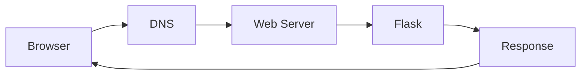

# How the Web Works

```mermaid
flowchart LR
A[Browser]-->B[DNS]
B-->C[Web Server]
C-->D[Flask]
D-->E[Response]
E-->A
```

A browser sends an HTTP request. Flask processes it and returns a response.

## Related
- [[03 HTTP]]
- [[05 DNS]]
